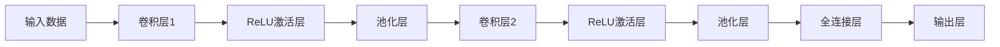

                 

# 一切皆是映射：卷积神经网络(CNNs)在图像处理中的应用

> 关键词：卷积神经网络,图像处理,特征提取,图像分类,目标检测,图像分割

## 1. 背景介绍

在现代计算机视觉领域，卷积神经网络（Convolutional Neural Networks, CNNs）已经成为图像处理和计算机视觉任务中最为有效的工具之一。自2012年AlexNet首次在ImageNet图像分类竞赛中获得胜利以来，CNNs以其强大的特征提取能力和泛化性能，迅速成为了计算机视觉研究中的焦点。本篇文章将详细探讨CNNs在图像处理中的核心原理与应用实践，从理论到实践全面剖析CNNs的优势与挑战，并为希望深入理解图像处理的读者提供一条清晰的路线图。

## 2. 核心概念与联系

### 2.1 核心概念概述

卷积神经网络（CNNs）是一种特殊的深度神经网络，特别适合于处理具有网格结构的数据，如图像。CNNs的核心思想是通过多层卷积操作和池化操作来自动提取输入数据的特征，并通过全连接层将这些特征映射到特定的输出类别上。以下是几个核心概念的简要介绍：

- **卷积操作（Convolutional Operation）**：卷积操作是CNNs的核心组件，通过滑动卷积核在输入数据上进行操作，自动提取特征。卷积核是一组可学习的参数，能够检测输入数据中的局部模式。

- **池化操作（Pooling Operation）**：池化操作用于减小特征图的尺寸，减少参数数量，并提高模型的鲁棒性。常用的池化操作包括最大池化和平均池化。

- **激活函数（Activation Function）**：激活函数用于在卷积层和全连接层之间引入非线性，常见的激活函数包括ReLU、Sigmoid等。

- **全连接层（Fully Connected Layer）**：全连接层将卷积和池化操作提取的高维特征向量映射到输出类别上，完成分类或回归等任务。

- **数据增强（Data Augmentation）**：数据增强是通过对训练集进行随机变换，扩充数据集大小，增强模型的泛化能力。

### 2.2 核心概念原理和架构的 Mermaid 流程图

以下是一个简单的卷积神经网络的Mermaid流程图，展示了CNNs的核心结构：



### 2.3 关键算法的描述

卷积神经网络的核心算法包括卷积操作、池化操作、激活函数和反向传播算法。其中，卷积操作和池化操作用于特征提取，激活函数用于引入非线性，反向传播算法用于参数更新。以下简要介绍这些核心算法的原理：

#### 2.3.1 卷积操作

卷积操作可以理解为滑动卷积核在输入数据上进行操作，提取局部特征的过程。假设输入数据为一个二维图像，卷积核为一个二维矩阵。卷积操作的计算公式如下：

$$
C_{i,j} = \sum_{m=0}^{k-1} \sum_{n=0}^{k-1} W_{m,n} I_{i+m,j+n}
$$

其中，$C_{i,j}$表示卷积层输出数据在位置$(i,j)$的值，$I_{i+m,j+n}$表示输入数据在位置$(i+m,j+n)$的值，$W_{m,n}$表示卷积核在位置$(m,n)$的值。

#### 2.3.2 池化操作

池化操作用于减小特征图的尺寸，减少参数数量，并提高模型的鲁棒性。常用的池化操作包括最大池化和平均池化。最大池化操作将每个局部区域的最大值作为输出，平均池化操作将每个局部区域的平均值作为输出。池化操作的计算公式如下：

$$
P_{i,j} = \max_{m=0}^{k-1} \max_{n=0}^{k-1} I_{i+m,j+n} \quad \text{或} \quad P_{i,j} = \frac{1}{k^2} \sum_{m=0}^{k-1} \sum_{n=0}^{k-1} I_{i+m,j+n}
$$

其中，$P_{i,j}$表示池化层输出数据在位置$(i,j)$的值，$I_{i+m,j+n}$表示输入数据在位置$(i+m,j+n)$的值。

#### 2.3.3 激活函数

激活函数用于在卷积层和全连接层之间引入非线性，常见的激活函数包括ReLU、Sigmoid等。ReLU的计算公式如下：

$$
A = \max(0, x)
$$

其中，$A$表示激活函数输出，$x$表示输入数据。

#### 2.3.4 反向传播算法

反向传播算法用于计算模型损失函数对参数的梯度，并更新模型参数。反向传播的核心思想是链式法则，通过前向传播计算预测结果，再通过后向传播计算梯度，最终更新模型参数。

## 3. 核心算法原理 & 具体操作步骤

### 3.1 算法原理概述

卷积神经网络的核心思想是通过多层卷积操作和池化操作来自动提取输入数据的特征，并通过全连接层将这些特征映射到特定的输出类别上。CNNs的核心算法包括卷积操作、池化操作、激活函数和反向传播算法。

### 3.2 算法步骤详解

卷积神经网络的训练过程可以分为两个主要步骤：前向传播和反向传播。以下是卷积神经网络训练的详细步骤：

1. **数据预处理**：将输入数据进行预处理，包括归一化、数据增强等操作。

2. **前向传播**：将预处理后的数据输入到卷积神经网络中，通过多层卷积和池化操作提取特征，并计算损失函数。

3. **反向传播**：通过计算损失函数对每个参数的梯度，使用优化器更新模型参数。

4. **重复迭代**：重复以上步骤，直到模型收敛或达到预设的迭代次数。

### 3.3 算法优缺点

#### 3.3.1 优点

- **参数共享**：卷积操作通过参数共享的方式，减少了模型的参数数量，提高了模型的泛化能力。
- **局部连接**：卷积操作通过局部连接的方式，捕捉输入数据中的局部模式，提高了模型的特征提取能力。
- **多尺度特征提取**：通过多层卷积和池化操作，卷积神经网络能够提取不同尺度的特征，提高了模型的鲁棒性。

#### 3.3.2 缺点

- **计算复杂度**：卷积神经网络的计算复杂度较高，尤其是在大型图像处理任务中。
- **过拟合**：卷积神经网络容易出现过拟合现象，尤其是在训练集较小的情况下。
- **参数调节**：卷积神经网络的超参数调节复杂，需要大量的实验和调参经验。

### 3.4 算法应用领域

卷积神经网络在图像处理领域有着广泛的应用，包括图像分类、目标检测、图像分割、人脸识别等任务。以下是几个典型的应用场景：

- **图像分类**：将输入图像分类到特定的类别中，如ImageNet竞赛中的任务。
- **目标检测**：在输入图像中检测出特定目标的位置和类别，如YOLO、Faster R-CNN等算法。
- **图像分割**：将输入图像分割成多个像素级别的区域，如语义分割、实例分割等任务。
- **人脸识别**：通过提取人脸特征，实现对人脸的识别和验证，如FaceNet、DeepFace等算法。

## 4. 数学模型和公式 & 详细讲解 & 举例说明

### 4.1 数学模型构建

卷积神经网络的数学模型可以表示为一个函数，将输入数据映射到输出类别上。假设输入数据为一个二维图像，输出为一个类别概率分布。卷积神经网络的数学模型可以表示为：

$$
P(Y|X) = \frac{e^{O(X)}}{\sum_{y} e^{O(X)}}
$$

其中，$X$表示输入图像，$Y$表示输出类别，$O(X)$表示卷积神经网络的输出。

### 4.2 公式推导过程

#### 4.2.1 卷积操作公式推导

假设输入数据为一个二维图像，卷积核为一个二维矩阵。卷积操作的计算公式如下：

$$
C_{i,j} = \sum_{m=0}^{k-1} \sum_{n=0}^{k-1} W_{m,n} I_{i+m,j+n}
$$

其中，$C_{i,j}$表示卷积层输出数据在位置$(i,j)$的值，$I_{i+m,j+n}$表示输入数据在位置$(i+m,j+n)$的值，$W_{m,n}$表示卷积核在位置$(m,n)$的值。

#### 4.2.2 池化操作公式推导

假设输入数据为一个二维图像，池化操作为一个最大池化操作。最大池化操作的计算公式如下：

$$
P_{i,j} = \max_{m=0}^{k-1} \max_{n=0}^{k-1} I_{i+m,j+n}
$$

其中，$P_{i,j}$表示池化层输出数据在位置$(i,j)$的值，$I_{i+m,j+n}$表示输入数据在位置$(i+m,j+n)$的值。

#### 4.2.3 激活函数公式推导

ReLU激活函数的计算公式如下：

$$
A = \max(0, x)
$$

其中，$A$表示激活函数输出，$x$表示输入数据。

#### 4.2.4 反向传播算法公式推导

假设模型的损失函数为$L$，输出为$O$，输入为$X$，目标为$T$。反向传播算法的计算公式如下：

$$
\frac{\partial L}{\partial O} = \frac{\partial L}{\partial Z} \frac{\partial Z}{\partial O}
$$

其中，$Z$表示模型输出，$\frac{\partial L}{\partial Z}$表示损失函数对输出$Z$的梯度，$\frac{\partial Z}{\partial O}$表示模型输出$Z$对目标$T$的梯度。

### 4.3 案例分析与讲解

#### 4.3.1 图像分类案例

假设有一个简单的卷积神经网络，包括一个卷积层、一个池化层、一个全连接层和一个输出层。对于输入图像$X$，卷积层的输出为$O_1$，池化层的输出为$O_2$，全连接层的输出为$O_3$，输出层的输出为$O_4$。假设模型的损失函数为交叉熵损失函数，目标为$T$。则反向传播算法的计算公式如下：

$$
\frac{\partial L}{\partial O_4} = \frac{\partial L}{\partial Z_4} \frac{\partial Z_4}{\partial O_3} \frac{\partial O_3}{\partial O_2} \frac{\partial O_2}{\partial O_1} \frac{\partial O_1}{\partial X}
$$

其中，$\frac{\partial L}{\partial Z_4}$表示损失函数对输出$Z_4$的梯度，$\frac{\partial Z_4}{\partial O_3}$表示输出$Z_4$对全连接层输出的梯度，$\frac{\partial O_3}{\partial O_2}$表示全连接层输出$O_3$对池化层输出的梯度，$\frac{\partial O_2}{\partial O_1}$表示池化层输出$O_2$对卷积层输出的梯度，$\frac{\partial O_1}{\partial X}$表示卷积层输出$O_1$对输入$X$的梯度。

## 5. 项目实践：代码实例和详细解释说明

### 5.1 开发环境搭建

#### 5.1.1 PyTorch环境搭建

首先，需要安装PyTorch库，可以通过以下命令进行安装：

```bash
pip install torch torchvision
```

#### 5.1.2 数据集准备

接下来，需要准备一个数据集，这里以MNIST手写数字识别为例。可以使用以下代码生成一个简单的训练集和测试集：

```python
import torch
import torchvision
from torchvision import transforms

# 数据集准备
train_dataset = torchvision.datasets.MNIST(root='./data', train=True, transform=transforms.ToTensor(), download=True)
test_dataset = torchvision.datasets.MNIST(root='./data', train=False, transform=transforms.ToTensor(), download=True)
```

### 5.2 源代码详细实现

以下是一个简单的卷积神经网络的代码实现，包括一个卷积层、一个池化层、一个全连接层和一个输出层。

```python
import torch
import torch.nn as nn
import torch.optim as optim
import torchvision

# 定义卷积神经网络
class CNN(nn.Module):
    def __init__(self):
        super(CNN, self).__init__()
        self.conv1 = nn.Conv2d(1, 32, 3)
        self.pool = nn.MaxPool2d(2)
        self.fc1 = nn.Linear(32 * 28 * 28, 128)
        self.fc2 = nn.Linear(128, 10)

    def forward(self, x):
        x = self.pool(F.relu(self.conv1(x)))
        x = x.view(-1, 32 * 28 * 28)
        x = F.relu(self.fc1(x))
        x = self.fc2(x)
        return x

# 加载数据集
train_dataset = torchvision.datasets.MNIST(root='./data', train=True, transform=transforms.ToTensor(), download=True)
test_dataset = torchvision.datasets.MNIST(root='./data', train=False, transform=transforms.ToTensor(), download=True)

# 定义模型和优化器
model = CNN()
criterion = nn.CrossEntropyLoss()
optimizer = optim.SGD(model.parameters(), lr=0.001, momentum=0.9)

# 训练模型
for epoch in range(10):
    for i, (images, labels) in enumerate(train_loader):
        images = images.reshape(-1, 28, 28)
        optimizer.zero_grad()
        outputs = model(images)
        loss = criterion(outputs, labels)
        loss.backward()
        optimizer.step()

    print('Epoch [{}/{}], Loss: {:.4f}'.format(epoch+1, 10, loss.item()))

# 测试模型
correct = 0
total = 0
with torch.no_grad():
    for images, labels in test_loader:
        images = images.reshape(-1, 28, 28)
        outputs = model(images)
        _, predicted = torch.max(outputs.data, 1)
        total += labels.size(0)
        correct += (predicted == labels).sum().item()

print('Test Accuracy of the model on the 10000 test images: {:.2f}%'.format(100 * correct / total))
```

### 5.3 代码解读与分析

#### 5.3.1 卷积层

在卷积层中，使用`nn.Conv2d`来定义卷积操作。`nn.Conv2d`的参数包括输入通道数、输出通道数和卷积核大小。

#### 5.3.2 池化层

在池化层中，使用`nn.MaxPool2d`来定义最大池化操作。`nn.MaxPool2d`的参数包括池化核大小和步长。

#### 5.3.3 全连接层

在全连接层中，使用`nn.Linear`来定义线性操作。`nn.Linear`的参数包括输入维度和输出维度。

#### 5.3.4 损失函数和优化器

在训练过程中，使用交叉熵损失函数`nn.CrossEntropyLoss`来计算损失，使用随机梯度下降优化器`optim.SGD`来更新模型参数。

#### 5.3.5 训练和测试

在训练过程中，使用`model.train()`和`model.eval()`来切换模型训练和测试模式，分别计算损失和输出。

## 6. 实际应用场景

### 6.1 图像分类

图像分类是卷积神经网络最常见的应用之一。在图像分类任务中，输入图像经过卷积层和池化层提取特征，最后通过全连接层进行分类。常用的图像分类任务包括MNIST手写数字识别、CIFAR-10图像分类、ImageNet图像分类等。

### 6.2 目标检测

目标检测任务是在图像中检测出特定的目标，并标注其位置和类别。常用的目标检测算法包括YOLO、Faster R-CNN、SSD等。这些算法通常采用多尺度特征提取和候选框候选的方法，提高了目标检测的准确率和速度。

### 6.3 图像分割

图像分割是将图像分割成多个像素级别的区域，每个像素被标记为前景或背景。常用的图像分割算法包括语义分割、实例分割、全景分割等。这些算法通常采用卷积神经网络和深度学习的方法，提高了分割的准确性和鲁棒性。

### 6.4 人脸识别

人脸识别是通过提取人脸特征，实现对人脸的识别和验证。常用的人脸识别算法包括FaceNet、DeepFace、CenterNet等。这些算法通常采用卷积神经网络和深度学习的方法，提高了人脸识别的准确性和鲁棒性。

## 7. 工具和资源推荐

### 7.1 学习资源推荐

#### 7.1.1 网络课程

- CS231n: Convolutional Neural Networks for Visual Recognition：斯坦福大学提供的计算机视觉课程，详细讲解了卷积神经网络的原理和应用。

#### 7.1.2 书籍

- 《深度学习》：Ian Goodfellow等著，全面讲解了深度学习的理论基础和实践技巧。

#### 7.1.3 博客

- PyTorch官方博客：提供了丰富的深度学习教程和实例代码。

### 7.2 开发工具推荐

#### 7.2.1 深度学习框架

- PyTorch：提供了灵活的深度学习框架，易于使用和调试。

#### 7.2.2 数据增强工具

- Albumentations：提供了丰富的数据增强操作，适用于图像分类、目标检测等任务。

#### 7.2.3 模型压缩工具

- ONNX：提供了将深度学习模型转换为ONNX格式的工具，支持多种硬件加速。

### 7.3 相关论文推荐

#### 7.3.1 经典论文

- AlexNet：2012年ImageNet图像分类竞赛中的获胜模型，标志着卷积神经网络在大规模图像分类任务上的成功。

- VGGNet：提出了一种简单的卷积神经网络架构，在图像分类和目标检测任务中表现出色。

- GoogLeNet：提出了Inception模块，提高了卷积神经网络的深度和精度。

- ResNet：提出了残差连接，解决了深度神经网络的退化问题，提高了模型的精度和鲁棒性。

## 8. 总结：未来发展趋势与挑战

### 8.1 研究成果总结

卷积神经网络作为计算机视觉领域最为有效的工具之一，已经取得了广泛的应用。其在图像分类、目标检测、图像分割等任务中表现出色，为计算机视觉技术的发展奠定了坚实的基础。

### 8.2 未来发展趋势

#### 8.2.1 更深的网络

未来的卷积神经网络将继续追求更深的网络，通过增加网络的深度来提高模型的精度和鲁棒性。

#### 8.2.2 更强的特征提取

未来的卷积神经网络将继续优化特征提取能力，通过更好的卷积核设计和网络结构，提高模型的泛化能力。

#### 8.2.3 更高效的网络

未来的卷积神经网络将继续追求更高效的网络，通过优化网络结构和硬件加速，提高模型的训练和推理速度。

#### 8.2.4 更广泛的领域

未来的卷积神经网络将继续拓展到更广泛的领域，如医学影像分析、自动驾驶等。

### 8.3 面临的挑战

#### 8.3.1 计算资源

卷积神经网络的计算复杂度较高，需要大量的计算资源和存储空间。

#### 8.3.2 过拟合

卷积神经网络容易出现过拟合现象，尤其是在训练集较小的情况下。

#### 8.3.3 可解释性

卷积神经网络通常被视为"黑盒"模型，难以解释其内部工作机制和决策逻辑。

#### 8.3.4 数据偏差

卷积神经网络容易出现数据偏差现象，需要更多的数据和更复杂的数据增强方法。

### 8.4 研究展望

未来的卷积神经网络将继续在深度、精度、效率和泛化能力等方面进行优化，同时也需要在可解释性和数据偏差等方面取得突破。通过不断地研究和技术创新，卷积神经网络必将在计算机视觉领域发挥更大的作用，推动人工智能技术的快速发展。

## 9. 附录：常见问题与解答

### 9.1 常见问题

#### 9.1.1 什么是卷积操作？

卷积操作是一种特殊的矩阵乘法操作，通过滑动卷积核在输入数据上进行操作，提取局部特征。

#### 9.1.2 卷积神经网络中为什么需要使用池化操作？

池化操作用于减小特征图的尺寸，减少参数数量，并提高模型的鲁棒性。

#### 9.1.3 卷积神经网络中的激活函数是什么？

常用的激活函数包括ReLU、Sigmoid等，用于引入非线性。

#### 9.1.4 卷积神经网络的反向传播算法是什么？

反向传播算法用于计算模型损失函数对参数的梯度，并更新模型参数。

### 9.2 解答

#### 9.2.1 卷积操作

卷积操作是一种特殊的矩阵乘法操作，通过滑动卷积核在输入数据上进行操作，提取局部特征。

#### 9.2.2 池化操作

池化操作用于减小特征图的尺寸，减少参数数量，并提高模型的鲁棒性。

#### 9.2.3 激活函数

常用的激活函数包括ReLU、Sigmoid等，用于引入非线性。

#### 9.2.4 反向传播算法

反向传播算法用于计算模型损失函数对参数的梯度，并更新模型参数。

---

作者：禅与计算机程序设计艺术 / Zen and the Art of Computer Programming

