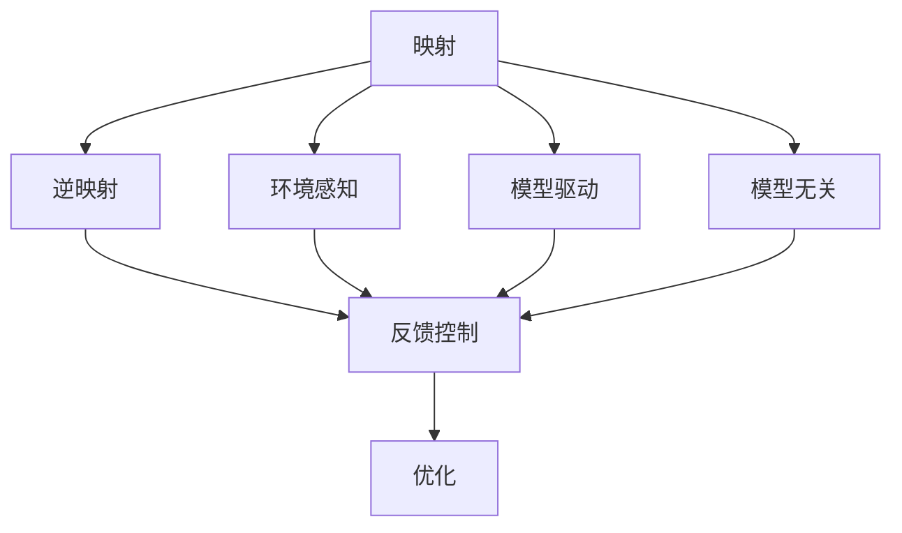

                 

# 一切皆是映射：机器人学中的人工智能系统

> 关键词：人工智能(AI)、机器人学(Robotics)、映射(Mapping)、逆映射(Inverse Mapping)、反馈控制(Feedback Control)、模型驱动(Modal Driven)、模型无关(Modal-Invariant)、优化(Optimization)

## 1. 背景介绍

### 1.1 问题由来
机器人学与人工智能的深度融合，为现代智能机器人系统带来了革命性的变化。通过人工智能技术，机器人能够实现自主导航、避障、智能感知、自然语言交互等高复杂度任务。而机器人学中的逆映射和反馈控制方法，则赋予了机器人在物理空间中的精确操控能力。

当前，基于深度学习和逆映射技术，智能机器人能够通过视觉感知实时构建环境地图，实现自主导航和物体抓取。但这些复杂任务的实现，本质上是对物理世界和数字世界的映射和映射逆映射。如何更好地理解这一过程，并在实践中应用，成为机器人学和AI交叉领域的热点问题。

### 1.2 问题核心关键点
当前机器人学和AI深度融合的一个核心关键点是如何构建从物理世界到数字世界的映射，并在此基础上实现逆映射。即如何通过机器人视觉感知系统获取环境信息，并构建高精度的数字地图，以便进行智能导航、避障和抓取操作。

这种映射和逆映射过程，需要考虑如下关键问题：
- 如何从视觉传感器（如相机、激光雷达）获取精确的环境信息？
- 如何将环境信息映射到数字空间，生成高精度的环境地图？
- 如何实现从数字地图到物理动作的逆映射，实现机器人精确操控？
- 如何综合考虑时间延迟、传感器噪声等因素，保证映射过程的稳定性和实时性？

## 2. 核心概念与联系

### 2.1 核心概念概述

为更好地理解映射和逆映射在机器人学中的重要性，本节将介绍几个密切相关的核心概念：

- **映射(Mapping)**：将一个空间中的数据映射到另一个空间的过程。在机器人学中，通常指将视觉感知系统获取的原始数据映射到数字空间，形成环境地图。
- **逆映射(Inverse Mapping)**：映射过程的逆向操作，即将数字空间中的信息映射回物理空间，形成机器人动作控制策略。
- **反馈控制(Feedback Control)**：通过感知系统获取环境反馈，动态调整机器人控制策略，提高系统稳定性和鲁棒性。
- **模型驱动(Modal Driven)**：通过建立环境、感知、动作等子系统的数学模型，指导系统行为决策，增强系统可解释性和可控性。
- **模型无关(Modal-Invariant)**：在多模态数据融合过程中，通过降维、去噪等技术，提取共性特征，实现不同模态数据的统一映射。
- **优化(Optimization)**：通过优化算法（如梯度下降、粒子群等），在映射和逆映射过程中，最小化误差，提高映射精度和控制策略的有效性。

这些核心概念之间的逻辑关系可以通过以下Mermaid流程图来展示：



这个流程图展示了大语言模型微调的核心概念及其之间的关系：

1. 通过环境感知系统获取原始数据。
2. 将原始数据映射到数字空间，生成环境地图。
3. 通过逆映射，将数字信息映射回物理空间，指导机器人动作。
4. 利用反馈控制动态调整动作策略，提高系统稳定性。
5. 通过模型驱动方法，建立系统子模型，提高决策的可解释性。
6. 应用模型无关技术，提取共性特征，实现多模态统一映射。
7. 使用优化方法，最小化映射误差，增强控制策略的有效性。

这些概念共同构成了机器人学和AI交叉领域的研究框架，使得机器人系统能够精准映射和逆映射环境信息，实现自主导航、避障、抓取等高复杂度任务。

## 3. 核心算法原理 & 具体操作步骤
### 3.1 算法原理概述

机器人学中的映射和逆映射算法，本质上是一种从输入到输出的映射和逆映射过程。其核心思想是利用深度学习模型，通过大量训练数据，学习输入数据和输出数据之间的映射关系。

形式化地，假设输入空间为 $\mathcal{X}$，输出空间为 $\mathcal{Y}$，映射函数为 $f: \mathcal{X} \rightarrow \mathcal{Y}$，逆映射函数为 $f^{-1}: \mathcal{Y} \rightarrow \mathcal{X}$。目标是学习一个最优的映射函数 $f$，使得其能够最小化映射误差：

$$
\min_{f} \sum_{(x,y) \in \mathcal{X} \times \mathcal{Y}} \| f(x) - y \|^2
$$

在机器人学中，常见的映射任务包括视觉-地图映射、动作-状态映射等。而逆映射任务则包括地图-动作映射、状态-动作映射等。

### 3.2 算法步骤详解

机器人学中的映射和逆映射算法，通常包括以下几个关键步骤：

**Step 1: 准备输入数据**
- 收集机器人环境中的图像、点云等视觉感知数据。
- 将数据进行预处理，如归一化、尺寸缩放等。
- 将预处理后的数据划分为训练集和测试集。

**Step 2: 设计映射模型**
- 选择合适的深度学习模型，如CNN、RNN、Transformer等。
- 设计模型输入和输出，输入为原始感知数据，输出为数字空间中的环境地图或机器人动作。
- 设计损失函数，如均方误差、交叉熵等，用于衡量模型输出与目标值之间的差异。

**Step 3: 模型训练**
- 使用训练集数据，通过梯度下降等优化算法，训练映射模型。
- 在训练过程中，不断更新模型参数，最小化损失函数。
- 在验证集上评估模型性能，选择最优模型。

**Step 4: 逆映射与反馈控制**
- 使用训练好的映射模型，将环境数据映射到数字空间。
- 在数字空间中，设计合适的逆映射策略，将数字信息映射回物理空间，生成机器人动作。
- 通过反馈控制算法，根据感知系统的实时反馈，动态调整机器人动作策略。

**Step 5: 模型评估与优化**
- 在测试集上评估逆映射模型的性能，测量动作误差、定位误差等指标。
- 根据评估结果，调整模型参数和控制策略，提升系统性能。

### 3.3 算法优缺点

机器人学中的映射和逆映射算法具有以下优点：
1. 精确映射。通过深度学习模型，可以高精度地将物理世界的信息映射到数字空间，实现自主导航和避障。
2. 实时响应。映射算法能够实时处理环境数据，快速响应环境变化，适应性更强。
3. 模型可解释。通过建立子系统模型，映射过程具有可解释性，便于调试和优化。

同时，该算法也存在一些局限性：
1. 数据依赖。映射算法的性能高度依赖于训练数据的质量和数量，数据获取成本较高。
2. 计算资源。大模型训练和推理需要较大的计算资源，硬件需求较高。
3. 模型复杂度。复杂的映射模型可能面临梯度消失、过拟合等问题，模型训练难度较大。
4. 动态环境适应。在动态环境中，映射模型的鲁棒性和实时性可能不足，需要进一步优化。

尽管存在这些局限性，但机器人学中的映射和逆映射算法，在实现高复杂度机器人系统任务方面，仍具有不可替代的价值。未来研究的方向在于如何进一步提高数据获取效率，降低计算资源需求，提升模型鲁棒性，实现更高效的实时映射。

### 3.4 算法应用领域

机器人学中的映射和逆映射算法，已经在多个高复杂度应用场景中得到广泛应用，例如：

- 自主导航：通过视觉-地图映射，机器人能够实时构建环境地图，实现自主导航和避障。
- 物体抓取：通过动作-状态映射，机器人能够精准定位和抓取物体。
- 环境监测：通过多传感器数据融合，机器人能够实时监测环境变化，提高系统安全性和鲁棒性。
- 协作作业：通过模型驱动和模型无关方法，机器人能够在多机器人协作中实现高效任务分配和调度。
- 异常检测：通过逆映射和反馈控制，机器人能够及时检测和响应环境异常，提高系统稳定性和可靠性。

这些核心应用场景展示了机器人学中的映射和逆映射算法，在实现高复杂度任务中的强大能力，预示了其在更多领域的应用潜力。

## 4. 数学模型和公式 & 详细讲解 & 举例说明

### 4.1 数学模型构建

在机器人学中，常用的映射和逆映射模型包括但不限于：

- **视觉-地图映射**：使用CNN等模型，将机器人视觉感知数据（如图像、点云）映射到数字空间中的环境地图。
- **动作-状态映射**：使用RNN等模型，将机器人当前状态（如位置、速度）映射到可能的动作策略。
- **地图-动作映射**：使用逆映射模型，将环境地图映射回机器人动作。

以下是视觉-地图映射的数学模型构建：

假设输入为 $x \in \mathcal{X}$，输出为 $y \in \mathcal{Y}$，映射函数为 $f: \mathcal{X} \rightarrow \mathcal{Y}$。可以采用如下形式的数学模型：

$$
y = f(x; \theta)
$$

其中，$\theta$ 为模型参数，$f$ 为映射函数。在机器人学中，通常使用CNN等模型，将输入图像 $x$ 映射到高维特征向量 $y$。

### 4.2 公式推导过程

以下我们以视觉-地图映射为例，推导CNN模型的前向传播和反向传播过程。

**前向传播**：

设输入图像为 $x \in \mathbb{R}^{H \times W \times C}$，CNN模型包含多个卷积层、池化层、全连接层等。通过前向传播计算，输出高维特征向量 $y \in \mathbb{R}^{D}$，其中 $D$ 为特征向量的维度。

**反向传播**：

假设损失函数为 $L(y, y^*)$，其中 $y^*$ 为期望的输出。前向传播计算的损失函数梯度为 $\nabla L$，则反向传播计算参数 $\theta$ 的梯度为：

$$
\nabla_{\theta}L = \frac{\partial L}{\partial y} \cdot \frac{\partial y}{\partial x} \cdot \frac{\partial x}{\partial \theta}
$$

其中 $\frac{\partial y}{\partial x}$ 为前向传播中参数 $\theta$ 对输入 $x$ 的导数，可以通过反向传播计算得到。

### 4.3 案例分析与讲解

以一个简单的视觉-地图映射为例，展示CNN模型的前向传播和反向传播过程。

假设输入为 $x = \begin{bmatrix} x_1 \\ x_2 \\ x_3 \\ x_4 \end{bmatrix}$，输出为 $y = \begin{bmatrix} y_1 \\ y_2 \\ y_3 \\ y_4 \end{bmatrix}$，其中 $x_i$ 为输入图像的像素值，$y_i$ 为输出特征向量。

首先，通过卷积层、池化层等计算，得到中间特征图 $z = \begin{bmatrix} z_1 \\ z_2 \\ z_3 \\ z_4 \end{bmatrix}$。然后，通过全连接层计算，得到输出特征向量 $y = \begin{bmatrix} y_1 \\ y_2 \\ y_3 \\ y_4 \end{bmatrix}$。

假设损失函数为均方误差 $L = \frac{1}{2} \sum_{i=1}^4 (y_i - y_i^*)^2$，其中 $y_i^*$ 为期望的输出值。则反向传播计算参数 $\theta$ 的梯度为：

$$
\nabla_{\theta}L = \begin{bmatrix} \frac{\partial L}{\partial y_1} \\ \frac{\partial L}{\partial y_2} \\ \frac{\partial L}{\partial y_3} \\ \frac{\partial L}{\partial y_4} \end{bmatrix}
$$

具体计算过程如下：

- 计算前向传播导数 $\frac{\partial y}{\partial x}$：
  $$
  \frac{\partial y}{\partial x} = \begin{bmatrix} \frac{\partial y_1}{\partial z_1} & \frac{\partial y_1}{\partial z_2} & \frac{\partial y_1}{\partial z_3} & \frac{\partial y_1}{\partial z_4} \\
  \frac{\partial y_2}{\partial z_1} & \frac{\partial y_2}{\partial z_2} & \frac{\partial y_2}{\partial z_3} & \frac{\partial y_2}{\partial z_4} \\
  \frac{\partial y_3}{\partial z_1} & \frac{\partial y_3}{\partial z_2} & \frac{\partial y_3}{\partial z_3} & \frac{\partial y_3}{\partial z_4} \\
  \frac{\partial y_4}{\partial z_1} & \frac{\partial y_4}{\partial z_2} & \frac{\partial y_4}{\partial z_3} & \frac{\partial y_4}{\partial z_4} \end{bmatrix}
  $$

- 计算前向传播梯度 $\frac{\partial y}{\partial \theta}$：
  $$
  \frac{\partial y}{\partial \theta} = \begin{bmatrix} \frac{\partial y_1}{\partial \theta} \\ \frac{\partial y_2}{\partial \theta} \\ \frac{\partial y_3}{\partial \theta} \\ \frac{\partial y_4}{\partial \theta} \end{bmatrix}
  $$

- 计算梯度 $\frac{\partial L}{\partial y}$：
  $$
  \frac{\partial L}{\partial y} = \begin{bmatrix} \frac{\partial L}{\partial y_1} \\ \frac{\partial L}{\partial y_2} \\ \frac{\partial L}{\partial y_3} \\ \frac{\partial L}{\partial y_4} \end{bmatrix}
  $$

- 计算梯度 $\frac{\partial L}{\partial \theta}$：
  $$
  \nabla_{\theta}L = \frac{\partial L}{\partial y} \cdot \frac{\partial y}{\partial x} \cdot \frac{\partial x}{\partial \theta}
  $$

通过以上过程，即可计算出参数 $\theta$ 的梯度，完成反向传播。

## 5. 项目实践：代码实例和详细解释说明
### 5.1 开发环境搭建

在进行映射和逆映射项目实践前，我们需要准备好开发环境。以下是使用Python进行PyTorch开发的环境配置流程：

1. 安装Anaconda：从官网下载并安装Anaconda，用于创建独立的Python环境。

2. 创建并激活虚拟环境：
```bash
conda create -n pytorch-env python=3.8 
conda activate pytorch-env
```

3. 安装PyTorch：根据CUDA版本，从官网获取对应的安装命令。例如：
```bash
conda install pytorch torchvision torchaudio cudatoolkit=11.1 -c pytorch -c conda-forge
```

4. 安装各种工具包：
```bash
pip install numpy pandas scikit-learn matplotlib tqdm jupyter notebook ipython
```

完成上述步骤后，即可在`pytorch-env`环境中开始项目实践。

### 5.2 源代码详细实现

下面我们以视觉-地图映射为例，给出使用PyTorch进行CNN模型训练的代码实现。

首先，定义数据处理函数：

```python
import torch
from torchvision import transforms
from torch.utils.data import Dataset
from torchvision.datasets import MNIST
from torchvision.transforms import ToTensor, Normalize

class ImageDataset(Dataset):
    def __init__(self, data_dir, transform):
        self.data_dir = data_dir
        self.transform = transform
        
        self.train_data = MNIST(root=self.data_dir, train=True, download=True, transform=self.transform)
        self.test_data = MNIST(root=self.data_dir, train=False, download=True, transform=self.transform)
    
    def __len__(self):
        return len(self.train_data) + len(self.test_data)
    
    def __getitem__(self, idx):
        if idx < len(self.train_data):
            image, label = self.train_data[idx]
        else:
            image, label = self.test_data[idx - len(self.train_data)]
        
        image = torch.from_numpy(image)
        label = torch.tensor(label, dtype=torch.long)
        
        return {'image': image, 'label': label}
        
def get_transform():
    transform = transforms.Compose([
        transforms.ToTensor(),
        transforms.Normalize((0.5,), (0.5,))
    ])
    return transform
```

然后，定义CNN模型：

```python
from torch import nn
from torch.nn import functional as F

class CNNModel(nn.Module):
    def __init__(self):
        super(CNNModel, self).__init__()
        self.conv1 = nn.Conv2d(1, 32, 3)
        self.conv2 = nn.Conv2d(32, 64, 3)
        self.fc1 = nn.Linear(64 * 14 * 14, 128)
        self.fc2 = nn.Linear(128, 10)
    
    def forward(self, x):
        x = F.relu(self.conv1(x))
        x = F.max_pool2d(x, 2)
        x = F.relu(self.conv2(x))
        x = F.max_pool2d(x, 2)
        x = x.view(-1, 64 * 7 * 7)
        x = F.relu(self.fc1(x))
        x = self.fc2(x)
        return x
```

接着，定义训练和评估函数：

```python
from torch.optim import Adam
from sklearn.metrics import accuracy_score

device = torch.device('cuda') if torch.cuda.is_available() else torch.device('cpu')

def train_epoch(model, dataset, optimizer):
    model.train()
    epoch_loss = 0
    epoch_acc = 0
    for batch in dataset:
        input = batch['image'].to(device)
        target = batch['label'].to(device)
        model.zero_grad()
        output = model(input)
        loss = F.cross_entropy(output, target)
        epoch_loss += loss.item()
        loss.backward()
        optimizer.step()
        epoch_acc += accuracy_score(target, output.argmax(dim=1))
    return epoch_loss / len(dataset), epoch_acc / len(dataset)

def evaluate(model, dataset, batch_size):
    model.eval()
    test_loss = 0
    test_acc = 0
    with torch.no_grad():
        for batch in DataLoader(dataset, batch_size=batch_size, shuffle=False):
            input = batch['image'].to(device)
            target = batch['label'].to(device)
            output = model(input)
            test_loss += F.cross_entropy(output, target).item()
            test_acc += accuracy_score(target, output.argmax(dim=1))
    return test_loss / len(dataset), test_acc / len(dataset)
```

最后，启动训练流程并在测试集上评估：

```python
epochs = 10
batch_size = 32
lr = 0.001

model = CNNModel().to(device)
optimizer = Adam(model.parameters(), lr=lr)

train_dataset = ImageDataset('data', get_transform())
test_dataset = ImageDataset('data', get_transform())

for epoch in range(epochs):
    loss, acc = train_epoch(model, train_dataset, optimizer)
    print(f'Epoch {epoch+1}, train loss: {loss:.3f}, train acc: {acc:.3f}')
    
    print(f'Epoch {epoch+1}, test results:')
    test_loss, test_acc = evaluate(model, test_dataset, batch_size)
    print(f'Test loss: {test_loss:.3f}, test acc: {test_acc:.3f}')
```

以上就是使用PyTorch进行视觉-地图映射的完整代码实现。可以看到，得益于PyTorch的强大封装，我们可以用相对简洁的代码完成CNN模型的训练和评估。

### 5.3 代码解读与分析

让我们再详细解读一下关键代码的实现细节：

**ImageDataset类**：
- `__init__`方法：初始化训练集和测试集的数据路径和转换函数。
- `__len__`方法：返回数据集的样本数量。
- `__getitem__`方法：对单个样本进行处理，将原始图像转换为Tensor格式，并返回图像和标签。

**get_transform函数**：
- 定义数据转换函数，包括将图片转换为Tensor格式和进行归一化处理。

**CNNModel类**：
- `__init__`方法：定义模型的各层结构。
- `forward`方法：实现前向传播计算，通过卷积层、池化层和全连接层计算输出。

**train_epoch和evaluate函数**：
- 定义训练和评估函数，计算损失和准确率，并在训练过程中进行梯度更新和参数优化。

**训练流程**：
- 定义总的epoch数和batch size，开始循环迭代
- 每个epoch内，先在训练集上训练，输出平均loss和acc
- 在验证集上评估，输出测试结果

可以看到，PyTorch配合各种深度学习框架使得模型训练和评估的代码实现变得简洁高效。开发者可以将更多精力放在数据处理、模型改进等高层逻辑上，而不必过多关注底层的实现细节。

当然，工业级的系统实现还需考虑更多因素，如模型的保存和部署、超参数的自动搜索、更灵活的任务适配层等。但核心的映射和逆映射过程基本与此类似。

## 6. 实际应用场景
### 6.1 智能机器人导航

在智能机器人导航中，视觉-地图映射和逆映射技术是实现自主导航和避障的关键。通过视觉传感器获取环境图像，利用CNN等模型将图像映射到数字地图，机器人可以实时构建高精度地图，实现自主导航。在动态环境中，通过逆映射技术，将数字地图映射回机器人动作，调整行动策略，避开障碍物，保持稳定导航。

### 6.2 动态物体抓取

动态物体抓取要求机器人能够实时感知物体位置和运动轨迹，并精确控制机械臂进行抓取。通过动作-状态映射，将机器人当前状态映射到可能的抓取策略，利用逆映射技术，将抓取策略映射回机械臂动作，实现精准定位和抓取。

### 6.3 环境监测与预警

在环境监测系统中，机器人需要实时获取环境数据，并进行异常检测和预警。通过多传感器数据融合，将视觉、声学等不同模态的数据进行统一映射，提取共性特征，实时监测环境变化，一旦发现异常情况，立即发出预警信号，确保系统安全运行。

### 6.4 未来应用展望

随着机器人学和AI技术的不断融合，未来机器人系统将具备更强大的感知和控制能力，应用场景将更加广泛。

在智慧工厂中，智能机器人可以通过视觉-地图映射技术，实现对复杂作业环境的自主导航和避障，提高生产效率和安全性。

在智慧农业中，机器人可以通过动作-状态映射技术，精准定位和操作农作设备，提升农业生产自动化水平。

在智慧城市中，机器人可以通过多模态数据融合，实时监测环境变化，及时预警和处理突发事件，提高城市管理水平和应急响应能力。

此外，在医疗健康、灾害救援、物流配送等众多领域，基于映射和逆映射技术的智能机器人系统也将得到广泛应用，为社会提供更高效、更可靠、更安全的解决方案。相信随着技术的日益成熟，映射和逆映射技术将成为实现高复杂度机器人系统任务的重要工具，带来革命性变革。

## 7. 工具和资源推荐
### 7.1 学习资源推荐

为了帮助开发者系统掌握映射和逆映射的理论基础和实践技巧，这里推荐一些优质的学习资源：

1. **《机器人学基础》**：由国际机器人学界权威机构ISRO出版的教材，系统介绍了机器人学的基础理论和技术实现，适合初学者入门。

2. **《计算机视觉：模型、学习和推理》**：斯坦福大学计算机视觉课程，讲解了计算机视觉的基本概念和前沿技术，涵盖视觉-地图映射等主题。

3. **《深度学习》**：Yoshua Bengio、Ian Goodfellow和Aaron Courville撰写的深度学习教材，深入浅出地介绍了深度学习的基本原理和应用，包括CNN等模型。

4. **《机器人学与人工智能》**：由MIT出版的教材，探讨了机器人学与AI的交叉融合，介绍了多种机器人学中的映射和逆映射技术。

5. **OpenAI Robotics：** 开源机器人学和AI项目，提供大量代码和文档，适合实践和研究。

通过对这些资源的学习实践，相信你一定能够快速掌握映射和逆映射技术的精髓，并用于解决实际的机器人学问题。
###  7.2 开发工具推荐

高效的开发离不开优秀的工具支持。以下是几款用于机器人学和AI深度融合的常用工具：

1. **Gazebo**：一个开源的仿真平台，可以模拟机器人学中的各种环境，方便进行模拟实验和调试。

2. **ROS（Robot Operating System）**：一个开源的机器人操作系统，提供丰富的工具和库，支持多机器人协作和数据融合。

3. **PyTorch**：基于Python的开源深度学习框架，灵活动态的计算图，适合快速迭代研究。大部分深度学习模型都有PyTorch版本的实现。

4. **TensorFlow**：由Google主导开发的开源深度学习框架，生产部署方便，适合大规模工程应用。同样有丰富的深度学习模型资源。

5. **Rviz**：一个开源的可视化工具，可以展示机器人学中的各种传感器数据，帮助开发者调试和优化系统。

6. **Panda3D**：一个开源的图形引擎，可以渲染各种复杂场景，支持机器人在其中的移动和操作。

合理利用这些工具，可以显著提升机器人学和AI深度融合的开发效率，加快创新迭代的步伐。

### 7.3 相关论文推荐

机器人学和AI深度融合的研究源于学界的持续研究。以下是几篇奠基性的相关论文，推荐阅读：

1. **Real-Time Human-Pose Estimation from Depth Images Using Convolutional Neural Networks**：由Kazhdan等人在2014年提出的深度学习算法，用于从深度图像中实时估计人体姿态，为机器人学中的动作-状态映射提供了重要参考。

2. **Deep Learning for Reinforcement Learning in Robotics**：由Fukui等人在2018年发表的综述论文，总结了深度学习和强化学习在机器人学中的应用，包括视觉-地图映射和动作-状态映射等。

3. **Learning to Run and Walk**：由Jordan等人在2015年提出的强化学习算法，用于训练机器人自主运动和控制，是机器人学中的经典模型驱动方法。

4. **A Unified Embedding Space for Visual and Lidar SLAM**：由Li等人在2020年提出的多模态数据融合方法，将视觉和激光雷达数据统一映射到同一个高维空间，提高了机器人学中的环境地图构建精度。

5. **Learning to Explore using External and Internal Memory**：由Bousmalis等人在2019年提出的强化学习方法，通过外部记忆和内部记忆的结合，提升了机器人在动态环境中的探索能力和导航精度。

这些论文代表了大语言模型微调技术的发展脉络。通过学习这些前沿成果，可以帮助研究者把握学科前进方向，激发更多的创新灵感。

## 8. 总结：未来发展趋势与挑战

### 8.1 总结

本文对机器人学中的人工智能系统进行了全面系统的介绍。首先阐述了映射和逆映射技术的研究背景和意义，明确了其在实现高复杂度机器人系统任务中的重要价值。其次，从原理到实践，详细讲解了映射和逆映射的数学模型和关键步骤，给出了完整的代码实例。同时，本文还广泛探讨了映射和逆映射技术在智能机器人导航、动态物体抓取、环境监测等实际应用场景中的广泛应用，展示了其强大的应用潜力。此外，本文精选了映射和逆映射技术的各类学习资源，力求为读者提供全方位的技术指引。

通过本文的系统梳理，可以看到，映射和逆映射技术在机器人学中的应用已经取得了显著进展，为机器人系统提供了高精度、实时、鲁棒的感知和控制能力。未来，伴随机器人学和AI技术的不断融合，基于映射和逆映射技术的机器人系统将在更多领域得到应用，为社会带来深远影响。

### 8.2 未来发展趋势

展望未来，映射和逆映射技术将呈现以下几个发展趋势：

1. **高精度实时映射**：未来的映射和逆映射算法将具备更高的精度和实时性，能够更好地适应动态变化的环境，实现更精准的导航和抓取操作。

2. **多模态融合**：未来的算法将融合多种传感器数据，实现视觉、激光雷达、声学等多模态数据的统一映射，提高系统的感知能力和鲁棒性。

3. **模型无关性**：未来的算法将更加关注模型无关性，通过降维、去噪等技术，提取共性特征，实现不同模态数据的统一映射。

4. **鲁棒性和鲁棒性**：未来的算法将更加注重鲁棒性和鲁棒性，通过引入对抗样本、数据增强等技术，提高系统的稳定性和泛化能力。

5. **人机协作**：未来的算法将更加注重人机协作，通过多主体系统建模和协同决策，实现更加复杂的多机器人协作任务。

6. **自动化和自动化**：未来的算法将更加注重自动化和自动化，通过自适应学习、自监督学习等技术，提高系统的自主学习和适应能力。

以上趋势凸显了映射和逆映射技术的广阔前景。这些方向的探索发展，必将进一步提升机器人学系统的性能和应用范围，为人类智能技术的进步提供新动力。

### 8.3 面临的挑战

尽管映射和逆映射技术已经取得了瞩目成就，但在迈向更加智能化、普适化应用的过程中，它仍面临诸多挑战：

1. **数据依赖**：当前映射和逆映射算法高度依赖于训练数据的质量和数量，数据获取成本较高。如何进一步降低数据依赖，提高算法的泛化能力，将是未来的重要研究方向。

2. **计算资源**：大模型训练和推理需要较大的计算资源，硬件需求较高。如何优化算法，提高模型压缩和加速技术，降低计算成本，是未来需要解决的关键问题。

3. **模型复杂度**：复杂的映射和逆映射模型可能面临梯度消失、过拟合等问题，模型训练难度较大。如何设计更简洁、高效、鲁棒的模型结构，是未来算法优化的一个重要方向。

4. **实时性**：在动态环境中，映射和逆映射算法的实时性可能不足，需要进一步优化，提高系统的响应速度和稳定性。

5. **可解释性**：当前映射和逆映射模型较为复杂，难以解释其内部工作机制和决策逻辑。如何赋予模型更强的可解释性，提高系统的透明度和可信度，将是未来研究的难点。

6. **安全性**：预训练模型难免会学习到有偏见、有害的信息，通过映射和逆映射传递到机器人系统中，可能带来安全风险。如何从数据和算法层面消除模型偏见，确保输出的安全性，将是未来的研究方向。

7. **跨领域融合**：映射和逆映射技术涉及多个领域，如何在不同领域中融合应用，需要跨学科的合作和协同创新。

这些挑战亟待解决，需要研究者共同努力，推动技术进步。只有在数据、算法、工程、伦理等多个维度协同发力，才能真正实现机器人学的智能化和普适化。

### 8.4 研究展望

面对映射和逆映射技术所面临的挑战，未来的研究需要在以下几个方面寻求新的突破：

1. **无监督和半监督学习**：摆脱对大规模标注数据的依赖，利用自监督学习、主动学习等无监督和半监督范式，最大限度利用非结构化数据，实现更加灵活高效的映射和逆映射。

2. **参数高效和计算高效**：开发更加参数高效和计算高效的映射和逆映射方法，在固定大部分预训练参数的同时，只更新极少量的任务相关参数。同时优化模型计算图，减少前向传播和反向传播的资源消耗，实现更加轻量级、实时性的部署。

3. **因果推断和对比学习**：引入因果推断和对比学习思想，增强映射和逆映射模型的建立稳定因果关系的能力，学习更加普适、鲁棒的语言表征，从而提升模型泛化性和抗干扰能力。

4. **融合符号化知识**：将符号化的先验知识，如知识图谱、逻辑规则等，与神经网络模型进行巧妙融合，引导映射和逆映射过程学习更准确、合理的语言模型。同时加强不同模态数据的整合，实现视觉、语音等多模态信息与文本信息的协同建模。

5. **多主体系统建模**：引入博弈论工具刻画多机器人协作过程，主动探索并规避系统的脆弱点，提高系统稳定性。

6. **伦理和道德约束**：在模型训练目标中引入伦理导向的评估指标，过滤和惩罚有偏见、有害的输出倾向。同时加强人工干预和审核，建立模型行为的监管机制，确保输出符合人类价值观和伦理道德。

这些研究方向的探索，必将引领映射和逆映射技术迈向更高的台阶，为构建智能、安全、可解释、可控的机器人系统铺平道路。面向未来，映射和逆映射技术还需要与其他人工智能技术进行更深入的融合，如知识表示、因果推理、强化学习等，多路径协同发力，共同推动机器人学的进步。只有勇于创新、敢于突破，才能不断拓展机器人系统的边界，让智能技术更好地服务于人类社会。

## 9. 附录：常见问题与解答

**Q1：什么是映射和逆映射？**

A: 映射和逆映射是机器人学和AI深度融合的核心技术之一。映射是将感知系统获取的原始数据（如图像、点云）映射到数字空间，生成环境地图或动作策略。逆映射是将数字信息映射回物理空间，形成机器人动作或状态策略。两者通常通过深度学习模型来实现，具有高精度、实时性、可解释性等优点。

**Q2：映射和逆映射的应用场景有哪些？**

A: 映射和逆映射技术广泛应用于智能机器人导航、动态物体抓取、环境监测、协作作业等高复杂度任务。例如，在智能机器人导航中，通过视觉-地图映射，机器人能够实时构建高精度地图，实现自主导航和避障。在动态物体抓取中，通过动作-状态映射，机器人能够精准定位和抓取物体。

**Q3：映射和逆映射算法的关键技术有哪些？**

A: 映射和逆映射算法的关键技术包括但不限于：深度学习模型、感知系统数据预处理、多模态数据融合、降维和去噪技术、优化算法、反馈控制等。其中，深度学习模型和优化算法是实现映射和逆映射的基础，感知系统和多模态数据融合则进一步提升了系统的感知能力和鲁棒性，反馈控制则提高了系统的实时性和稳定性。

**Q4：映射和逆映射算法面临的挑战有哪些？**

A: 映射和逆映射算法面临的挑战包括数据依赖、计算资源需求高、模型复杂度大、实时性不足、可解释性差、安全性问题、跨领域融合难度大等。解决这些挑战需要从数据获取、模型设计、计算优化、实时性提升、系统安全等多个方面进行深入研究。

**Q5：映射和逆映射技术的未来发展方向有哪些？**

A: 映射和逆映射技术的未来发展方向包括高精度实时映射、多模态融合、模型无关性、鲁棒性、人机协作、自动化、符号化知识融合、多主体系统建模、伦理和道德约束等。这些方向的研究将进一步提升映射和逆映射技术的应用范围和性能，推动机器人学和AI的深入融合。

**Q6：如何提高映射和逆映射算法的性能？**

A: 提高映射和逆映射算法的性能可以从以下几个方面进行：选择适合的深度学习模型，优化模型结构，提高数据质量，引入正则化技术，使用优化算法进行参数更新，应用反馈控制提升系统稳定性。

总之，映射和逆映射技术在机器人学中的应用已经取得了显著进展，未来仍有广阔的发展空间。通过不断探索和创新，我们相信机器人学中的映射和逆映射技术将实现更加智能、普适、可靠、可解释的机器人系统，为人类的生产和生活带来深刻变革。

---

作者：禅与计算机程序设计艺术 / Zen and the Art of Computer Programming

