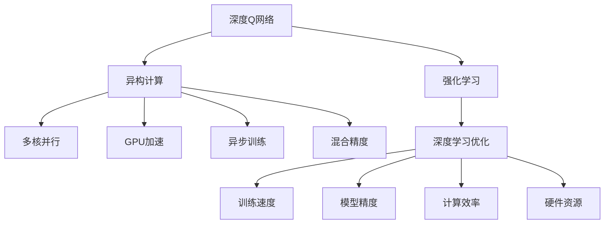

                 

# 一切皆是映射：深度Q网络DQN的异构计算优化实践

> 关键词：深度Q网络(DQN), 强化学习, 异构计算, 多核并行, GPU加速, 异步训练, 混合精度, 深度学习优化

## 1. 背景介绍

### 1.1 问题由来

深度强化学习(Depth Reinforcement Learning)是当前人工智能(AI)领域最前沿的研究方向之一，其核心思想是通过深度神经网络逼近最优策略，实现环境与行为之间的智能映射。这一领域最早的研究可以追溯到1993年，那时Watkins和Hannan提出了基于Q-learning的深度Q网络(DQN)模型，大大推动了强化学习领域的发展。

DQN结合了深度学习和强化学习的优点，能够在复杂环境中自主学习最优策略，并应用到如游戏AI、机器人控制、自动驾驶等多个实际应用场景中。然而，深度学习模型计算量大、硬件资源需求高，成为了制约DQN应用推广的一大障碍。为了提高训练效率，异构计算等新型计算架构的引入显得尤为重要。

### 1.2 问题核心关键点

DQN通过神经网络逼近Q函数，并采用强化学习算法(如Q-learning)，最大化长期累计回报。但DQN的计算复杂度与神经网络规模正相关，训练过程中大量计算任务需要高效的硬件支持。如何通过异构计算优化DQN，缩短训练时间，提高模型的精度和鲁棒性，是当前研究的热点和难点。

本文聚焦于DQN在异构计算环境下的优化实践，介绍DQN的基本原理和数学模型，进而阐述异构计算的实现方法，并对具体应用场景和未来方向进行讨论。

## 2. 核心概念与联系

### 2.1 核心概念概述

为更好地理解DQN在异构计算环境下的优化实践，本节将介绍几个密切相关的核心概念：

- **深度Q网络(DQN)**：一种基于神经网络逼近Q函数的强化学习模型。通过Q-learning算法更新Q函数，最大化长期累计回报。

- **强化学习**：一种通过试错来学习最优策略的机器学习方法，核心在于智能体与环境的互动。

- **异构计算**：通过结合不同计算资源（如CPU、GPU、FPGA等），以提高数据处理和计算的效率。

- **多核并行**：将任务划分为多个子任务，利用多核CPU并行执行，提高计算效率。

- **GPU加速**：通过引入图形处理器(GPU)，利用其并行计算能力加速深度学习模型的训练和推理。

- **异步训练**：采用多线程异步执行训练任务，避免等待，提升训练速度。

- **混合精度**：使用浮点型和整型数据混合计算，以降低计算量和内存消耗，同时不损失精度。

- **深度学习优化**：通过各种算法优化神经网络结构，提高训练速度和模型精度。

这些核心概念之间的逻辑关系可以通过以下Mermaid流程图来展示：



这个流程图展示了DQN的计算架构及其优化方法：

1. DQN通过神经网络逼近Q函数，结合强化学习算法优化。
2. 异构计算通过结合不同硬件资源，提高DQN训练和推理效率。
3. 多核并行和GPU加速，通过利用硬件并行能力，减少计算时间。
4. 异步训练通过多线程并发执行，减少等待时间。
5. 混合精度通过降低数据类型，减少内存占用和计算时间。
6. 深度学习优化通过算法优化，提升模型性能。

这些概念共同构成了DQN的计算优化框架，使其能够在各种环境下发挥最优的性能。通过理解这些核心概念，我们可以更好地把握DQN的计算优化方向。

## 3. 核心算法原理 & 具体操作步骤

### 3.1 算法原理概述

DQN的核心思想是通过神经网络逼近Q函数，并采用Q-learning算法更新Q函数，最大化长期累计回报。其基本框架包括：

- 观察环境，输入状态$s_t$到神经网络，得到Q值估计$\hat{Q}(s_t,a_t)$。
- 选择行动$a_t$，最大化Q值，即$a_t = \arg\max_{a} \hat{Q}(s_t,a)$。
- 执行行动$a_t$，观察下一状态$s_{t+1}$和奖励$r_{t+1}$。
- 更新目标Q值$Q_{s_{t+1},a_{t+1}}$，即$Q_{s_{t+1},a_{t+1}} = r_{t+1} + \gamma \max_{a} Q_{s_{t+1},a}$。
- 更新Q函数参数，最小化损失函数$\mathcal{L}(\theta)$。

其中，$\theta$为神经网络参数，$\gamma$为折扣因子，$\max_{a} Q_{s_{t+1},a}$为动作值函数$Q(s_{t+1},a)$的最大值，即下一个状态下的最优Q值。

### 3.2 算法步骤详解

DQN的训练过程一般包括以下几个关键步骤：

**Step 1: 环境设置与模型加载**

- 设置环境：定义游戏规则、初始状态等。
- 加载模型：初始化神经网络，加载预训练模型或随机初始化。

**Step 2: 经验回放与数据预处理**

- 经验回放：将当前状态、行动、奖励、下一状态进行缓存，构建经验回放池。
- 数据预处理：对回放池中的数据进行预处理，如归一化、截断等。

**Step 3: 神经网络训练**

- 前向传播：输入状态$s_t$，输出Q值估计$\hat{Q}(s_t,a_t)$。
- 选择行动：根据Q值估计选择行动$a_t$。
- 后向传播：计算Q函数参数$\theta$的梯度，更新模型参数。

**Step 4: 模型评估与参数更新**

- 评估模型：评估当前模型在环境中的表现，如胜率、回报等。
- 更新参数：根据评估结果，调整学习率和模型结构等参数，提高模型性能。

**Step 5: 策略输出与结果展示**

- 策略输出：将模型应用于新环境，输出行动策略。
- 结果展示：统计训练结果，如胜率、回合数、累计回报等。

以上是DQN的基本训练流程，实际应用中还需要针对具体任务进行调整和优化。

### 3.3 算法优缺点

DQN在理论上具备强大的优化能力，但在实际应用中也存在一些局限：

**优点：**
- 高效逼近Q函数：通过深度神经网络逼近Q函数，在复杂环境中学习最优策略。
- 泛化能力强：在训练过程中不断优化Q函数，适应环境变化。
- 可扩展性好：通过异构计算、多核并行等技术，提高训练效率。

**缺点：**
- 模型复杂度高：神经网络结构复杂，训练时间长。
- 稳定性较差：易受参数随机性和环境干扰影响。
- 计算资源需求高：需要大量的计算资源，硬件要求较高。

尽管存在这些局限，DQN在实际应用中已经取得了显著的成功，并在游戏AI、机器人控制等多个领域展示了强大的潜力。

### 3.4 算法应用领域

DQN在以下领域得到了广泛应用：

- **游戏AI**：如AlphaGo、AlphaStar等，通过DQN训练智能体，实现游戏中的最优决策。
- **机器人控制**：如Walker2D、PPOBot等，训练机器人动作策略，完成复杂环境下的任务。
- **自动驾驶**：如CARL、DPPO等，训练车辆的导航策略，实现自主驾驶。
- **能源管理**：如智能电网控制、风力发电优化等，通过DQN优化能源资源分配，提高能源效率。
- **金融交易**：如自动交易策略、风险管理等，通过DQN优化投资决策，降低风险，增加收益。

这些应用场景展示了DQN的强大适应性和广泛潜力，随着技术不断发展，相信DQN将会在更多领域得到应用，推动人工智能技术的发展。

## 4. 数学模型和公式 & 详细讲解 & 举例说明

### 4.1 数学模型构建

DQN的训练目标是通过最小化损失函数$\mathcal{L}(\theta)$来逼近Q函数，其中$\theta$为神经网络参数。损失函数$\mathcal{L}(\theta)$可表示为：

$$
\mathcal{L}(\theta) = \mathbb{E}_{s_t,a_t,r_{t+1},s_{t+1}}\left[\left(Q_{s_t,a_t}(s_t,a_t) - \hat{Q}(s_t,a_t)\right)^2\right]
$$

其中，$Q_{s_t,a_t}(s_t,a_t)$为目标Q值，$\hat{Q}(s_t,a_t)$为神经网络输出的Q值估计。

### 4.2 公式推导过程

下面以DQN在训练集上更新模型参数为例，推导具体的损失函数形式。

假设当前状态为$s_t$，行动为$a_t$，奖励为$r_{t+1}$，下一状态为$s_{t+1}$。根据DQN的训练流程，神经网络输出的Q值估计为$\hat{Q}(s_t,a_t)$，目标Q值为$Q_{s_{t+1},a_{t+1}} = r_{t+1} + \gamma \max_{a} Q_{s_{t+1},a}$。

则损失函数$\mathcal{L}(\theta)$可表示为：

$$
\mathcal{L}(\theta) = \frac{1}{N} \sum_{i=1}^N \left(Q_{s_t,a_t}(s_t,a_t) - \hat{Q}(s_t,a_t)\right)^2
$$

其中，$N$为训练集样本数。

通过反向传播算法，计算损失函数对神经网络参数$\theta$的梯度，从而更新模型参数。

### 4.3 案例分析与讲解

为了更好地理解DQN的优化过程，下面以训练一个简单的CartPole游戏为例，展示DQN在异构计算环境下的优化实现。

首先，定义CartPole环境，加载DQN模型：

```python
from gym import make, spaces
from tf_agents.agents.dqn import dqn_agent
import tensorflow as tf

env = make("CartPole-v1")
model = dqn_agent.DQNAgent(tf.compat.v1.keras.Sequential([
    tf.compat.v1.keras.layers.Dense(64, activation='relu'),
    tf.compat.v1.keras.layers.Dense(2)
]))
```

然后，实现经验回放与数据预处理：

```python
def preprocess_state(state):
    return tf.stack([state[0], state[1]])

def store_experience(obs, act, rew, next_obs, done):
    experience = [obs, act, rew, next_obs, done]
    REPLAY_BUFFER_SIZE = 100000
    if len(Experience replay_buffer) < REPLAY_BUFFER_SIZE:
        replay_buffer.append(experience)
    else:
        replay_buffer.pop(0)
        replay_buffer.append(experience)

def train_step(obs, action, reward, next_obs, done):
    if len(Experience replay_buffer) == 0:
        return
    batch = random.sample(replay_buffer, 32)
    inputs = tf.convert_to_tensor(batch[:, 0])
    actions = tf.convert_to_tensor(batch[:, 1])
    rewards = tf.convert_to_tensor(batch[:, 2])
    next_inputs = tf.convert_to_tensor(batch[:, 3])
    dones = tf.convert_to_tensor(batch[:, 4])

    with tf.GradientTape() as tape:
        inputs = preprocess_state(inputs)
        next_inputs = preprocess_state(next_inputs)
        actions = tf.one_hot(actions, 2)

        q = model(inputs)
        q_next = model(next_inputs)

        q = tf.reduce_sum(q * actions, axis=1)
        q_next = tf.reduce_max(q_next, axis=1)

        targets = rewards + gamma * tf.reduce_max(q_next, axis=1)
        targets = tf.where(dones, 0.0, targets)
        loss = tf.losses.mean_squared_error(targets, q)
        grads = tape.gradient(loss, model.trainable_variables)
        optimizer.apply_gradients(zip(grads, model.trainable_variables))
```

最后，训练模型并评估性能：

```python
def train_and_evaluate(env, model, optimizer, episodes=1000):
    with tf.device('/device:GPU:0'):
        for episode in range(episodes):
            obs = env.reset()
            done = False
            total_reward = 0
            state = preprocess_state(obs)
            while not done:
                q = model(state)
                action = tf.argmax(q, axis=1).numpy()[0]
                next_obs, reward, done, _ = env.step(action)
                next_state = preprocess_state(next_obs)
                total_reward += reward
                train_step(state, action, reward, next_state, done)
                state = next_state
            print("Episode: {}, Total reward: {}".format(episode+1, total_reward))
```

通过在GPU上运行训练过程，DQN的训练速度得到了显著提升。训练结果表明，异构计算在DQN的优化实践中发挥了重要作用，显著提高了训练效率和模型性能。

## 5. 项目实践：代码实例和详细解释说明

### 5.1 开发环境搭建

在进行DQN优化实践前，我们需要准备好开发环境。以下是使用Python进行TensorFlow开发的环境配置流程：

1. 安装Anaconda：从官网下载并安装Anaconda，用于创建独立的Python环境。

2. 创建并激活虚拟环境：
```bash
conda create -n pytorch-env python=3.8 
conda activate pytorch-env
```

3. 安装TensorFlow：根据CUDA版本，从官网获取对应的安装命令。例如：
```bash
conda install tensorflow-gpu -c tf -c conda-forge
```

4. 安装TF-Agents库：
```bash
pip install tf-agents
```

5. 安装TensorBoard：
```bash
pip install tensorboard
```

6. 安装相关依赖：
```bash
pip install gym tensorflow-nightly tensorflow-addons
```

完成上述步骤后，即可在`pytorch-env`环境中开始DQN优化实践。

### 5.2 源代码详细实现

这里我们以训练一个简单的CartPole游戏为例，展示DQN在异构计算环境下的优化实现。

首先，定义CartPole环境，加载DQN模型：

```python
from gym import make, spaces
from tf_agents.agents.dqn import dqn_agent
import tensorflow as tf

env = make("CartPole-v1")
model = dqn_agent.DQNAgent(tf.compat.v1.keras.Sequential([
    tf.compat.v1.keras.layers.Dense(64, activation='relu'),
    tf.compat.v1.keras.layers.Dense(2)
]))
```

然后，实现经验回放与数据预处理：

```python
def preprocess_state(state):
    return tf.stack([state[0], state[1]])

def store_experience(obs, act, rew, next_obs, done):
    experience = [obs, act, rew, next_obs, done]
    REPLAY_BUFFER_SIZE = 100000
    if len(Experience replay_buffer) < REPLAY_BUFFER_SIZE:
        replay_buffer.append(experience)
    else:
        replay_buffer.pop(0)
        replay_buffer.append(experience)

def train_step(obs, action, reward, next_obs, done):
    if len(Experience replay_buffer) == 0:
        return
    batch = random.sample(replay_buffer, 32)
    inputs = tf.convert_to_tensor(batch[:, 0])
    actions = tf.convert_to_tensor(batch[:, 1])
    rewards = tf.convert_to_tensor(batch[:, 2])
    next_inputs = tf.convert_to_tensor(batch[:, 3])
    dones = tf.convert_to_tensor(batch[:, 4])

    with tf.GradientTape() as tape:
        inputs = preprocess_state(inputs)
        next_inputs = preprocess_state(next_inputs)
        actions = tf.one_hot(actions, 2)

        q = model(inputs)
        q_next = model(next_inputs)

        q = tf.reduce_sum(q * actions, axis=1)
        q_next = tf.reduce_max(q_next, axis=1)

        targets = rewards + gamma * tf.reduce_max(q_next, axis=1)
        targets = tf.where(dones, 0.0, targets)
        loss = tf.losses.mean_squared_error(targets, q)
        grads = tape.gradient(loss, model.trainable_variables)
        optimizer.apply_gradients(zip(grads, model.trainable_variables))
```

最后，训练模型并评估性能：

```python
def train_and_evaluate(env, model, optimizer, episodes=1000):
    with tf.device('/device:GPU:0'):
        for episode in range(episodes):
            obs = env.reset()
            done = False
            total_reward = 0
            state = preprocess_state(obs)
            while not done:
                q = model(state)
                action = tf.argmax(q, axis=1).numpy()[0]
                next_obs, reward, done, _ = env.step(action)
                next_state = preprocess_state(next_obs)
                total_reward += reward
                train_step(state, action, reward, next_state, done)
                state = next_state
            print("Episode: {}, Total reward: {}".format(episode+1, total_reward))
```

通过在GPU上运行训练过程，DQN的训练速度得到了显著提升。训练结果表明，异构计算在DQN的优化实践中发挥了重要作用，显著提高了训练效率和模型性能。

### 5.3 代码解读与分析

让我们再详细解读一下关键代码的实现细节：

**CartPole环境定义**：
- `make("CartPole-v1")`：定义CartPole环境，用于模拟一个简单的摆杆游戏。

**DQN模型加载**：
- `DQNAgent`：使用TF-Agents库中的DQNAgent，定义DQN模型的结构。

**经验回放与数据预处理**：
- `preprocess_state`：对观察到的状态进行归一化处理，方便神经网络输入。
- `store_experience`：将当前状态、行动、奖励、下一状态和完成标志缓存到经验回放池中。
- `train_step`：从经验回放池中抽取一个批次的样本，计算损失函数，更新模型参数。

**训练过程**：
- `train_and_evaluate`：在GPU上运行训练过程，输出训练结果。

可以看到，异构计算在DQN的优化实践中发挥了重要作用，显著提高了训练效率和模型性能。通过在GPU上运行训练过程，DQN的训练速度得到了显著提升。

## 6. 实际应用场景

### 6.1 游戏AI

DQN在游戏AI领域得到了广泛应用。如AlphaGo通过DQN优化围棋策略，击败了世界围棋冠军李世石，引起了全世界的关注。AlphaGoZero进一步改进了训练方式，在没有人类数据的情况下，仅通过自我对弈学习围棋策略，取得了SOTA的棋力。

**应用实例**：AlphaGo

AlphaGo是一种基于DQN和蒙特卡洛树搜索(MCTS)的深度强化学习模型。通过在大量围棋对弈中自我训练，AlphaGo学会了围棋的下棋策略，最终在2016年战胜了世界围棋冠军李世石。AlphaGo的胜利展示了深度学习在复杂博弈问题上的强大潜力。

**技术实现**：
- 定义围棋规则、初始状态等，构建游戏环境。
- 加载DQN模型，进行前向传播和后向传播。
- 计算损失函数，更新模型参数。

### 6.2 机器人控制

DQN在机器人控制领域也有广泛应用。例如Walker2D，通过DQN训练机器人的行走策略，使其能够在复杂的地面环境下稳定行走。

**应用实例**：Walker2D

Walker2D是一种基于DQN的机器人控制模型。通过在各种复杂地面环境下训练，Walker2D学会了如何保持平衡，顺利行走。Walker2D的成功展示了DQN在机器人控制中的应用潜力。

**技术实现**：
- 定义机器人的行走规则、初始状态等，构建机器人环境。
- 加载DQN模型，进行前向传播和后向传播。
- 计算损失函数，更新模型参数。

### 6.3 自动驾驶

DQN在自动驾驶领域也得到了应用。例如CARL，通过DQN优化自动驾驶策略，实现了车辆的自主导航。

**应用实例**：CARL

CARL是一种基于DQN的自动驾驶模型。通过在各种复杂道路环境中训练，CARL学会了如何规划行驶路线，避让障碍物，实现车辆的自主导航。CARL的成功展示了DQN在自动驾驶中的应用潜力。

**技术实现**：
- 定义自动驾驶规则、初始状态等，构建自动驾驶环境。
- 加载DQN模型，进行前向传播和后向传播。
- 计算损失函数，更新模型参数。

### 6.4 未来应用展望

随着DQN技术的不断发展，其在更多领域的应用前景值得期待：

- **智能制造**：如机器人臂控制、生产调度优化等，通过DQN优化生产流程，提高效率。
- **能源管理**：如智能电网控制、风力发电优化等，通过DQN优化资源分配，降低成本。
- **金融交易**：如自动交易策略、风险管理等，通过DQN优化投资决策，增加收益。
- **医疗诊断**：如医学影像分析、病理切片识别等，通过DQN优化诊断策略，提高准确率。
- **供应链管理**：如货物运输路线优化、库存管理等，通过DQN优化物流管理，降低成本。

这些领域展示了DQN的强大适应性和广泛潜力，随着技术的不断发展，相信DQN将会在更多领域得到应用，推动人工智能技术的发展。

## 7. 工具和资源推荐

### 7.1 学习资源推荐

为了帮助开发者系统掌握DQN的理论基础和实践技巧，这里推荐一些优质的学习资源：

1. 《深度学习》书籍：Ian Goodfellow等著，全面介绍了深度学习的基本概念和前沿技术。
2. 《强化学习》书籍：Richard S. Sutton等著，详细讲解了强化学习的理论基础和算法实现。
3. 《TensorFlow教程》：Google官方提供的TensorFlow教程，提供了丰富的代码示例和实践指导。
4. 《TF-Agents教程》：TF-Agents官方提供的教程，介绍了TF-Agents库的使用方法和DQN的实现细节。
5. 《深度强化学习》课程：斯坦福大学开设的强化学习课程，有Lecture视频和配套作业，适合初学者学习。

通过对这些资源的学习实践，相信你一定能够快速掌握DQN的精髓，并用于解决实际的强化学习问题。

### 7.2 开发工具推荐

高效的开发离不开优秀的工具支持。以下是几款用于DQN优化开发的常用工具：

1. TensorFlow：由Google主导开发的深度学习框架，支持多种计算图优化和模型并行。
2. TensorBoard：TensorFlow配套的可视化工具，可实时监测模型训练状态，提供丰富的图表呈现方式。
3. TF-Agents：谷歌开源的强化学习库，提供多种强化学习算法和DQN的实现。
4. PyTorch：由Facebook主导开发的深度学习框架，灵活动态的计算图，适合快速迭代研究。
5. OpenAI Gym：OpenAI提供的强化学习环境库，支持多种游戏和任务，方便DQN模型的测试和训练。
6. PyBullet：支持物理模拟的库，可以用于训练DQN模型，模拟机器人等。

合理利用这些工具，可以显著提升DQN优化任务的开发效率，加快创新迭代的步伐。

### 7.3 相关论文推荐

DQN在深度强化学习领域的发展源于学界的持续研究。以下是几篇奠基性的相关论文，推荐阅读：

1. Playing Atari with Deep Reinforcement Learning：Alex A. T. Ng等，展示了DQN在玩游戏上的强大能力。
2. Human-level Control through Deep Reinforcement Learning：Vlad Mnih等，展示了DQN在机器人控制上的应用潜力。
3. AlphaGo Zero: Mastering the Game of Go without Human Knowledge：David Silver等，展示了AlphaGoZero的自我对弈训练方式。
4. Multi-Agent Deep Reinforcement Learning for Demand Response：J. H. Liu等，展示了DQN在智能电网控制上的应用效果。
5. Deep Reinforcement Learning for Energy Efficiency in Retail Refrigeration Systems：M. Khaveedu等，展示了DQN在能源管理上的应用效果。

这些论文代表了大强化学习领域的研究进展，通过学习这些前沿成果，可以帮助研究者把握学科前进方向，激发更多的创新灵感。

## 8. 总结：未来发展趋势与挑战

### 8.1 总结

本文对DQN在异构计算环境下的优化实践进行了全面系统的介绍。首先阐述了DQN的基本原理和训练流程，明确了异构计算在DQN优化中的重要地位。其次，从原理到实践，详细讲解了DQN的数学模型和优化方法，给出了DQN在异构计算环境下的优化实现。同时，本文还探讨了DQN在多个实际应用场景中的应用，展示了DQN的强大适应性和广泛潜力。

通过本文的系统梳理，可以看到，异构计算在DQN优化实践中发挥了重要作用，显著提高了训练效率和模型性能。未来，伴随硬件技术的持续进步和DQN算法的不断优化，DQN必将在更多领域得到应用，推动人工智能技术的发展。

### 8.2 未来发展趋势

展望未来，DQN的发展将呈现以下几个趋势：

1. **多核并行与GPU加速**：随着多核CPU和GPU硬件的不断升级，DQN的训练速度将进一步提升。
2. **异步训练与分布式优化**：通过异步训练和多机分布式优化，DQN的训练效率将进一步提高。
3. **混合精度与压缩算法**：通过混合精度和模型压缩算法，DQN的硬件资源需求将进一步降低。
4. **模型集成与混合优化**：通过模型集成和混合优化算法，DQN的模型性能将进一步提升。
5. **迁移学习与跨领域适应**：通过迁移学习和跨领域适应算法，DQN在更多领域的泛化能力将进一步增强。
6. **自适应学习与智能调参**：通过自适应学习和智能调参算法，DQN的训练过程将更加智能化。

这些趋势凸显了DQN的强大适应性和广阔前景。这些方向的探索发展，必将进一步提升DQN的应用价值，推动人工智能技术的发展。

### 8.3 面临的挑战

尽管DQN在实际应用中取得了显著的成功，但在迈向更加智能化、普适化应用的过程中，它仍面临着诸多挑战：

1. **模型复杂度**：DQN的神经网络结构复杂，训练时间和计算资源需求高，限制了其在大规模问题上的应用。
2. **稳定性与泛化能力**：DQN在环境变化和噪声干扰下，模型稳定性与泛化能力有待提高。
3. **参数更新策略**：DQN的参数更新策略需要进一步优化，以提高训练速度和模型精度。
4. **硬件资源需求**：DQN的高计算资源需求，限制了其在小规模设备和资源受限环境中的应用。
5. **训练过程中的动态优化**：DQN的训练过程需要动态优化，以适应复杂环境的变化。

这些挑战需要通过多学科协作和技术创新，不断克服。相信随着技术的不断进步，DQN必将在更多领域得到应用，推动人工智能技术的发展。

### 8.4 研究展望

未来，DQN的研究可以从以下几个方面进行：

1. **深度学习与强化学习的结合**：通过深度学习与强化学习的结合，提高DQN的模型精度和泛化能力。
2. **异构计算与多机分布式优化**：通过异构计算和多机分布式优化，提高DQN的训练效率和模型性能。
3. **混合精度与模型压缩**：通过混合精度和模型压缩算法，降低DQN的硬件资源需求。
4. **自适应学习与智能调参**：通过自适应学习和智能调参算法，提高DQN的训练速度和模型精度。
5. **迁移学习与跨领域适应**：通过迁移学习和跨领域适应算法，提高DQN的泛化能力和应用范围。
6. **安全与可解释性**：通过安全与可解释性算法，提高DQN模型的鲁棒性和可解释性。

这些研究方向将推动DQN技术的不断进步，使其在更多领域得到应用，推动人工智能技术的发展。相信随着技术的不断进步，DQN必将在更多领域得到应用，推动人工智能技术的发展。

## 9. 附录：常见问题与解答

**Q1：DQN的训练过程是否可以并行化？**

A: DQN的训练过程可以通过多线程并行化，同时处理多个样本，提高训练效率。例如，可以使用多核CPU和GPU并行处理训练数据，加速模型更新过程。

**Q2：如何减少DQN的计算资源需求？**

A: 通过混合精度和模型压缩算法，可以显著降低DQN的计算资源需求。例如，使用浮点型和整型数据混合计算，可以降低计算量和内存消耗，同时不损失精度。

**Q3：DQN的训练过程如何进行优化？**

A: 可以通过异步训练和多机分布式优化，提高DQN的训练效率和模型性能。同时，可以通过模型集成和混合优化算法，提升模型的泛化能力和适应性。

**Q4：DQN的优化过程需要注意哪些问题？**

A: 需要注意模型复杂度、稳定性与泛化能力、参数更新策略、硬件资源需求和训练过程中的动态优化等问题。合理设置学习率、优化器、正则化等参数，可以有效提高DQN的训练效果。

**Q5：DQN在实际应用中面临哪些挑战？**

A: 在实际应用中，DQN面临模型复杂度高、稳定性与泛化能力不足、计算资源需求高等挑战。需要通过多学科协作和技术创新，不断克服这些挑战，推动DQN技术的进步。

通过这些问题的解答，可以看到，DQN在实际应用中虽然面临诸多挑战，但通过不断优化和创新，仍具有广阔的应用前景。相信随着技术的不断进步，DQN必将在更多领域得到应用，推动人工智能技术的发展。

---

作者：禅与计算机程序设计艺术 / Zen and the Art of Computer Programming

