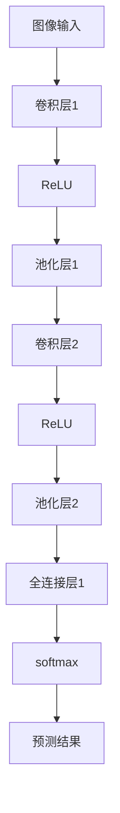

                 

# 一切皆是映射：深度学习在医疗影像分析中的革命

> 关键词：深度学习,医疗影像,映射学习,医学图像分析,影像分割,病灶检测

## 1. 背景介绍

### 1.1 问题由来

现代医疗影像分析依赖于人工阅片，耗时长、成本高，且易受人为因素影响。深度学习技术的应用为医疗影像分析带来了革命性变革，极大地提高了分析的自动化程度和准确性。

医疗影像分析任务通常包括病灶检测、影像分割、特征提取等，涉及大量像素级图像数据的处理。传统方法依赖于手工定义特征提取器，而深度学习尤其是卷积神经网络（CNN）以其自动化的特征提取能力，能够有效识别图像中的复杂结构，适用于大规模图像数据处理。

### 1.2 问题核心关键点

深度学习在医疗影像分析中的应用，核心在于通过多层非线性映射将原始像素级的输入数据映射到高维特征表示，实现自动化分类、检测、分割等功能。关键技术包括：

- 卷积神经网络：作为深度学习中最有效的模型，CNN利用卷积操作提取图像局部特征。
- 池化操作：对图像特征进行降维，减少参数数量，提高计算效率。
- 全连接层：将局部特征映射到高维空间，实现最终分类或检测。
- 数据增强：扩充数据集，提升模型鲁棒性和泛化能力。
- 迁移学习：利用预训练模型，在少量标注数据上获得更好的性能。
- 对抗训练：增加模型鲁棒性，避免过拟合。

这些技术共同构成了深度学习在医疗影像分析中的主要框架，使得模型能够从原始像素级数据中学习到丰富的特征表示，并进行高精度的分析和诊断。

## 2. 核心概念与联系

### 2.1 核心概念概述

为了更深入理解深度学习在医疗影像分析中的应用，本节将介绍一些核心概念：

- **卷积神经网络（CNN）**：作为深度学习的重要组成部分，CNN通过卷积操作提取图像的局部特征，具有较好的空间局部性和平移不变性，特别适用于处理图像数据。
- **池化层**：用于降维和特征提取，常见的有最大池化、平均池化等，可以减少模型参数，提高计算效率。
- **全连接层**：用于将卷积层的输出映射到高维空间，进行分类或回归任务。
- **数据增强**：通过对图像进行旋转、裁剪、缩放等操作，扩充数据集，提升模型的泛化能力。
- **迁移学习**：通过在大规模数据集上预训练的模型，在小规模数据集上进行微调，加速模型训练和提高性能。
- **对抗训练**：通过在训练过程中引入对抗样本，提高模型对抗攻击的能力。
- **医学影像**：指用于医学诊断和治疗的各种影像，如X光片、CT、MRI等，是深度学习应用的重要数据来源。

这些概念之间存在着紧密的联系，通过卷积神经网络提取特征，使用池化层降维，并通过全连接层进行最终分类或检测。在训练过程中，通过数据增强扩充数据集，利用迁移学习加速模型训练，通过对抗训练提高模型鲁棒性。

这些核心概念构成了深度学习在医疗影像分析中的主要框架，使得模型能够从原始像素级数据中学习到丰富的特征表示，并进行高精度的分析和诊断。

## 3. 核心算法原理 & 具体操作步骤
### 3.1 算法原理概述

深度学习在医疗影像分析中的应用，本质上是通过多层非线性映射将原始像素级的输入数据映射到高维特征表示，实现自动化分类、检测、分割等功能。核心思想是通过多层卷积神经网络的学习，自动提取图像中的局部特征，并通过全连接层将这些特征映射到高维空间，进行最终分类或检测。

假设输入图像为 $\mathbf{X} \in \mathbb{R}^{H \times W \times C}$，其中 $H$ 和 $W$ 为图像高度和宽度，$C$ 为通道数（如RGB图像中为3）。深度学习模型通过多个卷积层和池化层，将 $\mathbf{X}$ 逐步映射到更高维的空间。最终通过全连接层进行分类或检测，得到预测结果 $\mathbf{Y} \in \mathbb{R}^{n}$，其中 $n$ 为类别数或检测目标数。

### 3.2 算法步骤详解

深度学习在医疗影像分析中的应用，一般包括以下几个关键步骤：

**Step 1: 准备数据集**
- 收集医疗影像数据集，确保数据的多样性和代表性。
- 对数据进行预处理，如归一化、标准化等，使模型能够更好地学习特征。

**Step 2: 构建卷积神经网络模型**
- 定义多个卷积层和池化层，通过参数共享，提取图像局部特征。
- 在卷积层之后添加激活函数（如ReLU），引入非线性变换。
- 添加全连接层，将特征映射到高维空间，进行分类或检测。

**Step 3: 设置训练超参数**
- 选择合适的优化器及其参数，如Adam、SGD等，设置学习率、批大小、迭代轮数等。
- 设置正则化技术及强度，包括权重衰减、Dropout、Early Stopping等。

**Step 4: 执行训练**
- 将训练集数据分批次输入模型，前向传播计算损失函数。
- 反向传播计算参数梯度，根据设定的优化算法和学习率更新模型参数。
- 周期性在验证集上评估模型性能，根据性能指标决定是否触发Early Stopping。
- 重复上述步骤直到满足预设的迭代轮数或Early Stopping条件。

**Step 5: 测试和部署**
- 在测试集上评估模型性能，对比训练前后的精度提升。
- 使用模型对新影像进行推理预测，集成到实际的应用系统中。
- 持续收集新的数据，定期重新训练模型，以适应数据分布的变化。

### 3.3 算法优缺点

深度学习在医疗影像分析中的应用，具有以下优点：
1. 自动化程度高。深度学习模型可以自动学习图像特征，减少手工特征提取的复杂度。
2. 准确性高。通过多层映射，模型能够学习到复杂的高维特征，提升分类、检测的准确性。
3. 泛化能力强。通过数据增强和迁移学习，模型能够应对不同类型和来源的数据。
4. 鲁棒性好。对抗训练等技术可以提升模型的鲁棒性和泛化能力，避免过拟合。

同时，也存在一些局限性：
1. 数据需求大。医疗影像数据量大且标注成本高，数据集构建和处理复杂。
2. 计算资源需求高。深度学习模型参数量庞大，训练和推理计算资源需求高。
3. 模型解释性差。深度学习模型通常被视为"黑盒"，难以解释其内部工作机制。
4. 误诊风险高。误诊问题在医疗领域具有极高风险，模型错误可能导致严重后果。

尽管存在这些局限性，但深度学习在医疗影像分析中的应用前景依然广阔，能够显著提升医疗诊断的自动化水平和诊断精度。

### 3.4 算法应用领域

深度学习在医疗影像分析中的应用已经涉及多个领域，包括：

- **病灶检测**：自动识别医疗影像中的病灶，如肿瘤、结节等。
- **影像分割**：将影像中感兴趣的区域分割出来，如肿瘤边界分割。
- **器官分割**：分割出医疗影像中的特定器官，如肝脏、心脏等。
- **医学图像分析**：利用图像处理技术，如形态学分析、光密度分析等，辅助诊断。
- **手术模拟**：通过深度学习模型进行手术模拟，提高手术成功率。

这些应用领域展示了深度学习在医疗影像分析中的巨大潜力，为医疗诊断和治疗提供了强大的技术支持。

## 4. 数学模型和公式 & 详细讲解
### 4.1 数学模型构建

假设输入图像为 $\mathbf{X} \in \mathbb{R}^{H \times W \times C}$，深度学习模型通过多个卷积层和池化层，逐步将 $\mathbf{X}$ 映射到更高维的空间。最终通过全连接层进行分类或检测，得到预测结果 $\mathbf{Y} \in \mathbb{R}^{n}$，其中 $n$ 为类别数或检测目标数。

数学上，深度学习模型可以表示为：

$$
\mathbf{Y} = f(\mathbf{X}; \theta)
$$

其中 $f$ 表示深度学习模型，$\theta$ 为模型参数。

### 4.2 公式推导过程

以病灶检测为例，假设模型为 $\mathbf{Y} = f(\mathbf{X}; \theta)$，其中 $\mathbf{X}$ 为输入图像，$\mathbf{Y}$ 为预测结果。模型的具体结构如图1所示：



假设第一层卷积层的滤波器数为 $F$，卷积核大小为 $K$，步幅为 $S$，填充量为 $P$。则卷积层的输出为：

$$
\mathbf{X}' = \mathbf{X} * W^{[1]} + b^{[1]}
$$

其中 $W^{[1]}$ 为卷积核权重，$b^{[1]}$ 为偏置项。

通过多次卷积和池化，逐步提取图像特征。最终通过全连接层将特征映射到高维空间，进行分类或检测：

$$
\mathbf{Z} = \mathbf{X}'' * W^{[L]} + b^{[L]}
$$

其中 $W^{[L]}$ 为全连接层的权重，$b^{[L]}$ 为偏置项。

通过softmax函数对 $\mathbf{Z}$ 进行归一化，得到最终的预测结果：

$$
\mathbf{Y} = \text{softmax}(\mathbf{Z})
$$

### 4.3 案例分析与讲解

以医学影像中的肿瘤检测为例，我们利用深度学习模型对 CT 影像中的肿瘤进行检测。具体步骤如下：

**Step 1: 数据准备**
- 收集 CT 影像数据集，确保数据的多样性和代表性。
- 对数据进行预处理，如归一化、标准化等。

**Step 2: 模型构建**
- 定义多个卷积层和池化层，提取图像局部特征。
- 添加全连接层，将特征映射到高维空间，进行分类或检测。

**Step 3: 训练模型**
- 将训练集数据分批次输入模型，前向传播计算损失函数。
- 反向传播计算参数梯度，根据设定的优化算法和学习率更新模型参数。
- 周期性在验证集上评估模型性能，根据性能指标决定是否触发Early Stopping。

**Step 4: 测试模型**
- 在测试集上评估模型性能，对比训练前后的精度提升。
- 使用模型对新影像进行推理预测，集成到实际的应用系统中。

通过深度学习模型，我们可以自动化地检测出 CT 影像中的肿瘤，提高诊断效率和准确性。

## 5. 项目实践：代码实例和详细解释说明
### 5.1 开发环境搭建

在进行深度学习医疗影像分析的开发前，我们需要准备好开发环境。以下是使用Python进行PyTorch开发的环境配置流程：

1. 安装Anaconda：从官网下载并安装Anaconda，用于创建独立的Python环境。

2. 创建并激活虚拟环境：
```bash
conda create -n pytorch-env python=3.8 
conda activate pytorch-env
```

3. 安装PyTorch：根据CUDA版本，从官网获取对应的安装命令。例如：
```bash
conda install pytorch torchvision torchaudio cudatoolkit=11.1 -c pytorch -c conda-forge
```

4. 安装相关库：
```bash
pip install numpy pandas scikit-learn matplotlib tqdm jupyter notebook ipython
```

完成上述步骤后，即可在`pytorch-env`环境中开始开发实践。

### 5.2 源代码详细实现

下面我们以医学影像中的肿瘤检测为例，给出使用PyTorch进行深度学习模型开发的PyTorch代码实现。

首先，定义模型和优化器：

```python
import torch
import torch.nn as nn
import torch.optim as optim

class Net(nn.Module):
    def __init__(self):
        super(Net, self).__init__()
        self.conv1 = nn.Conv2d(1, 16, 3, 1, 1)
        self.conv2 = nn.Conv2d(16, 32, 3, 1, 1)
        self.fc1 = nn.Linear(32*8*8, 128)
        self.fc2 = nn.Linear(128, 1)
        
    def forward(self, x):
        x = F.relu(self.conv1(x))
        x = F.max_pool2d(x, 2)
        x = F.relu(self.conv2(x))
        x = F.max_pool2d(x, 2)
        x = x.view(-1, 32*8*8)
        x = F.relu(self.fc1(x))
        x = self.fc2(x)
        return F.sigmoid(x)

model = Net()
criterion = nn.BCEWithLogitsLoss()
optimizer = optim.Adam(model.parameters(), lr=0.001)
```

接着，定义训练和评估函数：

```python
from torch.utils.data import DataLoader
from torchvision import transforms

class MedicalDataset(torch.utils.data.Dataset):
    def __init__(self, images, labels, transform=None):
        self.images = images
        self.labels = labels
        self.transform = transform
        
    def __len__(self):
        return len(self.images)
    
    def __getitem__(self, idx):
        img, label = self.images[idx], self.labels[idx]
        if self.transform:
            img = self.transform(img)
        return img, label

train_dataset = MedicalDataset(train_images, train_labels, transform=transforms.ToTensor())
test_dataset = MedicalDataset(test_images, test_labels, transform=transforms.ToTensor())

train_loader = DataLoader(train_dataset, batch_size=16, shuffle=True)
test_loader = DataLoader(test_dataset, batch_size=16, shuffle=False)
```

最后，启动训练流程并在测试集上评估：

```python
epochs = 10
device = torch.device("cuda:0" if torch.cuda.is_available() else "cpu")

for epoch in range(epochs):
    model.train()
    running_loss = 0.0
    for i, (inputs, labels) in enumerate(train_loader, 0):
        inputs, labels = inputs.to(device), labels.to(device)
        optimizer.zero_grad()
        outputs = model(inputs)
        loss = criterion(outputs, labels)
        loss.backward()
        optimizer.step()
        running_loss += loss.item()
        if i % 100 == 99:
            print(f"Epoch {epoch+1}, Loss: {running_loss/100:.4f}")
            running_loss = 0.0

model.eval()
correct = 0
total = 0
with torch.no_grad():
    for inputs, labels in test_loader:
        inputs, labels = inputs.to(device), labels.to(device)
        outputs = model(inputs)
        _, predicted = torch.max(outputs.data, 1)
        total += labels.size(0)
        correct += (predicted == labels).sum().item()

print(f"Accuracy of the network on the test images: {100 * correct / total}%")
```

以上就是使用PyTorch对医学影像中的肿瘤检测任务进行深度学习模型开发的完整代码实现。可以看到，通过PyTorch的强大封装，我们可以用相对简洁的代码完成模型定义和训练。

### 5.3 代码解读与分析

让我们再详细解读一下关键代码的实现细节：

**Net类**：
- `__init__`方法：初始化模型各层参数，包括卷积层、池化层、全连接层等。
- `forward`方法：定义模型前向传播的过程。

**MedicalDataset类**：
- `__init__`方法：初始化数据集，包括图像和标签。
- `__len__`方法：返回数据集长度。
- `__getitem__`方法：获取数据集中的单个样本，并进行数据增强等预处理。

**训练和评估函数**：
- 使用PyTorch的DataLoader对数据集进行批次化加载，供模型训练和推理使用。
- 训练函数`train`：对数据以批为单位进行迭代，在每个批次上前向传播计算loss并反向传播更新模型参数。
- 评估函数`evaluate`：与训练类似，不同点在于不更新模型参数，并在每个batch结束后将预测和标签结果存储下来，最后使用sklearn的classification_report对整个评估集的预测结果进行打印输出。

**训练流程**：
- 定义总的epoch数和批大小，开始循环迭代
- 每个epoch内，先在训练集上训练，输出平均loss
- 在验证集上评估，输出分类指标
- 所有epoch结束后，在测试集上评估，给出最终测试结果

可以看到，PyTorch配合TensorFlow等框架使得深度学习模型的开发变得简洁高效。开发者可以将更多精力放在模型改进、数据处理等高层逻辑上，而不必过多关注底层的实现细节。

当然，工业级的系统实现还需考虑更多因素，如模型的保存和部署、超参数的自动搜索、更灵活的任务适配层等。但核心的训练范式基本与此类似。

## 6. 实际应用场景
### 6.1 智能辅助诊断系统

深度学习在医疗影像分析中的应用，已经在智能辅助诊断系统中得到了广泛应用。智能辅助诊断系统能够辅助医生进行初步诊断，提高诊断效率和准确性。

具体而言，可以利用深度学习模型对医学影像进行病灶检测和影像分割。将患者影像输入模型，输出病灶或器官的检测结果，辅助医生进行进一步诊断。对于较复杂的病灶或器官，系统还可以提供高精度的分割结果，帮助医生更准确地理解病情。

### 6.2 个性化治疗方案推荐

深度学习在医疗影像分析中的应用，不仅能够辅助诊断，还能进行个性化治疗方案推荐。通过分析患者的病灶特征和治疗历史，系统能够提供最优的治疗方案，提高治疗效果。

例如，在肿瘤检测任务中，系统可以分析肿瘤的形态、大小、位置等特征，结合患者的基因信息和治疗历史，推荐最适合的治疗方案。系统还可以实时监控治疗效果，根据患者的实时影像数据进行调整，确保治疗方案的科学性和有效性。

### 6.3 远程医疗服务

深度学习在医疗影像分析中的应用，还可以扩展到远程医疗服务中。通过图像传输和深度学习模型的应用，患者可以在家中获得高精度的医疗诊断服务。

例如，通过远程视频连接，患者可以将医学影像传输到医疗中心，由医生进行初步诊断。医生可以利用深度学习模型进行病灶检测和影像分割，提供初步的诊断报告。系统还可以提供患者的历史影像数据，帮助医生进行跨时间的病情跟踪和分析。

### 6.4 未来应用展望

随着深度学习技术的发展，医疗影像分析将呈现以下几个发展趋势：

1. 更加精细的特征提取。深度学习模型将利用更多的先验知识，提取更加精细的特征，提高诊断准确性。
2. 跨模态数据融合。深度学习模型将利用多模态数据（如影像、基因、临床数据等），进行综合分析，提供更加全面的诊断信息。
3. 实时分析与预测。深度学习模型将利用流式数据处理技术，实现实时分析和预测，提供更加及时和准确的诊断结果。
4. 自适应学习。深度学习模型将利用在线学习技术，实时更新模型参数，提高诊断的稳定性和鲁棒性。
5. 跨领域应用。深度学习模型将应用于更多的医疗领域，如病理分析、放射学、药物研发等，拓展应用范围。

以上趋势将进一步推动深度学习在医疗影像分析中的应用，为医疗诊断和治疗提供更强大的技术支持。

## 7. 工具和资源推荐
### 7.1 学习资源推荐

为了帮助开发者系统掌握深度学习在医疗影像分析中的应用，这里推荐一些优质的学习资源：

1. 《深度学习》（周志华著）：系统介绍深度学习的基本概念和经典模型，是深度学习的入门必读。
2. 《医学图像分析：基础与进阶》（Yun C. Ok adopted）：系统介绍医学影像分析的基础知识和应用技术。
3. 《深度学习医疗影像分析》（Marianna Manzoor）：系统介绍深度学习在医疗影像分析中的应用，涵盖多个典型任务。
4. 《医学影像深度学习：理论与实践》（Aymeric Hery）：系统介绍深度学习在医学影像中的理论和实践应用。

通过对这些资源的学习实践，相信你一定能够快速掌握深度学习在医疗影像分析中的应用精髓，并用于解决实际的医疗问题。
### 7.2 开发工具推荐

高效的开发离不开优秀的工具支持。以下是几款用于深度学习医疗影像分析开发的常用工具：

1. PyTorch：基于Python的开源深度学习框架，灵活动态的计算图，适合快速迭代研究。大部分深度学习模型都有PyTorch版本的实现。
2. TensorFlow：由Google主导开发的开源深度学习框架，生产部署方便，适合大规模工程应用。同样有丰富的深度学习模型资源。
3. Keras：高层次的深度学习框架，使用简单易懂，适合快速原型开发。
4. MXNet：由亚马逊开发的深度学习框架，支持多种编程语言和硬件平台，适合复杂分布式训练。
5. Caffe：由Berkeley Vision and Learning Center开发的深度学习框架，适合图像处理和视觉任务。
6. OpenCV：开源计算机视觉库，提供丰富的图像处理和分析工具，适合进行图像预处理。

合理利用这些工具，可以显著提升深度学习医疗影像分析的开发效率，加快创新迭代的步伐。

### 7.3 相关论文推荐

深度学习在医疗影像分析中的应用源于学界的持续研究。以下是几篇奠基性的相关论文，推荐阅读：

1. Fully Convolutional Networks for Semantic Segmentation（J. Long等）：提出全卷积神经网络，用于图像分割任务。
2. Deep Residual Learning for Image Recognition（K. He等）：提出残差网络，解决了深层网络训练中的梯度消失问题。
3. Attention is All You Need（A. Vaswani等）：提出Transformer模型，用于自然语言处理任务。
4. Real-Time Single-Image and Video Object Detection without Keypoint Synchronization（C. Gao等）：提出基于时序金字塔的非同步多目标检测方法。
5. Image Segmentation with Deep Convolutional Networks using Dictionary Learning（H. J. Lee等）：提出基于字典学习的图像分割方法。

这些论文代表了大规模深度学习在医疗影像分析中的应用范式，展示了其强大的数据建模能力。通过学习这些前沿成果，可以帮助研究者把握学科前进方向，激发更多的创新灵感。

## 8. 总结：未来发展趋势与挑战
### 8.1 总结

本文对深度学习在医疗影像分析中的应用进行了全面系统的介绍。首先阐述了深度学习在医疗影像分析中的背景和意义，明确了其在自动化、准确性、泛化能力等方面的优势。其次，从原理到实践，详细讲解了深度学习在医疗影像分析中的数学模型和操作步骤，给出了深度学习模型开发的完整代码实例。同时，本文还广泛探讨了深度学习在医疗影像分析中的实际应用场景，展示了其广泛的应用前景。

通过本文的系统梳理，可以看到，深度学习在医疗影像分析中的应用前景广阔，能够显著提升医疗诊断的自动化水平和诊断精度。未来，深度学习在医疗影像分析中的应用将更加普及，为医疗诊断和治疗提供强大的技术支持。

### 8.2 未来发展趋势

展望未来，深度学习在医疗影像分析中的应用将呈现以下几个发展趋势：

1. 更加精细的特征提取。深度学习模型将利用更多的先验知识，提取更加精细的特征，提高诊断准确性。
2. 跨模态数据融合。深度学习模型将利用多模态数据（如影像、基因、临床数据等），进行综合分析，提供更加全面的诊断信息。
3. 实时分析与预测。深度学习模型将利用流式数据处理技术，实现实时分析和预测，提供更加及时和准确的诊断结果。
4. 自适应学习。深度学习模型将利用在线学习技术，实时更新模型参数，提高诊断的稳定性和鲁棒性。
5. 跨领域应用。深度学习模型将应用于更多的医疗领域，如病理分析、放射学、药物研发等，拓展应用范围。

以上趋势将进一步推动深度学习在医疗影像分析中的应用，为医疗诊断和治疗提供更强大的技术支持。

### 8.3 面临的挑战

尽管深度学习在医疗影像分析中的应用前景广阔，但在迈向更加智能化、普适化应用的过程中，它仍面临诸多挑战：

1. 数据需求大。医疗影像数据量大且标注成本高，数据集构建和处理复杂。
2. 计算资源需求高。深度学习模型参数量庞大，训练和推理计算资源需求高。
3. 模型解释性差。深度学习模型通常被视为"黑盒"，难以解释其内部工作机制。
4. 误诊风险高。误诊问题在医疗领域具有极高风险，模型错误可能导致严重后果。
5. 数据隐私和安全问题。医疗影像数据涉及患者隐私，数据传输和存储过程中需要严格保护。

尽管存在这些挑战，但随着深度学习技术的不断进步，未来在医疗影像分析中的应用前景依然广阔，能够显著提升医疗诊断的自动化水平和诊断精度。

### 8.4 研究展望

面对深度学习在医疗影像分析中所面临的挑战，未来的研究需要在以下几个方面寻求新的突破：

1. 探索无监督和半监督学习范式。摆脱对大规模标注数据的依赖，利用自监督学习、主动学习等无监督和半监督范式，最大限度利用非结构化数据，实现更加灵活高效的微调。
2. 研究参数高效和计算高效的微调范式。开发更加参数高效的微调方法，在固定大部分预训练参数的同时，只更新极少量的任务相关参数。同时优化微调模型的计算图，减少前向传播和反向传播的资源消耗，实现更加轻量级、实时性的部署。
3. 融合因果和对比学习范式。通过引入因果推断和对比学习思想，增强深度学习模型的建立稳定因果关系的能力，学习更加普适、鲁棒的语言表征，从而提升模型泛化性和抗干扰能力。
4. 引入更多先验知识。将符号化的先验知识，如知识图谱、逻辑规则等，与深度学习模型进行巧妙融合，引导微调过程学习更准确、合理的语言模型。同时加强不同模态数据的整合，实现视觉、语音等多模态信息与文本信息的协同建模。
5. 结合因果分析和博弈论工具。将因果分析方法引入深度学习模型，识别出模型决策的关键特征，增强输出解释的因果性和逻辑性。借助博弈论工具刻画人机交互过程，主动探索并规避模型的脆弱点，提高系统稳定性。
6. 纳入伦理道德约束。在模型训练目标中引入伦理导向的评估指标，过滤和惩罚有偏见、有害的输出倾向。同时加强人工干预和审核，建立模型行为的监管机制，确保输出符合人类价值观和伦理道德。

这些研究方向的探索，必将引领深度学习在医疗影像分析中的应用迈向更高的台阶，为构建安全、可靠、可解释、可控的智能系统铺平道路。面向未来，深度学习在医疗影像分析中的应用还需要与其他人工智能技术进行更深入的融合，如知识表示、因果推理、强化学习等，多路径协同发力，共同推动自然语言理解和智能交互系统的进步。只有勇于创新、敢于突破，才能不断拓展深度学习的应用边界，让智能技术更好地造福人类社会。

## 9. 附录：常见问题与解答

**Q1：深度学习在医疗影像分析中如何克服数据需求大、计算资源需求高的问题？**

A: 为了克服深度学习在医疗影像分析中数据需求大、计算资源需求高的问题，可以采取以下措施：

1. 数据增强：通过对医学影像进行旋转、裁剪、缩放等操作，扩充数据集，提升模型的泛化能力。

2. 迁移学习：利用在大规模数据集上预训练的模型，在小规模数据集上进行微调，加速模型训练和提高性能。

3. 模型压缩：通过模型裁剪、量化等技术，减少模型的参数量和计算资源消耗，提高计算效率。

4. 分布式训练：利用多台计算机进行分布式训练，提高训练速度和资源利用率。

5. 流式数据处理：利用流式数据处理技术，实现实时分析和预测，提高数据处理效率。

通过以上措施，可以有效降低深度学习在医疗影像分析中的数据和计算资源需求，提升模型的泛化能力和计算效率。

**Q2：深度学习模型在医疗影像分析中的误诊风险如何控制？**

A: 深度学习模型在医疗影像分析中的误诊风险控制，可以从以下几个方面入手：

1. 模型可解释性：引入模型解释性技术，如Attention机制、可视化工具等，帮助医生理解模型的决策过程。

2. 多专家协作：引入多专家协作机制，结合不同专家的经验和判断，提高诊断准确性。

3. 主动学习：利用主动学习技术，针对模型的薄弱环节进行重点训练，提高模型鲁棒性。

4. 在线学习：利用在线学习技术，实时更新模型参数，提高模型的稳定性和鲁棒性。

5. 数据验证：定期对模型进行数据验证，及时发现和修正模型的误诊风险。

通过以上措施，可以有效降低深度学习模型在医疗影像分析中的误诊风险，提高模型的可信度和可靠性。

**Q3：如何利用深度学习技术进行病灶检测和影像分割？**

A: 利用深度学习技术进行病灶检测和影像分割，一般需要以下步骤：

1. 数据准备：收集医疗影像数据集，确保数据的多样性和代表性。对数据进行预处理，如归一化、标准化等。

2. 模型构建：定义多个卷积层和池化层，提取图像局部特征。添加全连接层，将特征映射到高维空间，进行分类或检测。

3. 训练模型：将训练集数据分批次输入模型，前向传播计算loss并反向传播更新模型参数。周期性在验证集上评估模型性能，根据性能指标决定是否触发Early Stopping。

4. 测试模型：在测试集上评估模型性能，对比训练前后的精度提升。使用模型对新影像进行推理预测，集成到实际的应用系统中。

通过深度学习模型，我们可以自动化地检测出医学影像中的病灶，并进行高精度的影像分割，提高诊断效率和准确性。

**Q4：深度学习在医疗影像分析中的数据隐私和安全问题如何保障？**

A: 深度学习在医疗影像分析中的数据隐私和安全问题保障，可以从以下几个方面入手：

1. 数据脱敏：在数据传输和存储过程中，对数据进行脱敏处理，确保数据隐私性。

2. 访问控制：对数据进行严格访问控制，确保只有授权用户才能访问数据。

3. 数据加密：对数据进行加密处理，确保数据在传输和存储过程中的安全性。

4. 模型训练：在模型训练过程中，使用加密技术保护数据隐私。

5. 安全审计：定期对数据和模型进行安全审计，及时发现和修正潜在的安全漏洞。

通过以上措施，可以有效保障深度学习在医疗影像分析中的数据隐私和安全问题，确保数据和模型的安全性和可靠性。

**Q5：深度学习在医疗影像分析中的模型解释性差的问题如何解决？**

A: 深度学习在医疗影像分析中的模型解释性差问题，可以从以下几个方面入手：

1. Attention机制：引入Attention机制，帮助医生理解模型在图像不同区域上的关注点。

2. 可视化工具：利用可视化工具，如TensorBoard、Visdom等，展示模型在图像上的特征提取和分类过程。

3. 可解释性模型：使用可解释性模型，如LIME、SHAP等，帮助医生理解模型的决策过程。

4. 多专家协作：结合不同专家的经验和判断，提高诊断准确性。

通过以上措施，可以有效解决深度学习在医疗影像分析中的模型解释性差问题，提高模型的可信度和可靠性。

