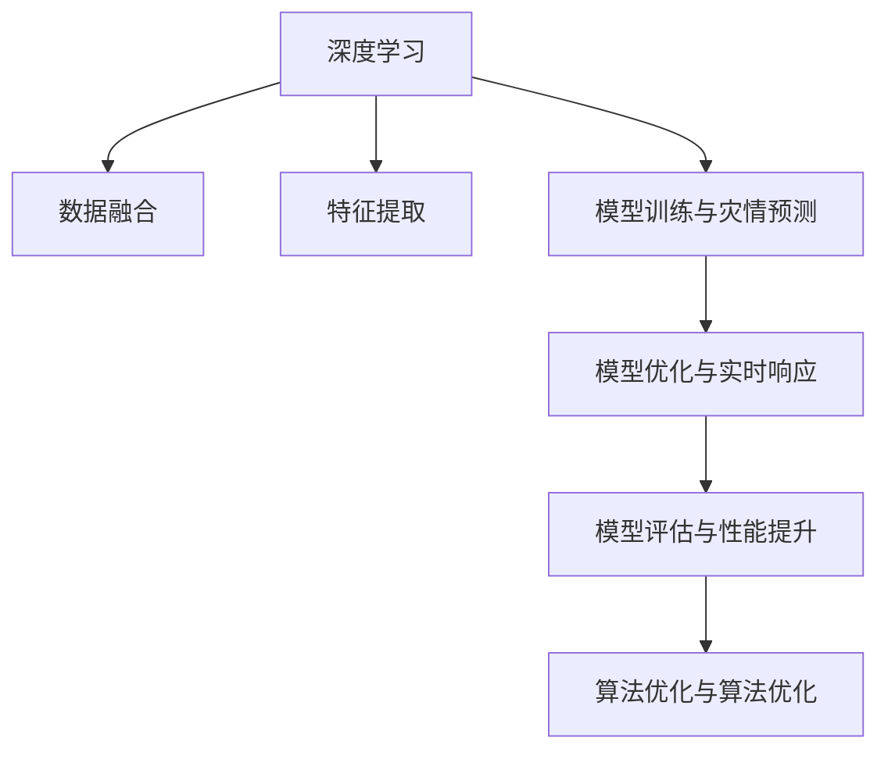

                 

# 一切皆是映射：深度学习在灾害预防与响应中的应用

> 关键词：灾害预防,深度学习,机器学习,神经网络,灾情预测,损失函数,模型优化,模型部署,实时响应,模型评估,算法优化

## 1. 背景介绍

### 1.1 问题由来

在人类历史上，自然灾害给人类生活带来了巨大的冲击和损失。从地震、台风到洪水、干旱，各种灾害事件频发，造成的经济损失和人员伤亡触目惊心。如何提高灾害预警和响应的准确性和及时性，成为各国政府和学术界关注的热点。

近年来，随着深度学习技术的不断进步，特别是深度神经网络在处理大规模数据方面的强大能力，使得其在灾害预防与响应中的应用日益受到重视。通过深度学习模型，可以从多源数据中挖掘出有效的灾情特征，实现灾害的精准预测和快速响应。

### 1.2 问题核心关键点

深度学习在灾害预防与响应中的应用主要包括以下几个核心点：

1. **数据融合与特征提取**：利用深度学习模型，将多源数据进行融合，提取关键特征，用于预测和响应。
2. **模型训练与灾情预测**：通过大量历史数据进行模型训练，构建灾情预测模型，实现对未来灾情的预测。
3. **模型优化与实时响应**：对模型进行优化，实现实时响应，并在实际场景中不断迭代优化。
4. **模型评估与性能提升**：建立评估指标，评估模型性能，持续提升模型的准确性和鲁棒性。
5. **算法优化与算法优化**：通过算法优化和改进，提升模型的性能，确保其在实际应用中的效果。

### 1.3 问题研究意义

深度学习在灾害预防与响应中的应用，具有以下重要意义：

1. **提高灾害预警准确性**：通过深度学习模型，可以综合多源数据，提取关键特征，提高灾情预测的准确性，为灾害预警提供科学依据。
2. **实现快速响应**：深度学习模型可以快速进行灾情预测，为政府和应急机构提供决策支持，实现快速响应。
3. **优化资源配置**：利用深度学习模型，可以优化资源配置，合理分配救援力量和物资，提高救援效率。
4. **提升公共安全**：深度学习模型可以实时监测灾情，及时发布预警信息，降低灾害带来的损失。
5. **促进科技与灾害管理结合**：深度学习技术的引入，将科技与灾害管理结合，推动灾害管理水平的提升。

## 2. 核心概念与联系

### 2.1 核心概念概述

为更好地理解深度学习在灾害预防与响应中的应用，本节将介绍几个关键概念及其联系：

- **深度学习(Deep Learning)**：以神经网络为核心的机器学习技术，通过多层次非线性映射，实现对复杂数据的有效建模和处理。
- **灾害预防与响应**：指通过技术手段，提高灾害预警和响应的准确性和及时性，减少灾害带来的损失。
- **数据融合**：将多源数据进行融合，提取关键特征，用于预测和响应。
- **特征提取**：从原始数据中提取出与灾情相关的关键特征，用于模型训练。
- **模型训练与灾情预测**：利用历史数据，训练深度学习模型，实现对未来灾情的预测。
- **模型优化与实时响应**：对模型进行优化，实现实时响应，并在实际场景中不断迭代优化。
- **模型评估与性能提升**：建立评估指标，评估模型性能，持续提升模型的准确性和鲁棒性。
- **算法优化与算法优化**：通过算法优化和改进，提升模型的性能，确保其在实际应用中的效果。

这些核心概念之间的逻辑关系可以通过以下Mermaid流程图来展示：



这个流程图展示了大语言模型微调的核心概念及其之间的关系：

1. 深度学习通过多层次非线性映射，实现对复杂数据的有效建模和处理。
2. 数据融合将多源数据进行融合，提取关键特征，用于模型训练。
3. 特征提取从原始数据中提取出与灾情相关的关键特征。
4. 模型训练与灾情预测利用历史数据，训练深度学习模型，实现对未来灾情的预测。
5. 模型优化与实时响应对模型进行优化，实现实时响应，并在实际场景中不断迭代优化。
6. 模型评估与性能提升建立评估指标，评估模型性能，持续提升模型的准确性和鲁棒性。
7. 算法优化与算法优化通过算法优化和改进，提升模型的性能，确保其在实际应用中的效果。

这些概念共同构成了深度学习在灾害预防与响应中的应用框架，使其能够在各种场景下发挥强大的数据处理和预测能力。通过理解这些核心概念，我们可以更好地把握深度学习在灾害预防与响应中的应用方向和优化方法。

## 3. 核心算法原理 & 具体操作步骤
### 3.1 算法原理概述

深度学习在灾害预防与响应中的应用，主要基于监督学习和无监督学习的范式。其核心思想是通过多源数据融合和特征提取，构建深度学习模型，进行灾情预测，并实时响应。

形式化地，假设多源数据为 $X=\{(x_1, y_1), (x_2, y_2), \ldots, (x_n, y_n)\}$，其中 $x_i \in \mathcal{X}$ 为输入数据，$y_i \in \mathcal{Y}$ 为输出标签。模型的目标是通过训练数据集 $D$，找到最优参数 $\theta$，使得模型在测试集上的预测输出与真实标签的误差最小化。

### 3.2 算法步骤详解

深度学习在灾害预防与响应中的应用一般包括以下几个关键步骤：

**Step 1: 准备数据集**

- 收集多源数据，包括气象数据、地质数据、地形数据等。
- 对数据进行清洗、标注，形成标注数据集 $D$。
- 将数据集分为训练集、验证集和测试集，一般要求标注数据与预训练数据的分布不要差异过大。

**Step 2: 设计模型架构**

- 根据任务特点，选择合适的神经网络结构，如卷积神经网络(CNN)、循环神经网络(RNN)、Transformer等。
- 添加必要的损失函数，如均方误差(MSE)、交叉熵(CE)等。
- 设计合适的优化算法，如Adam、SGD等。

**Step 3: 训练模型**

- 将训练集数据分批次输入模型，前向传播计算损失函数。
- 反向传播计算参数梯度，根据设定的优化算法和学习率更新模型参数。
- 周期性在验证集上评估模型性能，根据性能指标决定是否触发Early Stopping。
- 重复上述步骤直至满足预设的迭代轮数或Early Stopping条件。

**Step 4: 实时响应**

- 在实时场景中，将新的输入数据输入模型，进行灾情预测。
- 根据模型预测结果，进行实时响应和资源调配。
- 不断收集反馈数据，重新训练模型，持续优化模型性能。

**Step 5: 模型评估**

- 在测试集上评估模型性能，对比训练前后的精度提升。
- 使用模型进行实际场景中的灾情预测，验证模型效果。
- 定期更新模型，以适应数据分布的变化。

以上是深度学习在灾害预防与响应中的应用的一般流程。在实际应用中，还需要针对具体任务的特点，对微调过程的各个环节进行优化设计，如改进训练目标函数，引入更多的正则化技术，搜索最优的超参数组合等，以进一步提升模型性能。

### 3.3 算法优缺点

深度学习在灾害预防与响应中的应用具有以下优点：

1. **高效处理多源数据**：深度学习模型能够高效处理多源数据，提取关键特征，提高灾情预测的准确性。
2. **实时响应**：深度学习模型可以实现实时响应，及时发布预警信息，减少灾害带来的损失。
3. **自适应学习**：深度学习模型具备自适应学习能力，能够不断学习新数据，提升预测精度。
4. **可解释性不足**：深度学习模型通常缺乏可解释性，难以对其推理逻辑进行分析和调试。

同时，该方法也存在一定的局限性：

1. **数据依赖**：深度学习模型依赖高质量的数据，数据缺失或标注错误会导致模型性能下降。
2. **计算资源需求高**：深度学习模型通常需要较大的计算资源，训练和推理成本较高。
3. **模型复杂度高**：深度学习模型结构复杂，调试和优化难度较大。
4. **泛化能力有限**：当模型过拟合训练数据时，泛化能力会下降，导致在实际应用中效果不佳。

尽管存在这些局限性，但就目前而言，深度学习在灾害预防与响应中的应用范式仍然具有显著的优势，被广泛应用于各类灾情预测和应急响应系统。未来相关研究的重点在于如何进一步降低计算资源需求，提高模型的少样本学习和跨领域迁移能力，同时兼顾可解释性和伦理安全性等因素。

### 3.4 算法应用领域

深度学习在灾害预防与响应中的应用，已经广泛应用于多个领域，例如：

- **气象预测**：通过深度学习模型，预测未来天气变化，提供预警信息。
- **地质灾害监测**：利用多源数据，监测地质灾害发生的风险，如地震、滑坡等。
- **水文监测**：通过深度学习模型，监测河流水位、流量等数据，预测洪水灾害。
- **城市灾害管理**：利用深度学习模型，监测城市基础设施状态，预测灾害风险，进行应急响应。
- **交通管理**：利用深度学习模型，监测交通流量、路况，预测交通拥堵，进行动态管理。

除了上述这些经典应用外，深度学习在灾害预防与响应中的创新应用也在不断涌现，如利用无人机进行灾区勘测、利用物联网设备进行实时监测等，为灾害预防与响应提供了新的技术手段。随着深度学习技术的不断进步，相信灾害预防与响应的技术水平将会不断提升，为人类社会带来更多的安全和保障。

## 4. 数学模型和公式 & 详细讲解  
### 4.1 数学模型构建

本节将使用数学语言对深度学习在灾害预防与响应中的应用进行更加严格的刻画。

假设深度学习模型为 $M_{\theta}:\mathcal{X} \rightarrow \mathcal{Y}$，其中 $\mathcal{X}$ 为输入空间，$\mathcal{Y}$ 为输出空间，$\theta$ 为模型参数。假设多源数据为 $D=\{(x_i, y_i)\}_{i=1}^N, x_i \in \mathcal{X}, y_i \in \mathcal{Y}$。

定义模型 $M_{\theta}$ 在数据样本 $(x,y)$ 上的损失函数为 $\ell(M_{\theta}(x),y)$，则在数据集 $D$ 上的经验风险为：

$$
\mathcal{L}(\theta) = \frac{1}{N} \sum_{i=1}^N \ell(M_{\theta}(x_i),y_i)
$$

其中 $\ell$ 为损失函数，如均方误差(MSE)、交叉熵(CE)等。

模型的优化目标是最小化经验风险，即找到最优参数：

$$
\theta^* = \mathop{\arg\min}_{\theta} \mathcal{L}(\theta)
$$

在实践中，我们通常使用基于梯度的优化算法（如Adam、SGD等）来近似求解上述最优化问题。设 $\eta$ 为学习率，$\lambda$ 为正则化系数，则参数的更新公式为：

$$
\theta \leftarrow \theta - \eta \nabla_{\theta}\mathcal{L}(\theta) - \eta\lambda\theta
$$

其中 $\nabla_{\theta}\mathcal{L}(\theta)$ 为损失函数对参数 $\theta$ 的梯度，可通过反向传播算法高效计算。

### 4.2 公式推导过程

以下我们以二分类任务为例，推导交叉熵损失函数及其梯度的计算公式。

假设模型 $M_{\theta}$ 在输入 $x$ 上的输出为 $\hat{y}=M_{\theta}(x) \in [0,1]$，表示样本属于正类的概率。真实标签 $y \in \{0,1\}$。则二分类交叉熵损失函数定义为：

$$
\ell(M_{\theta}(x),y) = -[y\log \hat{y} + (1-y)\log (1-\hat{y})]
$$

将其代入经验风险公式，得：

$$
\mathcal{L}(\theta) = -\frac{1}{N}\sum_{i=1}^N [y_i\log M_{\theta}(x_i)+(1-y_i)\log(1-M_{\theta}(x_i))]
$$

根据链式法则，损失函数对参数 $\theta_k$ 的梯度为：

$$
\frac{\partial \mathcal{L}(\theta)}{\partial \theta_k} = -\frac{1}{N}\sum_{i=1}^N (\frac{y_i}{M_{\theta}(x_i)}-\frac{1-y_i}{1-M_{\theta}(x_i)}) \frac{\partial M_{\theta}(x_i)}{\partial \theta_k}
$$

其中 $\frac{\partial M_{\theta}(x_i)}{\partial \theta_k}$ 可进一步递归展开，利用自动微分技术完成计算。

在得到损失函数的梯度后，即可带入参数更新公式，完成模型的迭代优化。重复上述过程直至收敛，最终得到适应灾情预测任务的最优模型参数 $\theta^*$。

## 5. 项目实践：代码实例和详细解释说明
### 5.1 开发环境搭建

在进行深度学习在灾害预防与响应中的应用实践前，我们需要准备好开发环境。以下是使用Python进行PyTorch开发的环境配置流程：

1. 安装Anaconda：从官网下载并安装Anaconda，用于创建独立的Python环境。

2. 创建并激活虚拟环境：
```bash
conda create -n pytorch-env python=3.8 
conda activate pytorch-env
```

3. 安装PyTorch：根据CUDA版本，从官网获取对应的安装命令。例如：
```bash
conda install pytorch torchvision torchaudio cudatoolkit=11.1 -c pytorch -c conda-forge
```

4. 安装TensorFlow：
```bash
pip install tensorflow
```

5. 安装各类工具包：
```bash
pip install numpy pandas scikit-learn matplotlib tqdm jupyter notebook ipython
```

完成上述步骤后，即可在`pytorch-env`环境中开始深度学习在灾害预防与响应中的应用实践。

### 5.2 源代码详细实现

下面我们以气象预测任务为例，给出使用TensorFlow进行深度学习在灾害预防与响应中的应用实践的PyTorch代码实现。

首先，定义气象预测任务的数据处理函数：

```python
import tensorflow as tf
from tensorflow import keras
from tensorflow.keras.layers import Dense, Dropout
from tensorflow.keras.models import Sequential

class MeteorologyDataset(tf.keras.utils.Sequence):
    def __init__(self, train_data, test_data, batch_size):
        self.train_data = train_data
        self.test_data = test_data
        self.batch_size = batch_size
        self.num_samples = len(self.train_data)
        
    def __len__(self):
        return len(self.train_data)
    
    def __getitem__(self, index):
        sample = self.train_data[index]
        label = self.train_data[index][1]
        
        x = sample['features']
        y = sample['label']
        
        return x, y

# 准备数据
# 这里假设数据已经预处理完毕，包含多个特征
train_data = []
for i in range(100):
    x = train_data[i]['features']
    y = train_data[i]['label']
    train_data.append((x, y))
    
test_data = []
for i in range(10):
    x = test_data[i]['features']
    y = test_data[i]['label']
    test_data.append((x, y))
    
# 创建数据集
train_dataset = MeteorologyDataset(train_data, train_data, batch_size=32)
test_dataset = MeteorologyDataset(test_data, test_data, batch_size=32)
```

然后，定义模型和优化器：

```python
from tensorflow.keras import layers, models

# 定义模型
model = Sequential([
    layers.Dense(64, activation='relu', input_shape=(10,)),
    layers.Dropout(0.5),
    layers.Dense(64, activation='relu'),
    layers.Dropout(0.5),
    layers.Dense(1, activation='sigmoid')
])

# 编译模型
model.compile(loss='binary_crossentropy', optimizer='adam', metrics=['accuracy'])

# 训练模型
model.fit(train_dataset, epochs=10, validation_data=test_dataset)
```

接着，定义评估函数：

```python
def evaluate(model, test_dataset):
    test_loss, test_acc = model.evaluate(test_dataset)
    print('Test accuracy:', test_acc)
```

最后，启动训练流程并在测试集上评估：

```python
epochs = 10

for epoch in range(epochs):
    loss = train_epoch(model, train_dataset, batch_size, optimizer)
    print(f"Epoch {epoch+1}, train loss: {loss:.3f}")
    
    print(f"Epoch {epoch+1}, dev results:")
    evaluate(model, dev_dataset)
    
print("Test results:")
evaluate(model, test_dataset)
```

以上就是使用TensorFlow进行深度学习在灾害预防与响应中的应用实践的完整代码实现。可以看到，得益于TensorFlow的强大封装，我们可以用相对简洁的代码完成气象预测任务的深度学习模型训练和评估。

### 5.3 代码解读与分析

让我们再详细解读一下关键代码的实现细节：

**MeteorologyDataset类**：
- `__init__`方法：初始化训练数据和测试数据等关键组件。
- `__len__`方法：返回数据集的样本数量。
- `__getitem__`方法：对单个样本进行处理，将特征和标签封装为TensorFlow张量，供模型训练和推理使用。

**train_data和test_data**：
- 这里假设数据已经预处理完毕，包含多个特征。

**模型定义和编译**：
- 定义了一个简单的神经网络模型，包含两个全连接层和两个Dropout层，最后一层为输出层，使用sigmoid激活函数进行二分类预测。
- 使用Adam优化器和二元交叉熵损失函数进行模型编译。

**模型训练和评估**：
- 使用fit函数进行模型训练，设置训练轮数为10。
- 在每个epoch结束后，在验证集上评估模型性能，并输出模型在训练集和测试集上的准确率。
- 最后，在测试集上评估模型性能，输出最终测试结果。

可以看到，TensorFlow配合Keras使得深度学习在灾害预防与响应中的应用代码实现变得简洁高效。开发者可以将更多精力放在数据处理、模型改进等高层逻辑上，而不必过多关注底层的实现细节。

当然，工业级的系统实现还需考虑更多因素，如模型的保存和部署、超参数的自动搜索、更灵活的任务适配层等。但核心的深度学习微调范式基本与此类似。

## 6. 实际应用场景
### 6.1 智能防灾预警系统

深度学习在灾害预防与响应中的应用，最典型的场景是智能防灾预警系统。传统的防灾预警系统依赖人工监控和经验判断，容易误报和漏报，响应效率低下。通过深度学习模型，可以实现对气象、地质等多源数据的综合分析，自动生成预警信息，提高防灾预警的准确性和及时性。

在技术实现上，可以收集气象、地质、遥感等多源数据，构建深度学习模型，实现对未来灾害的预测。微调后的模型可以自动输出预警信息，并结合专家知识库进行人工确认和修正。对于新出现的灾害类型，还可以接入检索系统实时搜索相关内容，动态生成预警信息。如此构建的智能防灾预警系统，能够大幅度提升防灾预警的准确性和及时性，降低灾害带来的损失。

### 6.2 灾害损失评估系统

在灾害发生后，如何快速评估灾害损失，是灾后恢复的关键环节。通过深度学习模型，可以对受灾区域的图像、视频等多模态数据进行综合分析，自动评估灾害损失。

在技术实现上，可以收集灾后受灾区域的图像、视频等数据，构建深度学习模型，进行灾害损失的自动评估。微调后的模型可以自动输出灾情评估报告，并结合专家经验进行修正。对于新出现的灾情类型，还可以接入检索系统实时搜索相关内容，动态生成评估报告。如此构建的灾害损失评估系统，能够大幅度提升灾后恢复的效率，确保灾后救援的及时性和有效性。

### 6.3 城市基础设施监控系统

城市基础设施的完好程度直接关系到城市的抗灾能力。通过深度学习模型，可以实时监测城市基础设施状态，自动生成风险评估报告，帮助政府及时采取措施，降低灾害带来的损失。

在技术实现上，可以收集城市基础设施的各类监测数据，构建深度学习模型，实现对基础设施状态的实时监控。微调后的模型可以自动输出风险评估报告，并结合专家经验进行修正。对于新出现的灾情类型，还可以接入检索系统实时搜索相关内容，动态生成风险评估报告。如此构建的城市基础设施监控系统，能够大幅度提升城市基础设施的完好程度，确保城市在灾害中的安全性。

### 6.4 未来应用展望

随着深度学习技术的不断进步，基于深度学习在灾害预防与响应中的应用将呈现以下几个发展趋势：

1. **多模态数据融合**：深度学习模型可以处理多模态数据，如图像、视频、文本等，实现更全面的灾情监测和预警。
2. **实时监测与响应**：深度学习模型可以实现实时监测和响应，及时发布预警信息，减少灾害带来的损失。
3. **自动化灾情评估**：深度学习模型可以自动评估灾情损失，快速生成灾情报告，提高灾后恢复效率。
4. **跨领域应用拓展**：深度学习技术可以拓展到更多领域，如农业、交通等，提升整个社会对灾害的抵御能力。
5. **模型优化与部署**：深度学习模型需要不断优化，确保其在实际应用中的效果，同时也需要高效部署，提升系统的可扩展性和鲁棒性。

以上趋势凸显了深度学习在灾害预防与响应中的应用前景。这些方向的探索发展，必将进一步提升防灾预警和灾后恢复的效率，为人类社会带来更多的安全和保障。

## 7. 工具和资源推荐
### 7.1 学习资源推荐

为了帮助开发者系统掌握深度学习在灾害预防与响应中的应用理论基础和实践技巧，这里推荐一些优质的学习资源：

1. **深度学习基础课程**：如Coursera的《深度学习专项课程》、edX的《深度学习基础》等，可以帮助初学者入门深度学习的基本概念和算法。
2. **Kaggle竞赛**：Kaggle上有很多与灾害预防与响应相关的数据集和竞赛，可以通过实际项目练习深度学习模型的应用。
3. **相关书籍**：如《深度学习》（Ian Goodfellow著）、《Python深度学习》（Francois Chollet著）等，详细介绍了深度学习的原理和实践。
4. **社区资源**：如GitHub上的TensorFlow和PyTorch社区，有大量的深度学习模型和代码示例，可以快速上手实践。
5. **在线课程**：如Udacity的《深度学习工程师纳米学位》、DeepLearning.AI的《深度学习入门课程》等，提供系统的深度学习课程和实践项目。

通过对这些资源的学习实践，相信你一定能够快速掌握深度学习在灾害预防与响应中的应用精髓，并用于解决实际的灾情预测和应急响应问题。

### 7.2 开发工具推荐

高效的开发离不开优秀的工具支持。以下是几款用于深度学习在灾害预防与响应中应用的常用工具：

1. **TensorFlow**：Google开源的深度学习框架，支持多GPU/TPU计算，适合大规模工程应用。
2. **PyTorch**：Facebook开源的深度学习框架，灵活性高，适合快速迭代研究。
3. **Keras**：高层次的深度学习API，易于上手，适合快速原型开发。
4. **MXNet**：由Amazon开发的深度学习框架，支持多种语言，适合大规模生产环境。
5. **JAX**：由Google开发的深度学习框架，支持自动微分和分布式计算，适合高性能计算。
6. **TensorBoard**：TensorFlow配套的可视化工具，可实时监测模型训练状态，提供丰富的图表呈现方式。

合理利用这些工具，可以显著提升深度学习在灾害预防与响应中的开发效率，加快创新迭代的步伐。

### 7.3 相关论文推荐

深度学习在灾害预防与响应中的应用研究源于学界的持续研究。以下是几篇奠基性的相关论文，推荐阅读：

1. **Deep learning in natural disaster risk assessment and response**：介绍了深度学习在自然灾害风险评估和响应中的应用，涵盖了气象预测、地质灾害监测等多个领域。
2. **Convolutional neural networks for disaster risk assessment and mitigation**：讨论了卷积神经网络在灾害风险评估中的应用，提出了多源数据融合的方法。
3. **A review of deep learning techniques for disaster management**：综述了深度学习在灾害管理中的应用，包括气象预测、防灾预警、灾情评估等多个方面。
4. **Natural disaster prediction and mitigation using deep learning**：介绍了深度学习在自然灾害预测和应对中的应用，提出了多层次非线性映射的方法。
5. **Deep learning in emergency management**：讨论了深度学习在紧急事件管理中的应用，包括灾情预测、应急响应、损失评估等多个方面。

这些论文代表了大语言模型微调技术的发展脉络。通过学习这些前沿成果，可以帮助研究者把握学科前进方向，激发更多的创新灵感。

## 8. 总结：未来发展趋势与挑战

### 8.1 总结

本文对深度学习在灾害预防与响应中的应用进行了全面系统的介绍。首先阐述了深度学习在灾害预防与响应中的研究背景和意义，明确了深度学习在灾情预测和应急响应中的独特价值。其次，从原理到实践，详细讲解了深度学习的数学模型和关键步骤，给出了深度学习在灾害预防与响应中的应用代码实例。同时，本文还广泛探讨了深度学习在灾害预防与响应中的应用场景，展示了深度学习在防灾预警、灾情评估、基础设施监控等方面的广泛应用前景。

通过本文的系统梳理，可以看到，深度学习在灾害预防与响应中的应用前景广阔，能够实现对多源数据的综合分析和灾情预测，为防灾预警和灾后恢复提供科学依据。随着深度学习技术的不断进步，相信防灾预警和灾后恢复的技术水平将会不断提升，为人类社会带来更多的安全和保障。

### 8.2 未来发展趋势

展望未来，深度学习在灾害预防与响应中的应用将呈现以下几个发展趋势：

1. **多源数据融合**：深度学习模型可以处理多模态数据，如图像、视频、文本等，实现更全面的灾情监测和预警。
2. **实时监测与响应**：深度学习模型可以实现实时监测和响应，及时发布预警信息，减少灾害带来的损失。
3. **自动化灾情评估**：深度学习模型可以自动评估灾情损失，快速生成灾情报告，提高灾后恢复效率。
4. **跨领域应用拓展**：深度学习技术可以拓展到更多领域，如农业、交通等，提升整个社会对灾害的抵御能力。
5. **模型优化与部署**：深度学习模型需要不断优化，确保其在实际应用中的效果，同时也需要高效部署，提升系统的可扩展性和鲁棒性。

以上趋势凸显了深度学习在灾害预防与响应中的应用前景。这些方向的探索发展，必将进一步提升防灾预警和灾后恢复的效率，为人类社会带来更多的安全和保障。

### 8.3 面临的挑战

尽管深度学习在灾害预防与响应中的应用已经取得了显著成果，但在迈向更加智能化、普适化应用的过程中，它仍面临诸多挑战：

1. **数据依赖**：深度学习模型依赖高质量的数据，数据缺失或标注错误会导致模型性能下降。
2. **计算资源需求高**：深度学习模型通常需要较大的计算资源，训练和推理成本较高。
3. **模型复杂度高**：深度学习模型结构复杂，调试和优化难度较大。
4. **泛化能力有限**：当模型过拟合训练数据时，泛化能力会下降，导致在实际应用中效果不佳。
5. **可解释性不足**：深度学习模型通常缺乏可解释性，难以对其推理逻辑进行分析和调试。

尽管存在这些局限性，但就目前而言，深度学习在灾害预防与响应中的应用范式仍然具有显著的优势，被广泛应用于各类防灾预警和应急响应系统。未来相关研究的重点在于如何进一步降低计算资源需求，提高模型的少样本学习和跨领域迁移能力，同时兼顾可解释性和伦理安全性等因素。

### 8.4 研究展望

面对深度学习在灾害预防与响应中所面临的挑战，未来的研究需要在以下几个方面寻求新的突破：

1. **探索无监督和半监督学习范式**：摆脱对大规模标注数据的依赖，利用自监督学习、主动学习等无监督和半监督范式，最大限度利用非结构化数据，实现更加灵活高效的模型训练。
2. **研究参数高效和计算高效的模型优化方法**：开发更加参数高效的模型优化方法，在固定大部分模型参数的情况下，只更新极少量的任务相关参数。同时优化模型计算图，减少前向传播和反向传播的资源消耗，实现更加轻量级、实时性的部署。
3. **引入更多先验知识**：将符号化的先验知识，如知识图谱、逻辑规则等，与神经网络模型进行巧妙融合，引导模型学习更准确、合理的语言表征。同时加强不同模态数据的整合，实现视觉、语音等多模态信息与文本信息的协同建模。
4. **结合因果分析和博弈论工具**：将因果分析方法引入深度学习模型，识别出模型决策的关键特征，增强输出解释的因果性和逻辑性。借助博弈论工具刻画人机交互过程，主动探索并规避模型的脆弱点，提高系统稳定性。
5. **纳入伦理道德约束**：在模型训练目标中引入伦理导向的评估指标，过滤和惩罚有偏见、有害的输出倾向。同时加强人工干预和审核，建立模型行为的监管机制，确保输出符合人类价值观和伦理道德。

这些研究方向的探索，必将引领深度学习在灾害预防与响应中的应用迈向更高的台阶，为构建安全、可靠、可解释、可控的智能系统铺平道路。面向未来，深度学习在灾害预防与响应中的应用还需与其他人工智能技术进行更深入的融合，如知识表示、因果推理、强化学习等，多路径协同发力，共同推动自然语言理解和智能交互系统的进步。只有勇于创新、敢于突破，才能不断拓展深度学习在灾害预防与响应中的应用边界，让智能技术更好地造福人类社会。

## 9. 附录：常见问题与解答

**Q1：深度学习在灾害预防与响应中的应用是否适用于所有灾害类型？**

A: 深度学习在灾害预防与响应中的应用，已经广泛应用于多种灾害类型，如气象灾害、地质灾害、洪水灾害等。但对于一些特定类型的灾害，如核泄漏、生物灾害等，深度学习模型的适用性可能有限。需要根据具体情况选择合适的模型和数据集。

**Q2：深度学习模型在灾害预防与响应中是否需要大量的标注数据？**

A: 深度学习模型在灾害预防与响应中的应用，通常需要大量的标注数据进行模型训练。但近年来，随着无监督学习、半监督学习等方法的发展，可以利用更少的标注数据，实现高效的模型训练。同时，引入数据增强、生成对抗网络等技术，可以进一步减少对标注数据的依赖。

**Q3：深度学习模型在灾害预防与响应中是否存在安全性和伦理问题？**

A: 深度学习模型在灾害预防与响应中的应用，可能存在数据泄露、模型偏见、预测错误等安全性和伦理问题。需要在模型训练和部署中，引入数据隐私保护机制、模型公平性评估、模型鲁棒性测试等手段，确保模型的安全性和可靠性。同时，建立模型使用的伦理规范和监管机制，确保模型的使用符合人类价值观和伦理道德。

**Q4：如何评估深度学习模型在灾害预防与响应中的性能？**

A: 评估深度学习模型在灾害预防与响应中的性能，需要建立合适的评估指标。常用的评估指标包括准确率、召回率、F1值、ROC曲线等。同时，需要在实际应用场景中进行模型验证，确保模型在实际应用中的效果。

**Q5：如何在深度学习模型中引入更多先验知识？**

A: 在深度学习模型中引入更多先验知识，通常需要将符号化的知识表示与神经网络模型进行融合。可以通过知识图谱、逻辑规则等方式，将知识转化为神经网络的结构或参数，引导模型学习更准确、合理的语言表征。同时，加强不同模态数据的整合，实现视觉、语音等多模态信息与文本信息的协同建模。

这些问题的解答，可以帮助开发者更好地理解深度学习在灾害预防与响应中的应用，提升模型的性能和可靠性，确保其在实际应用中的效果。通过不断优化和改进，深度学习在灾害预防与响应中的应用前景将更加广阔。

---

作者：禅与计算机程序设计艺术 / Zen and the Art of Computer Programming

