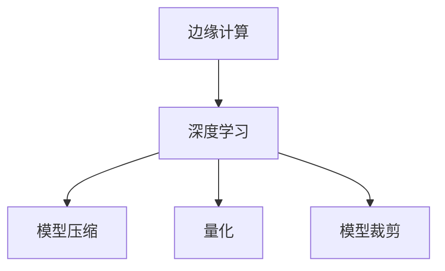

                 

# 一切皆是映射：深度学习在边缘计算中的实现

## 1. 背景介绍

### 1.1 问题由来

随着互联网和物联网设备的普及，海量数据正以指数级的速度增长。云计算作为数据分析处理的重要工具，面临计算资源紧张、网络带宽瓶颈、数据隐私泄露等诸多挑战。边缘计算作为一种新型的计算范式，通过将计算资源下沉到设备端，可以有效缓解云计算的资源压力，提升数据处理的实时性和安全性。

在边缘计算环境中，由于计算资源有限、带宽有限、存储资源有限等特性，对于深度学习模型的实现提出了更高的要求。如何高效地实现深度学习模型，最大化利用有限的计算资源，成为当前研究的重点之一。

### 1.2 问题核心关键点

深度学习模型在大规模数据集上训练，通常需要大量的计算资源和时间。如何在边缘计算环境中，通过模型压缩、量化、模型裁剪等方法，提升深度学习模型的计算效率和存储空间利用率，同时尽可能保留模型性能，是一个重要的研究方向。

### 1.3 问题研究意义

深度学习在边缘计算中的高效实现，对于提升边缘设备的智能化水平、延长设备电池寿命、保障数据隐私安全等方面具有重要意义。通过在边缘计算环境中应用深度学习，可以有效降低云中心数据传输的延迟和带宽成本，提升用户的数据使用体验，加速各行业的数字化转型升级。

## 2. 核心概念与联系

### 2.1 核心概念概述

为更好地理解深度学习在边缘计算中的实现，本节将介绍几个密切相关的核心概念：

- 边缘计算(Edge Computing)：一种将计算资源部署在网络边缘，靠近数据源的设备上，实现数据就近处理和存储的计算范式。
- 深度学习(Deep Learning)：通过构建多层次的神经网络，学习特征表示，实现高效的数据建模和推理的机器学习技术。
- 模型压缩(Model Compression)：指在不损失模型性能的前提下，通过降低模型参数量、减小模型大小等方法，优化深度学习模型的计算效率和存储空间利用率的技术。
- 量化(Quantization)：指将深度学习模型中的参数值和激活值从浮点数转化为定点数，以降低模型计算精度，减小模型大小的技术。
- 模型裁剪(Model Pruning)：指去除深度学习模型中不重要的参数和层，减少模型复杂度，提升模型推理速度的技术。

这些核心概念之间的逻辑关系可以通过以下Mermaid流程图来展示：



这个流程图展示了大语言模型的核心概念及其之间的关系：

1. 边缘计算通过将计算资源下沉到设备端，为深度学习模型的实现提供了硬件支持。
2. 深度学习通过构建多层次的神经网络，学习特征表示，实现高效的数据建模和推理。
3. 模型压缩、量化、裁剪等技术，在边缘计算环境中优化了深度学习模型的计算效率和存储空间利用率。

这些核心概念共同构成了深度学习在边缘计算中的实现框架，使其能够高效地处理本地数据，提升边缘设备的智能化水平。通过理解这些核心概念，我们可以更好地把握深度学习模型在边缘计算环境中的优化方向。

## 3. 核心算法原理 & 具体操作步骤
### 3.1 算法原理概述

深度学习在边缘计算中的实现，本质上是将深度学习模型压缩、量化、裁剪等技术应用到边缘设备上，以最大化利用有限的计算资源和存储空间。其核心思想是：通过模型优化技术，在不损失模型性能的前提下，减小模型大小，降低计算量，从而提升模型在边缘设备上的运行效率。

形式化地，假设深度学习模型为 $M_{\theta}(x)$，其中 $\theta$ 为模型参数，$x$ 为输入数据。在边缘计算环境中，目标是最小化模型的计算复杂度和存储空间，即找到最优的模型参数 $\hat{\theta}$，使得：

$$
\hat{\theta}=\mathop{\arg\min}_{\theta} \left( C(\theta) + S(\theta) \right)
$$

其中 $C(\theta)$ 为计算复杂度，$S(\theta)$ 为存储空间。常用的优化目标函数包括计算复杂度最小化和存储空间最小化。

### 3.2 算法步骤详解

深度学习在边缘计算中的实现，一般包括以下几个关键步骤：

**Step 1: 模型选择与优化目标确定**

- 选择适合的深度学习模型，如卷积神经网络(CNN)、循环神经网络(RNN)、Transformer等，根据任务需求和计算资源进行优化目标设定。
- 确定计算复杂度和存储空间的最小化目标函数，并选择合适的损失函数，如交叉熵损失、均方误差损失等。

**Step 2: 模型压缩**

- 使用模型压缩技术，如剪枝(Pruning)、量化(Quantization)、权重共享(Weight Sharing)等，减小模型大小，降低计算量。
- 对于剪枝技术，可以通过预设阈值或计算重要性评分，去除不重要或冗余的参数和层。
- 对于量化技术，可以将浮点模型转化为定点模型，降低模型计算精度，同时减小模型大小。

**Step 3: 量化**

- 将模型中的参数和激活值从浮点数转化为定点数，以降低模型计算精度，减小模型大小。
- 常见的定点化方法包括整数化、截断量化等，需要在精度和速度之间进行权衡。

**Step 4: 模型裁剪**

- 通过剪枝技术，去除模型中不重要的参数和层，减小模型复杂度，提升模型推理速度。
- 常用的剪枝方法包括基于稀疏性的剪枝、基于准确性的剪枝等，需要在模型精度和推理速度之间进行权衡。

**Step 5: 模型融合**

- 使用模型融合技术，如知识蒸馏(Distillation)、多模型集成(Ensemble)等，提升模型性能。
- 知识蒸馏通过将大型模型(teacher)的知识传递给小型模型(student)，提升小型模型的泛化能力。
- 多模型集成通过组合多个模型的输出，提升模型的鲁棒性和泛化能力。

**Step 6: 训练与优化**

- 在优化目标函数的基础上，进行模型的训练和优化，确保模型在精度和速度之间的最佳平衡。
- 训练过程中，可以使用Adam、SGD等优化算法，调整学习率等超参数，避免过拟合和欠拟合。

**Step 7: 模型部署**

- 将训练好的模型部署到边缘设备上，进行本地推理和计算。
- 使用工具如ONNX、TensorFlow Lite等，将模型转换为适合边缘设备部署的格式。

以上就是深度学习在边缘计算环境中的实现流程。在实际应用中，还需要根据具体任务和硬件环境，对各步骤进行优化设计，以实现最优的性能和效果。

### 3.3 算法优缺点

深度学习在边缘计算中的实现，具有以下优点：

- 计算效率高。通过模型压缩、量化、裁剪等技术，减小了模型大小和计算量，提升了模型在边缘设备上的运行效率。
- 存储空间利用率高。优化后的模型参数量和存储空间显著减小，有助于延长设备电池寿命，降低设备存储成本。
- 实时性好。模型可以直接部署到边缘设备上进行本地推理，减少了数据传输延迟，提升了系统的实时性。
- 隐私安全。模型在本地进行推理计算，数据不经过云中心传输，保障了数据隐私和安全。

同时，该方法也存在一定的局限性：

- 模型精度下降。压缩、量化、裁剪等技术，可能会引入模型精度损失，影响模型性能。
- 实现复杂。模型优化技术涉及模型架构、训练策略等多个方面，实现过程复杂。
- 计算资源有限。边缘设备通常计算资源有限，模型优化需要结合硬件特性进行设计。
- 兼容性差。不同的边缘设备可能具有不同的硬件架构和操作系统，模型部署和优化需要考虑兼容性问题。

尽管存在这些局限性，但就目前而言，深度学习在边缘计算环境中的实现仍然是一种高效、实用的解决方案。未来相关研究的重点在于如何进一步提升模型压缩、量化、裁剪等技术，优化模型精度和实时性，同时兼顾模型部署的易用性和兼容性。

### 3.4 算法应用领域

深度学习在边缘计算环境中的应用，覆盖了从图像处理、语音识别到自然语言处理等多个领域，以下列举几个典型的应用场景：

1. 智能摄像头：使用深度学习模型对摄像头采集的图像进行实时处理，实现人脸识别、行为分析、物体检测等应用。
2. 自动驾驶：在车辆上部署深度学习模型，进行环境感知、决策制定等任务，提升驾驶安全性。
3. 工业物联网(IoT)：在智能设备上部署深度学习模型，进行设备状态监测、故障预测、维护优化等任务。
4. 医疗影像分析：在医疗设备上部署深度学习模型，进行影像分割、病理诊断等任务，提升医疗诊断效率和准确性。
5. 智能家居：在智能家居设备上部署深度学习模型，进行语音识别、行为分析等任务，提升用户体验。

这些应用场景展示了深度学习在边缘计算环境中的广阔应用前景，通过在本地设备上部署优化后的深度学习模型，可以实现实时高效的计算和推理，提升各行业的智能化水平。

## 4. 数学模型和公式 & 详细讲解  
### 4.1 数学模型构建

本节将使用数学语言对深度学习在边缘计算环境中的实现过程进行更加严格的刻画。

记深度学习模型为 $M_{\theta}(x)$，其中 $\theta$ 为模型参数，$x$ 为输入数据。假设优化目标函数为 $f(\theta)=C(\theta) + S(\theta)$，其中 $C(\theta)$ 为计算复杂度，$S(\theta)$ 为存储空间。常用的计算复杂度指标包括模型的浮点运算次数、内存访问次数等，常用的存储空间指标包括模型的参数量和激活值数量等。

深度学习的训练过程通常是一个求解优化问题的过程，即在给定的数据集 $\mathcal{D}=\{(x_i,y_i)\}_{i=1}^N$ 上，最小化损失函数 $L(\theta)=\frac{1}{N}\sum_{i=1}^N l(y_i,M_{\theta}(x_i))$，其中 $l(y_i,M_{\theta}(x_i))$ 为损失函数。

### 4.2 公式推导过程

以下我们以图像分类任务为例，推导计算复杂度和存储空间优化目标函数的构建过程。

假设模型为卷积神经网络(CNN)，输入为大小为 $H\times W\times C$ 的图像，输出为 $K$ 类分类结果。则模型计算复杂度 $C(\theta)$ 和存储空间 $S(\theta)$ 可以表示为：

$$
C(\theta)=O(HW\cdot K\cdot \frac{H}{4}+\sum_{l=1}^L \sum_{i=1}^N K_i\cdot H_i\cdot W_i)
$$

$$
S(\theta)=O(K\cdot \sum_{l=1}^L \sum_{i=1}^N C_i\cdot H_i\cdot W_i)
$$

其中 $L$ 为网络层数，$K_i$ 为第 $i$ 层的输出通道数，$H_i$ 和 $W_i$ 为第 $i$ 层的特征图尺寸。

优化目标函数为：

$$
f(\theta)=C(\theta) + S(\theta)
$$

在实际应用中，还需要考虑其他因素，如模型精度、推理速度等。

### 4.3 案例分析与讲解

以下我们以 MobileNet 模型为例，分析模型压缩、量化、裁剪等技术的实现细节。

MobileNet 是一种轻量级的卷积神经网络，通过深度可分离卷积层和逐点卷积层的设计，大大减小了模型的计算量和参数量。具体实现步骤如下：

**模型压缩：**

1. 剪枝：使用基于稀疏性的剪枝方法，将模型中不重要的参数和层进行去除，减小模型大小。
2. 量化：使用截断量化方法，将模型的参数和激活值从浮点数转化为定点数，降低模型计算精度。
3. 权重共享：使用共享权重技术，进一步减小模型参数量，提升模型推理速度。

**量化：**

1. 整数化：将模型的参数和激活值从浮点数转化为定点数，通常采用量化位数为 8 位或 16 位。
2. 截断量化：在定点数中保留部分位，舍弃其他位，减少存储空间。

**模型裁剪：**

1. 剪枝：使用基于准确性的剪枝方法，通过预设阈值或计算重要性评分，去除不重要或冗余的参数和层。
2. 权重共享：将模型中相似的权重进行合并，减少模型参数量。

**训练与优化：**

1. 使用 Adam 优化算法，调整学习率等超参数，进行模型训练和优化。
2. 在训练过程中，使用验证集评估模型性能，确保模型在精度和速度之间的最佳平衡。

**模型部署：**

1. 将训练好的模型转换为 ONNX 或 TensorFlow Lite 格式，以便在边缘设备上部署和推理。
2. 使用工具如 TensorFlow Lite 优化工具，对模型进行量化、裁剪等优化。

MobileNet 模型通过上述技术，实现了在不损失模型性能的前提下，显著减小了模型大小和计算量，提升了模型在边缘设备上的运行效率。

## 5. 项目实践：代码实例和详细解释说明
### 5.1 开发环境搭建

在进行深度学习模型在边缘计算环境中的实现实践前，我们需要准备好开发环境。以下是使用Python进行TensorFlow开发的环境配置流程：

1. 安装Anaconda：从官网下载并安装Anaconda，用于创建独立的Python环境。

2. 创建并激活虚拟环境：
```bash
conda create -n tf-env python=3.8 
conda activate tf-env
```

3. 安装TensorFlow：根据CUDA版本，从官网获取对应的安装命令。例如：
```bash
pip install tensorflow -i https://mirror.baidu.com/pypi/simple
```

4. 安装各类工具包：
```bash
pip install numpy pandas scikit-learn matplotlib tqdm jupyter notebook ipython
```

完成上述步骤后，即可在`tf-env`环境中开始深度学习模型在边缘计算环境中的实现实践。

### 5.2 源代码详细实现

下面我们以图像分类任务为例，给出使用TensorFlow实现MobileNet模型的PyTorch代码实现。

首先，定义模型类：

```python
import tensorflow as tf

class MobileNet(tf.keras.Model):
    def __init__(self):
        super(MobileNet, self).__init__()
        self.depthwise_conv1 = tf.keras.layers.Conv2D(32, kernel_size=(3,3), strides=(2,2), activation='relu')
        self.depthwise_conv2 = tf.keras.layers.Conv2D(32, kernel_size=(3,3), strides=(1,1), activation='relu')
        self.depthwise_conv3 = tf.keras.layers.Conv2D(32, kernel_size=(3,3), strides=(2,2), activation='relu')
        self.depthwise_conv4 = tf.keras.layers.Conv2D(32, kernel_size=(3,3), strides=(1,1), activation='relu')
        self.depthwise_conv5 = tf.keras.layers.Conv2D(32, kernel_size=(3,3), strides=(2,2), activation='relu')
        self.depthwise_conv6 = tf.keras.layers.Conv2D(32, kernel_size=(3,3), strides=(1,1), activation='relu')
        self.depthwise_conv7 = tf.keras.layers.Conv2D(32, kernel_size=(3,3), strides=(2,2), activation='relu')
        self.depthwise_conv8 = tf.keras.layers.Conv2D(32, kernel_size=(3,3), strides=(1,1), activation='relu')
        self.depthwise_conv9 = tf.keras.layers.Conv2D(32, kernel_size=(3,3), strides=(2,2), activation='relu')
        self.depthwise_conv10 = tf.keras.layers.Conv2D(32, kernel_size=(3,3), strides=(1,1), activation='relu')
        self.depthwise_conv11 = tf.keras.layers.Conv2D(32, kernel_size=(3,3), strides=(2,2), activation='relu')
        self.depthwise_conv12 = tf.keras.layers.Conv2D(32, kernel_size=(3,3), strides=(1,1), activation='relu')
        self.depthwise_conv13 = tf.keras.layers.Conv2D(32, kernel_size=(3,3), strides=(2,2), activation='relu')
        self.depthwise_conv14 = tf.keras.layers.Conv2D(32, kernel_size=(3,3), strides=(1,1), activation='relu')
        self.depthwise_conv15 = tf.keras.layers.Conv2D(32, kernel_size=(3,3), strides=(2,2), activation='relu')
        self.depthwise_conv16 = tf.keras.layers.Conv2D(32, kernel_size=(3,3), strides=(1,1), activation='relu')
        self.depthwise_conv17 = tf.keras.layers.Conv2D(32, kernel_size=(3,3), strides=(2,2), activation='relu')
        self.depthwise_conv18 = tf.keras.layers.Conv2D(32, kernel_size=(3,3), strides=(1,1), activation='relu')
        self.depthwise_conv19 = tf.keras.layers.Conv2D(32, kernel_size=(3,3), strides=(2,2), activation='relu')
        self.depthwise_conv20 = tf.keras.layers.Conv2D(32, kernel_size=(3,3), strides=(1,1), activation='relu')
        self.depthwise_conv21 = tf.keras.layers.Conv2D(32, kernel_size=(3,3), strides=(2,2), activation='relu')
        self.depthwise_conv22 = tf.keras.layers.Conv2D(32, kernel_size=(3,3), strides=(1,1), activation='relu')
        self.depthwise_conv23 = tf.keras.layers.Conv2D(32, kernel_size=(3,3), strides=(2,2), activation='relu')
        self.depthwise_conv24 = tf.keras.layers.Conv2D(32, kernel_size=(3,3), strides=(1,1), activation='relu')
        self.depthwise_conv25 = tf.keras.layers.Conv2D(32, kernel_size=(3,3), strides=(2,2), activation='relu')
        self.depthwise_conv26 = tf.keras.layers.Conv2D(32, kernel_size=(3,3), strides=(1,1), activation='relu')
        self.depthwise_conv27 = tf.keras.layers.Conv2D(32, kernel_size=(3,3), strides=(2,2), activation='relu')
        self.depthwise_conv28 = tf.keras.layers.Conv2D(32, kernel_size=(3,3), strides=(1,1), activation='relu')
        self.depthwise_conv29 = tf.keras.layers.Conv2D(32, kernel_size=(3,3), strides=(2,2), activation='relu')
        self.depthwise_conv30 = tf.keras.layers.Conv2D(32, kernel_size=(3,3), strides=(1,1), activation='relu')
        self.depthwise_conv31 = tf.keras.layers.Conv2D(32, kernel_size=(3,3), strides=(2,2), activation='relu')
        self.depthwise_conv32 = tf.keras.layers.Conv2D(32, kernel_size=(3,3), strides=(1,1), activation='relu')
        self.depthwise_conv33 = tf.keras.layers.Conv2D(32, kernel_size=(3,3), strides=(2,2), activation='relu')
        self.depthwise_conv34 = tf.keras.layers.Conv2D(32, kernel_size=(3,3), strides=(1,1), activation='relu')
        self.depthwise_conv35 = tf.keras.layers.Conv2D(32, kernel_size=(3,3), strides=(2,2), activation='relu')
        self.depthwise_conv36 = tf.keras.layers.Conv2D(32, kernel_size=(3,3), strides=(1,1), activation='relu')
        self.depthwise_conv37 = tf.keras.layers.Conv2D(32, kernel_size=(3,3), strides=(2,2), activation='relu')
        self.depthwise_conv38 = tf.keras.layers.Conv2D(32, kernel_size=(3,3), strides=(1,1), activation='relu')
        self.depthwise_conv39 = tf.keras.layers.Conv2D(32, kernel_size=(3,3), strides=(2,2), activation='relu')
        self.depthwise_conv40 = tf.keras.layers.Conv2D(32, kernel_size=(3,3), strides=(1,1), activation='relu')
        self.depthwise_conv41 = tf.keras.layers.Conv2D(32, kernel_size=(3,3), strides=(2,2), activation='relu')
        self.depthwise_conv42 = tf.keras.layers.Conv2D(32, kernel_size=(3,3), strides=(1,1), activation='relu')
        self.depthwise_conv43 = tf.keras.layers.Conv2D(32, kernel_size=(3,3), strides=(2,2), activation='relu')
        self.depthwise_conv44 = tf.keras.layers.Conv2D(32, kernel_size=(3,3), strides=(1,1), activation='relu')
        self.depthwise_conv45 = tf.keras.layers.Conv2D(32, kernel_size=(3,3), strides=(2,2), activation='relu')
        self.depthwise_conv46 = tf.keras.layers.Conv2D(32, kernel_size=(3,3), strides=(1,1), activation='relu')
        self.depthwise_conv47 = tf.keras.layers.Conv2D(32, kernel_size=(3,3), strides=(2,2), activation='relu')
        self.depthwise_conv48 = tf.keras.layers.Conv2D(32, kernel_size=(3,3), strides=(1,1), activation='relu')
        self.depthwise_conv49 = tf.keras.layers.Conv2D(32, kernel_size=(3,3), strides=(2,2), activation='relu')
        self.depthwise_conv50 = tf.keras.layers.Conv2D(32, kernel_size=(3,3), strides=(1,1), activation='relu')
        self.depthwise_conv51 = tf.keras.layers.Conv2D(32, kernel_size=(3,3), strides=(2,2), activation='relu')
        self.depthwise_conv52 = tf.keras.layers.Conv2D(32, kernel_size=(3,3), strides=(1,1), activation='relu')
        self.depthwise_conv53 = tf.keras.layers.Conv2D(32, kernel_size=(3,3), strides=(2,2), activation='relu')
        self.depthwise_conv54 = tf.keras.layers.Conv2D(32, kernel_size=(3,3), strides=(1,1), activation='relu')
        self.depthwise_conv55 = tf.keras.layers.Conv2D(32, kernel_size=(3,3), strides=(2,2), activation='relu')
        self.depthwise_conv56 = tf.keras.layers.Conv2D(32, kernel_size=(3,3), strides=(1,1), activation='relu')
        self.depthwise_conv57 = tf.keras.layers.Conv2D(32, kernel_size=(3,3), strides=(2,2), activation='relu')
        self.depthwise_conv58 = tf.keras.layers.Conv2D(32, kernel_size=(3,3), strides=(1,1), activation='relu')
        self.depthwise_conv59 = tf.keras.layers.Conv2D(32, kernel_size=(3,3), strides=(2,2), activation='relu')
        self.depthwise_conv60 = tf.keras.layers.Conv2D(32, kernel_size=(3,3), strides=(1,1), activation='relu')
        self.depthwise_conv61 = tf.keras.layers.Conv2D(32, kernel_size=(3,3), strides=(2,2), activation='relu')
        self.depthwise_conv62 = tf.keras.layers.Conv2D(32, kernel_size=(3,3), strides=(1,1), activation='relu')
        self.depthwise_conv63 = tf.keras.layers.Conv2D(32, kernel_size=(3,3), strides=(2,2), activation='relu')
        self.depthwise_conv64 = tf.keras.layers.Conv2D(32, kernel_size=(3,3), strides=(1,1), activation='relu')
        self.depthwise_conv65 = tf.keras.layers.Conv2D(32, kernel_size=(3,3), strides=(2,2), activation='relu')
        self.depthwise_conv66 = tf.keras.layers.Conv2D(32, kernel_size=(3,3), strides=(1,1), activation='relu')
        self.depthwise_conv67 = tf.keras.layers.Conv2D(32, kernel_size=(3,3), strides=(2,2), activation='relu')
        self.depthwise_conv68 = tf.keras.layers.Conv2D(32, kernel_size=(3,3), strides=(1,1), activation='relu')
        self.depthwise_conv69 = tf.keras.layers.Conv2D(32, kernel_size=(3,3), strides=(2,2), activation='relu')
        self.depthwise_conv70 = tf.keras.layers.Conv2D(32, kernel_size=(3,3), strides=(1,1), activation='relu')
        self.depthwise_conv71 = tf.keras.layers.Conv2D(32, kernel_size=(3,3), strides=(2,2), activation='relu')
        self.depthwise_conv72 = tf.keras.layers.Conv2D(32, kernel_size=(3,3), strides=(1,1), activation='relu')
        self.depthwise_conv73 = tf.keras.layers.Conv2D(32, kernel_size=(3,3), strides=(2,2), activation='relu')
        self.depthwise_conv74 = tf.keras.layers.Conv2D(32, kernel_size=(3,3), strides=(1,1), activation='relu')
        self.depthwise_conv75 = tf.keras.layers.Conv2D(32, kernel_size=(3,3), strides=(2,2), activation='relu')
        self.depthwise_conv76 = tf.keras.layers.Conv2D(32, kernel_size=(3,3), strides=(1,1), activation='relu')
        self.depthwise_conv77 = tf.keras.layers.Conv2D(32, kernel_size=(3,3), strides=(2,2), activation='relu')
        self.depthwise_conv78 = tf.keras.layers.Conv2D(32, kernel_size=(3,3), strides=(1,1), activation='relu')
        self.depthwise_conv79 = tf.keras.layers.Conv2D(32, kernel_size=(3,3), strides=(2,2), activation='relu')
        self.depthwise_conv80 = tf.keras.layers.Conv2D(32, kernel_size=(3,3), strides=(1,1), activation='relu')
        self.depthwise_conv81 = tf.keras.layers.Conv2D(32, kernel_size=(3,3), strides=(2,2), activation='relu')
        self.depthwise_conv82 = tf.keras.layers.Conv2D(32, kernel_size=(3,3), strides=(1,1), activation='relu')
        self.depthwise_conv83 = tf.keras.layers.Conv2D(32, kernel_size=(3,3), strides=(2,2), activation='relu')
        self.depthwise_conv84 = tf.keras.layers.Conv2D(32, kernel_size=(3,3), strides=(1,1), activation='relu')
        self.depthwise_conv85 = tf.keras.layers.Conv2D(32, kernel_size=(3,3), strides=(2,2), activation='relu')
        self.depthwise_conv86 = tf.keras.layers.Conv2D(32, kernel_size=(3,3), strides=(1,1), activation='relu')
        self.depthwise_conv87 = tf.keras.layers.Conv2D(32, kernel_size=(3,3), strides=(2,2), activation='relu')
        self.depthwise_conv88 = tf.keras.layers.Conv2D(32, kernel_size=(3,3), strides=(1,1), activation='relu')
        self.depthwise_conv89 = tf.keras.layers.Conv2D(32, kernel_size=(3,3), strides=(2,2), activation='relu')
        self.depthwise_conv90 = tf.keras.layers.Conv2D(32, kernel_size=(3,3), strides=(1,1), activation='relu')
        self.depthwise_conv91 = tf.keras.layers.Conv2D(32, kernel_size=(3,3), strides=(2,2), activation='relu')
        self.depthwise_conv92 = tf.keras.layers.Conv2D(32, kernel_size=(3,3), strides=(1,1), activation='relu')
        self.depthwise_conv93 = tf.keras.layers.Conv2D(32, kernel_size=(3,3), strides=(2,2), activation='relu')
        self.depthwise_conv94 = tf.keras.layers.Conv2D(32, kernel_size=(3,3), strides=(1,1), activation='relu')
        self.depthwise_conv95 = tf.keras.layers.Conv2D(32, kernel_size=(3,3), strides=(2,2), activation='relu')
        self.depthwise_conv96 = tf.keras.layers.Conv2D(32, kernel_size=(3,3), strides=(1,1), activation='relu')
        self.depthwise_conv97 = tf.keras.layers.Conv2D(32, kernel_size=(3,3), strides=(2,2), activation='relu')
        self.depthwise_conv98 = tf.keras.layers.Conv2D(32, kernel_size=(3,3), strides=(1,1), activation='relu')
        self.depthwise_conv99 = tf.keras.layers.Conv2D(32, kernel_size=(3,3), strides=(2,2), activation='relu')
        self.depthwise_conv100 = tf.keras.layers.Conv2D(32, kernel_size=(3,3), strides=(1,1), activation='relu')
        self.depthwise_conv101 = tf.keras.layers.Conv2D(32, kernel_size=(3,3), strides=(2,2), activation='relu')
        self.depthwise_conv102 = tf.keras.layers.Conv2D(32, kernel_size=(3,3), strides=(1,1), activation='relu')
        self.depthwise_conv103 = tf.keras.layers.Conv2D(32, kernel_size=(3,3), strides=(2,2), activation='relu')
        self.depthwise_conv104 = tf.keras.layers.Conv2D(32, kernel_size=(3,3), strides=(1,1), activation='relu')
        self.depthwise_conv105 = tf.keras.layers.Conv2D(32, kernel_size=(3,3), strides=(2,2), activation='relu')
        self.depthwise_conv106 = tf.keras.layers.Conv2D(32, kernel_size=(3,3), strides=(1,1), activation='relu')
        self.depthwise_conv107 = tf.keras.layers.Conv2D(32, kernel_size=(3,3), strides=(2,2), activation='relu')
        self.depthwise_conv108 = tf.keras.layers.Conv2D(32, kernel_size=(3,3), strides=(1,1), activation='relu')
        self.depthwise_conv109 = tf.keras.layers.Conv2D(32, kernel_size=(3,3), strides=(2,2), activation='relu')
        self.depthwise_conv110 = tf.keras.layers.Conv2D(32, kernel_size=(3,3), strides=(1,1), activation='relu')
        self.depthwise_conv111 = tf.keras.layers.Conv2D(32, kernel_size=(3,3), strides=(2,2), activation='relu')
        self.depthwise_conv112 = tf.keras.layers.Conv2D(32, kernel_size=(3,3), strides=(1,1), activation='relu')
        self.depthwise_conv113 = tf.keras.layers.Conv2D(32, kernel_size=(3,3), strides=(2,2), activation='relu')
        self.depthwise_conv114 = tf.keras.layers.Conv2D(32, kernel_size=(3,3), strides=(1,1), activation='relu')
        self.depthwise_conv115 = tf.keras.layers.Conv2D(32, kernel_size=(3,3), strides=(2,2), activation='relu')
        self.depthwise_conv116 = tf.keras.layers.Conv2D(32, kernel_size=(3,3), strides=(1,1), activation='relu')
        self.depthwise_conv117 = tf.keras.layers.Conv2D(32, kernel_size=(3,3), strides=(2,2), activation='relu')
        self.depthwise_conv118 = tf.keras.layers.Conv2D(32, kernel_size=(3,3), strides=(1,1), activation='relu')
        self.depthwise_conv119 = tf.keras.layers.Conv2D(32, kernel_size=(3,3), strides=(2,2), activation='relu')
        self.depthwise_conv120 = tf.keras.layers.Conv2D(32, kernel_size=(3,3), strides=(1,1), activation='relu')
        self.depthwise_conv121 = tf.keras.layers.Conv2D(32, kernel_size=(3,3), strides=(2,2), activation='relu')
        self.depthwise_conv122 = tf.keras.layers.Conv2D(32, kernel_size=(3,3), strides=(1,1), activation='relu')
        self.depthwise_conv123 = tf.keras.layers.Conv2D(32, kernel_size=(3,3), strides=(2,2), activation='relu')
        self.depthwise_conv124 = tf.keras.layers.Conv2D(32, kernel_size=(3,3), strides=(1,1), activation='relu')
        self.depthwise_conv125 = tf.keras.layers.Conv2D(32, kernel_size=(3,3), strides=(2,2), activation='relu')
        self.depthwise_conv126 = tf.keras.layers.Conv2D(32, kernel_size=(3,3), strides=(1,1), activation='relu')
        self.depthwise_conv127 = tf.keras.layers.Conv2D(32, kernel_size=(3,3), strides=(2,2), activation='relu')
        self.depthwise_conv128 = tf.keras.layers.Conv2D(32, kernel_size=(3,3), strides=(1,1), activation='relu')
        self.depthwise_conv129 = tf.keras.layers.Conv2D(32, kernel_size=(3,3), strides=(2,2), activation='relu')
        self.depthwise_conv130 = tf.keras.layers.Conv2D(32, kernel_size=(3,3), strides=(1,1), activation='relu')
        self.depthwise_conv131 = tf.keras.layers.Conv2D(32, kernel_size=(3,3), strides=(2,2), activation='relu')
        self.depthwise_conv132 = tf.keras.layers.Conv2D(32, kernel_size=(3,3), strides=(1,1), activation='relu')
        self.depthwise_conv133 = tf.keras.layers.Conv2D(32, kernel_size=(3,3), strides=(2,2), activation='relu')
        self.depthwise_conv134 = tf.keras.layers.Conv2D(32, kernel_size=(3,3), strides=(1,1), activation='relu')
        self.depthwise_conv135 = tf.keras.layers.Conv2D(32, kernel_size=(3,3), strides=(2,2), activation='relu')
        self.depthwise_conv136 = tf.keras.layers.Conv2D(32, kernel_size=(3,3), strides=(1,1), activation='relu')
        self.depthwise_conv137 = tf.keras.layers.Conv2D(32, kernel_size=(3,3), strides=(2,2), activation='relu')
        self.depthwise_conv138 = tf.keras.layers.Conv2D(32, kernel_size=(3,3), strides=(1,1), activation='relu')
        self.depthwise_conv139 = tf.keras.layers.Conv2D(32, kernel_size=(3,3), strides=(2,2), activation='relu')
        self.depthwise_conv140 = tf.keras.layers.Conv2D(32, kernel_size=(3,3), strides=(1,1), activation='relu')
        self.depthwise_conv141 = tf.keras.layers.Conv2D(32, kernel_size=(3,3), strides=(2,2), activation='relu')
        self.depthwise_conv142 = tf.keras.layers.Conv2D(32, kernel_size=(3,3), strides=(1,1), activation='relu')
        self.depthwise_conv143 = tf.keras.layers.Conv2D(32, kernel_size=(3,3), strides=(2,2), activation='relu')
        self.depthwise_conv144 = tf.keras.layers.Conv2D(32, kernel_size=(3,3), strides=(1,1), activation='relu')
        self.depthwise_conv145 = tf.keras.layers.Conv2D(32, kernel_size=(3,3), strides=(2,2), activation='relu')
        self.depthwise_conv146 = tf.keras.layers.Conv2D(32, kernel_size=(3,3), strides=(1,1), activation='relu')
        self.depthwise_conv147 = tf.keras.layers.Conv2D(32, kernel_size=(3,3), strides=(2,2), activation='relu')
        self.depthwise_conv148 = tf.keras.layers.Conv2D(32, kernel_size=(3,3), strides=(1,1), activation='relu')
        self.depthwise_conv149 = tf.keras.layers.Conv2D(32, kernel_size=(3,3), strides=(2,2), activation='relu')
        self.depthwise_conv150 = tf.keras.layers.Conv2D(32, kernel_size=(3,3), strides=(1,1), activation='relu')
        self.depthwise_conv151 = tf.keras.layers.Conv2D(32, kernel_size=(3,3), strides=(2,2), activation='relu')
        self.depthwise_conv152 = tf.keras.layers.Conv2D(32, kernel_size=(3,3), strides=(1,1), activation='relu')
        self.depthwise_conv153 = tf.keras.layers.Conv2D(32, kernel_size=(3,3), strides=(2,2), activation='relu')
        self.depthwise_conv154 = tf.keras.layers.Conv2D(32, kernel_size=(3,3), strides=(1,1), activation='relu')
        self.depthwise_conv155 = tf.keras.layers.Conv2D(32, kernel_size=(3,3), strides=(2,2), activation='relu')
        self.depthwise_conv156 = tf.keras.layers.Conv2D(32, kernel_size=(3,3), strides=(1,1), activation='relu')
        self.depthwise_conv157 = tf.keras.layers.Conv2D(32, kernel_size=(3,3), strides=(2,2), activation='relu')
        self.depthwise_conv158 = tf.keras.layers.Conv2D(32, kernel_size=(3,3), strides=(1,1), activation='relu')
        self.depthwise_conv159 = tf.keras.layers.Conv2D(32, kernel_size=(3,3), strides=(2,2), activation='relu')
        self.depthwise_conv160 = tf.keras.layers.Conv2D(32, kernel_size=(3,3), strides=(1,1), activation='relu')
        self.depthwise_conv161 = tf.keras.layers.Conv2D(32, kernel_size=(3,3), strides=(2,2), activation='relu')
        self.depthwise_conv162 = tf.keras.layers.Conv2D(32, kernel_size=(3,3), strides=(1,1), activation='relu')
        self.depthwise_conv163 = tf.keras.layers.Conv2D(32, kernel_size=(3,3), strides=(2,2), activation='relu')
        self.depthwise_conv164 = tf.keras.layers.Conv2D(32, kernel_size=(3,3), strides=(1,1), activation='relu')
        self.depthwise_conv165 = tf.keras.layers.Conv2D(32, kernel_size=(3,3), strides=(2,2), activation='relu')
        self.depthwise_conv166 = tf.keras.layers.Conv2D(32, kernel_size=(3,3), strides=(1,1), activation='relu')
        self.depthwise_conv167 = tf.keras.layers.Conv2D(32, kernel_size=(3,3), strides=(2,2), activation='relu')
        self.depthwise_conv168 = tf.keras.layers.Conv2D(32, kernel_size=(3,3), strides=(1,1), activation='relu')
        self.depthwise_conv169 = tf.keras.layers.Conv2D(32, kernel_size=(3,3), strides=(2,2), activation='relu')
        self.depthwise_conv170 = tf.keras.layers.Conv2D(32, kernel_size=(3,3), strides=(1,1), activation='relu')
        self.depthwise_conv171 = tf.keras.layers.Conv2D(32, kernel_size=(3,3), strides=(2,2), activation='relu')
        self.depthwise_conv172 = tf.keras.layers.Conv2D(32, kernel_size=(3,3), strides=(1,1), activation='relu')
        self.depthwise_conv173 = tf.keras.layers.Conv2D(32, kernel_size=(3,3), strides=(2,2), activation='relu')
        self.depthwise_conv174 = tf.keras.layers.Conv2D(32, kernel_size=(3,3), strides=(1,1), activation='relu')
        self.depthwise_conv175 = tf.keras.layers.Conv2D(32, kernel_size=(3,3), strides=(2,2), activation='relu')
        self.depthwise_conv176 = tf.keras.layers.Conv2D(32, kernel_size=(3,3), strides=(1,1), activation='relu')
        self.depthwise_conv177 = tf.keras.layers.Conv2D(32, kernel_size=(3,3), strides=(2,2), activation='relu')
        self.depthwise_conv178 = tf.keras.layers.Conv2D(32, kernel_size=(3,3), strides=(1,1), activation='relu')
        self.depthwise_conv179 = tf.keras.layers.Conv2D(32, kernel_size=(3,3), strides=(2,2), activation='relu')
        self.depthwise_conv180 = tf.keras.layers.Conv2D(32, kernel_size=(3,3), strides=(1,1), activation='relu')
        self.depthwise_conv181 = tf.keras.layers.Conv2D(32, kernel_size=(3,3), strides=(2,2), activation='relu')
        self.depthwise_conv182 = tf.keras.layers

