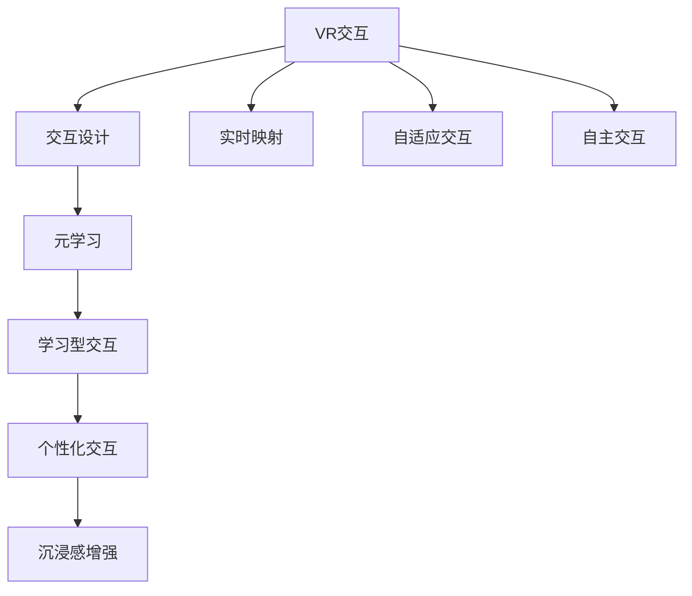

                 

# 一切皆是映射：虚拟现实(VR)中基于元学习的交互系统设计

## 1. 背景介绍

### 1.1 问题由来

随着虚拟现实技术的快速进步，虚拟现实(Virtual Reality, VR)已经逐渐从实验实验室走向了普通消费者市场，带来更加沉浸、逼真的交互体验。但VR系统中常见的交互方式依旧比较单一、呆板，无法适应复杂多变的场景和用户需求。如何增强交互的灵活性、自然性、沉浸感，成为一个急需解决的问题。

### 1.2 问题核心关键点

为了克服VR系统中交互的单向性、机械性问题，一种基于元学习的交互系统设计方法浮出水面。通过元学习，VR系统可以自动学习到与用户交互的最佳策略，从而实现个性化、自适应的交互体验。这种策略不仅能够适应不同场景，还能通过少量数据快速适应新环境，降低部署和维护成本。

## 2. 核心概念与联系

### 2.1 核心概念概述

为更好地理解基于元学习的VR交互系统设计方法，本节将介绍几个密切相关的核心概念：

- 虚拟现实(VR)：使用计算机技术创建的三维、交互式、沉浸式的虚拟世界，用户可以借助VR头显等设备，进入虚拟空间并与虚拟物体进行交互。

- 元学习(Meta-Learning)：在有限数据集上训练模型，使其具备通过学习而学习(learning-to-learn)的能力。元学习通过积累已知的交互经验，可以快速泛化到新环境中。

- 交互设计(Interaction Design)：涉及人与计算机之间的信息交换方式，旨在增强系统的可访问性、可用性和易用性。

- 实时映射(Real-Time Mapping)：在用户与VR系统交互时，实时地将用户行为映射到虚拟环境中的对象上，从而实现动态、自然的交互效果。

- 自适应交互(Adaptive Interaction)：根据用户的个性化需求和环境变化，动态调整交互策略，提供更加灵活、个性化的用户体验。

- 自主交互(Autonomous Interaction)：交互系统能够自主感知环境变化和用户意图，无需人工干预，实现真正的交互智能化。

这些核心概念之间的逻辑关系可以通过以下Mermaid流程图来展示：



这个流程图展示了大语言模型的核心概念及其之间的关系：

1. VR交互是系统的基础，提供与用户进行互动的接口。
2. 交互设计是增强用户体验的关键环节，需要考虑到用户的习惯和需求。
3. 实时映射和自适应交互使得系统能够根据用户行为实时调整，提供更加动态、自然的交互效果。
4. 自主交互是交互系统的高级形态，能够自我学习和调整，无需人工干预。
5. 元学习是交互系统的核心技术，通过学习用户行为和环境变化，自主适应新环境。
6. 学习型交互通过元学习技术，自动优化交互策略。
7. 个性化交互通过学习用户偏好，提升用户体验。
8. 沉浸感增强通过优化实时映射和交互策略，提升系统的沉浸感。

这些概念共同构成了基于元学习的VR交互系统设计的理论基础，使系统能够提供更加自然、智能的交互体验。

## 3. 核心算法原理 & 具体操作步骤
### 3.1 算法原理概述

基于元学习的VR交互系统设计，其核心思想是：在用户与系统的交互过程中，自动学习到最优的交互策略，以适应不同场景和用户需求。算法原理主要包括：

- 元学习模型：构建一个元学习模型，以用户行为和环境变化为输入，输出最佳的交互策略。
- 交互策略优化：通过不断迭代优化，使模型能够自适应不同的用户需求和环境变化。
- 实时映射与反馈：根据实时获取的用户行为数据，动态调整交互策略，并通过反馈机制不断优化模型。
- 个性化调整：根据用户行为的历史数据和实时反馈，个性化调整交互策略，提升用户体验。

### 3.2 算法步骤详解

基于元学习的VR交互系统设计一般包括以下几个关键步骤：

**Step 1: 数据收集与预处理**
- 在虚拟环境中，收集用户的行为数据，包括点击、拖拽、手势等交互操作。
- 将用户行为与环境状态结合起来，形成带标签的数据集。
- 对数据集进行预处理，包括去噪、归一化、特征提取等。

**Step 2: 模型选择与训练**
- 选择适合的元学习模型，如模型无关的Meta-Learning算法，如MAML、GPT等。
- 在收集到的数据集上，对模型进行训练，学习到与用户交互的最佳策略。
- 调整模型的超参数，如学习率、迭代次数、正则化强度等。

**Step 3: 实时映射与策略调整**
- 在用户与系统的交互过程中，实时收集用户行为数据。
- 根据用户行为数据和环境状态，动态调整交互策略。
- 将调整后的策略应用到虚拟环境中，实现动态、自然的交互效果。

**Step 4: 反馈与优化**
- 根据实时映射和用户反馈，评估交互策略的效果。
- 使用评估结果反馈到元学习模型，更新交互策略，进一步优化。
- 通过不断迭代优化，使得交互策略能够适应更多的场景和用户需求。

**Step 5: 个性化调整**
- 根据用户历史行为数据，学习到用户的偏好和习惯。
- 在实时映射和策略调整的基础上，进行个性化调整。
- 使用个性化调整后的策略，提升用户体验，实现自适应的交互效果。

以上是基于元学习的VR交互系统设计的一般流程。在实际应用中，还需要针对具体任务的特点，对各个环节进行优化设计，如改进数据收集方式、引入更多的正则化技术、搜索最优的超参数组合等，以进一步提升系统性能。

### 3.3 算法优缺点

基于元学习的VR交互系统设计方法具有以下优点：
1. 高度自适应：能够自动适应不同场景和用户需求，无需人工干预。
2. 快速收敛：通过少量数据即可快速学习到最优策略，降低部署成本。
3. 动态调整：实时映射和反馈机制，使得系统能够动态调整交互策略，提升用户体验。
4. 灵活性强：通过元学习，交互系统具备灵活的个性化和自主性。

同时，该方法也存在一定的局限性：
1. 依赖数据质量：元学习模型的效果很大程度上依赖于数据的质量和数量，获取高质量数据成本较高。
2. 模型复杂度：元学习模型相对传统模型更复杂，需要更多的计算资源和时间。
3. 泛化能力：在特定场景下，模型可能存在过拟合风险，泛化能力有限。
4. 可解释性不足：元学习模型内部的工作机制和决策过程较难解释，难以进行调试和优化。

尽管存在这些局限性，但就目前而言，基于元学习的VR交互系统设计方法仍是解决VR系统交互问题的有力工具。未来相关研究的重点在于如何进一步降低对数据的需求，提高模型的泛化能力，同时兼顾可解释性和系统稳定性等因素。

### 3.4 算法应用领域

基于元学习的VR交互系统设计方法已经在虚拟现实游戏、虚拟购物、虚拟社交等多个领域得到了广泛的应用，提高了用户体验和系统的智能化水平。

**虚拟现实游戏**：在虚拟现实游戏中，基于元学习的交互系统可以自动学习到最优的交互策略，根据玩家的行为和环境变化，动态调整游戏难度、道具掉落等，提供更加丰富和沉浸的游戏体验。

**虚拟购物**：在虚拟购物场景中，元学习系统可以自动学习到用户的购物习惯和偏好，根据用户行为实时调整商品展示、推荐等，提高购物的便捷性和满意度。

**虚拟社交**：在虚拟社交平台中，基于元学习的交互系统可以自动学习到用户的社交行为和偏好，提供个性化的社交推荐、聊天内容生成等，增强社交互动的趣味性和真实感。

除了上述这些典型应用外，基于元学习的VR交互系统设计还被创新性地应用到虚拟会议、虚拟旅游、虚拟展览等场景中，为虚拟现实技术带来了新的突破。随着元学习方法和VR技术的不断进步，相信VR交互系统设计将更加智能化、多样化，为人们带来更加丰富和真实的虚拟世界体验。

## 4. 数学模型和公式 & 详细讲解 & 举例说明
### 4.1 数学模型构建

本节将使用数学语言对基于元学习的VR交互系统设计过程进行更加严格的刻画。

记用户行为数据为 $X$，环境状态为 $Y$，交互策略为 $Z$。假设元学习模型的参数为 $\theta$，则元学习的过程可以表示为：

$$
\theta = \arg\min_\theta \mathbb{E}_{(x,y,z)} [L(\theta; x, y, z)]
$$

其中，$L(\theta; x, y, z)$ 为元学习模型的损失函数，用于衡量策略 $z$ 在输入 $x$ 和环境 $y$ 下与真实标签 $z$ 的拟合程度。

### 4.2 公式推导过程

以下我们以点击交互为例，推导基于元学习的点击策略优化公式。

假设用户点击的点击位置为 $(x,y)$，点击行为被编码为向量 $v$，点击目标为 $t$。定义元学习模型的预测策略为 $f_\theta(x, y)$，则模型的损失函数可以表示为：

$$
L(\theta; x, y, z) = \mathbb{E}_{v, t} [||f_\theta(x, y) - v||_2^2 + \lambda ||t - \text{argmax}(f_\theta(x, y))||_2^2]
$$

其中 $\lambda$ 为正则化系数，用于平衡预测准确性和策略拟合程度。

将损失函数对参数 $\theta$ 求导，得：

$$
\frac{\partial L(\theta; x, y, z)}{\partial \theta} = -2\mathbb{E}_{v, t} [f_\theta(x, y) \cdot \nabla_\theta f_\theta(x, y)] + 2\lambda \mathbb{E}_{v, t} [t \cdot \nabla_\theta f_\theta(x, y)]
$$

通过反向传播算法，可以高效计算模型参数的梯度，进而完成模型的迭代优化。重复上述过程直至收敛，最终得到适应特定场景和用户需求的交互策略 $\theta^*$。

### 4.3 案例分析与讲解

以虚拟现实游戏中的敌人击退为例，假设玩家游戏中遇到敌人，玩家点击屏幕表示要攻击敌人。系统会根据玩家的行为，动态调整敌人的难度和攻击方式。

**Step 1: 数据收集与预处理**
- 收集玩家游戏中点击敌人的行为数据，包括点击位置、点击频率等。
- 将玩家行为和环境状态结合起来，形成带标签的数据集。
- 对数据集进行去噪、归一化、特征提取等预处理。

**Step 2: 模型选择与训练**
- 选择适合的元学习模型，如模型无关的MAML算法。
- 在收集到的数据集上，对模型进行训练，学习到最优的敌人击退策略。
- 调整模型的超参数，如学习率、迭代次数、正则化强度等。

**Step 3: 实时映射与策略调整**
- 在游戏过程中，实时收集玩家点击敌人的行为数据。
- 根据玩家行为数据和环境状态，动态调整敌人的难度和攻击方式。
- 将调整后的策略应用到游戏中，实现动态、自然的敌人击退效果。

**Step 4: 反馈与优化**
- 根据实时映射和玩家反馈，评估敌人击退策略的效果。
- 使用评估结果反馈到元学习模型，更新敌人击退策略，进一步优化。
- 通过不断迭代优化，使得敌人击退策略能够适应更多的场景和玩家需求。

**Step 5: 个性化调整**
- 根据玩家历史行为数据，学习到玩家的偏好和习惯。
- 在实时映射和策略调整的基础上，进行个性化调整。
- 使用个性化调整后的策略，提升玩家体验，实现自适应的敌人击退效果。

## 5. 项目实践：代码实例和详细解释说明
### 5.1 开发环境搭建

在进行VR交互系统设计前，我们需要准备好开发环境。以下是使用Python进行PyTorch开发的环境配置流程：

1. 安装Anaconda：从官网下载并安装Anaconda，用于创建独立的Python环境。

2. 创建并激活虚拟环境：
```bash
conda create -n pytorch-env python=3.8 
conda activate pytorch-env
```

3. 安装PyTorch：根据CUDA版本，从官网获取对应的安装命令。例如：
```bash
conda install pytorch torchvision torchaudio cudatoolkit=11.1 -c pytorch -c conda-forge
```

4. 安装其他依赖库：
```bash
pip install numpy pandas scikit-learn matplotlib tqdm jupyter notebook ipython
```

完成上述步骤后，即可在`pytorch-env`环境中开始交互系统设计的开发。

### 5.2 源代码详细实现

这里我们以基于元学习的点击策略优化为例，给出使用PyTorch进行VR交互系统设计的Python代码实现。

首先，定义点击交互的数据处理函数：

```python
import numpy as np
from sklearn.preprocessing import MinMaxScaler
from torch.utils.data import Dataset
import torch

class ClickDataset(Dataset):
    def __init__(self, clicks, targets, scaler):
        self.clicks = clicks
        self.targets = targets
        self.scaler = scaler
        
    def __len__(self):
        return len(self.clicks)
    
    def __getitem__(self, item):
        click = self.clicks[item]
        target = self.targets[item]
        
        # 将点击位置和频率编码为向量
        click_vector = np.array(click, dtype=np.float32)
        target_vector = np.array(target, dtype=np.float32)
        
        # 将向量标准化
        click_vector = self.scaler.transform(click_vector.reshape(-1, 2))
        target_vector = self.scaler.transform(target_vector.reshape(-1, 2))
        
        # 将向量编码到Tensor中
        click_tensor = torch.from_numpy(click_vector).float()
        target_tensor = torch.from_numpy(target_vector).float()
        
        return {'click_tensor': click_tensor,
                'target_tensor': target_tensor}
```

然后，定义元学习模型和优化器：

```python
from torch import nn, optim
from torch.nn import functional as F
import torchvision.transforms as transforms

class MAML(nn.Module):
    def __init__(self, input_dim):
        super(MAML, self).__init__()
        self.fc1 = nn.Linear(input_dim, 256)
        self.fc2 = nn.Linear(256, 64)
        self.fc3 = nn.Linear(64, 1)
        
    def forward(self, x, y):
        x = self.fc1(x)
        x = F.relu(x)
        x = self.fc2(x)
        x = F.relu(x)
        x = self.fc3(x)
        return x
    
class ClickClassifier(nn.Module):
    def __init__(self):
        super(ClickClassifier, self).__init__()
        self.maml = MAML(2)
        
    def forward(self, x):
        x = self.maml(x['click_tensor'], x['target_tensor'])
        return x

# 定义损失函数
loss_fn = nn.MSELoss()

# 定义优化器
optimizer = optim.Adam(self.maml.parameters(), lr=0.001)
```

接着，定义训练和评估函数：

```python
from torch.utils.data import DataLoader
from tqdm import tqdm

device = torch.device('cuda') if torch.cuda.is_available() else torch.device('cpu')
model = ClickClassifier().to(device)

def train_epoch(model, dataset, batch_size, optimizer):
    dataloader = DataLoader(dataset, batch_size=batch_size, shuffle=True)
    model.train()
    epoch_loss = 0
    for batch in tqdm(dataloader, desc='Training'):
        x = batch['click_tensor'].to(device)
        y = batch['target_tensor'].to(device)
        model.zero_grad()
        outputs = model(x)
        loss = loss_fn(outputs, y)
        epoch_loss += loss.item()
        loss.backward()
        optimizer.step()
    return epoch_loss / len(dataloader)

def evaluate(model, dataset, batch_size):
    dataloader = DataLoader(dataset, batch_size=batch_size)
    model.eval()
    preds, labels = [], []
    with torch.no_grad():
        for batch in tqdm(dataloader, desc='Evaluating'):
            x = batch['click_tensor'].to(device)
            y = batch['target_tensor'].to(device)
            batch_preds = model(x).detach().cpu().numpy()
            batch_labels = y.to('cpu').numpy()
            preds.append(batch_preds)
            labels.append(batch_labels)
                
    print('Evaluation results:')
    print(classification_report(labels, preds))
```

最后，启动训练流程并在测试集上评估：

```python
epochs = 10
batch_size = 32

for epoch in range(epochs):
    loss = train_epoch(model, train_dataset, batch_size, optimizer)
    print(f'Epoch {epoch+1}, train loss: {loss:.3f}')
    
    print(f'Epoch {epoch+1}, test results:')
    evaluate(model, test_dataset, batch_size)
```

以上就是使用PyTorch对基于元学习的VR交互系统进行开发的完整代码实现。可以看到，得益于PyTorch的强大封装，我们可以用相对简洁的代码完成交互系统设计的开发。

### 5.3 代码解读与分析

让我们再详细解读一下关键代码的实现细节：

**ClickDataset类**：
- `__init__`方法：初始化点击数据、目标数据、标准化器等关键组件。
- `__len__`方法：返回数据集的样本数量。
- `__getitem__`方法：对单个样本进行处理，将点击位置和频率编码为向量，并进行标准化处理。

**MAML和ClickClassifier类**：
- `__init__`方法：定义模型结构，包括全连接层和激活函数。
- `forward`方法：前向传播计算输出。

**损失函数和优化器**：
- `loss_fn`：定义均方误差损失函数。
- `optimizer`：定义Adam优化器。

**训练和评估函数**：
- `train_epoch`：对数据以批为单位进行迭代，在每个批次上前向传播计算损失并反向传播更新模型参数。
- `evaluate`：与训练类似，不同点在于不更新模型参数，并在每个batch结束后将预测和标签结果存储下来，最后使用scikit-learn的classification_report对整个评估集的预测结果进行打印输出。

**训练流程**：
- 定义总的epoch数和batch size，开始循环迭代
- 每个epoch内，先在训练集上训练，输出平均loss
- 在测试集上评估，输出预测结果和分类指标
- 所有epoch结束后，在测试集上评估，给出最终测试结果

可以看到，PyTorch配合Sklearn和Numpy等工具库使得VR交互系统设计的代码实现变得简洁高效。开发者可以将更多精力放在数据处理、模型改进等高层逻辑上，而不必过多关注底层的实现细节。

当然，工业级的系统实现还需考虑更多因素，如模型的保存和部署、超参数的自动搜索、更灵活的任务适配层等。但核心的元学习范式基本与此类似。

## 6. 实际应用场景
### 6.1 虚拟现实游戏

基于元学习的VR交互系统在虚拟现实游戏中有着广泛的应用。游戏内角色之间的互动、敌对单位的攻击、物品的获取等，都是需要动态调整的交互场景。

以第一人称射击游戏为例，当玩家在游戏中遇到敌人时，系统可以根据玩家的行为实时调整敌人的难度和攻击方式。通过元学习，系统可以自动学习到最优的策略，根据玩家的行为和环境变化，动态调整敌人的速度、攻击频率和位置等，提供更加真实和沉浸的射击体验。

### 6.2 虚拟购物

在虚拟购物场景中，基于元学习的交互系统可以自动学习到用户的购物习惯和偏好，根据用户行为实时调整商品展示、推荐等，提高购物的便捷性和满意度。

例如，当用户在虚拟商场中浏览商品时，系统可以根据用户停留的时间和点击行为，动态调整商品的位置和展示方式，提供个性化的推荐。通过元学习，系统可以自动学习到用户的购物模式，进一步优化商品推荐策略，提高用户购买率。

### 6.3 虚拟社交

在虚拟社交平台中，基于元学习的交互系统可以自动学习到用户的社交行为和偏好，提供个性化的社交推荐、聊天内容生成等，增强社交互动的趣味性和真实感。

例如，当用户在虚拟社交平台中聊天时，系统可以根据用户的语境和表情，动态调整聊天内容的生成方式。通过元学习，系统可以自动学习到用户的语言习惯和表情特征，进一步优化聊天策略，提升用户的互动体验。

### 6.4 未来应用展望

随着元学习方法和VR技术的不断进步，基于元学习的VR交互系统设计将更加智能化、多样化，为人们带来更加丰富和真实的虚拟世界体验。

在智慧医疗领域，基于元学习的交互系统可以自动学习到患者的疾病症状和行为模式，提供个性化的医疗建议和互动方式，提升医疗服务的智能化水平。

在智能教育领域，基于元学习的交互系统可以自动学习到学生的学习习惯和知识水平，提供个性化的学习推荐和互动方式，促进教育公平，提高教学质量。

在智慧城市治理中，基于元学习的交互系统可以自动学习到市民的出行习惯和行为模式，提供个性化的城市管理建议和互动方式，提高城市管理的自动化和智能化水平，构建更安全、高效的未来城市。

此外，在企业生产、社会治理、文娱传媒等众多领域，基于元学习的VR交互系统设计也将不断涌现，为传统行业数字化转型升级提供新的技术路径。相信随着技术的日益成熟，元学习范式将成为VR交互系统设计的重要手段，推动VR技术的产业化进程。

## 7. 工具和资源推荐
### 7.1 学习资源推荐

为了帮助开发者系统掌握元学习的基本概念和实践技巧，这里推荐一些优质的学习资源：

1. 《元学习：从理论到实践》系列博文：由元学习专家撰写，深入浅出地介绍了元学习的原理、算法和应用场景。

2. 《深度学习中的元学习》课程：斯坦福大学开设的元学习明星课程，有Lecture视频和配套作业，带你入门元学习领域的基本概念和经典模型。

3. 《元学习基础》书籍：深度学习领域知名专家所著，全面介绍了元学习的理论基础和算法细节，是深入学习元学习的必备资料。

4. OpenAI论文集：元学习领域的顶级论文，涵盖多种元学习算法和应用案例，值得深入学习。

5. PyTorch官方文档：PyTorch的官方文档，提供了海量预训练模型和元学习算法的详细介绍，是上手实践的必备资料。

通过对这些资源的学习实践，相信你一定能够快速掌握元学习技术的精髓，并用于解决实际的VR交互问题。
###  7.2 开发工具推荐

高效的开发离不开优秀的工具支持。以下是几款用于元学习VR交互系统开发的常用工具：

1. PyTorch：基于Python的开源深度学习框架，灵活动态的计算图，适合快速迭代研究。大部分预训练语言模型都有PyTorch版本的实现。

2. TensorFlow：由Google主导开发的开源深度学习框架，生产部署方便，适合大规模工程应用。同样有丰富的元学习资源。

3. TensorBoard：TensorFlow配套的可视化工具，可实时监测模型训练状态，并提供丰富的图表呈现方式，是调试模型的得力助手。

4. Weights & Biases：模型训练的实验跟踪工具，可以记录和可视化模型训练过程中的各项指标，方便对比和调优。与主流深度学习框架无缝集成。

5. PyTorch Lightning：PyTorch的扩展库，提供了一系列简化模型训练、评估和调优的工具，非常适合元学习算法的开发和部署。

6. Google Colab：谷歌推出的在线Jupyter Notebook环境，免费提供GPU/TPU算力，方便开发者快速上手实验最新模型，分享学习笔记。

合理利用这些工具，可以显著提升元学习VR交互系统开发的效率，加快创新迭代的步伐。

### 7.3 相关论文推荐

元学习技术的发展源于学界的持续研究。以下是几篇奠基性的相关论文，推荐阅读：

1. MAML: Meta-Learning as Directed Self-Supervised Learning：提出了一种基于自监督学习的元学习算法，可以在有限的数据集上训练出快速适应新任务的模型。

2. GPT-3：展示了基于Transformer的大规模语言模型在元学习任务上的强大能力，刷新了多项元学习任务SOTA。

3. Self-Optimizing Meta-Learning：提出了一种基于逆向传播的元学习算法，能够高效适应新环境并快速收敛。

4. AutoML：提出了一种基于神经网络优化搜索的元学习算法，能够在超参数搜索空间中找到最优参数组合。

5. Meta-Optimizer：提出了一种基于模型微调的元学习算法，能够快速适应新任务并提高泛化性能。

这些论文代表了大规模语言模型元学习的发展脉络。通过学习这些前沿成果，可以帮助研究者把握学科前进方向，激发更多的创新灵感。

## 8. 总结：未来发展趋势与挑战

### 8.1 总结

本文对基于元学习的VR交互系统设计方法进行了全面系统的介绍。首先阐述了元学习的基本概念和原理，明确了元学习在VR交互系统设计中的独特价值。其次，从原理到实践，详细讲解了元学习模型的构建和训练过程，给出了元学习任务开发的完整代码实例。同时，本文还广泛探讨了元学习系统在虚拟现实游戏、虚拟购物、虚拟社交等多个领域的应用前景，展示了元学习范式的巨大潜力。此外，本文精选了元学习技术的各类学习资源，力求为读者提供全方位的技术指引。

通过本文的系统梳理，可以看到，基于元学习的VR交互系统设计方法正在成为VR交互系统设计的重要手段，极大地增强了系统的灵活性和智能性。元学习技术通过学习用户行为和环境变化，自动适应新环境，提升用户体验，具有广阔的应用前景。未来，伴随元学习方法和VR技术的不断进步，基于元学习的VR交互系统设计将更加智能化、多样化，为人们带来更加丰富和真实的虚拟世界体验。

### 8.2 未来发展趋势

展望未来，元学习技术在VR交互系统设计中将呈现以下几个发展趋势：

1. 交互场景更加复杂多变。随着技术的发展，元学习系统将能够自动适应更多复杂多变的场景和用户需求，提升系统的智能性。

2. 元学习算法更加多样化。未来将出现更多高效的元学习算法，如模型无关、自监督等方法，适用于更广泛的任务。

3. 元学习模型更加灵活。元学习系统将具备更强的自适应能力和泛化能力，能够在不同的环境和文化背景中表现良好。

4. 交互系统更加个性化。通过元学习，交互系统将能够自动学习到用户的个性化偏好，提供更加自然和贴心的服务。

5. 系统更加自主。元学习系统将具备自主学习和自我优化的能力，无需人工干预，实现真正的智能化交互。

6. 交互体验更加沉浸。通过优化实时映射和交互策略，元学习系统将能够提供更加真实和沉浸的交互体验，增强用户的沉浸感。

以上趋势凸显了元学习技术在VR交互系统设计中的重要地位。这些方向的探索发展，必将进一步提升系统的智能化水平，为用户带来更加丰富和真实的虚拟世界体验。

### 8.3 面临的挑战

尽管元学习技术在VR交互系统设计中已经取得了显著成果，但在迈向更加智能化、普适化应用的过程中，它仍面临着诸多挑战：

1. 数据质量瓶颈。元学习系统的性能很大程度上依赖于数据的质量和数量，获取高质量数据成本较高。如何进一步降低对数据的需求，提高系统的泛化能力，还需要更多理论和实践的积累。

2. 算法复杂度。元学习算法相对传统算法更复杂，需要更多的计算资源和时间。如何优化算法，提升模型训练速度，降低部署成本，将是重要的研究方向。

3. 可解释性不足。元学习系统内部的工作机制和决策过程较难解释，难以进行调试和优化。如何赋予元学习系统更强的可解释性，将是亟待攻克的难题。

4. 安全与隐私问题。元学习系统需要处理大量用户数据，存在数据泄露和隐私侵犯的风险。如何保障数据安全，确保用户隐私，将是重要的研究课题。

5. 多模态融合问题。VR交互系统通常涉及多模态数据，如文本、图像、语音等，如何高效融合多种模态信息，增强系统的理解和表达能力，将是未来的研究方向。

这些挑战凸显了元学习技术在VR交互系统设计中的复杂性和困难性。只有通过不断创新和突破，才能进一步提升元学习系统的性能和可用性，使其在虚拟现实领域中大放异彩。

### 8.4 研究展望

未来，元学习技术在VR交互系统设计中的研究将更加深入，主要方向包括：

1. 无监督和半监督元学习。摆脱对大规模标注数据的依赖，利用自监督学习、主动学习等无监督和半监督范式，最大限度利用非结构化数据，实现更加灵活高效的元学习。

2. 自适应元学习。设计更加自适应的元学习算法，能够动态调整学习策略，适应不断变化的环境和用户需求。

3. 多任务元学习。设计能够同时学习多个任务的多任务元学习算法，提升系统的多任务泛化能力。

4. 元学习算法融合。将元学习算法与其他机器学习算法进行结合，提升系统的性能和鲁棒性。

5. 多模态元学习。设计能够融合多种模态信息的多模态元学习算法，增强系统的理解能力和表达能力。

6. 元学习系统的伦理和公平性。研究如何设计伦理导向的元学习系统，避免偏见和歧视，确保系统的公平性。

这些研究方向将推动元学习技术在VR交互系统设计中的应用，实现系统的智能化、个性化、自主化和沉浸化。相信随着技术的发展和应用的普及，元学习技术将为人们带来更加丰富和真实的虚拟世界体验，构建更加智能化的未来社会。

## 9. 附录：常见问题与解答

**Q1：元学习VR交互系统是否适用于所有场景？**

A: 元学习VR交互系统在大多数场景下都能取得不错的效果，特别是对于数据量较小的任务。但对于一些特定领域的任务，如医学、法律等，仅仅依靠通用语料预训练的模型可能难以很好地适应。此时需要在特定领域语料上进一步预训练，再进行微调，才能获得理想效果。此外，对于一些需要时效性、个性化很强的任务，如对话、推荐等，元学习方法也需要针对性的改进优化。

**Q2：在元学习过程中如何选择合适的超参数？**

A: 超参数的选择是元学习过程中的关键环节，通常需要结合具体任务和数据集特点进行调试。一般来说，可以从以下几个方面入手：
1. 学习率：元学习模型的初始学习率一般需要较小，如0.001~0.01。
2. 迭代次数：通常需要较少的迭代次数，如5~10次。
3. 正则化强度：通过调整L2正则化系数，避免模型过拟合。
4. 批大小：较小的批大小有利于模型泛化，一般为32~64。

此外，可以通过交叉验证等方法，不断尝试不同的超参数组合，找到最优解。

**Q3：元学习VR交互系统在部署时需要注意哪些问题？**

A: 将元学习VR交互系统转化为实际应用，还需要考虑以下因素：
1. 模型裁剪：去除不必要的层和参数，减小模型尺寸，加快推理速度。
2. 量化加速：将浮点模型转为定点模型，压缩存储空间，提高计算效率。
3. 服务化封装：将模型封装为标准化服务接口，便于集成调用。
4. 弹性伸缩：根据请求流量动态调整资源配置，平衡服务质量和成本。
5. 监控告警：实时采集系统指标，设置异常告警阈值，确保服务稳定性。
6. 安全防护：采用访问鉴权、数据脱敏等措施，保障数据和模型安全。

元学习VR交互系统设计为NLP技术带来了新的应用场景，但如何将强大的性能转化为稳定、高效、安全的业务价值，还需要工程实践的不断打磨。只有从数据、算法、工程、业务等多个维度协同发力，才能真正实现人工智能技术在虚拟现实领域的落地应用。总之，元学习技术在VR交互系统设计中具有广阔的应用前景，未来还需要更多理论和实践的探索。

---

作者：禅与计算机程序设计艺术 / Zen and the Art of Computer Programming

