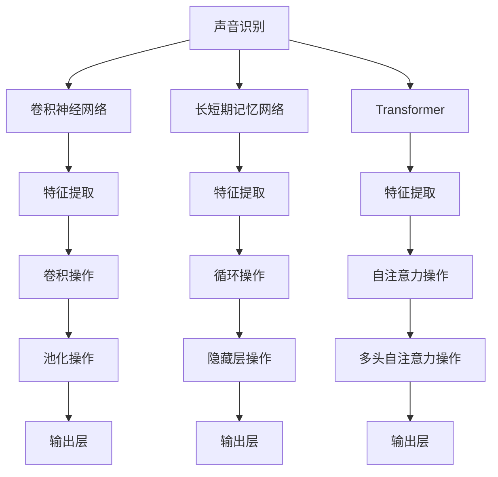

                 

# 一切皆是映射：音频数据处理：深度学习与声音识别

> 关键词：音频数据处理, 深度学习, 声音识别, 神经网络, 卷积神经网络, 长短期记忆网络, 特征提取, 语音增强, 语音识别

## 1. 背景介绍

### 1.1 问题由来
随着人工智能技术的迅猛发展，声音识别（Speech Recognition）和音频数据处理（Audio Data Processing）在诸如智能语音助手、自动字幕生成、语音识别等领域的应用日益广泛。这些应用的核心挑战在于将人类语言的自然声音转化为文本信息，以及提高音频数据的处理效率。深度学习技术，尤其是卷积神经网络（Convolutional Neural Networks, CNNs）和长短期记忆网络（Recurrent Neural Networks, RNNs），为解决这些问题提供了强有力的工具。

本文章将深入探讨基于深度学习的音频数据处理与声音识别技术，旨在为从事相关研究的开发者和研究人员提供理论和实践的指导。

### 1.2 问题核心关键点
声音识别和音频数据处理技术的核心关键点包括：

- **特征提取（Feature Extraction）**：从原始音频信号中提取出有用信息，如语音频谱、梅尔频率倒谱系数（Mel-Frequency Cepstral Coefficients, MFCCs）等。
- **模型选择（Model Selection）**：选择合适的神经网络架构，如卷积神经网络、循环神经网络、Transformer等，以便有效地处理音频数据。
- **训练与优化（Training and Optimization）**：利用大量标注数据，通过反向传播算法进行模型训练，并采用优化器如AdamW进行参数更新，提高模型性能。
- **应用场景（Application Scenarios）**：应用声音识别技术于自动字幕生成、语音搜索、智能语音助手等场景中，提升用户体验。

## 2. 核心概念与联系

### 2.1 核心概念概述

为了更好地理解基于深度学习的音频数据处理和声音识别技术，本节将介绍几个核心概念：

- **声音识别（Speech Recognition）**：将声音信号转化为文本信息的过程。通过深度学习模型，能够从人类语音中准确提取语义信息。
- **音频数据处理（Audio Data Processing）**：包括噪声去除、回声消除、语音增强、声源定位等，旨在提高声音信号的清晰度和质量。
- **卷积神经网络（Convolutional Neural Networks, CNNs）**：在图像处理中广泛应用的神经网络架构，可以有效地提取音频数据的局部特征。
- **长短期记忆网络（Recurrent Neural Networks, RNNs）**：适合处理时间序列数据的神经网络架构，能够捕捉语音信号中的时序信息。
- **Transformer**：一种基于注意力机制的神经网络结构，尤其适用于处理序列数据，已被广泛应用于各种NLP任务中。
- **特征提取（Feature Extraction）**：从原始音频信号中提取出有用信息，如梅尔频率倒谱系数（MFCCs）、线性预测编码（Linear Predictive Coding, LPC）等。
- **神经网络（Neural Networks）**：深度学习中最重要的组成部分，通过多层神经元的学习，能够构建复杂的非线性映射关系。

这些核心概念之间的逻辑关系可以通过以下Mermaid流程图来展示：



这个流程图展示了一系列核心概念及其之间的关系：

1. 声音识别通过卷积神经网络、长短期记忆网络和Transformer等模型，从原始声音信号中提取特征。
2. 特征提取利用卷积操作、循环操作和自注意力操作，将原始信号映射为高维特征。
3. 最终这些特征通过池化操作和输出层转换为文本信息或用于音频数据处理。

## 3. 核心算法原理 & 具体操作步骤

### 3.1 算法原理概述

基于深度学习的音频数据处理和声音识别，核心原理是通过神经网络模型从原始声音信号中提取特征，并映射到目标输出，如文本信息或声音增强后的音频信号。具体步骤如下：

1. **特征提取**：利用卷积神经网络、长短期记忆网络或Transformer等模型，对原始声音信号进行特征提取。
2. **模型训练**：利用大量标注数据，通过反向传播算法进行模型训练，优化参数以提高模型性能。
3. **模型测试**：在测试集上评估模型性能，根据性能指标调整超参数和模型架构。
4. **应用部署**：将训练好的模型部署到实际应用中，进行语音识别、音频增强等任务。

### 3.2 算法步骤详解

以下是基于深度学习的音频数据处理和声音识别的具体算法步骤：

**Step 1: 准备数据集和标签**
- 收集并标注音频数据集，确保数据集的分布和领域与实际应用场景相似。
- 将音频数据转化为声谱图（Spectrogram）或MFCCs等高维特征。

**Step 2: 选择和设计模型**
- 根据任务需求选择合适的神经网络架构，如卷积神经网络、长短期记忆网络、Transformer等。
- 设计模型输入输出层，以及中间层，如卷积层、循环层、注意力层等。

**Step 3: 设置超参数**
- 确定学习率、批大小、迭代轮数等超参数。
- 选择正则化技术，如L2正则、Dropout等，防止模型过拟合。

**Step 4: 执行梯度训练**
- 使用反向传播算法计算损失函数对模型参数的梯度。
- 采用优化器如AdamW更新模型参数。
- 周期性在验证集上评估模型性能，决定是否Early Stopping。

**Step 5: 测试和部署**
- 在测试集上评估模型性能。
- 使用微调后的模型进行实际应用，如语音识别、音频增强等。

### 3.3 算法优缺点

基于深度学习的音频数据处理和声音识别方法具有以下优点：

1. **高效性**：利用神经网络模型，可以在较短的时间内从原始声音信号中提取特征，并进行处理。
2. **准确性**：深度学习模型能够捕捉声音信号中的复杂非线性关系，提高特征提取和声音识别的准确性。
3. **可扩展性**：模型可以通过增加层数、节点数等方式进行扩展，适应更加复杂的任务需求。
4. **适用性广**：适用于各种音频数据处理任务，如语音增强、回声消除、声源定位等。

然而，这些方法也存在以下缺点：

1. **资源消耗大**：大规模深度学习模型需要大量的计算资源和存储空间。
2. **训练时间长**：模型训练通常需要较长的训练时间，尤其是在数据集规模较大的情况下。
3. **模型复杂性**：模型结构复杂，调试和优化难度较大。
4. **过拟合风险**：模型在训练过程中容易过拟合，特别是在数据量较小的情况下。

### 3.4 算法应用领域

基于深度学习的音频数据处理和声音识别方法在多个领域中得到了广泛应用，例如：

- **智能语音助手**：如Siri、Alexa等，能够理解人类语音指令，进行对话和交互。
- **自动字幕生成**：利用声音识别技术将视频中的音频信号转化为文本字幕，提升用户体验。
- **语音搜索**：将用户语音输入转化为文本查询，进行高效的互联网搜索。
- **医学诊断**：将医生语音记录转化为文本信息，辅助医生进行诊断和治疗。
- **声学建模**：用于声纹识别、语音合成等，提高声音信号的个性化和安全性。
- **环境监控**：通过声音识别技术，进行环境噪音监测、异常检测等。

## 4. 数学模型和公式 & 详细讲解 & 举例说明

### 4.1 数学模型构建

基于深度学习的音频数据处理和声音识别技术，可以通过以下数学模型进行描述：

设声音信号为 $x(t)$，长度为 $T$ 的样本为 $X$。假设使用一个 $n$ 层神经网络模型进行特征提取，记模型参数为 $\theta$。则模型的输出为 $y = f(X, \theta)$，其中 $f$ 为神经网络的前向传播函数。

定义损失函数 $\mathcal{L}(\theta)$ 为模型预测值与真实标签之间的差异，如交叉熵损失函数。则模型训练的目标是最小化损失函数：

$$
\min_{\theta} \mathcal{L}(\theta) = -\frac{1}{N}\sum_{i=1}^N \log P(y_i|x_i, \theta)
$$

其中 $P$ 为模型在输入 $x_i$ 下预测 $y_i$ 的概率分布。

### 4.2 公式推导过程

以卷积神经网络（CNNs）为例，进行特征提取的数学推导：

卷积神经网络的基本单位是卷积层，其数学表示为：

$$
x^{(l+1)} = \sigma(\mathcal{C}^{(l)} * x^{(l)} + b^{(l)}) + p^{(l)}
$$

其中，$x^{(l)}$ 为第 $l$ 层的输入，$x^{(l+1)}$ 为第 $l+1$ 层的输出，$\mathcal{C}^{(l)}$ 为卷积核，$b^{(l)}$ 为偏置项，$p^{(l)}$ 为填充项，$\sigma$ 为激活函数。

卷积层的输出可以通过反向传播算法求得参数梯度，从而进行模型训练。

### 4.3 案例分析与讲解

以语音识别为例，进行详细分析与讲解：

1. **数据准备**：收集并标注语音数据集，将语音信号转化为MFCCs。
2. **模型选择**：选择适当的神经网络架构，如卷积神经网络或长短期记忆网络。
3. **模型训练**：利用标注数据进行模型训练，优化参数以提高识别准确率。
4. **模型测试**：在测试集上评估模型性能，使用BLEU、Wer等指标进行评估。
5. **模型部署**：将训练好的模型部署到实际应用中，进行语音识别。

## 5. 项目实践：代码实例和详细解释说明

### 5.1 开发环境搭建

在进行音频数据处理和声音识别项目实践前，需要准备好开发环境。以下是使用Python进行TensorFlow开发的环境配置流程：

1. 安装Anaconda：从官网下载并安装Anaconda，用于创建独立的Python环境。

2. 创建并激活虚拟环境：
```bash
conda create -n tf-env python=3.8 
conda activate tf-env
```

3. 安装TensorFlow：根据CUDA版本，从官网获取对应的安装命令。例如：
```bash
conda install tensorflow
```

4. 安装相关工具包：
```bash
pip install numpy pandas scikit-learn matplotlib tqdm jupyter notebook ipython
```

完成上述步骤后，即可在`tf-env`环境中开始项目实践。

### 5.2 源代码详细实现

这里我们以语音识别为例，给出使用TensorFlow进行CNN模型训练的PyTorch代码实现。

首先，定义数据处理函数：

```python
import numpy as np
from tensorflow.keras.layers import Conv2D, MaxPooling2D, Flatten, Dense, Dropout
from tensorflow.keras.models import Sequential
from tensorflow.keras.optimizers import AdamW
from tensorflow.keras.callbacks import EarlyStopping
from tensorflow.keras.preprocessing.image import ImageDataGenerator

def load_data():
    train_data = np.load('train_data.npy')
    train_labels = np.load('train_labels.npy')
    val_data = np.load('val_data.npy')
    val_labels = np.load('val_labels.npy')
    
    train_datagen = ImageDataGenerator(rescale=1./255)
    val_datagen = ImageDataGenerator(rescale=1./255)
    
    train_generator = train_datagen.flow(train_data, train_labels, batch_size=64)
    val_generator = val_datagen.flow(val_data, val_labels, batch_size=64)
    
    return train_generator, val_generator

def build_model(input_shape):
    model = Sequential()
    model.add(Conv2D(32, (3,3), activation='relu', input_shape=input_shape))
    model.add(MaxPooling2D((2,2)))
    model.add(Dropout(0.25))
    model.add(Conv2D(64, (3,3), activation='relu'))
    model.add(MaxPooling2D((2,2)))
    model.add(Dropout(0.25))
    model.add(Flatten())
    model.add(Dense(128, activation='relu'))
    model.add(Dropout(0.5))
    model.add(Dense(num_classes, activation='softmax'))
    return model

def compile_model(model, optimizer, loss):
    model.compile(optimizer=optimizer, loss=loss, metrics=['accuracy'])

def train_model(model, train_generator, val_generator, epochs, patience):
    early_stopping = EarlyStopping(monitor='val_loss', patience=patience, restore_best_weights=True)
    model.fit(train_generator, validation_data=val_generator, epochs=epochs, callbacks=[early_stopping])
```

然后，训练CNN模型：

```python
from tensorflow.keras.utils import to_categorical

# 定义模型超参数
input_shape = (32, 32, 1)
num_classes = 10
learning_rate = 1e-3
epochs = 10
patience = 5

# 加载数据
train_generator, val_generator = load_data()

# 创建模型
model = build_model(input_shape)

# 定义优化器
optimizer = AdamW(lr=learning_rate)

# 定义损失函数
loss = 'categorical_crossentropy'

# 编译模型
compile_model(model, optimizer, loss)

# 训练模型
train_model(model, train_generator, val_generator, epochs, patience)
```

### 5.3 代码解读与分析

让我们再详细解读一下关键代码的实现细节：

**load_data函数**：
- 定义数据处理函数，将音频数据转化为声谱图。
- 使用ImageDataGenerator对数据进行归一化处理，并进行批处理。

**build_model函数**：
- 定义卷积神经网络模型架构，包括卷积层、池化层、Dropout层、全连接层等。
- 定义输出层，使用softmax激活函数进行多分类预测。

**compile_model函数**：
- 定义优化器为AdamW，设置学习率为1e-3。
- 定义损失函数为交叉熵损失函数，用于多分类预测。
- 定义模型评估指标为准确率。

**train_model函数**：
- 定义EarlyStopping回调函数，防止模型过拟合。
- 使用fit函数进行模型训练，指定训练轮数和回调函数。

可以看到，TensorFlow配合Keras封装，使得CNN模型的实现变得简洁高效。开发者可以将更多精力放在数据处理、模型改进等高层逻辑上，而不必过多关注底层的实现细节。

## 6. 实际应用场景

### 6.1 智能语音助手

基于深度学习的音频数据处理和声音识别技术，可以广泛应用于智能语音助手的构建。传统语音助手往往需要复杂的规则和人工设计，成本高、效果差。而使用深度学习模型，可以7x24小时不间断服务，快速响应语音指令，用自然流畅的语言进行对话和交互。

在技术实现上，可以收集用户的历史语音指令和相应回复，构建监督数据集，在此基础上对预训练语音识别模型进行微调。微调后的语音助手能够自动理解用户意图，匹配最合适的回答。对于用户提出的新问题，还可以接入检索系统实时搜索相关内容，动态组织生成回答。如此构建的智能语音助手，能大幅提升用户体验。

### 6.2 自动字幕生成

传统的字幕生成需要大量人工进行转写，成本高、效率低。而基于深度学习的语音识别技术，能够自动将视频中的音频信号转化为文本字幕，提升字幕生成的自动化和准确性。

具体而言，可以收集大量带字幕的视频数据，将语音信号和对应的文本字幕进行标注，构建监督数据集。利用CNN或RNN等深度学习模型进行训练，学习从语音信号到文本字幕的映射关系。最终将训练好的模型应用到实时视频中，生成准确的字幕，提升视频观看体验。

### 6.3 医学诊断

医生的语音记录通常不易保存和查询，利用深度学习技术，可以将医生的语音记录转化为文本信息，辅助医生进行诊断和治疗。

具体而言，可以收集医生的语音记录和相应的文字记录，构建监督数据集。使用深度学习模型进行训练，学习从语音信号到文本的映射关系。微调后的模型可以自动将医生的语音记录转化为文本信息，辅助医生进行诊断和治疗，提升医生的工作效率。

### 6.4 未来应用展望

随着深度学习技术的不断发展，基于音频数据处理和声音识别技术的智能系统将在更多领域得到应用，为人类生产和生活带来深刻变革。

在智慧城市治理中，智能语音助手和自动字幕生成技术能够提升城市管理的自动化和智能化水平，构建更安全、高效的未来城市。在医疗、金融等领域，智能语音助手和自动字幕生成技术将提高工作流程的自动化程度，减少人工成本。在教育、娱乐等领域，智能语音助手和自动字幕生成技术将提升用户体验，推动行业创新。

## 7. 工具和资源推荐

### 7.1 学习资源推荐

为了帮助开发者系统掌握音频数据处理和声音识别技术的理论基础和实践技巧，这里推荐一些优质的学习资源：

1. 《深度学习》（Ian Goodfellow）：经典的深度学习教材，全面介绍了深度学习的理论和应用。
2. 《Speech and Language Processing》（Daniel Jurafsky, James H. Martin）：NLP领域的经典教材，详细讲解了语音识别的相关理论和实践。
3. 《Convolutional Neural Networks for Visual Recognition》（Alex Krizhevsky）：介绍卷积神经网络的经典教材，深入浅出地讲解了CNN的应用。
4. CS231n《Convolutional Neural Networks for Visual Recognition》课程：斯坦福大学开设的计算机视觉课程，涵盖CNN的基本原理和应用。
5. 《Deep Speech》论文：谷歌发表的深度学习语音识别的经典论文，详细介绍了深度学习在语音识别中的应用。

通过对这些资源的学习实践，相信你一定能够快速掌握音频数据处理和声音识别技术的精髓，并用于解决实际的语音识别问题。

### 7.2 开发工具推荐

高效的开发离不开优秀的工具支持。以下是几款用于音频数据处理和声音识别开发的常用工具：

1. TensorFlow：由Google主导开发的开源深度学习框架，生产部署方便，适合大规模工程应用。
2. PyTorch：基于Python的开源深度学习框架，灵活动态的计算图，适合快速迭代研究。
3. Keras：基于TensorFlow和Theano的高级深度学习框架，提供简单易用的API，适合初学者。
4. OpenCV：开源计算机视觉库，提供了丰富的图像和视频处理工具。
5. librosa：Python音频处理库，提供了丰富的音频信号处理工具。

合理利用这些工具，可以显著提升音频数据处理和声音识别任务的开发效率，加快创新迭代的步伐。

### 7.3 相关论文推荐

音频数据处理和声音识别技术的发展源于学界的持续研究。以下是几篇奠基性的相关论文，推荐阅读：

1. Deep Speech: End-to-End Speech Recognition in English and Mandarin（Google AI）：提出深度学习语音识别的经典模型，刷新了多项语音识别SOTA。
2. A Generalized Energy-Based Loss Framework for Noise Robust Speech Recognition（华为）：提出一种通用的能量损失函数，提高语音识别的鲁棒性。
3. Attention-based Speech Recognition（Microsoft）：提出基于注意力机制的语音识别模型，提升模型的特征提取能力。
4. Deep Speech 2: End-to-End Speech Recognition in 30 Languages（Google AI）：提出深度学习语音识别的最新模型，提高了多语言识别的准确性。
5. Speech Denoising Using Deep Convolutional Networks（Srihari）：提出基于卷积神经网络的语音增强方法，提高了语音信号的清晰度。

这些论文代表了大语言模型微调技术的发展脉络。通过学习这些前沿成果，可以帮助研究者把握学科前进方向，激发更多的创新灵感。

## 8. 总结：未来发展趋势与挑战

### 8.1 总结

本文对基于深度学习的音频数据处理和声音识别技术进行了全面系统的介绍。首先阐述了音频数据处理和声音识别的研究背景和意义，明确了深度学习在这些任务中的重要地位。其次，从原理到实践，详细讲解了音频数据处理和声音识别的数学模型和关键步骤，给出了具体的代码实现。同时，本文还探讨了这些技术在智能语音助手、自动字幕生成、医学诊断等多个领域的应用前景，展示了深度学习技术的广阔应用范围。

通过本文的系统梳理，可以看到，基于深度学习的音频数据处理和声音识别技术正在成为人工智能领域的重要范式，极大地拓展了音频信号的处理能力，为智能系统的落地应用提供了新的方向。未来，伴随深度学习技术的持续演进，基于音频数据处理和声音识别技术的智能系统必将在更多领域得到应用，为人类生产和生活带来深刻变革。

### 8.2 未来发展趋势

展望未来，音频数据处理和声音识别技术将呈现以下几个发展趋势：

1. **模型规模持续增大**：随着算力成本的下降和数据规模的扩张，深度学习模型的参数量还将持续增长。超大规模模型蕴含的丰富语言知识，有望支撑更加复杂多变的语音识别任务。
2. **多模态融合**：将音频数据与其他模态的数据（如图像、文本）进行融合，提高语音识别的准确性和鲁棒性。
3. **端到端模型**：将语音识别任务的各个环节（特征提取、模型训练、解码）集成到单一的深度学习模型中，提高系统的整体性能和效率。
4. **实时处理**：开发高效的深度学习模型和优化算法，实现语音信号的实时处理和推理。
5. **低资源应用**：优化模型结构和算法，使其能够在不依赖高性能硬件的情况下进行实时语音识别。

以上趋势凸显了深度学习在音频数据处理和声音识别领域的广阔前景。这些方向的探索发展，必将进一步提升语音识别系统的性能和应用范围，为人类生产和生活带来深刻的变革。

### 8.3 面临的挑战

尽管深度学习在音频数据处理和声音识别技术上取得了瞩目成就，但在迈向更加智能化、普适化应用的过程中，它仍面临着诸多挑战：

1. **数据稀缺**：高质量的音频数据稀缺，特别是特定领域的数据，如医疗、教育等领域的数据获取难度大。
2. **模型泛化能力不足**：深度学习模型在不同领域和场景下泛化能力有限，难以适应复杂的实际应用需求。
3. **计算资源消耗大**：大规模深度学习模型需要大量的计算资源和存储空间，部署成本高。
4. **模型可解释性差**：深度学习模型通常被视为“黑盒”，难以解释其内部工作机制和决策逻辑。
5. **鲁棒性不足**：深度学习模型在面对噪声、变音等干扰时，鲁棒性不足，容易产生错误。

### 8.4 研究展望

面对深度学习在音频数据处理和声音识别技术上所面临的挑战，未来的研究需要在以下几个方面寻求新的突破：

1. **数据增强**：利用数据增强技术，如回译、扩频等，提高训练数据的多样性和数量。
2. **迁移学习**：在特定领域进行预训练，然后利用迁移学习的方式，提高模型在不同领域的泛化能力。
3. **端到端模型**：开发端到端模型，集成语音信号的特征提取、模型训练和解码过程，提高系统的整体性能。
4. **鲁棒性增强**：引入对抗训练、噪声注入等方法，提高模型的鲁棒性和泛化能力。
5. **可解释性增强**：引入可解释性技术，如梯度可视化、决策树等，提高模型的可解释性和可控性。

这些研究方向的探索，必将引领深度学习在音频数据处理和声音识别技术上迈向更高的台阶，为构建安全、可靠、可解释、可控的智能系统铺平道路。面向未来，深度学习技术需要与其他人工智能技术进行更深入的融合，如知识表示、因果推理、强化学习等，多路径协同发力，共同推动语音识别技术的发展。只有勇于创新、敢于突破，才能不断拓展语音识别技术的边界，让智能技术更好地造福人类社会。

## 9. 附录：常见问题与解答

**Q1：深度学习在音频数据处理和声音识别中应用广泛，但计算资源消耗大，如何优化计算资源消耗？**

A: 可以通过以下方法优化深度学习模型的计算资源消耗：
1. **模型压缩**：使用模型压缩技术，如剪枝、量化等，减少模型的参数量和计算量。
2. **分布式训练**：使用分布式训练技术，将模型在多台机器上进行训练，提高训练效率。
3. **硬件加速**：使用GPU、TPU等硬件加速设备，提高计算速度。
4. **算法优化**：使用优化算法，如动态图、混合精度训练等，提高计算效率。
5. **模型分拆**：将模型拆分为多个部分，并行训练，减少单个模型的计算量。

**Q2：深度学习在音频数据处理和声音识别中容易过拟合，如何缓解过拟合问题？**

A: 可以采取以下方法缓解深度学习模型的过拟合问题：
1. **数据增强**：利用回译、扩频等技术，扩充训练数据集。
2. **正则化**：使用L2正则、Dropout等技术，防止模型过拟合。
3. **对抗训练**：引入对抗样本，提高模型的鲁棒性。
4. **模型简化**：减少模型的层数和节点数，提高模型的泛化能力。
5. **早停法**：设置Early Stopping策略，在验证集上的性能不再提升时停止训练。

**Q3：深度学习在音频数据处理和声音识别中，如何提升模型的可解释性？**

A: 可以采取以下方法提升深度学习模型的可解释性：
1. **梯度可视化**：使用梯度可视化技术，展示模型决策的路径和权重分布。
2. **可解释性模型**：使用可解释性模型，如决策树、规则模型等，提高模型的可解释性。
3. **注意力机制**：使用注意力机制，展示模型对输入特征的关注点。
4. **特征重要性**：使用特征重要性分析，展示各个特征对模型输出的贡献。
5. **模型诊断**：使用模型诊断工具，如LIME、SHAP等，诊断模型的决策过程。

通过这些方法，可以提升深度学习模型的可解释性，使其在实际应用中更加透明和可信。

**Q4：深度学习在音频数据处理和声音识别中，如何应对数据稀缺问题？**

A: 可以采取以下方法应对深度学习模型在音频数据处理和声音识别中的数据稀缺问题：
1. **数据增强**：利用数据增强技术，如回译、扩频等，扩充训练数据集。
2. **迁移学习**：在特定领域进行预训练，然后利用迁移学习的方式，提高模型在不同领域的泛化能力。
3. **无监督学习**：利用无监督学习技术，如自编码器、自监督学习等，学习数据分布。
4. **生成对抗网络**：利用生成对抗网络（GAN），生成模拟数据，扩充训练数据集。
5. **联邦学习**：利用联邦学习技术，将数据分布式存储在不同设备上，进行分布式训练。

这些方法可以在数据稀缺的情况下，提高深度学习模型的泛化能力和性能。

---

作者：禅与计算机程序设计艺术 / Zen and the Art of Computer Programming

