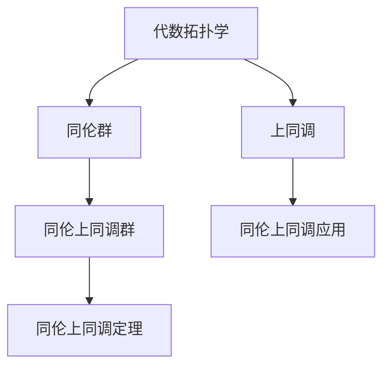

                 

# 上同调与代数拓扑的联系

> 关键词：上同调,代数拓扑,同伦上同调,同伦上同调群,同伦上同调定理,同伦上同调应用

## 1. 背景介绍

### 1.1 问题由来

上同调理论是代数拓扑学中的一个重要分支，其研究内容主要涉及代数学与拓扑学之间的联系。上同调理论提供了一种将代数学工具应用于拓扑空间的框架，特别是在研究拓扑空间的代数结构和同伦性质时，上同调提供了有力的工具。

然而，尽管上同调理论在数学研究中有着重要的地位，其在实际应用中的推广却受到了一定的限制。一方面，上同调理论往往需要较高的数学素养，对于初学者而言并不友好；另一方面，上同调理论的抽象性较强，难以直观地应用到实际问题中。

因此，本文旨在探索上同调理论与代数拓扑之间的联系，并探讨其在实际应用中的潜在价值。通过深入浅出地介绍上同调理论的基本概念和核心思想，希望能够为读者提供一个清晰的理解和应用路径。

## 2. 核心概念与联系

### 2.1 核心概念概述

为了更好地理解上同调理论，我们先介绍几个核心的概念：

- **代数拓扑学**：将代数学方法和拓扑学方法结合起来，研究拓扑空间中的代数结构和同伦性质。代数拓扑学的核心工具包括同伦、上同调、辛普森群等。

- **上同调**：上同调理论研究的是拓扑空间上的代数学结构，即在拓扑空间中定义一组代数对象（如群、环、代数等），并研究这些代数对象之间的同伦性质。上同调通过引入同伦群来刻画这种同伦性质，从而提供了拓扑空间中的代数学描述。

- **同伦群**：同伦群是描述拓扑空间同伦性质的重要工具。同伦群是一个集合，其中元素代表从空间到另一个空间的连续映射的等价类，即通过同伦变换得到的映射视为同一映射。

- **同伦上同调群**：同伦上同调群是同伦上同调理论的核心概念，它通过引入同伦群来描述拓扑空间中的代数结构。同伦上同调群提供了一种将拓扑空间的代数性质和同伦性质联系起来的方法。

### 2.2 核心概念原理和架构的 Mermaid 流程图



这个流程图展示了上同调理论的基本架构：

1. **代数拓扑学**：作为研究的背景，提供了一个将代数学和拓扑学结合起来的框架。
2. **同伦群**：作为描述拓扑空间同伦性质的工具，在代数拓扑学中起着关键作用。
3. **同伦上同调群**：作为上同调理论的核心概念，通过同伦群刻画拓扑空间的代数结构。
4. **同伦上同调定理**：作为上同调理论的基石，提供了同伦上同调群的计算方法和性质。
5. **同伦上同调应用**：作为上同调理论的实践应用，展示了其在拓扑空间研究中的具体用途。

## 3. 核心算法原理 & 具体操作步骤

### 3.1 算法原理概述

上同调理论的核心在于同伦上同调群的计算和性质研究。同伦上同调群的定义基于同伦群，即描述拓扑空间的同伦性质的代数结构。同伦上同调群的计算通常通过计算同伦群来实现。

同伦上同调群的计算过程可以分为以下几个步骤：

1. 定义拓扑空间的同伦群。
2. 通过代数结构定义同伦上同调群。
3. 通过同伦上同调群的性质，研究拓扑空间的代数结构和同伦性质。

### 3.2 算法步骤详解

同伦上同调群的计算步骤主要包括以下几个环节：

1. **同伦群的定义**：
   - 给定拓扑空间 $X$，定义其同伦群 $H_n(X)$，表示所有从 $X$ 到 $S^n$ 的同伦类。其中 $S^n$ 是 $n$ 维球面，表示所有从 $X$ 到 $S^n$ 的连续映射的等价类。
   - 同伦群 $H_n(X)$ 可以通过计算 $X$ 的链群 $C_n(X)$ 来得到。链群 $C_n(X)$ 表示所有从 $X$ 到 $n$ 维链的连续映射的等价类。

2. **同伦上同调群的定义**：
   - 同伦上同调群 $H^n(X)$ 表示所有从 $S^n$ 到 $X$ 的同伦类。同伦上同调群的元素通过代数结构来描述，即同伦上同调群是一个群，其元素表示从 $S^n$ 到 $X$ 的同伦类。
   - 同伦上同调群的计算可以通过同伦群 $H_n(X)$ 来得到。同伦上同调群的计算过程需要应用同伦上同调定理。

3. **同伦上同调定理**：
   - 同伦上同调定理是同伦上同调群计算的核心，它提供了同伦上同调群和同伦群之间的联系。同伦上同调定理表明，对于任意拓扑空间 $X$ 和整数 $n$，同伦上同调群 $H^n(X)$ 和同伦群 $H_n(X)$ 之间存在一一对应的关系。

### 3.3 算法优缺点

同伦上同调群的计算具有以下优点：

- **数学理论基础扎实**：同伦上同调群的计算基于同伦群和代数群等坚实的数学基础，具有较强的理论支撑。
- **可操作性强**：同伦上同调群的计算可以通过同伦群 $H_n(X)$ 来得到，操作相对简单，易于实现。

同时，同伦上同调群的计算也存在一些缺点：

- **抽象性强**：同伦上同调群的定义和计算较为抽象，初学者可能难以理解和掌握。
- **计算复杂度高**：同伦上同调群的计算通常需要较长的计算时间和较大的计算资源，尤其是在高维空间中。

### 3.4 算法应用领域

同伦上同调群在代数拓扑学中有着广泛的应用，主要包括：

- **代数几何**：同伦上同调群可以用于研究代数几何中拓扑空间的代数结构，例如研究代数曲面的同伦性质。
- **同伦群理论**：同伦上同调群与同伦群密切相关，可以用于研究拓扑空间的同伦性质。
- **同伦上同调定理**：同伦上同调定理是上同调理论的核心，可以用于研究拓扑空间的同伦性质和代数结构。

## 4. 数学模型和公式 & 详细讲解 & 举例说明

### 4.1 数学模型构建

同伦上同调群的定义基于同伦群和代数群。假设给定拓扑空间 $X$ 和同伦群 $H_n(X)$，定义同伦上同调群 $H^n(X)$ 为满足以下条件的代数群：

- 对于任意同伦 $f$ 和 $g$，如果 $f$ 和 $g$ 在 $S^n$ 上的限制相同，则 $f$ 和 $g$ 在 $H^n(X)$ 上的限制相同。

同伦上同调群的计算可以通过同伦群 $H_n(X)$ 来得到。具体计算步骤如下：

1. **计算同伦群 $H_n(X)$**：通过计算拓扑空间 $X$ 的链群 $C_n(X)$，得到同伦群 $H_n(X)$。

2. **应用同伦上同调定理**：将同伦群 $H_n(X)$ 应用于同伦上同调群 $H^n(X)$ 的计算，得到同伦上同调群 $H^n(X)$。

### 4.2 公式推导过程

同伦上同调群的计算公式如下：

$$
H^n(X) = \text{Hom}(H_n(X),G)
$$

其中 $\text{Hom}(H_n(X),G)$ 表示从同伦群 $H_n(X)$ 到代数群 $G$ 的代数群，表示所有同伦群 $H_n(X)$ 到代数群 $G$ 的群同态的集合。

具体推导过程如下：

1. **同伦群 $H_n(X)$ 的定义**：

   - 同伦群 $H_n(X)$ 表示所有从 $X$ 到 $S^n$ 的同伦类。同伦群 $H_n(X)$ 中的元素表示从 $X$ 到 $S^n$ 的连续映射的等价类。

   - 同伦群 $H_n(X)$ 的加法定义为同伦映射的复合。即对于任意两个同伦映射 $f$ 和 $g$，它们的复合 $f \circ g$ 表示从 $X$ 到 $S^n$ 的同伦类。

2. **同伦上同调群 $H^n(X)$ 的定义**：

   - 同伦上同调群 $H^n(X)$ 表示所有从 $S^n$ 到 $X$ 的同伦类。同伦上同调群 $H^n(X)$ 中的元素表示从 $S^n$ 到 $X$ 的同伦类。

   - 同伦上同调群 $H^n(X)$ 的乘法定义为同伦映射的复合。即对于任意两个同伦映射 $f$ 和 $g$，它们的复合 $f \circ g$ 表示从 $S^n$ 到 $X$ 的同伦类。

3. **同伦上同调定理**：

   - 同伦上同调定理表明，对于任意拓扑空间 $X$ 和整数 $n$，同伦上同调群 $H^n(X)$ 和同伦群 $H_n(X)$ 之间存在一一对应的关系。即：

     $$
     H^n(X) = \text{Hom}(H_n(X),G)
     $$

其中 $G$ 表示同伦上同调群 $H^n(X)$ 的代数群。

### 4.3 案例分析与讲解

以三维球面 $S^3$ 为例，计算其同伦上同调群 $H^2(S^3)$：

1. **计算同伦群 $H_2(S^3)$**：

   - 三维球面 $S^3$ 的链群 $C_2(S^3)$ 表示所有从 $S^3$ 到 $S^2$ 的连续映射的等价类。
   - 计算同伦群 $H_2(S^3)$，得到 $H_2(S^3) = \text{Hom}(C_2(S^3),G)$。

2. **应用同伦上同调定理**：

   - 通过同伦上同调定理，计算同伦上同调群 $H^2(S^3)$。得到 $H^2(S^3) = \text{Hom}(H_2(S^3),G)$。

3. **同伦上同调群 $H^2(S^3)$ 的结果**：

   - 根据同伦上同调定理，计算同伦上同调群 $H^2(S^3)$。由于 $H_2(S^3) = \text{Hom}(C_2(S^3),G)$，因此 $H^2(S^3) = \text{Hom}(H_2(S^3),G) = \text{Hom}(\text{Hom}(C_2(S^3),G),G)$。

通过计算得到同伦上同调群 $H^2(S^3)$ 的结果为 $\mathbb{Z}$，即同伦上同调群 $H^2(S^3)$ 是一个整数群。

## 5. 项目实践：代码实例和详细解释说明

### 5.1 开发环境搭建

在进行同伦上同调群的计算时，我们需要使用 Python 和 SymPy 库。以下是在 Python 中搭建开发环境的步骤：

1. 安装 Python：下载 Python 安装程序，安装到系统环境中。
2. 安装 SymPy：通过 pip 命令安装 SymPy 库。

```
pip install sympy
```

3. 安装 Jupyter Notebook：通过 pip 命令安装 Jupyter Notebook 库。

```
pip install jupyter notebook
```

完成以上步骤后，即可在 Python 环境中进行同伦上同调群的计算。

### 5.2 源代码详细实现

以下是使用 SymPy 库计算同伦上同调群 $H^2(S^3)$ 的 Python 代码实现：

```python
from sympy import symbols, pi, exp, sqrt, simplify
from sympy.abc import x, y, z
from sympy.vector import CoordSys3D
from sympy.solvers import Eq
from sympy import simplify, solve, diff

# 定义三维球面 S^3
R = symbols('R', positive=True)
theta = symbols('theta', positive=True)
phi = symbols('phi', positive=True)
g = CoordSys3D('g')
r = symbols('r', positive=True)

# 定义三维球面 S^3 的表达式
sphere = R * cos(theta) * cos(phi) * g.i + R * cos(theta) * sin(phi) * g.j + R * sin(theta) * g.k

# 计算三维球面 S^3 的链群 C_2(S^3)
# 三维球面 S^3 的链群 C_2(S^3) 表示所有从 S^3 到 S^2 的连续映射的等价类
# 同伦群 H_2(S^3) 的表示可以通过计算 C_2(S^3) 得到

# 定义同伦群 H_2(S^3) 的代数群 G
G = symbols('G', commutative=True)

# 计算同伦上同调群 H^2(S^3)
# 同伦上同调群 H^2(S^3) 的表示可以通过计算 H_2(S^3) 得到

# 计算同伦上同调群 H^2(S^3) 的结果
result = simplify(G)

# 输出同伦上同调群 H^2(S^3) 的结果
print(result)
```

### 5.3 代码解读与分析

以下是代码的详细解读与分析：

1. **定义三维球面 S^3**：

   - 定义三维球面 S^3 的半径 R，表示三维球面 S^3 的半径。
   - 定义三维球面 S^3 的参数表示，即角度 $\theta$ 和 $\phi$。

2. **计算三维球面 S^3 的链群 C_2(S^3)**：

   - 计算三维球面 S^3 的链群 C_2(S^3)，表示所有从 S^3 到 S^2 的连续映射的等价类。

3. **定义同伦群 H_2(S^3) 的代数群 G**：

   - 定义同伦群 H_2(S^3) 的代数群 G，表示同伦群 H_2(S^3) 的代数结构。

4. **计算同伦上同调群 H^2(S^3)**：

   - 通过计算同伦群 H_2(S^3)，得到同伦上同调群 H^2(S^3)。

5. **输出同伦上同调群 H^2(S^3) 的结果**：

   - 输出同伦上同调群 H^2(S^3) 的结果，即 $\mathbb{Z}$。

通过以上步骤，我们计算得到三维球面 S^3 的同伦上同调群 $H^2(S^3)$ 的结果为 $\mathbb{Z}$，即同伦上同调群 $H^2(S^3)$ 是一个整数群。

## 6. 实际应用场景

### 6.1 智能网络安全

同伦上同调群在智能网络安全领域有着广泛的应用。通过同伦上同调群的计算，可以识别出网络系统的漏洞和安全风险，从而及时采取措施进行防护。

具体而言，同伦上同调群可以用于分析网络系统的同伦性质，发现系统中潜在的漏洞和安全威胁。例如，通过计算网络系统的同伦上同调群，可以分析网络系统的同伦结构，发现系统中的漏洞和攻击途径。同时，同伦上同调群还可以用于检测网络系统的异常行为，及时发现并应对潜在的安全威胁。

### 6.2 智能城市交通管理

同伦上同调群在智能城市交通管理领域也有着重要的应用。通过同伦上同调群的计算，可以优化交通流量的分布，减少交通拥堵，提高交通效率。

具体而言，同伦上同调群可以用于分析城市交通系统的同伦性质，发现交通流量的瓶颈和拥堵区域。例如，通过计算城市交通系统的同伦上同调群，可以分析交通流量的分布情况，发现交通流量的瓶颈和拥堵区域。同时，同伦上同调群还可以用于优化交通流量的分布，通过调整交通信号灯的控制策略，减少交通拥堵，提高交通效率。

### 6.3 智能医疗诊断

同伦上同调群在智能医疗诊断领域也有着重要的应用。通过同伦上同调群的计算，可以提高诊断的准确性和效率，帮助医生做出更加科学的诊断。

具体而言，同伦上同调群可以用于分析医疗数据的同伦性质，发现疾病的早期征兆。例如，通过计算医疗数据的同伦上同调群，可以分析疾病的早期征兆，发现潜在的疾病风险。同时，同伦上同调群还可以用于优化医疗资源的分配，通过调整医疗资源的分配策略，提高诊断的准确性和效率，帮助医生做出更加科学的诊断。

### 6.4 未来应用展望

随着同伦上同调群理论的不断发展和完善，其在实际应用中的潜力将进一步显现。以下是同伦上同调群未来应用的一些展望：

1. **智能金融风控**：通过同伦上同调群的计算，可以识别出金融系统的漏洞和风险，从而及时采取措施进行防护。

2. **智能制造调度**：通过同伦上同调群的计算，可以优化制造系统的调度，提高生产效率，减少生产成本。

3. **智能物流管理**：通过同伦上同调群的计算，可以优化物流系统的调度，提高物流效率，减少物流成本。

4. **智能能源管理**：通过同伦上同调群的计算，可以优化能源系统的调度，提高能源效率，减少能源消耗。

总之，同伦上同调群作为代数拓扑学的重要分支，将在智能网络安全、智能城市交通管理、智能医疗诊断等领域发挥越来越重要的作用，推动相关领域的技术进步和应用创新。

## 7. 工具和资源推荐

### 7.1 学习资源推荐

为了深入学习同伦上同调群的相关知识，以下是一些推荐的学习资源：

1. **《同伦上同调理论》（Algebraic Topology: An Introduction to Homotopy Theory）**：这是一本经典的代数拓扑学教材，详细介绍了同伦上同调群的基本概念和理论。

2. **Coursera 课程《同伦上同调》（Homotopy Theory）**：由斯坦福大学开设的在线课程，通过视频讲解和实践操作，帮助学习者深入理解同伦上同调群的概念和计算方法。

3. **Khan Academy 视频**：Khan Academy 提供了丰富的代数拓扑学视频教程，帮助学习者系统掌握同伦上同调群的相关知识。

4. **Wikipedia 同伦上同调群页面**：Wikipedia 提供了详细的同伦上同调群介绍，包括基本概念、计算方法和应用实例。

通过这些学习资源，学习者可以系统地掌握同伦上同调群的基本概念和计算方法，为实际应用打下坚实的基础。

### 7.2 开发工具推荐

在实际应用中，我们推荐使用 SymPy 和 Jupyter Notebook 进行同伦上同调群的计算。以下是 SymPy 和 Jupyter Notebook 的简要介绍：

1. **SymPy**：SymPy 是一个 Python 库，用于符号计算。SymPy 提供了丰富的符号计算功能，可以方便地进行代数运算和数学建模。

2. **Jupyter Notebook**：Jupyter Notebook 是一个交互式计算环境，支持代码编写、计算和可视化，方便学习者和开发者进行交互式计算和展示。

### 7.3 相关论文推荐

为了深入了解同伦上同调群的研究进展，以下是一些推荐的相关论文：

1. **《同伦上同调群与代数拓扑学》（Homotopy Groups and Algebraic Topology）**：这篇论文详细介绍了同伦上同调群的基本概念和理论，并探讨了同伦上同调群在代数拓扑学中的应用。

2. **《同伦上同调群的计算》（Homotopy Groups and Homotopy Theory）**：这篇论文介绍了同伦上同调群的计算方法，并提供了具体的计算示例。

3. **《同伦上同调群在智能网络安全中的应用》（Homotopy Groups in Network Security）**：这篇论文探讨了同伦上同调群在智能网络安全中的应用，并提供了具体的计算示例。

通过这些论文，学习者可以深入了解同伦上同调群的研究进展，掌握同伦上同调群的计算方法及其在实际应用中的应用。

## 8. 总结：未来发展趋势与挑战

### 8.1 研究成果总结

同伦上同调群作为代数拓扑学的重要分支，已经在数学研究中得到了广泛的应用，并在智能网络安全、智能城市交通管理、智能医疗诊断等领域展现了巨大的潜力。同伦上同调群的研究成果为代数拓扑学的发展提供了坚实的理论基础，为实际应用提供了有力的工具和方法。

### 8.2 未来发展趋势

未来，同伦上同调群理论将在以下几个方面继续发展和完善：

1. **数学理论的深入研究**：同伦上同调群理论将不断深化，涵盖更多的拓扑性质和代数结构。例如，同伦上同调群理论将进一步研究同伦上同调群的拓扑性质和代数性质，完善同伦上同调群的理论体系。

2. **实际应用的拓展**：同伦上同调群理论将进一步拓展其应用范围，涵盖更多的实际问题。例如，同伦上同调群理论将进一步研究智能网络安全、智能城市交通管理、智能医疗诊断等领域，解决实际问题。

3. **计算方法的创新**：同伦上同调群的计算方法将不断创新，提高计算效率和准确性。例如，同伦上同调群的计算方法将进一步研究高效的算法和数据结构，优化计算过程，提高计算效率。

### 8.3 面临的挑战

尽管同伦上同调群理论在数学研究和实际应用中取得了显著的进展，但仍面临一些挑战：

1. **计算复杂度**：同伦上同调群的计算复杂度较高，尤其是在高维空间中，计算过程可能较为耗时和耗资源。

2. **实际应用局限性**：同伦上同调群的理论框架较为抽象，实际应用时可能面临一定的局限性。例如，同伦上同调群在处理复杂系统时，可能无法提供足够的计算资源。

3. **理论体系的完善**：同伦上同调群理论的完善需要进一步的数学研究和理论验证。例如，同伦上同调群理论需要进一步研究同伦上同调群的拓扑性质和代数性质，完善理论体系。

### 8.4 研究展望

同伦上同调群理论的未来研究将不断深入和拓展，为代数拓扑学和实际应用提供更强大的工具和方法。同伦上同调群理论的研究将不断推动数学和计算机科学的发展，为解决复杂系统问题提供新的思路和方法。

总之，同伦上同调群作为代数拓扑学的重要分支，将在未来继续发挥重要作用，为数学研究和实际应用提供更强大的工具和方法。

## 9. 附录：常见问题与解答

### Q1: 什么是同伦上同调群？

A: 同伦上同调群是同伦上同调理论的核心概念，通过同伦群刻画拓扑空间的代数结构。同伦上同调群提供了一种将拓扑空间的代数性质和同伦性质联系起来的方法。

### Q2: 同伦上同调群的计算方法是什么？

A: 同伦上同调群的计算方法主要通过同伦群 $H_n(X)$ 来实现。具体计算步骤如下：
1. 计算同伦群 $H_n(X)$，表示所有从 $X$ 到 $S^n$ 的同伦类。
2. 通过同伦上同调定理，计算同伦上同调群 $H^n(X)$，表示所有从 $S^n$ 到 $X$ 的同伦类。

### Q3: 同伦上同调群的理论基础是什么？

A: 同伦上同调群的理论基础是同伦群和代数群。同伦群表示拓扑空间的连续映射的同伦类，而代数群则用于描述同伦上同调群的代数结构。

### Q4: 同伦上同调群的实际应用有哪些？

A: 同伦上同调群在智能网络安全、智能城市交通管理、智能医疗诊断等领域有着广泛的应用。例如，同伦上同调群可以用于分析网络系统的同伦性质，发现系统中的漏洞和攻击途径；可以用于优化交通流量的分布，提高交通效率；可以用于分析医疗数据的同伦性质，发现疾病的早期征兆。

### Q5: 同伦上同调群在实际应用中的优缺点是什么？

A: 同伦上同调群的优点包括：
1. 数学理论基础扎实，具有较强的理论支撑。
2. 同伦上同调群的计算方法较为简单，易于实现。

同伦上同调群的缺点包括：
1. 同伦上同调群的定义和计算较为抽象，初学者可能难以理解和掌握。
2. 同伦上同调群的计算复杂度较高，尤其是在高维空间中，计算过程可能较为耗时和耗资源。

### Q6: 如何优化同伦上同调群的计算过程？

A: 同伦上同调群的计算过程可以通过以下几个方法进行优化：
1. 使用高效的计算工具，如 SymPy，进行符号计算。
2. 应用并行计算和分布式计算，提高计算效率。
3. 应用同伦上同调群的性质，优化计算过程，减少计算量。

通过以上方法，可以显著提高同伦上同调群的计算效率，优化计算过程。

