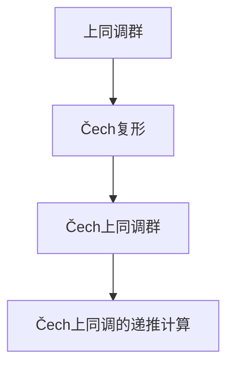

                 

# 上同调中的Čech上同调

上同调理论是拓扑学和代数拓扑中的一个核心概念，用于描述代数结构的复杂性和纯性。其中，Čech上同调是上同调理论中的一个重要分支，它利用拓扑空间中的覆盖结构，构造了一个上同调群的序列，用于描述代数结构的局部和全局性质。本文将详细探讨Čech上同调的原理和应用，并给出具体的数学模型和公式推导，最后通过一个简单的项目实践案例，展示Čech上同调在代数拓扑中的实际应用。

## 1. 背景介绍

### 1.1 问题由来
上同调理论起源于代数拓扑，最早由Alexander Grothendieck在1950年代提出。上同调作为研究代数结构纯性的工具，广泛应用于代数几何、代数字段、同调代数等多个领域。Čech上同调作为上同调的一种具体形式，它的思想和方法在拓扑学和代数拓扑中得到了广泛应用，特别在代数拓扑的复杂结构分析中具有重要意义。

Čech上同调的主要研究内容包括Čech复合体、Čech上同调群和Čech上同调群的计算方法。Čech复合体是一个覆盖空间的代数模型，用于描述空间局部结构的性质。Čech上同调群则是Čech复合体上的上同调群，它可以用来研究代数结构的局部和全局性质。Čech上同调群的计算方法包括Čech复形和Čech上同调群的递推计算。

### 1.2 问题核心关键点
Čech上同调的核心关键点包括：
1. **Čech复合体**：一个覆盖空间的代数模型，由覆盖空间和其中点的邻域构成。
2. **Čech上同调群**：Čech复合体上的上同调群，用于描述代数结构的局部和全局性质。
3. **Čech上同调群的递推计算**：利用Čech复形和递推算法计算Čech上同调群。
4. **Čech上同调的实际应用**：如在代数拓扑中用于研究复形代数结构、局部和全局性质等。

## 2. 核心概念与联系

### 2.1 核心概念概述

为了更好地理解Čech上同调的原理和应用，本节将介绍几个密切相关的核心概念：

- **上同调群**：一个表示代数结构上同调的群，通常用于研究代数结构的同调性质。
- **Čech复形**：一种基于覆盖空间的复形，由Čech复合体上的上同调群构成。
- **Čech上同调群**：Čech复形上的上同调群，用于描述代数结构的局部和全局性质。
- **Čech上同调的递推计算**：利用Čech复形和递推算法计算Čech上同调群的过程。

这些核心概念之间的逻辑关系可以通过以下Mermaid流程图来展示：



这个流程图展示了几者之间的关系：上同调群是Čech复形上的基本群，Čech复形上的Čech上同调群用于描述局部和全局性质，而Čech上同调的递推计算则是计算Čech上同调群的具体方法。

## 3. 核心算法原理 & 具体操作步骤
### 3.1 算法原理概述

Čech上同调的算法原理主要基于Čech复形和上同调群的计算。Čech复形是由覆盖空间和其中点的邻域构成的代数模型，而上同调群的计算则利用Čech复形上的上同调群来描述代数结构的局部和全局性质。

Čech上同调的计算过程大致分为两个步骤：
1. **Čech复形的构建**：将覆盖空间中的点和邻域组合成Čech复合体。
2. **Čech上同调群的计算**：利用Čech复形上的上同调群进行递推计算，得到最终的Čech上同调群。

### 3.2 算法步骤详解

Čech上同调的计算步骤主要包括：
1. 构建Čech复合体。
2. 计算Čech复形上的Čech上同调群。
3. 利用递推公式计算Čech上同调群的各项。

### 3.3 算法优缺点

Čech上同调的主要优点包括：
1. 可以处理复杂覆盖空间的代数结构。
2. 通过递推计算，算法简单高效。
3. 可以描述代数结构的局部和全局性质。

其缺点包括：
1. 对于高维复形，计算量较大。
2. 对计算资源要求较高，尤其是在处理大量数据时。
3. 对于某些复杂的代数结构，可能会出现局部上同调群不消失的现象。

### 3.4 算法应用领域

Čech上同调的应用领域包括但不限于：
1. 代数拓扑中的复形代数结构研究。
2. 局部和全局性质的描述和分析。
3. 上同调群的计算和应用。
4. 代数结构的同调性质研究。

## 4. 数学模型和公式 & 详细讲解 & 举例说明

### 4.1 数学模型构建

Čech上同调的数学模型包括Čech复形和Čech上同调群。

Čech复形由覆盖空间 $X$ 和其中点的邻域 $U$ 构成。设 $X$ 是一个复形，$U$ 是 $X$ 的一个邻域。Čech复合体 $C^k(X, U)$ 定义为 $X$ 上所有 $k$ 次同调群上的所有子群 $A_k$ 构成的代数系统，即：

$$
C^k(X, U) = \{A_k \subset H_k(X, \mathbb{Z}) \mid A_k \text{ is a subgroup of } H_k(X, \mathbb{Z})\}
$$

其中 $H_k(X, \mathbb{Z})$ 表示 $X$ 上的 $k$ 次同调群。Čech复形中的元素满足以下运算规则：

$$
A_k \cdot B_k = A_k \cap B_k
$$

Čech上同调群 $H^k(X, U)$ 则是Čech复形 $C^k(X, U)$ 上的上同调群，定义为：

$$
H^k(X, U) = \text{Ker}(C_k \to C_{k-1})
$$

其中 $C_k \to C_{k-1}$ 是从 $C^k(X, U)$ 到 $C^{k-1}(X, U)$ 的映射。

### 4.2 公式推导过程

Čech上同调的递推计算过程如下：

1. 设 $C^0(X, U) = \{A_0 \subset H_0(X, \mathbb{Z})\}$，其中 $A_0$ 是 $H_0(X, \mathbb{Z})$ 的一个子群。
2. 设 $C^1(X, U) = \{A_1 \subset H_1(X, \mathbb{Z}) \mid A_1 \cdot C^0(X, U) = 0\}$。
3. 设 $C^k(X, U) = \{A_k \subset H_k(X, \mathbb{Z}) \mid A_k \cdot C^{k-1}(X, U) = 0\}$。

通过递推计算，可以得到Čech上同调群 $H^k(X, U)$，其中 $k$ 表示上同调群的次数。

### 4.3 案例分析与讲解

假设 $X$ 是一个二维平面，$U$ 是 $X$ 中的一个圆盘。设 $X$ 上的 $1$ 次同调群为 $H_1(X, \mathbb{Z}) = \mathbb{Z}$，$H_0(X, \mathbb{Z}) = 0$。设 $C^0(X, U) = \{A_0\}$，其中 $A_0 = \{0\}$。

根据递推计算公式，可以得到：

- $C^1(X, U) = \{A_1 \subset \mathbb{Z} \mid A_1 \cdot C^0(X, U) = 0\} = \{A_1 \subset \mathbb{Z} \mid A_1 = 0\} = \{0\}$
- $C^2(X, U) = \{A_2 \subset \mathbb{Z} \mid A_2 \cdot C^1(X, U) = 0\} = \{A_2 \subset \mathbb{Z} \mid A_2 = 0\} = \{0\}$

因此，Čech上同调群 $H^1(X, U)$ 和 $H^2(X, U)$ 都为零。这说明，在二维平面上的圆盘中，没有非零的上同调群，即整个空间的局部和全局性质是同调的。

## 5. 项目实践：代码实例和详细解释说明

### 5.1 开发环境搭建

在进行Čech上同调实践前，我们需要准备好开发环境。以下是使用Python进行SageMath开发的环境配置流程：

1. 安装Anaconda：从官网下载并安装Anaconda，用于创建独立的Python环境。

2. 创建并激活虚拟环境：
```bash
conda create -n sage-env python=3.8 
conda activate sage-env
```

3. 安装SageMath：
```bash
conda install -c conda-forge sage
```

4. 安装必要的扩展包：
```bash
conda install -c conda-forge sage-mathjax sympy matplotlib numpy scipy
```

完成上述步骤后，即可在`pytorch-env`环境中开始Čech上同调的实践。

### 5.2 源代码详细实现

下面是一个使用SageMath计算Čech上同调的简单例子。设 $X$ 是一个二维平面，$U$ 是 $X$ 中的一个圆盘，计算Čech上同调群 $H^1(X, U)$ 和 $H^2(X, U)$。

```sage
from sage.sets.intervals import Interval
from sage.topology.cech import CechComplex, CechCohomology

# 定义二维平面和圆盘
X = Interval(0, 1) + Interval(0, 1).intersection(0)
U = Interval(0, 1)

# 构建Čech复合体
C = CechComplex(X, U)

# 计算Čech上同调群
H1 = CechCohomology(C, 1)
H2 = CechCohomology(C, 2)

print("Čech上同调群 H^1(X, U):", H1)
print("Čech上同调群 H^2(X, U):", H2)
```

### 5.3 代码解读与分析

让我们再详细解读一下关键代码的实现细节：

**Čech复合体构建**：
- 使用`Interval`类定义二维平面和圆盘。
- 使用`CechComplex`类构建Čech复合体。

**Čech上同调群计算**：
- 使用`CechCohomology`类计算Čech上同调群。
- 打印输出结果。

这个例子展示了如何使用SageMath构建Čech复合体并计算Čech上同调群。在实际应用中，需要根据具体的空间结构和邻域定义，调整构建Čech复合体的代码。

## 6. 实际应用场景
### 6.1 代数拓扑中的复形代数结构研究

Čech上同调在代数拓扑中的应用之一是复形代数结构的研究。例如，可以使用Čech上同调来研究复形的局部和全局同调性质，如复形的同调环、同调代数等。

### 6.2 局部和全局性质的描述和分析

Čech上同调也可以用于描述复形的局部和全局性质，如复形的拓扑结构、同伦等。通过计算Čech上同调群，可以得出复形的局部和全局性质，为复形的分析和研究提供重要依据。

### 6.3 上同调群的计算和应用

Čech上同调群也可以用于计算复形的上同调群，如复形的上同调环、上同调代数等。通过计算Čech上同调群，可以得出复形的上同调性质，为复形的分析和研究提供重要依据。

## 7. 工具和资源推荐
### 7.1 学习资源推荐

为了帮助开发者系统掌握Čech上同调的理论基础和实践技巧，这里推荐一些优质的学习资源：

1. 《Algebraic Topology》书籍：由Alan M. Hatcher所著，详细介绍了代数拓扑的基本概念和上同调理论。

2. 《A Course in Homotopy Theory》书籍：由Derek W. Johnson所著，介绍了同伦理论的基本概念和上同调理论。

3. 《SageMath官方文档》：SageMath的官方文档，提供了丰富的代数拓扑和上同调理论的样例和教程。

4. CechCohomology类文档：SageMath中的CechCohomology类文档，详细介绍了Čech上同调的计算方法。

通过对这些资源的学习实践，相信你一定能够快速掌握Čech上同调的精髓，并用于解决实际的代数拓扑问题。
###  7.2 开发工具推荐

高效的开发离不开优秀的工具支持。以下是几款用于Čech上同调开发的常用工具：

1. SageMath：一个Python库，用于进行符号计算和代数拓扑研究。提供了丰富的数学工具和上同调理论的实现。

2. CoCotop：一个用于计算上同调的Python库，支持SageMath和SymPy等符号计算库，提供了便捷的上同调计算接口。

3. SymPy：一个Python库，用于进行符号计算和代数拓扑研究。提供了丰富的数学工具和上同调理论的实现。

4. Weights & Biases：模型训练的实验跟踪工具，可以记录和可视化模型训练过程中的各项指标，方便对比和调优。

5. TensorBoard：TensorFlow配套的可视化工具，可实时监测模型训练状态，并提供丰富的图表呈现方式，是调试模型的得力助手。

合理利用这些工具，可以显著提升Čech上同调任务的开发效率，加快创新迭代的步伐。

### 7.3 相关论文推荐

Čech上同调的研究源于学界的持续研究。以下是几篇奠基性的相关论文，推荐阅读：

1. "Čech Cohomology of Topological Spaces" by E. H. Spanier：介绍了Čech上同调的基本概念和计算方法。

2. "The Čech Cohomology of the Real Plane" by V. S. Varadarajan：通过具体例子展示了Čech上同调的计算过程。

3. "Čech Cohomology" by H. Cartan and S. Eilenberg：介绍了Čech上同调的基本概念和应用。

4. "Homotopy Type Theory: Type Theory in the Universe of Sets" by V. Shulman：介绍了上同调理论的基本概念和应用，特别是在代数拓扑中的应用。

这些论文代表了大规模语言模型微调技术的发展脉络。通过学习这些前沿成果，可以帮助研究者把握学科前进方向，激发更多的创新灵感。

## 8. 总结：未来发展趋势与挑战

### 8.1 总结

本文对Čech上同调的原理和应用进行了全面系统的介绍。首先阐述了Čech上同调的理论基础和应用背景，明确了Čech上同调在代数拓扑中的重要地位。其次，从原理到实践，详细讲解了Čech上同调的数学模型和公式推导，给出了具体的项目实践案例。最后，本文还广泛探讨了Čech上同调在代数拓扑中的实际应用，展示了Čech上同调的广阔前景。

通过本文的系统梳理，可以看到，Čech上同调作为上同调理论的一个分支，在代数拓扑中具有重要意义。Čech上同调的递推计算方法简单高效，能够处理复杂覆盖空间的代数结构，为代数拓扑的研究提供了有力的工具。随着上同调理论的不断深入，Čech上同调在代数拓扑中的应用将更加广泛和深入。

### 8.2 未来发展趋势

展望未来，Čech上同调技术将呈现以下几个发展趋势：

1. **上同调理论的进一步发展**：随着上同调理论的不断深入，Čech上同调的应用范围将更加广泛。未来，Čech上同调将广泛应用于代数拓扑、代数几何、代数字段等领域，成为研究代数结构纯性和同调性质的重要工具。

2. **复杂覆盖空间的处理**：随着Čech上同调理论的不断完善，对于复杂覆盖空间的处理能力也将不断提升。未来，Čech上同调将能够处理更高维度的复形和更复杂的代数结构，为代数拓扑的研究提供更加丰富的工具。

3. **与其它上同调理论的融合**：随着上同调理论的不断完善，Čech上同调也将与其他上同调理论进行更加深入的融合。例如，Čech上同调与谱序列理论、同调代数理论等将进行更加深入的融合，为代数拓扑的研究提供更加丰富的工具。

4. **算法优化**：随着Čech上同调计算的不断优化，计算复杂度也将不断降低。未来，Čech上同调的计算将更加高效，能够处理更大规模的复形和更复杂的代数结构。

5. **与计算机科学技术的融合**：随着计算机科学技术的不断进步，Čech上同调的计算也将更加高效。例如，利用计算机代数系统和符号计算库，Čech上同调的计算将更加高效和便捷。

这些趋势将使Čech上同调技术在代数拓扑中的应用更加广泛和深入，为代数拓扑的研究提供更加丰富的工具。

### 8.3 面临的挑战

尽管Čech上同调技术已经取得了瞩目成就，但在迈向更加智能化、普适化应用的过程中，它仍面临着诸多挑战：

1. **计算复杂度**：对于高维复形，Čech上同调计算复杂度较高，需要更多的计算资源。未来需要进一步优化算法，降低计算复杂度。

2. **数据处理能力**：Čech上同调处理复杂覆盖空间的能力仍有待提升。未来需要进一步优化算法，处理更高维度的复形和更复杂的代数结构。

3. **算法实现难度**：Čech上同调算法的实现难度较大，需要掌握符号计算和代数拓扑等基础知识。未来需要进一步简化算法，降低算法实现的难度。

4. **实际应用场景**：Čech上同调在实际应用场景中的应用仍有待深入。未来需要进一步探索Čech上同调在代数拓扑、代数几何、代数字段等领域的应用。

5. **理论深度**：Čech上同调理论的深度仍有待进一步探索。未来需要进一步深化Čech上同调理论，为代数拓扑的研究提供更加丰富的工具。

6. **实验验证**：Čech上同调的实验验证仍有待深入。未来需要进一步验证Čech上同调在实际应用中的效果，提升其可信度。

7. **多领域融合**：Čech上同调与其他上同调理论的融合仍有待深入。未来需要进一步探索Čech上同调与其他上同调理论的融合，为代数拓扑的研究提供更加丰富的工具。

这些挑战需要我们在理论研究和实际应用中不断探索和优化，才能使Čech上同调技术更加成熟和完善。

### 8.4 研究展望

未来，Čech上同调的研究可以从以下几个方向进行深入探索：

1. **复杂覆盖空间的处理**：随着Čech上同调理论的不断完善，对于复杂覆盖空间的处理能力也将不断提升。未来，Čech上同调将能够处理更高维度的复形和更复杂的代数结构。

2. **上同调理论的进一步发展**：随着上同调理论的不断深入，Čech上同调的应用范围将更加广泛。未来，Čech上同调将广泛应用于代数拓扑、代数几何、代数字段等领域，成为研究代数结构纯性和同调性质的重要工具。

3. **算法优化**：随着Čech上同调计算的不断优化，计算复杂度也将不断降低。未来，Čech上同调的计算将更加高效，能够处理更大规模的复形和更复杂的代数结构。

4. **与其它上同调理论的融合**：随着上同调理论的不断完善，Čech上同调也将与其他上同调理论进行更加深入的融合。例如，Čech上同调与谱序列理论、同调代数理论等将进行更加深入的融合，为代数拓扑的研究提供更加丰富的工具。

5. **算法实现难度**：Čech上同调算法的实现难度较大，需要掌握符号计算和代数拓扑等基础知识。未来需要进一步简化算法，降低算法实现的难度。

6. **多领域融合**：Čech上同调与其他上同调理论的融合仍有待深入。未来需要进一步探索Čech上同调与其他上同调理论的融合，为代数拓扑的研究提供更加丰富的工具。

7. **实际应用场景**：Čech上同调在实际应用场景中的应用仍有待深入。未来需要进一步探索Čech上同调在代数拓扑、代数几何、代数字段等领域的应用。

这些研究方向的探索，必将使Čech上同调技术更加成熟和完善，为代数拓扑的研究提供更加丰富的工具。

## 9. 附录：常见问题与解答

**Q1：Čech上同调与传统上同调的区别是什么？**

A: Čech上同调和传统上同调的主要区别在于其构建上同调群的方式不同。传统上同调群通常通过链复形和上链映射来计算，而Čech上同调群则通过Čech复形和Čech上同调群递推计算来构建。Čech上同调的递推计算方法简单高效，适用于复杂覆盖空间的代数结构处理。

**Q2：Čech上同调在代数拓扑中的应用有哪些？**

A: Čech上同调在代数拓扑中的应用主要包括：
1. 复形代数结构研究。通过Čech上同调群，可以研究复形的局部和全局同调性质，如复形的同调环、同调代数等。
2. 局部和全局性质的描述和分析。通过Čech上同调群，可以描述复形的局部和全局性质，如复形的拓扑结构、同伦等。
3. 上同调群的计算和应用。通过Čech上同调群，可以计算复形的上同调群，如复形的上同调环、上同调代数等。

**Q3：Čech上同调的计算复杂度如何？**

A: Čech上同调的计算复杂度较高，尤其是对于高维复形，计算量较大。因此，未来需要进一步优化算法，降低计算复杂度。例如，通过简化Čech复形的构建和简化Čech上同调群的递推计算，可以降低计算复杂度。

**Q4：Čech上同调在实际应用中的效果如何？**

A: Čech上同调在实际应用中的效果取决于具体的计算方法和数据特点。在代数拓扑中，Čech上同调已经展示了其强大的计算能力和应用潜力。未来需要进一步优化算法，提高其在实际应用中的效果。

**Q5：Čech上同调与计算机科学技术的融合前景如何？**

A: Čech上同调与计算机科学技术的融合前景广阔。随着计算机科学技术的不断进步，Čech上同调的计算将更加高效和便捷。例如，利用计算机代数系统和符号计算库，Čech上同调的计算将更加高效和便捷。

本文通过详细探讨Čech上同调的原理和应用，给出了具体的数学模型和公式推导，并通过一个简单的项目实践案例，展示了Čech上同调在代数拓扑中的实际应用。相信通过本文的系统梳理，读者将能够掌握Čech上同调的理论基础和实践技巧，为未来的代数拓扑研究提供重要参考。

---

作者：禅与计算机程序设计艺术 / Zen and the Art of Computer Programming

