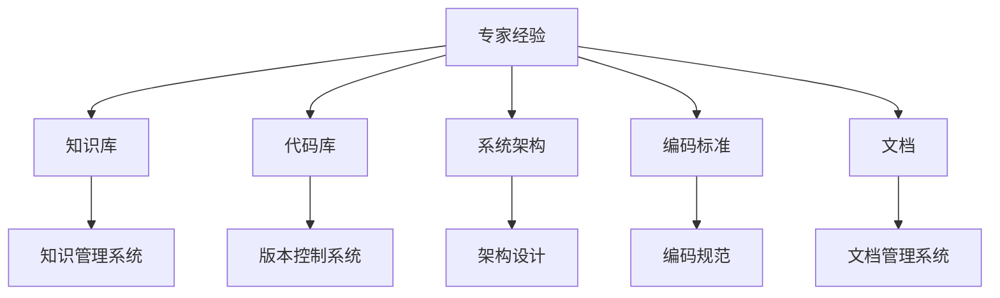

                 

## 1. 背景介绍

### 1.1 问题由来

在当今快速迭代和快速变化的软件开发环境中，专家经验与代码之间的“脱节”成为一个普遍存在的问题。开发人员在实际生产环境中需要面对高度复杂且不断变化的应用需求，但这些需求与传统软件开发流程中的设计、编码、测试等环节往往存在一定程度的脱节。专家经验未能及时、有效地转化为代码中的实际解决方案，导致生产效率低下、软件质量难以保证。

### 1.2 问题核心关键点

1. **需求与实现**：生产环境中的需求往往模糊、不确定，但专家经验通常很明确。如何将专家经验有效地转化为具体、可执行的代码，是实现需求与实现对接的关键。

2. **经验积累与传播**：专家经验通常在团队中难以传播，新手难以快速获取并应用这些经验。如何系统化地积累并传播这些经验，是保持团队技术水平的重要手段。

3. **迭代与更新**：生产环境需求动态变化，专家经验也需要相应更新和迭代。如何建立持续的更新机制，保持经验的有效性。

4. **代码质量与可读性**：专家经验转化为代码时，可能存在代码冗余、可读性差等问题。如何优化代码质量，使其更易于理解和维护。

### 1.3 问题研究意义

研究专家经验在生产中的固化方法，对于提高软件开发效率、保证软件质量、缩短项目周期具有重要意义。系统化地积累和传播专家经验，能够帮助新手快速成长，提升团队整体技术水平。同时，通过持续更新机制，确保代码能够适应不断变化的需求，提升系统的稳定性与可用性。

## 2. 核心概念与联系

### 2.1 核心概念概述

为更好地理解如何将专家经验固化为代码，本节将介绍几个密切相关的核心概念：

- **专家经验**：指在软件开发过程中，专家积累的解决问题的方法、技巧、最佳实践等知识。
- **代码库**：存储和管理代码的容器，通常包含版本控制、文档、注释等功能。
- **知识库**：记录和管理知识的容器，通常包含问题描述、解决方案、代码片段等。
- **系统架构**：高层次的系统设计方案，包括组件划分、数据流、接口定义等。
- **编码标准**：编码规范与约定，用于指导代码编写，包括命名规范、代码风格等。
- **文档**：对系统设计、架构、代码等内容的详细说明，帮助团队成员快速理解与使用。

这些核心概念之间的逻辑关系可以通过以下Mermaid流程图来展示：



这个流程图展示了几大核心概念及其之间的关系：

1. 专家经验被整理为知识库和文档，供团队成员学习和参考。
2. 专家经验通过代码库体现，具体实现为系统架构和组件设计。
3. 专家经验被编码标准化，转化为具体代码。
4. 知识库、代码库、系统架构等统一通过知识管理系统和版本控制系统管理。

这些概念共同构成了专家经验在生产环境中的固化框架，有助于系统化地积累和传播专家经验。

## 3. 核心算法原理 & 具体操作步骤
### 3.1 算法原理概述

将专家经验固化为代码的过程，本质上是对专家经验进行系统化处理和抽象化的过程。具体而言，这一过程包含以下几个步骤：

1. **知识采集**：从专家、团队成员、相关文献中采集各种形式的专家经验，包括代码片段、设计方案、解决问题的方法等。

2. **知识整理**：对采集到的专家经验进行归类、整理，去除冗余，形成系统的知识结构。

3. **知识固化**：将整理好的知识结构转化为代码库中的实际实现，包括系统架构设计、代码模块划分、接口定义等。

4. **知识传播**：通过知识库和文档系统，将固化后的知识传播给团队成员，便于学习和使用。

### 3.2 算法步骤详解

将专家经验固化为代码，主要包括以下几个关键步骤：

**Step 1: 知识采集**

- 从专家、团队成员、相关文献中收集各类专家经验，包括代码片段、设计方案、最佳实践等。
- 将收集到的经验按照不同类别进行整理，如功能模块、设计模式、算法等。

**Step 2: 知识整理**

- 对收集到的专家经验进行去重、分类、筛选，去除冗余，形成系统的知识结构。
- 通过文档、知识管理系统等方式，将整理好的知识结构进行记录和存储。

**Step 3: 知识固化**

- 将整理好的知识结构转化为具体的代码实现。例如，设计系统架构、定义组件接口、编写代码模块等。
- 代码实现过程中，应遵守编码标准，保证代码质量与可读性。

**Step 4: 知识传播**

- 将固化后的知识存储到代码库和知识库中，并通过版本控制系统进行管理。
- 编写详细的文档，记录每个设计决策、代码模块的设计思路、使用方法等，便于团队成员学习和使用。

**Step 5: 知识更新**

- 定期回顾并更新知识库中的内容，以适应新的需求和技术变化。
- 建立持续的知识更新机制，如代码审查、定期复审等。

通过以上步骤，专家经验能够系统化地固化为代码，同时保证知识的时效性和可用性。

### 3.3 算法优缺点

将专家经验固化为代码的方法具有以下优点：

1. **提升效率**：系统化地固化专家经验，避免了在具体问题上从头开始设计和实现的过程，提高了开发效率。
2. **保证质量**：专家经验通常具有较高的质量，通过固化这些经验，能够提升代码的整体质量。
3. **促进学习**：将专家经验记录在知识库和文档中，方便新成员快速学习和掌握。
4. **保持一致性**：通过版本控制系统管理代码库和知识库，确保所有团队成员使用同一版本的代码和知识。

然而，这种方法也存在一些局限性：

1. **高成本**：初始阶段的整理和固化工作量较大，需要大量人力和资源投入。
2. **灵活性差**：固化后的代码和知识库难以快速适应新的需求和技术变化。
3. **技术门槛高**：需要团队具备一定的系统化处理和抽象化能力，才能有效进行知识固化。

尽管存在这些局限性，但就目前而言，将专家经验固化为代码的方法仍是大规模软件开发中的一种重要手段。未来相关研究的重点在于如何进一步降低成本、提高灵活性，同时兼顾质量和技术门槛。

### 3.4 算法应用领域

专家经验固化为代码的方法，已经在软件开发、系统设计、运维管理等多个领域得到了广泛应用，具体包括以下几个方面：

- **软件开发**：在敏捷开发、DevOps等实践中，将专家经验转化为代码和文档，提升开发效率和软件质量。
- **系统设计**：在系统架构设计、组件划分、接口定义等方面，利用专家经验指导具体实现。
- **运维管理**：在故障诊断、性能优化、配置管理等方面，通过固化专家经验，提升运维效率和系统稳定性。
- **文档编写**：编写详细的文档，记录系统设计、实现细节、问题解决方案等，帮助团队成员快速理解和使用系统。
- **培训教育**：通过整理和传播专家经验，提升团队整体技术水平，加速新手成长。

除了上述这些经典应用外，专家经验固化方法也在不断扩展到更多领域，如产品管理、项目规划、安全测试等，为软件开发的全生命周期提供了有力支持。

## 4. 数学模型和公式 & 详细讲解 & 举例说明

### 4.1 数学模型构建

本节将使用数学语言对专家经验固化为代码的过程进行更加严格的刻画。

假设专家经验为 $E$，代码库为 $C$，知识库为 $K$，系统架构为 $A$，编码标准为 $S$，文档为 $D$。则专家经验固化的数学模型可以表示为：

$$
C = F(E, K, A, S, D)
$$

其中 $F$ 为将专家经验转化为代码的函数，将 $E$、$K$、$A$、$S$、$D$ 作为输入，输出最终的代码库 $C$。

### 4.2 公式推导过程

以一个简单的设计模式为例，推导将专家经验转化为代码的过程：

假设专家经验为设计模式 A，代码库为 $C$，知识库为 $K$，系统架构为 $A$，编码标准为 $S$，文档为 $D$。设计模式 A 包含以下步骤：

1. 定义抽象类 Interface。
2. 定义具体类 ConcreteClass。
3. 在 Interface 中定义方法。
4. 在 ConcreteClass 中实现 Interface 的方法。

将设计模式 A 转化为代码的过程可以表示为：

$$
C = \{Interface, ConcreteClass\}
$$

其中 Interface 包含方法定义，ConcreteClass 包含方法的实现。

### 4.3 案例分析与讲解

假设专家经验为一种常见的单例模式设计，知识库中包含以下内容：

- **接口定义**：
```java
public interface Singleton {
    void doSomething();
}
```

- **实现类定义**：
```java
public class SingletonImpl implements Singleton {
    private static SingletonImpl instance;
    
    private SingletonImpl() {}
    
    public static Singleton getInstance() {
        if (instance == null) {
            instance = new SingletonImpl();
        }
        return instance;
    }
    
    @Override
    public void doSomething() {
        // 具体实现
    }
}
```

- **设计决策说明**：
1. 使用静态内部类实现单例模式，避免反射注入问题。
2. 提供 `getInstance()` 方法获取单例实例。
3. 在实现类中实现 `doSomething()` 方法。

通过这些知识，可以设计并实现单例模式的代码，如下所示：

```java
public class Singleton {
    private static Singleton singleton;
    
    private Singleton() {}
    
    public static Singleton getInstance() {
        if (singleton == null) {
            singleton = new Singleton();
        }
        return singleton;
    }
    
    public void doSomething() {
        // 具体实现
    }
}
```

以上案例展示了将专家经验转化为代码的过程。通过知识库中的定义、决策和实现，能够快速、准确地设计并实现单例模式。

## 5. 项目实践：代码实例和详细解释说明
### 5.1 开发环境搭建

在进行专家经验固化为代码的实践前，我们需要准备好开发环境。以下是使用Python进行Flask开发的环境配置流程：

1. 安装Python：从官网下载并安装Python，用于编写代码和运行应用。
2. 安装Flask：
```bash
pip install flask
```

3. 创建Flask项目：
```bash
mkdir expert_system
cd expert_system
flask init
```

4. 创建Flask应用：
```python
from flask import Flask, request

app = Flask(__name__)

@app.route('/query', methods=['POST'])
def query():
    data = request.get_json()
    expert_knowledge = {
        'context': data['context'],
        'question': data['question']
    }
    # 调用专家经验系统
    result = expert_system.handle(expert_knowledge)
    return result

if __name__ == '__main__':
    app.run(debug=True)
```

完成上述步骤后，即可在本地运行Flask应用，进行专家经验查询和应用。

### 5.2 源代码详细实现

这里我们以一个简单的专家系统为例，展示如何通过代码实现专家经验的查询和应用。

首先，定义专家知识库：

```python
expert_knowledge = {
    'context': {
        '单例模式': {
            '接口定义': 'public interface Singleton { void doSomething(); }',
            '实现类定义': 'public class SingletonImpl implements Singleton { private static SingletonImpl instance; private SingletonImpl() {} public static Singleton getInstance() { if (instance == null) { instance = new SingletonImpl(); } return instance; } @Override public void doSomething() { // 具体实现 } }',
            '设计决策说明': '使用静态内部类实现单例模式，避免反射注入问题。提供 getInstance() 方法获取单例实例。在实现类中实现 doSomething() 方法。'
        },
        '工厂模式': {
            '接口定义': 'public interface Product { void produce(); } public interface Creator { Product createProduct(); }',
            '实现类定义': 'public class ConcreteCreator implements Creator { @Override public Product createProduct() { return new ConcreteProduct(); } } public class ConcreteProduct implements Product { @Override public void produce() { // 具体实现 } }',
            '设计决策说明': '定义抽象产品类和抽象创建者类，具体产品类和具体创建者类实现接口。工厂类通过接口的统一访问方式，创建并返回具体产品对象。'
        },
        # 其他专家知识
    }
}
```

然后，定义专家查询系统：

```python
def handle(expert_knowledge):
    result = {}
    for context in expert_knowledge:
        for key in expert_knowledge[context]:
            if expert_knowledge[context][key] in request.form:
                result[context + '模式'] = expert_knowledge[context][key]
    return result
```

最后，启动Flask应用并测试：

```python
if __name__ == '__main__':
    app.run(debug=True)

# 测试：发送 POST 请求，获取专家模式
import requests

response = requests.post('http://localhost:5000/query', json={
    'context': '单例模式',
    'question': '如何实现单例模式？'
})
print(response.json())
```

### 5.3 代码解读与分析

让我们再详细解读一下关键代码的实现细节：

**expert_knowledge字典**：
- 定义了专家知识库，包括单例模式和工厂模式的具体实现和设计决策说明。

**handle函数**：
- 根据用户查询的上下文和问题，从专家知识库中提取对应的专家经验，形成返回结果。

**Flask应用代码**：
- 使用Flask框架创建HTTP服务，接收POST请求并调用 `handle` 函数处理专家查询请求。
- 在本地运行应用，通过发起HTTP请求获取专家模式。

通过Flask应用，实现了专家模式的查询功能。可以看到，将专家经验固化为代码，使得知识库的查询和使用变得简单易用。

## 6. 实际应用场景
### 6.1 智能客服系统

基于专家经验固化为代码的方法，可以广泛应用于智能客服系统的构建。传统客服往往需要配备大量人力，高峰期响应缓慢，且一致性和专业性难以保证。通过专家经验固化，能够快速构建智能客服系统，提升服务效率和质量。

在技术实现上，可以收集企业内部的历史客服对话记录，将常见问题和最佳答复构建成专家知识库。开发人员基于这些专家知识库，进行模型训练和微调，实现智能客服系统。系统能够自动理解用户意图，匹配最合适的答案模板进行回复。对于客户提出的新问题，还可以接入检索系统实时搜索相关内容，动态组织生成回答。如此构建的智能客服系统，能大幅提升客户咨询体验和问题解决效率。

### 6.2 金融舆情监测

金融机构需要实时监测市场舆论动向，以便及时应对负面信息传播，规避金融风险。传统的人工监测方式成本高、效率低，难以应对网络时代海量信息爆发的挑战。通过专家经验固化为代码，构建基于自然语言处理的舆情监测系统，能够快速、准确地监测舆情变化，提供及时预警和风险评估。

具体而言，可以收集金融领域相关的新闻、报道、评论等文本数据，并对其进行主题标注和情感标注。将标注好的数据存入专家知识库，开发人员基于这些数据进行模型训练和微调，构建舆情监测系统。系统能够自动判断文本属于何种主题，情感倾向是正面、中性还是负面。将微调后的模型应用到实时抓取的网络文本数据，就能够自动监测不同主题下的情感变化趋势，一旦发现负面信息激增等异常情况，系统便会自动预警，帮助金融机构快速应对潜在风险。

### 6.3 个性化推荐系统

当前的推荐系统往往只依赖用户的历史行为数据进行物品推荐，无法深入理解用户的真实兴趣偏好。通过专家经验固化为代码，构建基于用户行为和专家经验的推荐系统，能够更好地挖掘用户行为背后的语义信息，从而提供更精准、多样的推荐内容。

在实践中，可以收集用户浏览、点击、评论、分享等行为数据，提取和用户交互的物品标题、描述、标签等文本内容。将文本内容作为专家知识库的输入，用户的后续行为（如是否点击、购买等）作为监督信号，进行模型训练和微调。微调后的模型能够从文本内容中准确把握用户的兴趣点。在生成推荐列表时，先用候选物品的文本描述作为专家知识库的输入，由模型预测用户的兴趣匹配度，再结合其他特征综合排序，便可以得到个性化程度更高的推荐结果。

### 6.4 未来应用展望

随着专家经验固化技术的发展，基于专家经验固化为代码的方法将在更多领域得到应用，为传统行业带来变革性影响。

在智慧医疗领域，基于专家经验的医疗问答、病历分析、药物研发等应用将提升医疗服务的智能化水平，辅助医生诊疗，加速新药开发进程。

在智能教育领域，专家经验固化为代码的方法可应用于作业批改、学情分析、知识推荐等方面，因材施教，促进教育公平，提高教学质量。

在智慧城市治理中，专家经验固化为代码的应用可扩展到城市事件监测、舆情分析、应急指挥等环节，提高城市管理的自动化和智能化水平，构建更安全、高效的未来城市。

此外，在企业生产、社会治理、文娱传媒等众多领域，专家经验固化为代码的应用也将不断涌现，为经济社会发展注入新的动力。相信随着技术的日益成熟，专家经验固化方法将成为软件工程中的重要手段，推动人工智能技术在垂直行业的规模化落地。

## 7. 工具和资源推荐
### 7.1 学习资源推荐

为了帮助开发者系统掌握专家经验固化为代码的技术基础和实践技巧，这里推荐一些优质的学习资源：

1. 《深入理解Java虚拟机》：讲解Java虚拟机的工作原理和性能调优技巧，深入理解代码执行机制。
2. 《重构：改善既有代码的设计》：介绍重构技术，通过改进代码设计提升软件质量。
3. 《Effective C++》：介绍C++编程技巧，提升代码质量和可读性。
4. 《The Pragmatic Programmer》：讲解编程实践，提升软件开发效率和代码质量。
5. 《代码大全》：讲解代码风格、规范和优化，提升代码的可读性和可维护性。

通过对这些资源的学习实践，相信你一定能够快速掌握专家经验固化为代码的精髓，并用于解决实际的开发问题。
###  7.2 开发工具推荐

高效的开发离不开优秀的工具支持。以下是几款用于专家经验固化为代码开发的常用工具：

1. IDEA：流行的Java开发工具，提供丰富的代码提示、重构、版本控制等功能。
2. Visual Studio Code：轻量级代码编辑器，支持多种语言和扩展，适用于多种开发场景。
3. GitHub：全球最大的代码托管平台，支持版本控制、协作开发、持续集成等功能。
4. Git：主流版本控制系统，支持分布式版本控制、分支管理等功能。
5. Docker：开源容器化平台，支持应用打包、容器化部署、多环境一致性等功能。

合理利用这些工具，可以显著提升专家经验固化为代码的开发效率，加快创新迭代的步伐。

### 7.3 相关论文推荐

专家经验固化为代码的研究源于学界的持续研究。以下是几篇奠基性的相关论文，推荐阅读：

1. "Software Design Extraction: A Survey"（软件设计抽取：综述）：介绍了从源代码中抽取设计模式、架构模式的方法和技术。
2. "Code Review Quality: Assessing Code Changes by Profiling Developers"（代码审查质量：通过开发者分析评估代码变更）：探讨了如何通过代码审查来提升代码质量和开发效率。
3. "Towards Deep Learning in Software Engineering"（软件工程中的深度学习）：介绍了将深度学习技术应用于代码理解、自动化重构等领域的方法和效果。
4. "Code Comprehension in Large Codebases"（大型代码库中的代码理解）：探讨了如何在大规模代码库中快速定位和理解代码的方法。
5. "The Art of Software Architecture"（软件架构的艺术）：讲解了软件架构的设计原则和实践方法，指导开发者进行系统设计。

这些论文代表了大规模软件开发中专家经验固化方法的研究方向。通过学习这些前沿成果，可以帮助研究者把握学科前进方向，激发更多的创新灵感。

## 8. 总结：未来发展趋势与挑战

### 8.1 总结

本文对专家经验在生产中的固化方法进行了全面系统的介绍。首先阐述了专家经验与代码之间的“脱节”问题，明确了将专家经验系统化固化为代码的关键意义。其次，从原理到实践，详细讲解了专家经验固化为代码的数学模型和操作步骤，给出了专家系统查询的完整代码实例。同时，本文还广泛探讨了专家经验固化方法在智能客服、金融舆情、个性化推荐等多个行业领域的应用前景，展示了专家经验固化方法的巨大潜力。此外，本文精选了专家经验固化的各类学习资源，力求为读者提供全方位的技术指引。

通过本文的系统梳理，可以看到，专家经验固化为代码的方法正在成为软件开发的重要手段，极大地提升了软件开发效率和软件质量。系统化地积累和传播专家经验，能够帮助新手快速成长，提升团队整体技术水平。通过持续更新机制，确保代码能够适应不断变化的需求，提升系统的稳定性与可用性。

### 8.2 未来发展趋势

展望未来，专家经验固化为代码的方法将呈现以下几个发展趋势：

1. **智能化发展**：随着AI技术的进步，专家经验固化方法将结合更多智能技术，如自然语言处理、机器学习等，提升知识查询和应用的智能化水平。

2. **平台化发展**：专家经验固化将更多集成到开发平台和协作工具中，成为持续集成、持续交付(CICD)流程的一部分，提升团队协作效率。

3. **多模态发展**：专家经验固化将拓展到多种数据源，结合图像、语音、文本等多种模态信息，构建更全面的知识库。

4. **集成化发展**：专家经验固化将与代码管理、版本控制等系统集成，形成更完整的软件开发生命周期管理解决方案。

5. **云化发展**：专家经验固化将更多部署到云端，支持弹性伸缩和实时查询，提升知识库的可用性和服务能力。

6. **社区化发展**：专家经验固化将更多开放为社区共享资源，促进知识共享和创新，提升整个行业的发展水平。

以上趋势凸显了专家经验固化技术的广阔前景。这些方向的探索发展，必将进一步提升软件开发效率和软件质量，为经济社会发展注入新的动力。

### 8.3 面临的挑战

尽管专家经验固化为代码技术已经取得了瞩目成就，但在迈向更加智能化、平台化、多模态化应用的过程中，它仍面临着诸多挑战：

1. **数据质量问题**：专家经验的采集和整理需要高质量的输入数据，否则将导致知识库质量低下。如何保证数据质量，成为专家经验固化技术的瓶颈之一。

2. **知识更新问题**：专家知识库需要定期更新，以适应新的需求和技术变化。如何建立有效的知识更新机制，保持知识的时效性和有效性。

3. **技术复杂度问题**：专家经验固化涉及到代码管理、版本控制、知识抽取等多个环节，技术实现复杂。如何简化技术实现，降低开发难度。

4. **知识传播问题**：专家经验固化后，如何有效地传播给团队成员，确保每个成员都能够快速掌握。

5. **知识粒度问题**：专家经验固化需要选择合适的粒度，既要覆盖足够的知识面，又要避免粒度过粗或过细导致的理解和应用困难。

6. **用户界面问题**：专家知识库的查询和应用需要友好的用户界面，以便快速获取和使用专家经验。

这些挑战需要研究者不断探索和创新，才能进一步提升专家经验固化为代码技术的成熟度和实用性。

### 8.4 研究展望

面对专家经验固化所面临的挑战，未来的研究需要在以下几个方面寻求新的突破：

1. **自动化知识采集**：探索如何通过自动化技术，从代码库和文档中自动抽取专家经验，减少人工干预，提高效率。

2. **智能化知识更新**：结合机器学习和自然语言处理技术，自动更新知识库中的专家经验，保持知识的时效性和有效性。

3. **集成化知识管理**：开发集成的知识管理系统，将专家经验固化与版本控制、代码管理等系统集成，形成完整的开发生命周期解决方案。

4. **可视化用户界面**：开发友好的用户界面，帮助用户快速查询和使用专家知识库中的内容，提升知识应用效率。

5. **多模态知识融合**：探索如何融合多模态信息，构建更全面的知识库，提升知识的覆盖面和应用能力。

6. **知识传播机制**：研究如何通过协作工具、社区平台等方式，将专家经验有效地传播给团队成员，促进知识共享和创新。

这些研究方向的探索，必将引领专家经验固化为代码技术迈向更高的台阶，为软件开发的全生命周期提供更加智能、高效、便捷的解决方案。面向未来，专家经验固化技术还需要与其他软件开发技术进行更深入的融合，如持续集成、持续交付、DevOps等，多路径协同发力，共同推动软件开发的进步。只有勇于创新、敢于突破，才能不断拓展专家经验固化技术的边界，让软件开发变得更加高效和智能化。

## 9. 附录：常见问题与解答

**Q1：专家经验固化为代码是否适用于所有开发任务？**

A: 专家经验固化为代码的方法在绝大多数软件开发任务中都适用。特别适用于技术复杂、需求变化频繁的开发场景，如系统设计、架构优化、问题解决等。但对于一些简单明了的任务，如数据录入、UI设计等，可能不需要特别固化专家经验。

**Q2：如何选择合适的专家经验进行固化？**

A: 选择专家经验进行固化，应考虑专家经验的时效性、覆盖面、适用性等因素。具体而言，可以优先选择以下类型的专家经验：
1. 常见问题解决方案。
2. 架构设计方案。
3. 系统优化技巧。
4. 代码重构策略。
5. 编码规范和风格。
6. 性能优化方法。
7. 安全性保障措施。

对于一些特殊的、领域特定的经验，也可以根据实际需求进行选择。

**Q3：专家经验固化为代码的效率如何？**

A: 专家经验固化为代码的效率主要取决于专家知识库的结构和查询效率。构建高质量的知识库，并优化查询算法，可以显著提升专家经验查询和应用的速度。同时，合理使用版本控制系统，进行代码版本管理和协作开发，也可以提高效率。

**Q4：如何保证专家经验固化为代码的质量？**

A: 保证专家经验固化为代码的质量，需要从以下几个方面入手：
1. 选择高质量的专家经验进行固化。
2. 进行代码审查和测试，确保代码质量和一致性。
3. 定期更新知识库，保持专家经验的时效性。
4. 合理使用版本控制系统，确保代码的稳定性和可追溯性。
5. 定期评估和优化知识库的查询算法，提高查询效率。

通过这些措施，可以确保专家经验固化为代码的质量和有效性。

**Q5：专家经验固化为代码的未来方向是什么？**

A: 专家经验固化为代码的未来方向主要包括以下几个方面：
1. 智能化：结合机器学习和自然语言处理技术，提升知识库的智能化水平。
2. 平台化：将专家经验固化方法集成到开发平台和协作工具中，提升开发效率和团队协作能力。
3. 多模态：拓展到多种数据源，结合图像、语音、文本等多种模态信息，构建更全面的知识库。
4. 集成化：与代码管理、版本控制等系统集成，形成完整的开发生命周期管理解决方案。
5. 云化：将专家知识库部署到云端，支持弹性伸缩和实时查询，提升知识库的可用性和服务能力。
6. 社区化：开放为社区共享资源，促进知识共享和创新，提升整个行业的发展水平。

这些方向将进一步提升专家经验固化为代码技术的成熟度和实用性，推动软件开发和人工智能技术的发展。

---

作者：禅与计算机程序设计艺术 / Zen and the Art of Computer Programming

