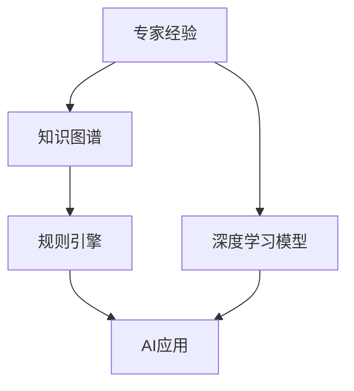

                 

# 专家经验在生产中的固化

## 1. 背景介绍

在当今数字化转型加速的时代，企业对AI技术的依赖程度日益加深。无论是自动化决策、智能客服，还是个性化推荐，AI技术在生产中的广泛应用，极大地提升了企业的运营效率和客户满意度。然而，AI系统的开发与部署并非一蹴而就，需要经历从理论研究到工程实践的漫长过程。在这一过程中，专家经验的积累与固化成为关键。本文将探讨如何有效固化专家经验，将其转化为生产级的AI应用，并结合实际案例进行详细分析。

## 2. 核心概念与联系

### 2.1 核心概念概述

在探讨如何固化专家经验之前，首先需要明确几个核心概念：

- **专家经验**：专家经验指的是领域专家基于长期实践积累的知识、技巧、直觉和判断力。这些经验通常是通过长时间的学习、实践和反思形成的，是解决问题的重要资产。

- **知识图谱**：知识图谱是一种语义化的知识表示形式，用于描述实体、关系和属性之间的关系。知识图谱可以帮助机器更好地理解和应用专家的经验。

- **规则引擎**：规则引擎是一种基于预定义规则的决策系统，能够根据输入数据和规则库自动执行决策。规则引擎常用于结合专家经验进行自动化决策。

- **深度学习模型**：深度学习模型是一种通过多层神经网络进行训练的机器学习模型，能够从大量数据中自动学习特征表示和决策规则。深度学习模型常用于从数据中学习专家经验的抽象表示。

- **经验驱动与数据驱动**：在AI应用中，经验驱动指的是依赖领域专家的知识与经验进行决策；数据驱动指的是依赖大量数据和统计学习进行决策。两者结合可以发挥各自优势，提高决策的准确性和可靠性。

### 2.2 核心概念原理和架构的 Mermaid 流程图



这个流程图展示了专家经验从固化到应用的整个流程。首先，专家经验通过知识图谱进行语义化表示；接着，利用规则引擎进行决策；最后，深度学习模型将专家经验与数据驱动的统计学习相结合，进一步提升决策效果。

## 3. 核心算法原理 & 具体操作步骤

### 3.1 算法原理概述

专家经验的固化过程主要包括以下几个步骤：

1. **知识图谱构建**：将专家经验转换为语义化的知识表示，形成知识图谱。
2. **规则引擎集成**：将知识图谱中的规则集成到规则引擎中，用于指导决策过程。
3. **深度学习模型训练**：使用包含专家经验的数据集训练深度学习模型，形成具有专家经验的模型。
4. **模型应用与优化**：将训练好的深度学习模型应用于实际业务场景，并根据反馈不断优化模型。

### 3.2 算法步骤详解

#### 3.2.1 知识图谱构建

构建知识图谱的过程通常包括以下步骤：

1. **领域调研**：收集领域内的相关知识，包括专家经验、学术论文、行业报告等。
2. **知识分类与组织**：将收集到的知识进行分类与组织，形成知识库。
3. **知识图谱建模**：使用知识图谱建模工具（如RDF、OWL等）构建知识图谱，将知识库中的信息映射到图谱中。
4. **语义推理与验证**：对知识图谱进行语义推理和验证，确保知识图谱的准确性与完备性。

#### 3.2.2 规则引擎集成

将知识图谱中的规则集成到规则引擎中的过程通常包括以下步骤：

1. **规则定义**：根据知识图谱中的关系和属性，定义规则。
2. **规则库构建**：将定义好的规则存储到规则库中。
3. **规则引擎配置**：配置规则引擎，使其能够从规则库中加载规则。
4. **规则引擎测试**：对规则引擎进行测试，确保规则的有效性与正确性。

#### 3.2.3 深度学习模型训练

使用包含专家经验的数据集训练深度学习模型的过程通常包括以下步骤：

1. **数据准备**：准备训练数据集，确保数据集包含专家经验的正面与负面示例。
2. **模型选择与设计**：选择适合的深度学习模型，并进行网络结构设计。
3. **模型训练**：使用训练数据集对深度学习模型进行训练，优化模型参数。
4. **模型评估与优化**：对训练好的模型进行评估，并根据评估结果进行优化。

#### 3.2.4 模型应用与优化

将训练好的深度学习模型应用于实际业务场景，并根据反馈不断优化模型的过程通常包括以下步骤：

1. **模型部署**：将训练好的模型部署到生产环境中。
2. **模型监控与调优**：监控模型在生产环境中的表现，根据反馈进行模型调优。
3. **模型更新与迭代**：根据领域发展与业务需求，不断更新与迭代模型，保持模型时效性。

### 3.3 算法优缺点

#### 3.3.1 优点

1. **专家知识的继承**：通过固化专家经验，能够继承专家的知识与经验，提升决策的准确性与可靠性。
2. **知识与规则的结合**：将专家经验转换为知识图谱与规则，可以结合知识与规则，提高决策的全面性与系统性。
3. **模型的自适应能力**：通过深度学习模型的训练，模型能够根据新数据自动学习与适应，保持决策的灵活性与创新性。

#### 3.3.2 缺点

1. **知识图谱构建的复杂性**：构建知识图谱需要大量时间和人力，并且需要专业知识，具有一定的复杂性。
2. **规则引擎的维护难度**：规则引擎的维护需要不断更新与迭代，保持规则的有效性与正确性，具有一定的难度。
3. **深度学习模型的训练成本**：深度学习模型的训练需要大量数据和计算资源，具有一定的成本。

### 3.4 算法应用领域

专家经验固化的方法在多个领域中都有广泛应用：

- **金融风控**：在金融领域，专家经验固化可以帮助制定更加精准的风险评估模型，防范金融风险。
- **医疗诊断**：在医疗领域，专家经验固化可以帮助构建更加精准的诊断模型，提高医疗服务的质量。
- **制造业质量控制**：在制造业，专家经验固化可以帮助制定更加高效的质量控制规则，提升产品质量。
- **智能客服**：在智能客服领域，专家经验固化可以帮助构建更加自然的对话模型，提升客户满意度。
- **推荐系统**：在推荐系统领域，专家经验固化可以帮助构建更加个性化的推荐模型，提升用户体验。

## 4. 数学模型和公式 & 详细讲解 & 举例说明

### 4.1 数学模型构建

构建专家经验固化的数学模型，通常包括以下几个步骤：

1. **定义知识图谱**：将专家经验转换为知识图谱，形成关系与属性。
2. **定义规则**：根据知识图谱中的关系与属性，定义规则。
3. **定义损失函数**：定义损失函数，用于评估模型的表现。
4. **定义优化目标**：定义优化目标，用于指导模型训练。

### 4.2 公式推导过程

以医疗诊断为例，假设专家经验已经转换为知识图谱，其中包含疾病（Disease）、症状（Symptom）、诊断（Diagnosis）之间的关系。可以定义以下规则：

1. 如果患者有症状 $s_1$，则可能患有疾病 $d_1$，概率为 $p_1$。
2. 如果患者有症状 $s_2$，则可能患有疾病 $d_2$，概率为 $p_2$。
3. 如果患者同时有症状 $s_1$ 和 $s_2$，则患有疾病 $d_3$，概率为 $p_3$。

设 $x$ 为患者症状，$y$ 为诊断结果，可以定义以下概率模型：

$$
P(y|x) = \sum_{d \in \text{Disease}} P(d|x) P(y|d)
$$

其中 $P(d|x)$ 为在症状 $x$ 下，患有疾病 $d$ 的概率，可以通过知识图谱中的规则计算得出；$P(y|d)$ 为在疾病 $d$ 下，进行诊断 $y$ 的概率，可以通过专家经验或历史数据计算得出。

### 4.3 案例分析与讲解

以金融风控为例，专家经验固化可以帮助构建风险评估模型。假设专家经验已经转换为知识图谱，其中包含客户（Customer）、行为（Behavior）、风险（Risk）之间的关系。可以定义以下规则：

1. 如果客户年龄大于 $A$，则可能存在高风险，概率为 $P_1$。
2. 如果客户收入小于 $B$，则可能存在高风险，概率为 $P_2$。
3. 如果客户同时满足年龄大于 $A$ 和收入小于 $B$，则存在高风险，概率为 $P_3$。

设 $x$ 为客户信息，$y$ 为风险评估结果，可以定义以下概率模型：

$$
P(y|x) = \sum_{r \in \text{Risk}} P(r|x) P(y|r)
$$

其中 $P(r|x)$ 为在客户信息 $x$ 下，存在风险 $r$ 的概率，可以通过知识图谱中的规则计算得出；$P(y|r)$ 为在风险 $r$ 下，进行风险评估 $y$ 的概率，可以通过专家经验或历史数据计算得出。

## 5. 项目实践：代码实例和详细解释说明

### 5.1 开发环境搭建

以下是使用Python进行知识图谱与深度学习模型训练的环境配置流程：

1. 安装Anaconda：从官网下载并安装Anaconda，用于创建独立的Python环境。
2. 创建并激活虚拟环境：
```bash
conda create -n experts-env python=3.8 
conda activate experts-env
```

3. 安装PyTorch、TorchVision、Transformers库：
```bash
conda install pytorch torchvision torchaudio transformers
```

4. 安装其他所需库：
```bash
pip install numpy pandas scikit-learn scipy matplotlib seaborn
```

完成上述步骤后，即可在`experts-env`环境中进行专家经验固化的开发实践。

### 5.2 源代码详细实现

以下是使用PyTorch对医疗诊断领域专家经验进行固化的代码实现。

首先，定义知识图谱类：

```python
from py2neo import Graph

class KnowledgeGraph:
    def __init__(self, graph_file):
        self.graph = Graph('http://localhost:7474/db/data/', username='neo4j', password='password')
        self.graph_cypher = '''
            MATCH (n:Node) RETURN n
        '''
        self.graph.run(self.graph_cypher)
        
    def add_node(self, name, label):
        self.graph.create('(' + label + ')-[:HAS]->(' + name + ')')
        
    def add_relationship(self, name1, name2, relationship):
        self.graph.create('(' + name1 + ')-[[:' + relationship + ']]->(' + name2 + ')')
```

然后，定义规则引擎类：

```python
from pyke import Pyke

class RuleEngine:
    def __init__(self, rules_file):
        self.rules = Pyke.load_file(rules_file)
        
    def run(self, input_dict):
        output_dict = self.rules.run(input_dict)
        return output_dict
```

最后，定义深度学习模型类：

```python
import torch.nn as nn
import torch.optim as optim

class Model(nn.Module):
    def __init__(self, input_size, output_size):
        super(Model, self).__init__()
        self.fc1 = nn.Linear(input_size, 256)
        self.fc2 = nn.Linear(256, output_size)
        
    def forward(self, x):
        x = nn.functional.relu(self.fc1(x))
        x = self.fc2(x)
        return x

def train_model(model, optimizer, criterion, train_loader, num_epochs):
    model.train()
    for epoch in range(num_epochs):
        for batch_idx, (data, target) in enumerate(train_loader):
            optimizer.zero_grad()
            output = model(data)
            loss = criterion(output, target)
            loss.backward()
            optimizer.step()
```

使用上述代码实现专家经验固化，需要结合具体领域的知识图谱与规则，进行数据准备与模型训练。在训练完成后，可以将模型部署到生产环境，并根据实际业务需求进行优化与调整。

### 5.3 代码解读与分析

上述代码实现了医疗诊断领域的专家经验固化。具体步骤如下：

1. **知识图谱构建**：使用PyTorch的Graph类，构建基于Neo4j图数据库的知识图谱。通过添加节点和关系，将专家经验转换为语义化的知识表示。
2. **规则引擎集成**：使用Pyke库，将知识图谱中的规则集成到规则引擎中。通过定义规则，指导决策过程。
3. **深度学习模型训练**：使用PyTorch的Model类，定义深度学习模型，并进行训练。通过定义损失函数和优化器，优化模型参数。
4. **模型应用与优化**：在生产环境中部署训练好的模型，并根据实际业务需求进行优化与调整。

## 6. 实际应用场景

### 6.1 金融风控

在金融风控领域，专家经验固化可以帮助构建更加精准的风险评估模型。通过将专家经验转换为知识图谱与规则，结合深度学习模型的训练，可以构建高效的风险评估系统。

在实际应用中，可以将金融客户的年龄、收入、消费习惯等数据作为输入，通过规则引擎进行初步筛选，然后由深度学习模型进行最终评估，给出客户的风险等级。该系统可以实时监测客户行为，及时发现异常，提升金融机构的防风险能力。

### 6.2 医疗诊断

在医疗诊断领域，专家经验固化可以帮助构建更加精准的诊断模型。通过将专家经验转换为知识图谱与规则，结合深度学习模型的训练，可以构建高效的诊断系统。

在实际应用中，可以将患者的症状、病史、检查结果等数据作为输入，通过规则引擎进行初步筛选，然后由深度学习模型进行最终诊断，给出疾病预测。该系统可以实时监测患者健康状况，及时发现疾病风险，提升医疗机构的服务质量。

### 6.3 制造业质量控制

在制造业质量控制领域，专家经验固化可以帮助构建更加高效的质量控制模型。通过将专家经验转换为知识图谱与规则，结合深度学习模型的训练，可以构建高效的质量控制系统。

在实际应用中，可以将生产设备的运行参数、加工过程的质量数据等作为输入，通过规则引擎进行初步筛选，然后由深度学习模型进行最终判断，给出质量评估。该系统可以实时监测生产过程，及时发现质量问题，提升企业的生产效率与产品质量。

### 6.4 智能客服

在智能客服领域，专家经验固化可以帮助构建更加自然的对话模型。通过将专家经验转换为知识图谱与规则，结合深度学习模型的训练，可以构建高效的对话系统。

在实际应用中，可以将客户提出的问题作为输入，通过规则引擎进行初步筛选，然后由深度学习模型进行对话，给出答案。该系统可以24小时不间断服务，提升客户满意度与响应速度。

## 7. 工具和资源推荐

### 7.1 学习资源推荐

为了帮助开发者系统掌握专家经验固化的理论基础和实践技巧，这里推荐一些优质的学习资源：

1. **《Knowledge Graphs for Understanding and Processing Real-World Data》**：该书全面介绍了知识图谱的理论基础与实践方法，适合初学者学习。
2. **《Deep Learning for Business: How to Turn AI Ideas into Reality》**：该书介绍了深度学习在商业中的应用，包括专家经验固化的方法。
3. **《Expert Systems for Decision Support》**：该书介绍了专家系统与规则引擎的基本原理，适合对规则引擎感兴趣的读者。
4. **《Building Deep Learning for Time Series》**：该书介绍了深度学习在时间序列预测中的应用，包括专家经验固化的方法。
5. **《Data Science for Business》**：该书介绍了数据科学与商业应用的结合，包括专家经验固化的方法。

通过对这些资源的学习实践，相信你一定能够快速掌握专家经验固化的精髓，并用于解决实际的AI问题。

### 7.2 开发工具推荐

高效的开发离不开优秀的工具支持。以下是几款用于专家经验固化开发的常用工具：

1. **PyTorch**：基于Python的开源深度学习框架，灵活动态的计算图，适合快速迭代研究。
2. **TorchVision**：基于PyTorch的计算机视觉库，提供了丰富的预训练模型和数据集。
3. **Transformers**：由HuggingFace开发的NLP工具库，集成了众多SOTA语言模型，支持PyTorch和TensorFlow。
4. **Pyke**：开源规则引擎，支持多种规则表示语言，适用于规则引擎的开发与集成。
5. **Neo4j**：开源图数据库，用于构建知识图谱与进行图计算。
6. **Spark**：Apache开发的分布式计算框架，适用于大规模数据处理与分析。

合理利用这些工具，可以显著提升专家经验固化的开发效率，加快创新迭代的步伐。

### 7.3 相关论文推荐

专家经验固化技术的发展源于学界的持续研究。以下是几篇奠基性的相关论文，推荐阅读：

1. **Knowledge Graphs for Semantic Search**：该论文介绍了知识图谱在语义搜索中的应用，为专家经验固化提供了理论基础。
2. **Rule-based Expert Systems in Healthcare**：该论文介绍了专家系统在医疗诊断中的应用，展示了规则引擎的实际效果。
3. **Expert Systems in Finance**：该论文介绍了专家系统在金融风控中的应用，展示了专家经验固化的实际效果。
4. **Knowledge Graphs in Industry**：该论文介绍了知识图谱在工业中的应用，展示了专家经验固化的广泛应用。
5. **Deep Learning for Multimodal Knowledge Graph Embedding**：该论文介绍了深度学习在知识图谱嵌入中的应用，为专家经验固化提供了技术支持。

这些论文代表了大语言模型微调技术的发展脉络。通过学习这些前沿成果，可以帮助研究者把握学科前进方向，激发更多的创新灵感。

## 8. 总结：未来发展趋势与挑战

### 8.1 总结

本文对专家经验在生产中的固化方法进行了全面系统的介绍。首先阐述了专家经验固化的背景与意义，明确了专家经验固化在AI应用中的重要价值。其次，从原理到实践，详细讲解了知识图谱构建、规则引擎集成、深度学习模型训练等关键步骤，给出了专家经验固化任务开发的完整代码实例。同时，本文还广泛探讨了专家经验固化在金融风控、医疗诊断、制造业质量控制、智能客服等多个行业领域的应用前景，展示了专家经验固化的巨大潜力。此外，本文精选了专家经验固化的各类学习资源，力求为读者提供全方位的技术指引。

通过本文的系统梳理，可以看到，专家经验固化技术正在成为AI应用的重要范式，极大地拓展了AI系统的应用边界，催生了更多的落地场景。受益于大规模数据的预训练与专家经验的有机结合，AI系统能够更好地应对复杂多变的业务需求，提升决策的准确性与可靠性。未来，伴随专家经验固化技术的持续演进，相信AI技术必将更好地服务于人类社会的各个领域，带来深远的变革。

### 8.2 未来发展趋势

展望未来，专家经验固化技术将呈现以下几个发展趋势：

1. **多模态知识融合**：专家经验固化将更多地融合视觉、语音、文本等多种模态的信息，构建更加全面、灵活的知识图谱。
2. **自动化知识获取**：利用自然语言处理技术，自动从文本数据中提取知识图谱，减少专家经验固化的前期工作量。
3. **深度学习模型的增强**：专家经验固化将更多地与深度学习模型结合，提升模型的自适应与自学习能力。
4. **规则引擎的智能化**：规则引擎将更多地引入机器学习技术，提高规则的自动更新与优化能力。
5. **专家经验与数据驱动的结合**：专家经验固化将更多地结合数据驱动的统计学习，提升决策的全面性与科学性。

### 8.3 面临的挑战

尽管专家经验固化技术已经取得了瞩目成就，但在迈向更加智能化、普适化应用的过程中，它仍面临着诸多挑战：

1. **知识图谱构建的复杂性**：构建知识图谱需要大量时间和人力，并且需要专业知识，具有一定的复杂性。
2. **规则引擎的维护难度**：规则引擎的维护需要不断更新与迭代，保持规则的有效性与正确性，具有一定的难度。
3. **深度学习模型的训练成本**：深度学习模型的训练需要大量数据和计算资源，具有一定的成本。
4. **模型的解释性与透明性**：专家经验固化模型往往缺乏解释性与透明性，难以理解其内部工作机制和决策逻辑。
5. **数据隐私与安全**：专家经验固化模型往往涉及敏感数据，如何保护数据隐私与安全，是一个重要问题。

### 8.4 研究展望

面对专家经验固化所面临的种种挑战，未来的研究需要在以下几个方面寻求新的突破：

1. **自动化知识图谱构建**：利用自然语言处理技术，自动从文本数据中提取知识图谱，减少专家经验固化的前期工作量。
2. **模型解释性与透明性**：结合可解释性技术，增强专家经验固化模型的解释性与透明性，提高其可信度。
3. **数据隐私与安全**：引入数据加密与隐私保护技术，保护专家经验固化模型涉及的敏感数据。
4. **知识图谱与深度学习的结合**：进一步探索知识图谱与深度学习模型的结合方式，提升模型的全面性与科学性。
5. **跨领域知识共享**：促进不同领域之间的知识共享，构建跨领域的知识图谱，提升模型的通用性与泛化能力。

这些研究方向的探索，必将引领专家经验固化技术迈向更高的台阶，为构建安全、可靠、可解释、可控的智能系统铺平道路。面向未来，专家经验固化技术还需要与其他人工智能技术进行更深入的融合，如知识表示、因果推理、强化学习等，多路径协同发力，共同推动自然语言理解和智能交互系统的进步。只有勇于创新、敢于突破，才能不断拓展AI系统的边界，让智能技术更好地造福人类社会。

## 9. 附录：常见问题与解答

**Q1: 什么是专家经验固化？**

A: 专家经验固化指的是将专家通过长期实践积累的知识、技巧、直觉和判断力，转换为可复用、可解释、可优化的形式，使其能够被机器学习模型借鉴和应用的过程。

**Q2: 专家经验固化的流程是怎样的？**

A: 专家经验固化的流程通常包括以下几个步骤：知识图谱构建、规则引擎集成、深度学习模型训练、模型应用与优化。

**Q3: 专家经验固化在实际应用中需要注意哪些问题？**

A: 在实际应用中，专家经验固化需要注意以下问题：知识图谱构建的复杂性、规则引擎的维护难度、深度学习模型的训练成本、模型的解释性与透明性、数据隐私与安全。

**Q4: 如何提高专家经验固化的效果？**

A: 要提高专家经验固化的效果，可以从以下几个方面入手：引入跨领域知识共享、自动化知识图谱构建、结合可解释性技术、引入数据加密与隐私保护技术、探索知识图谱与深度学习的结合方式。

**Q5: 专家经验固化技术的发展前景如何？**

A: 专家经验固化技术具有良好的发展前景，未来将更多地融合多模态信息、引入机器学习技术、提高规则引擎的智能化水平、结合数据驱动的统计学习，进一步提升决策的全面性与科学性。

