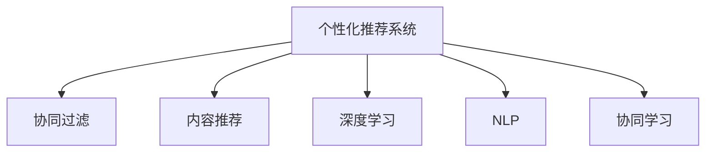

                 

# 个性化推荐如何提高用户满意度

> 关键词：个性化推荐, 用户满意度, 机器学习, 协同过滤, 内容推荐, 深度学习, 自然语言处理(NLP)

## 1. 背景介绍

### 1.1 问题由来

在互联网时代，个性化推荐系统已成为提升用户满意度和平台粘性的重要手段。无论是电商平台、内容平台还是社交网络，个性化推荐都在用户画像、商品、内容、广告等多个环节发挥了巨大作用。但当前推荐的准确性和多样性仍无法完全满足用户需求，如何通过更加智能、高效的推荐系统提升用户满意度，成为亟需解决的问题。

### 1.2 问题核心关键点

个性化推荐的核心目标是通过用户的历史行为数据，预测其对未来内容的兴趣，从而实现精准、个性化的内容推荐。具体而言，需解决以下问题：

1. **用户兴趣建模**：如何准确捕捉用户的偏好和兴趣。
2. **内容理解与匹配**：如何将内容特征与用户兴趣进行匹配。
3. **推荐算法设计**：如何选择合适推荐算法以优化推荐结果。
4. **效果评估与优化**：如何衡量推荐效果并持续优化推荐系统。

### 1.3 问题研究意义

个性化推荐系统的研究与应用，对提高用户满意度、提升平台收益、促进数据价值化有着重要的意义：

1. **提高用户满意度**：通过精准推荐，用户可以更快、更方便地找到所需内容，提升使用体验。
2. **增加用户粘性**：个性化推荐使平台内容更贴近用户需求，增强用户粘性，减少流失。
3. **提升平台收益**：个性化推荐系统通过精准投放广告、商品等，提高点击率、转化率，增加平台收益。
4. **驱动数据价值化**：个性化推荐可将用户行为数据转化为有价值的用户画像，进一步挖掘数据潜力。

## 2. 核心概念与联系

### 2.1 核心概念概述

为更好地理解个性化推荐系统的原理和优化方法，本节将介绍几个关键概念：

- **个性化推荐系统**：基于用户历史行为数据，预测用户对未来内容的兴趣，从而实现精准、个性化的内容推荐系统。
- **协同过滤**：通过用户和内容的协同矩阵，对相似用户或内容进行推荐。
- **内容推荐**：基于内容的属性、标签、关键词等特征，进行内容相似性匹配。
- **深度学习**：通过构建深度神经网络模型，挖掘用户和内容的复杂关系，实现更加精准的推荐。
- **自然语言处理(NLP)**：通过分析用户评论、反馈、文章等文本数据，提升用户兴趣建模和内容理解。
- **协同学习**：通过多用户协作学习，共享知识，提高推荐系统的性能。

这些核心概念之间的逻辑关系可以通过以下Mermaid流程图来展示：



这个流程图展示了个性化推荐系统的核心概念及其之间的关系：

1. 个性化推荐系统通过协同过滤、内容推荐、深度学习、NLP和协同学习等方法，对用户行为和内容特征进行建模和匹配，最终实现个性化推荐。
2. 协同过滤利用用户和内容的历史交互数据，寻找相似用户和内容。
3. 内容推荐基于内容的属性特征进行相似性匹配。
4. 深度学习通过构建复杂的神经网络模型，挖掘用户和内容的深度关系。
5. NLP通过对文本数据的分析，提升用户兴趣建模和内容理解。
6. 协同学习通过多用户协作，共享知识，提高推荐系统性能。

这些概念共同构成了个性化推荐系统的理论和实现基础，使得推荐系统能够根据用户历史行为数据，生成精准、个性化的推荐内容。

## 3. 核心算法原理 & 具体操作步骤
### 3.1 算法原理概述

个性化推荐系统通过用户历史行为数据，预测用户对未来内容的兴趣，从而实现精准、个性化的内容推荐。其核心思想是：

1. **用户兴趣建模**：通过用户行为数据，学习用户兴趣和偏好。
2. **内容理解与匹配**：通过内容的属性特征，理解内容与用户兴趣的关联度。
3. **推荐算法设计**：选择合适算法，根据用户和内容的特征进行推荐。
4. **效果评估与优化**：通过指标衡量推荐效果，不断优化推荐系统。

### 3.2 算法步骤详解

个性化推荐系统的构建主要包括以下几个关键步骤：

**Step 1: 数据收集与预处理**
- 收集用户历史行为数据，包括浏览记录、点击记录、购买记录等。
- 清洗数据，去除噪声和异常值。
- 划分训练集和测试集，用于模型训练和性能评估。

**Step 2: 用户兴趣建模**
- 选择合适的特征提取方法，从历史行为数据中提取用户兴趣特征。
- 使用协同过滤、深度学习等方法，构建用户兴趣模型。
- 应用正则化、Dropout等技术，避免过拟合。

**Step 3: 内容理解与匹配**
- 提取内容特征，如标题、关键词、标签等。
- 计算内容之间的相似度，构建内容特征向量。
- 使用余弦相似度、Jaccard相似度等方法，计算用户与内容的匹配度。

**Step 4: 推荐算法设计**
- 选择合适推荐算法，如基于协同过滤的推荐算法、基于内容的推荐算法、基于深度学习的推荐算法等。
- 设计合适的损失函数，优化推荐算法。
- 应用对抗训练、正则化等技术，提高推荐效果。

**Step 5: 效果评估与优化**
- 选择合适的评估指标，如点击率、转化率、平均精度等。
- 在测试集上评估推荐系统效果，分析改进点。
- 持续优化推荐算法，提升推荐效果。

### 3.3 算法优缺点

个性化推荐系统具有以下优点：

1. **精准性**：通过用户历史行为数据，精准预测用户兴趣。
2. **高效性**：使用高效的算法和数据结构，实时生成推荐内容。
3. **个性化**：根据用户个性化需求，提供定制化推荐。
4. **自动化**：推荐算法和模型可以自动优化，无需人工干预。

但该方法也存在一些缺点：

1. **数据依赖**：推荐系统的准确性高度依赖用户行为数据的完整性和质量。
2. **冷启动问题**：新用户或新内容没有历史数据，无法进行推荐。
3. **多样性不足**：推荐内容可能过于集中，缺乏多样性。
4. **隐私问题**：用户历史行为数据可能包含隐私信息，需注意数据保护。
5. **过拟合风险**：推荐算法可能过拟合训练数据，降低泛化能力。

### 3.4 算法应用领域

个性化推荐系统在多个领域都有广泛应用，例如：

- 电商推荐：如京东、淘宝等平台，通过推荐系统提升商品曝光和销售。
- 内容推荐：如Netflix、YouTube等视频平台，通过推荐系统提升用户粘性和观看时长。
- 社交推荐：如Facebook、微博等社交网络，通过推荐系统提升用户互动和参与度。
- 新闻推荐：如今日头条、腾讯新闻等，通过推荐系统提升新闻阅读量和用户留存。
- 广告推荐：如Google Ads、Facebook Ads等，通过推荐系统提升广告点击率和转化率。

除了以上这些经典应用外，个性化推荐系统还被创新性地应用到更多场景中，如智能家居、智慧旅游、智能客服等，为各行各业带来新的商业价值。

## 4. 数学模型和公式 & 详细讲解 & 举例说明

### 4.1 数学模型构建

个性化推荐系统的数学模型构建主要包括以下几个步骤：

**Step 1: 用户兴趣建模**
- 定义用户兴趣向量 $\boldsymbol{u}$，其中 $u_i$ 表示用户对第 $i$ 个物品的兴趣度。
- 定义用户-物品的交互矩阵 $X$，其中 $X_{ij} = 1$ 表示用户 $i$ 对物品 $j$ 有交互行为，否则为 $0$。
- 用户兴趣模型 $f_u(\boldsymbol{X}, \boldsymbol{u})$，用于学习用户兴趣。

**Step 2: 内容理解与匹配**
- 定义物品特征向量 $\boldsymbol{v}$，其中 $v_i$ 表示物品 $i$ 的特征向量。
- 定义物品-物品相似度矩阵 $S$，其中 $S_{ij}$ 表示物品 $i$ 与物品 $j$ 的相似度。
- 内容匹配模型 $f_v(\boldsymbol{X}, \boldsymbol{v})$，用于理解物品特征和用户兴趣的匹配度。

**Step 3: 推荐算法设计**
- 定义推荐算法 $\hat{y}$，用于生成推荐结果。
- 定义推荐结果与实际结果的误差 $L(\hat{y}, y)$，用于优化推荐算法。
- 推荐系统模型 $f(\boldsymbol{X}, \boldsymbol{u}, \boldsymbol{v})$，用于结合用户和内容信息，生成推荐结果。

### 4.2 公式推导过程

以下我们以协同过滤推荐算法为例，推导其推荐公式。

协同过滤推荐算法的基本思想是：通过计算用户和物品的相似度，预测用户对物品的评分。设用户 $u$ 对物品 $i$ 的评分 $r_{ui}$，用户-物品的评分矩阵 $R$ 为：

$$
R_{ui} = \begin{cases} 
r_{ui}, & \text{用户 } u \text{ 对物品 } i \text{ 有交互行为} \\
0, & \text{否则}
\end{cases}
$$

协同过滤的目标是最大化用户对物品的评分预测准确度，即最大化平均绝对误差（MAE）：

$$
\min_{\theta} MAE = \frac{1}{N} \sum_{i=1}^N \sum_{j=1}^N |\hat{R}_{ij} - R_{ij}|
$$

其中 $\theta$ 为模型参数，$\hat{R}_{ij}$ 为模型预测的评分。

在协同过滤算法中，常用的评分预测模型有线性模型和矩阵分解模型。线性模型表示为：

$$
\hat{R}_{ij} = u_i^T \boldsymbol{v}_j
$$

其中 $u_i^T$ 和 $v_j$ 为用户和物品的特征向量，$\boldsymbol{u}$ 和 $\boldsymbol{v}$ 为所有用户和物品的特征矩阵。

对于矩阵分解模型，可以表示为：

$$
\hat{R}_{ij} = \sum_{k=1}^K u_{ik} v_{kj}
$$

其中 $u_{ik}$ 和 $v_{kj}$ 为用户和物品的潜在因子，$K$ 为因子数量。

通过最小化损失函数，可以学习出用户和物品的特征向量，进而生成推荐结果。

### 4.3 案例分析与讲解

以电商推荐系统为例，分析推荐过程中用户行为数据的重要性：

**案例背景**：某电商平台需要为用户推荐可能感兴趣的商品，提升商品曝光和销售。

**数据收集**：
- 收集用户历史浏览、点击、购买记录。
- 对数据进行清洗，去除噪声和异常值。

**用户兴趣建模**：
- 从历史行为数据中提取用户兴趣特征，如浏览商品类别、点击次数、购买金额等。
- 使用协同过滤算法，计算用户和商品的相似度，构建用户兴趣模型。

**内容理解与匹配**：
- 提取商品特征，如商品类别、价格、描述等。
- 计算商品之间的相似度，构建商品特征向量。
- 使用余弦相似度计算用户和商品的匹配度。

**推荐算法设计**：
- 选择协同过滤算法作为推荐算法。
- 设计平均绝对误差损失函数，优化推荐结果。
- 应用对抗训练、正则化等技术，提高推荐效果。

**效果评估与优化**：
- 在测试集上评估推荐系统效果，计算平均绝对误差。
- 分析推荐结果，发现推荐内容过于集中，缺乏多样性。
- 调整推荐算法，引入多样性算法（如ABC算法），提升推荐效果。

通过以上步骤，电商推荐系统能够根据用户历史行为数据，生成精准、个性化的商品推荐，提升用户满意度和平台收益。

## 5. 项目实践：代码实例和详细解释说明
### 5.1 开发环境搭建

在进行个性化推荐系统开发前，我们需要准备好开发环境。以下是使用Python进行PyTorch开发的环境配置流程：

1. 安装Anaconda：从官网下载并安装Anaconda，用于创建独立的Python环境。

2. 创建并激活虚拟环境：
```bash
conda create -n recsys-env python=3.8 
conda activate recsys-env
```

3. 安装PyTorch：根据CUDA版本，从官网获取对应的安装命令。例如：
```bash
conda install pytorch torchvision torchaudio cudatoolkit=11.1 -c pytorch -c conda-forge
```

4. 安装相关库：
```bash
pip install pandas numpy sklearn scipy tqdm jupyter notebook ipython
```

完成上述步骤后，即可在`recsys-env`环境中开始推荐系统开发。

### 5.2 源代码详细实现

下面我们以协同过滤推荐系统为例，给出使用PyTorch进行推荐系统开发的PyTorch代码实现。

首先，定义协同过滤推荐系统的类：

```python
import torch
import torch.nn as nn
import torch.nn.functional as F
from torch.utils.data import TensorDataset, DataLoader
from sklearn.metrics import mean_absolute_error

class RecommendationSystem(nn.Module):
    def __init__(self, num_users, num_items, dim=32, num_factors=10):
        super(RecommendationSystem, self).__init__()
        self.num_users = num_users
        self.num_items = num_items
        self.dim = dim
        self.num_factors = num_factors
        
        self.user_embeddings = nn.Embedding(num_users, dim)
        self.item_embeddings = nn.Embedding(num_items, dim)
        self.user_factors = nn.Embedding(num_users, num_factors)
        self.item_factors = nn.Embedding(num_items, num_factors)
        
        self.fc1 = nn.Linear(dim + dim + num_factors + num_factors, 1)
        
    def forward(self, user_idx, item_idx):
        user_embed = self.user_embeddings(user_idx)
        item_embed = self.item_embeddings(item_idx)
        user_factors = self.user_factors(user_idx)
        item_factors = self.item_factors(item_idx)
        
        # 向量拼接，再线性变换
        concat = torch.cat([user_embed, item_embed, user_factors, item_factors], dim=1)
        linear = self.fc1(concat)
        return linear
```

然后，定义训练和评估函数：

```python
def train_epoch(model, data_loader, optimizer):
    model.train()
    epoch_loss = 0
    for batch in data_loader:
        user_idx, item_idx, user_rated, user_unrated = batch
        optimizer.zero_grad()
        pred = model(user_idx, item_idx)
        loss = F.mse_loss(pred, user_rated)
        epoch_loss += loss.item()
        loss.backward()
        optimizer.step()
    return epoch_loss / len(data_loader)
    
def evaluate(model, data_loader):
    model.eval()
    epoch_loss = 0
    epoch_mae = 0
    with torch.no_grad():
        for batch in data_loader:
            user_idx, item_idx, user_rated, user_unrated = batch
            pred = model(user_idx, item_idx)
            loss = F.mse_loss(pred, user_rated)
            epoch_loss += loss.item()
            epoch_mae += mean_absolute_error(pred, user_rated)
    return epoch_loss / len(data_loader), epoch_mae / len(data_loader)
```

最后，启动训练流程并在测试集上评估：

```python
from torch.utils.data import TensorDataset, DataLoader
from sklearn.metrics import mean_absolute_error

# 构建数据集
user_idx = torch.tensor([0, 1, 2, 3, 4, 5, 6, 7, 8, 9])
item_idx = torch.tensor([0, 1, 2, 3, 4, 5, 6, 7, 8, 9])
user_rated = torch.tensor([3, 4, 5, 3, 2, 5, 1, 4, 3, 5])
user_unrated = torch.tensor([1, 2, 3, 4, 5, 6, 7, 8, 9])
train_dataset = TensorDataset(user_idx, item_idx, user_rated, user_unrated)
test_dataset = TensorDataset(user_idx, item_idx, user_rated, user_unrated)
train_loader = DataLoader(train_dataset, batch_size=16)
test_loader = DataLoader(test_dataset, batch_size=16)
model = RecommendationSystem(num_users=10, num_items=10)
optimizer = torch.optim.Adam(model.parameters(), lr=0.001)

epochs = 10
for epoch in range(epochs):
    loss = train_epoch(model, train_loader, optimizer)
    print(f"Epoch {epoch+1}, train loss: {loss:.3f}")
    
    test_loss, test_mae = evaluate(model, test_loader)
    print(f"Epoch {epoch+1}, test loss: {test_loss:.3f}, MAE: {test_mae:.3f}")
```

以上就是使用PyTorch对协同过滤推荐系统进行开发的完整代码实现。可以看到，得益于PyTorch的强大封装，我们可以用相对简洁的代码完成推荐系统的构建和训练。

### 5.3 代码解读与分析

让我们再详细解读一下关键代码的实现细节：

**RecommendationSystem类**：
- `__init__`方法：初始化模型参数，包括用户嵌入、物品嵌入、用户潜在因子嵌入和物品潜在因子嵌入等。
- `forward`方法：定义前向传播过程，输入用户和物品索引，输出预测评分。
- `train_epoch`方法：在训练集上前向传播计算损失函数，反向传播更新模型参数。
- `evaluate`方法：在测试集上计算模型预测与实际评分的MAE损失。

**train和evaluate函数**：
- `train_epoch`方法：在每个批次上计算损失函数，更新模型参数，返回平均损失。
- `evaluate`方法：在测试集上计算损失函数，并计算MAE指标，返回平均损失和MAE。

**训练流程**：
- 定义总的epoch数和批次大小，开始循环迭代
- 每个epoch内，在训练集上训练，输出平均损失
- 在测试集上评估，输出损失和MAE
- 所有epoch结束后，给出最终测试结果

可以看到，PyTorch配合相关库使得推荐系统的代码实现变得简洁高效。开发者可以将更多精力放在数据处理、模型改进等高层逻辑上，而不必过多关注底层的实现细节。

当然，工业级的系统实现还需考虑更多因素，如模型的保存和部署、超参数的自动搜索、更灵活的任务适配层等。但核心的推荐范式基本与此类似。

## 6. 实际应用场景
### 6.1 智能客服系统

个性化推荐技术可以广泛应用于智能客服系统的构建。传统客服往往需要配备大量人力，高峰期响应缓慢，且一致性和专业性难以保证。而使用个性化推荐系统，可以基于用户的历史交互记录，推荐最合适的解决方案，提升客服效率和服务质量。

在技术实现上，可以收集企业内部的客服对话记录，将问题和最佳答复构建成监督数据，在此基础上对推荐模型进行微调。微调后的推荐系统能够自动理解用户意图，匹配最合适的解决方案，减少用户等待时间，提升客户满意度。

### 6.2 金融舆情监测

金融机构需要实时监测市场舆论动向，以便及时应对负面信息传播，规避金融风险。传统的人工监测方式成本高、效率低，难以应对网络时代海量信息爆发的挑战。基于个性化推荐技术的文本分类和情感分析，可以为金融舆情监测提供新的解决方案。

具体而言，可以收集金融领域相关的新闻、报道、评论等文本数据，并对其进行主题标注和情感标注。在此基础上对预训练语言模型进行微调，使其能够自动判断文本属于何种主题，情感倾向是正面、中性还是负面。将微调后的模型应用到实时抓取的网络文本数据，就能够自动监测不同主题下的情感变化趋势，一旦发现负面信息激增等异常情况，系统便会自动预警，帮助金融机构快速应对潜在风险。

### 6.3 个性化推荐广告

个性化推荐技术在广告推荐中也有广泛应用。广告主希望将最相关的内容推荐给用户，以提高点击率和转化率。基于用户历史行为数据，个性化推荐系统可以预测用户对不同广告的兴趣，实现精准投放。

在技术实现上，可以收集用户的浏览、点击、购买等行为数据，构建用户兴趣模型。对广告进行特征提取，如广告标题、描述、标签等，计算广告与用户的匹配度，生成个性化广告推荐列表。通过A/B测试等方法，优化广告投放策略，提升广告效果。

### 6.4 未来应用展望

随着个性化推荐技术的发展，未来在更多领域都将得到应用，为各行各业带来新的商业价值：

- 智慧医疗：通过个性化推荐，提升医疗服务质量和效率，如推荐最佳诊疗方案、药物等。
- 智能教育：通过个性化推荐，实现因材施教，推荐最适合的学习内容和资源。
- 智慧城市：通过个性化推荐，提升城市管理效率和服务质量，如推荐最佳出行路线、旅游推荐等。
- 智能家居：通过个性化推荐，提升家居体验，如推荐最适合的生活用品、智能设备等。

此外，在金融、零售、社交网络等多个领域，个性化推荐技术也将不断扩展，为各行各业带来新的变革。相信随着技术的不断成熟，个性化推荐系统将在更广阔的领域得到应用，为经济社会发展注入新的动力。

## 7. 工具和资源推荐
### 7.1 学习资源推荐

为了帮助开发者系统掌握个性化推荐技术的理论和实践，这里推荐一些优质的学习资源：

1. 《推荐系统实战》：推荐系统领域的经典书籍，涵盖了推荐系统从理论到实现的全过程，适合入门学习。
2. Coursera《推荐系统》课程：斯坦福大学开设的推荐系统课程，涵盖推荐系统的基础理论和常用算法。
3. Udacity《推荐系统专项课程》：涵盖推荐系统的经典算法，并提供了实战项目，适合实践学习。
4. Kaggle推荐系统竞赛：通过参与推荐系统竞赛，实战提升推荐系统技能。
5. arXiv推荐系统领域最新论文：阅读最新的学术论文，掌握推荐系统的最新研究进展。

通过对这些资源的学习实践，相信你一定能够快速掌握个性化推荐技术的精髓，并用于解决实际的推荐问题。

### 7.2 开发工具推荐

高效的开发离不开优秀的工具支持。以下是几款用于个性化推荐系统开发的常用工具：

1. TensorFlow：由Google主导开发的开源深度学习框架，生产部署方便，适合大规模工程应用。
2. PyTorch：基于Python的开源深度学习框架，灵活动态的计算图，适合快速迭代研究。
3. Hadoop：大数据处理和分布式计算框架，适用于大规模数据集的处理和存储。
4. Apache Spark：大数据处理和分布式计算框架，适用于实时数据处理和推荐系统优化。
5. Elasticsearch：分布式搜索和分析引擎，适用于实时查询和推荐系统效果评估。
6. Flask：轻量级Web框架，适用于推荐系统Web服务搭建和部署。

合理利用这些工具，可以显著提升个性化推荐系统的开发效率，加快创新迭代的步伐。

### 7.3 相关论文推荐

个性化推荐系统的研究源于学界的持续研究。以下是几篇奠基性的相关论文，推荐阅读：

1. "Collaborative Filtering for Implicit Feedback Datasets"：提出了协同过滤推荐算法，广泛应用于个性化推荐系统。
2. "The BellKor 2010 Challenge: Constructing Datasets for Recommender System Competitions"：介绍了Kaggle推荐系统竞赛的数据集和评测指标。
3. "Deep Rank: A Deep Network Approach for Ranking Data"：提出基于深度学习的推荐算法，提升了推荐系统的准确性。
4. "A Survey on Deep Learning for Recommender Systems"：综述了基于深度学习的推荐系统研究进展。
5. "Adaptive Structural Ranking"：提出自适应结构排名算法，提高了推荐系统的多样性和个性化。

这些论文代表了个性化推荐系统的发展脉络。通过学习这些前沿成果，可以帮助研究者把握学科前进方向，激发更多的创新灵感。

## 8. 总结：未来发展趋势与挑战
### 8.1 总结

本文对个性化推荐系统的原理和实践进行了全面系统的介绍。首先阐述了个性化推荐系统的研究背景和意义，明确了推荐系统通过用户历史行为数据，预测用户兴趣和内容匹配度的核心思想。其次，从原理到实践，详细讲解了个性化推荐系统的数学模型构建和关键步骤，给出了推荐系统开发的完整代码实例。同时，本文还广泛探讨了推荐系统在智能客服、金融舆情、个性化推荐广告等多个行业领域的应用前景，展示了推荐系统技术的广阔应用空间。

通过本文的系统梳理，可以看到，个性化推荐系统在用户行为数据分析、内容理解与匹配、推荐算法设计和效果评估等方面具备强大的能力。其在电商推荐、内容推荐、智能客服、金融舆情等多个领域的应用，已经展现出显著的效果，为各行各业带来了新的商业价值。未来，随着个性化推荐技术的不断进步，其在更多领域的应用前景将更加广阔。

### 8.2 未来发展趋势

个性化推荐系统的未来发展趋势主要体现在以下几个方面：

1. **深度学习与强化学习的结合**：通过深度学习和强化学习技术的结合，个性化推荐系统可以更好地优化推荐策略，提升推荐效果。
2. **多模态信息融合**：将文本、图像、音频等多种信息进行融合，提升推荐系统对复杂数据模式的理解能力。
3. **实时性需求提升**：随着实时数据量的增加，个性化推荐系统需要具备更强的实时处理能力，支持动态更新推荐结果。
4. **隐私保护与安全**：推荐系统需要进一步加强隐私保护，确保用户数据的安全性，防止数据泄露和滥用。
5. **个性化与多样性的平衡**：推荐系统需要在个性化和多样性之间找到平衡，既要推荐用户感兴趣的物品，也要提供多样化的选择，增强用户体验。
6. **跨领域推荐**：个性化推荐系统需要在不同领域间进行协同推荐，提升推荐系统的覆盖范围和效果。

以上趋势凸显了个性化推荐系统的发展方向和挑战，需要通过不断的技术创新和算法优化，逐步解决推荐系统面临的诸多问题。

### 8.3 面临的挑战

尽管个性化推荐系统已经取得了显著成效，但在迈向更加智能化、普适化应用的过程中，仍面临诸多挑战：

1. **数据稀疏性**：用户行为数据往往具有稀疏性，难以捕捉用户的全面兴趣。如何更好地处理和利用稀疏数据，是推荐系统的重要挑战。
2. **冷启动问题**：新用户和商品没有历史行为数据，无法进行推荐。如何通过数据生成和推荐算法优化，解决冷启动问题，是推荐系统的重要研究方向。
3. **多维数据融合**：推荐系统需要处理多维数据，如文本、图片、音频等，如何有效地融合多种数据，提升推荐效果，是推荐系统的关键问题。
4. **推荐多样性**：推荐系统需要提供多样化的推荐内容，避免推荐结果过于集中。如何在个性化推荐的同时，增强推荐内容的多样性，是推荐系统的重要挑战。
5. **实时推荐**：推荐系统需要具备实时推荐的能力，以快速响应用户需求。如何在确保推荐质量的同时，提升实时推荐能力，是推荐系统的关键问题。
6. **隐私保护**：推荐系统需要保护用户隐私，避免数据泄露和滥用。如何在推荐过程中保护用户隐私，是推荐系统的关键问题。

这些挑战需要研究者不断创新和优化推荐算法，提升推荐系统的性能和可靠性。只有解决了这些核心问题，推荐系统才能在更多领域得到应用，发挥更大的价值。

### 8.4 研究展望

面对个性化推荐系统面临的诸多挑战，未来的研究需要在以下几个方面寻求新的突破：

1. **稀疏数据的处理与融合**：开发更加有效的数据生成和融合算法，提升推荐系统对稀疏数据的处理能力。
2. **多模态数据的融合**：通过多模态数据的深度学习模型，提升推荐系统对复杂数据模式的理解能力。
3. **冷启动解决方案**：探索基于深度学习的冷启动算法，提升新用户和商品的推荐效果。
4. **实时推荐系统的构建**：开发实时推荐系统架构，提升推荐系统的实时处理能力。
5. **隐私保护的推荐算法**：设计隐私保护的推荐算法，确保用户数据的隐私安全。
6. **个性化与多样性的平衡**：研究个性化与多样性之间的平衡方法，提升推荐系统的用户体验。

这些研究方向的探索，必将引领个性化推荐系统迈向更高的台阶，为推荐系统技术的发展和应用提供新的方向。面向未来，个性化推荐系统需要在技术和应用两个层面进行深入探索和创新，实现推荐系统的智能化、普适化和个性化，更好地服务于用户需求。

## 9. 附录：常见问题与解答

**Q1：个性化推荐系统如何处理冷启动问题？**

A: 个性化推荐系统处理冷启动问题的方法主要包括：

1. 数据生成：通过推荐系统中的协同过滤或内容推荐算法，对新用户和新商品进行数据生成，构建用户或物品的初始兴趣向量。
2. 协同过滤：通过相似用户或物品的推荐结果，对新用户或物品进行推荐。
3. 内容推荐：通过物品的特征向量，对新物品进行推荐。
4. 基于深度学习的推荐算法：通过深度学习模型，学习新用户或物品的兴趣特征，生成推荐结果。

这些方法可以有效缓解冷启动问题，提升推荐系统的覆盖范围和效果。

**Q2：个性化推荐系统如何优化推荐效果？**

A: 个性化推荐系统可以通过以下方法优化推荐效果：

1. 数据清洗：对数据进行去重、去噪等预处理，提升数据质量。
2. 特征工程：通过特征提取和选择，提升模型的表现。
3. 模型选择：选择适合推荐场景的推荐算法，如协同过滤、内容推荐、深度学习等。
4. 超参数优化：通过网格搜索、随机搜索等方法，优化模型的超参数。
5. 集成学习：通过集成多个推荐模型，提升推荐效果。
6. 在线学习：通过实时学习新数据，动态更新推荐模型。

通过这些方法，可以不断优化推荐系统，提升推荐效果。

**Q3：个性化推荐系统如何处理数据稀疏性问题？**

A: 个性化推荐系统可以通过以下方法处理数据稀疏性问题：

1. 数据生成：通过协同过滤或内容推荐算法，生成缺失数据的估计值。
2. 矩阵分解：通过矩阵分解技术，对稀疏矩阵进行分解，生成用户或物品的兴趣向量。
3. 深度学习：通过深度学习模型，学习稀疏数据的潜在特征，提升推荐效果。
4. 多模态融合：通过融合多种数据源，提升推荐系统的覆盖范围和效果。
5. 协同学习：通过多用户协作学习，共享知识，提升推荐系统性能。

这些方法可以有效处理数据稀疏性问题，提升推荐系统的性能。

**Q4：个性化推荐系统如何平衡个性化与多样性？**

A: 个性化推荐系统可以通过以下方法平衡个性化与多样性：

1. 多样性推荐算法：通过ABC算法、Top-k算法等方法，提升推荐内容的多样性。
2. 数据增强：通过引入噪声数据或生成数据，增强推荐内容的多样性。
3. 负样本采样：通过采样负样本，提高推荐内容的多样性。
4. 阈值控制：通过控制推荐阈值，提升个性化推荐的同时，增强推荐内容的多样性。

这些方法可以有效平衡个性化与多样性，提升推荐系统的用户体验。

**Q5：个性化推荐系统如何处理隐私保护问题？**

A: 个性化推荐系统可以通过以下方法处理隐私保护问题：

1. 数据匿名化：通过数据匿名化技术，保护用户隐私。
2. 差分隐私：通过差分隐私技术，保护用户隐私。
3. 联邦学习：通过联邦学习技术，在保护用户隐私的同时，提升推荐系统性能。
4. 加密推荐：通过加密推荐技术，保护用户隐私。
5. 隐私保护算法：设计隐私保护算法，确保用户数据的安全性。

这些方法可以有效保护用户隐私，确保推荐系统数据的安全性。

---

作者：禅与计算机程序设计艺术 / Zen and the Art of Computer Programming

