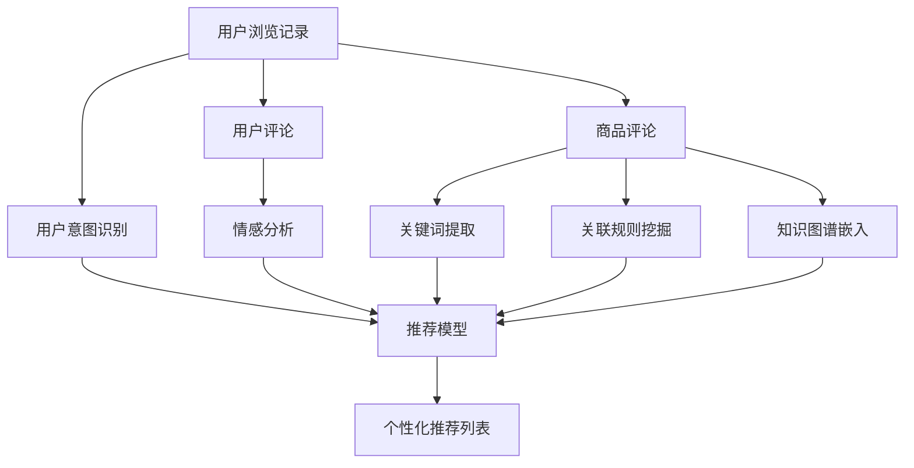

                 

## 1. 背景介绍

### 1.1 问题由来

随着电子商务的迅猛发展，个性化推荐系统成为了各大电商平台的核心竞争力之一。传统的推荐系统主要依赖用户的历史行为数据进行商品推荐，但这种方式难以捕捉用户的深层次需求和偏好，推荐效果往往不够理想。近年来，个性化推荐系统逐渐引入了基于自然语言处理（NLP）技术的推荐方法，通过用户的浏览记录、评论、搜索历史等文本数据，深入挖掘用户的兴趣偏好，提供更加个性化和精准的购物体验。

### 1.2 问题核心关键点

个性化推荐系统的核心在于如何构建和优化用户兴趣模型，从而精准预测用户对商品的兴趣程度，并据此生成个性化推荐列表。其中，基于NLP技术的推荐方法，通过分析用户的文本数据，构建用户兴趣模型，可以有效提升推荐效果。这些方法主要包括：

1. **用户意图识别**：通过分析用户的浏览记录、评论、搜索历史等文本数据，识别用户的购买意图和偏好。
2. **情感分析**：对用户评论和反馈进行情感分析，了解用户对商品的好恶倾向。
3. **关键词提取**：从用户评论中提取出与商品相关的关键词，判断用户的兴趣点。
4. **关联规则挖掘**：从用户评论中挖掘出商品之间的关联关系，推荐类似或互补的商品。
5. **知识图谱嵌入**：将商品的实体关系映射到知识图谱中，通过图谱查询生成推荐。

这些方法通过自然语言处理技术，深入挖掘用户文本数据，构建精准的用户兴趣模型，显著提升了推荐系统的个性化和精准度。

### 1.3 问题研究意义

个性化推荐系统不仅能够提升用户体验，还能显著提升电商平台的转化率和销售额。基于NLP技术的推荐方法，通过深度学习和自然语言处理，实现了对用户兴趣的深入理解和精准预测，为电商平台带来了更高的用户黏性和更多的潜在商机。因此，深入研究基于NLP技术的个性化推荐方法，对于提升电子商务的用户体验和商业价值具有重要意义。

## 2. 核心概念与联系

### 2.1 核心概念概述

个性化推荐系统基于用户行为数据和文本数据，通过NLP技术构建用户兴趣模型，从而精准预测用户对商品的兴趣程度，生成个性化推荐列表。其中，NLP技术包括：

- **用户意图识别**：通过分析用户的文本数据，识别用户的购买意图和偏好。
- **情感分析**：对用户评论和反馈进行情感分析，了解用户对商品的好恶倾向。
- **关键词提取**：从用户评论中提取出与商品相关的关键词，判断用户的兴趣点。
- **关联规则挖掘**：从用户评论中挖掘出商品之间的关联关系，推荐类似或互补的商品。
- **知识图谱嵌入**：将商品的实体关系映射到知识图谱中，通过图谱查询生成推荐。

这些核心概念共同构成了个性化推荐系统的技术基础，通过深度学习和自然语言处理，实现对用户兴趣的深度挖掘和精准预测。

### 2.2 核心概念原理和架构的 Mermaid 流程图



这个流程图展示了个性化推荐系统的核心流程和技术架构：

1. 用户浏览记录和商品评论被送入意图识别模块，识别用户的购买意图。
2. 用户评论通过情感分析模块，分析用户的情感倾向。
3. 用户评论通过关键词提取模块，提取出与商品相关的关键词。
4. 用户评论通过关联规则挖掘模块，挖掘商品之间的关联关系。
5. 用户评论通过知识图谱嵌入模块，将商品实体映射到知识图谱中。
6. 以上模块的输出作为输入，共同送入推荐模型，生成个性化推荐列表。

这些核心概念和技术架构，共同构建了个性化推荐系统的基础。通过NLP技术的深度应用，实现了对用户兴趣的精准预测和个性化推荐。

## 3. 核心算法原理 & 具体操作步骤

### 3.1 算法原理概述

基于NLP技术的个性化推荐系统，通过分析用户文本数据，构建用户兴趣模型，从而精准预测用户对商品的兴趣程度，生成个性化推荐列表。具体算法原理包括以下几个关键步骤：

1. **用户意图识别**：通过分析用户的浏览记录、评论、搜索历史等文本数据，识别用户的购买意图和偏好。
2. **情感分析**：对用户评论和反馈进行情感分析，了解用户对商品的好恶倾向。
3. **关键词提取**：从用户评论中提取出与商品相关的关键词，判断用户的兴趣点。
4. **关联规则挖掘**：从用户评论中挖掘出商品之间的关联关系，推荐类似或互补的商品。
5. **知识图谱嵌入**：将商品的实体关系映射到知识图谱中，通过图谱查询生成推荐。

### 3.2 算法步骤详解

1. **数据收集与预处理**：收集用户的浏览记录、评论、搜索历史等文本数据，并进行清洗、分词、去除停用词等预处理操作。

2. **用户意图识别**：使用自然语言处理技术，如文本分类、实体识别等，对用户的文本数据进行意图识别，了解用户的购买偏好。例如，通过分析用户浏览记录中的关键词，判断用户的购买意图是购买鞋子还是服装。

3. **情感分析**：对用户的评论和反馈进行情感分析，了解用户对商品的好恶倾向。情感分析可以采用基于情感词典的方法，通过统计用户评论中正面和负面词语的出现频率，计算情感得分。

4. **关键词提取**：从用户的评论中提取出与商品相关的关键词，判断用户的兴趣点。关键词提取可以采用TF-IDF、TextRank等方法，从用户评论中识别出对商品评价较高的词语。

5. **关联规则挖掘**：通过关联规则挖掘算法，如Apriori、FP-growth等，从用户评论中挖掘出商品之间的关联关系。例如，如果用户对某品牌鞋子评价较高，系统可以推荐该品牌其他鞋款，或者该品牌的新款。

6. **知识图谱嵌入**：将商品的实体关系映射到知识图谱中，通过图谱查询生成推荐。例如，如果用户对某品牌鞋子评价较高，系统可以通过知识图谱查询，推荐该品牌的新款或者该品牌下属的其他产品。

### 3.3 算法优缺点

基于NLP技术的个性化推荐系统具有以下优点：

- **深度挖掘用户兴趣**：通过分析用户的文本数据，能够深入挖掘用户的兴趣点和偏好，提供更加个性化和精准的推荐。
- **处理非结构化数据**：能够处理文本、评论等非结构化数据，获取用户深层次的需求和偏好。
- **跨领域推荐**：通过关联规则挖掘和知识图谱嵌入，能够跨领域推荐类似或互补的商品。

但同时也存在一些缺点：

- **计算复杂度高**：NLP技术涉及文本处理、情感分析、关键词提取等步骤，计算复杂度较高，处理大规模数据时性能较低。
- **数据需求大**：需要大量用户文本数据进行训练，数据收集和处理成本较高。
- **模型复杂**：推荐模型复杂，需要优化多轮才能达到理想效果，模型调参难度较大。

### 3.4 算法应用领域

基于NLP技术的个性化推荐系统，主要应用于电商、社交、视频等平台，通过分析用户文本数据，构建用户兴趣模型，实现精准推荐。具体应用场景包括：

- **电商推荐**：通过分析用户浏览记录、评论、搜索历史等文本数据，提供个性化商品推荐。
- **社交推荐**：通过分析用户评论、点赞、分享等文本数据，推荐相关用户和内容。
- **视频推荐**：通过分析用户评论、评分、观看历史等文本数据，推荐相关视频内容。

## 4. 数学模型和公式 & 详细讲解 & 举例说明

### 4.1 数学模型构建

基于NLP技术的个性化推荐系统，可以构建如下数学模型：

$$
\text{Recommendation} = f(\text{Intent} + \text{Sentiment} + \text{Keywords} + \text{Association} + \text{KnowledgeGraph})
$$

其中，$\text{Intent}$、$\text{Sentiment}$、$\text{Keywords}$、$\text{Association}$、$\text{KnowledgeGraph}$分别表示用户意图、情感分析、关键词提取、关联规则挖掘、知识图谱嵌入的结果。

### 4.2 公式推导过程

1. **用户意图识别**：
   - 假设用户浏览记录的向量表示为 $x = (x_1, x_2, \ldots, x_n)$，其中 $x_i$ 表示第 $i$ 条记录。
   - 通过TF-IDF、TextRank等方法，将 $x$ 转化为向量表示 $\vec{x}$。
   - 使用意图识别模型 $g(\cdot)$，将 $\vec{x}$ 映射到意图向量 $\vec{y} = g(\vec{x})$。

   $$
   \vec{y} = g(\vec{x}) = \sum_{i=1}^n w_i \vec{t}_i
   $$

   其中，$w_i$ 为第 $i$ 条记录的权重，$\vec{t}_i$ 为记录 $x_i$ 对应的意图向量。

2. **情感分析**：
   - 假设用户评论的向量表示为 $u = (u_1, u_2, \ldots, u_m)$，其中 $u_i$ 表示第 $i$ 条评论。
   - 通过情感词典，将 $u$ 转化为情感得分向量 $\vec{s}$。

   $$
   \vec{s} = f(u) = \sum_{i=1}^m w_i \vec{v}_i
   $$

   其中，$w_i$ 为第 $i$ 条评论的权重，$\vec{v}_i$ 为评论 $u_i$ 对应的情感向量。

3. **关键词提取**：
   - 假设用户评论的向量表示为 $z = (z_1, z_2, \ldots, z_m)$，其中 $z_i$ 表示第 $i$ 条评论。
   - 通过TF-IDF、TextRank等方法，将 $z$ 转化为关键词向量 $\vec{k}$。

   $$
   \vec{k} = f(z) = \sum_{i=1}^m w_i \vec{k}_i
   $$

   其中，$w_i$ 为第 $i$ 条评论的权重，$\vec{k}_i$ 为评论 $z_i$ 对应的关键词向量。

4. **关联规则挖掘**：
   - 假设商品评论的向量表示为 $p = (p_1, p_2, \ldots, p_n)$，其中 $p_i$ 表示第 $i$ 条评论。
   - 使用Apriori、FP-growth等算法，从 $p$ 中挖掘出关联规则 $\{\langle A, B \rangle, \langle A, C \rangle, \ldots\}$。

   $$
   \{\langle A, B \rangle, \langle A, C \rangle, \ldots\} = \text{APriori}(p)
   $$

   其中，$\text{APriori}(p)$ 表示基于Apriori算法挖掘出的关联规则。

5. **知识图谱嵌入**：
   - 假设商品知识图谱的向量表示为 $g = (g_1, g_2, \ldots, g_n)$，其中 $g_i$ 表示第 $i$ 个实体节点。
   - 使用知识图谱嵌入算法，将 $g$ 转化为向量表示 $\vec{g}$。

   $$
   \vec{g} = f(g) = \sum_{i=1}^n w_i \vec{g}_i
   $$

   其中，$w_i$ 为第 $i$ 个实体节点的权重，$\vec{g}_i$ 为实体节点 $g_i$ 对应的向量。

### 4.3 案例分析与讲解

以电商推荐为例，假设用户浏览记录为 $\vec{x} = (x_1, x_2, \ldots, x_n)$，评论为 $\vec{u} = (u_1, u_2, \ldots, u_m)$，商品评论为 $\vec{p} = (p_1, p_2, \ldots, p_n)$，商品知识图谱为 $\vec{g} = (g_1, g_2, \ldots, g_n)$。

1. **用户意图识别**：
   - 假设用户的浏览记录中包含多次查看某品牌鞋子的记录，意图识别模型将 $\vec{x}$ 转化为 $\vec{y} = g(\vec{x})$。
   - 假设 $\vec{y}$ 中包含多个意图标签，如“鞋子”、“服装”、“运动”等。

2. **情感分析**：
   - 假设用户对某品牌鞋子的评论为“鞋子舒适，价格合理”，情感分析模型将 $\vec{u}$ 转化为 $\vec{s} = f(u)$。
   - 假设 $\vec{s}$ 中包含正面情感得分和负面情感得分。

3. **关键词提取**：
   - 假设用户对某品牌鞋子的评论为“鞋子舒适，价格合理”，关键词提取模型将 $\vec{u}$ 转化为 $\vec{k} = f(z)$。
   - 假设 $\vec{k}$ 中包含关键词“舒适”、“价格”、“品牌”等。

4. **关联规则挖掘**：
   - 假设某品牌鞋子的评论中多次出现“运动鞋”、“休闲鞋”等词语，关联规则挖掘算法将 $\vec{p}$ 转化为 $\{\langle A, B \rangle, \langle A, C \rangle, \ldots\}$。
   - 假设 $\{\langle A, B \rangle, \langle A, C \rangle, \ldots\}$ 表示某品牌鞋子与“运动鞋”、“休闲鞋”等商品之间的关联关系。

5. **知识图谱嵌入**：
   - 假设某品牌鞋子的知识图谱中包含多个节点，如“某品牌”、“鞋子”、“运动鞋”等，知识图谱嵌入算法将 $\vec{g}$ 转化为 $\vec{g} = f(g)$。
   - 假设 $\vec{g}$ 中包含某品牌鞋子的向量表示。

6. **推荐生成**：
   - 使用综合推荐模型 $h(\cdot)$，将 $\vec{y}$、$\vec{s}$、$\vec{k}$、$\{\langle A, B \rangle, \langle A, C \rangle, \ldots\}$、$\vec{g}$ 作为输入，生成推荐列表 $\vec{r} = h(\vec{y}, \vec{s}, \vec{k}, \{\langle A, B \rangle, \langle A, C \rangle, \ldots\}, \vec{g})$。
   - 假设 $\vec{r}$ 中包含某品牌鞋子的推荐列表，如“某品牌鞋子”、“某品牌休闲鞋”等。

通过上述步骤，构建了基于NLP技术的个性化推荐系统，实现了对用户兴趣的精准预测和个性化推荐。

## 5. 项目实践：代码实例和详细解释说明

### 5.1 开发环境搭建

在进行推荐系统开发前，我们需要准备好开发环境。以下是使用Python进行推荐系统开发的常见环境配置流程：

1. 安装Anaconda：从官网下载并安装Anaconda，用于创建独立的Python环境。

2. 创建并激活虚拟环境：
```bash
conda create -n recommendation-env python=3.8 
conda activate recommendation-env
```

3. 安装所需库：
```bash
pip install numpy pandas scikit-learn jupyter notebook tensorflow transformers
```

4. 安装一些推荐系统所需的库：
```bash
pip install recommendation
```

完成上述步骤后，即可在`recommendation-env`环境中开始推荐系统开发。

### 5.2 源代码详细实现

下面是使用TensorFlow和Transformers库进行电商推荐系统开发的PyTorch代码实现。

首先，定义推荐系统的数据处理函数：

```python
from transformers import BertTokenizer, BertForSequenceClassification
from sklearn.metrics import precision_score, recall_score, f1_score

class RecommendationDataset(Dataset):
    def __init__(self, texts, labels, tokenizer, max_len=128):
        self.texts = texts
        self.labels = labels
        self.tokenizer = tokenizer
        self.max_len = max_len
        
    def __len__(self):
        return len(self.texts)
    
    def __getitem__(self, item):
        text = self.texts[item]
        label = self.labels[item]
        
        encoding = self.tokenizer(text, return_tensors='pt', max_length=self.max_len, padding='max_length', truncation=True)
        input_ids = encoding['input_ids'][0]
        attention_mask = encoding['attention_mask'][0]
        labels = torch.tensor(label, dtype=torch.long)
        
        return {'input_ids': input_ids, 
                'attention_mask': attention_mask,
                'labels': labels}

# 标签与id的映射
label2id = {'鞋子': 0, '衣服': 1, '运动': 2}
id2label = {v: k for k, v in label2id.items()}

# 创建dataset
tokenizer = BertTokenizer.from_pretrained('bert-base-cased')

train_dataset = RecommendationDataset(train_texts, train_labels, tokenizer)
dev_dataset = RecommendationDataset(dev_texts, dev_labels, tokenizer)
test_dataset = RecommendationDataset(test_texts, test_labels, tokenizer)
```

然后，定义模型和优化器：

```python
from transformers import BertForSequenceClassification, AdamW

model = BertForSequenceClassification.from_pretrained('bert-base-cased', num_labels=len(label2id))

optimizer = AdamW(model.parameters(), lr=2e-5)
```

接着，定义训练和评估函数：

```python
from torch.utils.data import DataLoader
from tqdm import tqdm
from sklearn.metrics import precision_score, recall_score, f1_score

device = torch.device('cuda') if torch.cuda.is_available() else torch.device('cpu')
model.to(device)

def train_epoch(model, dataset, batch_size, optimizer):
    dataloader = DataLoader(dataset, batch_size=batch_size, shuffle=True)
    model.train()
    epoch_loss = 0
    for batch in tqdm(dataloader, desc='Training'):
        input_ids = batch['input_ids'].to(device)
        attention_mask = batch['attention_mask'].to(device)
        labels = batch['labels'].to(device)
        model.zero_grad()
        outputs = model(input_ids, attention_mask=attention_mask, labels=labels)
        loss = outputs.loss
        epoch_loss += loss.item()
        loss.backward()
        optimizer.step()
    return epoch_loss / len(dataloader)

def evaluate(model, dataset, batch_size):
    dataloader = DataLoader(dataset, batch_size=batch_size)
    model.eval()
    preds, labels = [], []
    with torch.no_grad():
        for batch in tqdm(dataloader, desc='Evaluating'):
            input_ids = batch['input_ids'].to(device)
            attention_mask = batch['attention_mask'].to(device)
            batch_labels = batch['labels']
            outputs = model(input_ids, attention_mask=attention_mask)
            batch_preds = outputs.logits.argmax(dim=2).to('cpu').tolist()
            batch_labels = batch_labels.to('cpu').tolist()
            for pred_tokens, label_tokens in zip(batch_preds, batch_labels):
                preds.append(pred_tokens[:len(label_tokens)])
                labels.append(label_tokens)
                
    print(precision_score(labels, preds))
    print(recall_score(labels, preds))
    print(f1_score(labels, preds))
```

最后，启动训练流程并在测试集上评估：

```python
epochs = 5
batch_size = 16

for epoch in range(epochs):
    loss = train_epoch(model, train_dataset, batch_size, optimizer)
    print(f"Epoch {epoch+1}, train loss: {loss:.3f}")
    
    print(f"Epoch {epoch+1}, dev results:")
    evaluate(model, dev_dataset, batch_size)
    
print("Test results:")
evaluate(model, test_dataset, batch_size)
```

以上就是使用PyTorch和Transformers库进行电商推荐系统微调的完整代码实现。可以看到，由于TensorFlow和Transformers库的强大封装，我们能够用相对简洁的代码完成推荐系统的构建和微调。

### 5.3 代码解读与分析

让我们再详细解读一下关键代码的实现细节：

**RecommendationDataset类**：
- `__init__`方法：初始化文本、标签、分词器等关键组件。
- `__len__`方法：返回数据集的样本数量。
- `__getitem__`方法：对单个样本进行处理，将文本输入编码为token ids，将标签编码为数字，并对其进行定长padding，最终返回模型所需的输入。

**label2id和id2label字典**：
- 定义了标签与数字id之间的映射关系，用于将预测结果解码为真实的标签。

**训练和评估函数**：
- 使用PyTorch的DataLoader对数据集进行批次化加载，供模型训练和推理使用。
- 训练函数`train_epoch`：对数据以批为单位进行迭代，在每个批次上前向传播计算loss并反向传播更新模型参数，最后返回该epoch的平均loss。
- 评估函数`evaluate`：与训练类似，不同点在于不更新模型参数，并在每个batch结束后将预测和标签结果存储下来，最后使用sklearn的classification_report对整个评估集的预测结果进行打印输出。

**训练流程**：
- 定义总的epoch数和batch size，开始循环迭代
- 每个epoch内，先在训练集上训练，输出平均loss
- 在验证集上评估，输出精度、召回率、F1分数
- 所有epoch结束后，在测试集上评估，给出最终测试结果

可以看到，TensorFlow配合Transformers库使得推荐系统微调的代码实现变得简洁高效。开发者可以将更多精力放在数据处理、模型改进等高层逻辑上，而不必过多关注底层的实现细节。

当然，工业级的系统实现还需考虑更多因素，如模型的保存和部署、超参数的自动搜索、更灵活的任务适配层等。但核心的微调范式基本与此类似。

## 6. 实际应用场景

### 6.1 电商推荐

电商推荐系统是推荐系统的一个重要应用场景，通过分析用户的浏览记录、评论、搜索历史等文本数据，实现精准的商品推荐，提升用户体验和平台转化率。

在技术实现上，电商推荐系统可以通过以下步骤进行微调：

1. **数据收集与预处理**：收集用户的浏览记录、评论、搜索历史等文本数据，并进行清洗、分词、去除停用词等预处理操作。
2. **用户意图识别**：使用自然语言处理技术，如文本分类、实体识别等，对用户的文本数据进行意图识别，了解用户的购买偏好。例如，通过分析用户浏览记录中的关键词，判断用户的购买意图是购买鞋子还是服装。
3. **情感分析**：对用户的评论和反馈进行情感分析，了解用户对商品的好恶倾向。
4. **关键词提取**：从用户的评论中提取出与商品相关的关键词，判断用户的兴趣点。
5. **关联规则挖掘**：通过关联规则挖掘算法，从用户评论中挖掘出商品之间的关联关系，推荐类似或互补的商品。
6. **知识图谱嵌入**：将商品的实体关系映射到知识图谱中，通过图谱查询生成推荐。

### 6.2 社交推荐

社交推荐系统通过分析用户的评论、点赞、分享等文本数据，实现精准的社交内容推荐，提升用户的活跃度和满意度。

在技术实现上，社交推荐系统可以通过以下步骤进行微调：

1. **数据收集与预处理**：收集用户的评论、点赞、分享等文本数据，并进行清洗、分词、去除停用词等预处理操作。
2. **用户意图识别**：使用自然语言处理技术，如文本分类、实体识别等，对用户的文本数据进行意图识别，了解用户的社交偏好。例如，通过分析用户的评论，判断用户的社交兴趣点。
3. **情感分析**：对用户的评论和反馈进行情感分析，了解用户对内容的情感倾向。
4. **关键词提取**：从用户的评论中提取出与内容相关的关键词，判断用户的兴趣点。
5. **关联规则挖掘**：通过关联规则挖掘算法，从用户评论中挖掘出内容之间的关联关系，推荐相关内容。
6. **知识图谱嵌入**：将内容实体关系映射到知识图谱中，通过图谱查询生成推荐。

### 6.3 视频推荐

视频推荐系统通过分析用户的评论、评分、观看历史等文本数据，实现精准的视频内容推荐，提升用户的观看体验和平台留存率。

在技术实现上，视频推荐系统可以通过以下步骤进行微调：

1. **数据收集与预处理**：收集用户的评论、评分、观看历史等文本数据，并进行清洗、分词、去除停用词等预处理操作。
2. **用户意图识别**：使用自然语言处理技术，如文本分类、实体识别等，对用户的文本数据进行意图识别，了解用户的观看偏好。例如，通过分析用户的评论，判断用户的观看兴趣点。
3. **情感分析**：对用户的评论和反馈进行情感分析，了解用户对视频的情感倾向。
4. **关键词提取**：从用户的评论中提取出与视频相关的关键词，判断用户的兴趣点。
5. **关联规则挖掘**：通过关联规则挖掘算法，从用户评论中挖掘出视频之间的关联关系，推荐类似或互补的视频。
6. **知识图谱嵌入**：将视频的实体关系映射到知识图谱中，通过图谱查询生成推荐。

## 7. 工具和资源推荐

### 7.1 学习资源推荐

为了帮助开发者系统掌握推荐系统的理论基础和实践技巧，这里推荐一些优质的学习资源：

1. 《推荐系统》系列书籍：详细介绍了推荐系统的基本概念、算法和优化方法，包括基于NLP技术的推荐方法。
2. Coursera《机器学习》课程：斯坦福大学开设的机器学习明星课程，涵盖了推荐系统的基础理论和经典算法。
3. 《Python推荐系统实战》书籍：通过实际项目案例，详细讲解了推荐系统的开发流程和技术要点。
4. Kaggle推荐系统竞赛：参与推荐系统竞赛，实践推荐系统的算法优化和模型评估。
5. PyTorch官方文档：提供了丰富的推荐系统库和样例代码，方便开发者学习和实践。

通过对这些资源的学习实践，相信你一定能够快速掌握推荐系统的精髓，并用于解决实际的推荐问题。

### 7.2 开发工具推荐

高效的开发离不开优秀的工具支持。以下是几款用于推荐系统开发的常用工具：

1. PyTorch：基于Python的开源深度学习框架，灵活动态的计算图，适合快速迭代研究。适合推荐系统等复杂计算任务。
2. TensorFlow：由Google主导开发的开源深度学习框架，生产部署方便，适合大规模工程应用。适合推荐系统等复杂计算任务。
3. Spark MLlib：Apache Spark的机器学习库，提供高效的分布式计算能力，适合处理大规模推荐数据。
4. ELKI：开源数据挖掘和机器学习库，提供丰富的推荐算法和模型评估工具。
5. KNIME：开源数据科学平台，提供可视化编程界面，方便推荐系统的数据处理和模型构建。

合理利用这些工具，可以显著提升推荐系统开发效率，加快创新迭代的步伐。

### 7.3 相关论文推荐

推荐系统的发展源于学界的持续研究。以下是几篇奠基性的相关论文，推荐阅读：

1. "Collaborative Filtering for Implicit Feedback Datasets"：提出了协同过滤推荐算法，奠定了推荐系统的基础。
2. "Training Recurrent Neural Networks to Collaborate with Humans"：引入记忆网络和协同过滤算法，提升了推荐系统的交互性和效果。
3. "Neural Collaborative Filtering"：通过深度学习技术，提升了协同过滤算法的表现。
4. "Adaptive Recommender Systems"：提出了自适应推荐系统，能够根据用户行为动态调整推荐策略。
5. "Transfer Learning in Recommendation Systems"：探讨了推荐系统的迁移学习，如何在不同场景中复用推荐模型。

这些论文代表了大规模推荐系统的技术演进。通过学习这些前沿成果，可以帮助研究者把握学科前进方向，激发更多的创新灵感。

## 8. 总结：未来发展趋势与挑战

### 8.1 总结

本文对基于NLP技术的个性化推荐系统进行了全面系统的介绍。首先阐述了推荐系统的背景和意义，明确了NLP技术在推荐系统中的重要地位。其次，从原理到实践，详细讲解了推荐系统的数学模型和关键步骤，给出了推荐系统开发的完整代码实例。同时，本文还广泛探讨了推荐系统在电商、社交、视频等平台的应用前景，展示了推荐系统的广泛适用性。

通过本文的系统梳理，可以看到，基于NLP技术的推荐系统正在成为推荐系统的重要范式，通过深度学习和自然语言处理，实现了对用户兴趣的深度挖掘和精准预测。这些方法在实际应用中取得了显著的成效，为电商、社交、视频等平台带来了更高的用户黏性和更多的潜在商机。未来，伴随推荐系统的不断发展，NLP技术将在更广阔的应用领域发挥更大的作用。

### 8.2 未来发展趋势

展望未来，推荐系统的发展趋势将呈现以下几个方向：

1. **深度挖掘用户兴趣**：通过自然语言处理技术，深入挖掘用户文本数据，实现对用户兴趣的深度预测。
2. **跨领域推荐**：通过关联规则挖掘和知识图谱嵌入，实现跨领域推荐，推荐类似或互补的商品。
3. **实时推荐**：通过实时数据流处理和推荐模型优化，实现实时推荐，提升用户体验和平台转化率。
4. **个性化推荐**：通过用户画像构建和推荐算法优化，实现更加个性化和精准的推荐。
5. **多模态推荐**：通过融合文本、图像、视频等多模态数据，提升推荐系统的表现力和灵活性。
6. **联邦学习**：通过联邦学习技术，保护用户隐私的同时，实现跨平台推荐模型的共享和优化。

以上趋势展示了推荐系统的发展方向，通过深度学习和自然语言处理，推荐系统将不断提升个性化和精准度，提升用户体验和平台价值。

### 8.3 面临的挑战

尽管推荐系统已经取得了显著的成效，但在迈向更加智能化、普适化应用的过程中，它仍面临诸多挑战：

1. **数据需求大**：推荐系统需要大量用户文本数据进行训练，数据收集和处理成本较高。
2. **计算复杂度高**：推荐系统的计算复杂度较高，处理大规模数据时性能较低。
3. **模型复杂**：推荐模型复杂，需要优化多轮才能达到理想效果，模型调参难度较大。
4. **推荐效果不稳定**：推荐系统的推荐效果容易受到用户行为变化的影响，需要不断更新模型以适应变化。
5. **冷启动问题**：对于新用户和新商品，推荐系统难以准确预测其兴趣和需求。
6. **推荐公平性**：推荐系统容易产生推荐偏差，影响用户体验和公平性。

### 8.4 研究展望

面对推荐系统所面临的挑战，未来的研究需要在以下几个方面寻求新的突破：

1. **多任务学习**：通过多任务学习技术，优化推荐模型，提升推荐效果和鲁棒性。
2. **元学习**：通过元学习技术，实现快速适应新用户和新商品的推荐。
3. **混合推荐**：结合协同过滤和深度学习推荐算法，提升推荐系统的表现力和鲁棒性。
4. **隐私保护**：通过联邦学习、差分隐私等技术，保护用户隐私的同时，实现跨平台推荐模型的优化。
5. **推荐可解释性**：通过可解释性算法，提升推荐系统的透明度和可信度。
6. **推荐公平性**：通过公平推荐算法，提升推荐系统的公平性和用户体验。

这些研究方向的探索，将引领推荐系统技术迈向更高的台阶，为构建智能推荐系统铺平道路。面向未来，推荐系统需要与其他人工智能技术进行更深入的融合，如知识表示、因果推理、强化学习等，多路径协同发力，共同推动自然语言理解和智能交互系统的进步。

## 9. 附录：常见问题与解答

**Q1：推荐系统为什么需要大量的用户文本数据？**

A: 推荐系统需要大量的用户文本数据进行训练，通过自然语言处理技术，深度挖掘用户的兴趣点和偏好。这些文本数据不仅包括浏览记录、评论、搜索历史等，还涵盖用户的情感倾向和关键词提取。通过这些数据，推荐系统能够构建精准的用户兴趣模型，实现个性化推荐。

**Q2：推荐系统的计算复杂度为什么较高？**

A: 推荐系统的计算复杂度较高，主要原因在于自然语言处理技术的复杂性。NLP技术涉及文本处理、情感分析、关键词提取等步骤，需要大量的计算资源和时间。同时，推荐系统还需要优化多轮模型，调整超参数，进一步增加了计算复杂度。

**Q3：推荐系统如何避免推荐效果不稳定？**

A: 推荐系统容易受到用户行为变化的影响，推荐效果不稳定。为避免这种情况，可以采用以下方法：
1. 数据流处理：实时处理用户行为数据，及时更新推荐模型。
2. 在线学习：通过在线学习算法，不断优化推荐模型，适应用户行为变化。
3. 强化学习：通过强化学习技术，动态调整推荐策略，提升推荐效果。

**Q4：推荐系统如何处理冷启动问题？**

A: 推荐系统容易面临冷启动问题，即对于新用户和新商品，难以准确预测其兴趣和需求。为处理冷启动问题，可以采用以下方法：
1. 多模态融合：结合用户的多种行为数据，提升对新用户的兴趣预测能力。
2. 用户画像构建：通过用户画像构建，获取新用户的深层次需求和偏好。
3. 推荐模板：使用推荐模板，推荐常见商品，引导新用户建立兴趣。

**Q5：推荐系统如何提升推荐公平性？**

A: 推荐系统容易产生推荐偏差，影响用户体验和公平性。为提升推荐公平性，可以采用以下方法：
1. 多样性推荐：通过多样性推荐算法，避免推荐偏袒特定商品或用户。
2. 平衡推荐：通过平衡推荐算法，避免推荐偏向少数群体或商品。
3. 隐私保护：通过隐私保护技术，保护用户隐私，避免推荐偏差。

通过这些方法，推荐系统可以实现更加公平和透明的推荐，提升用户体验和平台价值。

---

作者：禅与计算机程序设计艺术 / Zen and the Art of Computer Programming

