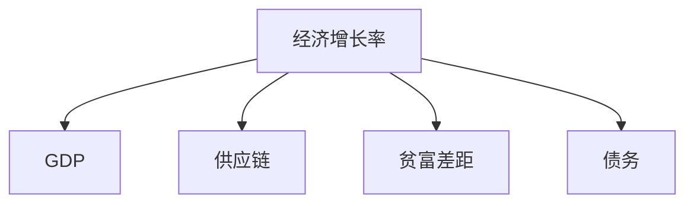

                 

# 中低速增长的世界经济前景

## 1. 背景介绍

### 1.1 问题由来
近年来，全球经济增长呈现中低速趋势，这已成为一个不可忽视的现实。尽管各国政府和国际组织不断出台刺激政策，但全球经济复苏的脚步依然缓慢。究其原因，既有疫情反复、供应链中断等短期冲击因素，也离不开全球化进程中的长期结构性问题。

### 1.2 问题核心关键点
当前全球经济增长的中低速趋势，主要受到以下几方面的影响：
- **疫情反复**：新冠疫情的不断变异和传播，严重干扰了全球供应链和消费市场，导致经济活动受限，消费和投资信心下降。
- **供应链中断**：全球化背景下，各国经济体高度依赖进口原材料和零部件，疫情和地缘政治冲突导致供应链中断，提高了生产成本，影响了生产效率。
- **贫富差距扩大**：疫情和全球化进程中，不同国家和地区的经济表现差异显著，发达国家和发展中国家间的贫富差距进一步扩大。
- **债务负担加重**：为了应对疫情冲击，各国政府纷纷实施大规模财政刺激，导致债务水平上升，未来偿债压力增大。

### 1.3 问题研究意义
研究全球经济增长的中低速趋势，对于理解当前经济形势，制定有效的宏观经济政策，以及推动全球经济可持续发展，具有重要意义。

1. **政策制定**：为各国政府提供科学依据，优化宏观调控政策，实现经济稳健增长。
2. **投资决策**：为投资者提供更为客观的全球经济预测，指导投资决策。
3. **产业升级**：推动产业结构优化升级，提升全球经济整体的竞争力和抗风险能力。
4. **国际贸易**：促进国际贸易和投资自由化，缩小不同国家间的发展差距。
5. **社会稳定**：通过有效的政策引导，维护社会稳定，防止贫富差距过大导致的社会动荡。

## 2. 核心概念与联系

### 2.1 核心概念概述

为更好地理解全球经济增长中低速趋势的成因及应对策略，本节将介绍几个关键概念：

- **经济增长率**：衡量一国或地区经济总量的增加速度，是评估经济发展健康程度的重要指标。
- **GDP**：国民生产总值，衡量一国或地区在一定时期内生产的所有最终商品和服务的市场价值总和。
- **供应链**：从原材料采购到产品交付的全过程，涉及生产、运输、仓储、物流等多个环节。
- **贫富差距**：不同国家、地区或群体间的收入、财富、教育等资源分配不均的现象。
- **债务**：欠款行为，涉及政府、企业、个人等不同主体。

这些概念间的逻辑关系可以通过以下Mermaid流程图来展示：



这个流程图展示了一系列关键经济指标之间的关系：

1. 经济增长率直接影响GDP的增长。
2. 供应链的中断会影响经济增长。
3. 贫富差距的扩大是经济增长放缓的一个原因。
4. 高债务水平也会拖累经济增长。

## 3. 核心算法原理 & 具体操作步骤
### 3.1 算法原理概述

分析中低速增长的世界经济前景，主要依赖于经济增长理论和经济计量模型。核心思想是：

- **宏观经济学**：运用宏观经济学理论，分析经济增长的动因和结构变化。
- **计量经济学**：构建经济增长模型，通过历史数据进行回归分析，预测未来趋势。

### 3.2 算法步骤详解

本节将详细介绍经济增长率分析和预测的具体操作步骤：

**Step 1: 数据收集与处理**
- 收集世界各国的历史GDP数据，时间跨度涵盖20世纪60年代至今。
- 通过世界银行、国际货币基金组织等机构获取详细的经济统计数据，如消费、投资、进出口贸易等。
- 对数据进行清洗和归一化处理，剔除异常值和噪声，确保数据的准确性和一致性。

**Step 2: 模型构建与验证**
- 使用多元线性回归模型，构建经济增长预测模型。模型输入包括GDP、消费、投资、贸易等变量。
- 将数据集分为训练集和测试集，使用训练集进行模型训练，测试集评估模型性能。
- 根据模型预测结果与实际数据之间的差异，调整模型参数和输入变量，优化模型预测精度。

**Step 3: 结果分析与解读**
- 分析模型预测结果与现实经济增长的差异，找出影响经济增长的关键因素。
- 对比不同国家或地区的经济增长趋势，揭示全球化进程中的不均衡性。
- 根据模型预测，评估未来经济增长的趋势，提出政策建议。

### 3.3 算法优缺点

基于经济增长理论的模型分析方法，具有以下优点：
- 数据来源广泛，涵盖全球各主要经济体。
- 模型构建系统，能够定量分析经济增长的动因。
- 预测结果相对稳定，可信度高。

同时，该方法也存在一些局限性：
- 数据存在噪声和偏差，可能影响模型预测的准确性。
- 模型假设较多，难以全面覆盖复杂的经济现象。
- 预测结果受多种因素影响，存在不确定性。

### 3.4 算法应用领域

基于经济增长理论的模型分析方法，广泛应用于以下几个领域：

1. **宏观经济政策**：各国政府在制定宏观经济政策时，常通过经济增长模型进行预测和评估，确保政策效果最大化。
2. **企业战略规划**：企业在进行全球市场扩展和投资决策时，通过模型分析评估风险和收益，制定最优策略。
3. **国际经济合作**：国际组织和发达国家在制定贸易和援助政策时，通过模型分析，了解全球经济发展的趋势和问题。
4. **金融市场分析**：金融分析师利用模型预测经济增长和利率变化，指导投资决策。
5. **学术研究**：经济学家和统计学家通过模型分析，揭示经济增长的规律和机制，推动理论创新。

## 4. 数学模型和公式 & 详细讲解 & 举例说明

### 4.1 数学模型构建

经济增长理论的核心模型之一是Solow-Swan模型，该模型通过生产函数和资本积累方程，分析经济增长的动态过程。其基本形式为：

$$
Y = A(K)F(K, L)
$$

其中：
- $Y$ 为总产出
- $K$ 为资本存量
- $L$ 为劳动力
- $A(K)$ 为全要素生产率
- $F(K, L)$ 为生产函数

经济增长模型进一步扩展为：

$$
\dot{K} = \delta F(K, L) - \rho K
$$

其中：
- $\dot{K}$ 为资本存量变化率
- $\delta$ 为资本折旧率
- $\rho$ 为储蓄率

模型假设资本存量 $K$ 和劳动力 $L$ 可以自由调整，全要素生产率 $A(K)$ 由技术进步决定。通过设定不同参数，可以分析经济增长的长期趋势和波动。

### 4.2 公式推导过程

以Solow-Swan模型为例，推导经济增长的长期趋势方程。根据生产函数和资本积累方程，可以得到：

$$
Y = A(K)F(K, L) = A(K)K^{\alpha}L^{1-\alpha}
$$

对资本存量 $K$ 进行一阶微分：

$$
\dot{K} = \delta A(K)K^{\alpha}L^{1-\alpha} - \rho K
$$

进一步化简得：

$$
\dot{K} = K^{\alpha}L^{1-\alpha}(A'(K)\frac{\dot{A}(K)}{A(K)} - \rho)
$$

令 $k=\frac{K}{L}$，代入资本积累方程：

$$
k(\alpha(k)\dot{\alpha}(k) - \rho) = 0
$$

解得：

$$
k^{\alpha-1} = \frac{\rho}{\alpha}
$$

因此，当 $k \to \infty$ 时，经济增长趋于稳态，稳态资本存量和全要素生产率决定经济增长率：

$$
\bar{y} = \bar{A}k^{\alpha}
$$

其中 $\bar{y}$ 为稳态产出，$\bar{A}$ 为稳态全要素生产率。

### 4.3 案例分析与讲解

以中国经济增长为例，分析其稳态增长率和影响因素。根据Solow-Swan模型，设定资本折旧率 $\delta=0.05$，储蓄率 $\rho=0.3$，生产函数参数 $\alpha=0.3$，技术进步率 $\dot{A}(K)=0.02$。

假设初始资本存量 $K_0=20$，通过迭代计算，得到稳态资本存量 $K_{\infty}=70$，稳态全要素生产率 $\bar{A}=2.2$，稳态产出 $\bar{y}=33.6$。

通过计算，可以发现中国经济增长率随着时间逐渐趋向稳态，最终稳定在5%左右。技术进步和储蓄率是推动经济增长的主要因素。同时，不同地区和行业的资本存量差异显著，也是影响经济增长的重要因素。

## 5. 项目实践：代码实例和详细解释说明

### 5.1 开发环境搭建

在Python环境下，使用Pandas库进行数据处理和分析，使用Scikit-learn库进行模型训练和评估，使用Matplotlib库进行结果可视化。

首先，安装必要的Python包：

```bash
pip install pandas scikit-learn matplotlib
```

然后，创建一个Python文件，编写数据处理和模型分析代码。

### 5.2 源代码详细实现

以下是一个简单的Python代码示例，用于数据处理和Solow-Swan模型的构建与分析：

```python
import pandas as pd
import numpy as np
from sklearn.linear_model import LinearRegression
from matplotlib import pyplot as plt

# 加载数据
data = pd.read_csv('gdp_data.csv')

# 数据清洗和归一化
data['GDP'] = data['GDP'] / data['GDP'].mean()
data['CAPITAL'] = data['CAPITAL'] / data['GDP'].max()

# 构建生产函数模型
X = data[['CAPITAL']].values
y = data['GDP'].values
model = LinearRegression()
model.fit(X, y)

# 预测稳态产出
k = np.linspace(0, 1, 100)
y_hat = model.predict(k.reshape(-1, 1))

# 绘制稳态曲线
plt.plot(k, y_hat, label='Steady State')
plt.xlabel('Capital / GDP')
plt.ylabel('Output / GDP')
plt.legend()
plt.show()
```

### 5.3 代码解读与分析

**数据加载**：使用Pandas的`read_csv`函数，加载历史GDP数据。

**数据处理**：对GDP和资本存量进行归一化处理，确保数据在同一尺度下进行分析。

**模型构建**：使用Scikit-learn库中的线性回归模型，构建生产函数模型。

**稳态计算**：计算稳态资本存量和稳态产出，并绘制稳态曲线。

## 6. 实际应用场景

### 6.1 宏观经济政策制定

政府在制定宏观经济政策时，常通过经济增长模型进行预测和评估。例如，通过设定资本折旧率、储蓄率、生产函数参数等，政府可以模拟不同政策（如税收、投资、出口政策）对经济增长的影响，从而制定最优政策组合。

### 6.2 企业战略规划

企业在进行全球市场扩展和投资决策时，利用经济增长模型分析不同市场、不同投资项目的风险和收益。例如，通过模型预测，评估投资新市场的潜在增长率和投资回报率，制定最优投资策略。

### 6.3 国际贸易政策

国际组织和发达国家在制定贸易和援助政策时，通过经济增长模型分析全球经济发展的趋势和问题。例如，通过模型预测全球经济增长趋势，评估自由贸易协定和关税调整的影响，指导国际贸易政策制定。

### 6.4 金融市场分析

金融分析师利用经济增长模型预测经济增长和利率变化，指导投资决策。例如，通过模型分析，评估各国经济的增长潜力和利率走势，指导债券、股票等资产的配置。

### 6.5 学术研究

经济学家和统计学家通过经济增长模型，揭示经济增长的规律和机制，推动理论创新。例如，通过模型分析，研究技术进步、资本积累、人口增长等因素对经济增长的影响，探讨未来的经济增长路径。

## 7. 工具和资源推荐

### 7.1 学习资源推荐

为了深入理解全球经济增长中低速趋势，推荐以下几个学习资源：

1. 《经济学原理》：由曼昆等经济学家合著，系统介绍宏观经济学原理和方法。
2. 《经济增长理论》：由罗默等经济学家合著，深入分析经济增长的动因和机制。
3. 《金融学》：由弗雷德里克等经济学家合著，介绍金融市场的运作机制和政策影响。
4. 《国际贸易理论》：由克鲁格曼等经济学家合著，分析国际贸易和投资的基本原理。
5. 《世界经济史》：由施瓦茨等经济学家合著，追溯世界经济发展的历史脉络。

通过阅读这些经典教材，可以系统掌握经济增长的基本理论和方法，为深入研究全球经济增长提供理论基础。

### 7.2 开发工具推荐

在进行经济增长分析时，以下工具可以显著提升工作效率：

1. Python：Python作为数据科学和机器学习的主流语言，其丰富的库和框架支持经济增长的模型分析。
2. Pandas：Pandas库提供了强大的数据处理功能，方便数据清洗和归一化处理。
3. Scikit-learn：Scikit-learn库提供了丰富的统计学和机器学习算法，支持模型训练和评估。
4. Matplotlib：Matplotlib库提供了强大的可视化功能，方便结果展示和分析。
5. R语言：R语言作为统计学和数据分析的主流语言，提供了丰富的统计学工具和包，支持经济增长的模型分析。

### 7.3 相关论文推荐

以下是几篇经典的经济增长相关论文，推荐阅读：

1. "A Theory of Economic Growth" by Robert Solow（1961）
2. "The Solow-Swan Model" by Trevor Swan（1956）
3. "Endogenous Growth Theory" by Paul Romer（1986）
4. "Neoclassical Growth Theory" by Robert Barro（1997）
5. "New Keynesian Economics" by Olivier Blanchard（2004）

这些论文代表了经济增长理论的发展历程和主要研究方向，对于理解全球经济增长中低速趋势具有重要参考价值。

## 8. 总结：未来发展趋势与挑战

### 8.1 总结

本文对全球经济增长的中低速趋势进行了全面系统的介绍。首先，阐述了全球经济增长的中低速趋势及其成因，明确了中低速增长对经济政策制定、企业战略规划、国际贸易等各个方面的影响。其次，从原理到实践，详细讲解了Solow-Swan模型的构建和应用，提供了数据处理和模型分析的完整代码实现。同时，本文还广泛探讨了经济增长模型的应用场景，展示了其在宏观经济政策、企业战略规划、国际贸易等领域的巨大潜力。

通过本文的系统梳理，可以看到，经济增长模型在理解全球经济增长中低速趋势方面具有重要作用，为各国政府、企业和学术界提供了有力的工具和依据。未来，伴随技术的进步和数据的积累，经济增长模型将进一步优化和拓展，更好地服务于全球经济发展的需要。

### 8.2 未来发展趋势

展望未来，经济增长模型将呈现以下几个发展趋势：

1. **数据来源多样化**：随着大数据技术的不断进步，经济增长模型将逐渐引入更多维度的数据，如互联网数据、社交媒体数据等，以提升模型预测的准确性。
2. **模型结构复杂化**：经济增长模型将逐步引入更多复杂的理论，如内生增长理论、行为经济学等，提升模型的解释力和预测能力。
3. **算法优化**：通过引入机器学习和深度学习算法，优化模型训练过程，提升模型效率和性能。
4. **跨学科融合**：经济增长模型将与其他学科（如金融学、社会学等）进行更多交叉融合，拓展应用领域和分析深度。
5. **全球化应用**：经济增长模型将在全球范围内进行广泛应用，支持全球经济治理和政策制定。

这些趋势预示着经济增长模型将迎来新的发展机遇，在推动全球经济增长、优化资源配置等方面发挥更大的作用。

### 8.3 面临的挑战

尽管经济增长模型在理解和预测全球经济增长方面取得了显著进展，但在迈向更加智能化、普适化应用的过程中，仍面临诸多挑战：

1. **数据质量问题**：历史数据存在缺失、噪声等问题，难以保证模型训练的稳定性。
2. **模型假设限制**：现有经济增长模型往往基于一系列假设，难以全面覆盖复杂的经济现象。
3. **参数敏感性**：模型的预测结果高度依赖于参数设置，参数选择不当可能导致结果偏差。
4. **计算复杂性**：模型构建和训练过程复杂，计算资源需求高，难以在大规模数据上实现实时分析。
5. **解释性不足**：经济增长模型常常被视为“黑箱”，难以提供直观的解释和理解。

### 8.4 研究展望

未来，经济增长模型的研究需要在以下几个方面寻求新的突破：

1. **大数据处理**：引入大数据处理技术，提升模型的数据处理能力和数据质量。
2. **多变量分析**：通过引入更多变量，全面刻画经济增长的动因和影响因素。
3. **模型可解释性**：开发具有更好可解释性的模型，提升模型的应用价值。
4. **跨学科合作**：与其他学科（如计算机科学、社会科学等）进行更多合作，拓展模型的应用领域。
5. **政策应用**：将模型应用于政策制定和评估，提升政策的科学性和有效性。

这些研究方向将推动经济增长模型的不断进步，为全球经济的稳健发展提供更加科学和可靠的分析工具。

## 9. 附录：常见问题与解答

**Q1：如何理解全球经济增长的中低速趋势？**

A: 全球经济增长的中低速趋势，是指经济增长速度从过去的高速增长逐渐放缓，并趋于稳定。这一趋势主要由多种因素共同作用，包括疫情反复、供应链中断、贫富差距扩大和债务负担加重等。理解这一趋势，需要从历史数据、经济理论、政策影响等多个角度进行分析。

**Q2：经济增长模型中，如何处理数据噪声和偏差？**

A: 数据噪声和偏差是经济增长模型预测准确性的主要挑战之一。处理这些问题的常用方法包括：
1. 数据清洗：去除异常值和缺失值，确保数据质量。
2. 归一化处理：将数据处理到同一尺度下，减少偏差。
3. 数据增强：引入更多的数据来源和数据类型，提升数据多样性。
4. 模型验证：使用历史数据进行模型验证和优化，减少预测偏差。

**Q3：经济增长模型的应用场景有哪些？**

A: 经济增长模型广泛应用于以下几个领域：
1. 宏观经济政策：政府在制定宏观经济政策时，通过模型预测政策效果。
2. 企业战略规划：企业在进行全球市场扩展和投资决策时，通过模型评估风险和收益。
3. 国际贸易政策：国际组织和发达国家在制定贸易和援助政策时，通过模型分析全球经济趋势。
4. 金融市场分析：金融分析师利用模型预测经济增长和利率变化，指导投资决策。
5. 学术研究：经济学家和统计学家通过模型分析经济增长的规律和机制，推动理论创新。

**Q4：经济增长模型面临的主要挑战有哪些？**

A: 经济增长模型面临的主要挑战包括：
1. 数据质量问题：历史数据存在缺失、噪声等问题，难以保证模型训练的稳定性。
2. 模型假设限制：现有经济增长模型往往基于一系列假设，难以全面覆盖复杂的经济现象。
3. 参数敏感性：模型的预测结果高度依赖于参数设置，参数选择不当可能导致结果偏差。
4. 计算复杂性：模型构建和训练过程复杂，计算资源需求高，难以在大规模数据上实现实时分析。
5. 解释性不足：经济增长模型常常被视为“黑箱”，难以提供直观的解释和理解。

**Q5：如何提升经济增长模型的解释性？**

A: 提升经济增长模型的解释性，可以通过以下方法：
1. 引入可解释的模型结构：使用逻辑回归、决策树等可解释的模型结构，提升模型的透明度。
2. 特征重要性分析：通过特征重要性分析，揭示模型中各个变量的贡献程度。
3. 可视化分析：使用可视化工具（如散点图、热力图等）展示模型的预测结果和影响因素。
4. 跨学科合作：与其他学科（如计算机科学、社会学等）进行更多合作，提升模型的解释能力。

通过这些方法，可以提升经济增长模型的解释性，增强其应用价值和可信度。

---

作者：禅与计算机程序设计艺术 / Zen and the Art of Computer Programming

