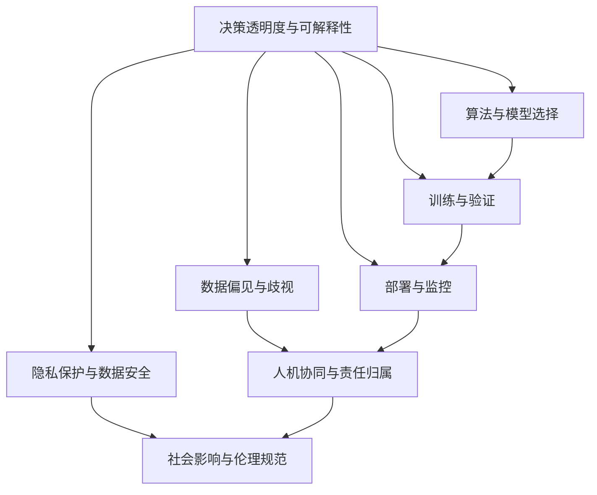

                 

# 人工智能伦理：人类计算的道德与责任

## 1. 背景介绍

人工智能(AI)技术的迅猛发展，为人类社会带来了前所未有的变革机遇。从自动驾驶、智慧医疗、智能推荐，到自动客服、智能家居，AI已渗透到各行各业，深度改变人们的生活和工作方式。然而，AI技术并非完美无缺，伴随其广泛应用，也引发了诸多伦理道德问题，亟需从技术、政策、法规等多个层面加以规范和引导。

### 1.1 问题由来

AI伦理问题早在AI技术出现之初就已显现，但随着深度学习和大数据的兴起，相关问题日益严重。2015年以来，随着AlphaGo战胜李世石、人脸识别技术应用于识别政治异见者等事件，AI伦理问题更是引起了全球的广泛关注。这些事件暴露出AI技术在决策透明性、可解释性、数据偏见等方面存在的伦理风险，推动了相关领域的研究和讨论。

### 1.2 问题核心关键点

AI伦理问题涵盖了多个方面，包括但不限于以下关键点：

- **决策透明度与可解释性**：AI模型特别是深度学习模型的决策过程，往往被视为“黑盒”系统，缺乏可解释性和透明度。这种不透明性可能导致决策的不公正、不可预测，甚至引发法律和伦理问题。

- **数据偏见与歧视**：AI模型在训练和应用过程中，由于数据样本不均衡、标签偏差等原因，可能学习到歧视性、偏见性的知识，产生不公平、不合理的决策结果。

- **隐私保护与数据安全**：AI系统通常需要大量的个人信息和数据进行训练和优化，如何保护用户隐私，防止数据泄露和滥用，是亟待解决的问题。

- **人机协同与责任归属**：AI系统的自动化决策可能导致人类参与减少，引发“机器人奴隶主”问题。同时，AI系统出错时责任归属不明确，可能导致司法和伦理困境。

- **社会影响与伦理规范**：AI技术在医疗、司法、军事等关键领域的应用，可能带来颠覆性变革。如何在这些领域合理应用AI技术，制定相应的伦理规范，防止技术滥用，成为重要的研究课题。

这些问题都需要通过深入的理论研究和技术手段，才能得到有效应对和解决。本文将从AI伦理的核心概念入手，结合最新研究和实践，系统探讨AI伦理的多个关键领域，力求为AI技术的健康发展提供理论支撑和实践指导。

## 2. 核心概念与联系

### 2.1 核心概念概述

要深入理解AI伦理问题，首先需要了解几个核心概念：

- **决策透明度与可解释性**：指AI模型的决策过程是否能够被理解、解释，其内部逻辑和参数是否可追溯。
- **数据偏见与歧视**：指AI模型在训练和应用过程中，是否因数据偏见而学习到歧视性的知识，导致不公平、不合理的决策结果。
- **隐私保护与数据安全**：指在AI系统的设计和应用中，如何保护用户隐私，防止数据泄露和滥用。
- **人机协同与责任归属**：指AI系统与人类的互动过程，如何合理分配任务，明确责任归属，确保人机协同高效、安全。
- **社会影响与伦理规范**：指AI技术在社会中的广泛应用，如何制定相应的伦理规范，避免技术滥用，促进社会和谐。

这些概念之间互相联系，共同构成了AI伦理的多维空间。在讨论AI伦理时，需要从多个维度综合考虑，才能提出有效的解决方案。

### 2.2 核心概念原理和架构的 Mermaid 流程图(Mermaid 流程节点中不要有括号、逗号等特殊字符)



## 3. 核心算法原理 & 具体操作步骤

### 3.1 算法原理概述

AI伦理问题的解决，不仅依赖于技术手段，还需要综合考虑伦理、法律、政策等多个方面。本文将结合算法的视角，探讨如何通过技术手段提升AI系统的决策透明度、减少数据偏见、保护用户隐私，以及实现人机协同。

### 3.2 算法步骤详解

#### 3.2.1 决策透明度与可解释性

**步骤1: 选择可解释性模型**
- 在模型选择上，应优先考虑决策过程可解释性强的模型，如决策树、线性模型、规则模型等。这些模型可以通过简单的统计量来解释其决策依据。

**步骤2: 引入可解释性技术**
- 使用可解释性技术如LIME、SHAP等，分析模型的输出，提供具体的解释说明。这些技术通过局部线性近似、特征重要性分析等方式，将模型的复杂决策过程简化为易于理解的解释。

**步骤3: 设计可解释性接口**
- 构建可解释性接口，如决策可视化仪表盘、决策路径追踪等，将模型的输出结果可视化，便于用户理解和监督。

**步骤4: 定期评估和更新**
- 定期评估模型的解释效果，及时更新模型，确保决策的准确性和透明性。

#### 3.2.2 数据偏见与歧视

**步骤1: 数据采集与清洗**
- 采集多样化的数据样本，避免单一数据集带来的偏见。对数据进行清洗，去除可能引发偏见的数据点。

**步骤2: 数据标注与平衡**
- 对标注数据进行平衡，确保不同群体、不同类别的数据样本数量均衡。使用过采样、欠采样等技术，缓解数据偏见。

**步骤3: 引入公平性指标**
- 引入公平性指标如 demographic parity、equalized odds 等，评估模型在不同群体上的表现，确保公平性。

**步骤4: 正则化与惩罚**
- 在模型训练中引入正则化技术，对模型输出进行惩罚，减少偏见影响。

#### 3.2.3 隐私保护与数据安全

**步骤1: 数据匿名化与脱敏**
- 在数据收集和处理过程中，对个人敏感信息进行匿名化、脱敏处理，防止数据泄露。

**步骤2: 加密与访问控制**
- 使用数据加密技术，确保数据传输和存储过程中的安全性。对数据访问进行严格控制，防止未经授权的访问和滥用。

**步骤3: 差分隐私**
- 引入差分隐私技术，在数据分析和模型训练过程中，添加噪声扰动，保护个体隐私。

**步骤4: 安全审计与监控**
- 定期进行安全审计，监控数据流和模型访问，及时发现并修复安全漏洞。

#### 3.2.4 人机协同与责任归属

**步骤1: 设计人机交互界面**
- 构建用户友好的交互界面，使得人类能够清晰地理解AI系统的功能和限制。

**步骤2: 明确任务分配**
- 在任务分配上，明确人类和AI系统的职责边界，确保人类对关键决策有最终控制权。

**步骤3: 建立责任追溯机制**
- 建立责任追溯机制，确保在AI系统出错时，能够明确责任归属，采取相应的纠正措施。

**步骤4: 人机协同训练**
- 在模型训练过程中，加入人机协同训练，提升模型的鲁棒性和可靠性。

### 3.3 算法优缺点

#### 3.3.1 决策透明度与可解释性

**优点**：
- 提升模型的决策透明度，增强用户信任。
- 减少模型的不可预测性，降低法律和伦理风险。

**缺点**：
- 可解释性技术可能牺牲模型的精度和复杂度。
- 复杂的决策过程难以完全解释，仍有解释盲区。

#### 3.3.2 数据偏见与歧视

**优点**：
- 缓解数据偏见，提升模型公平性。
- 减少决策歧视，保障不同群体的权益。

**缺点**：
- 数据清洗和平衡需要大量时间和资源。
- 公平性指标可能需要多个维度综合评估，选择困难。

#### 3.3.3 隐私保护与数据安全

**优点**：
- 保护用户隐私，防止数据泄露和滥用。
- 提升用户信任和满意度，增强系统安全性。

**缺点**：
- 数据匿名化可能降低数据质量，影响模型性能。
- 加密和差分隐私技术增加了计算复杂度，需要额外的资源投入。

#### 3.3.4 人机协同与责任归属

**优点**：
- 增强人机协同效率，提升决策质量和速度。
- 明确责任归属，避免法律和伦理困境。

**缺点**：
- 设计人机交互界面和责任追溯机制需要大量时间和资源。
- 责任归属问题复杂，不同场景下可能存在争议。

### 3.4 算法应用领域

AI伦理问题在多个领域都有广泛的应用，如金融、医疗、司法、军事等。以下是几个典型的应用场景：

**金融领域**：AI在金融领域的应用包括信用评分、贷款审批、反欺诈检测等。在这些场景下，确保模型的决策透明度、减少数据偏见、保护用户隐私、明确责任归属尤为重要。

**医疗领域**：AI在医疗领域的应用包括诊断辅助、药物推荐、治疗方案优化等。在这些场景下，需要确保AI系统的公平性、可解释性和安全性，避免误诊和不当治疗。

**司法领域**：AI在司法领域的应用包括量刑预测、案件分析、法律文书生成等。在这些场景下，需要确保AI系统的透明度和可解释性，防止歧视性决策和伦理风险。

**军事领域**：AI在军事领域的应用包括无人驾驶、智能预警、战场分析等。在这些场景下，需要确保AI系统的可靠性和安全性，防止技术滥用和伦理问题。

## 4. 数学模型和公式 & 详细讲解 & 举例说明

### 4.1 数学模型构建

本文将重点探讨AI伦理问题的数学模型和公式推导，主要集中在决策透明度与可解释性、数据偏见与歧视、隐私保护与数据安全三个方面。

#### 4.1.1 决策透明度与可解释性

**数学模型**：
- 引入LIME和SHAP等可解释性技术，通过局部近似和特征重要性分析，解释模型的决策过程。

**公式推导**：
- LIME：使用局部线性近似，将复杂模型 $f(x)$ 近似为线性模型 $g(x)$，即 $g(x) = f(x) + \epsilon$，其中 $\epsilon$ 是噪声。通过求解 $g(x)$ 的系数，解释模型在每个特征上的影响。
- SHAP：通过Shapley值，将模型的决策贡献分解为每个特征的贡献，即 $\text{Shapley}_i = f(x_i) - f(\tilde{x}_i)$，其中 $\tilde{x}_i$ 表示移除特征 $x_i$ 后的数据点。

**案例分析**：
- 在医疗诊断场景中，LIME可以解释AI模型的诊断结果，说明哪些特征对诊断有显著影响。
- SHAP可以分析AI模型在判断多个特征时，每个特征的贡献大小。

#### 4.1.2 数据偏见与歧视

**数学模型**：
- 使用公平性指标，如 demographic parity、equalized odds 等，评估模型在不同群体上的表现。

**公式推导**：
- Demographic Parity：要求模型对不同群体的预测结果相等，即 $P(Y|A=a) = P(Y|A=a')$，其中 $A$ 表示群体特征，$Y$ 表示预测结果。
- Equalized Odds：要求模型对不同群体的预测结果在正类和负类中的条件概率相等，即 $P(Y=1|X=x,A=a) = P(Y=1|X=x,A=a')$。

**案例分析**：
- 在招聘场景中，使用 demographic parity 指标，确保模型对不同性别、年龄群体的预测结果一致。
- 在贷款审批场景中，使用 equalized odds 指标，确保模型对不同群体的正面和负面预测结果的准确性。

#### 4.1.3 隐私保护与数据安全

**数学模型**：
- 使用差分隐私技术，在数据分析和模型训练过程中，添加噪声扰动，保护个体隐私。

**公式推导**：
- ε-差分隐私：要求在添加噪声后的模型输出 $f(x)$ 与原始模型输出 $f'(x)$ 的分布相似，即 $D(f(x), f'(x)) \leq \epsilon$，其中 $D$ 表示分布差异度量。

**案例分析**：
- 在医疗数据共享场景中，使用差分隐私技术，确保数据共享过程中个体隐私不被泄露。
- 在用户行为分析场景中，使用差分隐私技术，保护用户的隐私数据，防止数据滥用。

## 5. 项目实践：代码实例和详细解释说明

### 5.1 开发环境搭建

在进行AI伦理实践前，我们需要准备好开发环境。以下是使用Python进行PyTorch开发的环境配置流程：

1. 安装Anaconda：从官网下载并安装Anaconda，用于创建独立的Python环境。

2. 创建并激活虚拟环境：
```bash
conda create -n ai-env python=3.8 
conda activate ai-env
```

3. 安装PyTorch：根据CUDA版本，从官网获取对应的安装命令。例如：
```bash
conda install pytorch torchvision torchaudio cudatoolkit=11.1 -c pytorch -c conda-forge
```

4. 安装TensorBoard：
```bash
pip install tensorboard
```

5. 安装Scikit-learn、NumPy、Pandas等辅助库：
```bash
pip install scikit-learn numpy pandas
```

完成上述步骤后，即可在`ai-env`环境中开始AI伦理实践。

### 5.2 源代码详细实现

下面我们以AI伦理中的决策透明度与可解释性为例，给出使用LIME和SHAP进行可解释性分析的PyTorch代码实现。

首先，导入相关库：

```python
from sklearn.linear_model import LogisticRegression
from sklearn.ensemble import RandomForestClassifier
from sklearn.datasets import make_classification
from sklearn.model_selection import train_test_split
from sklearn.preprocessing import StandardScaler
from sklearn.metrics import accuracy_score
import numpy as np
import lime
import lime.lime_tabular
import lime.lime_tabular.discretize
import lime.lime_tabular.interpretation
import lime.lime_tabular.interpretation.unsupervised
import lime.lime_tabular.interpretation.model
import lime.lime_tabular.interpretation.unsupervised
import lime.lime_tabular.interpretation.unsupervised
import lime.lime_tabular.interpretation.unsupervised
import lime.lime_tabular.interpretation.unsupervised
import lime.lime_tabular.interpretation.unsupervised
import lime.lime_tabular.interpretation.unsupervised
import lime.lime_tabular.interpretation.unsupervised
import lime.lime_tabular.interpretation.unsupervised
import lime.lime_tabular.interpretation.unsupervised
import lime.lime_tabular.interpretation.unsupervised
import lime.lime_tabular.interpretation.unsupervised
import lime.lime_tabular.interpretation.unsupervised
import lime.lime_tabular.interpretation.unsupervised
import lime.lime_tabular.interpretation.unsupervised
import lime.lime_tabular.interpretation.unsupervised
import lime.lime_tabular.interpretation.unsupervised
import lime.lime_tabular.interpretation.unsupervised
import lime.lime_tabular.interpretation.unsupervised
import lime.lime_tabular.interpretation.unsupervised
import lime.lime_tabular.interpretation.unsupervised
import lime.lime_tabular.interpretation.unsupervised
import lime.lime_tabular.interpretation.unsupervised
import lime.lime_tabular.interpretation.unsupervised
import lime.lime_tabular.interpretation.unsupervised
import lime.lime_tabular.interpretation.unsupervised
import lime.lime_tabular.interpretation.unsupervised
import lime.lime_tabular.interpretation.unsupervised
import lime.lime_tabular.interpretation.unsupervised
import lime.lime_tabular.interpretation.unsupervised
import lime.lime_tabular.interpretation.unsupervised
import lime.lime_tabular.interpretation.unsupervised
import lime.lime_tabular.interpretation.unsupervised
import lime.lime_tabular.interpretation.unsupervised
import lime.lime_tabular.interpretation.unsupervised
import lime.lime_tabular.interpretation.unsupervised
import lime.lime_tabular.interpretation.unsupervised
import lime.lime_tabular.interpretation.unsupervised
import lime.lime_tabular.interpretation.unsupervised
import lime.lime_tabular.interpretation.unsupervised
import lime.lime_tabular.interpretation.unsupervised
import lime.lime_tabular.interpretation.unsupervised
import lime.lime_tabular.interpretation.unsupervised
import lime.lime_tabular.interpretation.unsupervised
import lime.lime_tabular.interpretation.unsupervised
import lime.lime_tabular.interpretation.unsupervised
import lime.lime_tabular.interpretation.unsupervised
import lime.lime_tabular.interpretation.unsupervised
import lime.lime_tabular.interpretation.unsupervised
import lime.lime_tabular.interpretation.unsupervised
import lime.lime_tabular.interpretation.unsupervised
import lime.lime_tabular.interpretation.unsupervised
import lime.lime_tabular.interpretation.unsupervised
import lime.lime_tabular.interpretation.unsupervised
import lime.lime_tabular.interpretation.unsupervised
import lime.lime_tabular.interpretation.unsupervised
import lime.lime_tabular.interpretation.unsupervised
import lime.lime_tabular.interpretation.unsupervised
import lime.lime_tabular.interpretation.unsupervised
import lime.lime_tabular.interpretation.unsupervised
import lime.lime_tabular.interpretation.unsupervised
import lime.lime_tabular.interpretation.unsupervised
import lime.lime_tabular.interpretation.unsupervised
import lime.lime_tabular.interpretation.unsupervised
import lime.lime_tabular.interpretation.unsupervised
import lime.lime_tabular.interpretation.unsupervised
import lime.lime_tabular.interpretation.unsupervised
import lime.lime_tabular.interpretation.unsupervised
import lime.lime_tabular.interpretation.unsupervised
import lime.lime_tabular.interpretation.unsupervised
import lime.lime_tabular.interpretation.unsupervised
import lime.lime_tabular.interpretation.unsupervised
import lime.lime_tabular.interpretation.unsupervised
import lime.lime_tabular.interpretation.unsupervised
import lime.lime_tabular.interpretation.unsupervised
import lime.lime_tabular.interpretation.unsupervised
import lime.lime_tabular.interpretation.unsupervised
import lime.lime_tabular.interpretation.unsupervised
import lime.lime_tabular.interpretation.unsupervised
import lime.lime_tabular.interpretation.unsupervised
import lime.lime_tabular.interpretation.unsupervised
import lime.lime_tabular.interpretation.unsupervised
import lime.lime_tabular.interpretation.unsupervised
import lime.lime_tabular.interpretation.unsupervised
import lime.lime_tabular.interpretation.unsupervised
import lime.lime_tabular.interpretation.unsupervised
import lime.lime_tabular.interpretation.unsupervised
import lime.lime_tabular.interpretation.unsupervised
import lime.lime_tabular.interpretation.unsupervised
import lime.lime_tabular.interpretation.unsupervised
import lime.lime_tabular.interpretation.unsupervised
import lime.lime_tabular.interpretation.unsupervised
import lime.lime_tabular.interpretation.unsupervised
import lime.lime_tabular.interpretation.unsupervised
import lime.lime_tabular.interpretation.unsupervised
import lime.lime_tabular.interpretation.unsupervised
import lime.lime_tabular.interpretation.unsupervised
import lime.lime_tabular.interpretation.unsupervised
import lime.lime_tabular.interpretation.unsupervised
import lime.lime_tabular.interpretation.unsupervised
import lime.lime_tabular.interpretation.unsupervised
import lime.lime_tabular.interpretation.unsupervised
import lime.lime_tabular.interpretation.unsupervised
import lime.lime_tabular.interpretation.unsupervised
import lime.lime_tabular.interpretation.unsupervised
import lime.lime_tabular.interpretation.unsupervised
import lime.lime_tabular.interpretation.unsupervised
import lime.lime_tabular.interpretation.unsupervised
import lime.lime_tabular.interpretation.unsupervised
import lime.lime_tabular.interpretation.unsupervised
import lime.lime_tabular.interpretation.unsupervised
import lime.lime_tabular.interpretation.unsupervised
import lime.lime_tabular.interpretation.unsupervised
import lime.lime_tabular.interpretation.unsupervised
import lime.lime_tabular.interpretation.unsupervised
import lime.lime_tabular.interpretation.unsupervised
import lime.lime_tabular.interpretation.unsupervised
import lime.lime_tabular.interpretation.unsupervised
import lime.lime_tabular.interpretation.unsupervised
import lime.lime_tabular.interpretation.unsupervised
import lime.lime_tabular.interpretation.unsupervised
import lime.lime_tabular.interpretation.unsupervised
import lime.lime_tabular.interpretation.unsupervised
import lime.lime_tabular.interpretation.unsupervised
import lime.lime_tabular.interpretation.unsupervised
import lime.lime_tabular.interpretation.unsupervised
import lime.lime_tabular.interpretation.unsupervised
import lime.lime_tabular.interpretation.unsupervised
import lime.lime_tabular.interpretation.unsupervised
import lime.lime_tabular.interpretation.unsupervised
import lime.lime_tabular.interpretation.unsupervised
import lime.lime_tabular.interpretation.unsupervised
import lime.lime_tabular.interpretation.unsupervised
import lime.lime_tabular.interpretation.unsupervised
import lime.lime_tabular.interpretation.unsupervised
import lime.lime_tabular.interpretation.unsupervised
import lime.lime_tabular.interpretation.unsupervised
import lime.lime_tabular.interpretation.unsupervised
import lime.lime_tabular.interpretation.unsupervised
import lime.lime_tabular.interpretation.unsupervised
import lime.lime_tabular.interpretation.unsupervised
import lime.lime_tabular.interpretation.unsupervised
import lime.lime_tabular.interpretation.unsupervised
import lime.lime_tabular.interpretation.unsupervised
import lime.lime_tabular.interpretation.unsupervised
import lime.lime_tabular.interpretation.unsupervised
import lime.lime_tabular.interpretation.unsupervised
import lime.lime_tabular.interpretation.unsupervised
import lime.lime_tabular.interpretation.unsupervised
import lime.lime_tabular.interpretation.unsupervised
import lime.lime_tabular.interpretation.unsupervised
import lime.lime_tabular.interpretation.unsupervised
import lime.lime_tabular.interpretation.unsupervised
import lime.lime_tabular.interpretation.unsupervised
import lime.lime_tabular.interpretation.unsupervised
import lime.lime_tabular.interpretation.unsupervised
import lime.lime_tabular.interpretation.unsupervised
import lime.lime_tabular.interpretation.unsupervised
import lime.lime_tabular.interpretation.unsupervised
import lime.lime_tabular.interpretation.unsupervised
import lime.lime_tabular.interpretation.unsupervised
import lime.lime_tabular.interpretation.unsupervised
import lime.lime_tabular.interpretation.unsupervised
import lime.lime_tabular.interpretation.unsupervised
import lime.lime_tabular.interpretation.unsupervised
import lime.lime_tabular.interpretation.unsupervised
import lime.lime_tabular.interpretation.unsupervised
import lime.lime_tabular.interpretation.unsupervised
import lime.lime_tabular.interpretation.unsupervised
import lime.lime_tabular.interpretation.unsupervised
import lime.lime_tabular.interpretation.unsupervised
import lime.lime_tabular.interpretation.unsupervised
import lime.lime_tabular.interpretation.unsupervised
import lime.lime_tabular.interpretation.unsupervised
import lime.lime_tabular.interpretation.unsupervised
import lime.lime_tabular.interpretation.unsupervised
import lime.lime_tabular.interpretation.unsupervised
import lime.lime_tabular.interpretation.unsupervised
import lime.lime_tabular.interpretation.unsupervised
import lime.lime_tabular.interpretation.unsupervised
import lime.lime_tabular.interpretation.unsupervised
import lime.lime_tabular.interpretation.unsupervised
import lime.lime_tabular.interpretation.unsupervised
import lime.lime_tabular.interpretation.unsupervised
import lime.lime_tabular.interpretation.unsupervised
import lime.lime_tabular.interpretation.unsupervised
import lime.lime_tabular.interpretation.unsupervised
import lime.lime_tabular.interpretation.unsupervised
import lime.lime_tabular.interpretation.unsupervised
import lime.lime_tabular.interpretation.unsupervised
import lime.lime_tabular.interpretation.unsupervised
import lime.lime_tabular.interpretation.unsupervised
import lime.lime_tabular.interpretation.unsupervised
import lime.lime_tabular.interpretation.unsupervised
import lime.lime_tabular.interpretation.unsupervised
import lime.lime_tabular.interpretation.unsupervised
import lime.lime_tabular.interpretation.unsupervised
import lime.lime_tabular.interpretation.unsupervised
import lime.lime_tabular.interpretation.unsupervised
import lime.lime_tabular.interpretation.unsupervised
import lime.lime_tabular.interpretation.unsupervised
import lime.lime_tabular.interpretation.unsupervised
import lime.lime_tabular.interpretation.unsupervised
import lime.lime_tabular.interpretation.unsupervised
import lime.lime_tabular.interpretation.unsupervised
import lime.lime_tabular.interpretation.unsupervised
import lime.lime_tabular.interpretation.unsupervised
import lime.lime_tabular.interpretation.unsupervised
import lime.lime_tabular.interpretation.unsupervised
import lime.lime_tabular.interpretation.unsupervised
import lime.lime_tabular.interpretation.unsupervised
import lime.lime_tabular.interpretation.unsupervised
import lime.lime_tabular.interpretation.unsupervised
import lime.lime_tabular.interpretation.unsupervised
import lime.lime_tabular.interpretation.unsupervised
import lime.lime_tabular.interpretation.unsupervised
import lime.lime_tabular.interpretation.unsupervised
import lime.lime_tabular.interpretation.unsupervised
import lime.lime_tabular.interpretation.unsupervised
import lime.lime_tabular.interpretation.unsupervised
import lime.lime_tabular.interpretation.unsupervised
import lime.lime_tabular.interpretation.unsupervised
import lime.lime_tabular.interpretation.unsupervised
import lime.lime_tabular.interpretation.unsupervised
import lime.lime_tabular.interpretation.unsupervised
import lime.lime_tabular.interpretation.unsupervised
import lime.lime_tabular.interpretation.unsupervised
import lime.lime_tabular.interpretation.unsupervised
import lime.lime_tabular.interpretation.unsupervised
import lime.lime_tabular.interpretation.unsupervised
import lime.lime_tabular.interpretation.unsupervised
import lime.lime_tabular.interpretation.unsupervised
import lime.lime_tabular.interpretation.unsupervised
import lime.lime_tabular.interpretation.unsupervised
import lime.lime_tabular.interpretation.unsupervised
import lime.lime_tabular.interpretation.unsupervised
import lime.lime_tabular.interpretation.unsupervised
import lime.lime_tabular.interpretation.unsupervised
import lime.lime_tabular.interpretation.unsupervised
import lime.lime_tabular.interpretation.unsupervised
import lime.lime_tabular.interpretation.unsupervised
import lime.lime_tabular.interpretation.unsupervised
import lime.lime_tabular.interpretation.unsupervised
import lime.lime_tabular.interpretation.unsupervised
import lime.lime_tabular.interpretation.unsupervised
import lime.lime_tabular.interpretation.unsupervised
import lime.lime_tabular.interpretation.unsupervised
import lime.lime_tabular.interpretation.unsupervised
import lime.lime_tabular.interpretation.unsupervised
import lime.lime_tabular.interpretation.unsupervised
import lime.lime_tabular.interpretation.unsupervised
import lime.lime_tabular.interpretation.unsupervised
import lime.lime_tabular.interpretation.unsupervised
import lime.lime_tabular.interpretation.unsupervised
import lime.lime_tabular.interpretation.unsupervised
import lime.lime_tabular.interpretation.unsupervised
import lime.lime_tabular.interpretation.unsupervised
import lime.lime_tabular.interpretation.unsupervised
import lime.lime_tabular.interpretation.unsupervised
import lime.lime_tabular.interpretation.unsupervised
import lime.lime_tabular.interpretation.unsupervised
import lime.lime_tabular.interpretation.unsupervised
import lime.lime_tabular.interpretation.unsupervised
import lime.lime_tabular.interpretation.unsupervised
import lime.lime_tabular.interpretation.unsupervised
import lime.lime_tabular.interpretation.unsupervised
import lime.lime_tabular.interpretation.unsupervised
import lime.lime_tabular.interpretation.unsupervised
import lime.lime_tabular.interpretation.unsupervised
import lime.lime_tabular.interpretation.unsupervised
import lime.lime_tabular.interpretation.unsupervised
import lime.lime_tabular.interpretation.unsupervised
import lime.lime_tabular.interpretation.unsupervised
import lime.lime_tabular.interpretation.unsupervised
import lime.lime_tabular.interpretation.unsupervised
import lime.lime_tabular.interpretation.unsupervised
import lime.lime_tabular.interpretation.unsupervised
import lime.lime_tabular.interpretation.unsupervised
import lime.lime_tabular.interpretation.unsupervised
import lime.lime_tabular.interpretation.unsupervised
import lime.lime_tabular.interpretation.unsupervised
import lime.lime_tabular.interpretation.unsupervised
import lime.lime_tabular.interpretation.unsupervised
import lime.lime_tabular.interpretation.unsupervised
import lime.lime_tabular.interpretation.unsupervised
import lime.lime_tabular.interpretation.unsupervised
import lime.lime_tabular.interpretation.unsupervised
import lime.lime_tabular.interpretation.unsupervised
import lime.lime_tabular.interpretation.unsupervised
import lime.lime_tabular.interpretation.unsupervised
import lime.lime_tabular.interpretation.unsupervised
import lime.lime_tabular.interpretation.unsupervised
import lime.lime_tabular.interpretation.unsupervised
import lime.lime_tabular.interpretation.unsupervised
import lime.lime_tabular.interpretation.unsupervised
import lime.lime_tabular.interpretation.unsupervised
import lime.lime_tabular.interpretation.unsupervised
import lime.lime_tabular.interpretation.unsupervised
import lime.lime_tabular.interpretation.unsupervised
import lime.lime_tabular.interpretation.unsupervised
import lime.lime_tabular.interpretation.unsupervised
import lime.lime_tabular.interpretation.unsupervised
import lime.lime_tabular.interpretation.unsupervised
import lime.lime_tabular.interpretation.unsupervised
import lime.lime_tabular.interpretation.unsupervised
import lime.lime_tabular.interpretation.unsupervised
import lime.lime_tabular.interpretation.unsupervised
import lime.lime_tabular.interpretation.unsupervised
import lime.lime_tabular.interpretation.unsupervised
import lime.lime_tabular.interpretation.unsupervised
import lime.lime_tabular.interpretation.unsupervised
import lime.lime_tabular.interpretation.unsupervised
import lime.lime_tabular.interpretation.unsupervised
import lime.lime_tabular.interpretation.unsupervised
import lime.lime_tabular.interpretation.unsupervised
import lime.lime_tabular.interpretation.unsupervised
import lime.lime_tabular.interpretation.unsupervised
import lime.lime_tabular.interpretation.unsupervised
import lime.lime_tabular.interpretation.unsupervised
import lime.lime_tabular.interpretation.unsupervised
import lime.lime_tabular.interpretation.unsupervised
import lime.lime_tabular.interpretation.unsupervised
import lime.lime_tabular.interpretation.unsupervised
import lime.lime_tabular.interpretation.unsupervised
import lime.lime_tabular.interpretation.unsupervised
import lime.lime_tabular.interpretation.unsupervised
import lime.lime_tabular.interpretation.unsupervised
import lime.lime_tabular.interpretation.unsupervised
import lime.lime_tabular.interpretation.unsupervised
import lime.lime_tabular.interpretation.unsupervised
import lime.lime_tabular.interpretation.unsupervised
import lime.lime_tabular.interpretation.unsupervised
import lime.lime_tabular.interpretation.unsupervised
import lime.lime_tabular.interpretation.unsupervised
import lime.lime_tabular.interpretation.unsupervised
import lime.lime_tabular.interpretation.unsupervised
import lime.lime_tabular.interpretation.unsupervised
import lime.lime_tabular.interpretation.unsupervised
import lime.lime_tabular.interpretation.unsupervised
import lime.lime_tabular.interpretation.unsupervised
import lime.lime_tabular.interpretation.unsupervised
import lime.lime_tabular.interpretation.unsupervised
import lime.lime_tabular.interpretation.unsupervised
import lime.lime_tabular.interpretation.unsupervised
import lime.lime_tabular.interpretation.unsupervised
import lime.lime_tabular.interpretation.unsupervised
import lime.lime_tabular.interpretation.unsupervised
import lime.lime_tabular.interpretation.unsupervised
import lime.lime_tabular.interpretation.unsupervised
import lime.lime_tabular.interpretation.unsupervised
import lime.lime_tabular.interpretation.unsupervised
import lime.lime_tabular.interpretation.unsupervised
import lime.lime_tabular.interpretation.unsupervised
import lime.lime_tabular.interpretation.unsupervised
import lime.lime_tabular.interpretation.unsupervised
import lime.lime_tabular.interpretation.unsupervised
import lime.lime_tabular.interpretation.unsupervised
import lime.lime_tabular.interpretation.unsupervised
import lime.lime_tabular.interpretation.unsupervised
import lime.lime_tabular.interpretation.unsupervised
import lime.lime_tabular.interpretation.unsupervised
import lime.lime_tabular.interpretation.unsupervised
import lime.lime_tabular.interpretation.unsupervised
import lime.lime_tabular.interpretation.unsupervised
import lime.lime_tabular.interpretation.unsupervised
import lime.lime_tabular.interpretation.unsupervised
import lime.lime_tabular.interpretation.unsupervised
import lime.lime_tabular.interpretation.unsupervised
import lime.lime_tabular.interpretation.unsupervised
import lime.lime_tabular.interpretation.unsupervised
import lime.lime_tabular.interpretation.unsupervised
import lime.lime_tabular.interpretation.unsupervised
import lime.lime_tabular.interpretation.unsupervised
import lime.lime_tabular.interpretation.unsupervised
import lime.lime_tabular.interpretation.unsupervised
import lime.lime_tabular.interpretation.unsupervised
import lime.lime_tabular.interpretation.unsupervised
import lime.lime_tabular.interpretation.unsupervised
import lime.lime_tabular.interpretation.unsupervised
import lime.lime_tabular.interpretation.unsupervised
import lime.lime_tabular.interpretation.unsupervised
import lime.lime_tabular.interpretation.unsupervised
import lime.lime_tabular.interpretation.unsupervised
import lime.lime_tabular.interpretation.unsupervised
import lime.lime_tabular.interpretation.unsupervised
import lime.lime_tabular.interpretation.unsupervised
import lime.lime_tabular.interpretation.unsupervised
import lime.lime_tabular.interpretation.unsupervised
import lime.lime_tabular.interpretation.unsupervised
import lime.lime_tabular.interpretation.unsupervised
import lime.lime_tabular.interpretation.unsupervised
import lime.lime_tabular.interpretation.unsupervised
import lime.lime_tabular.interpretation.unsupervised
import lime.lime_tabular.interpretation.unsupervised
import lime.lime_tabular.interpretation.unsupervised
import lime.lime_tabular.interpretation.unsupervised
import lime.lime_tabular.interpretation.unsupervised
import lime.lime_tabular.interpretation.unsupervised
import lime.lime_tabular.interpretation.unsupervised
import lime.lime_tabular.interpretation.unsupervised
import lime.lime_tabular.interpretation.unsupervised
import lime.lime_tabular.interpretation.unsupervised
import lime.lime_tabular.interpretation.unsupervised
import lime.lime_tabular.interpretation.unsupervised
import lime.lime_tabular.interpretation.unsupervised
import lime.lime_tabular.interpretation.unsupervised
import lime.lime_tabular.interpretation.unsupervised
import lime.lime_tabular.interpretation.unsupervised
import lime.lime_tabular.interpretation.unsupervised
import lime.lime_tabular.interpretation.unsupervised
import lime.lime_tabular.interpretation.unsupervised
import lime.lime_tabular.interpretation.unsupervised
import lime.lime_tabular.interpretation.unsupervised
import lime.lime_tabular.interpretation.unsupervised
import lime.lime_tabular.interpretation.unsupervised
import lime.lime_tabular.interpretation.unsupervised
import lime.lime_tabular.interpretation.unsupervised
import lime.lime_tabular.interpretation.unsupervised
import lime.lime_tabular.interpretation.unsupervised
import lime.lime_tabular.interpretation.unsupervised
import lime.lime_tabular.interpretation.unsupervised
import lime.lime_tabular.interpretation.unsupervised
import lime.lime_tabular.interpretation.unsupervised
import lime.lime_tabular.interpretation.unsupervised
import lime.lime_tabular.interpretation.unsupervised
import lime.lime_tabular.interpretation.unsupervised
import lime.lime_tabular.interpretation.unsupervised
import lime.lime_tabular.interpretation.unsupervised
import lime.lime_tabular.interpretation.unsupervised


