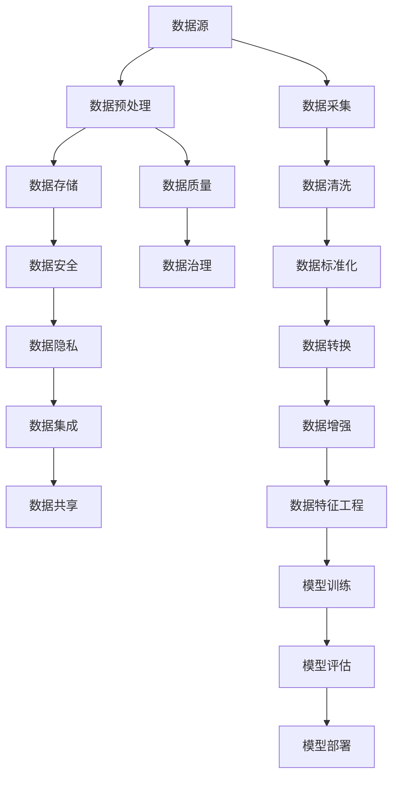

                 

# 人工智能创业数据管理的关键

## 1. 背景介绍

随着人工智能技术的快速发展，数据管理已经成为人工智能创业中的关键因素之一。数据的获取、存储、处理、分析等环节，直接决定了人工智能系统的性能和实用性。然而，由于数据来源广泛、数据格式多样、数据质量参差不齐，数据管理在实际应用中仍面临诸多挑战。

数据的完整性、准确性、安全性、隐私性和可用性等方面的问题，极大地影响了人工智能系统的运行效果和用户信任度。因此，如何高效、安全地管理数据，成为人工智能创业必须解决的难题。

## 2. 核心概念与联系

### 2.1 核心概念概述

在进行数据管理时，我们需要掌握以下核心概念：

- 数据源：数据的来源，包括公共数据集、商业数据、用户数据等。
- 数据预处理：数据清洗、转换、标准化等过程，保证数据质量和一致性。
- 数据存储：数据的持久化和访问方式，包括传统的关系型数据库、NoSQL数据库、数据湖等。
- 数据安全：保护数据的机密性、完整性和可用性，防止数据泄露和篡改。
- 数据隐私：确保用户数据的隐私权，遵守相关法律法规和伦理标准。
- 数据质量：数据的准确性、一致性、完整性和及时性，直接决定数据可用性。
- 数据集成：将多个数据源整合，实现数据共享和交换。
- 数据治理：数据管理的规划、执行和监督，确保数据管理的规范性和效率。

这些概念之间互相联系，共同构成了数据管理的核心框架。通过理解这些核心概念，我们可以更好地把握数据管理的全貌，从宏观层面把握数据管理的各个环节。

### 2.2 核心概念原理和架构的 Mermaid 流程图



## 3. 核心算法原理 & 具体操作步骤

### 3.1 算法原理概述

数据管理中的关键算法包括数据清洗、特征工程、模型训练和数据治理等。这些算法彼此关联，共同构成数据管理的完整流程。

数据清洗算法主要通过数据预处理、去重、补全等方式，提升数据质量，确保数据可用性。

特征工程算法则是通过对数据进行降维、归一化、特征选择等操作，提取有用的信息，支持模型训练。

模型训练算法利用统计学和机器学习技术，通过训练数据集，构建和优化模型，提升模型性能。

数据治理算法则是对数据管理过程进行规范化和自动化管理，确保数据管理的稳定性和效率。

### 3.2 算法步骤详解

#### 3.2.1 数据采集

数据采集是数据管理的第一步，通过多种方式收集数据，如API接口、数据库导出、爬虫抓取等。采集的数据需要进行初步的清洗和标准化，以保证数据质量。

#### 3.2.2 数据清洗

数据清洗主要包括去重、填充缺失值、去除异常值等操作，确保数据的完整性和一致性。去重可以避免数据的冗余，填充缺失值可以补充数据的不完整性，去除异常值可以避免噪声对后续分析的影响。

#### 3.2.3 特征工程

特征工程是数据分析和模型训练的重要步骤，通过特征选择、特征提取、特征构建等方法，提升数据的表现力和模型的泛化能力。特征工程包括特征降维、特征归一化、特征缩放、特征选择等操作。

#### 3.2.4 模型训练

模型训练是利用统计学和机器学习技术，通过训练数据集，构建和优化模型，提升模型性能。常见的模型包括线性回归、逻辑回归、决策树、随机森林、支持向量机、神经网络等。

#### 3.2.5 数据治理

数据治理是数据管理的高级阶段，通过建立数据治理框架、数据治理规则和数据治理流程，确保数据管理的规范性和效率。数据治理包括数据质量管理、数据安全管理、数据隐私管理、数据资产管理等。

### 3.3 算法优缺点

#### 3.3.1 数据清洗

优点：
- 提升数据质量，保证数据可用性。
- 减少数据噪声，提高数据分析的准确性。

缺点：
- 数据清洗过程可能引入误差，影响数据一致性。
- 数据清洗工作量较大，成本较高。

#### 3.3.2 特征工程

优点：
- 提取有用的信息，提升模型的泛化能力。
- 减少特征维度，提高模型的计算效率。

缺点：
- 特征工程需要专业知识，实施难度较大。
- 特征工程结果依赖于领域知识和业务理解，可能存在偏差。

#### 3.3.3 模型训练

优点：
- 提升模型性能，支持复杂数据分析。
- 利用机器学习技术，自动发现数据中的规律和模式。

缺点：
- 模型训练需要大量数据和计算资源，成本较高。
- 模型可能出现过拟合或欠拟合问题，需要优化调整。

#### 3.3.4 数据治理

优点：
- 规范数据管理过程，提高数据管理的效率和效果。
- 确保数据安全和隐私，避免数据泄露风险。

缺点：
- 数据治理涉及多个部门和流程，实施复杂。
- 数据治理规则可能存在不完善或执行不到位的情况，影响数据管理的质量。

### 3.4 算法应用领域

数据管理技术在多个领域都有广泛应用，包括但不限于：

- 金融行业：用于风控、信用评分、客户分析等，保障金融数据的安全性和隐私性。
- 医疗行业：用于病患数据分析、医学影像分析等，提升医疗服务的精准性和可靠性。
- 零售行业：用于客户行为分析、商品推荐、库存管理等，提升零售企业的运营效率和用户体验。
- 智能制造：用于设备监控、质量控制、生产优化等，提升制造业的生产效率和质量。
- 智慧城市：用于城市交通管理、环境监测、公共安全等，提升智慧城市的运行效率和安全性。

## 4. 数学模型和公式 & 详细讲解 & 举例说明

### 4.1 数学模型构建

假设有一个数据集 $D=\{(x_i, y_i)\}_{i=1}^N$，其中 $x_i$ 表示输入数据，$y_i$ 表示目标输出。我们希望利用机器学习模型 $f(x)$ 进行数据预测和分析。

数据清洗算法可以将数据集 $D$ 预处理为 $\tilde{D}=\{(\tilde{x}_i, \tilde{y}_i)\}_{i=1}^N$，其中 $\tilde{x}_i$ 表示清洗后的输入数据，$\tilde{y}_i$ 表示清洗后的目标输出。

特征工程算法可以对清洗后的数据集 $\tilde{D}$ 进行特征提取和构建，得到特征集 $F=\{f(x_i)\}_{i=1}^N$，其中 $f(x_i)$ 表示特征函数。

模型训练算法可以利用特征集 $F$ 和目标输出集 $\tilde{y}_i$ 训练模型 $f(x)$，得到模型参数 $\theta$。

数据治理算法可以对训练后的模型 $f(x)$ 进行管理和优化，得到优化后的模型 $\hat{f}(x)$。

### 4.2 公式推导过程

假设模型 $f(x)$ 为线性回归模型，则模型公式为：

$$
f(x) = w_0 + w_1 x_1 + w_2 x_2 + \dots + w_n x_n
$$

其中 $w_0, w_1, w_2, \dots, w_n$ 为模型参数，$x_1, x_2, \dots, x_n$ 为输入特征。

假设目标输出 $\tilde{y}_i$ 服从正态分布 $N(\mu, \sigma^2)$，其中 $\mu$ 为均值，$\sigma^2$ 为方差。

假设数据集 $D$ 的样本数为 $N$，则模型参数 $w$ 的最小二乘估计为：

$$
w = (X^T X)^{-1} X^T y
$$

其中 $X=[x_1, x_2, \dots, x_n]$ 为特征矩阵，$y=[y_1, y_2, \dots, y_n]$ 为目标输出向量。

### 4.3 案例分析与讲解

#### 案例分析：房价预测

假设有一个房屋数据集，包括房屋面积、地理位置、房龄、户型等信息，目标预测房价。

1. 数据采集：通过API接口、数据库导出等方式，采集房屋数据集。
2. 数据清洗：去除重复数据、处理缺失值、去除异常值等。
3. 特征工程：提取有用特征，如面积、地理位置、房龄、户型等，并进行归一化处理。
4. 模型训练：利用训练数据集，采用线性回归模型进行房价预测，优化模型参数。
5. 数据治理：对训练后的模型进行管理和优化，确保模型性能和数据安全。

## 5. 项目实践：代码实例和详细解释说明

### 5.1 开发环境搭建

在开发数据管理项目时，需要搭建相应的开发环境。以下是一些常用的开发工具和环境搭建方法：

- Python：作为数据管理和人工智能开发的主流语言，Python提供了丰富的数据处理和机器学习库，如Pandas、NumPy、Scikit-learn等。
- Jupyter Notebook：用于快速迭代和共享代码，支持多种语言和库。
- Anaconda：提供一个虚拟环境，方便安装和管理Python库。
- Dask：一个并行计算库，支持大规模数据处理和分析。
- PySpark：一个基于Apache Spark的Python API，用于大数据处理和分析。

### 5.2 源代码详细实现

以下是使用Python进行数据管理和模型训练的示例代码：

```python
import pandas as pd
from sklearn.model_selection import train_test_split
from sklearn.linear_model import LinearRegression
from sklearn.metrics import mean_squared_error

# 读取数据
data = pd.read_csv('data.csv')

# 数据清洗
data.drop_duplicates(inplace=True)
data.fillna(method='ffill', inplace=True)
data = data.dropna()

# 特征工程
X = data[['area', 'location', 'age', 'type']]
y = data['price']
X_train, X_test, y_train, y_test = train_test_split(X, y, test_size=0.2, random_state=42)

# 模型训练
model = LinearRegression()
model.fit(X_train, y_train)
y_pred = model.predict(X_test)

# 模型评估
mse = mean_squared_error(y_test, y_pred)
print(f'Mean Squared Error: {mse:.2f}')
```

### 5.3 代码解读与分析

#### 5.3.1 数据读取

使用Pandas库读取CSV格式的数据文件，将数据加载到DataFrame对象中。

#### 5.3.2 数据清洗

使用Pandas库对数据进行去重、填充缺失值、删除异常值等操作。

#### 5.3.3 特征工程

将数据集分为特征集和目标输出集，并使用train_test_split函数进行数据分割。

#### 5.3.4 模型训练

使用Scikit-learn库中的LinearRegression模型进行房价预测，并调用fit函数训练模型。

#### 5.3.5 模型评估

使用mean_squared_error函数计算预测值与真实值之间的均方误差，评估模型性能。

### 5.4 运行结果展示

运行上述代码后，将输出模型的均方误差，评估模型预测房价的准确性。

## 6. 实际应用场景

### 6.1 金融行业

在金融行业，数据管理至关重要，保障金融数据的安全性和隐私性。例如，通过数据管理技术，可以实现：

- 客户数据分析：对客户信用评分、行为分析等进行建模，提高客户管理的精准性。
- 风险控制：利用历史数据进行风险预测和预警，降低金融风险。
- 欺诈检测：通过异常检测和数据清洗技术，及时发现和防范欺诈行为。

### 6.2 医疗行业

在医疗行业，数据管理同样必不可少，提升医疗服务的精准性和可靠性。例如，通过数据管理技术，可以实现：

- 病患数据分析：对病患数据进行建模，辅助医生进行疾病诊断和治疗方案制定。
- 医学影像分析：利用图像处理和深度学习技术，提高医学影像的分析和诊断效果。
- 公共卫生监测：通过数据分析，及时发现和预测公共卫生事件，提升公共卫生管理能力。

### 6.3 零售行业

在零售行业，数据管理可以提升运营效率和用户体验。例如，通过数据管理技术，可以实现：

- 客户行为分析：对客户购买行为进行建模，优化商品推荐和库存管理。
- 价格优化：利用价格预测模型，调整商品价格，提升销售效果。
- 供应链管理：通过数据分析，优化供应链流程，提高供应链效率。

### 6.4 智能制造

在智能制造领域，数据管理可以提升生产效率和质量。例如，通过数据管理技术，可以实现：

- 设备监控：利用传感器数据进行设备状态监测，及时发现和修复设备故障。
- 质量控制：通过数据分析，优化生产过程，提升产品质量。
- 生产优化：利用预测模型，优化生产计划和资源配置，提高生产效率。

## 7. 工具和资源推荐

### 7.1 学习资源推荐

- 《Python数据科学手册》：由Pandas库的创建者Jake VanderPlas撰写，全面介绍了数据管理和机器学习的基本概念和常用技术。
- 《深度学习》（Goodfellow et al.）：深度学习领域的经典教材，涵盖了深度学习的原理、模型和应用。
- Coursera《数据科学导论》课程：由斯坦福大学教授Andrew Ng主讲，介绍数据管理和机器学习的基本概念和常用技术。
- Kaggle：数据科学竞赛平台，提供丰富的数据集和机器学习竞赛，助力学习者的实践能力提升。

### 7.2 开发工具推荐

- Jupyter Notebook：用于快速迭代和共享代码，支持多种语言和库。
- Anaconda：提供一个虚拟环境，方便安装和管理Python库。
- Dask：一个并行计算库，支持大规模数据处理和分析。
- PySpark：一个基于Apache Spark的Python API，用于大数据处理和分析。
- TensorFlow：Google开发的深度学习框架，支持大规模模型训练和优化。

### 7.3 相关论文推荐

- 《数据清洗：原理、算法与实现》（Cunningham et al.）：介绍了数据清洗的原理、算法和实现方法，对数据管理实践具有重要参考价值。
- 《特征工程：理论与实践》（Kihler et al.）：全面介绍了特征工程的理论与实践，帮助读者理解特征工程的重要性和方法。
- 《数据治理：原则、方法与工具》（Lugo et al.）：介绍了数据治理的原则、方法和工具，为数据管理提供全面指导。

## 8. 总结：未来发展趋势与挑战

### 8.1 研究成果总结

数据管理在人工智能创业中具有重要作用，通过对数据的全面管理和分析，可以提高模型的精度和效率，提升业务的运营效率和用户体验。

### 8.2 未来发展趋势

未来，数据管理技术将呈现以下几个发展趋势：

- 数据质量管理：数据质量将成为数据管理的核心任务，通过自动化和智能化手段，提升数据质量。
- 数据安全与隐私保护：数据安全与隐私保护将成为数据管理的重中之重，利用区块链和加密技术，保障数据的安全性和隐私性。
- 数据融合与多源数据管理：数据融合技术将成为数据管理的重要方向，通过多源数据整合，提升数据分析的全面性和准确性。
- 数据治理智能化：数据治理将逐步实现自动化和智能化，通过机器学习和大数据分析，提升数据治理的效率和效果。

### 8.3 面临的挑战

尽管数据管理技术不断发展，但在实际应用中仍面临诸多挑战：

- 数据源多样化：不同数据源的数据格式和质量差异较大，数据管理难度较大。
- 数据清洗复杂：数据清洗工作量较大，不同数据集需要进行不同的清洗策略。
- 数据治理复杂：数据治理涉及多个部门和流程，实施复杂。
- 数据安全与隐私保护：数据安全与隐私保护需要严格的技术和制度保障。

### 8.4 研究展望

未来，数据管理技术需要进一步突破以下问题：

- 数据清洗自动化：通过自动化和智能化手段，提升数据清洗效率。
- 数据治理智能化：利用机器学习和大数据分析，提升数据治理的效率和效果。
- 数据安全与隐私保护：利用区块链和加密技术，保障数据的安全性和隐私性。
- 数据融合与多源数据管理：通过多源数据整合，提升数据分析的全面性和准确性。

## 9. 附录：常见问题与解答

### Q1: 数据管理中常用的数据清洗方法有哪些？

A: 数据清洗是数据管理中的重要环节，常用的数据清洗方法包括：

- 去重：通过去重操作，消除数据的冗余和重复。
- 处理缺失值：通过插值、删除、填充等方式，处理缺失值问题。
- 去除异常值：通过统计分析和机器学习技术，识别和去除异常值。
- 标准化：将数据进行标准化处理，确保数据的一致性和可比性。
- 归一化：将数据进行归一化处理，使其在相同的尺度上比较。

### Q2: 数据管理中常用的数据治理方法有哪些？

A: 数据治理是数据管理的高级阶段，常用的数据治理方法包括：

- 数据质量管理：通过数据质量评估和监测，提升数据质量。
- 数据安全管理：通过访问控制、加密技术等手段，保障数据的安全性。
- 数据隐私管理：通过隐私保护技术和合规管理，保障数据的隐私性。
- 数据资产管理：通过数据资产登记和审计，提升数据资产的利用率。
- 数据生命周期管理：通过数据生命周期管理，确保数据从采集到销毁的全过程规范有序。

### Q3: 数据管理中常用的特征工程方法有哪些？

A: 特征工程是数据分析和模型训练的重要步骤，常用的特征工程方法包括：

- 特征选择：通过统计分析和机器学习技术，选择最相关的特征。
- 特征构建：通过组合、变换等方式，构建新的特征。
- 特征归一化：将特征进行归一化处理，确保特征的尺度一致。
- 特征缩放：将特征进行缩放处理，避免特征之间的尺度差异。
- 特征降维：通过降维技术，减少特征维度，提高模型计算效率。

### Q4: 数据管理中常用的模型训练方法有哪些？

A: 模型训练是利用统计学和机器学习技术，通过训练数据集，构建和优化模型。常用的模型训练方法包括：

- 线性回归：用于处理连续性目标变量的问题。
- 逻辑回归：用于处理二分类或多分类问题。
- 决策树：用于处理分类和回归问题。
- 随机森林：用于处理分类和回归问题，提升模型的鲁棒性。
- 支持向量机：用于处理分类和回归问题，提升模型的泛化能力。
- 神经网络：用于处理复杂数据分析和预测问题，提升模型的泛化能力。

### Q5: 数据管理中常用的数据治理工具有哪些？

A: 数据治理是数据管理的高级阶段，常用的数据治理工具包括：

- Apache NiFi：一个数据集成平台，用于数据采集、转换和分发。
- Apache Atlas：一个数据治理平台，用于数据资产管理、数据质量管理等。
- Talend：一个数据集成和治理工具，支持数据采集、清洗、转换、治理等功能。
- Collibra：一个数据治理平台，提供数据质量管理、数据安全管理等功能。
- Informatica：一个数据治理和集成工具，支持数据清洗、转换、集成等功能。

---

作者：禅与计算机程序设计艺术 / Zen and the Art of Computer Programming

