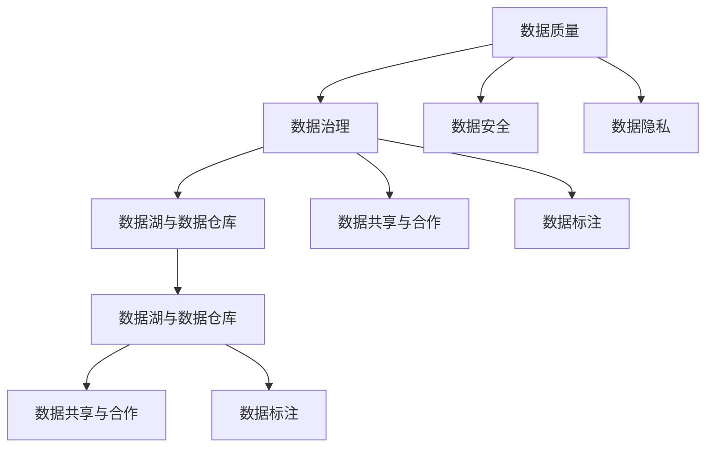

                 

# 人工智能创业数据管理的有效策略

## 1. 背景介绍

在人工智能（AI）创业的浪潮中，数据管理成为了至关重要的一环。高质量的数据不仅能够提升AI模型的训练效果，还能确保AI应用在实际场景中的稳定性和可靠性。然而，随着AI应用的快速扩展，数据管理也面临着新的挑战和问题。本文将深入探讨人工智能创业中数据管理的有效策略，帮助创业者更好地应对数据管理中的复杂性，提升AI项目的成功率。

## 2. 核心概念与联系

### 2.1 核心概念概述

为了更好地理解人工智能创业中数据管理的有效策略，本节将介绍几个核心概念及其相互关系：

1. **数据质量（Data Quality）**：指的是数据在采集、存储、处理和传输过程中，保持准确性、完整性、一致性、及时性和可用性（也称为5V模型）的程度。高质量的数据是训练高效、可靠的AI模型的基础。

2. **数据隐私（Data Privacy）**：在数据管理过程中，保护个人或组织数据不被未经授权的访问、使用或泄露，同时确保数据使用符合法律法规的要求。数据隐私保护对于维护用户信任、遵守相关法规至关重要。

3. **数据治理（Data Governance）**：涉及制定数据管理政策、流程和制度，确保数据的质量、安全性和合规性。良好的数据治理能够提高数据管理的效率和效果。

4. **数据共享与合作（Data Sharing & Collaboration）**：指在不同组织或团队之间，通过数据共享促进知识交流和技术创新。数据共享需要建立合理的机制，确保数据使用和共享的合法性和安全性。

5. **数据安全（Data Security）**：包括防止数据泄露、破坏、篡改等威胁，确保数据在传输和存储过程中的安全性。数据安全是数据管理的基础，直接影响AI系统的可靠性和鲁棒性。

6. **数据湖与数据仓库（Data Lake & Data Warehouse）**：数据湖是一种存储所有类型数据的集中式存储系统，而数据仓库是存储和管理结构化数据的系统。两者结合使用，可以高效管理和利用各种类型的数据资源。

7. **数据标注（Data Labeling）**：指将原始数据转换为可被AI模型训练的数据，通常需要标注者对数据进行分类、标记等处理。高质量的数据标注能够提高AI模型的性能和泛化能力。

这些核心概念之间的逻辑关系可以通过以下Mermaid流程图来展示：



这个流程图展示了大数据管理的主要过程和关键组件：

1. 数据质量管理通过数据治理流程，确保数据的准确性和可用性。
2. 数据安全是数据管理的基础，保障数据的完整性和保密性。
3. 数据隐私保护确保数据使用符合法律法规。
4. 数据湖与数据仓库提供高效的数据存储和管理支持。
5. 数据共享与合作促进知识交流和创新。
6. 数据标注将原始数据转换为可训练数据。

这些概念共同构成了数据管理的基础框架，是人工智能创业项目成功的关键因素之一。

## 3. 核心算法原理 & 具体操作步骤
### 3.1 算法原理概述

人工智能创业中，数据管理涉及多个环节，包括数据采集、数据清洗、数据存储、数据标注、数据共享等。每个环节都有其特定的算法和操作步骤，本节将概述数据管理的核心算法原理。

### 3.2 算法步骤详解

数据管理的过程可以分为以下几个主要步骤：

1. **数据采集（Data Acquisition）**：从不同来源收集数据，包括用户行为数据、社交媒体数据、传感器数据等。数据采集需要设计合理的采样策略，确保样本的代表性和多样性。

2. **数据清洗（Data Cleaning）**：去除数据中的噪声、异常值和重复记录，确保数据的准确性和一致性。数据清洗通常使用统计分析、规则匹配等方法，结合自动化工具提高效率。

3. **数据标注（Data Labeling）**：将原始数据转换为可被AI模型训练的数据，需要进行分类、标注等处理。数据标注需要人工或半自动化工具辅助完成。

4. **数据存储（Data Storage）**：选择合适的存储系统和格式，将清洗和标注后的数据存储在数据湖或数据仓库中。数据存储需要考虑性能、扩展性和成本等因素。

5. **数据查询与分析（Data Query & Analysis）**：通过SQL、NoSQL等查询语言，从数据仓库中提取数据进行分析和可视化，为AI模型训练和业务决策提供支持。

6. **数据共享与合作（Data Sharing & Collaboration）**：建立数据共享机制，确保不同团队或组织之间数据的安全和合规使用。数据共享需要设计数据接口和访问控制策略。

7. **数据监控与优化（Data Monitoring & Optimization）**：通过监控数据质量、性能和安全性，及时发现和解决问题，优化数据管理流程。数据监控需要建立指标体系和报警机制。

### 3.3 算法优缺点

数据管理算法具有以下优点：

1. 提升数据质量和模型性能。通过数据清洗和标注，确保数据的高质量和多样性，提升AI模型的训练效果和泛化能力。

2. 保障数据安全和隐私。通过数据治理和隐私保护措施，确保数据在使用和共享过程中的安全和合规。

3. 促进数据共享与合作。通过建立合理的数据共享机制，促进不同团队和组织之间的知识交流和技术创新。

4. 支持数据湖与数据仓库的建设。数据湖和数据仓库提供了高效的数据管理和利用支持，有助于构建强大的人工智能系统。

5. 提高数据管理效率。自动化工具和算法优化，减少了人工干预，提升了数据管理的效率和准确性。

同时，数据管理算法也存在一些局限性：

1. 依赖高质量的原始数据。数据管理的第一步是数据采集，数据的质量直接影响后续的清洗、标注和分析。

2. 需要大量的计算资源。数据清洗、标注和查询等过程需要大量的计算资源，尤其是在处理大规模数据时。

3. 数据隐私和安全风险。数据共享和合作过程中，数据隐私和安全问题难以完全避免，需要设计合理的保护机制。

4. 数据治理复杂度较高。数据治理需要制定和实施多项政策和流程，涉及多方面的协调和配合，难度较大。

5. 数据标注成本高。高质量的数据标注需要大量人力和时间投入，成本较高。

尽管存在这些局限性，但数据管理算法在实际应用中仍然具有重要的价值，能够显著提升AI项目的成功率和效果。

### 3.4 算法应用领域

数据管理算法在多个领域得到了广泛应用，如智能推荐、医疗健康、金融风控等：

- **智能推荐**：通过分析用户行为数据和偏好，推荐个性化的商品或内容。数据管理在用户行为数据采集、清洗、标注等方面发挥重要作用。

- **医疗健康**：在医疗数据采集、处理和分析中，数据管理确保数据的准确性和隐私性，提升疾病诊断和治疗效果。

- **金融风控**：通过分析交易数据、信用数据等，提升风险评估和预测能力，预防金融欺诈和风险。

- **智能制造**：在工业物联网(IoT)数据采集和分析中，数据管理保障数据的完整性和实时性，优化生产流程和资源配置。

- **城市管理**：在智慧城市建设中，数据管理支持交通、环境、公共安全等领域的综合分析和决策。

## 4. 数学模型和公式 & 详细讲解 & 举例说明
### 4.1 数学模型构建

在数据管理过程中，数学模型和公式提供了精确的量化方法和分析工具。以下是几个常见的数据管理模型：

1. **回归分析（Regression Analysis）**：用于预测数值型数据的趋势和关系。例如，通过线性回归模型，可以根据历史交易数据预测未来销售额。

2. **分类算法（Classification Algorithms）**：用于将数据分为不同的类别。例如，通过决策树或支持向量机（SVM），可以根据用户行为数据分类为不同类型用户。

3. **聚类算法（Clustering Algorithms）**：用于发现数据中的自然分组。例如，通过K-means算法，可以将用户行为数据分为不同的兴趣群组。

4. **关联规则（Association Rules）**：用于发现数据中的项集关系。例如，通过Apriori算法，可以根据购物篮数据发现商品之间的关联关系。

5. **数据降维（Data Reduction）**：用于减少数据维度，提高计算效率。例如，通过主成分分析（PCA），可以从高维数据中提取主要特征。

### 4.2 公式推导过程

以下以线性回归模型为例，推导回归分析的公式。

设$x$为自变量向量，$y$为因变量向量，$n$为样本数，$X$为自变量矩阵，$Y$为因变量向量，$\beta$为回归系数。线性回归模型的公式为：

$$
y = X\beta + \epsilon
$$

其中$\epsilon$为误差项，假设误差项满足独立同分布，方差为$\sigma^2$。最小二乘估计法（Ordinary Least Squares, OLS）通过最小化误差项的平方和，求解回归系数：

$$
\hat{\beta} = (X^TX)^{-1}X^TY
$$

该公式表明，回归系数$\hat{\beta}$可以通过自变量矩阵$X$和因变量向量$Y$计算得到。

### 4.3 案例分析与讲解

假设有一家电商公司，想要根据用户行为数据预测其未来的购买意愿。公司收集了大量的用户浏览、点击、购买等数据，这些数据可以表示为特征向量$x$和标签$y$：

| 用户ID | 浏览次数 | 点击次数 | 购买次数 | 购买金额 |
|--------|----------|----------|----------|----------|
| 1      | 100      | 50       | 3        | 1000     |
| 2      | 200      | 75       | 0        | 500      |
| ...    | ...      | ...      | ...      | ...      |

通过对数据进行回归分析，可以构建如下线性回归模型：

$$
y = w_0 + w_1x_1 + w_2x_2 + \cdots + w_nx_n
$$

其中，$w_0, w_1, w_2, \cdots, w_n$为回归系数。通过最小二乘估计法，可以求解回归系数：

$$
\hat{w} = (X^TX)^{-1}X^Ty
$$

例如，假设回归系数$\hat{w} = [w_0, w_1, w_2]^T = [1, 0.5, 0.1]^T$，则预测公式为：

$$
\hat{y} = 1 + 0.5x_1 + 0.1x_2
$$

这意味着，用户ID为1的用户，其预测购买金额为$1 + 0.5 \times 100 + 0.1 \times 50 = 1000 + 50 + 5 = 1055$。通过类似的方法，可以对其他用户进行预测，从而构建智能推荐系统。

## 5. 项目实践：代码实例和详细解释说明
### 5.1 开发环境搭建

在进行数据管理项目实践前，需要准备以下开发环境：

1. **Python**：Python是数据管理项目的主要编程语言，用于数据处理和算法实现。

2. **Pandas**：Pandas是Python的数据处理库，用于数据清洗、分析和可视化。

3. **NumPy**：NumPy是Python的数值计算库，用于矩阵运算和线性代数计算。

4. **Scikit-learn**：Scikit-learn是Python的机器学习库，提供了各种机器学习算法和工具。

5. **Jupyter Notebook**：Jupyter Notebook是Python的数据分析和算法开发环境，支持代码、数据和结果的可视化。

6. **SQLite**：SQLite是Python的轻量级数据库，用于存储和管理结构化数据。

完成上述环境配置后，可以进行数据管理的项目实践。

### 5.2 源代码详细实现

下面以数据清洗为例，给出Python代码实现。

```python
import pandas as pd
import numpy as np
from sklearn.model_selection import train_test_split

# 读取数据
data = pd.read_csv('data.csv')

# 数据清洗
data = data.dropna()  # 去除缺失值
data = data.drop_duplicates()  # 去除重复值
data = data.drop(columns=['ID'])  # 去除ID列

# 数据拆分
train_data, test_data = train_test_split(data, test_size=0.2, random_state=42)

# 保存数据
train_data.to_csv('train_data.csv', index=False)
test_data.to_csv('test_data.csv', index=False)
```

### 5.3 代码解读与分析

代码中，首先使用Pandas库读取数据，然后进行数据清洗和拆分，最终将处理后的数据保存为CSV文件。代码逻辑清晰，易于理解和实现。

1. `data.read_csv('data.csv')`：读取CSV格式的数据文件。
2. `data.dropna()`：删除缺失值。
3. `data.drop_duplicates()`：删除重复值。
4. `data.drop(columns=['ID'])`：删除ID列。
5. `train_test_split()`：将数据集拆分为训练集和测试集。
6. `train_data.to_csv('train_data.csv', index=False)`：保存训练集数据。
7. `test_data.to_csv('test_data.csv', index=False)`：保存测试集数据。

## 6. 实际应用场景
### 6.1 智能推荐系统

数据管理在智能推荐系统中发挥关键作用。通过用户行为数据的收集、清洗和分析，推荐系统可以发现用户兴趣和偏好，从而提供个性化的商品或内容推荐。例如，电子商务平台可以根据用户浏览和购买数据，生成个性化推荐列表。

### 6.2 医疗健康数据分析

在医疗健康领域，数据管理有助于提升疾病的诊断和治疗效果。通过收集和分析患者的历史数据，可以发现疾病的规律和趋势，预测病情发展，优化治疗方案。例如，智能健康助手可以根据患者的生理数据和历史诊断记录，提供个性化的健康建议和治疗方案。

### 6.3 金融风控系统

金融风控系统通过分析交易数据、信用数据等，评估和预测风险，预防金融欺诈和风险。数据管理在数据采集、清洗和分析中，确保数据的完整性和准确性，提高风险评估的精度和效率。例如，银行可以根据客户的交易记录和信用历史，评估其信用风险。

### 6.4 智能制造和工业物联网

在智能制造和工业物联网中，数据管理支持设备的监测和优化。通过收集和分析传感器数据，可以实时监控设备的运行状态，预测故障和维护需求，优化生产流程和资源配置。例如，智能工厂可以根据设备的运行数据，预测设备的维护时间和备件需求。

## 7. 工具和资源推荐
### 7.1 学习资源推荐

1. **《Python数据科学手册》**：该书详细介绍了Python在数据科学中的应用，包括数据清洗、分析和可视化。

2. **Coursera《机器学习》课程**：由斯坦福大学开设的机器学习课程，涵盖各种机器学习算法和实践，适合数据管理的入门和进阶学习。

3. **Kaggle数据科学竞赛平台**：Kaggle提供了大量的数据集和算法竞赛，帮助开发者提升数据处理和算法实现的能力。

4. **Apache Hadoop与Apache Spark**：这两个大数据处理框架提供了高效的数据存储和处理支持，适合处理大规模数据集。

5. **数据可视化工具Tableau、Power BI**：这些工具能够将数据以图表和报表的形式展示出来，帮助数据管理者和用户理解数据。

### 7.2 开发工具推荐

1. **Pandas**：Python的数据处理库，提供了高效的数据清洗和分析工具。

2. **NumPy**：Python的数值计算库，提供了高效的矩阵运算和线性代数计算功能。

3. **Scikit-learn**：Python的机器学习库，提供了各种机器学习算法和工具。

4. **TensorFlow、PyTorch**：这些深度学习框架提供了高效的数据处理和模型训练支持。

5. **Jupyter Notebook**：Python的数据分析和算法开发环境，支持代码、数据和结果的可视化。

### 7.3 相关论文推荐

1. **《大数据时代的数据治理框架》**：该论文提出了一套适合大数据环境的数据治理框架，强调数据质量管理和隐私保护。

2. **《数据挖掘与统计学习》**：该书详细介绍了数据挖掘和统计学习的方法和应用，适合数据管理的学习和实践。

3. **《深度学习与人工智能》**：该书介绍了深度学习在人工智能中的应用，包括数据处理、模型训练和优化。

4. **《数据科学与大数据技术》**：该书涵盖了数据科学和大数据技术的多个方面，适合数据管理的全面学习和研究。

## 8. 总结：未来发展趋势与挑战
### 8.1 研究成果总结

本文对人工智能创业中数据管理的有效策略进行了系统介绍，主要包括以下几个方面：

1. 数据质量管理：确保数据的高质量和可用性，提升AI模型的训练效果。

2. 数据隐私保护：保障数据的安全性和合规性，维护用户信任。

3. 数据治理机制：制定和实施数据管理政策和流程，提高数据管理效率。

4. 数据共享与合作：促进知识交流和技术创新，推动AI应用的广泛应用。

5. 数据存储与查询：利用数据湖和数据仓库，提供高效的数据存储和查询支持。

6. 数据标注与分析：通过数据清洗和标注，提升AI模型的性能和泛化能力。

### 8.2 未来发展趋势

未来，数据管理技术将继续发展，呈现以下几个趋势：

1. 数据自动化管理：引入自动化工具和算法，减少人工干预，提高数据管理效率。

2. 数据融合与协同：利用数据湖和数据仓库，实现不同数据源的融合与协同，提升数据管理的综合能力。

3. 数据隐私与安全：引入隐私保护技术，确保数据在使用和共享过程中的安全和合规。

4. 数据质量与实时性：引入数据质量监控和实时分析技术，保障数据的高质量和实时性。

5. 数据标注与标签管理：引入先进的标注技术和工具，提升数据标注的效率和质量。

6. 数据治理的智能化：引入智能治理系统，自动发现和解决数据管理中的问题。

### 8.3 面临的挑战

尽管数据管理技术不断进步，但在实际应用中仍面临以下挑战：

1. 数据质量与一致性：数据来源多样，数据格式和质量参差不齐，需要设计合理的清洗和校验流程。

2. 数据隐私与安全：数据共享和合作过程中，数据隐私和安全问题难以完全避免，需要设计合理的保护机制。

3. 数据治理复杂性：数据治理涉及多方面的协调和配合，难度较大，需要设计合理的治理框架和流程。

4. 数据标注成本高：高质量的数据标注需要大量人力和时间投入，成本较高，需要引入先进的标注技术和工具。

5. 数据存储与计算成本：大规模数据存储和计算需要大量的硬件资源，需要合理设计数据存储和计算方案。

### 8.4 研究展望

未来，数据管理技术需要在以下方面进行深入研究：

1. 数据自动化处理技术：利用自动化工具和算法，减少人工干预，提高数据处理效率。

2. 数据隐私与安全技术：引入隐私保护技术，确保数据在使用和共享过程中的安全和合规。

3. 数据质量与实时性技术：引入数据质量监控和实时分析技术，保障数据的高质量和实时性。

4. 数据标注与标签管理技术：引入先进的标注技术和工具，提升数据标注的效率和质量。

5. 数据治理智能化技术：引入智能治理系统，自动发现和解决数据管理中的问题。

6. 数据融合与协同技术：利用数据湖和数据仓库，实现不同数据源的融合与协同，提升数据管理的综合能力。

综上所述，数据管理在人工智能创业中具有重要的地位，需要从数据质量、隐私保护、治理机制等多个方面进行全面管理。未来，随着数据管理技术的不断进步，数据管理的自动化、智能化和安全性将进一步提升，为AI应用的广泛应用提供坚实的保障。

## 9. 附录：常见问题与解答

**Q1：数据清洗和数据标注的流程是什么？**

A: 数据清洗和数据标注的流程通常如下：

1. 数据清洗：
   - 初步检查数据集，发现和修复明显错误。
   - 使用规则和算法进行数据处理，去除噪声、异常值和重复记录。
   - 使用数据清洗工具进行批量处理，提高效率和准确性。

2. 数据标注：
   - 选择合适的标注工具和标注标准，定义标注规则和标注流程。
   - 对数据集进行标注，生成标注结果。
   - 对标注结果进行检查和修正，确保标注质量。

**Q2：如何评估数据集的质量？**

A: 评估数据集的质量通常从以下几个方面进行：

1. 数据完整性：检查数据集是否存在缺失值和重复值，确保数据集的完整性。

2. 数据一致性：检查数据集中的数据是否符合预期的格式和逻辑，确保数据的一致性。

3. 数据准确性：通过统计分析和异常检测，发现和修复数据中的错误和异常。

4. 数据代表性：检查数据集是否涵盖了足够的样本和场景，确保数据的代表性。

5. 数据可用性：检查数据集是否易于访问和处理，确保数据集的可用性。

**Q3：数据标注工具有哪些？**

A: 常见的数据标注工具包括：

1. Labelbox：提供了可视化界面和强大的数据标注功能，适合标注图像、文本等数据。

2. Amazon Mechanical Turk：通过众包方式进行数据标注，适合大规模标注任务。

3. Snorkel：提供了半自动化标注和训练工具，适合标注非结构化数据。

4. Sparsetag：基于NLP技术进行文本标注，支持实体识别、情感分析等任务。

5. Recto：提供了可视化界面和强大的数据标注功能，适合标注图像、文本等数据。

这些工具提供了不同的标注方式和功能，可以根据实际需求选择合适的工具。

**Q4：数据隐私与安全保护有哪些措施？**

A: 数据隐私与安全保护通常从以下几个方面进行：

1. 数据加密：对数据进行加密处理，确保数据在传输和存储过程中的安全性。

2. 访问控制：通过身份认证和权限管理，限制对数据的访问和使用。

3. 匿名化和伪匿名化：对数据进行匿名化和伪匿名化处理，减少敏感信息的泄露风险。

4. 数据脱敏：对数据中的敏感信息进行脱敏处理，减少隐私泄露风险。

5. 安全审计：定期进行安全审计，发现和修复安全漏洞。

**Q5：如何设计数据治理框架？**

A: 设计数据治理框架通常从以下几个方面进行：

1. 数据标准和规范：制定数据标准和规范，确保数据的一致性和可用性。

2. 数据质量管理：通过数据清洗、数据校验和质量监控，确保数据的高质量。

3. 数据安全管理：通过访问控制、加密和匿名化等措施，确保数据的安全性和隐私性。

4. 数据生命周期管理：从数据采集、存储、处理到销毁，全程跟踪和管理数据。

5. 数据共享与合作：建立合理的数据共享机制，促进数据的安全和合规使用。

**Q6：如何处理大规模数据？**

A: 处理大规模数据通常从以下几个方面进行：

1. 分布式存储：使用分布式存储系统（如Hadoop、Spark），存储和管理大规模数据。

2. 数据分块和分区：将大规模数据分为多个块或分区，并行处理和分析。

3. 数据压缩和优化：对数据进行压缩和优化，减少存储和计算开销。

4. 数据索引和缓存：建立数据索引和缓存机制，提高数据查询和分析的效率。

5. 数据流处理：使用流处理框架（如Apache Kafka、Apache Storm），实时处理和分析数据。

这些方法可以提高大规模数据处理的效率和效果，确保数据的完整性和可用性。

---

作者：禅与计算机程序设计艺术 / Zen and the Art of Computer Programming

