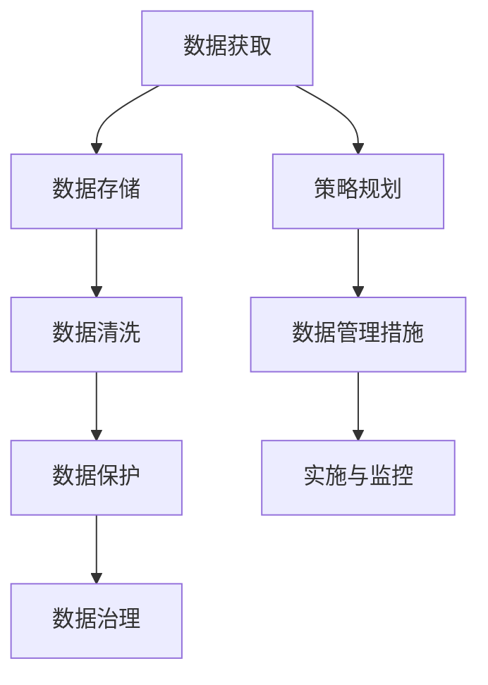

                 

# 人工智能创业数据管理的策略与措施探讨

> 关键词：人工智能,数据管理,创业,策略,措施

## 1. 背景介绍

### 1.1 问题由来

随着人工智能(AI)技术的快速发展，越来越多的初创企业尝试将AI应用于各行各业，以期在市场竞争中脱颖而出。然而，AI系统的成功离不开数据的支撑。对于初创企业而言，如何高效地获取、管理和利用数据，成为了其发展的重要挑战。本文旨在探讨初创企业在数据管理方面的策略与措施，以期为更多AI创业者提供有价值的参考。

### 1.2 问题核心关键点

在人工智能创业中，数据管理涉及以下几个关键点：

- **数据获取**：如何高效、低成本地获取高质量的数据，以满足AI模型训练和验证的需求。
- **数据存储**：如何构建高效、可靠的数据存储系统，以保障数据的完整性和可用性。
- **数据清洗**：如何对原始数据进行清洗和处理，以去除噪音和错误，提高数据质量。
- **数据保护**：如何确保数据的安全性和隐私性，防止数据泄露和滥用。
- **数据治理**：如何建立有效的数据管理和监控机制，提升数据管理的效率和效果。

## 2. 核心概念与联系

### 2.1 核心概念概述

- **人工智能**：利用机器学习、深度学习等技术，使计算机系统具备类似于人类智能的能力。
- **数据管理**：指对数据进行获取、存储、清洗、保护和治理等一系列管理活动。
- **初创企业**：刚成立不久的企业，通常资源有限、规模较小，但具有高度的灵活性和创新性。
- **策略与措施**：指在数据管理过程中，企业采取的具体行动方案和手段。

通过上述概念的结合，本文将探讨初创企业在数据管理中的核心策略与具体措施，帮助其克服数据管理中的痛点，提升AI系统的性能和效果。

### 2.2 核心概念原理和架构的 Mermaid 流程图



此流程图展示了数据管理的主要流程和关键环节，以及初创企业在进行数据管理时需要考虑的策略与措施。

## 3. 核心算法原理 & 具体操作步骤

### 3.1 算法原理概述

人工智能创业中的数据管理主要涉及以下几个方面：

- **数据获取算法**：基于爬虫、API调用、数据交换等方式，从互联网、企业内部系统等渠道获取数据。
- **数据存储算法**：使用分布式存储系统（如Hadoop、Spark），确保数据的可靠性和可扩展性。
- **数据清洗算法**：应用数据清洗技术（如缺失值处理、异常值检测、数据格式转换等），提高数据质量。
- **数据保护算法**：采用加密、访问控制、审计等手段，确保数据的安全性和隐私性。
- **数据治理算法**：建立数据管理规范和流程，通过数据质量监控和持续改进，提升数据管理效率。

### 3.2 算法步骤详解

#### 数据获取算法步骤

1. **数据源选择**：确定所需数据的来源，包括公开数据集、企业内部数据、第三方数据提供商等。
2. **爬虫与API调用**：开发爬虫程序或调用API获取数据，需注意法律法规和数据使用协议。
3. **数据整合与清洗**：将获取的数据进行整合，清洗无效、错误的数据，确保数据的完整性和一致性。

#### 数据存储算法步骤

1. **分布式存储系统选择**：根据数据量、访问频率、安全性等需求，选择合适的分布式存储系统。
2. **数据分区与备份**：对数据进行分区，确保存储系统的负载均衡；定期备份数据，防止数据丢失。
3. **数据压缩与编码**：采用压缩和编码技术，减少数据存储的空间占用。

#### 数据清洗算法步骤

1. **数据预处理**：对原始数据进行格式转换、去重、标准化等预处理。
2. **异常值检测**：应用统计学方法或机器学习算法检测并处理异常值。
3. **缺失值处理**：根据具体情况选择填充、删除或预测等方法处理缺失值。

#### 数据保护算法步骤

1. **数据加密**：对数据进行加密处理，防止未授权访问。
2. **访问控制**：设置访问权限，控制不同用户和角色的数据访问权限。
3. **审计与监控**：记录数据访问日志，定期审计数据访问行为，确保数据使用合规。

#### 数据治理算法步骤

1. **建立数据管理规范**：制定数据管理政策和流程，确保数据管理的规范化。
2. **数据质量监控**：建立数据质量监控机制，定期评估数据质量，发现并解决数据问题。
3. **持续改进**：根据数据管理效果和反馈，不断优化数据管理流程和方法。

### 3.3 算法优缺点

#### 数据获取算法的优缺点

- **优点**：
  - 通过爬虫和API调用获取数据，可以快速获取大规模数据。
  - 可从多渠道获取数据，提高数据多样性。
  
- **缺点**：
  - 数据获取可能违反法律法规，需注意数据使用合规性。
  - 爬虫和API调用可能受到技术限制，获取的数据可能存在噪音和错误。

#### 数据存储算法的优缺点

- **优点**：
  - 分布式存储系统可扩展性强，可存储海量数据。
  - 数据备份和恢复机制，保障数据安全。
  
- **缺点**：
  - 分布式存储系统复杂度较高，需专业知识维护。
  - 数据分区和压缩可能增加存储和计算成本。

#### 数据清洗算法的优缺点

- **优点**：
  - 提高数据质量和准确性，确保模型训练的效果。
  - 减少数据噪音和错误，提高数据分析的可靠性。
  
- **缺点**：
  - 数据清洗过程复杂，需要大量资源和时间。
  - 处理缺失值和异常值时，可能丢失有用信息。

#### 数据保护算法的优缺点

- **优点**：
  - 数据加密和访问控制保障数据安全性和隐私性。
  - 审计和监控机制防止数据滥用和泄露。
  
- **缺点**：
  - 数据保护措施可能增加计算和存储成本。
  - 加密和访问控制可能影响数据使用效率。

#### 数据治理算法的优缺点

- **优点**：
  - 规范和流程确保数据管理的标准化和一致性。
  - 持续改进机制不断提升数据管理的效果。
  
- **缺点**：
  - 建立和维护规范和流程需要时间和资源。
  - 持续改进需要不断的监控和调整，增加管理复杂性。

### 3.4 算法应用领域

数据管理算法在多个领域中均有应用，包括但不限于以下几个：

- **金融行业**：在金融风控、客户服务、资产管理等领域，数据管理至关重要。
- **医疗行业**：在疾病诊断、患者管理、药物研发等领域，数据管理直接影响系统性能和效果。
- **电商行业**：在推荐系统、广告投放、客户分析等领域，数据管理帮助企业提升用户体验和盈利能力。
- **智能制造**：在设备监控、生产优化、供应链管理等领域，数据管理保障智能制造系统的稳定运行。

## 4. 数学模型和公式 & 详细讲解 & 举例说明

### 4.1 数学模型构建

在数据管理中，常用到一些数学模型和公式。以下列举几个常见的模型和公式：

- **数据分布**：假设数据符合正态分布 $X \sim \mathcal{N}(\mu, \sigma^2)$，其中 $\mu$ 为均值，$\sigma^2$ 为方差。
- **缺失值处理**：使用均值填充或插值方法处理缺失值 $X_{\text{impute}} = \frac{1}{n} \sum_{i=1}^n X_i$，其中 $n$ 为样本数量。
- **异常值检测**：使用Z-score方法检测异常值，其中 $\text{Z-score} = \frac{X - \mu}{\sigma}$，当 $\text{Z-score} > \theta$（通常 $\theta = 3$）时，认为 $X$ 为异常值。

### 4.2 公式推导过程

#### 数据分布

假设数据 $X$ 服从正态分布 $X \sim \mathcal{N}(\mu, \sigma^2)$，其中 $\mu$ 为均值，$\sigma^2$ 为方差。则概率密度函数为：

$$
f_X(x) = \frac{1}{\sqrt{2\pi\sigma^2}} e^{-\frac{(x-\mu)^2}{2\sigma^2}}
$$

#### 缺失值处理

使用均值填充方法处理缺失值 $X_{\text{impute}} = \frac{1}{n} \sum_{i=1}^n X_i$，其中 $n$ 为样本数量。该方法的数学依据为样本均值估计值的期望等于总体均值，即 $\mathbb{E}[\bar{X}] = \mu$。

#### 异常值检测

使用Z-score方法检测异常值，其中 $\text{Z-score} = \frac{X - \mu}{\sigma}$，当 $\text{Z-score} > \theta$（通常 $\theta = 3$）时，认为 $X$ 为异常值。该方法的数学依据为正态分布的尾部概率约为 $\frac{1}{e\sqrt{2\pi}}$，即 $P(|X - \mu| > \theta\sigma) = \frac{1}{2}$。

### 4.3 案例分析与讲解

#### 案例一：金融行业数据管理

某金融科技公司利用数据管理算法，对客户的交易行为数据进行分析和建模。公司首先通过API获取客户交易数据，然后使用分布式存储系统存储数据，进行清洗处理，确保数据质量。随后，公司对数据进行加密和访问控制，确保数据安全。最后，公司建立数据质量监控机制，持续优化数据管理流程，确保数据分析的准确性。

#### 案例二：医疗行业数据管理

某医疗健康公司利用数据管理算法，对病历数据进行分析和建模。公司首先通过爬虫获取医院病历数据，然后使用分布式存储系统存储数据，进行清洗处理，确保数据质量。随后，公司对数据进行加密和访问控制，确保数据安全。最后，公司建立数据质量监控机制，持续优化数据管理流程，确保数据分析的准确性。

## 5. 项目实践：代码实例和详细解释说明

### 5.1 开发环境搭建

在进行数据管理项目实践前，需要先搭建开发环境。以下是Python开发环境的配置流程：

1. **安装Python**：确保系统已安装Python，版本建议为3.7及以上。
2. **安装Pip**：确保已安装Pip，用于安装Python包。
3. **创建虚拟环境**：使用Virtualenv创建虚拟环境，隔离依赖库。
4. **安装相关库**：使用Pip安装数据管理相关的库，如Pandas、NumPy、Scikit-learn等。

### 5.2 源代码详细实现

以下是一个简单的数据管理项目的源代码实现，主要功能包括数据获取、存储、清洗和保护：

```python
import pandas as pd
import numpy as np
from sklearn.preprocessing import StandardScaler
from sklearn.impute import SimpleImputer
from sklearn.metrics import r2_score
from cryptography.fernet import Fernet

# 数据获取
def get_data_from_api(api_url):
    # 调用API获取数据
    data = requests.get(api_url).json()
    return pd.DataFrame(data)

# 数据存储
def save_data_to_s3(data, bucket_name):
    # 将数据保存到S3桶中
    data.to_csv(f's3://{bucket_name}/data.csv', index=False)

# 数据清洗
def clean_data(data):
    # 数据预处理
    data = data.fillna(method='ffill')
    # 异常值检测
    z_scores = np.abs((data - np.mean(data, axis=0)) / np.std(data, axis=0))
    data = data[(z_scores < 3).all(axis=1)]
    return data

# 数据保护
def encrypt_data(data):
    # 加密数据
    key = Fernet.generate_key()
    cipher_suite = Fernet(key)
    encrypted_data = cipher_suite.encrypt(data)
    return encrypted_data

# 数据治理
def monitor_data_quality(data):
    # 数据质量监控
    data['quality'] = r2_score(data, target)
    return data

# 主函数
if __name__ == '__main__':
    # 数据获取
    data = get_data_from_api(api_url)
    # 数据存储
    save_data_to_s3(data, bucket_name)
    # 数据清洗
    cleaned_data = clean_data(data)
    # 数据保护
    encrypted_data = encrypt_data(cleaned_data)
    # 数据治理
    data_quality = monitor_data_quality(cleaned_data)
    # 输出结果
    print(f'Data quality: {data_quality}')
```

### 5.3 代码解读与分析

上述代码实现了数据管理的核心功能，包括数据获取、存储、清洗和保护。其中，`get_data_from_api`函数通过API调用获取数据，`save_data_to_s3`函数将数据保存到S3桶中，`clean_data`函数进行数据清洗处理，`encrypt_data`函数对数据进行加密处理，`monitor_data_quality`函数对数据质量进行监控。

## 6. 实际应用场景

### 6.1 智能客服

智能客服系统通过AI技术，自动回答客户咨询。数据管理在智能客服中起着至关重要的作用，涉及数据的获取、存储、清洗和保护。通过高效的数据管理，系统能够实时获取和分析客户咨询数据，提供快速、准确的回复，提升客户满意度。

### 6.2 推荐系统

推荐系统通过数据分析，为用户推荐商品或内容。数据管理在推荐系统中负责数据的获取、清洗和保护，确保推荐算法所需的输入数据准确可靠。通过高效的数据管理，推荐系统能够更好地理解用户偏好，提供个性化的推荐结果，提升用户体验和推荐效果。

### 6.3 风险控制

金融和保险行业通过数据分析进行风险控制。数据管理在风险控制中负责数据的获取、存储、清洗和保护，确保风险模型所需的输入数据准确可靠。通过高效的数据管理，系统能够及时发现和评估风险，降低损失，提升风控效果。

### 6.4 未来应用展望

随着AI技术的进一步发展，数据管理将更加重要。未来，数据管理将更加注重数据的实时性和多样性，实现数据的动态管理和跨领域融合。通过高效的数据管理，AI系统将能够更好地适应不断变化的数据分布和业务需求，提供更准确、更可靠的服务。

## 7. 工具和资源推荐

### 7.1 学习资源推荐

为了帮助开发者掌握数据管理技术，以下是一些推荐的学习资源：

1. **Python数据科学手册**：由Jake VanderPlas撰写，全面介绍了Python数据科学库的使用方法。
2. **数据管理实战指南**：由IBM数据科学团队编写，提供了丰富的数据管理案例和实践经验。
3. **机器学习实战**：由Peter Harrington撰写，介绍了机器学习算法和数据预处理方法。

### 7.2 开发工具推荐

数据管理涉及到多种技术和工具，以下是一些推荐的开发工具：

1. **Pandas**：Python中常用的数据处理库，支持数据清洗、数据存储和数据分析。
2. **NumPy**：Python中常用的数值计算库，支持数组操作、矩阵运算等。
3. **Scikit-learn**：Python中常用的机器学习库，支持数据预处理、特征工程和模型训练。
4. **Fernet**：Python中常用的加密库，支持数据加密和解密。
5. **Amazon S3**：Amazon提供的云存储服务，支持大规模数据存储和访问。

### 7.3 相关论文推荐

以下是一些推荐的相关论文，涵盖了数据管理技术的多个方面：

1. **数据挖掘技术**：Gang Jiao, Ming Tang, Guohua Zhou. "Data Mining: Concepts and Techniques", 2012.
2. **大数据技术**：Matei Zaharia, et al. "Resilient Distributed Databases Stripped of Abstractions", 2009.
3. **数据隐私保护**：Roberto Hirt, et al. "Data Privacy: A Survey", 2007.

## 8. 总结：未来发展趋势与挑战

### 8.1 研究成果总结

通过本文的探讨，可以得出以下结论：

1. 数据管理在AI创业中至关重要，通过有效的数据获取、存储、清洗和保护，提升AI系统的性能和效果。
2. 数据管理涉及到多种技术和工具，需结合实际需求选择合适的解决方案。
3. 数据管理需注重数据质量、安全性和隐私性，保障系统稳定运行。

### 8.2 未来发展趋势

未来，数据管理将呈现以下几个趋势：

1. **自动化**：自动化数据获取、清洗和保护，减少人工干预，提高数据管理效率。
2. **实时化**：实现数据的实时处理和分析，满足实时化业务需求。
3. **多样化**：处理多种数据源和数据类型，实现跨领域数据融合。
4. **智能化**：引入机器学习算法，自动发现和修复数据问题，提升数据管理效果。

### 8.3 面临的挑战

数据管理面临的挑战包括：

1. **数据质量**：数据质量问题直接影响模型训练和业务效果。
2. **数据安全和隐私**：数据泄露和滥用可能导致严重后果，需加强数据保护措施。
3. **数据治理**：数据治理流程复杂，需持续优化和改进。

### 8.4 研究展望

未来，数据管理技术需重点解决以下问题：

1. **数据质量自动化检测**：引入自动化检测方法，及时发现和修复数据问题。
2. **数据隐私保护技术**：研发新型数据加密和访问控制技术，保障数据隐私。
3. **跨领域数据融合**：实现多种数据源和数据类型的融合，提升数据管理和分析效果。

## 9. 附录：常见问题与解答

**Q1：如何高效地获取高质量的数据？**

A: 高效获取高质量数据的方法包括：

1. **爬虫**：通过爬虫程序从互联网获取数据，需注意法律法规和数据使用协议。
2. **API调用**：通过API调用获取数据，需注意API的可用性和数据量。
3. **数据交换**：通过数据交换平台获取数据，需注意数据的质量和可用性。

**Q2：如何保障数据的安全性和隐私性？**

A: 保障数据的安全性和隐私性的方法包括：

1. **数据加密**：对数据进行加密处理，防止未授权访问。
2. **访问控制**：设置访问权限，控制不同用户和角色的数据访问权限。
3. **审计与监控**：记录数据访问日志，定期审计数据访问行为，确保数据使用合规。

**Q3：如何进行数据质量监控？**

A: 数据质量监控的方法包括：

1. **建立监控机制**：通过定期检查和分析，发现数据质量问题。
2. **自动化检测**：引入自动化检测工具，及时发现和修复数据问题。
3. **反馈与改进**：根据监控结果，不断优化数据管理流程和方法。

**Q4：如何处理缺失值和异常值？**

A: 处理缺失值和异常值的方法包括：

1. **缺失值处理**：使用均值填充、插值等方法处理缺失值。
2. **异常值检测**：使用统计学方法或机器学习算法检测并处理异常值。

**Q5：如何构建高效的数据存储系统？**

A: 构建高效的数据存储系统的方法包括：

1. **分布式存储**：使用分布式存储系统（如Hadoop、Spark），确保数据的可靠性和可扩展性。
2. **数据分区**：对数据进行分区，确保存储系统的负载均衡。
3. **数据备份**：定期备份数据，防止数据丢失。

---

作者：禅与计算机程序设计艺术 / Zen and the Art of Computer Programming

