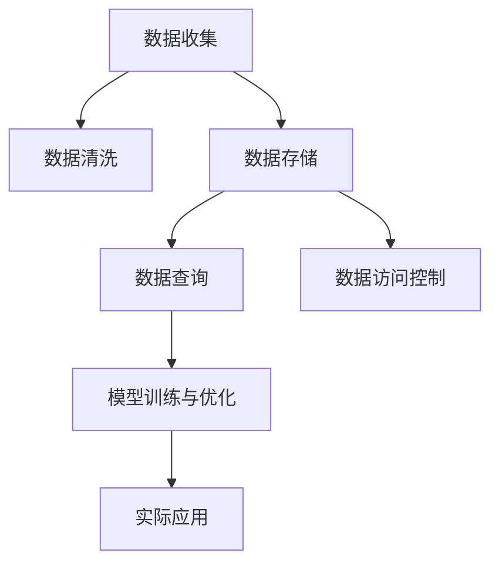

                 

# 人工智能创业数据管理的重要角色

在人工智能(AI)创业的浪潮中，数据管理无疑是一块重要基石。数据作为AI系统的关键输入，直接影响着算法的性能和模型的决策能力。无论是在模型训练、优化，还是在实际应用中，都离不开高效的数据管理和利用。本文将深入探讨AI创业中数据管理的核心概念、算法原理与操作步骤，并结合实际案例，详细讲解如何在不同应用场景下进行有效的数据管理。

## 1. 背景介绍

### 1.1 问题由来

在AI创业过程中，数据管理往往被忽视，特别是对于没有深厚数据科学背景的创业者而言，数据管理和分析往往成为技术和商业化的重大障碍。数据的质量、清洗、存储、访问等多个环节的不足，会严重影响AI模型的准确性和稳定性。因此，了解数据管理在AI创业中的重要角色，是构建可靠AI系统的第一步。

### 1.2 问题核心关键点

数据管理涉及数据收集、清洗、存储、查询、访问等多个环节，其核心关键点在于：

- 数据的准确性：确保数据的真实可靠，避免模型受到噪声干扰。
- 数据的完整性：保证数据集的完备性，避免数据丢失或偏差。
- 数据的多样性：增加数据的多样性，提升模型的泛化能力。
- 数据的实时性：确保数据的时效性，避免模型基于过时数据做出决策。
- 数据的隐私与安全：确保数据的安全性和隐私保护，避免数据泄露和滥用。

## 2. 核心概念与联系

### 2.1 核心概念概述

数据管理在AI创业中扮演着至关重要的角色，主要涉及以下几个核心概念：

- **数据收集**：从各种来源获取数据，包括网络爬虫、传感器数据、API接口等。
- **数据清洗**：对原始数据进行去重、去噪、处理缺失值等操作，提高数据质量。
- **数据存储**：选择合适的存储方式，如SQL数据库、NoSQL数据库、分布式文件系统等。
- **数据查询**：提供高效的数据访问接口，支持快速检索和分析。
- **数据访问控制**：对数据进行访问权限控制，保护数据隐私和安全。

这些概念之间的联系可以通过以下Mermaid流程图来展示：



这个流程图展示了大数据管理的核心流程和关键环节，从数据采集到模型应用，数据管理贯穿始终。

## 3. 核心算法原理 & 具体操作步骤
### 3.1 算法原理概述

数据管理的核心算法原理主要涉及以下几个方面：

- **数据清洗算法**：通过统计分析、异常检测等方法，对数据进行去重、去噪和缺失值处理，确保数据质量。
- **数据存储算法**：选择合适的数据存储策略，如分布式存储、数据分区、数据冗余等，提高数据的可靠性和可用性。
- **数据查询算法**：利用索引、缓存、并行查询等技术，提升数据查询效率，支持大规模数据处理。
- **数据访问控制算法**：通过身份验证、权限管理等手段，确保数据的安全性和隐私保护。

### 3.2 算法步骤详解

数据管理的具体操作步骤包括以下几个关键步骤：

**Step 1: 数据收集**

1. **确定数据来源**：收集数据之前，首先需要明确数据来源，包括公开数据集、API接口、传感器数据等。
2. **设计数据收集方案**：根据数据来源，设计相应的数据收集流程，包括数据采集、去重、去噪等步骤。

**Step 2: 数据清洗**

1. **数据预处理**：对原始数据进行清洗，包括去除重复数据、处理缺失值、处理异常值等。
2. **数据转换**：将数据转换为模型需要的格式，如one-hot编码、标准化处理等。
3. **数据集成**：将多个数据源的数据集成到一个统一的数据集中，确保数据的完整性。

**Step 3: 数据存储**

1. **选择合适的存储方式**：根据数据量、访问频率、存储要求等因素，选择合适的存储方式，如SQL数据库、NoSQL数据库、分布式文件系统等。
2. **数据分区与冗余**：对数据进行分区和冗余备份，提高数据的可靠性和可用性。

**Step 4: 数据查询**

1. **设计数据模型**：根据业务需求，设计相应的数据模型，包括数据表、索引、字段等。
2. **优化查询语句**：通过索引、缓存、并行查询等技术，优化查询效率，支持大规模数据处理。

**Step 5: 数据访问控制**

1. **身份验证**：对数据访问者进行身份验证，确保只有授权人员才能访问数据。
2. **权限管理**：对不同用户和角色设置不同的访问权限，确保数据的安全性和隐私保护。

### 3.3 算法优缺点

数据管理算法的优点包括：

- 提高数据质量：通过数据清洗和处理，去除噪声和偏差，提升模型性能。
- 增强数据可用性：通过数据存储和冗余备份，提高数据的可靠性和可用性。
- 支持高效查询：通过优化查询算法，提高数据访问效率，支持大规模数据处理。
- 确保数据安全：通过数据访问控制，保护数据隐私和安全。

其缺点包括：

- 数据清洗复杂：数据清洗和处理过程较为复杂，需要投入大量人力和时间。
- 存储成本高：大规模数据的存储需要高成本的硬件设备和空间。
- 查询效率受限：在大规模数据集上，查询效率可能受限，需要优化查询算法。
- 访问控制难度大：用户和权限管理复杂，容易出现安全漏洞。

## 4. 数学模型和公式 & 详细讲解  
### 4.1 数学模型构建

数据管理涉及到多个数学模型，以下是几个常用的数学模型：

- **数据清洗模型**：用于数据去重、去噪、处理缺失值等操作，常用的数学模型包括均值填充、中位数填充、KNN插值等。
- **数据存储模型**：用于数据分区、冗余备份等操作，常用的数学模型包括哈希算法、余弦相似度等。
- **数据查询模型**：用于优化查询效率，常用的数学模型包括索引算法、缓存策略、并行查询等。
- **数据访问控制模型**：用于身份验证和权限管理，常用的数学模型包括RBAC、ABAC等。

### 4.2 公式推导过程

**数据清洗模型**

1. **均值填充**：假设缺失值为 $X$，已知数据 $D$，均值 $\mu$，则填充公式为：

$$
X = \frac{\sum_{i=1}^n D_i}{n}
$$

2. **中位数填充**：假设缺失值为 $X$，已知数据 $D$，则填充公式为：

$$
X = \text{median}(D)
$$

3. **KNN插值**：假设缺失值为 $X$，已知数据 $D$，则插值公式为：

$$
X = \frac{\sum_{i=1}^n D_i \cdot \exp(-d_i^2)}{\sum_{i=1}^n \exp(-d_i^2)}
$$

其中 $d_i$ 为点 $D_i$ 到 $X$ 的距离。

**数据存储模型**

1. **哈希算法**：假设数据集为 $D$，哈希函数为 $h$，则存储公式为：

$$
S = \{h(D_i)\}_{i=1}^n
$$

2. **余弦相似度**：假设数据集为 $D_1, D_2$，则相似度公式为：

$$
\text{sim}(D_1, D_2) = \cos(\theta) = \frac{D_1 \cdot D_2}{\|D_1\| \cdot \|D_2\|}
$$

**数据查询模型**

1. **索引算法**：假设数据集为 $D$，索引为 $I$，则查询公式为：

$$
Q = I(D)
$$

2. **缓存策略**：假设数据集为 $D$，缓存大小为 $C$，则缓存公式为：

$$
Q = \text{cache}(D)
$$

3. **并行查询**：假设数据集为 $D$，查询时间为 $t$，并行查询因子为 $p$，则查询公式为：

$$
Q = \frac{t}{p}
$$

**数据访问控制模型**

1. **RBAC模型**：假设用户为 $U$，角色为 $R$，权限为 $P$，则访问控制公式为：

$$
A = U \times R \times P
$$

2. **ABAC模型**：假设用户为 $U$，属性为 $A$，权限为 $P$，则访问控制公式为：

$$
A = U \times A \times P
$$

### 4.3 案例分析与讲解

**案例1: 数据清洗**

假设有一家电商公司，收集了大量用户行为数据，但数据中存在一些异常值和缺失值。通过数据清洗模型，可以去除这些异常值和缺失值，提升数据质量。具体实现步骤如下：

1. **数据预处理**：使用中位数填充法处理缺失值，使用均值法处理异常值。
2. **数据转换**：将用户行为数据转换为one-hot编码，方便模型处理。
3. **数据集成**：将不同来源的用户行为数据集成到一个统一的数据集中，确保数据的完整性。

**案例2: 数据存储**

假设有一家金融公司，需要存储海量交易数据。通过数据存储模型，可以设计分布式文件系统，确保数据的可靠性和可用性。具体实现步骤如下：

1. **选择合适的存储方式**：使用Hadoop分布式文件系统(HDFS)存储海量交易数据。
2. **数据分区**：将数据按交易时间进行分区，提高查询效率。
3. **数据冗余**：对每个分区进行冗余备份，确保数据的高可用性。

**案例3: 数据查询**

假设有一家新闻网站，需要快速检索用户历史阅读记录。通过数据查询模型，可以优化查询效率，支持大规模数据处理。具体实现步骤如下：

1. **设计数据模型**：使用Elasticsearch存储用户阅读记录，建立索引。
2. **优化查询语句**：使用查询条件过滤、分页查询等技术，优化查询效率。
3. **并行查询**：使用多线程并行查询，提高查询速度。

**案例4: 数据访问控制**

假设有一家医疗公司，需要保护患者数据隐私。通过数据访问控制模型，可以确保数据的安全性和隐私保护。具体实现步骤如下：

1. **身份验证**：对医生和患者进行身份验证，确保只有授权人员才能访问数据。
2. **权限管理**：对不同角色和权限设置不同的访问权限，确保数据的安全性。

## 5. 项目实践：代码实例和详细解释说明
### 5.1 开发环境搭建

在进行数据管理实践前，我们需要准备好开发环境。以下是使用Python进行PyTorch开发的环境配置流程：

1. 安装Anaconda：从官网下载并安装Anaconda，用于创建独立的Python环境。

2. 创建并激活虚拟环境：
```bash
conda create -n data-env python=3.8 
conda activate data-env
```

3. 安装PyTorch：根据CUDA版本，从官网获取对应的安装命令。例如：
```bash
conda install pytorch torchvision torchaudio cudatoolkit=11.1 -c pytorch -c conda-forge
```

4. 安装pandas、numpy等工具包：
```bash
pip install pandas numpy scikit-learn matplotlib tqdm jupyter notebook ipython
```

完成上述步骤后，即可在`data-env`环境中开始数据管理实践。

### 5.2 源代码详细实现

这里我们以数据清洗为例，给出使用Python进行数据清洗的代码实现。

```python
import pandas as pd
import numpy as np

# 读取数据集
data = pd.read_csv('data.csv')

# 去除重复数据
data.drop_duplicates(inplace=True)

# 处理缺失值
data.fillna(method='median', inplace=True)

# 数据转换
data['feature'] = data['feature'].apply(lambda x: x if x > 0 else 0)

# 数据集成
combined_data = pd.concat([data1, data2])

# 打印处理后的数据集
print(combined_data)
```

以上就是使用Python进行数据清洗的完整代码实现。可以看到，通过简单的代码，可以对数据进行去重、处理缺失值、数据转换等操作，保证数据的质量。

### 5.3 代码解读与分析

让我们再详细解读一下关键代码的实现细节：

**读取数据集**

使用pandas库的`read_csv`方法读取CSV格式的数据集，将其存储到DataFrame中。

**去除重复数据**

使用DataFrame的`drop_duplicates`方法去除重复数据，确保数据集的完整性。

**处理缺失值**

使用DataFrame的`fillna`方法，将缺失值填充为中位数。

**数据转换**

使用lambda表达式对数据进行转换，将负值转换为0。

**数据集成**

使用pandas库的`concat`方法，将多个数据集集成到一个统一的数据集中。

**打印处理后的数据集**

最后，打印处理后的数据集，检查数据清洗的效果。

## 6. 实际应用场景
### 6.1 智能推荐系统

智能推荐系统是数据管理的典型应用场景之一。通过数据管理，可以实现用户行为数据的收集、清洗、存储和查询，从而提高推荐模型的性能。

在实际应用中，可以收集用户的浏览、点击、购买等行为数据，使用数据清洗模型去除噪声和异常值，使用数据存储模型存储用户行为数据，使用数据查询模型快速检索用户历史行为，从而生成推荐列表。具体实现步骤如下：

1. **数据收集**：收集用户浏览、点击、购买等行为数据。
2. **数据清洗**：使用数据清洗模型去除噪声和异常值。
3. **数据存储**：使用NoSQL数据库存储用户行为数据。
4. **数据查询**：使用索引和缓存技术，快速检索用户历史行为。
5. **推荐生成**：使用推荐模型生成推荐列表。

### 6.2 金融风控系统

金融风控系统是数据管理的另一个重要应用场景。通过数据管理，可以实现交易数据的收集、清洗、存储和查询，从而提高风控模型的性能。

在实际应用中，可以收集金融交易数据，使用数据清洗模型去除噪声和异常值，使用数据存储模型存储交易数据，使用数据查询模型快速检索交易数据，从而生成风控决策。具体实现步骤如下：

1. **数据收集**：收集金融交易数据。
2. **数据清洗**：使用数据清洗模型去除噪声和异常值。
3. **数据存储**：使用分布式文件系统存储交易数据。
4. **数据查询**：使用索引和缓存技术，快速检索交易数据。
5. **风控决策**：使用风控模型生成风控决策。

### 6.3 医疗影像分析

医疗影像分析是数据管理的另一个典型应用场景。通过数据管理，可以实现医疗影像数据的收集、清洗、存储和查询，从而提高影像分析模型的性能。

在实际应用中，可以收集医疗影像数据，使用数据清洗模型去除噪声和异常值，使用数据存储模型存储影像数据，使用数据查询模型快速检索影像数据，从而生成诊断结果。具体实现步骤如下：

1. **数据收集**：收集医疗影像数据。
2. **数据清洗**：使用数据清洗模型去除噪声和异常值。
3. **数据存储**：使用分布式文件系统存储影像数据。
4. **数据查询**：使用索引和缓存技术，快速检索影像数据。
5. **诊断生成**：使用影像分析模型生成诊断结果。

### 6.4 未来应用展望

随着数据管理技术的不断发展，未来数据管理将在更多领域得到应用，为传统行业带来变革性影响。

在智慧医疗领域，通过数据管理可以实现医疗影像数据的有效存储和查询，提高诊断的准确性和效率。在智能推荐系统中，通过数据管理可以实现用户行为数据的深度分析和挖掘，提升推荐效果。在金融风控系统中，通过数据管理可以实现交易数据的全面监控和分析，降低风险。在医疗影像分析中，通过数据管理可以实现影像数据的快速检索和处理，提高诊断速度和质量。

此外，在智慧城市治理、智能客服系统、智能制造等多个领域，数据管理的应用前景也非常广阔。相信随着数据管理技术的持续演进，未来数据管理必将在构建智慧社会的各个环节中发挥越来越重要的作用。

## 7. 工具和资源推荐
### 7.1 学习资源推荐

为了帮助开发者系统掌握数据管理的理论基础和实践技巧，这里推荐一些优质的学习资源：

1. 《数据科学基础》系列博文：由数据科学专家撰写，深入浅出地介绍了数据管理的各个环节，包括数据收集、清洗、存储、查询等。

2. 《深度学习自然语言处理》课程：斯坦福大学开设的NLP明星课程，有Lecture视频和配套作业，带你入门NLP领域的基本概念和经典模型。

3. 《数据科学实战》书籍：深入讲解数据管理的各个环节，包括数据清洗、数据存储、数据查询等，适合实战练习。

4. Kaggle数据集：全球最大的数据科学竞赛平台，提供丰富的数据集和竞赛，可以锻炼数据管理的实战技能。

通过对这些资源的学习实践，相信你一定能够快速掌握数据管理的精髓，并用于解决实际的数据管理问题。

### 7.2 开发工具推荐

高效的开发离不开优秀的工具支持。以下是几款用于数据管理开发的常用工具：

1. Pandas：基于Python的数据分析库，提供高效的数据处理和分析功能。

2. SQLAlchemy：基于Python的ORM库，支持关系型数据库的高级查询和操作。

3. Apache Spark：基于分布式计算的大数据处理框架，支持大规模数据处理。

4. Elasticsearch：基于分布式存储的搜索引擎，支持快速数据检索和查询。

5. TensorFlow Data Validation：谷歌开源的数据验证工具，可以自动检测数据集中的异常和问题，确保数据质量。

6. Apache Kafka：基于分布式消息队列的数据流处理平台，支持大规模数据的高效传输和处理。

合理利用这些工具，可以显著提升数据管理任务的开发效率，加快创新迭代的步伐。

### 7.3 相关论文推荐

数据管理技术的发展源于学界的持续研究。以下是几篇奠基性的相关论文，推荐阅读：

1. "Big Data Management for Real-time Analytics"（大数据管理与实时分析）：详细介绍了大数据管理的各个环节，包括数据收集、清洗、存储、查询等。

2. "Data Management in the Cloud: Challenges and Opportunities"（云环境下的数据管理：挑战与机遇）：探讨了云环境下的数据管理策略和技术，包括分布式存储、数据一致性、数据安全等。

3. "Machine Learning and Data Management: A Survey"（机器学习和数据管理：综述）：综述了机器学习和大数据管理的最新研究成果，提供了全面的参考。

这些论文代表了大数据管理的研究方向和发展趋势，通过学习这些前沿成果，可以帮助研究者把握学科前进方向，激发更多的创新灵感。

## 8. 总结：未来发展趋势与挑战

### 8.1 总结

本文对数据管理在AI创业中的重要角色进行了全面系统的介绍。首先阐述了数据管理在AI创业中的核心概念和关键点，明确了数据管理在构建可靠AI系统中的重要性。其次，从原理到实践，详细讲解了数据收集、清洗、存储、查询、访问等各个环节的算法原理和操作步骤，给出了数据管理任务开发的完整代码实例。同时，本文还广泛探讨了数据管理技术在多个领域的应用前景，展示了数据管理范式的巨大潜力。

通过本文的系统梳理，可以看到，数据管理在AI创业中扮演着至关重要的角色，其重要性不容忽视。未来，伴随数据管理技术的持续演进，数据管理必将在构建智能系统的各个环节中发挥越来越重要的作用。

### 8.2 未来发展趋势

展望未来，数据管理技术将呈现以下几个发展趋势：

1. **自动化和智能化**：随着AI技术的发展，数据管理的自动化和智能化水平将进一步提升。大数据处理工具将逐步具备自动清洗、自动存储、自动查询等能力，提升数据管理的效率和准确性。

2. **跨平台和跨领域**：数据管理将突破平台和领域的限制，实现多平台、多领域的协同管理。通过分布式存储和计算，支持不同数据源的统一管理和分析。

3. **数据隐私与安全**：数据隐私和安全将成为数据管理的重要课题。未来，数据管理将更加注重数据隐私保护和数据安全，防止数据泄露和滥用。

4. **实时性和低延迟**：数据管理的实时性和低延迟需求将进一步提高。通过数据流处理和实时计算技术，支持数据的高效实时处理和查询。

5. **大数据与AI的融合**：数据管理将与AI技术深度融合，通过数据驱动的机器学习模型，提升数据管理的智能性和自动化水平。

以上趋势凸显了数据管理技术的广阔前景。这些方向的探索发展，必将进一步提升数据管理的性能和应用范围，为AI技术的发展注入新的动力。

### 8.3 面临的挑战

尽管数据管理技术已经取得了瞩目成就，但在迈向更加智能化、普适化应用的过程中，它仍面临诸多挑战：

1. **数据质量问题**：数据收集和清洗过程复杂，难以保证数据的质量和一致性。

2. **存储成本高**：大规模数据的存储需要高成本的硬件设备和空间，数据管理成本较高。

3. **查询效率受限**：在大规模数据集上，查询效率可能受限，需要优化查询算法。

4. **数据隐私和安全**：用户和权限管理复杂，容易出现安全漏洞，数据隐私难以保障。

5. **自动化水平不足**：数据管理的自动化水平还有待提升，依赖人工处理的地方较多，效率较低。

6. **跨平台兼容性差**：不同平台的数据管理和存储格式不统一，跨平台的数据管理难度较大。

正视数据管理面临的这些挑战，积极应对并寻求突破，将是大数据管理走向成熟的必由之路。相信随着学界和产业界的共同努力，这些挑战终将一一被克服，大数据管理必将在构建智能社会的各个环节中发挥越来越重要的作用。

### 8.4 研究展望

面对数据管理面临的种种挑战，未来的研究需要在以下几个方面寻求新的突破：

1. **自动化和智能化**：开发更加自动化和智能化的数据管理工具，提升数据管理的效率和准确性。

2. **跨平台和跨领域**：研究和开发跨平台、跨领域的数据管理工具，支持不同数据源的统一管理和分析。

3. **数据隐私与安全**：加强数据隐私保护和数据安全的研究，防止数据泄露和滥用。

4. **实时性和低延迟**：研究和开发实时性和低延迟的数据管理技术，支持数据的高效实时处理和查询。

5. **大数据与AI的融合**：探索大数据管理与AI技术的深度融合，提升数据管理的智能性和自动化水平。

6. **多模态数据管理**：研究多模态数据的整合和分析，支持视觉、语音、文本等多种数据源的统一管理和分析。

这些研究方向的探索，必将引领大数据管理技术迈向更高的台阶，为构建智能系统的各个环节提供更可靠、高效的数据管理支持。面向未来，大数据管理技术还需要与其他AI技术进行更深入的融合，共同推动AI技术的进步和发展。总之，数据管理需要开发者根据具体应用场景，不断迭代和优化模型、数据和算法，方能得到理想的效果。

## 9. 附录：常见问题与解答

**Q1：数据管理是否适用于所有AI应用场景？**

A: 数据管理在大多数AI应用场景中都适用，尤其是那些依赖大规模数据集的任务。但对于一些实时性要求高、数据量小的任务，数据管理的必要性可能不如其他技术。

**Q2：如何进行高效的数据清洗？**

A: 高效的数据清洗需要结合数据的特点和任务需求，采用合适的清洗方法和工具。常用的数据清洗方法包括去重、去噪、处理缺失值、标准化处理等。

**Q3：如何选择合适的数据存储方式？**

A: 选择合适的数据存储方式需要综合考虑数据量、访问频率、存储要求等因素。常用的数据存储方式包括SQL数据库、NoSQL数据库、分布式文件系统等。

**Q4：如何进行高效的数据查询？**

A: 高效的数据查询需要设计合理的数据模型，使用索引、缓存、并行查询等技术。常用的数据查询方法包括索引、缓存、并行查询等。

**Q5：如何确保数据的安全性和隐私保护？**

A: 确保数据的安全性和隐私保护需要采用身份验证、权限管理、加密存储等措施。常用的数据访问控制方法包括RBAC、ABAC等。

通过本文的系统梳理，可以看到，数据管理在AI创业中扮演着至关重要的角色，其重要性不容忽视。未来，伴随数据管理技术的持续演进，数据管理必将在构建智能系统的各个环节中发挥越来越重要的作用。

