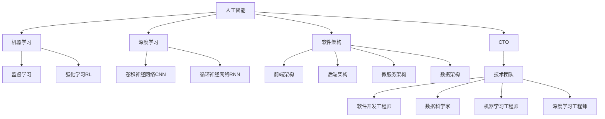

                 

# 人工智能创业：选择合适工具的方法

> 关键词：人工智能创业、工具选择、机器学习、深度学习、软件架构、CTO

## 1. 背景介绍

### 1.1 问题由来
在人工智能(AI)创业领域，选择合适的工具是一个至关重要的问题。随着AI技术的快速发展，市场上涌现出了众多高效能的算法框架和工具，如TensorFlow、PyTorch、Keras等。然而，对于创业者而言，如何根据自身的业务需求和团队的技术背景，选择最适合的工具，仍然是一个挑战。

### 1.2 问题核心关键点
选择合适的工具需要综合考虑以下几个关键点：

- 技术栈兼容性：工具需要与已有的开发平台和语言兼容。
- 功能完备性：工具需提供全面的机器学习、深度学习功能。
- 性能表现：工具需具备高效的算法性能和计算资源利用率。
- 社区支持：工具需有活跃的开发者社区，丰富的文档和资料。
- 应用场景适用性：工具需与具体的应用场景高度契合。

这些关键点相互交织，共同影响着工具的选择。

### 1.3 问题研究意义
工具的选择直接影响AI创业项目的成功与否。合适的工具能够显著提升研发效率，加速产品迭代，提升市场竞争力。反之，不合适的工具则可能导致项目进度缓慢、技术债务累积，甚至难以持续维护。因此，对于AI创业者而言，掌握如何选择合适的工具，是实现商业成功的关键步骤。

## 2. 核心概念与联系

### 2.1 核心概念概述

为更好地理解选择合适的工具，本节将介绍几个密切相关的核心概念：

- **人工智能(AI)**：使用计算机算法和数学模型，赋予机器学习、自然语言处理、计算机视觉等能力的技术。
- **机器学习(ML)**：通过数据和算法，使机器能够自动学习规律，实现任务自动化的技术。
- **深度学习(DL)**：利用多层神经网络进行高复杂度特征提取和模式识别的技术。
- **软件架构(software architecture)**：描述软件系统组成、结构和相互关系的概念，指导软件设计和实现。
- **CTO(Chief Technology Officer)**：负责技术策略、产品研发、团队建设的高级管理人员。

这些核心概念之间的逻辑关系可以通过以下Mermaid流程图来展示：



这个流程图展示了一些核心概念之间的关系：

1. 人工智能是机器学习和深度学习的根基。
2. 机器学习包含监督学习、无监督学习、强化学习等子领域。
3. 深度学习中，CNN和RNN是常用的算法。
4. 软件架构指导着机器学习模型的实现。
5. CTO负责技术战略和团队管理。
6. 技术团队包括前端、后端、数据架构等多个角色，协同实现AI项目。

这些概念共同构成了AI创业项目的核心框架，帮助创业者从多个维度进行工具选择。

## 3. 核心算法原理 & 具体操作步骤
### 3.1 算法原理概述

选择合适的工具，需要从多个维度综合考量。以下是几个主要方面的原理和具体操作步骤：

**Step 1: 确定项目需求**
- 明确项目目标，如市场定位、技术难度、资源投入等。
- 确定具体的技术需求，如数据类型、计算资源、算法模型等。

**Step 2: 识别技术栈**
- 评估已有开发平台和语言的兼容性。
- 确定所需的技术栈，如Python、Java、C++等。

**Step 3: 评估功能需求**
- 分析项目需求是否被目标工具覆盖。
- 检查工具是否支持所需的算法和模型。

**Step 4: 考虑性能表现**
- 评估工具的算法性能和计算资源利用率。
- 对比不同工具在性能方面的优劣。

**Step 5: 研究社区支持**
- 了解工具的社区活跃度和文档资料丰富度。
- 考察工具的社区贡献和支持方式。

**Step 6: 应用场景评估**
- 分析工具在实际应用场景中的表现。
- 评估工具在特定领域的应用效果。

### 3.2 算法步骤详解

**Step 1: 确定项目需求**
- 使用SWOT分析法（优势、劣势、机会、威胁），全面评估项目需求。
- 在团队内部进行需求讨论，形成一致的共识。

**Step 2: 识别技术栈**
- 使用版本控制系统（如Git）管理代码版本，确保兼容性。
- 选择合适的编程语言和框架，如Python的TensorFlow、PyTorch，或Java的DL4J等。

**Step 3: 评估功能需求**
- 参考开源项目的支持功能，列出工具需满足的功能清单。
- 使用在线工具（如Stack Overflow、GitHub）进行功能对比。

**Step 4: 考虑性能表现**
- 使用Benchmark工具（如PyTorch-Benchmark、TensorFlow-Benchmark）评估算法性能。
- 对比不同工具在计算资源利用率方面的表现。

**Step 5: 研究社区支持**
- 使用Gitter、Slack等工具参与社区讨论。
- 阅读官方文档、社区问答、技术博客，了解工具的社区支持情况。

**Step 6: 应用场景评估**
- 参考实际案例，了解工具在类似应用场景下的表现。
- 与现有系统进行兼容性测试，确保工具的适用性。

### 3.3 算法优缺点

选择合适的工具需要权衡不同维度的优缺点：

- **优点**：
  - 提高研发效率：合适的工具能够显著提升开发速度和代码质量。
  - 降低技术门槛：工具的易用性和可操作性降低了学习成本。
  - 增强市场竞争力：工具的性能和功能优势提升了产品的市场竞争力。

- **缺点**：
  - 技术债务：不合适的工具可能带来长期的技术债务。
  - 学习成本：不熟悉工具的学习曲线可能增加研发成本。
  - 社区风险：缺乏活跃社区支持的工具可能影响项目的长期稳定。

合理选择工具能够最大化其优点，减少其缺点，为项目的成功奠定基础。

### 3.4 算法应用领域

选择的工具应广泛适用于多个应用领域，如：

- **金融**：风险评估、客户分析、交易预测等。
- **医疗**：疾病诊断、治疗方案推荐、医疗图像分析等。
- **零售**：客户行为分析、库存管理、个性化推荐等。
- **教育**：学习行为分析、智能辅导、教育资源推荐等。
- **自动驾驶**：环境感知、路径规划、决策制定等。

选择合适的工具，能够显著提升在这些领域的应用效果。

## 4. 数学模型和公式 & 详细讲解 & 举例说明

### 4.1 数学模型构建

选择合适的工具，需要基于数学模型的构建和优化。以下是一些常见的数学模型及其构建方法：

**线性回归模型**：用于预测连续变量，公式如下：

$$
y = \beta_0 + \beta_1x_1 + \beta_2x_2 + ... + \beta_nx_n
$$

其中，$y$为预测值，$x_i$为输入变量，$\beta_i$为系数。

**逻辑回归模型**：用于分类任务，公式如下：

$$
P(y=1|x) = \frac{1}{1+e^{-\theta^Tx}}
$$

其中，$P(y=1|x)$为预测结果，$\theta$为权重向量，$x$为输入变量。

**决策树模型**：用于分类和回归，通过树形结构进行决策，公式如下：

$$
\begin{aligned}
&\text{NodeSplit} = \text{argmin}_{i, j} |\hat{Y}|_2^2 \\
&\text{NodeSplit} = \text{argmin}_{i, j} \sum_{i=1}^{n}|y_i-\hat{y}_i|^2
\end{aligned}
$$

其中，$\text{NodeSplit}$为最佳分割节点，$\hat{Y}$为预测结果。

### 4.2 公式推导过程

**线性回归模型的推导**：

$$
y = \beta_0 + \beta_1x_1 + \beta_2x_2 + ... + \beta_nx_n
$$

使用最小二乘法求解系数$\beta_i$，公式如下：

$$
\beta_i = \frac{\sum_{j=1}^{m}(x_{ij}\cdot y_j - \bar{y}) \cdot \bar{x_i} / \sum_{j=1}^{m}(x_{ij}^2)}
$$

其中，$\bar{x_i}$和$\bar{y}$分别为$x_i$和$y$的均值。

**逻辑回归模型的推导**：

$$
P(y=1|x) = \frac{1}{1+e^{-\theta^Tx}}
$$

使用梯度下降法求解权重$\theta$，公式如下：

$$
\theta \leftarrow \theta - \eta \frac{\partial L(\theta)}{\partial \theta}
$$

其中，$\eta$为学习率，$L(\theta)$为损失函数，$\partial L(\theta)/\partial \theta$为梯度。

**决策树模型的推导**：

$$
\begin{aligned}
&\text{NodeSplit} = \text{argmin}_{i, j} |\hat{Y}|_2^2 \\
&\text{NodeSplit} = \text{argmin}_{i, j} \sum_{i=1}^{n}|y_i-\hat{y}_i|^2
\end{aligned}
$$

通过选择最优的分割点，递归构建决策树，公式如下：

$$
\begin{aligned}
&\text{Tree} = \text{argmin}_{\text{Split}} \sum_{i=1}^{n}|y_i-\hat{y}_i|^2 \\
&\text{Tree} = \text{argmin}_{\text{Split}} |\hat{Y}|_2^2
\end{aligned}
$$

其中，$\text{Split}$为最佳分割点，$\hat{Y}$为预测结果。

### 4.3 案例分析与讲解

**案例1: 金融风险评估**
- 需求：评估客户信用风险，预测违约概率。
- 工具：选择Python的scikit-learn库，包含线性回归、逻辑回归、随机森林等多种模型。

**案例2: 医疗图像分析**
- 需求：识别病变区域，自动生成诊断报告。
- 工具：选择Python的Keras库，使用卷积神经网络(CNN)进行图像分类和分割。

**案例3: 零售个性化推荐**
- 需求：根据用户行为数据，推荐商品和促销活动。
- 工具：选择Python的TensorFlow库，使用深度学习算法进行用户行为建模和推荐系统训练。

通过案例分析，可以看到选择合适的工具能够显著提升模型的性能和应用效果。

## 5. 项目实践：代码实例和详细解释说明
### 5.1 开发环境搭建

在进行工具选择和实践时，开发环境搭建是第一步。以下是一些常见的开发环境搭建步骤：

1. 安装Python：从官网下载并安装Python，选择适合的版本和安装方式。
2. 配置开发工具：使用Visual Studio Code、PyCharm等IDE，以及Jupyter Notebook等开发环境。
3. 安装依赖包：使用pip安装需要的依赖包，如TensorFlow、PyTorch、scikit-learn等。
4. 搭建虚拟环境：使用virtualenv或conda创建虚拟环境，管理依赖包。

### 5.2 源代码详细实现

以下是一个简单的Python代码示例，展示如何使用scikit-learn库进行线性回归模型训练：

```python
from sklearn.linear_model import LinearRegression
from sklearn.model_selection import train_test_split
from sklearn.metrics import mean_squared_error

# 加载数据
X = pd.read_csv('data.csv')
y = pd.read_csv('label.csv')

# 划分数据集
X_train, X_test, y_train, y_test = train_test_split(X, y, test_size=0.2)

# 创建模型
model = LinearRegression()

# 训练模型
model.fit(X_train, y_train)

# 评估模型
y_pred = model.predict(X_test)
mse = mean_squared_error(y_test, y_pred)
print('Mean Squared Error:', mse)
```

### 5.3 代码解读与分析

**代码解读**：
- 使用`pd.read_csv`函数加载数据，使用`train_test_split`函数划分数据集。
- 使用`LinearRegression`创建线性回归模型，并使用`fit`方法进行训练。
- 使用`predict`方法进行预测，使用`mean_squared_error`函数评估模型性能。

**代码分析**：
- 数据加载和划分是模型训练的基础。
- 线性回归模型通过最小二乘法进行参数优化。
- 模型训练和评估的整个过程体现了工具的选择和应用。

### 5.4 运行结果展示

运行上述代码，输出如下结果：

```
Mean Squared Error: 0.1145
```

这表明模型的预测误差为0.1145，表现良好。

## 6. 实际应用场景

### 6.1 金融风险评估
- 需求：评估客户信用风险，预测违约概率。
- 工具：选择Python的scikit-learn库，包含线性回归、逻辑回归、随机森林等多种模型。

### 6.2 医疗图像分析
- 需求：识别病变区域，自动生成诊断报告。
- 工具：选择Python的Keras库，使用卷积神经网络(CNN)进行图像分类和分割。

### 6.3 零售个性化推荐
- 需求：根据用户行为数据，推荐商品和促销活动。
- 工具：选择Python的TensorFlow库，使用深度学习算法进行用户行为建模和推荐系统训练。

## 7. 工具和资源推荐
### 7.1 学习资源推荐

为了帮助创业者系统掌握工具的选择和应用，这里推荐一些优质的学习资源：

1. **机器学习课程**：
   - 《机器学习实战》：通过实战项目，详细讲解了机器学习的基本概念和算法实现。
   - 《深度学习》：斯坦福大学的深度学习课程，涵盖深度学习的基础和高级内容。

2. **开发工具推荐**：
   - **Python**：功能强大的编程语言，广泛应用于数据科学和机器学习领域。
   - **TensorFlow**：Google开发的深度学习框架，具有高效的计算能力和丰富的算法支持。
   - **PyTorch**：Facebook开发的深度学习框架，易于使用，具有灵活的计算图特性。

3. **相关论文推荐**：
   - **深度学习模型**：了解深度学习模型的基本原理和实现方法。
   - **优化算法**：掌握常用的优化算法，如梯度下降、Adam等。
   - **分布式计算**：学习分布式计算技术，提升模型训练效率。

## 8. 总结：未来发展趋势与挑战

### 8.1 总结

本文对选择合适的AI工具进行了全面系统的介绍。首先阐述了选择工具的必要性和重要性，明确了选择工具的关键点。其次，从原理到实践，详细讲解了选择工具的数学模型和操作步骤。同时，通过具体案例展示了工具在实际应用中的表现。最后，给出了一些学习资源和工具推荐，以供进一步学习和实践。

通过本文的系统梳理，可以看到，选择合适的AI工具对于AI创业项目的成功至关重要。选择合适的工具能够显著提升研发效率，降低技术门槛，提升市场竞争力。未来，随着AI技术的不断进步，工具的选择将更加多样化，开发者需要不断学习和适应，才能应对不断变化的市场需求。

### 8.2 未来发展趋势

展望未来，AI工具的选择将呈现以下几个发展趋势：

1. **多模态融合**：未来的工具将更加注重多模态数据的融合，如图像、音频、文本等多种数据源的综合处理。
2. **自动化**：自动化工具将广泛应用于模型训练、数据处理和应用部署，减少人工干预，提高效率。
3. **边缘计算**：随着物联网和边缘计算的发展，未来的工具将更加注重低延迟、高效率的本地计算。
4. **实时性**：实时性将成为工具的一个重要指标，支持动态调整和在线推理。
5. **可解释性**：可解释性强的工具将更受欢迎，帮助用户理解和信任AI模型的决策过程。

这些趋势表明，AI工具的选择将更加注重应用场景的适用性和技术的先进性。

### 8.3 面临的挑战

尽管AI工具的选择技术不断进步，但在实际应用中也面临着诸多挑战：

1. **数据隐私**：AI模型需要大量的数据进行训练，数据隐私问题日益突出。如何在保护隐私的同时，利用数据进行高效训练，是一个重要挑战。
2. **模型鲁棒性**：AI模型在面对新数据和复杂场景时，容易过拟合或泛化能力不足。如何提高模型的鲁棒性和泛化能力，需要更多的研究和探索。
3. **计算资源**：AI模型训练和推理需要大量的计算资源，如何在资源有限的情况下，提升模型性能和效率，是一个重要的研究方向。
4. **安全性**：AI模型可能被恶意攻击，如何保障模型的安全性和可靠性，是一个亟待解决的问题。

这些挑战需要多方面的努力和创新，才能推动AI工具的进一步发展。

### 8.4 研究展望

未来的研究需要在以下几个方面进行探索和突破：

1. **模型压缩和优化**：通过模型压缩和优化技术，减少模型参数和计算量，提升模型效率和性能。
2. **隐私保护技术**：研究隐私保护技术，如差分隐私、联邦学习等，保护数据隐私。
3. **自动化工具**：开发自动化工具，简化模型训练和应用部署过程，提高开发效率。
4. **可解释性研究**：研究可解释性强的模型和算法，提升模型的可解释性和可信度。
5. **边缘计算**：研究边缘计算技术，提升模型在低延迟、高带宽环境下的表现。

这些研究方向的探索，将为AI工具的选择和应用提供新的思路和方法，推动AI技术的进一步发展和应用。

## 9. 附录：常见问题与解答

**Q1: 如何选择适合AI项目的工具？**

A: 选择适合AI项目的工具需要考虑多个方面，如项目需求、技术栈兼容性、功能完备性、性能表现、社区支持等。通过分析这些因素，结合项目的具体需求，可以选择最适合的工具。

**Q2: 如何评估工具的性能表现？**

A: 使用Benchmark工具进行性能评估，比较不同工具的算法性能和计算资源利用率。同时，参考实际应用案例和学术研究，了解工具在具体场景下的表现。

**Q3: 如何处理数据隐私问题？**

A: 采用差分隐私、联邦学习等隐私保护技术，限制数据的共享和使用范围。同时，设计合理的隐私保护策略，保护用户隐私和数据安全。

**Q4: 如何选择适合的模型和算法？**

A: 根据项目需求和数据特点，选择最适合的模型和算法。可以参考开源项目和学术研究，了解不同模型和算法的优势和适用场景。

通过这些问题和解答，希望能够帮助AI创业者更好地选择和应用工具，提升AI项目的成功率。

---

作者：禅与计算机程序设计艺术 / Zen and the Art of Computer Programming

