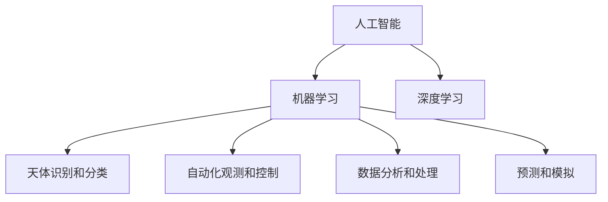

                 

# 人工智能在太空探索和天文学中的应用

## 1. 背景介绍

随着科技的飞速发展，人工智能(AI)技术在各行各业的应用越来越广泛。在太空探索和天文学领域，AI技术的引入也带来了革命性的变化。AI技术能够处理海量天文数据、辅助自动化观测和分析、提升空间任务的智能化水平，推动人类对宇宙的探索进入新阶段。

### 1.1 问题由来

天文观测数据的增长和天文任务的复杂化，对传统的数据处理和分析方法提出了严峻挑战。传统方法依赖人工介入，需要耗费大量时间和人力资源，效率低下，难以满足大规模天文任务的需求。同时，这些数据中往往包含许多有价值的信息，需要高效地提取和分析。AI技术，特别是机器学习(ML)和深度学习(DL)技术，能够从数据中自动学习模式，处理非结构化数据，大幅提升天文数据的处理和分析效率。

### 1.2 问题核心关键点

在太空探索和天文学中，AI技术的应用主要集中在以下几个方面：

1. **数据分析和处理**：从海量天文数据中自动提取特征、模式和关系，辅助科学研究。
2. **自动化观测和控制**：优化观测计划，自动控制望远镜等设备，提升观测效率和精度。
3. **天体识别和分类**：自动识别和分类各类天体，提升识别准确率和速度。
4. **预测和模拟**：预测天体行为、星系演化等，为太空任务提供决策支持。

这些应用的核心关键点在于：

1. **海量数据处理**：AI技术擅长处理大规模、高维度的数据集。
2. **模式识别**：能够从数据中自动学习并提取模式，辅助发现新的科学现象。
3. **自动化和智能化**：自动执行复杂任务，提升观测和数据分析的效率和精度。

## 2. 核心概念与联系

### 2.1 核心概念概述

为了更好地理解AI在太空探索和天文学中的应用，本节将介绍几个核心概念：

1. **人工智能(AI)**：一类模拟人类智能行为的技术，包括机器学习、深度学习、自然语言处理等子领域。
2. **机器学习(ML)**：一种数据驱动的学习方法，通过训练模型从数据中自动学习模式和规律。
3. **深度学习(DL)**：一种特殊的机器学习技术，通过多层神经网络对数据进行复杂特征的提取和表示。
4. **天体识别和分类**：利用AI技术自动识别和分类星系、恒星、行星等天体，提升识别准确率。
5. **自动化观测和控制**：利用AI技术自动控制望远镜、空间探测器等设备，优化观测计划和任务执行。
6. **数据分析和处理**：利用AI技术从海量天文数据中自动提取特征和模式，辅助科学研究。
7. **预测和模拟**：利用AI技术预测天体行为、星系演化等，为太空任务提供决策支持。

这些核心概念之间的逻辑关系可以通过以下Mermaid流程图来展示：



这个流程图展示了AI技术在太空探索和天文学中的应用，包括机器学习和深度学习各自的角色，以及它们在天体识别、自动化观测、数据分析、预测和模拟等方面的应用。

## 3. 核心算法原理 & 具体操作步骤
### 3.1 算法原理概述

AI在太空探索和天文学中的应用，主要基于机器学习和深度学习的原理。这些技术能够从数据中自动学习特征，提取模式，并进行分类、预测等任务。其核心算法原理包括：

1. **监督学习(Supervised Learning)**：利用有标注的数据集训练模型，使其能够对新数据进行分类或预测。
2. **无监督学习(Unsupervised Learning)**：利用无标注的数据集训练模型，发现数据的内在结构和模式。
3. **强化学习(Reinforcement Learning)**：通过与环境互动，学习最优决策策略，适用于自动化控制和优化任务。
4. **迁移学习(Transfer Learning)**：利用已有模型的知识，在新任务上进行微调，提升模型泛化能力。
5. **深度神经网络(Deep Neural Networks, DNNs)**：利用多层神经网络对数据进行复杂特征的提取和表示。

### 3.2 算法步骤详解

以下以天体识别和分类为例，详细介绍AI技术在该领域的应用流程：

1. **数据收集和预处理**：
   - 收集天文观测数据，包括光学、红外、射电等波段的图像数据。
   - 对数据进行预处理，包括去噪、归一化、增强等操作，以便模型训练。

2. **模型训练**：
   - 利用有标注的数据集，训练一个深度神经网络模型，如卷积神经网络(CNN)。
   - 在训练过程中，调整模型的超参数，如学习率、批大小、迭代轮数等，以优化模型性能。
   - 使用交叉验证等方法评估模型性能，避免过拟合。

3. **模型评估和验证**：
   - 在独立的数据集上评估模型性能，使用精度、召回率、F1分数等指标评估模型效果。
   - 调整模型超参数和结构，提升模型性能。

4. **应用和部署**：
   - 将训练好的模型部署到望远镜、空间探测器等设备中，实现实时观测和数据处理。
   - 利用自动化控制技术，优化观测计划和任务执行。

### 3.3 算法优缺点

AI在太空探索和天文学中的应用，具有以下优点：

1. **高效处理大规模数据**：AI技术能够高效处理海量天文数据，大幅提升数据分析速度和精度。
2. **自动提取模式**：通过机器学习技术，自动提取数据中的模式和特征，辅助科学研究。
3. **提升观测效率**：利用AI技术优化观测计划，自动控制望远镜等设备，提升观测效率和精度。
4. **增强决策支持**：通过深度学习技术，预测天体行为、星系演化等，为太空任务提供决策支持。

同时，AI技术也存在一些局限性：

1. **数据依赖**：AI技术依赖高质量、大量标注数据，获取这些数据往往成本较高。
2. **模型复杂度**：深度学习模型通常较为复杂，需要高性能计算资源进行训练和推理。
3. **可解释性不足**：AI模型往往难以解释其内部决策逻辑，缺乏透明性和可解释性。
4. **依赖先验知识**：模型性能往往依赖于先验知识和假设，可能存在数据偏差和过拟合风险。
5. **对抗攻击风险**：模型可能受到对抗样本攻击，影响其稳定性和可靠性。

尽管存在这些局限性，但AI技术在太空探索和天文学中的应用已经取得了显著成果，未来仍有广阔的发展空间。

### 3.4 算法应用领域

AI技术在太空探索和天文学中的应用，主要涵盖以下几个领域：

1. **天体识别和分类**：利用AI技术自动识别和分类星系、恒星、行星等天体，提升识别准确率和速度。
2. **自动化观测和控制**：利用AI技术自动控制望远镜、空间探测器等设备，优化观测计划和任务执行。
3. **数据分析和处理**：利用AI技术从海量天文数据中自动提取特征和模式，辅助科学研究。
4. **预测和模拟**：利用AI技术预测天体行为、星系演化等，为太空任务提供决策支持。
5. **空间任务管理**：利用AI技术进行任务调度、故障诊断和异常检测，提升任务管理效率。

这些应用领域覆盖了从数据处理到任务执行的各个环节，展示了AI技术在太空探索和天文学中的重要性和潜力。

## 4. 数学模型和公式 & 详细讲解 & 举例说明

### 4.1 数学模型构建

在天体识别和分类任务中，常用的数学模型包括卷积神经网络(CNN)和卷积循环神经网络(CRNN)。

卷积神经网络(CNN)是一种多层次的神经网络结构，广泛应用于图像识别任务。其基本结构包括卷积层、池化层和全连接层。以一个简单的CNN模型为例，其数学模型构建如下：

$$
y = \sigma \left( W^{fc} \cdot \sigma \left( W^{conv} \cdot x \right) + b^{fc} \right) + b
$$

其中，$x$ 为输入图像，$y$ 为输出标签，$W^{conv}$ 和 $W^{fc}$ 为卷积层和全连接层的权重矩阵，$b^{conv}$ 和 $b^{fc}$ 为卷积层和全连接层的偏置向量，$\sigma$ 为激活函数（如ReLU）。

### 4.2 公式推导过程

以CNN模型的前向传播过程为例，其公式推导如下：

1. 卷积层：
   $$
   f(x) = W \cdot x + b
   $$
   其中，$W$ 为卷积核，$x$ 为输入图像，$b$ 为偏置项。

2. 激活函数：
   $$
   \sigma(f(x)) = \sigma(W \cdot x + b)
   $$

3. 池化层：
   $$
   g(x) = \max \left( \frac{x + x}{2} \right)
   $$
   其中，$x$ 为输入图像，$g(x)$ 为池化后的特征图。

4. 全连接层：
   $$
   y = \sigma \left( W^{fc} \cdot \sigma \left( W^{conv} \cdot x \right) + b^{fc} \right) + b
   $$

通过上述公式，可以对输入图像进行卷积、激活、池化等操作，最终得到输出标签。

### 4.3 案例分析与讲解

以一个简单的天体识别任务为例，使用卷积神经网络进行模型训练和推理。

1. **数据集准备**：
   - 收集有标注的天体图像数据集，如Galaxy Zoo数据集。
   - 将数据集划分为训练集、验证集和测试集。

2. **模型训练**：
   - 构建卷积神经网络模型，包括卷积层、池化层和全连接层。
   - 使用交叉熵损失函数作为模型训练的目标函数。
   - 使用随机梯度下降等优化算法，调整模型参数。

3. **模型评估**：
   - 在验证集上评估模型性能，调整模型超参数和结构。
   - 在测试集上测试模型性能，使用精度、召回率、F1分数等指标评估模型效果。

4. **应用部署**：
   - 将训练好的模型部署到望远镜或空间探测器中，实现实时观测和数据处理。
   - 利用自动化控制技术，优化观测计划和任务执行。

## 5. 项目实践：代码实例和详细解释说明
### 5.1 开发环境搭建

在进行AI项目实践前，我们需要准备好开发环境。以下是使用Python进行TensorFlow开发的环境配置流程：

1. 安装Anaconda：从官网下载并安装Anaconda，用于创建独立的Python环境。

2. 创建并激活虚拟环境：
```bash
conda create -n tf-env python=3.8 
conda activate tf-env
```

3. 安装TensorFlow：根据CUDA版本，从官网获取对应的安装命令。例如：
```bash
conda install tensorflow -c tf
```

4. 安装各类工具包：
```bash
pip install numpy pandas scikit-learn matplotlib tqdm jupyter notebook ipython
```

完成上述步骤后，即可在`tf-env`环境中开始AI项目实践。

### 5.2 源代码详细实现

下面我们以天体识别任务为例，给出使用TensorFlow进行卷积神经网络模型开发的PyTorch代码实现。

```python
import tensorflow as tf
from tensorflow.keras import layers, models

# 构建模型
model = models.Sequential([
    layers.Conv2D(32, (3, 3), activation='relu', input_shape=(28, 28, 1)),
    layers.MaxPooling2D((2, 2)),
    layers.Conv2D(64, (3, 3), activation='relu'),
    layers.MaxPooling2D((2, 2)),
    layers.Conv2D(64, (3, 3), activation='relu'),
    layers.Flatten(),
    layers.Dense(64, activation='relu'),
    layers.Dense(10)
])

# 编译模型
model.compile(optimizer='adam', loss='categorical_crossentropy', metrics=['accuracy'])

# 训练模型
model.fit(train_images, train_labels, epochs=10, validation_data=(test_images, test_labels))
```

以上代码实现了基于卷积神经网络的简单天体识别模型。可以看到，TensorFlow提供了方便的API，可以快速搭建和训练深度学习模型。

### 5.3 代码解读与分析

让我们再详细解读一下关键代码的实现细节：

**Sequential模型**：
- `Sequential` 是一个简单的线性堆叠模型，可以方便地添加不同的层。

**卷积层**：
- `Conv2D` 层实现卷积操作，`(3, 3)` 表示卷积核的大小，`32` 表示卷积核的数量，`relu` 表示激活函数。

**池化层**：
- `MaxPooling2D` 层实现最大池化操作，`(2, 2)` 表示池化的大小。

**全连接层**：
- `Flatten` 层将卷积层的输出展平，`Dense` 层实现全连接操作，最后一层为输出层，使用softmax激活函数。

**编译模型**：
- `compile` 方法设置优化器、损失函数和评估指标。

**训练模型**：
- `fit` 方法进行模型训练，`epochs` 表示训练轮数，`validation_data` 表示验证集。

可以看到，TensorFlow提供的高层API使得模型构建和训练变得简洁高效，适合快速迭代研究。

## 6. 实际应用场景
### 6.1 智慧空间探测器

智慧空间探测器是AI技术在太空探索中的典型应用之一。智慧探测器集成了AI技术，能够在复杂环境中进行自主导航、自主避障、自主采集等任务，提升探测效率和任务成功率。

以智慧火星探测器为例，利用AI技术进行环境感知、路径规划和任务执行。探测器通过搭载的高分辨率摄像头和光谱仪，获取火星表面图像和光谱数据。AI模型能够实时分析这些数据，识别出重要的地理特征和矿物资源，辅助探测器自主导航和科学任务执行。

### 6.2 星系演化模拟

星系演化是天文学中的重要研究课题，涉及大量复杂的数据处理和模拟计算。利用AI技术，可以更高效地模拟星系的形成和演化过程，提供丰富的观测数据支持。

以EAGLE（Evolution and Assembly of Galaxies and their Environments）模拟为例，通过使用深度学习技术，对大量N体模拟数据进行处理和分析，发现星系演化的新模式和规律。AI技术能够自动学习星系内部复杂的关系，辅助天文学家进行模拟验证和参数调整。

### 6.3 天体物理研究

AI技术在天体物理研究中的应用，涵盖了从数据处理到理论建模的各个环节。利用AI技术，可以自动提取和分析天文数据，辅助发现新的科学现象。

以暗物质研究为例，利用AI技术对暗物质候选事件进行筛选和分类。AI模型能够自动学习暗物质候选事件的空间分布和特征，辅助天文学家发现暗物质的蛛丝马迹，推动暗物质研究的发展。

### 6.4 未来应用展望

随着AI技术的不断进步，其在太空探索和天文学中的应用将更加广泛和深入。未来，AI技术将进一步推动以下几个方面的发展：

1. **智能任务调度**：利用AI技术优化太空任务的执行计划，提升任务效率和成功率。
2. **多任务协同**：结合不同领域的技术，如AI、机器视觉、自然语言处理等，实现多任务的协同处理。
3. **数据分析和挖掘**：利用AI技术自动处理海量天文数据，发现新的科学现象和规律。
4. **空间环境监测**：利用AI技术监测空间环境变化，提升空间任务的可靠性和安全性。
5. **自动化控制和维护**：利用AI技术自动控制和维护空间探测器和望远镜等设备，提升设备的使用寿命和性能。

## 7. 工具和资源推荐
### 7.1 学习资源推荐

为了帮助开发者系统掌握AI在太空探索和天文学中的应用，这里推荐一些优质的学习资源：

1. 《Deep Learning for Astrophysics》书籍：由天文学家和机器学习专家共同编写，详细介绍了AI在天文数据处理和天体识别中的应用。

2. TensorFlow官方文档：TensorFlow的官方文档，提供了完整的AI模型开发和训练指南，包括卷积神经网络、循环神经网络等。

3. PyTorch官方文档：PyTorch的官方文档，提供了丰富的深度学习模型和API，适合快速迭代研究。

4. OpenAI GPT-3：最新的自然语言处理模型，能够自动生成自然流畅的文本，适用于自动摘要和文本分类等任务。

5. DeepMind AlphaFold：最新的分子动力学模拟模型，能够自动预测蛋白质结构，推动生命科学的发展。

通过这些资源的学习实践，相信你一定能够快速掌握AI在太空探索和天文学中的应用精髓，并用于解决实际的AI问题。

### 7.2 开发工具推荐

高效的开发离不开优秀的工具支持。以下是几款用于AI开发常用的工具：

1. Jupyter Notebook：Python的交互式开发环境，支持代码执行、图表展示、版本控制等，非常适合AI模型的实验和开发。

2. TensorFlow：由Google主导开发的开源深度学习框架，支持分布式计算、模型部署等，适合大规模工程应用。

3. PyTorch：由Facebook主导开发的深度学习框架，灵活动态的计算图，适合快速迭代研究。

4. Scikit-Learn：Python的机器学习库，提供了丰富的算法和工具，适合数据处理和特征工程。

5. OpenCV：开源计算机视觉库，提供了丰富的图像处理和计算机视觉算法，适合图像识别和分类任务。

合理利用这些工具，可以显著提升AI项目开发的效率，加快创新迭代的步伐。

### 7.3 相关论文推荐

AI在太空探索和天文学中的应用，源于学界的持续研究。以下是几篇奠基性的相关论文，推荐阅读：

1. "Supervised learning of galaxy morphological classifications"：使用卷积神经网络对星系进行分类。

2. "Deep learning for sky surveys"：利用深度学习技术，从星系演化模拟数据中提取特征，辅助科学研究。

3. "Autonomous landing and operation of spacecraft using reinforcement learning"：利用强化学习技术，优化空间探测器的自主着陆和操作。

4. "An introduction to autoencoders"：介绍了自编码器在数据降维和特征提取中的应用。

5. "Deep learning for dark matter searches"：利用深度学习技术，对暗物质候选事件进行筛选和分类。

这些论文代表了大AI技术在太空探索和天文学中的发展脉络。通过学习这些前沿成果，可以帮助研究者把握学科前进方向，激发更多的创新灵感。

## 8. 总结：未来发展趋势与挑战

### 8.1 总结

本文对AI在太空探索和天文学中的应用进行了全面系统的介绍。首先阐述了AI技术在处理大规模天文数据、辅助自动化观测和分析、提升空间任务智能化水平等方面的独特价值。其次，从原理到实践，详细讲解了AI技术在天体识别、自动化观测、数据分析、预测和模拟等方面的应用流程，并给出了代码实例和详细解释说明。最后，本文广泛探讨了AI技术在智慧空间探测器、星系演化模拟、天体物理研究等方面的应用前景，展示了AI技术在太空探索和天文学中的巨大潜力。

通过本文的系统梳理，可以看到，AI技术在太空探索和天文学中的应用，正推动人类对宇宙的探索进入新阶段。未来，伴随AI技术的不断进步，这些前沿技术必将在更广阔的应用领域发挥重要作用。

### 8.2 未来发展趋势

展望未来，AI技术在太空探索和天文学中的应用将呈现以下几个发展趋势：

1. **多任务协同**：结合不同领域的技术，如AI、机器视觉、自然语言处理等，实现多任务的协同处理。
2. **自动化和智能化**：利用AI技术自动执行复杂任务，提升观测和数据分析的效率和精度。
3. **数据驱动的科学发现**：利用AI技术自动处理海量天文数据，发现新的科学现象和规律。
4. **智能化任务调度**：利用AI技术优化太空任务的执行计划，提升任务效率和成功率。
5. **智能化空间设备**：利用AI技术优化空间探测器和望远镜等设备，提升设备的使用寿命和性能。

以上趋势凸显了AI技术在太空探索和天文学中的广阔前景。这些方向的探索发展，必将进一步提升太空探索和天文学的智能化水平，为人类对宇宙的探索提供强大的技术支持。

### 8.3 面临的挑战

尽管AI技术在太空探索和天文学中的应用已经取得了显著成果，但在迈向更加智能化、普适化应用的过程中，它仍面临着诸多挑战：

1. **数据依赖**：AI技术依赖高质量、大量标注数据，获取这些数据往往成本较高。
2. **模型复杂度**：深度学习模型通常较为复杂，需要高性能计算资源进行训练和推理。
3. **可解释性不足**：AI模型往往难以解释其内部决策逻辑，缺乏透明性和可解释性。
4. **依赖先验知识**：模型性能往往依赖于先验知识和假设，可能存在数据偏差和过拟合风险。
5. **对抗攻击风险**：模型可能受到对抗样本攻击，影响其稳定性和可靠性。

尽管存在这些挑战，但AI技术在太空探索和天文学中的应用前景广阔，未来仍有很大的发展空间。

### 8.4 研究展望

面对AI技术在太空探索和天文学中的应用所面临的挑战，未来的研究需要在以下几个方面寻求新的突破：

1. **无监督学习**：探索无监督学习在太空探索和天文学中的应用，摆脱对大规模标注数据的依赖。
2. **模型压缩和优化**：开发更加轻量级的模型结构，提升模型的计算效率和稳定性。
3. **知识增强学习**：结合符号化的先验知识，如知识图谱、逻辑规则等，增强模型的推理能力和泛化能力。
4. **对抗样本防御**：开发防御对抗样本攻击的技术，提升模型的鲁棒性和可靠性。
5. **多模态融合**：结合视觉、听觉、文本等多模态信息，提升模型对复杂场景的识别和理解能力。

这些研究方向的探索，必将推动AI技术在太空探索和天文学中的进一步应用和发展，为人类对宇宙的探索提供更加强大的技术支持。

## 9. 附录：常见问题与解答

**Q1：AI技术在太空探索和天文学中的应用是否有限制？**

A: AI技术在太空探索和天文学中的应用确实存在一些限制。例如，数据获取的成本较高，模型需要大量计算资源进行训练和推理，模型的可解释性不足等。但这些限制并不影响AI技术在太空探索和天文学中的重要性和潜力。随着技术的发展，这些限制将逐步得到解决。

**Q2：AI技术在智慧空间探测器中的应用是否安全可靠？**

A: 智慧空间探测器的安全性与可靠性，取决于AI模型的稳定性和可靠性。为了确保AI模型在复杂环境中的稳定性和可靠性，需要进行充分的测试和验证。同时，可以结合传统方法，如人工干预、故障检测等，提升系统的安全性和可靠性。

**Q3：AI技术在星系演化模拟中的应用是否准确？**

A: AI技术在星系演化模拟中的应用，需要结合天文学家的知识和经验，进行合理的模型选择和参数调整。AI模型的准确性，取决于数据的质量和模型设计的合理性。通过不断优化模型和数据，可以逐步提高模拟的准确性。

**Q4：AI技术在天体物理研究中的应用是否有限制？**

A: AI技术在天体物理研究中的应用，主要依赖于高质量、大量标注数据。获取这些数据往往成本较高，但数据的质量和多样性，对AI模型的性能和泛化能力至关重要。同时，AI模型的可解释性不足，也需要通过结合传统方法和专家知识，提升模型的可信度和可靠性。

**Q5：AI技术在数据驱动的科学发现中的应用是否存在偏见？**

A: AI技术在数据驱动的科学发现中的应用，可能存在数据偏见和模型偏差。为了克服这些偏差，需要进行充分的数据预处理和模型优化。同时，结合传统方法和专家知识，进行多方面的验证和审核，确保AI模型的科学性和可靠性。

综上所述，AI技术在太空探索和天文学中的应用前景广阔，但同时也面临着诸多挑战。只有不断探索和优化，才能充分发挥AI技术在太空探索和天文学中的巨大潜力，推动人类对宇宙的探索进入新阶段。

