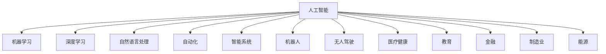

                 

# 人工智能对各行业的影响

> 关键词：人工智能,各行业,自动化,效率提升,决策优化,智能系统,机器人,无人驾驶,医疗,教育,金融,制造业,能源,可持续发展

## 1. 背景介绍

### 1.1 问题由来
人工智能(AI)技术正迅速渗透到各行各业，显著提升效率、优化决策、构建智能系统，展现出前所未有的潜力。从医疗、教育到金融、制造，从零售、物流到农业、能源，AI技术正在带来深刻变革。

### 1.2 问题核心关键点
人工智能技术对各行业的影响主要体现在以下几个方面：

- **自动化**：自动化技术大幅提高了生产效率，减少了人为错误，降低了成本。
- **效率提升**：AI技术通过数据分析和优化算法，显著提升了业务流程的执行效率。
- **决策优化**：AI系统能够基于大数据进行精确分析，提供更有力的决策支持。
- **智能系统**：智能系统利用AI技术进行自我学习和优化，实现更高效、更智能的操作。
- **机器人与无人驾驶**：机器人与无人驾驶技术在制造业、物流、交通等领域得到广泛应用。
- **医疗与健康**：AI技术在医疗影像分析、疾病诊断、个性化治疗等方面发挥重要作用。
- **教育与培训**：智能教育平台和虚拟教练利用AI提升学习效率和效果。
- **金融与风险管理**：AI技术在风险评估、交易策略、客户服务等方面展示了其价值。
- **制造业与智能制造**：智能制造系统通过AI优化生产线，提升产品质量和生产效率。
- **能源与可持续发展**：AI技术在能源管理和环境保护方面提供了新解决方案。

### 1.3 问题研究意义
研究人工智能技术对各行业的影响，对于理解AI技术的普及应用、发掘AI带来的机遇与挑战、制定行业发展战略具有重要意义。

1. **理解AI技术应用**：了解AI在不同行业的应用案例和效果，有助于企业和技术开发者更好地理解AI技术。
2. **发掘AI机遇与挑战**：AI技术带来的机遇与挑战并存，识别这些问题能够帮助企业制定切实可行的AI发展策略。
3. **制定行业发展战略**：基于对AI技术影响的深入分析，可以帮助行业制定未来发展方向和目标。

## 2. 核心概念与联系

### 2.1 核心概念概述

为更好地理解人工智能技术对各行业的影响，本节将介绍几个关键概念及其相互联系：

- **人工智能(AI)**：涉及机器学习、深度学习、自然语言处理等技术，通过算法和模型实现智能化。
- **机器学习(ML)**：数据驱动的学习方法，使机器通过训练数据自动提升性能。
- **深度学习(DL)**：一种特殊的机器学习技术，利用多层神经网络进行复杂模式识别。
- **自然语言处理(NLP)**：使计算机能够理解和处理人类语言的技术。
- **自动化(Automation)**：通过程序或算法自动化执行任务，减少人工干预。
- **智能系统(Smart Systems)**：具备自学习能力的系统，能够在无需人类干预的情况下优化决策和执行。
- **机器人(Robotics)**：结合传感器、控制系统和AI技术的机械装置，用于执行复杂任务。
- **无人驾驶(Autonomous Driving)**：使车辆能够自主导航，无需人工驾驶。
- **医疗健康(Healthcare)**：AI在医疗影像分析、诊断、治疗等方面的应用。
- **教育(Education)**：利用AI技术提升教学效果和学习效率。
- **金融(Finance)**：AI在风险管理、投资分析、客户服务等方面的应用。
- **制造业(Manufacturing)**：通过智能制造系统提升生产效率和质量。
- **能源(Energy)**：AI在能源管理和环境保护中的应用。

这些概念之间的逻辑关系可以通过以下Mermaid流程图来展示：



这个流程图展示了几大核心概念及其之间的联系：

1. **人工智能**是这些概念的基础，包含机器学习、深度学习和自然语言处理等多种技术。
2. **机器学习和深度学习**是实现智能化和自动化的核心技术手段。
3. **自然语言处理**使得计算机能够理解和处理人类语言，是AI技术的一个重要分支。
4. **自动化**和**智能系统**通过机器学习和深度学习技术实现。
5. **机器人**和**无人驾驶**是自动化技术的典型应用。
6. **医疗健康**、**教育**、**金融**、**制造业**和**能源**等行业是AI技术的具体应用场景。

## 3. 核心算法原理 & 具体操作步骤
### 3.1 算法原理概述

人工智能技术对各行业的影响主要通过算法和模型来实现。具体来说，算法原理如下：

- **数据收集与预处理**：收集各行业的数据，并进行清洗、去重和标准化，以确保数据质量。
- **特征提取与选择**：从原始数据中提取特征，并选择对目标任务有帮助的特征。
- **模型训练与优化**：使用机器学习或深度学习模型进行训练，并通过交叉验证等方法优化模型性能。
- **模型部署与应用**：将训练好的模型部署到实际业务中，实现自动化和智能化操作。

### 3.2 算法步骤详解

以医疗影像分析为例，详细讲解基于深度学习的算法步骤：

1. **数据收集**：收集大量的医疗影像数据，包括X光片、CT扫描、MRI等。
2. **数据预处理**：清洗数据，去除噪声，将图像标准化为统一的尺寸和格式。
3. **特征提取**：利用卷积神经网络(CNN)提取图像特征。
4. **模型训练**：使用标注好的影像数据训练深度学习模型，如卷积神经网络。
5. **模型评估**：使用测试集评估模型性能，调整超参数，优化模型。
6. **模型部署**：将训练好的模型集成到医疗影像分析系统中，实现自动化的疾病诊断。

### 3.3 算法优缺点

人工智能技术对各行业的影响，其算法优缺点如下：

- **优点**：
  - **自动化**：显著提升生产效率，降低人工成本。
  - **效率提升**：通过优化算法，提高业务流程效率。
  - **决策优化**：基于大数据分析，提供更准确的决策支持。
  - **智能系统**：具备自学习和优化能力，提高系统性能。

- **缺点**：
  - **数据依赖**：需要大量高质量数据，数据获取和标注成本高。
  - **模型复杂**：深度学习等模型复杂度高，需要高性能计算资源。
  - **解释性不足**：模型决策过程难以解释，影响信任度。
  - **伦理和安全**：存在偏见和隐私问题，需要严格监管和防护。

### 3.4 算法应用领域

人工智能技术在多个领域得到了广泛应用，主要包括以下几个方面：

- **医疗健康**：用于疾病诊断、影像分析、个性化治疗等。
- **金融服务**：用于风险管理、投资分析、客户服务等。
- **制造业**：用于智能制造、质量控制、供应链管理等。
- **零售与电商**：用于客户推荐、库存管理、物流优化等。
- **交通运输**：用于自动驾驶、交通流量预测、智能调度等。
- **教育**：用于个性化学习、智能辅导、虚拟教室等。
- **能源管理**：用于能源消耗预测、智能电网管理等。

## 4. 数学模型和公式 & 详细讲解  
### 4.1 数学模型构建

以下以医疗影像分析为例，构建基于深度学习的数学模型。

假设医疗影像数据集为 $D=\{(x_i,y_i)\}_{i=1}^N$，其中 $x_i$ 为影像数据， $y_i$ 为疾病标签。定义深度学习模型 $M_{\theta}(x)$，其中 $\theta$ 为模型参数。模型的损失函数为交叉熵损失，目标最小化损失函数：

$$
\mathcal{L}(\theta) = -\frac{1}{N}\sum_{i=1}^N \log M_{\theta}(x_i)
$$

模型参数的更新公式为：

$$
\theta \leftarrow \theta - \eta \nabla_{\theta}\mathcal{L}(\theta)
$$

其中 $\eta$ 为学习率， $\nabla_{\theta}\mathcal{L}(\theta)$ 为损失函数对模型参数的梯度。

### 4.2 公式推导过程

根据上述公式，通过链式法则计算梯度：

$$
\nabla_{\theta}\mathcal{L}(\theta) = -\frac{1}{N}\sum_{i=1}^N \frac{\partial \log M_{\theta}(x_i)}{\partial \theta}
$$

对于卷积神经网络，梯度计算涉及卷积层、池化层、激活函数等，复杂度较高。但借助现有的深度学习框架，如TensorFlow或PyTorch，可以自动完成梯度计算和优化。

### 4.3 案例分析与讲解

以医疗影像分析为例，详细讲解深度学习模型的构建和训练过程。

1. **数据准备**：收集并清洗医疗影像数据，将数据标准化为统一的尺寸和格式。
2. **模型选择**：选择适当的卷积神经网络结构，如VGG、ResNet等。
3. **模型训练**：将数据划分为训练集和验证集，使用交叉熵损失函数进行模型训练。
4. **模型评估**：使用测试集评估模型性能，如准确率、召回率、F1分数等。
5. **模型优化**：调整超参数，如学习率、批量大小等，优化模型性能。
6. **模型部署**：将训练好的模型集成到医疗影像分析系统中，实现自动化诊断。

## 5. 项目实践：代码实例和详细解释说明
### 5.1 开发环境搭建

在进行项目实践前，需要先准备好开发环境。以下是使用Python进行深度学习开发的典型环境配置流程：

1. 安装Anaconda：从官网下载并安装Anaconda，用于创建独立的Python环境。

2. 创建并激活虚拟环境：
```bash
conda create -n pytorch-env python=3.8 
conda activate pytorch-env
```

3. 安装深度学习框架：
```bash
pip install torch torchvision torchaudio
```

4. 安装TensorBoard：用于实时监测模型训练状态，提供图表呈现。

5. 安装Jupyter Notebook：用于交互式编程和模型调试。

完成上述步骤后，即可在`pytorch-env`环境中开始深度学习开发实践。

### 5.2 源代码详细实现

以下以医疗影像分析为例，给出使用TensorFlow进行深度学习的PyTorch代码实现。

首先，定义数据处理函数：

```python
import tensorflow as tf
from tensorflow.keras.preprocessing.image import ImageDataGenerator

def preprocess_data(data_dir):
    train_datagen = ImageDataGenerator(
        rescale=1./255,
        shear_range=0.2,
        zoom_range=0.2,
        horizontal_flip=True
    )
    test_datagen = ImageDataGenerator(rescale=1./255)
    train_generator = train_datagen.flow_from_directory(
        data_dir,
        target_size=(224, 224),
        batch_size=32,
        class_mode='categorical',
        shuffle=True
    )
    test_generator = test_datagen.flow_from_directory(
        data_dir,
        target_size=(224, 224),
        batch_size=32,
        class_mode='categorical',
        shuffle=False
    )
    return train_generator, test_generator
```

然后，定义模型和优化器：

```python
from tensorflow.keras.applications import ResNet50
from tensorflow.keras.models import Model
from tensorflow.keras.optimizers import Adam

base_model = ResNet50(include_top=False, weights='imagenet')
x = base_model.output
x = tf.keras.layers.GlobalAveragePooling2D()(x)
x = tf.keras.layers.Dense(256, activation='relu')(x)
predictions = tf.keras.layers.Dense(2, activation='softmax')(x)

model = Model(inputs=base_model.input, outputs=predictions)
model.compile(optimizer=Adam(lr=0.001), loss='categorical_crossentropy', metrics=['accuracy'])
```

接着，定义训练和评估函数：

```python
from tensorflow.keras.callbacks import EarlyStopping

def train_model(model, train_generator, val_generator, epochs, callbacks):
    history = model.fit(
        train_generator,
        validation_data=val_generator,
        epochs=epochs,
        callbacks=callbacks
    )
    return history

def evaluate_model(model, test_generator, eval_epochs):
    score = model.evaluate(test_generator, verbose=0)
    print('Test loss:', score[0])
    print('Test accuracy:', score[1])
    return score[1]
```

最后，启动训练流程并在测试集上评估：

```python
epochs = 10
callbacks = [EarlyStopping(patience=3, restore_best_weights=True)]

train_generator, test_generator = preprocess_data('data_dir')

history = train_model(model, train_generator, test_generator, epochs, callbacks)
evaluate_model(model, test_generator, epochs)
```

以上就是使用TensorFlow进行深度学习项目实践的完整代码实现。可以看到，借助TensorFlow等深度学习框架，深度学习模型的开发变得更加简便高效。

### 5.3 代码解读与分析

让我们再详细解读一下关键代码的实现细节：

**preprocess_data函数**：
- 定义了数据预处理函数，使用ImageDataGenerator对图像进行标准化、数据增强等预处理操作。

**model定义**：
- 使用了预训练的ResNet50模型作为基础模型，添加全连接层进行分类预测。
- 使用Adam优化器，设置合适的学习率。
- 定义了损失函数和评价指标，进行模型编译。

**train_model函数**：
- 定义了模型训练函数，使用EarlyStopping回调避免过拟合。
- 在每个epoch结束后，保存最优权重以防止模型过拟合。

**evaluate_model函数**：
- 定义了模型评估函数，使用测试集对模型进行验证。
- 打印测试集的损失和准确率，返回准确率。

**训练流程**：
- 定义训练轮数，启动训练过程。
- 每个epoch结束后，打印训练集和验证集的损失和准确率。
- 保存最优权重，防止模型过拟合。

可以看到，深度学习模型的开发和训练过程简单高效，借助现有的深度学习框架和模型，可以快速构建出高质量的深度学习模型。

## 6. 实际应用场景

### 6.1 医疗影像分析

医疗影像分析是人工智能技术在医疗健康领域的重要应用之一。传统影像分析依赖人工判读，耗时长、效率低、误判率高。通过深度学习模型，可以实现自动化的影像分析和诊断，大幅提升诊断效率和准确率。

以癌症影像分析为例，深度学习模型可以自动检测肿瘤区域、分析病变特征，给出疾病诊断建议。具体应用场景包括：

- **肺部影像分析**：自动检测肺部肿瘤、结节、炎症等病变。
- **乳腺影像分析**：自动检测乳腺肿瘤、钙化灶等病变。
- **脑部影像分析**：自动检测脑部肿瘤、出血等病变。

通过深度学习模型，医生可以快速、准确地完成影像分析，减轻工作负担，提升诊断水平。

### 6.2 智能客服系统

智能客服系统通过深度学习模型，可以实现自动化的客户服务，提升客户满意度。传统客服系统依赖人工客服，响应慢、效率低、成本高。通过深度学习模型，可以实现自动化的问题解答和任务处理，大幅提升客户体验。

具体应用场景包括：
- **自动化问答**：根据用户提问，自动提供相关解答。
- **任务分配**：自动分配任务，提升客服效率。
- **情绪识别**：自动识别用户情绪，提供个性化服务。

通过智能客服系统，企业可以大幅降低客服成本，提升服务质量，增强客户粘性。

### 6.3 智能制造

智能制造系统通过深度学习模型，可以实现自动化的生产调度、质量控制和设备维护，提升生产效率和产品质量。传统制造系统依赖人工操作和调度，效率低、成本高、质量不稳定。通过深度学习模型，可以实现智能化的生产管理，提升生产效率和质量。

具体应用场景包括：
- **设备故障预测**：自动检测设备异常，提前进行维护。
- **生产调度优化**：自动调整生产计划，优化生产效率。
- **产品质量检测**：自动检测产品缺陷，提升产品质量。

通过智能制造系统，企业可以大幅降低生产成本，提升生产效率和产品质量。

### 6.4 未来应用展望

随着深度学习技术的不断发展，人工智能在各行业的应用将更加广泛和深入。未来，人工智能将在更多领域发挥其独特优势，带来颠覆性的变革。

- **医疗健康**：人工智能将在疾病预测、个性化治疗、医疗影像分析等方面发挥更大作用，提升医疗服务水平。
- **金融服务**：人工智能将在风险管理、投资分析、客户服务等方面提供更多支持，提升金融服务效率。
- **智能制造**：人工智能将在生产调度、质量控制、设备维护等方面提升制造效率和质量，推动智能制造发展。
- **智能交通**：人工智能将在自动驾驶、交通流量预测、智能调度等方面提升交通管理水平，缓解交通压力。
- **教育培训**：人工智能将在个性化学习、智能辅导、虚拟教室等方面提升教育质量，推动教育公平。
- **能源管理**：人工智能将在能源消耗预测、智能电网管理等方面提升能源管理水平，推动能源可持续发展。

## 7. 工具和资源推荐
### 7.1 学习资源推荐

为帮助开发者系统掌握人工智能技术，这里推荐一些优质的学习资源：

1. **《深度学习》课程**：斯坦福大学开设的深度学习课程，有Lecture视频和配套作业，带你入门深度学习的基本概念和经典模型。
2. **Coursera深度学习专项课程**：由Google、IBM等机构提供，涵盖深度学习的基础知识和高级技巧。
3. **Kaggle竞赛**：参加Kaggle竞赛，锻炼数据分析和模型调参能力。
4. **GitHub代码库**：查看和借鉴开源项目代码，提升编程能力和模型实现能力。
5. **arXiv预印本**：阅读最新的深度学习研究成果，了解前沿技术和进展。

通过对这些资源的学习实践，相信你一定能够快速掌握深度学习技术，并用于解决实际的业务问题。

### 7.2 开发工具推荐

高效的开发离不开优秀的工具支持。以下是几款用于深度学习开发的常用工具：

1. **TensorFlow**：由Google主导开发的开源深度学习框架，生产部署方便，适合大规模工程应用。
2. **PyTorch**：基于Python的开源深度学习框架，灵活动态的计算图，适合快速迭代研究。
3. **Jupyter Notebook**：交互式编程环境，方便代码调试和模型评估。
4. **TensorBoard**：TensorFlow配套的可视化工具，可实时监测模型训练状态，提供图表呈现。
5. **Git**：版本控制系统，方便代码协作和管理。
6. **Visual Studio Code**：强大的代码编辑器，支持多种语言和插件。

合理利用这些工具，可以显著提升深度学习开发效率，加快创新迭代的步伐。

### 7.3 相关论文推荐

深度学习技术的发展源于学界的持续研究。以下是几篇奠基性的相关论文，推荐阅读：

1. **《深度学习》（Ian Goodfellow等人）**：深度学习领域的经典教材，涵盖深度学习的基础知识和高级技巧。
2. **《ImageNet Classification with Deep Convolutional Neural Networks》（Alex Krizhevsky等人）**：ImageNet分类任务的开创性工作，展示了深度卷积神经网络的强大能力。
3. **《Very Deep Convolutional Networks for Large-Scale Image Recognition》（Karen Simonyan和Andrew Zisserman）**：提出了VGG网络结构，展示了深度卷积神经网络的强大表现。
4. **《Deep Residual Learning for Image Recognition》（Kaiming He等人）**：提出了ResNet网络结构，解决了深度神经网络中的梯度消失问题。
5. **《Generative Adversarial Networks》（Ian Goodfellow等人）**：提出了生成对抗网络（GAN），展示了生成模型在图像生成、风格转换等方面的强大能力。

这些论文代表了大深度学习技术的发展脉络。通过学习这些前沿成果，可以帮助研究者把握学科前进方向，激发更多的创新灵感。

## 8. 总结：未来发展趋势与挑战

### 8.1 总结

本文对人工智能技术对各行业的影响进行了全面系统的介绍。首先阐述了人工智能技术的广泛应用和显著成效，明确了其在自动化、效率提升、决策优化等方面的独特价值。其次，从原理到实践，详细讲解了深度学习模型的构建和训练过程，给出了实际应用场景和代码实现。同时，本文还探讨了深度学习技术在各行业的未来发展趋势和面临的挑战。

通过本文的系统梳理，可以看到，深度学习技术正在成为推动各行业智能化、高效化的重要力量。未来，随着深度学习技术的不断演进，人工智能技术必将在更多领域带来深刻的变革，为人类社会带来新的发展机遇。

### 8.2 未来发展趋势

展望未来，深度学习技术的发展将呈现以下几个趋势：

1. **深度学习与大数据的结合**：深度学习需要更多高质量的大数据进行训练，未来大数据的应用将更加广泛和深入。
2. **深度学习与自然语言处理的结合**：深度学习在自然语言处理领域的应用将更加深入，如图像描述生成、机器翻译等。
3. **深度学习与自动化的结合**：深度学习与自动化技术的结合将带来更高效的生产过程，如智能制造、智能交通等。
4. **深度学习与量子计算的结合**：量子计算技术的成熟将为深度学习提供更强大的计算能力，提升模型训练效率。
5. **深度学习与物联网的结合**：物联网技术的发展将带来更多的数据来源，促进深度学习技术的应用和优化。
6. **深度学习与伦理道德的结合**：深度学习技术的应用需要考虑伦理道德问题，确保数据和算法的公正性和透明性。

以上趋势凸显了深度学习技术的广阔前景，这些方向的探索发展，必将进一步提升深度学习技术的应用效果和普及范围。

### 8.3 面临的挑战

尽管深度学习技术已经取得了瞩目成就，但在迈向更加智能化、普适化应用的过程中，仍面临诸多挑战：

1. **数据获取和标注成本**：高质量标注数据获取成本高，限制了深度学习技术的应用范围。
2. **模型复杂度和计算资源**：深度学习模型复杂度高，需要高性能计算资源。
3. **模型解释性和可信任度**：深度学习模型决策过程难以解释，影响信任度。
4. **伦理和安全问题**：深度学习技术的应用需要考虑伦理和隐私问题，确保数据和算法的公正性和透明性。
5. **硬件资源瓶颈**：深度学习模型推理效率低，硬件资源限制其应用范围。
6. **跨领域和跨行业应用**：深度学习技术在不同行业的应用效果差异较大，需要针对具体行业进行优化。

### 8.4 研究展望

面对深度学习技术面临的挑战，未来的研究需要在以下几个方面寻求新的突破：

1. **数据增强和自动标注技术**：开发更多数据增强和自动标注技术，降低数据获取和标注成本。
2. **模型压缩和加速技术**：开发模型压缩和加速技术，提升深度学习模型的计算效率和推理速度。
3. **可解释性和透明性**：开发可解释性和透明性技术，提升深度学习模型的信任度和可信度。
4. **伦理和隐私保护**：建立伦理和隐私保护机制，确保深度学习技术的应用符合伦理道德标准。
5. **跨领域和跨行业应用**：开发跨领域和跨行业的深度学习技术，提升深度学习技术的应用效果和普及范围。

这些研究方向的探索，必将引领深度学习技术迈向更高的台阶，为构建智能、高效、透明的社会提供新的动力。面向未来，深度学习技术还需要与其他人工智能技术进行更深入的融合，如知识表示、因果推理、强化学习等，多路径协同发力，共同推动人工智能技术的发展和应用。只有勇于创新、敢于突破，才能不断拓展人工智能技术的边界，让人工智能技术更好地造福人类社会。

## 9. 附录：常见问题与解答

**Q1：深度学习技术对各行业的影响是什么？**

A: 深度学习技术在各行业的应用，主要体现在自动化、效率提升、决策优化、智能系统构建等方面。深度学习技术可以自动完成复杂任务，提升业务流程效率，提供精准决策支持，构建高效、智能的系统。

**Q2：深度学习技术在各行业的应用有哪些？**

A: 深度学习技术在医疗健康、金融服务、智能制造、智能交通、教育培训、能源管理等多个领域得到了广泛应用。

**Q3：深度学习技术在医疗影像分析中如何应用？**

A: 深度学习技术可以用于自动检测和分析医疗影像，如检测肿瘤、结节、病变等。通过深度学习模型，医生可以快速、准确地完成影像分析，减轻工作负担，提升诊断水平。

**Q4：深度学习技术在智能制造中如何应用？**

A: 深度学习技术可以用于设备故障预测、生产调度优化、产品质量检测等。通过深度学习模型，企业可以大幅降低生产成本，提升生产效率和产品质量。

**Q5：深度学习技术在智能交通中如何应用？**

A: 深度学习技术可以用于自动驾驶、交通流量预测、智能调度等。通过深度学习模型，可以提高交通管理水平，缓解交通压力。

通过这些问题的解答，可以看到深度学习技术在各行业的广泛应用和显著成效。随着深度学习技术的不断演进，未来将在更多领域带来深刻的变革，为人类社会带来新的发展机遇。

