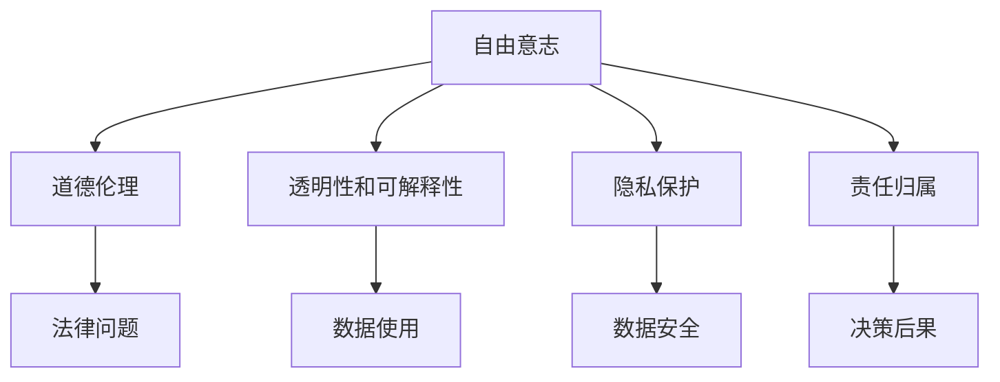

                 

# 人生而自由，却无往不在枷锁之中

## 1. 背景介绍

### 1.1 问题由来

在《忏悔录》中，让·保罗·萨特（Jean-Paul Sartre）提出了这样一个著名的论断：“人被赋予自由，却不得不承担责任。”这句话深刻地揭示了人类存在的一种悖论：一方面，每个人都生而具有自由意志，可以自主选择人生道路；另一方面，由于各种社会、文化、经济等因素的制约，人的选择往往受到束缚，难以真正实现自我。

这一现象同样适用于人工智能领域。随着深度学习、自然语言处理（NLP）等技术的不断进步，AI系统在许多领域取得了显著的进展，但与此同时，也暴露出一些问题。特别是在处理涉及人类自由意志和道德伦理的问题时，AI系统的决策和行为往往显得“不自由”，甚至在某些情况下，显得“不道德”。

### 1.2 问题核心关键点

在AI系统中，特别是NLP系统，如何处理自由意志和道德伦理的问题，是一个复杂而敏感的话题。以下是我们认为需要关注的核心问题：

- **自由意志与决策过程**：AI系统，特别是基于深度学习的NLP系统，其决策过程往往难以解释和理解，缺乏透明性和可解释性。这意味着在AI系统中，决策并非完全自由，而是受到模型结构的限制。

- **道德伦理与模型训练**：在训练和优化NLP模型时，如何避免偏见和歧视，确保模型公平、公正，是一个重要而棘手的问题。模型训练中的数据偏见，可能会在模型输出中得到放大，导致不公正的决策。

- **隐私保护与数据安全**：NLP系统中，如何保护用户隐私，确保数据安全，是一个不可忽视的问题。尤其是在涉及敏感信息的场景下，如何平衡数据利用和隐私保护，需要谨慎处理。

- **责任归属与法律问题**：在AI系统出现错误决策或不当行为时，如何确定责任归属，如何确保法律适用的公平性，是一个亟待解决的问题。

## 2. 核心概念与联系

### 2.1 核心概念概述

为了更好地理解这些问题，本节将介绍几个核心概念及其联系：

- **自由意志**：指个体自主做出决策的能力，不受外界强制或控制。在AI系统中，自由意志通常指系统根据输入信息，自主做出决策的能力。

- **道德伦理**：指个体或集体在行为选择中遵循的道德准则和伦理规范。在AI系统中，道德伦理指模型在决策时遵循的道德准则和伦理规范，确保决策符合人类的价值观和社会规范。

- **透明性和可解释性**：指系统决策过程的透明性，即能够清晰地解释决策依据和逻辑。在AI系统中，透明性和可解释性是评估模型可靠性和可信度的关键指标。

- **隐私保护**：指在数据收集、存储和处理过程中，保护用户隐私信息不被泄露或滥用的措施。在NLP系统中，隐私保护通常涉及对用户输入信息的保护，防止信息泄露。

- **责任归属**：指在AI系统出现错误决策或不当行为时，如何确定责任的归属。在法律和道德层面，责任归属是一个复杂的问题，涉及系统开发者、用户等多个主体。

这些核心概念之间的联系可以通过以下Mermaid流程图来展示：



这个流程图展示了几大核心概念之间的相互联系：

- 自由意志与道德伦理紧密相关，自由意志的决策必须遵循道德伦理准则。
- 透明性和可解释性是确保自由意志和道德伦理得以实现的重要手段。
- 隐私保护和数据安全是自由意志得以实现的前提。
- 责任归属是处理自由意志和道德伦理问题的法律保障。

这些概念共同构成了AI系统中自由意志和道德伦理问题的基本框架。通过理解这些概念及其相互关系，我们可以更好地把握AI系统的设计原则和优化方向。

## 3. 核心算法原理 & 具体操作步骤

### 3.1 算法原理概述

在NLP系统中，如何处理自由意志和道德伦理问题，可以通过以下几种算法原理来实现：

- **基于规则的系统**：通过预设一系列道德伦理规则，指导系统决策。这种方法具有较高的可解释性和透明性，但规则的设定往往需要大量的专家知识和人工工作，不易自动化。

- **基于深度学习的系统**：通过深度学习模型，自动学习数据中的道德伦理规律，并在决策时遵循这些规律。这种方法能够自动处理大量数据，但模型决策的透明性和可解释性较弱，可能存在模型偏见。

- **混合系统**：结合基于规则和基于深度学习的优势，构建混合系统，既能实现高效率，又能保证决策的透明性和可解释性。这种方法需要在规则设定和模型训练中平衡各方因素。

- **对抗训练**：通过引入对抗样本，提高模型鲁棒性，确保模型在面对恶意攻击或干扰时，仍能做出符合道德伦理的决策。

- **公平学习**：在模型训练过程中，引入公平性约束，确保模型输出在统计上对所有群体公平，避免偏见和歧视。

### 3.2 算法步骤详解

基于深度学习的NLP系统在处理自由意志和道德伦理问题时，通常包括以下几个关键步骤：

**Step 1: 数据准备**
- 收集并清洗包含道德伦理问题的NLP数据集，如自然语言对话、文本分类、情感分析等。
- 将数据集划分为训练集、验证集和测试集，确保数据集的多样性和代表性。

**Step 2: 模型选择与构建**
- 选择合适的深度学习模型，如Transformer、BERT、GPT等，作为基础模型。
- 设计合适的任务适配层，如分类器、解码器等，将基础模型输出与任务标签进行连接。
- 设定合适的超参数，如学习率、批大小、迭代轮数等。

**Step 3: 训练与优化**
- 使用训练集数据，以小批量方式进行前向传播和反向传播，优化模型参数。
- 在验证集上评估模型性能，调整超参数和模型结构，确保模型在训练集和验证集上均表现良好。
- 在测试集上评估模型性能，确保模型泛化能力。

**Step 4: 评估与部署**
- 评估模型在实际应用场景中的表现，确保模型符合道德伦理要求。
- 根据实际需求，将模型部署到生产环境中，进行实时推理和决策。

### 3.3 算法优缺点

基于深度学习的NLP系统在处理自由意志和道德伦理问题时，具有以下优点：

- **自动学习**：能够自动学习数据中的道德伦理规律，处理大规模数据。
- **高效性**：相比于基于规则的系统，深度学习系统具有较高的计算效率。
- **灵活性**：能够处理多种不同类型的NLP任务，具有广泛的适用性。

但同时，深度学习系统也存在一些缺点：

- **模型偏见**：在训练数据中存在的偏见和歧视，可能在模型输出中得到放大，导致不公平的决策。
- **决策不可解释**：深度学习模型的决策过程难以解释，缺乏透明性和可解释性。
- **对抗攻击**：深度学习模型容易受到对抗样本的干扰，可能做出错误的决策。

### 3.4 算法应用领域

基于深度学习的NLP系统在处理自由意志和道德伦理问题时，已在多个领域得到了应用，例如：

- **智能客服**：智能客服系统需要处理用户的各类需求，涉及隐私保护和责任归属问题。基于深度学习的系统可以自动学习用户的偏好和需求，提供个性化服务。

- **医疗诊断**：医疗诊断系统需要处理患者的各类疾病信息，涉及隐私保护和道德伦理问题。基于深度学习的系统可以自动学习患者的历史病历和诊断结果，提供精准的医疗建议。

- **新闻推荐**：新闻推荐系统需要处理用户的阅读偏好，涉及隐私保护和道德伦理问题。基于深度学习的系统可以自动学习用户的阅读习惯，推荐符合道德伦理标准的新闻内容。

- **金融风控**：金融风控系统需要处理客户的各类交易信息，涉及隐私保护和道德伦理问题。基于深度学习的系统可以自动学习客户的交易行为，评估其信用风险。

以上领域展示了基于深度学习的NLP系统在处理自由意志和道德伦理问题时的广泛应用，为社会各行业的数字化转型提供了新的技术路径。

## 4. 数学模型和公式 & 详细讲解 & 举例说明

### 4.1 数学模型构建

在基于深度学习的NLP系统中，处理自由意志和道德伦理问题通常涉及以下数学模型：

- **分类模型**：如逻辑回归、支持向量机、神经网络等，用于处理二分类或多分类问题。

- **序列模型**：如循环神经网络（RNN）、长短期记忆网络（LSTM）、Transformer等，用于处理序列数据，如自然语言文本。

- **生成模型**：如自回归模型、生成对抗网络（GAN）等，用于生成符合道德伦理要求的文本内容。

- **对抗模型**：如对抗训练算法（Advantage Training），用于提高模型鲁棒性，防止对抗攻击。

### 4.2 公式推导过程

以分类模型为例，我们将详细讲解其数学推导过程。

假设模型为神经网络，输入为 $x$，输出为 $y$，损失函数为 $\ell$，模型的参数为 $\theta$。在二分类任务中，模型输出 $y$ 为一个概率值，表示输入 $x$ 属于正类的概率。

损失函数 $\ell$ 可以定义为：

$$
\ell(y,\hat{y}) = -[y\log\hat{y}+(1-y)\log(1-\hat{y})]
$$

其中 $\hat{y}$ 为模型预测的概率值。

模型参数 $\theta$ 通过反向传播算法优化，其更新公式为：

$$
\theta \leftarrow \theta - \eta \nabla_{\theta}\ell(y,\hat{y})
$$

其中 $\eta$ 为学习率，$\nabla_{\theta}\ell(y,\hat{y})$ 为损失函数对参数 $\theta$ 的梯度，可以通过反向传播算法高效计算。

### 4.3 案例分析与讲解

以下以情感分析任务为例，详细讲解基于深度学习的情感分类模型：

**Step 1: 数据准备**
- 收集包含正面、负面和中性情感标注的文本数据集。
- 将数据集划分为训练集、验证集和测试集，确保数据集的多样性和代表性。

**Step 2: 模型选择与构建**
- 选择BERT作为基础模型，在预训练模型的基础上进行微调。
- 设计分类器，将BERT输出与情感标签进行连接，输出为二分类问题。

**Step 3: 训练与优化**
- 使用训练集数据，以小批量方式进行前向传播和反向传播，优化模型参数。
- 在验证集上评估模型性能，调整超参数和模型结构，确保模型在训练集和验证集上均表现良好。
- 在测试集上评估模型性能，确保模型泛化能力。

**Step 4: 评估与部署**
- 评估模型在实际应用场景中的表现，确保模型符合道德伦理要求。
- 根据实际需求，将模型部署到生产环境中，进行实时推理和决策。

## 5. 项目实践：代码实例和详细解释说明

### 5.1 开发环境搭建

在进行项目实践前，我们需要准备好开发环境。以下是使用Python进行PyTorch开发的环境配置流程：

1. 安装Anaconda：从官网下载并安装Anaconda，用于创建独立的Python环境。

2. 创建并激活虚拟环境：
```bash
conda create -n pytorch-env python=3.8 
conda activate pytorch-env
```

3. 安装PyTorch：根据CUDA版本，从官网获取对应的安装命令。例如：
```bash
conda install pytorch torchvision torchaudio cudatoolkit=11.1 -c pytorch -c conda-forge
```

4. 安装Transformers库：
```bash
pip install transformers
```

5. 安装各类工具包：
```bash
pip install numpy pandas scikit-learn matplotlib tqdm jupyter notebook ipython
```

完成上述步骤后，即可在`pytorch-env`环境中开始项目实践。

### 5.2 源代码详细实现

这里我们以情感分析任务为例，给出使用Transformers库对BERT模型进行情感分类的PyTorch代码实现。

首先，定义情感分类任务的代码：

```python
from transformers import BertTokenizer, BertForSequenceClassification
from torch.utils.data import Dataset
import torch

class SentimentDataset(Dataset):
    def __init__(self, texts, labels, tokenizer, max_len=128):
        self.texts = texts
        self.labels = labels
        self.tokenizer = tokenizer
        self.max_len = max_len
        
    def __len__(self):
        return len(self.texts)
    
    def __getitem__(self, item):
        text = self.texts[item]
        label = self.labels[item]
        
        encoding = self.tokenizer(text, return_tensors='pt', max_length=self.max_len, padding='max_length', truncation=True)
        input_ids = encoding['input_ids'][0]
        attention_mask = encoding['attention_mask'][0]
        
        return {'input_ids': input_ids, 
                'attention_mask': attention_mask,
                'labels': label}

# 标签与数字id的映射
label2id = {'negative': 0, 'positive': 1}
id2label = {v: k for k, v in label2id.items()}

# 创建dataset
tokenizer = BertTokenizer.from_pretrained('bert-base-cased')

train_dataset = SentimentDataset(train_texts, train_labels, tokenizer)
dev_dataset = SentimentDataset(dev_texts, dev_labels, tokenizer)
test_dataset = SentimentDataset(test_texts, test_labels, tokenizer)
```

然后，定义模型和优化器：

```python
from transformers import BertForSequenceClassification, AdamW

model = BertForSequenceClassification.from_pretrained('bert-base-cased', num_labels=2)

optimizer = AdamW(model.parameters(), lr=2e-5)
```

接着，定义训练和评估函数：

```python
from torch.utils.data import DataLoader
from tqdm import tqdm
from sklearn.metrics import classification_report

device = torch.device('cuda') if torch.cuda.is_available() else torch.device('cpu')
model.to(device)

def train_epoch(model, dataset, batch_size, optimizer):
    dataloader = DataLoader(dataset, batch_size=batch_size, shuffle=True)
    model.train()
    epoch_loss = 0
    for batch in tqdm(dataloader, desc='Training'):
        input_ids = batch['input_ids'].to(device)
        attention_mask = batch['attention_mask'].to(device)
        labels = batch['labels'].to(device)
        model.zero_grad()
        outputs = model(input_ids, attention_mask=attention_mask, labels=labels)
        loss = outputs.loss
        epoch_loss += loss.item()
        loss.backward()
        optimizer.step()
    return epoch_loss / len(dataloader)

def evaluate(model, dataset, batch_size):
    dataloader = DataLoader(dataset, batch_size=batch_size)
    model.eval()
    preds, labels = [], []
    with torch.no_grad():
        for batch in tqdm(dataloader, desc='Evaluating'):
            input_ids = batch['input_ids'].to(device)
            attention_mask = batch['attention_mask'].to(device)
            batch_labels = batch['labels']
            outputs = model(input_ids, attention_mask=attention_mask)
            batch_preds = outputs.logits.argmax(dim=1).to('cpu').tolist()
            batch_labels = batch_labels.to('cpu').tolist()
            for pred, label in zip(batch_preds, batch_labels):
                preds.append(id2label[pred])
                labels.append(label)
                
    print(classification_report(labels, preds))
```

最后，启动训练流程并在测试集上评估：

```python
epochs = 5
batch_size = 16

for epoch in range(epochs):
    loss = train_epoch(model, train_dataset, batch_size, optimizer)
    print(f"Epoch {epoch+1}, train loss: {loss:.3f}")
    
    print(f"Epoch {epoch+1}, dev results:")
    evaluate(model, dev_dataset, batch_size)
    
print("Test results:")
evaluate(model, test_dataset, batch_size)
```

以上就是使用PyTorch对BERT进行情感分析任务分类的完整代码实现。可以看到，得益于Transformers库的强大封装，我们可以用相对简洁的代码完成BERT模型的加载和微调。

### 5.3 代码解读与分析

让我们再详细解读一下关键代码的实现细节：

**SentimentDataset类**：
- `__init__`方法：初始化文本、标签、分词器等关键组件。
- `__len__`方法：返回数据集的样本数量。
- `__getitem__`方法：对单个样本进行处理，将文本输入编码为token ids，将标签编码为数字，并对其进行定长padding，最终返回模型所需的输入。

**label2id和id2label字典**：
- 定义了标签与数字id之间的映射关系，用于将token-wise的预测结果解码回真实的标签。

**训练和评估函数**：
- 使用PyTorch的DataLoader对数据集进行批次化加载，供模型训练和推理使用。
- 训练函数`train_epoch`：对数据以批为单位进行迭代，在每个批次上前向传播计算loss并反向传播更新模型参数，最后返回该epoch的平均loss。
- 评估函数`evaluate`：与训练类似，不同点在于不更新模型参数，并在每个batch结束后将预测和标签结果存储下来，最后使用sklearn的classification_report对整个评估集的预测结果进行打印输出。

**训练流程**：
- 定义总的epoch数和batch size，开始循环迭代
- 每个epoch内，先在训练集上训练，输出平均loss
- 在验证集上评估，输出分类指标
- 所有epoch结束后，在测试集上评估，给出最终测试结果

可以看到，PyTorch配合Transformers库使得BERT微调的代码实现变得简洁高效。开发者可以将更多精力放在数据处理、模型改进等高层逻辑上，而不必过多关注底层的实现细节。

当然，工业级的系统实现还需考虑更多因素，如模型的保存和部署、超参数的自动搜索、更灵活的任务适配层等。但核心的微调范式基本与此类似。

## 6. 实际应用场景

### 6.1 智能客服系统

基于大语言模型微调的对话技术，可以广泛应用于智能客服系统的构建。传统客服往往需要配备大量人力，高峰期响应缓慢，且一致性和专业性难以保证。而使用微调后的对话模型，可以7x24小时不间断服务，快速响应客户咨询，用自然流畅的语言解答各类常见问题。

在技术实现上，可以收集企业内部的历史客服对话记录，将问题和最佳答复构建成监督数据，在此基础上对预训练对话模型进行微调。微调后的对话模型能够自动理解用户意图，匹配最合适的答案模板进行回复。对于客户提出的新问题，还可以接入检索系统实时搜索相关内容，动态组织生成回答。如此构建的智能客服系统，能大幅提升客户咨询体验和问题解决效率。

### 6.2 金融舆情监测

金融机构需要实时监测市场舆论动向，以便及时应对负面信息传播，规避金融风险。传统的人工监测方式成本高、效率低，难以应对网络时代海量信息爆发的挑战。基于大语言模型微调的文本分类和情感分析技术，为金融舆情监测提供了新的解决方案。

具体而言，可以收集金融领域相关的新闻、报道、评论等文本数据，并对其进行主题标注和情感标注。在此基础上对预训练语言模型进行微调，使其能够自动判断文本属于何种主题，情感倾向是正面、中性还是负面。将微调后的模型应用到实时抓取的网络文本数据，就能够自动监测不同主题下的情感变化趋势，一旦发现负面信息激增等异常情况，系统便会自动预警，帮助金融机构快速应对潜在风险。

### 6.3 个性化推荐系统

当前的推荐系统往往只依赖用户的历史行为数据进行物品推荐，无法深入理解用户的真实兴趣偏好。基于大语言模型微调技术，个性化推荐系统可以更好地挖掘用户行为背后的语义信息，从而提供更精准、多样的推荐内容。

在实践中，可以收集用户浏览、点击、评论、分享等行为数据，提取和用户交互的物品标题、描述、标签等文本内容。将文本内容作为模型输入，用户的后续行为（如是否点击、购买等）作为监督信号，在此基础上微调预训练语言模型。微调后的模型能够从文本内容中准确把握用户的兴趣点。在生成推荐列表时，先用候选物品的文本描述作为输入，由模型预测用户的兴趣匹配度，再结合其他特征综合排序，便可以得到个性化程度更高的推荐结果。

### 6.4 未来应用展望

随着大语言模型微调技术的发展，基于微调范式将在更多领域得到应用，为传统行业带来变革性影响。

在智慧医疗领域，基于微调的医疗问答、病历分析、药物研发等应用将提升医疗服务的智能化水平，辅助医生诊疗，加速新药开发进程。

在智能教育领域，微调技术可应用于作业批改、学情分析、知识推荐等方面，因材施教，促进教育公平，提高教学质量。

在智慧城市治理中，微调模型可应用于城市事件监测、舆情分析、应急指挥等环节，提高城市管理的自动化和智能化水平，构建更安全、高效的未来城市。

此外，在企业生产、社会治理、文娱传媒等众多领域，基于大模型微调的人工智能应用也将不断涌现，为经济社会发展注入新的动力。相信随着技术的日益成熟，微调方法将成为人工智能落地应用的重要范式，推动人工智能技术向更广阔的领域加速渗透。

## 7. 工具和资源推荐

### 7.1 学习资源推荐

为了帮助开发者系统掌握大语言模型微调的理论基础和实践技巧，这里推荐一些优质的学习资源：

1. 《Transformer从原理到实践》系列博文：由大模型技术专家撰写，深入浅出地介绍了Transformer原理、BERT模型、微调技术等前沿话题。

2. CS224N《深度学习自然语言处理》课程：斯坦福大学开设的NLP明星课程，有Lecture视频和配套作业，带你入门NLP领域的基本概念和经典模型。

3. 《Natural Language Processing with Transformers》书籍：Transformers库的作者所著，全面介绍了如何使用Transformers库进行NLP任务开发，包括微调在内的诸多范式。

4. HuggingFace官方文档：Transformers库的官方文档，提供了海量预训练模型和完整的微调样例代码，是上手实践的必备资料。

5. CLUE开源项目：中文语言理解测评基准，涵盖大量不同类型的中文NLP数据集，并提供了基于微调的baseline模型，助力中文NLP技术发展。

通过对这些资源的学习实践，相信你一定能够快速掌握大语言模型微调的精髓，并用于解决实际的NLP问题。
###  7.2 开发工具推荐

高效的开发离不开优秀的工具支持。以下是几款用于大语言模型微调开发的常用工具：

1. PyTorch：基于Python的开源深度学习框架，灵活动态的计算图，适合快速迭代研究。大部分预训练语言模型都有PyTorch版本的实现。

2. TensorFlow：由Google主导开发的开源深度学习框架，生产部署方便，适合大规模工程应用。同样有丰富的预训练语言模型资源。

3. Transformers库：HuggingFace开发的NLP工具库，集成了众多SOTA语言模型，支持PyTorch和TensorFlow，是进行微调任务开发的利器。

4. Weights & Biases：模型训练的实验跟踪工具，可以记录和可视化模型训练过程中的各项指标，方便对比和调优。与主流深度学习框架无缝集成。

5. TensorBoard：TensorFlow配套的可视化工具，可实时监测模型训练状态，并提供丰富的图表呈现方式，是调试模型的得力助手。

6. Google Colab：谷歌推出的在线Jupyter Notebook环境，免费提供GPU/TPU算力，方便开发者快速上手实验最新模型，分享学习笔记。

合理利用这些工具，可以显著提升大语言模型微调任务的开发效率，加快创新迭代的步伐。

### 7.3 相关论文推荐

大语言模型和微调技术的发展源于学界的持续研究。以下是几篇奠基性的相关论文，推荐阅读：

1. Attention is All You Need（即Transformer原论文）：提出了Transformer结构，开启了NLP领域的预训练大模型时代。

2. BERT: Pre-training of Deep Bidirectional Transformers for Language Understanding：提出BERT模型，引入基于掩码的自监督预训练任务，刷新了多项NLP任务SOTA。

3. Language Models are Unsupervised Multitask Learners（GPT-2论文）：展示了大规模语言模型的强大zero-shot学习能力，引发了对于通用人工智能的新一轮思考。

4. Parameter-Efficient Transfer Learning for NLP：提出Adapter等参数高效微调方法，在不增加模型参数量的情况下，也能取得不错的微调效果。

5. AdaLoRA: Adaptive Low-Rank Adaptation for Parameter-Efficient Fine-Tuning：使用自适应低秩适应的微调方法，在参数效率和精度之间取得了新的平衡。

6. Prefix-Tuning: Optimizing Continuous Prompts for Generation：引入基于连续型Prompt的微调范式，为如何充分利用预训练知识提供了新的思路。

这些论文代表了大语言模型微调技术的发展脉络。通过学习这些前沿成果，可以帮助研究者把握学科前进方向，激发更多的创新灵感。

## 8. 总结：未来发展趋势与挑战

### 8.1 总结

本文对基于深度学习的NLP系统中处理自由意志和道德伦理问题的方法进行了全面系统的介绍。首先阐述了自由意志和道德伦理问题的背景和意义，明确了微调在处理这些问题时的独特价值。其次，从原理到实践，详细讲解了微调数学模型的构建和实现步骤，给出了微调任务开发的完整代码实例。同时，本文还广泛探讨了微调方法在多个行业领域的应用前景，展示了微调范式的巨大潜力。此外，本文精选了微调技术的各类学习资源，力求为读者提供全方位的技术指引。

通过本文的系统梳理，可以看到，基于深度学习的NLP系统在处理自由意志和道德伦理问题时，具有广泛的应用前景。其自动学习、高效性和灵活性等优势，使其在实际应用中具有显著的竞争力。未来，伴随技术的不断发展，NLP系统的自由意志和道德伦理问题处理能力将进一步提升，为各行各业带来更大的价值。

### 8.2 未来发展趋势

展望未来，NLP系统中处理自由意志和道德伦理问题的方法将呈现以下几个发展趋势：

1. **模型复杂度提高**：随着硬件算力的提升，模型的复杂度将不断提高，能够处理更复杂的任务和场景。超大型的语言模型和大模型微调技术，将为处理自由意志和道德伦理问题提供更强大的工具。

2. **多模态融合**：未来的系统将更加注重多模态信息的融合，结合文本、图像、语音等多种信息源，提升决策的全面性和准确性。

3. **实时性增强**：基于深度学习的系统将更加注重实时性，通过优化模型结构和计算图，实现高效推理，满足快速决策的需求。

4. **可解释性提升**：未来的系统将更加注重可解释性，通过引入因果分析和博弈论等理论，提升模型的决策透明度，确保决策过程的公正性和合理性。

5. **隐私保护加强**：未来的系统将更加注重隐私保护，通过差分隐私、联邦学习等技术，确保数据安全和用户隐私不被泄露。

6. **伦理审查机制**：未来的系统将建立伦理审查机制，确保模型在决策过程中遵循伦理规范，避免有害行为和歧视现象。

这些趋势凸显了NLP系统中处理自由意志和道德伦理问题的方法的发展方向。这些方向的探索发展，必将进一步提升NLP系统的性能和应用范围，为社会各行业的数字化转型提供新的技术路径。

### 8.3 面临的挑战

尽管NLP系统中处理自由意志和道德伦理问题的方法已经取得了瞩目成就，但在迈向更加智能化、普适化应用的过程中，仍面临诸多挑战：

1. **模型偏见**：在训练数据中存在的偏见和歧视，可能在模型输出中得到放大，导致不公平的决策。如何在模型训练过程中消除偏见，提升模型的公平性，是一个重要而棘手的问题。

2. **决策透明性不足**：深度学习模型的决策过程难以解释，缺乏透明性和可解释性。如何提高模型的透明性，确保决策过程的公正性和合理性，还需要更多理论和实践的积累。

3. **数据隐私保护**：在处理敏感数据时，如何保护用户隐私，确保数据安全，是一个不可忽视的问题。尤其是在医疗、金融等高风险领域，数据的隐私保护尤为重要。

4. **法律适应性**：在AI系统出现错误决策或不当行为时，如何确定责任归属，确保法律适用的公平性，是一个亟待解决的问题。如何在法律层面确保责任的明确性和可执行性，还需要更多的探索和实践。

5. **伦理规范的动态更新**：随着社会价值观和伦理规范的变化，如何动态更新模型的决策标准，确保模型符合最新的伦理规范，是一个需要持续关注的问题。

6. **对抗攻击**：深度学习模型容易受到对抗样本的干扰，可能做出错误的决策。如何在模型设计和训练过程中增强模型的鲁棒性，防止对抗攻击，还需要更多理论和实践的积累。

这些挑战凸显了NLP系统中处理自由意志和道德伦理问题的方法的复杂性和敏感性。只有不断攻克这些挑战，才能真正实现NLP系统的全面智能化，为社会各行业带来更大的价值。

### 8.4 研究展望

未来，NLP系统中处理自由意志和道德伦理问题的方法需要在以下几个方面寻求新的突破：

1. **公平学习技术**：开发更加高效的公平学习算法，确保模型在各类群体中表现公平，消除数据偏见。

2. **可解释性技术**：引入因果分析和博弈论等理论，提升模型的透明性和可解释性，确保决策过程的公正性和合理性。

3. **隐私保护技术**：开发差分隐私、联邦学习等隐私保护技术，确保数据安全和用户隐私不被泄露。

4. **伦理审查机制**：建立伦理审查机制，确保模型在决策过程中遵循伦理规范，避免有害行为和歧视现象。

5. **多模态融合技术**：开发多模态信息融合算法，提升决策的全面性和准确性。

6. **对抗攻击防御技术**：开发对抗攻击防御算法，增强模型的鲁棒性，防止对抗攻击。

这些研究方向将推动NLP系统向更加智能化、普适化、透明化和安全化的方向发展，为社会各行业的数字化转型提供新的技术路径。未来，伴随技术的不断发展，NLP系统在处理自由意志和道德伦理问题方面将取得更大的突破，为人类社会的进步贡献更多的力量。

## 9. 附录：常见问题与解答

**Q1：大语言模型微调是否适用于所有NLP任务？**

A: 大语言模型微调在大多数NLP任务上都能取得不错的效果，特别是对于数据量较小的任务。但对于一些特定领域的任务，如医学、法律等，仅仅依靠通用语料预训练的模型可能难以很好地适应。此时需要在特定领域语料上进一步预训练，再进行微调，才能获得理想效果。此外，对于一些需要时效性、个性化很强的任务，如对话、推荐等，微调方法也需要针对性的改进优化。

**Q2：微调过程中如何选择合适的学习率？**

A: 微调的学习率一般要比预训练时小1-2个数量级，如果使用过大的学习率，容易破坏预训练权重，导致过拟合。一般建议从1e-5开始调参，逐步减小学习率，直至收敛。也可以使用warmup策略，在开始阶段使用较小的学习率，再逐渐过渡到预设值。需要注意的是，不同的优化器(如AdamW、Adafactor等)以及不同的学习率调度策略，可能需要设置不同的学习率阈值。

**Q3：采用大模型微调时会面临哪些资源瓶颈？**

A: 目前主流的预训练大模型动辄以亿计的参数规模，对算力、内存、存储都提出了很高的要求。GPU/TPU等高性能设备是必不可少的，但即便如此，超大批次的训练和推理也可能遇到显存不足的问题。因此需要采用一些资源优化技术，如梯度积累、混合精度训练、模型并行等，来突破硬件瓶颈。同时，模型的存储和读取也可能占用大量时间和空间，需要采用模型压缩、稀疏化存储等方法进行优化。

**Q4：如何缓解微调过程中的过拟合问题？**

A: 过拟合是微调面临的主要挑战，尤其是在标注数据不足的情况下。常见的缓解策略包括：

1. 数据增强：通过回译、近义替换等方式扩充训练集
2. 正则化：使用L2正则、Dropout、Early Stopping等避免过拟合
3. 对抗训练：引入对抗样本，提高模型鲁棒性
4. 参数高效微调：只调整少量参数(如Adapter、Prefix等)，减小过拟合风险
5. 多模型集成：训练多个微调模型，取平均输出，抑制过拟合

这些策略往往需要根据具体任务和数据特点进行灵活组合。只有在数据、模型、训练、推理等各环节进行全面优化，才能最大限度地发挥大模型微调的威力。

**Q5：微调模型在落地部署时需要注意哪些问题？**

A: 将微调模型转化为实际应用，还需要考虑以下因素：

1. 模型裁剪：去除不必要的层和参数，减小模型尺寸，加快推理速度
2. 量化加速：将浮点模型转为定点模型，压缩存储空间，提高计算效率
3. 服务化封装：将模型封装为标准化服务接口，便于集成调用
4. 弹性伸缩：根据请求流量动态调整资源配置，平衡服务质量和成本
5. 监控告警：实时采集系统指标，设置异常告警阈值，确保服务稳定性
6. 安全防护：采用访问鉴权、数据脱敏等措施，保障数据和模型安全

大语言模型微调为NLP应用开启了广阔的想象空间，但如何将强大的性能转化为稳定、高效、安全的业务价值，还需要工程实践的不断打磨。唯有从数据、算法、工程、业务等多个维度协同发力，才能真正实现人工智能技术在垂直行业的规模化落地。总之，微调需要开发者根据具体任务，不断迭代和优化模型、数据和算法，方能得到理想的效果。

---

作者：禅与计算机程序设计艺术 / Zen and the Art of Computer Programming

