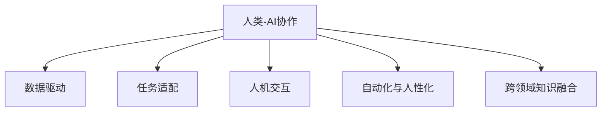

                 

# 人类-AI协作：为人类服务的设计

## 1. 背景介绍

在科技日益发达的今天，人工智能（AI）技术在各个领域的应用已无处不在。从医疗、教育到金融、制造，AI正在改变我们的生活方式，提升效率，创造价值。但与此同时，AI技术的迅猛发展也带来了一些新的挑战，如自动化替代人类工作、数据隐私保护、AI伦理问题等。

人类-AI协作（Human-AI Collaboration）作为一种新兴的AI应用模式，致力于将AI技术与人类的智慧和经验相结合，实现人与机器的协同工作，更好地服务于人类社会。本文将从多个方面探讨人类-AI协作的设计理念、核心算法、应用场景和未来发展趋势，以期为AI技术的应用提供有益的参考。

## 2. 核心概念与联系

### 2.1 核心概念概述

为更好地理解人类-AI协作的设计理念，本节将介绍几个关键概念及其相互关系：

- **人类-AI协作**：指人类与AI系统合作完成复杂任务，利用AI的计算能力和自动化技术，发挥人类的创造力和判断力，实现“人机共融”的工作模式。
- **数据驱动**：AI系统通过大量的数据训练，学习任务模型，进行决策和预测。数据的质量和多样性直接影响AI系统的性能和应用效果。
- **任务适配**：针对具体任务，对AI系统进行参数微调、模型融合等优化操作，使其能够高效、准确地完成任务。
- **人机交互**：AI系统通过接口与人类进行信息交换，实现协同工作。高效的交互设计是实现人机协作的关键。
- **自动化与人性化**：在协作过程中，既要利用AI的高效自动处理能力，又要考虑到人的情感需求和创造性思维，实现自动化的同时兼具人性化。
- **跨领域知识融合**：AI系统需要整合不同领域的知识和经验，如医学、法律、工程等，提升跨领域的理解和应用能力。

这些概念共同构成了人类-AI协作的基石，通过它们的有机结合，AI系统能够更好地服务于人类社会。

### 2.2 核心概念原理和架构的 Mermaid 流程图



这个流程图展示了人类-AI协作的核心组成和它们之间的关系。数据驱动提供了AI系统的学习和决策基础，任务适配和跨领域知识融合提升了AI系统的适应性和泛化能力，人机交互和自动化与人性化则确保了协作的便捷性和自然性。

## 3. 核心算法原理 & 具体操作步骤

### 3.1 算法原理概述

人类-AI协作的核心算法包括数据预处理、模型训练、参数微调、模型融合等步骤。这些步骤的实现依赖于机器学习和深度学习的基本原理，如监督学习、半监督学习、自监督学习、强化学习等。

在数据预处理阶段，需要对原始数据进行清洗、标准化和归一化处理，以确保数据的质量和一致性。然后，将数据分为训练集、验证集和测试集，用于模型的训练和评估。

在模型训练阶段，选择合适的模型架构，如卷积神经网络（CNN）、循环神经网络（RNN）、Transformer等，通过反向传播算法更新模型参数，最小化损失函数，提升模型性能。

在参数微调阶段，针对具体任务对模型参数进行调整，如调整学习率、添加正则化项、使用不同的优化器等，以提升模型在特定任务上的表现。

在模型融合阶段，将多个模型的输出进行加权组合或投票，提升整体性能和鲁棒性。

### 3.2 算法步骤详解

#### 3.2.1 数据预处理

数据预处理是AI系统设计的基础，包括以下几个步骤：

1. **数据收集**：从多个数据源收集原始数据，如数据库、传感器、互联网等。
2. **数据清洗**：去除重复、缺失、错误的数据，并进行异常值处理。
3. **数据标准化**：对数值型数据进行归一化处理，对文本数据进行分词、去除停用词等操作。
4. **特征工程**：提取和构造有意义的特征，如时间戳、地理位置、情感倾向等。
5. **数据分割**：将数据集划分为训练集、验证集和测试集，通常比例为8:1:1。

#### 3.2.2 模型训练

模型训练是AI系统设计的关键步骤，包括以下几个步骤：

1. **模型选择**：根据任务类型选择适合的模型架构，如卷积神经网络（CNN）、循环神经网络（RNN）、Transformer等。
2. **损失函数选择**：根据任务类型选择适合的损失函数，如交叉熵、均方误差等。
3. **优化器选择**：选择合适的优化器，如随机梯度下降（SGD）、Adam、Adagrad等。
4. **超参数调优**：调整学习率、批大小、迭代次数等超参数，以提升模型性能。
5. **模型训练**：使用训练集对模型进行迭代训练，最小化损失函数。

#### 3.2.3 参数微调

参数微调是提升模型特定任务性能的重要步骤，包括以下几个步骤：

1. **任务适配层设计**：根据任务类型设计合适的输出层和损失函数。
2. **微调超参数设置**：选择合适的学习率、正则化系数等超参数。
3. **模型微调**：使用微调数据对模型进行迭代训练，最小化损失函数。
4. **模型评估**：在验证集上评估模型性能，调整超参数。
5. **模型测试**：在测试集上评估模型性能，对比微调前后的表现。

#### 3.2.4 模型融合

模型融合是提升整体性能和鲁棒性的重要步骤，包括以下几个步骤：

1. **模型选择**：选择多个性能较好的模型。
2. **模型输出融合**：将多个模型的输出进行加权组合或投票，提升整体性能。
3. **融合参数选择**：选择适合的融合参数，如融合权重、投票策略等。
4. **模型验证**：在验证集上评估融合模型的性能，调整融合参数。
5. **模型测试**：在测试集上评估融合模型的性能，对比单独模型的表现。

### 3.3 算法优缺点

人类-AI协作的核心算法具有以下优点：

1. **高效**：通过数据驱动和自动化处理，AI系统可以高效地完成任务。
2. **灵活**：通过任务适配和模型融合，AI系统可以灵活应对各种任务。
3. **泛化能力强**：通过跨领域知识融合，AI系统具备较强的泛化能力。
4. **人机协同**：通过人机交互和自动化与人性化设计，AI系统可以更好地服务于人类社会。

但这些算法也存在一些缺点：

1. **数据依赖性强**：AI系统需要大量高质量的数据进行训练，数据获取成本高。
2. **模型复杂度高**：AI系统需要复杂的模型结构和超参数调优，开发成本高。
3. **解释性不足**：AI系统的决策过程往往缺乏可解释性，难以进行调试和优化。
4. **偏见和伦理问题**：AI系统可能学习到数据中的偏见和有害信息，产生误导性输出。

## 4. 数学模型和公式 & 详细讲解 & 举例说明

### 4.1 数学模型构建

在本节中，我们将使用数学语言对人类-AI协作的设计理念进行更加严格的刻画。

假设有一个二分类任务，数据集为 $D=\{(x_i, y_i)\}_{i=1}^N$，其中 $x_i \in \mathcal{X}$ 为输入， $y_i \in \{0, 1\}$ 为输出。

定义模型 $M_{\theta}(x)$，其中 $\theta$ 为模型参数，为输入 $x$ 到输出的映射。

假设模型的损失函数为交叉熵损失函数，则经验风险为：

$$
\mathcal{L}(\theta) = -\frac{1}{N} \sum_{i=1}^N \log M_{\theta}(x_i)y_i + \log (1-M_{\theta}(x_i))(1-y_i)
$$

在模型训练阶段，通过梯度下降算法更新模型参数，最小化损失函数：

$$
\theta \leftarrow \theta - \eta \nabla_{\theta}\mathcal{L}(\theta)
$$

其中 $\eta$ 为学习率，$\nabla_{\theta}\mathcal{L}(\theta)$ 为损失函数对参数 $\theta$ 的梯度，可以通过反向传播算法计算。

### 4.2 公式推导过程

在二分类任务中，模型 $M_{\theta}(x)$ 的输出为 $y$ 的概率预测，即：

$$
y \sim \text{Bernoulli}(M_{\theta}(x))
$$

其中 Bernoulli 分布表示输出 $y$ 的概率。

因此，交叉熵损失函数可以表示为：

$$
\mathcal{L}(\theta) = -\frac{1}{N} \sum_{i=1}^N \log \frac{e^{y_i \log M_{\theta}(x_i)}}{\sum_{j=0}^1 e^{y_j \log M_{\theta}(x_i)}}
$$

该损失函数可以进一步简化为：

$$
\mathcal{L}(\theta) = -\frac{1}{N} \sum_{i=1}^N [y_i \log M_{\theta}(x_i) + (1-y_i) \log (1-M_{\theta}(x_i))]
$$

### 4.3 案例分析与讲解

以医疗影像分类为例，分析人类-AI协作的应用场景。

#### 4.3.1 数据预处理

- **数据收集**：收集医疗影像数据，如CT、MRI、X光等。
- **数据清洗**：去除重复、缺失、错误的数据，并进行异常值处理。
- **数据标准化**：对影像数据进行归一化处理。
- **特征工程**：提取和构造有意义的特征，如影像尺寸、灰度值、纹理特征等。
- **数据分割**：将数据集划分为训练集、验证集和测试集。

#### 4.3.2 模型训练

- **模型选择**：选择适合的深度学习模型，如卷积神经网络（CNN）。
- **损失函数选择**：选择交叉熵损失函数。
- **优化器选择**：选择Adam优化器。
- **超参数调优**：调整学习率、批大小、迭代次数等超参数。
- **模型训练**：使用训练集对模型进行迭代训练，最小化损失函数。

#### 4.3.3 参数微调

- **任务适配层设计**：根据分类任务设计输出层和损失函数。
- **微调超参数设置**：选择合适的学习率、正则化系数等超参数。
- **模型微调**：使用微调数据对模型进行迭代训练，最小化损失函数。
- **模型评估**：在验证集上评估模型性能，调整超参数。
- **模型测试**：在测试集上评估模型性能，对比微调前后的表现。

#### 4.3.4 模型融合

- **模型选择**：选择多个性能较好的模型。
- **模型输出融合**：将多个模型的输出进行加权组合或投票。
- **融合参数选择**：选择适合的融合参数，如融合权重、投票策略等。
- **模型验证**：在验证集上评估融合模型的性能，调整融合参数。
- **模型测试**：在测试集上评估融合模型的性能，对比单独模型的表现。

## 5. 项目实践：代码实例和详细解释说明

### 5.1 开发环境搭建

在进行人类-AI协作的实践前，我们需要准备好开发环境。以下是使用Python进行PyTorch开发的环境配置流程：

1. 安装Anaconda：从官网下载并安装Anaconda，用于创建独立的Python环境。

2. 创建并激活虚拟环境：
```bash
conda create -n ai-env python=3.8 
conda activate ai-env
```

3. 安装PyTorch：根据CUDA版本，从官网获取对应的安装命令。例如：
```bash
conda install pytorch torchvision torchaudio cudatoolkit=11.1 -c pytorch -c conda-forge
```

4. 安装TensorBoard：
```bash
pip install tensorboard
```

5. 安装TensorFlow：
```bash
pip install tensorflow
```

完成上述步骤后，即可在`ai-env`环境中开始项目实践。

### 5.2 源代码详细实现

下面我们以医疗影像分类任务为例，给出使用PyTorch和TensorFlow进行人类-AI协作的代码实现。

首先，定义模型和训练函数：

```python
import torch
import torch.nn as nn
import torch.optim as optim
from torch.utils.data import DataLoader

class MedicalImageClassifier(nn.Module):
    def __init__(self, input_size):
        super(MedicalImageClassifier, self).__init__()
        self.conv1 = nn.Conv2d(1, 32, kernel_size=3, stride=1, padding=1)
        self.pool = nn.MaxPool2d(kernel_size=2, stride=2)
        self.fc1 = nn.Linear(32*32*32, 128)
        self.fc2 = nn.Linear(128, 2)
    
    def forward(self, x):
        x = self.pool(nn.functional.relu(self.conv1(x)))
        x = x.view(-1, 32*32*32)
        x = nn.functional.relu(self.fc1(x))
        x = self.fc2(x)
        return x

def train(model, device, train_loader, optimizer, epoch):
    model.train()
    for batch_idx, (data, target) in enumerate(train_loader):
        data, target = data.to(device), target.to(device)
        optimizer.zero_grad()
        output = model(data)
        loss = nn.functional.cross_entropy(output, target)
        loss.backward()
        optimizer.step()
        if batch_idx % 10 == 0:
            print('Train Epoch: {} [{}/{} ({:.0f}%)]\tLoss: {:.6f}'.format(
                epoch, batch_idx * len(data), len(train_loader.dataset),
                100. * batch_idx / len(train_loader), loss.item()))
```

然后，定义测试函数：

```python
def test(model, device, test_loader):
    model.eval()
    test_loss = 0
    correct = 0
    with torch.no_grad():
        for data, target in test_loader:
            data, target = data.to(device), target.to(device)
            output = model(data)
            test_loss += nn.functional.cross_entropy(output, target, reduction='sum').item()
            pred = output.argmax(dim=1, keepdim=True)
            correct += pred.eq(target.view_as(pred)).sum().item()
    test_loss /= len(test_loader.dataset)
    print('\nTest set: Average loss: {:.4f}, Accuracy: {}/{} ({:.0f}%)\n'.format(
        test_loss, correct, len(test_loader.dataset),
        100. * correct / len(test_loader.dataset)))
```

最后，启动训练流程并在测试集上评估：

```python
device = torch.device('cuda' if torch.cuda.is_available() else 'cpu')

# 定义模型
model = MedicalImageClassifier(input_size)

# 定义训练数据和测试数据
train_dataset = # ...
test_dataset = # ...

# 定义训练器和测试器
optimizer = optim.SGD(model.parameters(), lr=0.01, momentum=0.5)
train_loader = DataLoader(train_dataset, batch_size=64, shuffle=True)
test_loader = DataLoader(test_dataset, batch_size=64, shuffle=False)

# 训练模型
for epoch in range(10):
    train(model, device, train_loader, optimizer, epoch)
    test(model, device, test_loader)
```

以上就是使用PyTorch和TensorFlow进行医疗影像分类任务人类-AI协作的完整代码实现。可以看到，借助深度学习框架，人类-AI协作的实现变得简洁高效。

### 5.3 代码解读与分析

让我们再详细解读一下关键代码的实现细节：

**MedicalImageClassifier类**：
- `__init__`方法：定义模型的各层结构，包括卷积层、池化层、全连接层等。
- `forward`方法：定义前向传播过程，通过各层计算输出。

**train函数**：
- 在训练过程中，模型进入训练模式，逐批次加载数据。
- 前向传播计算模型输出，计算损失函数，反向传播更新模型参数。
- 打印训练过程中的损失值和进度。

**test函数**：
- 在测试过程中，模型进入评估模式，逐批次加载数据。
- 前向传播计算模型输出，计算测试集上的损失值和准确率。
- 打印测试结果。

**训练流程**：
- 定义总的epoch数，开始循环迭代
- 每个epoch内，在训练集上训练，输出训练集上的损失值和进度
- 在测试集上评估，输出测试集上的损失值和准确率

可以看到，借助深度学习框架，人类-AI协作的代码实现变得简洁高效。开发者可以将更多精力放在数据处理、模型改进等高层逻辑上，而不必过多关注底层的实现细节。

当然，工业级的系统实现还需考虑更多因素，如模型的保存和部署、超参数的自动搜索、更灵活的任务适配层等。但核心的协作范式基本与此类似。

## 6. 实际应用场景

### 6.1 智能医疗

在智能医疗领域，人类-AI协作可以实现医疗影像分类、疾病诊断、个性化治疗等任务。医生可以通过AI系统进行初步诊断，提高诊断准确率和效率，同时减轻工作负担。患者可以通过AI系统进行自我监测和初步诊断，及时发现健康问题，缩短就医时间。

例如，使用医疗影像分类任务，AI系统可以自动识别CT影像中的病灶区域，辅助医生进行精准诊断。在个性化治疗方面，AI系统可以分析患者的基因信息和病历数据，推荐最适合的治疗方案，提高治疗效果。

### 6.2 金融风控

在金融风控领域，人类-AI协作可以实现风险评估、欺诈检测、信用评分等任务。金融机构可以通过AI系统进行风险评估，识别潜在风险客户，降低贷款损失率。在欺诈检测方面，AI系统可以分析交易数据和行为特征，识别异常交易行为，防止欺诈发生。

例如，使用信用评分任务，AI系统可以综合分析客户的个人信息、行为数据和信用记录，生成信用评分，辅助金融机构进行贷款审批。在风险评估方面，AI系统可以实时分析交易数据，识别高风险交易，及时预警，防止金融风险。

### 6.3 智能制造

在智能制造领域，人类-AI协作可以实现生产调度、质量控制、设备维护等任务。制造业可以通过AI系统进行生产调度，优化生产流程，提高生产效率。在质量控制方面，AI系统可以实时监测产品质量，识别缺陷，提高产品质量。在设备维护方面，AI系统可以分析设备运行数据，预测设备故障，提前进行维护，降低设备停机率。

例如，使用生产调度任务，AI系统可以综合分析生产数据和订单信息，优化生产计划，提高生产效率。在质量控制方面，AI系统可以通过图像识别技术，实时检测产品缺陷，及时进行返修，提高产品质量。在设备维护方面，AI系统可以分析设备运行数据，预测设备故障，提前进行维护，减少设备停机时间。

### 6.4 未来应用展望

随着AI技术的不断发展，人类-AI协作的应用领域将不断拓展，为各行各业带来深远的影响。

在智慧医疗领域，AI系统可以实现精准诊断、个性化治疗、智能健康管理等，提升医疗服务水平。在智能金融领域，AI系统可以实现风险评估、欺诈检测、信用评分等，提高金融服务的效率和安全性。在智能制造领域，AI系统可以实现生产调度、质量控制、设备维护等，提高生产效率和产品质量。

未来，人类-AI协作将更加广泛地应用于智慧城市、智能交通、智能农业、智能教育等多个领域，实现人机协同的工作模式，推动社会全面进步。

## 7. 工具和资源推荐

### 7.1 学习资源推荐

为了帮助开发者系统掌握人类-AI协作的理论基础和实践技巧，这里推荐一些优质的学习资源：

1. 《深度学习》（Ian Goodfellow著）：全面介绍了深度学习的基本原理和算法，是理解人类-AI协作的重要基础。

2. 《自然语言处理综论》（Daniel Jurafsky & James H. Martin著）：深入浅出地介绍了自然语言处理的基本概念和前沿技术，对人类-AI协作有很强的指导意义。

3. 《人工智能：一种现代方法》（Stuart Russell & Peter Norvig著）：全面介绍了人工智能的基本原理和应用，是理解人类-AI协作的必备参考资料。

4. 《机器学习实战》（Peter Harrington著）：通过丰富的实例和项目，帮助读者掌握机器学习和深度学习的实战技巧。

5. Coursera《深度学习专项课程》：由吴恩达教授主讲的深度学习课程，涵盖深度学习的基本原理和应用，适合初学者系统学习。

通过对这些资源的学习实践，相信你一定能够快速掌握人类-AI协作的精髓，并用于解决实际的AI应用问题。

### 7.2 开发工具推荐

高效的开发离不开优秀的工具支持。以下是几款用于人类-AI协作开发的常用工具：

1. PyTorch：基于Python的开源深度学习框架，灵活动态的计算图，适合快速迭代研究。

2. TensorFlow：由Google主导开发的开源深度学习框架，生产部署方便，适合大规模工程应用。

3. TensorBoard：TensorFlow配套的可视化工具，可实时监测模型训练状态，并提供丰富的图表呈现方式。

4. Weights & Biases：模型训练的实验跟踪工具，可以记录和可视化模型训练过程中的各项指标。

5. Jupyter Notebook：基于Web的交互式编程环境，适合数据分析和机器学习实践。

6. GitHub：开源代码托管平台，适合团队协作和代码共享。

合理利用这些工具，可以显著提升人类-AI协作任务的开发效率，加快创新迭代的步伐。

### 7.3 相关论文推荐

人类-AI协作技术的发展源于学界的持续研究。以下是几篇奠基性的相关论文，推荐阅读：

1. “Deep Learning” by Yann LeCun et al.：介绍了深度学习的基本原理和应用，是理解人类-AI协作的重要基础。

2. “A Review of Deep Learning Techniques for Natural Language Processing” by Raffel et al.：全面介绍了深度学习在自然语言处理中的应用，对人类-AI协作有很强的指导意义。

3. “Human-AI Collaboration for Smart Manufacturing” by Liu et al.：介绍了人类-AI协作在智能制造中的应用，展示了其潜力和前景。

4. “Healthcare Chatbots: Challenges and Opportunities” by Mikulic et al.：介绍了人类-AI协作在医疗健康领域的应用，提出了相关挑战和解决方案。

5. “Fintech and AI: Integration and Opportunities” by Wang et al.：介绍了人类-AI协作在金融科技领域的应用，展示了其潜力和前景。

这些论文代表了大规模人工智能协作的发展脉络。通过学习这些前沿成果，可以帮助研究者把握学科前进方向，激发更多的创新灵感。

## 8. 总结：未来发展趋势与挑战

### 8.1 总结

本文对人类-AI协作的设计理念、核心算法、应用场景和未来发展趋势进行了全面系统的介绍。首先阐述了人类-AI协作的研究背景和意义，明确了协作在提升AI系统性能和扩展应用边界方面的独特价值。其次，从原理到实践，详细讲解了协作的数学模型和核心算法，给出了协作任务开发的完整代码实例。同时，本文还广泛探讨了协作方法在医疗、金融、制造等多个领域的应用前景，展示了协作范式的巨大潜力。

通过本文的系统梳理，可以看到，人类-AI协作作为一种新兴的AI应用模式，正在逐步成熟，具有广阔的应用前景和发展空间。人类-AI协作不仅提升了AI系统的性能，还增强了系统的鲁棒性和人性化，满足了不同领域的应用需求。相信随着技术的不断进步，人类-AI协作必将在更多的行业领域发挥重要作用，推动AI技术的发展和应用。

### 8.2 未来发展趋势

展望未来，人类-AI协作技术将呈现以下几个发展趋势：

1. **智能化和自动化**：AI系统将具备更强的智能化和自动化能力，能够更好地理解人类需求和行为，提供更精准的服务。
2. **个性化和定制化**：AI系统将能够根据用户的个性化需求，提供定制化的服务，提升用户体验。
3. **跨领域融合**：AI系统将能够整合不同领域的数据和知识，提升系统的跨领域理解和应用能力。
4. **安全性和隐私保护**：AI系统将注重数据隐私和安全保护，确保用户数据的安全性和隐私性。
5. **多模态融合**：AI系统将能够整合视觉、听觉、触觉等多种模态的信息，提升系统的感知和理解能力。

这些趋势将推动人类-AI协作技术的不断进步，提升AI系统的性能和应用效果，带来更多的社会价值。

### 8.3 面临的挑战

尽管人类-AI协作技术已经取得了一定的进展，但在迈向更加智能化和普适化应用的过程中，它仍面临诸多挑战：

1. **数据获取成本高**：AI系统需要大量高质量的数据进行训练，获取数据成本高，且数据多样性和代表性不足。
2. **模型复杂度高**：AI系统需要复杂的模型结构和超参数调优，开发成本高，且模型泛化能力有限。
3. **解释性不足**：AI系统的决策过程往往缺乏可解释性，难以进行调试和优化。
4. **偏见和伦理问题**：AI系统可能学习到数据中的偏见和有害信息，产生误导性输出。
5. **跨领域知识融合困难**：AI系统需要整合不同领域的知识和经验，跨领域融合难度大，且融合效果不理想。

这些挑战需要研究人员和开发者共同努力，积极应对并寻求突破，才能将人类-AI协作技术推向更高的台阶。

### 8.4 研究展望

未来，人类-AI协作技术需要在以下几个方面寻求新的突破：

1. **无监督和半监督学习**：摆脱对大规模标注数据的依赖，利用自监督学习、主动学习等无监督和半监督范式，最大限度利用非结构化数据，实现更加灵活高效的协作。
2. **跨领域知识融合**：将符号化的先验知识，如知识图谱、逻辑规则等，与神经网络模型进行巧妙融合，引导协作过程学习更准确、合理的语言模型。
3. **解释性增强**：引入因果分析方法，识别出协作决策的关键特征，增强输出的可解释性。借助博弈论工具，主动探索并规避协作的脆弱点，提高系统稳定性。
4. **安全性和隐私保护**：在模型训练目标中引入伦理导向的评估指标，过滤和惩罚有偏见、有害的输出倾向。加强人工干预和审核，建立协作行为的监管机制，确保输出符合人类价值观和伦理道德。

这些研究方向将引领人类-AI协作技术迈向更高的台阶，为构建安全、可靠、可解释、可控的智能系统铺平道路。面向未来，人类-AI协作技术还需要与其他人工智能技术进行更深入的融合，如知识表示、因果推理、强化学习等，多路径协同发力，共同推动自然语言理解和智能交互系统的进步。

## 9. 附录：常见问题与解答

**Q1：人类-AI协作与传统人工智能有哪些区别？**

A: 人类-AI协作与传统人工智能的区别在于协作模式。传统人工智能是一种单向的系统，以数据驱动为主，通过算法自主学习并做出决策。而人类-AI协作是一种双向的系统，人类与AI系统共同参与任务的完成，通过人机交互实现协同工作。协作系统能够更好地利用人类的智慧和经验，提升AI系统的性能和应用效果。

**Q2：人类-AI协作系统如何保证数据隐私和安全？**

A: 保证数据隐私和安全是协作系统的核心问题。协作系统可以通过以下措施来保护数据隐私：

1. **数据加密**：在数据传输和存储过程中，使用加密技术对数据进行保护，防止数据泄露。
2. **匿名化处理**：对数据进行匿名化处理，去除敏感信息，保护用户隐私。
3. **访问控制**：采用严格的访问控制机制，限制对敏感数据的访问权限，防止数据泄露。
4. **安全审计**：定期进行安全审计，及时发现并修复系统漏洞，防止数据泄露和攻击。

**Q3：人类-AI协作系统如何提高解释性？**

A: 提高协作系统的解释性可以从以下几个方面入手：

1. **模型可解释性**：选择可解释性强的模型架构，如决策树、逻辑回归等，提升模型的可解释性。
2. **特征可解释性**：使用可解释性强的特征表示方法，如LIME、SHAP等，提升特征的可解释性。
3. **交互界面设计**：设计直观易懂的交互界面，帮助用户理解AI系统的决策过程。
4. **知识图谱**：构建知识图谱，提供丰富的背景知识和推理过程，提升系统的可解释性。

**Q4：人类-AI协作系统如何应对数据多样性和不平衡问题？**

A: 数据多样性和不平衡是协作系统面临的主要挑战。应对这些问题的措施包括：

1. **数据增强**：通过数据增强技术，扩充数据集的多样性和规模，提升系统的泛化能力。
2. **迁移学习**：利用迁移学习技术，将预训练模型迁移到当前任务中，提升模型的泛化能力。
3. **数据重采样**：采用数据重采样技术，平衡数据集的不平衡问题，提升系统的性能。

**Q5：人类-AI协作系统如何实现高效的多模态融合？**

A: 实现高效的多模态融合可以从以下几个方面入手：

1. **特征融合**：将不同模态的数据特征进行融合，生成统一的表示，提升系统的跨模态理解能力。
2. **模型融合**：使用模型融合技术，将不同模态的模型进行融合，提升系统的鲁棒性和性能。
3. **协同训练**：通过协同训练技术，将不同模态的模型共同训练，提升系统的跨模态学习能力。

---

作者：禅与计算机程序设计艺术 / Zen and the Art of Computer Programming

