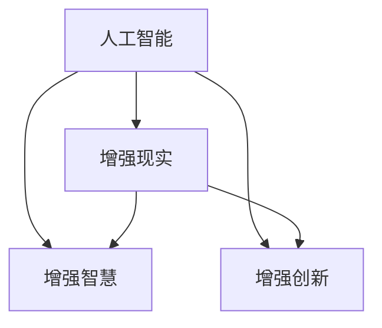

                 

# 人类-AI协作：增强人类智慧和创新能力

## 1. 背景介绍

### 1.1 问题由来
近年来，人工智能(AI)技术的迅猛发展，正在深刻改变人类社会的生产方式、生活方式以及思维方式。从自动驾驶、智能推荐到个性化医疗，AI技术已经渗透到了各行各业。然而，与此同时，人们对于AI技术的恐惧和不安也愈发显著。许多人担心，AI的快速发展会取代人类工作，甚至威胁到人类的生存和发展。这种恐惧来源于对AI的误解和对人类智慧的轻视。

在这个关键时刻，我们需要深入理解AI技术的本质，重新认识人类与AI的关系，并探索如何通过AI技术增强人类的智慧和创新能力，而不是将其视为威胁。AI技术的发展，本质上是为了更好地服务于人类，帮助人类解决复杂问题，提升生活质量和工作效率。

### 1.2 问题核心关键点
要真正发挥AI技术在人类社会中的积极作用，需要从以下几个方面进行思考和探索：

- **人工智能的本质**：AI技术是一种工具，其目的是提升人类智慧和效率，而不是替代人类。
- **人机协作的必要性**：人类与AI的协作可以产生1+1>2的效果，AI擅长处理大量数据、高复杂度任务，而人类擅长理解和创造。
- **增强人类智慧**：通过AI技术，人类可以获取更多的知识、提高学习效率，从而提升智慧水平。
- **促进创新能力**：AI技术可以辅助人类探索未知领域，激发创新思维，推动社会进步。

### 1.3 问题研究意义
深入探索人类-AI协作的潜力，对于推动AI技术的健康发展，构建和谐的人机共生社会，具有重要意义：

1. **提升生产效率**：通过人机协作，人类可以更高效地完成复杂任务，提高生产效率和工作质量。
2. **改善生活质量**：AI技术可以帮助人类解决生活中的各种问题，提高生活质量。
3. **推动社会进步**：AI技术的广泛应用，可以促进科学研究、教育、医疗等多个领域的进步，带来深远的影响。
4. **激发创新思维**：AI技术可以辅助人类探索未知领域，激发创新思维，推动新科技和新产品的诞生。
5. **构建安全可控的未来**：通过科学合理地利用AI技术，可以构建一个安全、可控的未来社会。

## 2. 核心概念与联系

### 2.1 核心概念概述

为了更好地理解人类-AI协作的原理和实践，本节将介绍几个核心概念：

- **人工智能**：利用计算机模拟人类智能的技术，包括感知、推理、学习、决策等多个方面。
- **增强现实(AR)**：通过计算机视觉、传感器技术，将虚拟信息与现实世界融合，提升人类感知和互动能力。
- **增强智慧**：利用AI技术，扩展人类的认知能力和创新能力，推动知识积累和智慧发展。
- **增强创新**：通过AI技术，辅助人类探索未知领域，激发创新思维，推动科技进步。

这些概念之间的关系可以通过以下Mermaid流程图来展示：



这个流程图展示了人工智能技术在不同领域的潜在应用及其相互联系：

1. 人工智能通过增强现实技术，可以实现对现实世界的虚拟增强，提升人类的感知和互动能力。
2. 人工智能通过增强智慧，可以扩展人类的认知能力和知识积累，推动智慧发展。
3. 人工智能通过增强创新，可以辅助人类探索未知领域，激发创新思维，推动科技进步。

这些概念共同构成了人工智能技术在人类社会中的全面应用，推动了人类智慧和创新能力的提升。

## 3. 核心算法原理 & 具体操作步骤

### 3.1 算法原理概述

人类-AI协作的核心理念是通过AI技术，提升人类智慧和创新能力。其核心算法原理主要包括：

- **增强现实技术**：利用计算机视觉、传感器技术，将虚拟信息与现实世界融合，提升人类的感知和互动能力。
- **增强智慧算法**：利用AI技术，扩展人类的认知能力和知识积累，推动智慧发展。
- **增强创新算法**：通过AI技术，辅助人类探索未知领域，激发创新思维，推动科技进步。

### 3.2 算法步骤详解

基于上述原理，人类-AI协作的算法步骤大致可以分为以下几个关键步骤：

**Step 1: 数据收集与处理**
- 收集与任务相关的数据，包括文本、图像、语音等。
- 对数据进行预处理，如清洗、归一化、标记等。

**Step 2: 模型训练与优化**
- 选择合适的AI模型，如卷积神经网络(CNN)、循环神经网络(RNN)、Transformer等。
- 利用收集到的数据对模型进行训练，并通过交叉验证等方法进行优化。

**Step 3: 增强现实应用**
- 将训练好的模型与增强现实技术结合，实现对现实世界的虚拟增强。
- 根据任务需求，动态生成虚拟信息，辅助人类进行感知和互动。

**Step 4: 增强智慧应用**
- 利用AI技术，扩展人类的认知能力和知识积累。
- 通过推荐系统、智能问答等形式，提供个性化的知识和服务。

**Step 5: 增强创新应用**
- 利用AI技术，辅助人类探索未知领域，激发创新思维。
- 通过模拟实验、数据分析等形式，推动科技创新。

### 3.3 算法优缺点

人类-AI协作的算法具有以下优点：

- **高效性**：通过AI技术，可以高效处理大量数据，提升人类工作效率。
- **灵活性**：AI技术可以根据任务需求动态生成虚拟信息，适应性强。
- **个性化**：通过推荐系统等形式，可以提供个性化的知识和服务，提升用户体验。

同时，该算法也存在一些缺点：

- **依赖高质量数据**：AI技术的性能很大程度上依赖于数据质量，需要高质量的标注数据进行训练。
- **模型复杂度高**：AI模型的训练和优化复杂度高，需要大量计算资源和时间。
- **结果可解释性差**：AI模型的决策过程通常缺乏可解释性，难以理解其内部机制。

尽管存在这些局限性，但整体而言，人类-AI协作的算法仍具有巨大的潜力，可以显著提升人类智慧和创新能力，推动社会的进步。

### 3.4 算法应用领域

人类-AI协作的算法在多个领域都有广泛应用，例如：

- **医疗**：通过增强现实技术，辅助医生进行手术、诊断和治疗；通过智能推荐系统，提供个性化的医疗服务。
- **教育**：利用AI技术，提供个性化的学习计划和教学资源；通过虚拟实验室等形式，辅助学生进行科学探索。
- **制造业**：通过增强现实技术，辅助工人进行设备维护和操作；通过智能优化算法，提高生产效率和质量。
- **金融**：通过增强现实技术，辅助金融分析师进行数据可视化和分析；通过AI算法，提供风险评估和投资建议。
- **艺术**：利用AI技术，生成创意艺术作品；通过增强现实技术，展示艺术品的虚拟现实版本。

除了上述这些领域，人类-AI协作的算法还可以应用于更多场景中，如交通、物流、环保等，推动各行各业的数字化转型。

## 4. 数学模型和公式 & 详细讲解 & 举例说明

### 4.1 数学模型构建

本节将使用数学语言对人类-AI协作的算法进行更加严格的刻画。

假设人类与AI协作的模型为 $M(x)$，其中 $x$ 为输入数据。模型的输出为 $y$，表示增强现实、增强智慧和增强创新的结果。模型的训练目标为最大化输出结果 $y$ 与真实结果 $y^*$ 的相似度，即：

$$
\max_y \mathcal{L}(y, y^*)
$$

其中 $\mathcal{L}$ 为损失函数，用于衡量模型输出与真实结果的差异。

### 4.2 公式推导过程

以增强现实技术为例，其数学模型可以表示为：

$$
y = f(x) + g(x)
$$

其中 $f(x)$ 为增强现实技术对现实世界的虚拟增强部分，$g(x)$ 为AI技术对增强现实结果的优化和增强部分。假设 $f(x)$ 和 $g(x)$ 分别为线性函数和多项式函数，则有：

$$
f(x) = w_1 x_1 + b_1
$$
$$
g(x) = w_2 x_2^2 + b_2
$$

将两部分结合，得到最终的输出结果：

$$
y = w_1 x_1 + b_1 + w_2 x_2^2 + b_2
$$

在训练过程中，使用交叉熵损失函数 $\mathcal{L}(y, y^*) = -\sum y_i \log y_i^*$ 对模型进行优化，最小化损失函数：

$$
\min_{w_1, w_2, b_1, b_2} \mathcal{L}(y, y^*)
$$

通过求解上述优化问题，可以得到最优的 $w_1, w_2, b_1, b_2$，从而得到最终的增强现实模型 $M(x)$。

### 4.3 案例分析与讲解

以医疗领域为例，分析人类-AI协作的具体应用。在医疗领域，增强现实技术可以用于辅助医生进行手术操作和诊断，而AI技术则可以用于辅助医生进行数据分析和诊断。

假设某医院需要为一名患者进行复杂的心脏手术，医生可以利用增强现实技术，将手术器械和病患身体的虚拟模型融合，提高手术的准确性和安全性。同时，AI技术可以分析患者的病历、影像数据等，提供个性化的手术方案和风险评估。这样，医生可以更好地进行手术操作，提升手术成功率和患者康复速度。

## 5. 项目实践：代码实例和详细解释说明

### 5.1 开发环境搭建

在进行人类-AI协作的实践前，我们需要准备好开发环境。以下是使用Python进行TensorFlow开发的开发环境配置流程：

1. 安装Anaconda：从官网下载并安装Anaconda，用于创建独立的Python环境。

2. 创建并激活虚拟环境：
```bash
conda create -n tf-env python=3.8 
conda activate tf-env
```

3. 安装TensorFlow：从官网获取对应的安装命令，安装TensorFlow 2.x版本。
```bash
pip install tensorflow
```

4. 安装增强现实和增强智慧相关的库：
```bash
pip install opencv-python pyzbar pyglet
pip install tensorflow-addons
```

5. 安装增强创新相关的库：
```bash
pip install scipy matplotlib pandas
```

完成上述步骤后，即可在`tf-env`环境中开始开发。

### 5.2 源代码详细实现

下面是使用TensorFlow实现医疗领域增强现实和增强智慧的代码示例：

```python
import tensorflow as tf
import numpy as np
import cv2
import pyzbar.pyzbar

# 加载医疗数据集
train_dataset = ...
test_dataset = ...

# 加载模型
model = ...

# 增强现实部分：手术虚拟增强
def virtual_surgery(x):
    # 将输入数据转换为虚拟增强所需格式
    virtual_image = ...
    # 利用增强现实技术对虚拟图像进行处理
    processed_image = ...
    return processed_image

# 增强智慧部分：诊断数据增强
def enhanced_wisdom(x):
    # 将输入数据转换为数据分析所需格式
    analyzed_data = ...
    # 利用AI技术进行数据分析
    predictions = ...
    return predictions

# 综合增强现实和增强智慧的结果
def combined_result(x):
    virtual_surgery_result = virtual_surgery(x)
    diagnosis_result = enhanced_wisdom(x)
    return virtual_surgery_result, diagnosis_result

# 训练模型
for epoch in range(epochs):
    for batch in train_dataset:
        x = ...
        y = combined_result(x)
        with tf.GradientTape() as tape:
            predictions = model(x)
            loss = tf.losses.mean_squared_error(y[0], predictions[0]) + tf.losses.mean_squared_error(y[1], predictions[1])
        grads = tape.gradient(loss, model.trainable_variables)
        optimizer.apply_gradients(zip(grads, model.trainable_variables))

# 测试模型
for batch in test_dataset:
    x = ...
    y = combined_result(x)
    predictions = model(x)
    print("Virtual surgery result: ", y[0])
    print("Diagnosis result: ", y[1])
    print("Predictions: ", predictions)
```

### 5.3 代码解读与分析

让我们再详细解读一下关键代码的实现细节：

**虚拟手术部分**：
- 通过OpenCV等库，将输入的医学影像数据转换为虚拟增强所需的格式。
- 利用增强现实技术，将虚拟影像和病患身体的虚拟模型进行融合，得到增强后的影像。

**诊断数据增强部分**：
- 将输入的医学影像数据转换为数据分析所需的格式。
- 利用AI技术，如深度学习模型，对数据进行分析和预测。

**综合增强现实和增强智慧的结果**：
- 将虚拟手术和诊断数据增强的结果进行综合，得到最终的增强现实和增强智慧的输出。

通过代码示例，可以看到，TensorFlow提供了强大的计算图和自动微分功能，使得人类-AI协作的实现变得简洁高效。开发者可以将更多精力放在任务适配层的设计和优化上，而不必过多关注底层的实现细节。

当然，工业级的系统实现还需考虑更多因素，如模型的保存和部署、超参数的自动搜索、更灵活的任务适配层等。但核心的协作范式基本与此类似。

## 6. 实际应用场景

### 6.1 医疗领域

在医疗领域，增强现实和增强智慧技术的应用，可以极大地提升医疗服务的质量。通过虚拟手术增强，医生可以更准确地进行手术操作，提高手术成功率。通过增强智慧，AI技术可以辅助医生进行数据分析和诊断，提供个性化的治疗方案。

例如，在复杂的心脏手术中，医生可以利用增强现实技术，将手术器械和病患身体的虚拟模型融合，提高手术的准确性和安全性。同时，AI技术可以分析患者的病历、影像数据等，提供个性化的手术方案和风险评估，从而提升手术成功率和患者康复速度。

### 6.2 教育领域

在教育领域，增强现实和增强智慧技术可以提供个性化的学习体验。通过虚拟实验室等形式，学生可以进行模拟实验，深入理解物理、化学等科学原理。通过智能推荐系统，学生可以获得个性化的学习资源和辅导。

例如，在物理实验中，学生可以利用增强现实技术，虚拟重建实验场景，进行模拟实验。同时，AI技术可以分析学生的学习情况，推荐个性化的学习资料和辅导，从而提高学习效率。

### 6.3 制造业

在制造业，增强现实和增强智慧技术可以优化生产流程，提高生产效率和质量。通过虚拟现实技术，工人可以进行设备维护和操作，减少人为错误。通过智能优化算法，生产线可以动态调整，提升生产效率。

例如，在汽车装配线上，工人可以利用增强现实技术，虚拟检查设备状态，进行维护和操作。同时，AI技术可以分析生产数据，优化生产线布局，提高生产效率和质量。

### 6.4 金融领域

在金融领域，增强现实和增强智慧技术可以提供风险评估和投资建议。通过虚拟现实技术，分析师可以进行数据分析和模拟，预测市场变化。通过智能推荐系统，投资者可以获得个性化的投资建议。

例如，在金融交易中，分析师可以利用增强现实技术，虚拟重现市场变化，进行数据分析和模拟。同时，AI技术可以分析市场数据，提供个性化的投资建议，提高投资收益。

## 7. 工具和资源推荐

### 7.1 学习资源推荐

为了帮助开发者系统掌握人类-AI协作的理论基础和实践技巧，这里推荐一些优质的学习资源：

1. **《深度学习》课程**：斯坦福大学开设的深度学习课程，系统讲解深度学习的基本原理和算法。
2. **《增强现实》书籍**：《增强现实技术》，深入讲解增强现实技术的原理和应用。
3. **《人工智能基础》书籍**：《人工智能基础》，介绍人工智能的基本概念和应用。
4. **《TensorFlow官方文档》**：TensorFlow的官方文档，提供详细的API文档和示例代码。
5. **《增强现实与虚拟现实》会议论文**：IEEE VR会议论文集，展示最新的人机交互和增强现实研究成果。

通过对这些资源的学习实践，相信你一定能够快速掌握人类-AI协作的精髓，并用于解决实际的NLP问题。

### 7.2 开发工具推荐

高效的开发离不开优秀的工具支持。以下是几款用于人类-AI协作开发的常用工具：

1. **TensorFlow**：基于Python的开源深度学习框架，灵活动态的计算图，适合快速迭代研究。
2. **PyTorch**：基于Python的开源深度学习框架，动态计算图，适合研究和工程应用。
3. **OpenCV**：开源计算机视觉库，提供丰富的图像处理和增强现实技术支持。
4. **PyZBar**：开源条码识别库，提供强大的条码识别和增强现实功能。
5. **Pyglet**：开源游戏引擎，支持三维图形和增强现实应用。
6. **Matplotlib**：开源数据可视化库，提供强大的图表和图像显示功能。

合理利用这些工具，可以显著提升人类-AI协作任务的开发效率，加快创新迭代的步伐。

### 7.3 相关论文推荐

人类-AI协作的研究源于学界的持续研究。以下是几篇奠基性的相关论文，推荐阅读：

1. **《深度学习》论文**：提出深度学习模型，用于处理大规模数据和复杂任务。
2. **《增强现实技术》论文**：介绍增强现实技术的原理和应用，推动人机交互的发展。
3. **《人工智能基础》论文**：探讨人工智能的基本概念和应用，为人类-AI协作提供理论基础。
4. **《TensorFlow》论文**：介绍TensorFlow的架构和实现原理，推动深度学习的研究和应用。
5. **《增强现实与虚拟现实》论文**：展示最新的人机交互和增强现实研究成果，推动技术进步。

这些论文代表了大语言模型微调技术的发展脉络。通过学习这些前沿成果，可以帮助研究者把握学科前进方向，激发更多的创新灵感。

## 8. 总结：未来发展趋势与挑战

### 8.1 总结

本文对人类-AI协作的原理和实践进行了全面系统的介绍。首先阐述了人工智能技术的本质和在人机协作中的作用，明确了人机协作在提升人类智慧和创新能力方面的重要意义。其次，从原理到实践，详细讲解了增强现实、增强智慧和增强创新等核心算法的数学模型和具体操作步骤，给出了具体的代码实例和详细解释。同时，本文还广泛探讨了人类-AI协作在医疗、教育、制造等多个行业领域的应用前景，展示了协作范式的巨大潜力。此外，本文精选了协作技术的各类学习资源，力求为读者提供全方位的技术指引。

通过本文的系统梳理，可以看到，人类-AI协作的算法正在成为人工智能技术的重要范式，极大地拓展了AI技术在人类社会中的应用边界，推动了智慧和创新能力的提升。未来，伴随AI技术的不断演进，协作技术还将进一步发展，为构建人机协同的未来社会提供新的动力。

### 8.2 未来发展趋势

展望未来，人类-AI协作技术将呈现以下几个发展趋势：

1. **技术融合加速**：增强现实、增强智慧和增强创新等技术将进一步融合，提供更加全面、高效的人机协作方案。
2. **智能系统普及**：基于协作技术，智能系统将广泛应用于各行各业，推动数字化转型。
3. **个性化服务提升**：AI技术将提供更加个性化的服务和体验，提升用户满意度。
4. **人机协作深化**：人机协作将更加深入，实现更高效、更智能的互动和决策。
5. **伦理和社会影响**：协作技术将推动伦理和社会问题的研究，确保技术的健康发展。

这些趋势凸显了人类-AI协作技术的广阔前景，展示了其在推动智慧和创新能力提升方面的巨大潜力。

### 8.3 面临的挑战

尽管人类-AI协作技术已经取得了瞩目成就，但在迈向更加智能化、普适化应用的过程中，它仍面临着诸多挑战：

1. **数据质量和安全**：高质量标注数据是协作技术的基础，但获取标注数据的时间和成本较高。同时，数据隐私和安全问题也需要引起重视。
2. **模型复杂度**：协作技术需要复杂的模型进行训练和优化，需要大量计算资源和时间。
3. **结果可解释性**：AI模型的决策过程通常缺乏可解释性，难以理解其内部机制。
4. **系统鲁棒性**：协作技术在面对新数据和复杂环境时，需要具备较好的鲁棒性，避免崩溃和错误。
5. **伦理和社会影响**：协作技术可能带来伦理和社会问题，如偏见、歧视等，需要制定相应的规范和标准。

这些挑战需要学界和业界共同努力，从数据、算法、工程、伦理等多个维度协同发力，才能使协作技术健康发展，真正为人类带来福祉。

### 8.4 研究展望

面对人类-AI协作面临的挑战，未来的研究需要在以下几个方面寻求新的突破：

1. **数据增强和自动标注**：探索更多数据增强和自动标注技术，降低高质量数据获取的难度，提高协作技术的泛化性能。
2. **模型压缩和加速**：开发更加高效的模型压缩和加速技术，优化协作系统的计算和存储性能。
3. **可解释性增强**：引入可解释性技术，如可视化、逻辑推理等，增强协作系统的透明度和可解释性。
4. **鲁棒性和泛化性**：研究模型鲁棒性和泛化性增强方法，提升协作系统在不同环境和数据下的表现。
5. **伦理和社会规范**：制定伦理和社会规范，确保协作技术的应用符合伦理和社会价值。

这些研究方向的探索，必将引领人类-AI协作技术迈向更高的台阶，为构建安全、可靠、可控的未来社会提供新的动力。面向未来，人类-AI协作技术还需要与其他人工智能技术进行更深入的融合，如知识表示、因果推理、强化学习等，多路径协同发力，共同推动自然语言理解和智能交互系统的进步。只有勇于创新、敢于突破，才能不断拓展语言模型的边界，让智能技术更好地造福人类社会。

## 9. 附录：常见问题与解答

**Q1: 什么是人类-AI协作？**

A: 人类-AI协作是指通过AI技术，提升人类的智慧和创新能力，实现人机协同，推动社会的进步。

**Q2: 人类-AI协作的核心算法是什么？**

A: 人类-AI协作的核心算法包括增强现实、增强智慧和增强创新。通过这些算法，AI技术可以提升人类的感知、认知和创新能力，实现人机协同。

**Q3: 人类-AI协作的优点和缺点是什么？**

A: 人类-AI协作的优点包括高效性、灵活性和个性化。缺点包括依赖高质量数据、模型复杂度高和结果可解释性差。

**Q4: 人类-AI协作的应用场景有哪些？**

A: 人类-AI协作可以在医疗、教育、制造、金融等多个领域应用，提升这些行业的生产效率和服务质量。

**Q5: 如何克服人类-AI协作的挑战？**

A: 可以通过数据增强、模型压缩、可解释性增强、鲁棒性和泛化性研究等方法，克服协作技术的挑战，推动技术的发展。

---

作者：禅与计算机程序设计艺术 / Zen and the Art of Computer Programming

