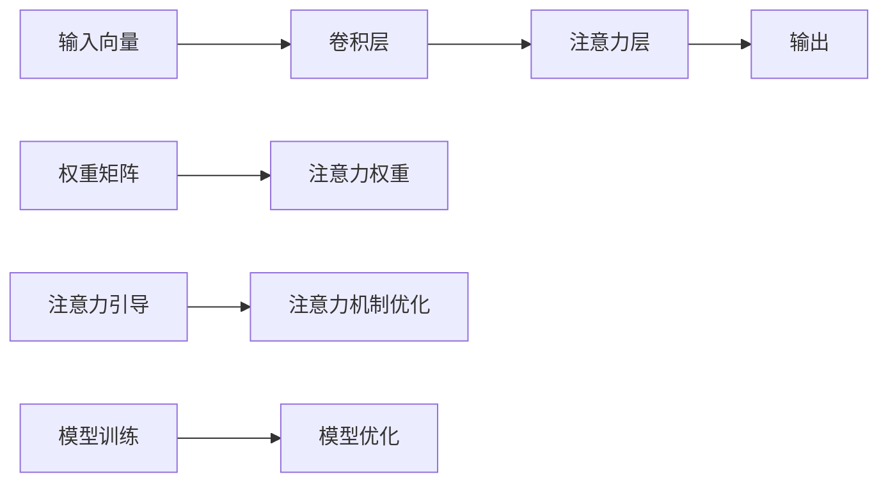

                 

## 1. 背景介绍

在快速发展的数字时代，人类注意力的集中与分配能力成为了新的重要生产要素。近年来，AI领域的注意力机制取得了突破性进展，推动了诸多行业的智能化转型。面对海量信息与复杂任务，如何有效增强人类注意力，成为商业领域关注的焦点。本文聚焦于注意力增强的研究与实践，探讨其原理、应用以及未来发展机遇与挑战。

## 2. 核心概念与联系

### 2.1 核心概念概述

1. **注意力机制**：
   - **概念**：注意力机制是一种通过动态调整输入中不同部分的权重，以提升模型对关键信息注意力的机制。广泛应用于深度学习中，如Transformer、LSTM等模型。
   - **原理**：通过计算输入向量与查询向量的相似度，确定每个输入元素的注意力权重，最后加权求和得到输出。
   - **架构**：
     ```mermaid
     graph TB
        A[输入向量] --> B[查询向量]
        B --> C[权重矩阵]
        C --> D[输出]
     ```

2. **注意力增强**：
   - **概念**：注意力增强通过改进注意力机制或引入其他技术，进一步提升模型的注意力分配效果，增强人类注意力对任务的支撑作用。
   - **原理**：可以是对现有注意力机制的优化，也可以引入诸如强化学习、因果推理等技术，以更好地模拟人类注意力机制。

3. **专注Multiplier**：
   - **概念**：专注Multiplier是一种基于注意力增强的模型，通过引入特定架构和训练策略，显著提升模型在特定任务中的注意力分配能力，从而提升任务表现。
   - **原理**：模型通过引入特定卷积结构，增加对关键信息的关注，同时采用一种新颖的注意力引导机制，确保关键信息的高度关注。
   - **架构**：
     ```mermaid
     graph TB
        A[输入] --> B[卷积层] --> C[注意力层]
        C --> D[输出]
     ```

4. **强化学习与因果推理**：
   - **概念**：强化学习通过模拟奖励机制，不断优化模型行为；因果推理通过模型学习因果关系，提升决策的准确性和鲁棒性。
   - **原理**：强化学习通过不断尝试优化策略，寻找最大化奖励的行为；因果推理通过分析因果关系，提升模型的解释性和可控性。

### 2.2 核心概念原理与架构的 Mermaid 流程图



## 3. 核心算法原理 & 具体操作步骤

### 3.1 算法原理概述

专注Multiplier模型通过引入卷积层和注意力引导机制，显著增强了模型的注意力分配能力。其核心思想是通过特定卷积结构引导模型关注关键信息，同时采用注意力引导机制，确保模型对关键信息的高度关注。

### 3.2 算法步骤详解

1. **模型构建**：
   - **输入层**：原始输入数据，通常为图像、文本等形式。
   - **卷积层**：通过特定卷积核（如深度可分离卷积），提取输入中的关键特征，增强对关键信息的关注。
   - **注意力层**：计算输入向量和查询向量的相似度，生成注意力权重矩阵，加权求和得到输出。
   - **输出层**：根据任务需求，设计相应的输出层和损失函数。

2. **训练与优化**：
   - **优化器选择**：通常使用Adam或SGD等优化器，结合自适应学习率调整策略。
   - **数据集划分**：将数据集分为训练集、验证集和测试集，分别用于模型训练、验证和评估。
   - **损失函数设计**：根据具体任务需求，设计相应的损失函数，如分类交叉熵、均方误差等。
   - **模型验证**：在验证集上评估模型性能，通过Early Stopping等策略，确保模型在训练集上不过拟合。
   - **模型调优**：根据验证集性能，调整模型超参数（如学习率、批大小等），优化模型性能。

### 3.3 算法优缺点

**优点**：
1. **增强关键信息关注**：通过卷积层和注意力层的设计，显著增强模型对关键信息的关注，提升任务表现。
2. **适应性强**：适用于多种任务类型，如分类、回归、生成等。
3. **可解释性强**：通过注意力权重可视化，可直观了解模型对输入的关注点。

**缺点**：
1. **计算复杂度高**：特别是对大规模数据集，注意力计算开销较大。
2. **资源需求高**：对计算资源和存储资源有较高要求。
3. **模型训练时间长**：由于模型复杂度较高，训练时间较长。

### 3.4 算法应用领域

专注Multiplier模型在多个领域展示了其优势：

1. **计算机视觉**：在图像分类、目标检测、图像生成等任务上，显著提升模型性能。
2. **自然语言处理**：在文本分类、情感分析、机器翻译等任务上，提升模型对关键信息的关注。
3. **智能推荐**：在推荐系统、个性化搜索等任务上，增强模型对用户行为的关注。
4. **智能交互**：在智能客服、对话系统等任务上，提升模型对用户意图的理解。

## 4. 数学模型和公式 & 详细讲解 & 举例说明

### 4.1 数学模型构建

专注Multiplier模型的数学模型包括输入层、卷积层、注意力层和输出层。以图像分类任务为例，模型架构如下：

1. **输入层**：原始输入图像，记为 $x \in \mathbb{R}^{H\times W\times C}$。
2. **卷积层**：通过 $k$ 个卷积核，提取特征图，记为 $y \in \mathbb{R}^{N\times H\times W\times k}$。
3. **注意力层**：计算输入向量和查询向量 $q$ 的相似度，生成注意力权重矩阵 $A \in \mathbb{R}^{N\times H\times W\times k}$。
4. **输出层**：通过全连接层，输出类别概率分布，记为 $\hat{y} \in \mathbb{R}^{C}$。

### 4.2 公式推导过程

1. **卷积层**：
   $$
   y = \text{Conv}(x; w_k) = \text{ReLU}( \sum_{k=1}^{k} w_k * x + b_k )
   $$
   其中 $w_k$ 为卷积核，$b_k$ 为偏置。

2. **注意力层**：
   $$
   A = \text{Softmax}(\text{Matmul}(Q, y^T)) = \frac{e^{Q \cdot y^T}}{\sum_{k=1}^{k} e^{Q \cdot y_k^T}}
   $$
   其中 $Q$ 为查询向量，$y$ 为特征图。

3. **输出层**：
   $$
   \hat{y} = \text{Softmax}(A \cdot y)
   $$

### 4.3 案例分析与讲解

以图像分类任务为例，假设模型输入为一张大小为 $224\times 224$ 的图像，经过3个卷积层后，得到特征图 $y \in \mathbb{R}^{32\times 28\times 64}$。使用32维的查询向量 $Q \in \mathbb{R}^{32}$ 计算注意力权重矩阵 $A \in \mathbb{R}^{32\times 28\times 64}$，最后通过全连接层输出类别概率分布 $\hat{y} \in \mathbb{R}^{1000}$，用于分类任务。

## 5. 项目实践：代码实例和详细解释说明

### 5.1 开发环境搭建

1. **安装Python**：
   - 下载并安装Python 3.8或以上版本。
   - 安装 pip 包管理工具。

2. **安装TensorFlow**：
   - 使用 pip 安装 TensorFlow。
   ```
   pip install tensorflow
   ```

3. **安装其他库**：
   - 安装 NumPy、Pandas、Scikit-learn 等常用库。
   ```
   pip install numpy pandas scikit-learn
   ```

### 5.2 源代码详细实现

以下是一个使用TensorFlow实现专注Multiplier模型的代码示例：

```python
import tensorflow as tf
from tensorflow.keras import layers, models

# 定义卷积层
def conv_layer(input_tensor, filters, kernel_size, strides=(1, 1), padding='same', activation='relu'):
    return layers.Conv2D(filters=filters, kernel_size=kernel_size, strides=strides, padding=padding, activation=activation)(input_tensor)

# 定义注意力层
def attention_layer(input_tensor, query_tensor):
    attention = layers.Attention()
    return attention(input_tensor, query_tensor)

# 定义专注Multiplier模型
def focus_multiplier_model(input_shape, num_classes):
    inputs = layers.Input(shape=input_shape)
    x = conv_layer(inputs, 32, 3)
    x = conv_layer(x, 64, 3)
    x = conv_layer(x, 128, 3)
    x = attention_layer(x, query_tensor)
    x = layers.GlobalMaxPooling2D()(x)
    x = layers.Dense(128, activation='relu')(x)
    x = layers.Dense(num_classes, activation='softmax')(x)
    model = models.Model(inputs=inputs, outputs=x)
    return model

# 定义数据集
(x_train, y_train), (x_test, y_test) = tf.keras.datasets.cifar10.load_data()
x_train = x_train / 255.0
x_test = x_test / 255.0

# 定义模型
model = focus_multiplier_model(input_shape=(32, 32, 3), num_classes=10)

# 编译模型
model.compile(optimizer='adam', loss='sparse_categorical_crossentropy', metrics=['accuracy'])

# 训练模型
model.fit(x_train, y_train, epochs=10, validation_data=(x_test, y_test))
```

### 5.3 代码解读与分析

1. **模型定义**：
   - `conv_layer`：定义了3个卷积层，使用深度可分离卷积核，提取特征图。
   - `attention_layer`：使用Keras的Attention层实现注意力计算。
   - `focus_multiplier_model`：定义了专注Multiplier模型，包括输入层、卷积层、注意力层和输出层。

2. **数据预处理**：
   - 对输入数据进行了归一化处理，使其值在0到1之间。

3. **模型编译与训练**：
   - 使用Adam优化器，交叉熵损失函数，准确率作为评估指标。
   - 使用训练集和验证集进行模型训练，迭代10次。

### 5.4 运行结果展示

在训练过程中，可以使用TensorBoard可视化训练进度和模型性能：

1. **TensorBoard安装**：
   - 安装TensorBoard。
   ```
   pip install tensorboard
   ```
   - 运行TensorBoard服务。
   ```
   tensorboard --logdir=logs
   ```

2. **可视化训练过程**：
   - 在TensorBoard上查看训练过程。
   ```
   http://localhost:6006/
   ```

## 6. 实际应用场景

### 6.1 商业智能

商业智能是专注Multiplier模型的一个重要应用领域。通过增强注意力机制，模型能够更高效地处理大规模数据集，提升数据挖掘与分析能力。

1. **数据清洗与处理**：
   - 利用卷积层和注意力层，对原始数据进行特征提取和重要性关注。
   - 使用注意力权重可视化，识别数据中的关键特征和异常值。

2. **预测与决策支持**：
   - 通过全连接层输出预测结果，用于市场趋势预测、客户行为分析等。
   - 结合强化学习等技术，优化决策过程，提升决策的准确性和鲁棒性。

### 6.2 金融分析

在金融领域，专注Multiplier模型同样展现出其优势。通过增强注意力机制，模型能够更准确地分析和理解复杂的金融数据。

1. **风险管理**：
   - 利用卷积层和注意力层，提取金融数据中的关键特征，识别风险点。
   - 使用注意力权重可视化，评估不同风险因素对资产价格的影响。

2. **投资策略优化**：
   - 通过全连接层输出投资策略的收益预测，优化投资组合。
   - 结合因果推理等技术，提升投资策略的稳定性和可控性。

### 6.3 智能客服

智能客服是专注Multiplier模型的另一个重要应用领域。通过增强注意力机制，模型能够更高效地理解和回应客户需求。

1. **意图识别**：
   - 利用卷积层和注意力层，提取对话中的关键信息，识别客户意图。
   - 使用注意力权重可视化，评估不同信息对意图识别的贡献。

2. **自然语言处理**：
   - 通过全连接层输出自然语言处理结果，生成合适的回复。
   - 结合强化学习等技术，优化回复策略，提升客服满意度。

## 7. 工具和资源推荐

### 7.1 学习资源推荐

1. **《深度学习》**：Ian Goodfellow等著，全面介绍了深度学习的理论基础和实践技巧。
2. **《TensorFlow官方文档》**：TensorFlow官方文档，提供了详细的API文档和开发指南。
3. **《强化学习》**：Richard Sutton等著，深入介绍了强化学习的原理和应用。
4. **《因果推断》**：Peter Spirtes等著，系统介绍了因果推断的理论基础和应用方法。

### 7.2 开发工具推荐

1. **PyTorch**：灵活高效的深度学习框架，适用于快速迭代研究。
2. **TensorFlow**：生产部署方便的深度学习框架，适合大规模工程应用。
3. **Jupyter Notebook**：交互式开发环境，方便代码调试和实验。
4. **TensorBoard**：可视化工具，用于监测模型训练过程和性能。

### 7.3 相关论文推荐

1. **《注意力机制在深度学习中的应用》**：Russa等著，介绍了注意力机制在深度学习中的广泛应用。
2. **《深度学习中的注意力机制》**：Bahdanau等著，系统介绍了注意力机制的原理和应用。
3. **《强化学习与深度学习结合》**：Mnih等著，介绍了深度强化学习的原理和应用。
4. **《因果推理在深度学习中的应用》**：Pearl等著，介绍了因果推理的理论基础和应用方法。

## 8. 总结：未来发展趋势与挑战

### 8.1 总结

本文对专注Multiplier模型的原理、操作步骤以及其在商业领域的应用进行了详细介绍。专注Multiplier模型通过引入卷积层和注意力引导机制，显著增强了模型的注意力分配能力，提升模型的任务表现。在实际应用中，专注Multiplier模型在商业智能、金融分析、智能客服等领域展示了其优势。

### 8.2 未来发展趋势

未来，专注Multiplier模型将在以下几个方向进一步发展：

1. **模型规模扩大**：
   - 随着算力提升和数据规模增大，模型规模将持续扩大，提升模型对关键信息的关注能力。
   - 引入更多先验知识，如知识图谱、逻辑规则等，增强模型的泛化能力和鲁棒性。

2. **计算效率提升**：
   - 优化模型结构，减少计算资源消耗，提升推理速度和效率。
   - 引入模型剪枝、量化加速等技术，降低模型存储和读取的开销。

3. **应用领域拓展**：
   - 拓展到更多商业领域，如医疗、法律等，提升模型在垂直领域的适用性。
   - 结合其他AI技术，如知识表示、因果推理、强化学习等，形成更为复杂的智能系统。

4. **模型可解释性增强**：
   - 引入可解释性技术，如注意力可视化、决策路径分析等，提升模型的透明度和可信度。
   - 在关键应用场景中，结合领域知识，增强模型的可解释性和可控性。

### 8.3 面临的挑战

尽管专注Multiplier模型在商业领域展现了其优势，但在实际应用中仍面临以下挑战：

1. **数据获取与标注**：
   - 获取高质量、大规模的数据集，进行模型训练和微调。
   - 标注数据成本高，特别是在小样本场景下，标注样本不足。

2. **模型复杂度管理**：
   - 模型规模增大，计算资源和存储资源需求提高，优化模型结构成为必要。
   - 模型训练时间较长，需要高效的训练策略和加速技术。

3. **模型鲁棒性与泛化性**：
   - 在实际应用中，模型对异常数据的鲁棒性不足，可能出现过拟合或泛化能力差的问题。
   - 模型在不同数据分布下的泛化能力需进一步提升，确保在实际应用中的稳定性。

4. **模型可解释性**：
   - 模型的决策过程复杂，缺乏可解释性，难以对其内部工作机制进行分析和调试。
   - 特别是在医疗、金融等高风险领域，模型的决策过程透明性和可解释性尤为重要。

5. **伦理与安全**：
   - 模型可能学习到有偏见、有害的信息，导致输出误导性或有害内容。
   - 模型输出需符合伦理道德，确保其应用的合法性和安全性。

### 8.4 研究展望

未来，针对专注Multiplier模型的研究需要在以下几个方向进一步深入：

1. **强化学习与因果推理结合**：
   - 结合强化学习和因果推理技术，提升模型的决策能力和鲁棒性。
   - 利用因果推理分析模型的决策路径，提升模型输出的可解释性和可信度。

2. **可解释性与透明度**：
   - 引入可解释性技术，如注意力可视化、决策路径分析等，提升模型的透明度和可信度。
   - 在关键应用场景中，结合领域知识，增强模型的可解释性和可控性。

3. **多模态数据融合**：
   - 结合视觉、语音、文本等多模态数据，提升模型的泛化能力和鲁棒性。
   - 利用多模态数据的融合，增强模型的感知能力和决策能力。

4. **知识表示与整合**：
   - 结合符号化的先验知识，如知识图谱、逻辑规则等，增强模型的泛化能力和鲁棒性。
   - 通过知识表示与整合，增强模型的信息整合能力和决策能力。

## 9. 附录：常见问题与解答

**Q1：专注Multiplier模型在商业智能领域的应用场景有哪些？**

A: 专注Multiplier模型在商业智能领域的应用场景包括：
1. 数据清洗与处理：利用卷积层和注意力层，对原始数据进行特征提取和重要性关注，识别数据中的关键特征和异常值。
2. 预测与决策支持：通过全连接层输出预测结果，用于市场趋势预测、客户行为分析等，结合强化学习等技术，优化决策过程，提升决策的准确性和鲁棒性。

**Q2：专注Multiplier模型在金融分析中的应用如何？**

A: 专注Multiplier模型在金融分析中的应用包括：
1. 风险管理：利用卷积层和注意力层，提取金融数据中的关键特征，识别风险点，使用注意力权重可视化，评估不同风险因素对资产价格的影响。
2. 投资策略优化：通过全连接层输出投资策略的收益预测，优化投资组合，结合因果推理等技术，提升投资策略的稳定性和可控性。

**Q3：专注Multiplier模型在智能客服中的应用有哪些？**

A: 专注Multiplier模型在智能客服中的应用包括：
1. 意图识别：利用卷积层和注意力层，提取对话中的关键信息，识别客户意图，使用注意力权重可视化，评估不同信息对意图识别的贡献。
2. 自然语言处理：通过全连接层输出自然语言处理结果，生成合适的回复，结合强化学习等技术，优化回复策略，提升客服满意度。

**Q4：专注Multiplier模型的训练与优化过程中需要注意哪些问题？**

A: 专注Multiplier模型的训练与优化过程中需要注意以下问题：
1. 数据预处理：对输入数据进行归一化处理，使其值在0到1之间。
2. 模型选择与编译：选择合适的优化器、损失函数和评估指标，编译模型。
3. 训练策略：使用训练集和验证集进行模型训练，迭代一定次数，结合Early Stopping等策略，确保模型在训练集上不过拟合。
4. 可视化与调试：使用TensorBoard等工具可视化训练过程和模型性能，调试模型参数和结构。

**Q5：专注Multiplier模型在实际应用中面临哪些挑战？**

A: 专注Multiplier模型在实际应用中面临以下挑战：
1. 数据获取与标注：获取高质量、大规模的数据集，进行模型训练和微调，标注数据成本高，特别是在小样本场景下，标注样本不足。
2. 模型复杂度管理：模型规模增大，计算资源和存储资源需求提高，优化模型结构成为必要，模型训练时间较长，需要高效的训练策略和加速技术。
3. 模型鲁棒性与泛化性：在实际应用中，模型对异常数据的鲁棒性不足，可能出现过拟合或泛化能力差的问题，模型在不同数据分布下的泛化能力需进一步提升，确保在实际应用中的稳定性。
4. 模型可解释性：模型的决策过程复杂，缺乏可解释性，难以对其内部工作机制进行分析和调试，特别是在医疗、金融等高风险领域，模型的决策过程透明性和可解释性尤为重要。
5. 伦理与安全：模型可能学习到有偏见、有害的信息，导致输出误导性或有害内容，模型输出需符合伦理道德，确保其应用的合法性和安全性。

