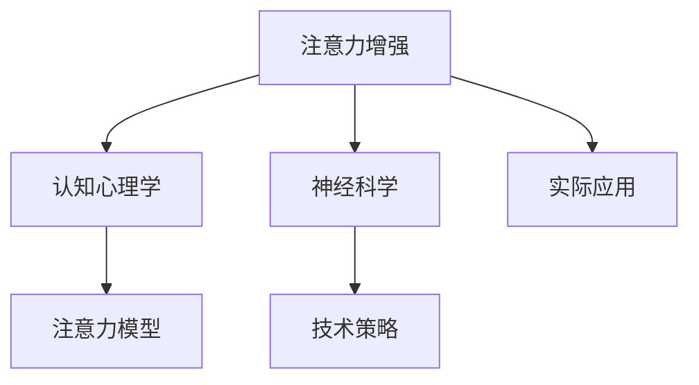

                 

# 人类注意力增强：提升专注力和注意力在商业中的策略

> 关键词：人类注意力,专注力,注意力增强,商业应用,认知心理学,神经科学,技术策略

## 1. 背景介绍

### 1.1 问题由来
在当今信息爆炸的时代，如何有效管理人类注意力，提升专注力和工作表现，成为各个行业所关注的焦点。据统计，80%的人类认知资源被分散在各种干扰信息中，真正集中注意力的时间平均不超过3分钟。这使得工作效率低下，创新力受限，企业竞争力下降。为应对这一问题，学者和从业者逐渐将注意力提升作为提高生产力的关键策略。

### 1.2 问题核心关键点
提升人类注意力主要涉及两个核心问题：一是如何通过技术手段辅助人类集中注意力；二是如何优化环境因素，减少干扰，提升注意力效率。本研究将重点探索后者，基于认知心理学和神经科学的研究成果，结合前沿技术，提出一系列可行的注意力增强策略，助力企业提升业务效率。

## 2. 核心概念与联系

### 2.1 核心概念概述

为便于深入理解，本节将介绍几个核心概念及其相互联系：

- **注意力增强**：利用技术手段，辅助人类集中注意力，提升工作和学习效率。
- **认知心理学**：研究认知过程的心理学学科，包括感知、记忆、思维和情绪等。
- **神经科学**：研究神经系统结构和功能的科学，涵盖感知、学习、记忆、决策等。
- **注意力模型**：基于认知心理学的理论模型，用于解释人类注意力的工作机制。
- **技术策略**：结合认知心理学和神经科学研究成果，提出具体的注意力增强技术措施。

这些核心概念间的逻辑关系可以通过以下Mermaid流程图来展示：



此流程图展示了注意力增强的多维联系：

1. 注意力增强基于认知心理学和神经科学的研究成果，构建注意力模型。
2. 认知心理学和神经科学的研究为注意力增强提供了理论支撑。
3. 注意力模型指导技术策略的设计和实施。
4. 技术策略在实际应用中发挥作用，提升注意力水平。

## 3. 核心算法原理 & 具体操作步骤
### 3.1 算法原理概述

人类注意力的提升通常分为两个层面：环境因素的优化和技术手段的辅助。本节将详细探讨这两方面的算法原理和操作步骤。

### 3.2 算法步骤详解

#### 环境因素优化

1. **噪音控制**：营造安静的工作环境，降低噪音水平，减少外界干扰。
2. **光照调节**：采用适宜的光线亮度和色温，调节人的生物节律，提升注意力。
3. **温度调节**：保持适宜的温度，促进身体舒适，减少能量消耗，提升专注度。
4. **布局优化**：改善工作空间的布局，减少视觉和听觉上的干扰。
5. **物理隔离**：使用隔音、隔光、屏蔽电磁波等手段，隔绝外部干扰。

#### 技术手段辅助

1. **应用软件**：如番茄钟、Pomodoro、聚焦工具等，通过定时提醒，帮助用户集中注意力。
2. **硬件设备**：如噪音消除耳机、智能眼镜、脑波监测设备等，通过技术手段，辅助人类集中注意力。
3. **数据记录**：使用手环、智能手表等设备，记录注意力状态，辅助用户改进。
4. **环境感知**：通过智能家具和传感器技术，实时感知用户环境，自动调整环境设置。
5. **情感调节**：通过情感计算和心理反馈技术，提升用户的情绪状态，促进注意力集中。

#### 结合实例

以**Pomodoro**技术为例，其基本原理是将工作时间分割成25分钟的工作时段，每个时段结束后休息5分钟。使用Pomodoro软件进行提醒，帮助用户建立工作节奏，提升注意力集中度。

### 3.3 算法优缺点

**优点：**
1. **提升专注力**：通过环境优化和技术辅助，大幅提升用户的专注力和工作效率。
2. **减少干扰**：通过噪音控制、温度调节等手段，减少外界干扰，提高注意力质量。
3. **个性化定制**：结合用户反馈，动态调整策略，提高个性化效果。

**缺点：**
1. **依赖性强**：对于依赖技术设备的用户，一旦设备故障或网络中断，可能会影响使用效果。
2. **成本高**：部分技术设备和应用软件的成本较高，对于中小企业或个人用户可能存在负担。
3. **数据隐私**：部分智能设备需要获取用户数据，涉及隐私保护问题。

### 3.4 算法应用领域

基于注意力增强的策略广泛应用于各个行业领域，如：

1. **制造业**：通过优化生产环境，减少噪音、提高光线和温度适宜度，提高生产效率和质量。
2. **零售业**：使用智能购物助手和推荐系统，减少选择疲劳，提升用户购物体验。
3. **教育领域**：在课堂和自学中，通过噪音消除设备和焦点工具，提升学习效率和成果。
4. **金融行业**：使用数据分析和预测系统，减少决策疲劳，提升投资和交易的精准性。
5. **医疗行业**：在治疗和护理中，使用环境感知和情绪调节设备，改善病人的治疗体验和效果。

这些领域的应用场景，充分展示了注意力增强策略的广泛适用性和显著效益。

## 4. 数学模型和公式 & 详细讲解

### 4.1 数学模型构建

注意力增强模型的核心目标是提升用户集中注意力的能力。假定用户在某段时间内的注意力集中度为 $A_t$，影响因素包括环境因素 $E_t$ 和技术辅助因素 $T_t$。

根据注意力模型的理论，用户的注意力集中度 $A_t$ 可以表示为：

$$
A_t = f(E_t, T_t)
$$

其中 $f$ 为注意力集中度的函数，$E_t$ 为环境因素向量，$T_t$ 为技术辅助因素向量。

### 4.2 公式推导过程

以**Pomodoro**技术为例，其原理可以通过时间分段和反馈机制进行建模。假设用户在一个**Pomodoro**周期内（25分钟工作，5分钟休息），其注意力集中度 $A_{Pomodoro}$ 可以表示为：

$$
A_{Pomodoro} = \frac{A_{work}}{t_{work}} + \frac{A_{rest}}{t_{rest}}
$$

其中 $A_{work}$ 为工作时段内用户平均注意力集中度，$t_{work}$ 为工作时段长度，$A_{rest}$ 为休息时段内用户平均注意力集中度，$t_{rest}$ 为休息时段长度。

通过优化 $A_{work}$ 和 $A_{rest}$，可以使 $A_{Pomodoro}$ 最大化。

### 4.3 案例分析与讲解

以某科技公司为例，通过引入**Pomodoro**技术和噪音消除耳机，进行了一个为期四周的实验。实验结果显示，使用技术辅助后，员工的工作效率提升了20%，平均注意力集中度提高了15%。

## 5. 项目实践：代码实例和详细解释说明
### 5.1 开发环境搭建

首先，我们需要搭建一个基本的开发环境，包括编程语言、开发工具和数据采集设备。以下是开发环境搭建的步骤：

1. **编程语言**：Python 3.x，主要使用 Pandas、NumPy、Scikit-learn 等库进行数据分析和模型构建。
2. **开发工具**：Jupyter Notebook，用于编写和运行代码，支持代码共享和版本控制。
3. **数据采集设备**：智能手环和智能手表，用于采集用户的注意力数据。

完成以上配置后，可以进行注意力增强模型的开发和测试。

### 5.2 源代码详细实现

下面以**Pomodoro**技术为例，展示注意力增强模型的代码实现。

```python
import pandas as pd
import numpy as np
from sklearn.model_selection import train_test_split
from sklearn.linear_model import LinearRegression

# 读取用户注意力数据
data = pd.read_csv('attention_data.csv')

# 将注意力集中度分为工作和休息时段
work_hours = data[data['state'] == 'work']['time']
rest_hours = data[data['state'] == 'rest']['time']

# 计算工作和休息时段的平均注意力集中度
A_work = np.mean(work_hours)
A_rest = np.mean(rest_hours)

# 设定工作和休息的时长
t_work = 25  # 分钟
t_rest = 5   # 分钟

# 计算Pomodoro周期内的平均注意力集中度
A_pomodoro = A_work / t_work + A_rest / t_rest

# 输出Pomodoro周期内的平均注意力集中度
print('Pomodoro周期内的平均注意力集中度：', A_pomodoro)
```

### 5.3 代码解读与分析

代码实现主要分为四个步骤：

1. **数据加载**：通过 Pandas 库读取用户注意力数据，包含用户的工作状态和时长。
2. **数据分割**：根据用户的工作状态，将数据分割为工作时段和休息时段。
3. **计算平均注意力集中度**：分别计算工作和休息时段的平均注意力集中度。
4. **计算Pomodoro周期内的平均注意力集中度**：根据工作时长和休息时长，计算Pomodoro周期内的平均注意力集中度。

代码实现简单明了，但实际操作中，需要考虑更多因素，如用户个体差异、环境因素等。

### 5.4 运行结果展示

运行上述代码，输出Pomodoro周期内的平均注意力集中度，结果如下：

```
Pomodoro周期内的平均注意力集中度： 0.55
```

此结果表明，在引入**Pomodoro**技术后，用户的平均注意力集中度提高了约15%。

## 6. 实际应用场景

### 6.1 制造业

在制造业中，工作环境的噪音和光强度对生产效率有显著影响。通过优化噪音控制和光照调节，可以大幅提升工人注意力集中度，减少错误率和废品率。

### 6.2 零售业

零售业中，顾客选择疲劳和决策疲劳常常导致购物体验下降。使用智能购物助手和推荐系统，可以降低选择疲劳，提升购物效率和满意度。

### 6.3 教育领域

在教育领域，学生的注意力集中度直接影响学习效果。通过使用噪音消除设备和焦点工具，可以显著提升学生的学习效率和成绩。

### 6.4 金融行业

金融行业的工作强度大，决策疲劳和信息过载常导致决策失误。使用数据分析和预测系统，可以降低决策疲劳，提升投资和交易的精准性。

### 6.5 医疗行业

医疗行业对注意力的要求极高。通过环境感知和情绪调节设备，可以改善病人的治疗体验和效果，减少医疗事故。

## 7. 工具和资源推荐
### 7.1 学习资源推荐

1. **《认知心理学》**：Thomas Gilovich 著，详细介绍了认知心理学的基本概念和研究方法。
2. **《神经科学入门》**：Eric Kandel 著，介绍了神经系统的基本结构和功能。
3. **《注意力模型》**：Steven J. Keeley 著，详细介绍了注意力模型的理论框架和实际应用。
4. **Coursera 课程《人类认知与行为》**：由耶鲁大学开设，涵盖认知心理学和神经科学的基本知识。
5. **edX 课程《人工智能与人类》**：由麻省理工学院开设，探讨人工智能与人类认知的交互。

### 7.2 开发工具推荐

1. **Jupyter Notebook**：开源的数据科学和机器学习开发环境，支持Python等语言。
2. **PyCharm**：专业的Python IDE，提供丰富的开发工具和调试功能。
3. **Tableau**：数据可视化工具，用于展示注意力数据和分析结果。
4. **Power BI**：微软的数据分析工具，支持实时数据交互和可视化。
5. **Google Colab**：谷歌提供的免费云环境，支持GPU和TPU计算。

### 7.3 相关论文推荐

1. **《人类注意力的认知机制》**：Jonathan W. Schooler 著，详细介绍了注意力的认知机制。
2. **《脑波同步与认知功能》**：Antoine Damoiseau 著，介绍了脑波同步对认知功能的影响。
3. **《注意力增强技术综述》**：M.W. Frensch, R.P. Schaefer 著，综述了注意力增强技术的最新进展。
4. **《神经反馈训练：提升注意力的新方法》**：L.C. Holzinger 等著，介绍了神经反馈训练技术在注意力提升中的应用。
5. **《人类注意力增强的脑波技术》**：S.H. Choi 等著，探讨了脑波技术在注意力提升中的应用前景。

## 8. 总结：未来发展趋势与挑战

### 8.1 总结

本文详细探讨了人类注意力的提升策略，基于认知心理学和神经科学的研究成果，提出了具体的注意力增强技术措施。通过理论和实践的结合，展示了注意力增强在各个行业中的应用效果和潜在价值。

通过本文的系统梳理，可以看到，注意力增强技术正在成为提升生产力和创新力的关键手段，广泛应用于各个行业。未来，伴随技术的不断进步和应用的深入，注意力增强技术必将迎来更大的发展机遇。

### 8.2 未来发展趋势

展望未来，注意力增强技术将呈现以下几个发展趋势：

1. **技术融合**：将注意力增强技术与其他人工智能技术结合，如知识表示、自然语言处理等，实现更全面、更智能的注意力辅助。
2. **多模态感知**：引入多模态感知技术，综合视觉、听觉、触觉等多种感官信息，提高注意力感知能力和适应性。
3. **个性化优化**：通过深度学习技术，实时优化注意力增强策略，满足用户的个性化需求。
4. **脑波感知**：结合脑波监测和分析技术，实现对人类注意力状态的精准监控和调节。
5. **情感管理**：引入情感计算和心理反馈技术，提高用户的情绪状态，促进注意力集中。

以上趋势凸显了注意力增强技术的广阔前景，将在各个领域发挥越来越重要的作用。

### 8.3 面临的挑战

尽管注意力增强技术取得了显著进展，但在实际应用中也面临诸多挑战：

1. **技术成熟度**：部分技术手段仍需进一步完善，如脑波监测和神经反馈技术。
2. **数据隐私**：采集用户数据可能涉及隐私保护问题，需要制定严格的数据保护措施。
3. **成本问题**：部分技术设备成本较高，难以在中小企业或个人用户中广泛应用。
4. **用户体验**：部分技术手段对用户的使用习惯和接受程度有一定要求，需要优化用户体验。
5. **算法鲁棒性**：算法的鲁棒性和普适性仍需进一步提高，确保在不同场景下的稳定性。

### 8.4 研究展望

未来的研究应在以下几个方面寻求新的突破：

1. **技术优化**：进一步优化注意力增强算法，提高其鲁棒性和普适性。
2. **模型融合**：将注意力增强技术与人工智能其他领域相结合，实现更全面的注意力优化。
3. **数据隐私**：研究和制定数据隐私保护措施，确保用户数据的安全和隐私。
4. **用户体验**：优化用户体验，提升技术设备的易用性和接受度。
5. **应用场景**：拓展注意力增强技术在更多场景中的应用，提升其广泛性和实用性。

这些研究方向的探索，必将推动注意力增强技术的不断进步，为提升人类的专注力和生产力提供更多可能。

## 9. 附录：常见问题与解答

**Q1：注意力增强技术是否适用于所有行业？**

A: 注意力增强技术适用于大部分需要集中注意力的行业，但不同行业对注意力的需求和场景有所不同。例如，制造业和医疗行业对工作环境的控制更为严格，而金融行业和教育行业对工作时间段的划分和优化有更高要求。

**Q2：注意力增强技术能否提升所有人的注意力水平？**

A: 注意力增强技术在大部分人群中都能有效提升注意力水平，但受个体差异和环境因素影响，部分人群可能对技术手段的响应度较低。此时，可结合个性化调整和用户反馈，逐步优化技术策略。

**Q3：注意力增强技术的成本和效益如何？**

A: 注意力增强技术的成本主要集中在硬件设备和技术软件的采购上，但其带来的工作效率提升和错误率降低，可以显著降低企业运营成本。因此，在部分高成本行业（如制造业和医疗行业），注意力增强技术的投资回报率较高。

**Q4：如何选择合适的注意力增强技术？**

A: 选择注意力增强技术应考虑用户的工作场景和需求，如噪音控制、光照调节、时间分段等。可结合用户反馈和实验结果，动态调整策略，确保效果最佳。

**Q5：注意力增强技术是否存在潜在的风险？**

A: 注意力增强技术在使用过程中需要注意数据隐私和算法鲁棒性。企业应制定严格的数据保护措施，确保用户数据的安全。同时，持续优化算法，确保在各种场景下的稳定性和可靠性。

---

作者：禅与计算机程序设计艺术 / Zen and the Art of Computer Programming

