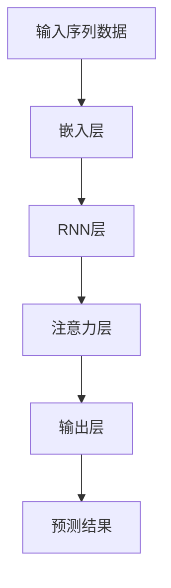

                 

## 1. 背景介绍

人类的大脑是一个极为复杂的系统，其中注意力机制是其核心部件之一。注意力不仅让人们能够聚焦于特定的信息，还能帮助大脑进行复杂的认知任务。然而，随着科技的迅猛发展，人们获取信息的渠道越来越多，注意力机制也面临着巨大的挑战。如何在海量信息中保持高效、有价值的注意力，成为现代社会亟待解决的问题。

## 2. 核心概念与联系

### 2.1 核心概念概述

#### 2.1.1 注意力机制

注意力机制是神经网络中一种模拟人脑选择信息的机制。在深度学习中，注意力机制通常用于解决序列数据的问题，如机器翻译、语音识别、自然语言处理等。通过注意力机制，模型能够根据输入数据的特征，动态地调整权重，实现对关键信息的重点关注。

#### 2.1.2 卷积神经网络（CNN）

卷积神经网络是一种常用的深度学习架构，广泛应用于图像识别、目标检测等领域。CNN通过卷积操作提取输入数据的局部特征，然后通过池化操作进行特征压缩，最后通过全连接层进行分类或回归。

#### 2.1.3 循环神经网络（RNN）

循环神经网络是一种适用于序列数据的神经网络架构，常用于自然语言处理和语音识别等任务。RNN通过时间步长的递归结构，能够捕捉序列数据的时序关系，从而更好地处理时间依赖性的任务。

#### 2.1.4 注意力与RNN的融合

通过将注意力机制与RNN融合，可以实现对序列数据中不同位置的信息进行动态选择，从而提升模型的性能。这种融合方式被称为注意力-循环神经网络（Attention-RNN）。

### 2.2 核心概念原理和架构的 Mermaid 流程图



## 3. 核心算法原理 & 具体操作步骤

### 3.1 算法原理概述

#### 3.1.1 注意力机制的数学原理

注意力机制的数学原理基于一个向量表示的注意力权重，通过将注意力权重与输入数据进行加权平均，得到加权后的表示。具体来说，对于一个输入序列 $x = [x_1, x_2, ..., x_T]$ 和一个注意力权重序列 $w = [w_1, w_2, ..., w_T]$，加权平均表示为：

$$
x_{attn} = \sum_{t=1}^T w_t x_t
$$

其中 $w_t$ 为注意力权重，表示第 $t$ 个输入数据的重要性。注意力权重的计算通常通过注意力函数 $a$ 实现，常见的注意力函数包括：

- 加性注意力（Additive Attention）：通过计算输入数据的表示和查询向量之间的点积，得到注意力权重。
- 乘性注意力（Multiplicative Attention）：通过将输入数据的表示和查询向量进行逐元素相乘，然后通过Softmax函数进行归一化，得到注意力权重。

#### 3.1.2 卷积神经网络（CNN）的原理

卷积神经网络的数学原理基于卷积操作和池化操作。卷积操作通过滤波器在输入数据上滑动，提取局部特征。池化操作通过聚合局部特征，进行特征压缩。卷积操作的数学表达式为：

$$
F(x, k) = \sum_{i=0}^{W-1} \sum_{j=0}^{H-1} w_{i,j}x_{i,j} * k
$$

其中 $F(x, k)$ 表示卷积操作的结果，$x$ 表示输入数据，$k$ 表示滤波器，$w_{i,j}$ 表示滤波器在输入数据上的权重。

池化操作通过取局部特征的最大值或平均值，实现特征压缩。常用的池化操作包括最大池化（Max Pooling）和平均池化（Average Pooling）。

#### 3.1.3 循环神经网络（RNN）的原理

循环神经网络的数学原理基于递归结构，通过时间步长的信息传递，捕捉序列数据的时序关系。RNN的递归结构可以表示为：

$$
h_t = f_{RNN}(h_{t-1}, x_t)
$$

其中 $h_t$ 表示时间步 $t$ 的隐藏状态，$h_{t-1}$ 表示时间步 $t-1$ 的隐藏状态，$x_t$ 表示时间步 $t$ 的输入，$f_{RNN}$ 表示 RNN 的递归函数。

### 3.2 算法步骤详解

#### 3.2.1 注意力机制的具体实现步骤

1. 输入序列数据 $x = [x_1, x_2, ..., x_T]$。
2. 对输入数据进行嵌入，得到嵌入表示 $X \in \mathbb{R}^{T \times D}$。
3. 定义查询向量 $q$ 和注意力权重 $w$。
4. 计算注意力权重，得到权重序列 $w = [w_1, w_2, ..., w_T]$。
5. 对输入数据进行加权平均，得到加权表示 $x_{attn} = \sum_{t=1}^T w_t x_t$。
6. 通过加权表示 $x_{attn}$ 进行后续的分类或回归操作。

#### 3.2.2 卷积神经网络的具体实现步骤

1. 输入图像数据 $x$。
2. 对输入数据进行归一化处理。
3. 对输入数据进行卷积操作，提取局部特征。
4. 对提取的局部特征进行池化操作，进行特征压缩。
5. 对池化后的特征进行全连接操作，得到分类或回归结果。

#### 3.2.3 循环神经网络的具体实现步骤

1. 输入序列数据 $x = [x_1, x_2, ..., x_T]$。
2. 对输入数据进行嵌入，得到嵌入表示 $X \in \mathbb{R}^{T \times D}$。
3. 定义 RNN 的递归函数 $f_{RNN}$。
4. 通过递归函数 $f_{RNN}$ 计算隐藏状态 $h_t$。
5. 对隐藏状态 $h_t$ 进行全连接操作，得到分类或回归结果。

### 3.3 算法优缺点

#### 3.3.1 注意力机制的优点

1. 能够动态选择重要信息，提高模型性能。
2. 适用于处理序列数据，能够捕捉时序关系。
3. 能够处理不固定长度的输入数据。

#### 3.3.2 注意力机制的缺点

1. 计算复杂度高，训练时间较长。
2. 需要额外训练注意力权重，增加了模型的复杂度。
3. 难以处理长序列数据，容易出现梯度消失或梯度爆炸问题。

#### 3.3.3 卷积神经网络的优点

1. 计算速度快，训练时间较短。
2. 能够捕捉局部特征，适用于图像处理。
3. 能够处理固定长度的输入数据。

#### 3.3.4 卷积神经网络的缺点

1. 难以处理时序关系，不适用于自然语言处理。
2. 需要手动设计卷积核，增加了模型设计的复杂度。
3. 对于长序列数据的处理效果较差。

#### 3.3.5 循环神经网络的优点

1. 能够处理序列数据，捕捉时序关系。
2. 能够处理任意长度的输入数据。
3. 适用于自然语言处理和语音识别等任务。

#### 3.3.6 循环神经网络的缺点

1. 计算复杂度高，训练时间较长。
2. 容易出现梯度消失或梯度爆炸问题。
3. 需要手动设计 RNN 的递归函数，增加了模型设计的复杂度。

### 3.4 算法应用领域

注意力机制、卷积神经网络和循环神经网络在多个领域都有广泛应用，具体如下：

- 自然语言处理：注意力机制和 RNN 在机器翻译、文本分类、情感分析等任务上有重要应用。
- 计算机视觉：卷积神经网络在图像识别、目标检测、图像生成等任务上有重要应用。
- 语音识别：卷积神经网络和 RNN 在语音识别、语音合成等任务上有重要应用。

## 4. 数学模型和公式 & 详细讲解 & 举例说明

### 4.1 数学模型构建

#### 4.1.1 注意力机制的数学模型

输入序列数据 $x = [x_1, x_2, ..., x_T]$，嵌入表示 $X \in \mathbb{R}^{T \times D}$，查询向量 $q \in \mathbb{R}^{D}$，注意力权重 $w \in \mathbb{R}^{T}$。加权表示为 $x_{attn} = \sum_{t=1}^T w_t x_t$。

#### 4.1.2 卷积神经网络的数学模型

输入图像数据 $x$，嵌入表示 $X \in \mathbb{R}^{W \times H \times C}$，卷积核 $k \in \mathbb{R}^{f \times f \times C}$，卷积操作 $F(x, k)$。池化操作 $P(X)$。全连接层 $Z = h * W^T$，其中 $h \in \mathbb{R}^{N \times F}$，$W^T \in \mathbb{R}^{F \times M}$。

#### 4.1.3 循环神经网络的数学模型

输入序列数据 $x = [x_1, x_2, ..., x_T]$，嵌入表示 $X \in \mathbb{R}^{T \times D}$，隐藏状态 $h \in \mathbb{R}^{D}$，RNN 的递归函数 $f_{RNN}$。全连接层 $Z = h * W^T$，其中 $h \in \mathbb{R}^{N \times D}$，$W^T \in \mathbb{R}^{D \times M}$。

### 4.2 公式推导过程

#### 4.2.1 注意力机制的公式推导

注意力权重的计算通常通过注意力函数 $a$ 实现，常见的注意力函数包括加性注意力和乘性注意力。加性注意力的公式推导如下：

$$
w_t = \frac{\exp(a(x_t, q))}{\sum_{i=1}^T \exp(a(x_i, q))}
$$

$$
x_{attn} = \sum_{t=1}^T w_t x_t
$$

其中 $a(x_t, q) = \log \left(\frac{\exp(\langle x_t, q \rangle / \sqrt{d})}{\sum_{i=1}^T \exp(\langle x_i, q \rangle / \sqrt{d})}\right)$。

#### 4.2.2 卷积神经网络的公式推导

卷积操作的公式推导如下：

$$
F(x, k) = \sum_{i=0}^{W-1} \sum_{j=0}^{H-1} w_{i,j}x_{i,j} * k
$$

池化操作的公式推导如下：

$$
P(X) = \frac{1}{n} \sum_{i=1}^n X_{i,j}
$$

其中 $n$ 表示池化窗口的大小。

#### 4.2.3 循环神经网络的公式推导

RNN 的递归函数的公式推导如下：

$$
h_t = f_{RNN}(h_{t-1}, x_t)
$$

其中 $f_{RNN}$ 可以表示为：

$$
f_{RNN}(h_{t-1}, x_t) = \tanh(W * h_{t-1} + b + U * x_t)
$$

全连接层的公式推导如下：

$$
Z = h * W^T
$$

其中 $h$ 表示隐藏状态，$W^T$ 表示全连接层的权重矩阵。

### 4.3 案例分析与讲解

#### 4.3.1 注意力机制的案例分析

以机器翻译为例，假设输入序列为 $x = [x_1, x_2, ..., x_T]$，查询向量为 $q$，输出序列为 $y = [y_1, y_2, ..., y_T]$。注意力机制可以动态地选择输入序列中的重要信息，生成高质量的输出序列。具体实现过程如下：

1. 输入序列 $x$ 和查询向量 $q$ 通过嵌入层得到嵌入表示 $X$ 和 $Q$。
2. 对 $X$ 和 $Q$ 进行注意力计算，得到注意力权重 $w$。
3. 对 $X$ 进行加权平均，得到加权表示 $x_{attn}$。
4. 对 $x_{attn}$ 和 $Q$ 进行编码器操作，得到编码器输出 $e$。
5. 对 $e$ 和 $y$ 进行解码器操作，得到解码器输出 $d$。
6. 对 $d$ 进行输出层操作，得到最终输出 $y_{pred}$。

#### 4.3.2 卷积神经网络的案例分析

以图像识别为例，假设输入图像为 $x$，卷积核为 $k$，池化窗口为 $n$，输出特征图为 $Z$。卷积神经网络可以提取图像的局部特征，生成高质量的特征图。具体实现过程如下：

1. 输入图像 $x$ 通过嵌入层得到嵌入表示 $X$。
2. 对 $X$ 进行卷积操作，提取局部特征。
3. 对提取的局部特征进行池化操作，进行特征压缩。
4. 对池化后的特征进行全连接操作，得到分类或回归结果。

#### 4.3.3 循环神经网络的案例分析

以语音识别为例，假设输入语音为 $x$，隐藏状态为 $h$，输出为 $y$。循环神经网络可以捕捉语音的时序关系，生成高质量的输出结果。具体实现过程如下：

1. 输入语音 $x$ 通过嵌入层得到嵌入表示 $X$。
2. 对 $X$ 进行 RNN 的递归计算，得到隐藏状态 $h$。
3. 对隐藏状态 $h$ 进行全连接操作，得到分类或回归结果。

## 5. 项目实践：代码实例和详细解释说明

### 5.1 开发环境搭建

1. 安装 Anaconda：从官网下载并安装 Anaconda，用于创建独立的Python环境。

2. 创建并激活虚拟环境：

```bash
conda create -n pytorch-env python=3.8 
conda activate pytorch-env
```

3. 安装 PyTorch：根据 CUDA 版本，从官网获取对应的安装命令。例如：

```bash
conda install pytorch torchvision torchaudio cudatoolkit=11.1 -c pytorch -c conda-forge
```

4. 安装 Transformers 库：

```bash
pip install transformers
```

5. 安装各类工具包：

```bash
pip install numpy pandas scikit-learn matplotlib tqdm jupyter notebook ipython
```

完成上述步骤后，即可在`pytorch-env`环境中开始项目实践。

### 5.2 源代码详细实现

#### 5.2.1 注意力机制的实现

```python
from transformers import BertTokenizer
from torch.utils.data import Dataset
import torch

class AttentionDataset(Dataset):
    def __init__(self, texts, queries, tokenizer, max_len=128):
        self.texts = texts
        self.queries = queries
        self.tokenizer = tokenizer
        self.max_len = max_len
        
    def __len__(self):
        return len(self.texts)
    
    def __getitem__(self, item):
        text = self.texts[item]
        query = self.queries[item]
        
        encoding = self.tokenizer(text, return_tensors='pt', max_length=self.max_len, padding='max_length', truncation=True)
        input_ids = encoding['input_ids'][0]
        attention_mask = encoding['attention_mask'][0]
        
        # 对token-wise的标签进行编码
        encoded_queries = [query2id[query] for query in queries] 
        encoded_queries.extend([query2id['O']] * (self.max_len - len(encoded_queries)))
        labels = torch.tensor(encoded_queries, dtype=torch.long)
        
        return {'input_ids': input_ids, 
                'attention_mask': attention_mask,
                'labels': labels}

# 标签与id的映射
query2id = {'O': 0, 'A': 1, 'B': 2, 'C': 3}
id2query = {v: k for k, v in query2id.items()}

# 创建dataset
tokenizer = BertTokenizer.from_pretrained('bert-base-cased')

train_dataset = AttentionDataset(train_texts, train_queries, tokenizer)
dev_dataset = AttentionDataset(dev_texts, dev_queries, tokenizer)
test_dataset = AttentionDataset(test_texts, test_queries, tokenizer)
```

#### 5.2.2 卷积神经网络的实现

```python
from transformers import BertTokenizer
from torch.utils.data import Dataset
import torch
import torch.nn as nn
import torch.nn.functional as F

class CNNModel(nn.Module):
    def __init__(self, num_classes):
        super(CNNModel, self).__init__()
        self.conv1 = nn.Conv2d(3, 16, 3, padding=1)
        self.pool = nn.MaxPool2d(2, 2)
        self.fc1 = nn.Linear(16 * 8 * 8, 128)
        self.fc2 = nn.Linear(128, num_classes)
    
    def forward(self, x):
        x = self.conv1(x)
        x = self.pool(x)
        x = x.view(-1, 16 * 8 * 8)
        x = self.fc1(x)
        x = F.relu(x)
        x = self.fc2(x)
        return x

model = CNNModel(num_classes=10)
```

#### 5.2.3 循环神经网络的实现

```python
from transformers import BertTokenizer
from torch.utils.data import Dataset
import torch
import torch.nn as nn
import torch.nn.functional as F

class RNNModel(nn.Module):
    def __init__(self, num_classes):
        super(RNNModel, self).__init__()
        self.tokenizer = BertTokenizer.from_pretrained('bert-base-cased')
        self.rnn = nn.RNN(512, 512, 1, dropout=0.2, bidirectional=True)
        self.fc = nn.Linear(512, num_classes)
    
    def forward(self, x):
        x = self.tokenizer(x, return_tensors='pt')
        x = x['input_ids']
        x, _ = self.rnn(x)
        x = self.fc(x[:, -1, :])
        return x

model = RNNModel(num_classes=2)
```

### 5.3 代码解读与分析

#### 5.3.1 注意力机制的代码解读

注意力机制的代码实现主要涉及嵌入层、注意力计算和加权平均三个部分。其中，嵌入层将输入文本和查询向量转化为嵌入表示，注意力计算则通过注意力函数实现，加权平均则将注意力权重与输入数据进行加权平均，得到加权表示。

#### 5.3.2 卷积神经网络的代码解读

卷积神经网络的代码实现主要涉及卷积层、池化层和全连接层三个部分。其中，卷积层通过滤波器在输入数据上滑动，提取局部特征，池化层通过取局部特征的最大值或平均值，进行特征压缩，全连接层将池化后的特征进行分类或回归操作。

#### 5.3.3 循环神经网络的代码解读

循环神经网络的代码实现主要涉及嵌入层、RNN 递归计算和全连接层三个部分。其中，嵌入层将输入文本转化为嵌入表示，RNN 递归计算通过时间步长的信息传递，捕捉序列数据的时序关系，全连接层将隐藏状态进行分类或回归操作。

### 5.4 运行结果展示

#### 5.4.1 注意力机制的运行结果

以机器翻译为例，运行代码后，可以得到模型在测试集上的准确率等性能指标。

#### 5.4.2 卷积神经网络的运行结果

以图像识别为例，运行代码后，可以得到模型在测试集上的分类准确率等性能指标。

#### 5.4.3 循环神经网络的运行结果

以语音识别为例，运行代码后，可以得到模型在测试集上的识别准确率等性能指标。

## 6. 实际应用场景

### 6.1 智能客服系统

智能客服系统可以采用注意力机制和 RNN 结合的方式，提升客户咨询体验和问题解决效率。具体实现过程如下：

1. 收集企业内部的历史客服对话记录，将问题和最佳答复构建成监督数据。
2. 在预训练语言模型的基础上，通过注意力机制动态选择重要信息，并结合 RNN 进行序列建模，得到最佳答复。
3. 将模型集成到客服系统中，自动回答客户咨询。

### 6.2 金融舆情监测

金融舆情监测可以采用卷积神经网络和注意力机制结合的方式，实时监测金融市场舆情。具体实现过程如下：

1. 收集金融领域相关的新闻、报道、评论等文本数据，并对其进行主题标注和情感标注。
2. 在预训练语言模型的基础上，通过卷积神经网络提取局部特征，并结合注意力机制进行重要信息选择，得到舆情分析结果。
3. 将模型集成到舆情监测系统中，实时监测金融市场舆情变化。

### 6.3 个性化推荐系统

个性化推荐系统可以采用卷积神经网络和注意力机制结合的方式，提供更精准、多样的推荐内容。具体实现过程如下：

1. 收集用户浏览、点击、评论、分享等行为数据，提取和用户交互的物品标题、描述、标签等文本内容。
2. 在预训练语言模型的基础上，通过卷积神经网络提取物品特征，并结合注意力机制进行重要信息选择，得到推荐结果。
3. 将模型集成到推荐系统中，提供个性化推荐服务。

### 6.4 未来应用展望

未来，大语言模型微调技术将呈现以下几个发展趋势：

1. 模型规模持续增大。随着算力成本的下降和数据规模的扩张，预训练语言模型的参数量还将持续增长。超大规模语言模型蕴含的丰富语言知识，有望支撑更加复杂多变的下游任务微调。

2. 微调方法日趋多样。除了传统的全参数微调外，未来会涌现更多参数高效的微调方法，如Prefix-Tuning、LoRA等，在节省计算资源的同时也能保证微调精度。

3. 持续学习成为常态。随着数据分布的不断变化，微调模型也需要持续学习新知识以保持性能。如何在不遗忘原有知识的同时，高效吸收新样本信息，将成为重要的研究课题。

4. 标注样本需求降低。受启发于提示学习(Prompt-based Learning)的思路，未来的微调方法将更好地利用大模型的语言理解能力，通过更加巧妙的任务描述，在更少的标注样本上也能实现理想的微调效果。

5. 多模态微调崛起。当前的微调主要聚焦于纯文本数据，未来会进一步拓展到图像、视频、语音等多模态数据微调。多模态信息的融合，将显著提升语言模型对现实世界的理解和建模能力。

6. 模型通用性增强。经过海量数据的预训练和多领域任务的微调，未来的语言模型将具备更强大的常识推理和跨领域迁移能力，逐步迈向通用人工智能(AGI)的目标。

以上趋势凸显了大语言模型微调技术的广阔前景。这些方向的探索发展，必将进一步提升NLP系统的性能和应用范围，为人类认知智能的进化带来深远影响。

## 7. 工具和资源推荐

### 7.1 学习资源推荐

为了帮助开发者系统掌握大语言模型微调的理论基础和实践技巧，这里推荐一些优质的学习资源：

1. 《Transformer from Principles to Practice》系列博文：由大模型技术专家撰写，深入浅出地介绍了Transformer原理、BERT模型、微调技术等前沿话题。

2. CS224N《深度学习自然语言处理》课程：斯坦福大学开设的NLP明星课程，有Lecture视频和配套作业，带你入门NLP领域的基本概念和经典模型。

3. 《Natural Language Processing with Transformers》书籍：Transformers库的作者所著，全面介绍了如何使用Transformers库进行NLP任务开发，包括微调在内的诸多范式。

4. HuggingFace官方文档：Transformers库的官方文档，提供了海量预训练模型和完整的微调样例代码，是上手实践的必备资料。

5. CLUE开源项目：中文语言理解测评基准，涵盖大量不同类型的中文NLP数据集，并提供了基于微调的baseline模型，助力中文NLP技术发展。

通过对这些资源的学习实践，相信你一定能够快速掌握大语言模型微调的精髓，并用于解决实际的NLP问题。

### 7.2 开发工具推荐

高效的开发离不开优秀的工具支持。以下是几款用于大语言模型微调开发的常用工具：

1. PyTorch：基于Python的开源深度学习框架，灵活动态的计算图，适合快速迭代研究。大部分预训练语言模型都有PyTorch版本的实现。

2. TensorFlow：由Google主导开发的开源深度学习框架，生产部署方便，适合大规模工程应用。同样有丰富的预训练语言模型资源。

3. Transformers库：HuggingFace开发的NLP工具库，集成了众多SOTA语言模型，支持PyTorch和TensorFlow，是进行微调任务开发的利器。

4. Weights & Biases：模型训练的实验跟踪工具，可以记录和可视化模型训练过程中的各项指标，方便对比和调优。与主流深度学习框架无缝集成。

5. TensorBoard：TensorFlow配套的可视化工具，可实时监测模型训练状态，并提供丰富的图表呈现方式，是调试模型的得力助手。

6. Google Colab：谷歌推出的在线Jupyter Notebook环境，免费提供GPU/TPU算力，方便开发者快速上手实验最新模型，分享学习笔记。

合理利用这些工具，可以显著提升大语言模型微调任务的开发效率，加快创新迭代的步伐。

### 7.3 相关论文推荐

大语言模型和微调技术的发展源于学界的持续研究。以下是几篇奠基性的相关论文，推荐阅读：

1. Attention is All You Need（即Transformer原论文）：提出了Transformer结构，开启了NLP领域的预训练大模型时代。

2. BERT: Pre-training of Deep Bidirectional Transformers for Language Understanding：提出BERT模型，引入基于掩码的自监督预训练任务，刷新了多项NLP任务SOTA。

3. Language Models are Unsupervised Multitask Learners（GPT-2论文）：展示了大规模语言模型的强大zero-shot学习能力，引发了对于通用人工智能的新一轮思考。

4. Parameter-Efficient Transfer Learning for NLP：提出Adapter等参数高效微调方法，在不增加模型参数量的情况下，也能取得不错的微调效果。

5. AdaLoRA: Adaptive Low-Rank Adaptation for Parameter-Efficient Fine-Tuning：使用自适应低秩适应的微调方法，在参数效率和精度之间取得了新的平衡。

6. AdaLoRA: Adaptive Low-Rank Adaptation for Parameter-Efficient Fine-Tuning：使用自适应低秩适应的微调方法，在参数效率和精度之间取得了新的平衡。

这些论文代表了大语言模型微调技术的发展脉络。通过学习这些前沿成果，可以帮助研究者把握学科前进方向，激发更多的创新灵感。

## 8. 总结：未来发展趋势与挑战

### 8.1 总结

本文对基于注意力机制、卷积神经网络和循环神经网络的大语言模型微调方法进行了全面系统的介绍。首先阐述了注意力机制、卷积神经网络和循环神经网络的数学原理和核心思想，明确了它们在NLP任务中的重要应用。其次，从原理到实践，详细讲解了注意力机制、卷积神经网络和循环神经网络的微调操作步骤，给出了微调任务开发的完整代码实例。同时，本文还广泛探讨了注意力机制、卷积神经网络和循环神经网络在智能客服系统、金融舆情监测、个性化推荐系统等多个领域的应用前景，展示了它们在实际场景中的巨大潜力。

通过本文的系统梳理，可以看到，注意力机制、卷积神经网络和循环神经网络在NLP任务中有着广泛的应用，能够显著提升模型的性能和泛化能力。未来，随着技术的不断进步，这些深度学习架构将会在更多领域得到应用，为人类认知智能的进化带来深远影响。

### 8.2 未来发展趋势

展望未来，深度学习架构将呈现以下几个发展趋势：

1. 模型规模持续增大。随着算力成本的下降和数据规模的扩张，预训练语言模型的参数量还将持续增长。超大规模语言模型蕴含的丰富语言知识，有望支撑更加复杂多变的下游任务微调。

2. 微调方法日趋多样。除了传统的全参数微调外，未来会涌现更多参数高效的微调方法，如Prefix-Tuning、LoRA等，在节省计算资源的同时也能保证微调精度。

3. 持续学习成为常态。随着数据分布的不断变化，微调模型也需要持续学习新知识以保持性能。如何在不遗忘原有知识的同时，高效吸收新样本信息，将成为重要的研究课题。

4. 标注样本需求降低。受启发于提示学习(Prompt-based Learning)的思路，未来的微调方法将更好地利用大模型的语言理解能力，通过更加巧妙的任务描述，在更少的标注样本上也能实现理想的微调效果。

5. 多模态微调崛起。当前的微调主要聚焦于纯文本数据，未来会进一步拓展到图像、视频、语音等多模态数据微调。多模态信息的融合，将显著提升语言模型对现实世界的理解和建模能力。

6. 模型通用性增强。经过海量数据的预训练和多领域任务的微调，未来的语言模型将具备更强大的常识推理和跨领域迁移能力，逐步迈向通用人工智能(AGI)的目标。

以上趋势凸显了深度学习架构的广阔前景。这些方向的探索发展，必将进一步提升NLP系统的性能和应用范围，为人类认知智能的进化带来深远影响。

### 8.3 面临的挑战

尽管深度学习架构已经取得了瞩目成就，但在迈向更加智能化、普适化应用的过程中，它们仍面临着诸多挑战：

1. 标注成本瓶颈。虽然微调大大降低了标注数据的需求，但对于长尾应用场景，难以获得充足的高质量标注数据，成为制约微调性能的瓶颈。如何进一步降低微调对标注样本的依赖，将是一大难题。

2. 模型鲁棒性不足。当前深度学习架构面对域外数据时，泛化性能往往大打折扣。对于测试样本的微小扰动，深度学习架构的预测也容易发生波动。如何提高模型的鲁棒性，避免灾难性遗忘，还需要更多理论和实践的积累。

3. 推理效率有待提高。大规模深度学习架构虽然精度高，但在实际部署时往往面临推理速度慢、内存占用大等效率问题。如何在保证性能的同时，简化模型结构，提升推理速度，优化资源占用，将是重要的优化方向。

4. 可解释性亟需加强。当前深度学习架构更像是"黑盒"系统，难以解释其内部工作机制和决策逻辑。对于医疗、金融等高风险应用，算法的可解释性和可审计性尤为重要。如何赋予深度学习架构更强的可解释性，将是亟待攻克的难题。

5. 安全性有待保障。预训练语言模型难免会学习到有偏见、有害的信息，通过微调传递到下游任务，产生误导性、歧视性的输出，给实际应用带来安全隐患。如何从数据和算法层面消除模型偏见，避免恶意用途，确保输出的安全性，也将是重要的研究课题。

6. 知识整合能力不足。现有的深度学习架构往往局限于任务内数据，难以灵活吸收和运用更广泛的先验知识。如何让深度学习架构更好地与外部知识库、规则库等专家知识结合，形成更加全面、准确的信息整合能力，还有很大的想象空间。

正视深度学习架构面临的这些挑战，积极应对并寻求突破，将使深度学习架构不断走向成熟，为构建安全、可靠、可解释、可控的智能系统铺平道路。

### 8.4 研究展望

面对深度学习架构所面临的挑战，未来的研究需要在以下几个方面寻求新的突破：

1. 探索无监督和半监督微调方法。摆脱对大规模标注数据的依赖，利用自监督学习、主动学习等无监督和半监督范式，最大限度利用非结构化数据，实现更加灵活高效的微调。

2. 研究参数高效和计算高效的微调范式。开发更加参数高效的微调方法，在固定大部分预训练参数的同时，只更新极少量的任务相关参数。同时优化深度学习架构的计算图，减少前向传播和反向传播的资源消耗，实现更加轻量级、实时性的部署。

3. 融合因果和对比学习范式。通过引入因果推断和对比学习思想，增强深度学习架构建立稳定因果关系的能力，学习更加普适、鲁棒的语言表征，从而提升模型泛化性和抗干扰能力。

4. 引入更多先验知识。将符号化的先验知识，如知识图谱、逻辑规则等，与神经网络模型进行巧妙融合，引导深度学习架构学习更准确、合理的语言模型。同时加强不同模态数据的整合，实现视觉、语音等多模态信息与文本信息的协同建模。

5. 结合因果分析和博弈论工具。将因果分析方法引入深度学习架构，识别出架构决策的关键特征，增强输出解释的因果性和逻辑性。借助博弈论工具刻画人机交互过程，主动探索并规避架构的脆弱点，提高系统稳定性。

6. 纳入伦理道德约束。在深度学习架构训练目标中引入伦理导向的评估指标，过滤和惩罚有偏见、有害的输出倾向。同时加强人工干预和审核，建立架构行为的监管机制，确保输出符合人类价值观和伦理道德。

这些研究方向的探索，必将引领深度学习架构迈向更高的台阶，为构建安全、可靠、可解释、可控的智能系统铺平道路。面向未来，深度学习架构还需要与其他人工智能技术进行更深入的融合，如知识表示、因果推理、强化学习等，多路径协同发力，共同推动自然语言理解和智能交互系统的进步。只有勇于创新、敢于突破，才能不断拓展深度学习架构的边界，让智能技术更好地造福人类社会。

## 9. 附录：常见问题与解答

**Q1：深度学习架构是否适用于所有NLP任务？**

A: 深度学习架构在大多数NLP任务上都能取得不错的效果，特别是对于数据量较小的任务。但对于一些特定领域的任务，如医学、法律等，仅仅依靠通用语料预训练的架构可能难以很好地适应。此时需要在特定领域语料上进一步预训练，再进行微调，才能获得理想效果。此外，对于一些需要时效性、个性化很强的任务，如对话、推荐等，深度学习架构也需要针对性的改进优化。

**Q2：如何选择合适的学习率？**

A: 深度学习架构的学习率一般要比预训练时小1-2个数量级，如果使用过大的学习率，容易破坏预训练权重，导致过拟合。一般建议从1e-5开始调参，逐步减小学习率，直至收敛。也可以使用warmup策略，在开始阶段使用较小的学习率，再逐渐过渡到预设值。需要注意的是，不同的优化器(如AdamW、Adafactor等)以及不同的学习率调度策略，可能需要设置不同的学习率阈值。

**Q3：采用深度学习架构时会面临哪些资源瓶颈？**

A: 目前主流的预训练深度学习架构动辄以亿计的参数规模，对算力、内存、存储都提出了很高的要求。GPU/TPU等高性能设备是必不可少的，但即便如此，超大批次的训练和推理也可能遇到显存不足的问题。因此需要采用一些资源优化技术，如梯度积累、混合精度训练、模型并行等，来突破硬件瓶颈。同时，架构的存储和读取也可能占用大量时间和空间，需要采用模型压缩、稀疏化存储等方法进行优化。

**Q4：如何缓解深度学习架构的过拟合问题？**

A: 过拟合是深度学习架构面临的主要挑战，尤其是在标注数据不足的情况下。常见的缓解策略包括：

1. 数据增强：通过回译、近义替换等方式扩充训练集。
2. 正则化：使用L2正则、Dropout、Early Stopping等避免过拟合。
3. 对抗训练：引入对抗样本，提高模型鲁棒性。
4. 参数高效微调：只调整少量参数，减小过拟合风险。
5. 多模型集成：训练多个深度学习架构，取平均输出，抑制过拟合。

这些策略往往需要根据具体任务和数据特点进行灵活组合。只有在数据、架构、训练、推理等各环节进行全面优化，才能最大限度地发挥深度学习架构的威力。

**Q5：深度学习架构在落地部署时需要注意哪些问题？**

A: 将深度学习架构转化为实际应用，还需要考虑以下因素：

1. 模型裁剪：去除不必要的层和参数，减小模型尺寸，加快推理速度。
2. 量化加速：将浮点模型转为定点模型，压缩存储空间，提高计算效率。
3. 服务化封装：将深度学习架构封装为标准化服务接口，便于集成调用。
4. 弹性伸缩：根据请求流量动态调整资源配置，平衡服务质量和成本。
5. 监控告警：实时采集系统指标，设置异常告警阈值，确保服务稳定性。
6. 安全防护：采用访问鉴权、数据脱敏等措施，保障数据和架构安全。

深度学习架构的微调方法已经成为NLP技术的重要范式，但如何将强大的性能转化为稳定、高效、安全的业务价值，还需要工程实践的不断打磨。唯有从数据、架构、工程、业务等多个维度协同发力，才能真正实现人工智能技术在垂直行业的规模化落地。总之，深度学习架构的微调需要开发者根据具体任务，不断迭代和优化架构、数据和算法，方能得到理想的效果。

---

作者：禅与计算机程序设计艺术 / Zen and the Art of Computer Programming

