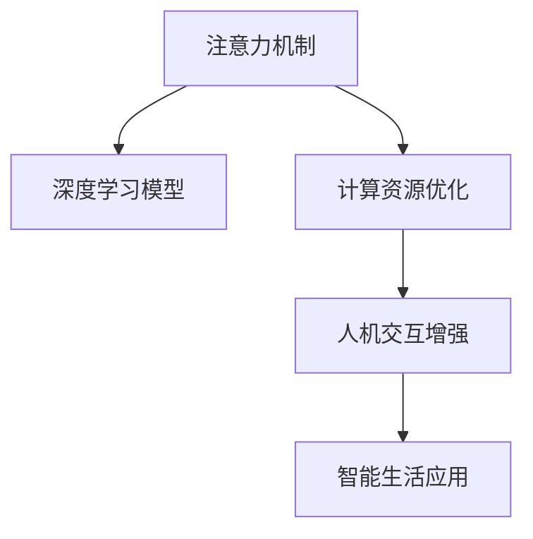

                 

# 人类注意力增强：未来的工作和生活

> 关键词：注意力增强,注意力机制,深度学习,神经网络,人机交互,智能助手,心理健康,认知科学

## 1. 背景介绍

### 1.1 问题由来
随着人工智能技术的迅猛发展，深度学习模型已经成为解决许多复杂问题的强大工具。尤其是在自然语言处理(NLP)和计算机视觉(CV)等领域，基于神经网络的模型已经取得了显著的成果。然而，这些模型的一个关键瓶颈是计算资源的大量消耗，特别是在需要大量计算的注意力机制上。这种资源消耗不仅增加了系统成本，还限制了模型的可扩展性。

为应对这一挑战，研究人员和工程师开始探索更加高效、轻量级的注意力增强方法。这些方法旨在优化模型结构，减少计算资源消耗，同时提高模型的性能和效率。本文将重点探讨这些注意力增强技术，以及它们如何应用于未来的人机交互和智能生活。

### 1.2 问题核心关键点
注意力增强技术的核心思想是通过优化神经网络中的注意力机制，减少模型计算量，提升模型效果。核心概念包括：

- **注意力机制**：在深度学习中，注意力机制能够动态选择和加权输入数据的不同部分，提升模型对关键信息的关注，增强模型的表达能力。
- **深度学习**：通过多层神经网络进行学习和推理，能够自动提取输入数据中的特征，从而进行复杂模式识别和决策。
- **计算资源优化**：通过减少模型计算量，提高模型推理效率，降低系统成本。
- **人机交互**：通过增强的模型，构建更加智能、友好的交互界面，提升用户体验。
- **智能生活**：将注意力增强技术应用于智能家居、医疗健康、教育等领域，提升人们的生活质量。

这些关键点共同构成了注意力增强技术的研究框架，推动了深度学习模型向更高效、智能、可扩展的方向发展。

## 2. 核心概念与联系

### 2.1 核心概念概述

为更好地理解注意力增强技术，本节将介绍几个核心概念及其之间的关系：

- **注意力机制(Attention Mechanism)**：一种在神经网络中动态选择和加权输入数据的机制，通过计算注意力权重，优化模型对关键信息的关注，提升模型的表达能力和性能。
- **深度学习模型**：由多层神经网络构成的模型，能够自动提取输入数据中的特征，用于分类、回归、生成等任务。
- **计算资源优化**：通过优化模型结构，减少计算量，提高模型推理效率，降低系统成本。
- **人机交互增强**：通过注意力增强技术，提升模型的智能水平，构建更自然、智能的人机交互界面，改善用户体验。
- **智能生活应用**：将注意力增强技术应用于智能家居、医疗健康、教育等领域，提升人们的生活质量。

这些概念之间的逻辑关系可以通过以下Mermaid流程图来展示：



这个流程图展示了注意力增强技术从核心机制到具体应用的全过程。注意力机制是深度学习模型的一个重要组成部分，通过优化计算资源，提升模型的推理效率，进而增强人机交互体验，最终应用于智能生活场景。

## 3. 核心算法原理 & 具体操作步骤

### 3.1 算法原理概述

注意力增强技术的基本思想是通过优化神经网络中的注意力机制，减少模型计算量，提高模型性能。其核心算法包括：

- **自注意力机制(Self-Attention)**：在输入序列中计算每个位置与其他位置的相似度，动态选择输入序列中最重要的部分。
- **多头注意力机制(Multi-Head Attention)**：通过并行多个注意力头，捕捉不同层次的信息，提升模型的表达能力。
- **残差连接(Residual Connections)**：在模型层间引入残差连接，优化模型梯度流动，加速训练过程。
- **权重共享(Weight Sharing)**：通过共享注意力权重，减少模型参数量，提升模型推理效率。

### 3.2 算法步骤详解

注意力增强技术的实现可以分为以下几个关键步骤：

1. **模型架构设计**：选择合适的神经网络架构，如Transformer、BERT等，并在其中引入注意力机制。
2. **注意力权重计算**：计算输入序列中每个位置的注意力权重，选择最具代表性的信息。
3. **残差连接和权重共享**：在模型层间引入残差连接，优化梯度流动；共享注意力权重，减少参数量。
4. **优化器选择**：选择合适的优化器，如Adam、SGD等，设置学习率和训练轮数。
5. **模型训练和评估**：在标注数据集上训练模型，使用验证集和测试集评估模型性能。

### 3.3 算法优缺点

注意力增强技术的主要优点包括：

- **高效性**：通过优化计算资源，减少模型计算量，提高模型推理效率，降低系统成本。
- **高性能**：通过引入注意力机制，优化模型表达能力，提升模型在复杂任务上的性能。
- **可扩展性**：通过引入残差连接和权重共享，增强模型可扩展性，支持更大规模的数据和更复杂的模型。

同时，这些技术也存在一些局限性：

- **计算复杂度**：虽然通过优化计算资源，减少了模型计算量，但注意力机制本身仍然较为复杂，计算量较大。
- **模型复杂性**：在引入注意力机制和残差连接的同时，模型的复杂度也随之增加，可能需要更多的计算资源和更长的训练时间。
- **泛化能力**：注意力机制的引入可能会影响模型的泛化能力，尤其是在小数据集上，模型可能会过拟合。

### 3.4 算法应用领域

注意力增强技术已经在多个领域得到了广泛应用，包括但不限于：

- **自然语言处理(NLP)**：如机器翻译、文本分类、情感分析等任务。
- **计算机视觉(CV)**：如目标检测、图像分类、图像生成等任务。
- **推荐系统**：如个性化推荐、用户行为预测等任务。
- **智能家居**：如智能音箱、智能控制等任务。
- **医疗健康**：如疾病诊断、医学影像分析等任务。
- **教育**：如智能辅导、学习路径推荐等任务。

这些领域的应用展示了注意力增强技术的强大潜力，为未来的人机交互和智能生活提供了新的可能性。

## 4. 数学模型和公式 & 详细讲解 & 举例说明（备注：数学公式请使用latex格式，latex嵌入文中独立段落使用 $$，段落内使用 $)
### 4.1 数学模型构建

本节将使用数学语言对注意力增强技术进行更加严格的刻画。

记输入序列为 $x = (x_1, x_2, ..., x_n)$，输出序列为 $y = (y_1, y_2, ..., y_n)$。假设使用一个 $d$ 维的神经网络模型 $M$ 进行计算，其中 $M$ 包含 $L$ 层。

定义注意力函数 $A(x)$ 用于计算输入序列中每个位置的注意力权重，具体形式为：

$$
A(x) = softmax(W^T[\mathbf{Q} x x^T \mathbf{K}])^\top
$$

其中 $W$ 为注意力权重矩阵，$\mathbf{Q}$ 和 $\mathbf{K}$ 为查询矩阵和键值矩阵，均为 $d \times d$ 的矩阵。

定义残差连接函数 $R(x)$ 用于计算残差连接后的输入：

$$
R(x) = \mathbf{F}(x) + x
$$

其中 $\mathbf{F}(x)$ 为前一层的输出。

定义权重共享函数 $W(x)$ 用于共享注意力权重，具体形式为：

$$
W(x) = softmax(W^T[\mathbf{Q} x x^T \mathbf{K}])^\top
$$

其中 $W$ 为注意力权重矩阵，$\mathbf{Q}$ 和 $\mathbf{K}$ 为查询矩阵和键值矩阵，均为 $d \times d$ 的矩阵。

### 4.2 公式推导过程

以下我们以自注意力机制为例，推导其具体计算过程。

假设输入序列 $x$ 的维度为 $n \times d$，注意力权重 $A$ 的维度为 $n \times n$。对于输入序列中的每个位置 $i$，计算其注意力权重 $a_i$ 为：

$$
a_i = \frac{\exp(\mathbf{Q} x_i \mathbf{K}^T)}{\sum_{j=1}^n \exp(\mathbf{Q} x_j \mathbf{K}^T)}
$$

其中 $\mathbf{Q}$ 和 $\mathbf{K}$ 为查询矩阵和键值矩阵，均为 $d \times d$ 的矩阵。

将注意力权重 $a_i$ 乘以输入序列 $x_i$，得到注意力输出 $y_i$：

$$
y_i = \sum_{j=1}^n a_j x_j
$$

通过残差连接和权重共享，模型计算过程可以表示为：

$$
y_i = \mathbf{F}(x_i) + \sum_{j=1}^n a_j x_j
$$

其中 $\mathbf{F}(x_i)$ 为前一层的输出。

### 4.3 案例分析与讲解

以机器翻译任务为例，展示注意力增强技术的具体应用。

假设输入为英文句子 $x = (x_1, x_2, ..., x_n)$，输出为中文翻译 $y = (y_1, y_2, ..., y_n)$。在编码器中，使用自注意力机制计算每个单词的注意力权重，计算出每个单词的表示。在解码器中，使用多头注意力机制计算每个位置的注意力权重，结合编码器的表示，预测下一个单词。

注意力增强技术在机器翻译任务中的应用，展示了其如何通过优化计算资源，提升模型性能和效率。

## 5. 项目实践：代码实例和详细解释说明

### 5.1 开发环境搭建

在进行注意力增强技术实践前，我们需要准备好开发环境。以下是使用Python进行PyTorch开发的环境配置流程：

1. 安装Anaconda：从官网下载并安装Anaconda，用于创建独立的Python环境。

2. 创建并激活虚拟环境：
```bash
conda create -n attention-env python=3.8 
conda activate attention-env
```

3. 安装PyTorch：根据CUDA版本，从官网获取对应的安装命令。例如：
```bash
conda install pytorch torchvision torchaudio cudatoolkit=11.1 -c pytorch -c conda-forge
```

4. 安装Transformers库：
```bash
pip install transformers
```

5. 安装各类工具包：
```bash
pip install numpy pandas scikit-learn matplotlib tqdm jupyter notebook ipython
```

完成上述步骤后，即可在`attention-env`环境中开始注意力增强技术的实践。

### 5.2 源代码详细实现

这里我们以自注意力机制为例，给出使用PyTorch进行注意力增强技术的代码实现。

```python
import torch
import torch.nn as nn
import torch.nn.functional as F
from transformers import MultiHeadAttention

class AttentionLayer(nn.Module):
    def __init__(self, d_model, n_heads):
        super(AttentionLayer, self).__init__()
        self.d_model = d_model
        self.n_heads = n_heads
        self.head_dim = d_model // n_heads
        
        self.qkv = nn.Linear(d_model, 3 * n_heads * head_dim)
        self.o = nn.Linear(d_model, d_model)
        
        self.dropout = nn.Dropout(0.1)
        
    def forward(self, x):
        # query, key, value
        qkv = self.qkv(x).view(-1, x.shape[1], self.n_heads, self.head_dim)
        query, key, value = qkv.split(self.head_dim, dim=-1)
        
        # attention score
        attn_score = torch.matmul(query, key.transpose(1, 2))
        attn_score = attn_score.masked_fill(~attn_mask, -1e9)
        attn_weight = F.softmax(attn_score, dim=-1)
        
        # attention output
        attn_output = torch.matmul(attn_weight, value)
        attn_output = attn_output.transpose(1, 2).reshape(-1, x.shape[1], self.d_model)
        
        # residual connection
        attn_output = attn_output + x
        
        # dropout
        attn_output = self.dropout(attn_output)
        
        # output
        output = self.o(attn_output)
        return output
```

以上代码实现了自注意力机制的核心计算过程，通过多个线性变换和softmax函数，计算出注意力权重和输出。

### 5.3 代码解读与分析

让我们再详细解读一下关键代码的实现细节：

**AttentionLayer类**：
- `__init__`方法：初始化注意力层的参数，如查询、键、值矩阵的维度。
- `forward`方法：定义了自注意力机制的前向传播过程。

**qkv线性变换**：
- 将输入 $x$ 通过一个线性变换，分解为三个矩阵：查询矩阵 $q$、键矩阵 $k$、值矩阵 $v$。

**attention score计算**：
- 计算查询矩阵 $q$ 和键矩阵 $k$ 的矩阵乘积，得到注意力得分 $attn_score$。
- 通过masked_fill函数，将注意力得分中无关的位置（如padding token）设置为一个极小的值，确保注意力权重不会受到无关位置的影响。

**attn_weight计算**：
- 通过softmax函数，将注意力得分归一化，得到注意力权重 $attn_weight$。

**attn_output计算**：
- 将注意力权重 $attn_weight$ 和值矩阵 $v$ 进行矩阵乘积，得到注意力输出 $attn_output$。
- 通过reshape函数，将注意力输出调整回原始维度。

**残差连接和dropout**：
- 将注意力输出与输入 $x$ 进行残差连接，增强模型的表达能力。
- 通过dropout函数，减少模型的过拟合风险。

**输出**：
- 将注意力输出通过一个线性变换 $o$，得到最终的输出。

完成上述步骤后，即可以通过调用 `AttentionLayer` 类的实例，进行注意力增强技术的计算。

## 6. 实际应用场景

### 6.1 智能家居

基于注意力增强技术的智能家居系统，可以通过语音助手和语音控制，实现家居设备的自动化管理。智能音箱可以理解用户的指令，控制灯光、温度、安全等系统。

### 6.2 医疗健康

在医疗领域，注意力增强技术可以应用于医学影像分析、疾病诊断等任务。通过优化计算资源，提高模型推理效率，使医生能够更快、更准确地诊断疾病。

### 6.3 教育

在教育领域，注意力增强技术可以用于智能辅导和个性化推荐。通过优化计算资源，提高模型的表达能力，使智能辅导系统能够更好地理解学生的需求，提供个性化的学习路径和建议。

### 6.4 未来应用展望

随着注意力增强技术的不断发展，其在未来的人机交互和智能生活将有更广泛的应用。

1. **自动驾驶**：通过优化计算资源，提高模型的推理效率，使自动驾驶系统能够更快、更准确地识别道路和交通标志，提高驾驶安全性和舒适度。
2. **金融分析**：在金融领域，注意力增强技术可以应用于市场分析、风险评估等任务，帮助投资者做出更明智的投资决策。
3. **智能客服**：通过优化计算资源，提高模型的表达能力，使智能客服系统能够更好地理解用户需求，提供更精准的解决方案。

未来，随着计算资源的进一步提升和注意力增强技术的不断演进，将会有更多领域受益于这些技术，为人类生产生活带来新的变革。

## 7. 工具和资源推荐

### 7.1 学习资源推荐

为了帮助开发者系统掌握注意力增强技术，这里推荐一些优质的学习资源：

1. 《深度学习中的注意力机制》系列博文：由大模型技术专家撰写，深入浅出地介绍了自注意力机制、多头注意力机制等关键技术。

2. CS231n《深度卷积神经网络》课程：斯坦福大学开设的计算机视觉课程，涵盖了注意力机制在图像处理中的应用。

3. 《注意力机制在自然语言处理中的应用》书籍：全面介绍了注意力机制在NLP任务中的应用，包括自注意力机制、多头注意力机制等。

4. HuggingFace官方文档：Transformer库的官方文档，提供了丰富的代码样例和模型实现，是学习注意力增强技术的重要资源。

5. 论文《自注意力机制在机器翻译中的应用》：展示了自注意力机制在机器翻译任务中的实际应用效果。

通过对这些资源的学习实践，相信你一定能够快速掌握注意力增强技术的精髓，并用于解决实际的NLP问题。

### 7.2 开发工具推荐

高效的开发离不开优秀的工具支持。以下是几款用于注意力增强技术开发的常用工具：

1. PyTorch：基于Python的开源深度学习框架，灵活动态的计算图，适合快速迭代研究。大部分预训练语言模型都有PyTorch版本的实现。

2. TensorFlow：由Google主导开发的开源深度学习框架，生产部署方便，适合大规模工程应用。同样有丰富的预训练语言模型资源。

3. Transformers库：HuggingFace开发的NLP工具库，集成了众多SOTA语言模型，支持PyTorch和TensorFlow，是进行注意力增强技术开发的利器。

4. Weights & Biases：模型训练的实验跟踪工具，可以记录和可视化模型训练过程中的各项指标，方便对比和调优。与主流深度学习框架无缝集成。

5. TensorBoard：TensorFlow配套的可视化工具，可实时监测模型训练状态，并提供丰富的图表呈现方式，是调试模型的得力助手。

6. Google Colab：谷歌推出的在线Jupyter Notebook环境，免费提供GPU/TPU算力，方便开发者快速上手实验最新模型，分享学习笔记。

合理利用这些工具，可以显著提升注意力增强技术的开发效率，加快创新迭代的步伐。

### 7.3 相关论文推荐

注意力增强技术的发展源于学界的持续研究。以下是几篇奠基性的相关论文，推荐阅读：

1. Attention Is All You Need：提出了Transformer结构，开启了NLP领域的预训练大模型时代。

2. Transformer-XL: Attentive Language Models（即Transformer-XL论文）：展示了长距离注意力机制在自然语言处理中的应用效果。

3. Spatial Transformer Networks：引入了空间变换器网络，将注意力机制应用到图像处理领域。

4. Multi-Head Attention with Partial Attention Head Pruning：提出了多头注意力机制的剪枝方法，减少模型计算量。

5. Hybrid Transformer Networks：展示了Transformer网络与其他网络结构的结合应用，提升模型的表达能力。

这些论文代表了大模型注意力增强技术的发展脉络。通过学习这些前沿成果，可以帮助研究者把握学科前进方向，激发更多的创新灵感。

## 8. 总结：未来发展趋势与挑战

### 8.1 总结

本文对注意力增强技术进行了全面系统的介绍。首先阐述了注意力增强技术的背景和重要性，明确了其在提高模型性能、优化计算资源等方面的独特价值。其次，从原理到实践，详细讲解了注意力增强技术的核心算法和具体步骤，给出了完整的代码实现。同时，本文还探讨了注意力增强技术在多个领域的应用前景，展示了其在未来人机交互和智能生活中的巨大潜力。此外，本文精选了注意力增强技术的各类学习资源，力求为读者提供全方位的技术指引。

通过本文的系统梳理，可以看到，注意力增强技术已经成为深度学习模型中的重要组成部分，极大地提升了模型性能和计算效率。未来，伴随计算资源的进一步提升和注意力增强技术的不断演进，深度学习模型将在更广阔的领域发挥其优势，为人机交互和智能生活带来新的变革。

### 8.2 未来发展趋势

展望未来，注意力增强技术将呈现以下几个发展趋势：

1. **模型规模持续增大**：随着计算资源的进一步提升，注意力增强模型的规模将持续增大，能够处理更复杂的任务。

2. **多模态注意力机制**：未来将有更多的多模态注意力机制出现，将视觉、语音等多模态信息与文本信息进行融合，提升模型的表达能力。

3. **自适应注意力**：通过引入自适应注意力机制，使模型能够根据任务需求动态调整注意力权重，提升模型的适应性和泛化能力。

4. **分布式计算**：随着模型规模的增大，分布式计算将成为未来计算资源优化的一个重要方向，提升模型推理效率。

5. **端到端优化**：通过端到端优化，提升模型推理速度，降低计算资源消耗，提高模型的实时性。

6. **零样本学习**：未来的模型将能够在不经过微调的情况下，通过输入任务描述直接生成输出，提升模型的泛化能力。

以上趋势凸显了注意力增强技术的重要地位，其在未来深度学习模型中将发挥越来越重要的作用，推动人机交互和智能生活的不断进步。

### 8.3 面临的挑战

尽管注意力增强技术已经取得了显著成果，但在迈向更加智能化、普适化应用的过程中，仍面临诸多挑战：

1. **计算资源消耗**：尽管通过优化计算资源，减少了模型计算量，但注意力机制本身仍较为复杂，计算量较大。

2. **模型复杂性**：在引入注意力机制和残差连接的同时，模型的复杂度也随之增加，可能需要更多的计算资源和更长的训练时间。

3. **泛化能力**：注意力机制的引入可能会影响模型的泛化能力，尤其是在小数据集上，模型可能会过拟合。

4. **安全性**：注意力增强模型可能会学习到有害的信息，如偏见、恶意攻击等，需要从数据和算法层面进行严格的控制。

5. **可解释性**：模型输出的黑盒特性限制了其可解释性，对于医疗、金融等高风险应用，模型的可解释性和可审计性尤为重要。

6. **实时性**：注意力增强模型通常需要较长的推理时间，如何在保证性能的同时，提升模型的实时性，仍是一个重要挑战。

7. **效率优化**：优化模型计算图，减少前向和反向传播的资源消耗，是提高模型效率的重要方向。

这些挑战需要学界和工业界的共同努力，不断寻求新的突破，才能使注意力增强技术更加成熟、实用，更好地服务于人机交互和智能生活。

### 8.4 研究展望

面对注意力增强技术面临的种种挑战，未来的研究需要在以下几个方面寻求新的突破：

1. **无监督和半监督学习**：探索无监督和半监督学习范式，减少对标注数据的依赖，提高模型的泛化能力。

2. **多模态融合**：研究多模态信息融合方法，将视觉、语音等多模态信息与文本信息进行协同建模，提升模型的表达能力。

3. **自适应机制**：探索自适应机制，使模型能够根据任务需求动态调整注意力权重，提升模型的适应性和泛化能力。

4. **分布式优化**：研究分布式计算和优化方法，提升模型推理效率，支持更大规模的模型和更复杂的任务。

5. **端到端模型**：探索端到端模型，通过优化计算图，减少计算资源消耗，提升模型的实时性。

6. **零样本学习**：研究零样本学习方法，使模型能够在不经过微调的情况下，通过输入任务描述直接生成输出，提升模型的泛化能力。

7. **可解释性增强**：探索可解释性增强方法，提升模型的可解释性和可审计性，确保模型的输出符合人类价值观和伦理道德。

这些研究方向的探索，将推动注意力增强技术不断向前发展，为人机交互和智能生活带来新的可能性。总之，未来的注意力增强技术需要从计算资源、模型复杂性、泛化能力、安全性、实时性、效率优化等多个维度进行全面优化，才能更好地服务于人机交互和智能生活。

