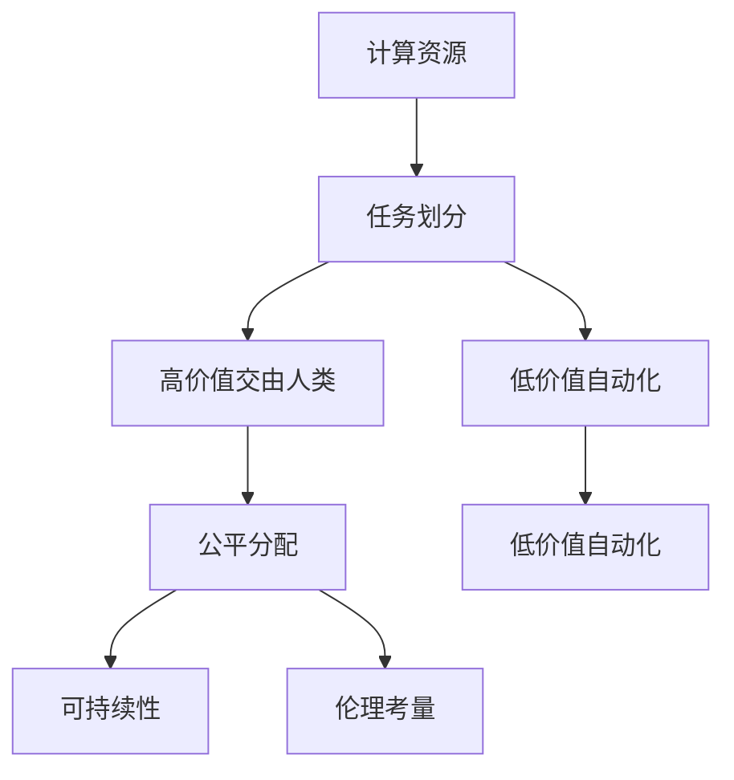

                 

## 1. 背景介绍

在人类社会的演进历史中，计算技术扮演着至关重要的角色。从早期的机械计算到现代的电子计算机，每一次技术的飞跃都极大地提升了生产力，推动了社会的进步。然而，随着计算技术的不断进步，我们正处于一个新的历史节点，即“人类计算”（Human Computation）时代。

### 1.1 问题由来

随着人工智能（AI）、大数据、云计算等技术的迅猛发展，计算不再局限于人类，而是逐步被赋予到机器和算法中。这种转变不仅在技术层面带来了革命性的改变，也在社会、经济、伦理等多个方面产生了深远的影响。如何在这一时代背景下，充分利用计算技术，创造一个更加公平、公正和可持续的未来，成为当下社会的重要课题。

### 1.2 问题核心关键点

人类计算的核心在于将复杂的计算任务交由人类和机器共同完成，实现最优的资源分配。其关键点包括：

- **任务协同**：如何将重复性、低价值的任务自动化，将复杂性、高创造性的任务交由人类处理。
- **公平分配**：如何在不同社会群体之间公平分配计算资源，避免技术鸿沟。
- **可持续性**：如何设计计算模型，使其既高效又环保，实现可持续发展。
- **伦理考量**：在计算过程中，如何保护个人隐私，避免算法的偏见和歧视。

### 1.3 问题研究意义

研究人类计算技术，对于构建一个高效、公平、可持续的社会，具有重要意义：

- **提升生产力**：自动化低价值任务，将人力资源释放至高创造性工作，提升整体生产力。
- **缩小差距**：通过公平分配计算资源，缩小社会阶层差距，促进社会平等。
- **环保发展**：开发高效节能的计算模型，减少能源消耗，实现可持续发展。
- **伦理保障**：设计伦理友好的算法，保护个人隐私，避免技术滥用。

本文旨在深入探讨人类计算的核心概念、原理和实践，为未来技术发展和社会变革提供参考。

## 2. 核心概念与联系

### 2.1 核心概念概述

人类计算的本质是将人类智慧与计算技术相结合，实现任务的高效协同。这一过程涉及到多个核心概念：

- **计算资源**：包括硬件资源（如CPU、GPU、TPU等）和软件资源（如算法、模型等）。
- **任务划分**：将计算任务划分为高价值与低价值两类，自动化低价值任务，交由人类处理高价值任务。
- **公平分配**：确保计算资源在不同社会群体中的公平分配，避免技术鸿沟。
- **可持续性**：设计计算模型，使其高效节能，减少对环境的影响。
- **伦理考量**：在计算过程中，保护个人隐私，避免算法偏见。

这些概念之间的逻辑关系可以通过以下Mermaid流程图来展示：



这个流程图展示了人类计算的关键步骤：

1. 计算资源是基础。
2. 将计算任务划分为高价值和低价值两类。
3. 自动化低价值任务。
4. 交由人类处理高价值任务。
5. 确保资源分配的公平性。
6. 设计可持续的计算模型。
7. 考虑伦理道德问题。

## 3. 核心算法原理 & 具体操作步骤

### 3.1 算法原理概述

人类计算的核心算法原理在于优化任务分配和资源分配，实现最优的计算效果。其关键在于：

- **任务分类**：将计算任务按照复杂度、创造性等维度分类。
- **资源优化**：通过算法和模型优化计算资源的分配和使用。
- **协同计算**：结合人类智慧与机器计算，实现高效协同。

### 3.2 算法步骤详解

人类计算的算法步骤主要包括：

1. **任务分类与识别**：
   - 对计算任务进行分类，识别出哪些任务适合自动化，哪些任务需要人类智慧。
   - 例如，数据清洗、数据标注等低价值任务适合自动化，而数据分析、创新设计等高价值任务则需要人类参与。

2. **资源分配与调度**：
   - 根据任务类型和需求，合理分配计算资源，包括硬件资源和软件资源。
   - 例如，对于高复杂度的计算任务，可以优先分配高性能硬件资源；对于低价值任务，则可以采用低性能计算资源。

3. **协同计算与反馈**：
   - 在计算过程中，将低价值任务自动化，将高价值任务交由人类处理，同时通过反馈机制优化计算过程。
   - 例如，在数据分析项目中，机器自动进行数据清洗，而人类设计师进行创意设计，并通过反馈调整设计方案。

### 3.3 算法优缺点

人类计算的优势在于：

- **提高生产力**：自动化低价值任务，释放人类资源，提升整体生产力。
- **公平分配**：通过合理分配计算资源，缩小社会阶层差距。
- **环保发展**：设计节能计算模型，减少能源消耗。
- **伦理保障**：通过伦理设计，保护个人隐私，避免算法偏见。

其劣势在于：

- **技术复杂性**：实现高效的任务分类和资源分配需要复杂的技术支持。
- **资源需求**：大规模计算任务需要大量的硬件和软件资源。
- **风险管理**：自动化过程中可能出现技术风险，需要谨慎处理。
- **人机协同**：人机协同需要高度匹配，难以完全自动化。

### 3.4 算法应用领域

人类计算技术已经在多个领域得到应用，例如：

- **智能制造**：结合自动化和人类智慧，实现高效的智能制造系统。
- **医疗健康**：利用AI进行疾病诊断，同时保留人类医生的判断。
- **金融科技**：自动化风险评估，同时保留人类金融专家的决策。
- **教育培训**：自动化知识传授，同时保留人类教师的指导和反馈。
- **公共服务**：自动化公共服务流程，同时保留人类客服的互动和解决复杂问题。

## 4. 数学模型和公式 & 详细讲解 & 举例说明

### 4.1 数学模型构建

人类计算的数学模型主要包括以下几个部分：

- **任务复杂度模型**：
  - 定义任务复杂度 $C$，用于衡量任务难度。
  - 复杂度模型 $C = f(I, P)$，其中 $I$ 为输入数据量，$P$ 为问题复杂度。

- **资源需求模型**：
  - 定义资源需求 $R$，用于衡量计算资源需求。
  - 资源需求模型 $R = g(C, T)$，其中 $T$ 为计算时间。

- **任务协同模型**：
  - 定义协同效果 $E$，用于衡量人机协同效果。
  - 协同模型 $E = h(C, R)$，其中 $C$ 为任务复杂度，$R$ 为资源需求。

### 4.2 公式推导过程

以下对上述模型进行简要推导：

- **任务复杂度模型**：
  $$
  C = f(I, P) = I \cdot P + b
  $$
  其中 $b$ 为常数，表示问题复杂度与输入数据量的相关性。

- **资源需求模型**：
  $$
  R = g(C, T) = \frac{C}{T^{\alpha}} + c
  $$
  其中 $\alpha$ 为资源需求对复杂度的敏感度，$c$ 为常数，表示资源需求与计算时间的关系。

- **任务协同模型**：
  $$
  E = h(C, R) = \max(C, R)
  $$
  其中 $\max$ 表示人机协同效果为任务复杂度和资源需求中的较大值。

### 4.3 案例分析与讲解

以智能制造为例，分析人类计算的应用：

1. **任务分类**：
   - 数据采集：适合自动化，由传感器自动收集数据。
   - 数据分析：适合人类处理，由数据科学家进行深度分析。
   - 设备控制：适合自动化，由机器自动控制生产设备。

2. **资源分配**：
   - 对于数据采集和设备控制，优先分配低成本的计算资源。
   - 对于数据分析，优先分配高性能计算资源，如GPU、TPU等。

3. **协同计算**：
   - 数据采集和设备控制由机器自动化处理，实时反馈给数据分析系统。
   - 数据分析结果用于优化生产设备和工艺，提升生产效率。

## 5. 项目实践：代码实例和详细解释说明

### 5.1 开发环境搭建

为了进行人类计算项目的开发，需要准备如下环境：

1. **操作系统**：Linux或Windows系统，建议选择高性能的服务器操作系统。
2. **编程语言**：Python，建议使用Anaconda环境管理工具。
3. **开发框架**：TensorFlow、PyTorch等深度学习框架，结合TensorBoard进行可视化。
4. **工具库**：NumPy、Pandas、Scikit-Learn等数据处理库。
5. **计算资源**：高性能CPU、GPU、TPU等硬件资源。

### 5.2 源代码详细实现

以下是一个简单的智能制造项目代码实现示例：

```python
import tensorflow as tf
import numpy as np
from sklearn.model_selection import train_test_split
from tensorflow.keras.models import Sequential
from tensorflow.keras.layers import Dense, Dropout, LSTM

# 加载数据集
X, y = load_data()

# 数据预处理
X_train, X_test, y_train, y_test = train_test_split(X, y, test_size=0.2)

# 定义模型
model = Sequential([
    LSTM(128, input_shape=(X_train.shape[1], 1)),
    Dense(1, activation='sigmoid')
])

# 编译模型
model.compile(optimizer='adam', loss='binary_crossentropy', metrics=['accuracy'])

# 训练模型
model.fit(X_train, y_train, epochs=10, batch_size=32, validation_data=(X_test, y_test))

# 评估模型
loss, accuracy = model.evaluate(X_test, y_test)
print(f'Test loss: {loss:.4f}')
print(f'Test accuracy: {accuracy:.4f}')
```

### 5.3 代码解读与分析

上述代码实现了基于LSTM模型的智能制造系统，包括以下关键步骤：

1. **数据加载**：
   - `load_data()`函数用于加载智能制造系统的数据集，包括设备状态、生产参数等。
   - 数据格式为二维数组，第一维为时间序列，第二维为特征向量。

2. **数据预处理**：
   - 使用`train_test_split`函数将数据集划分为训练集和测试集，比例为80:20。
   - 数据预处理包括标准化、归一化等操作，确保模型输入的稳定性。

3. **模型定义**：
   - 定义LSTM模型，输入维度为时间序列长度，输出维度为1。
   - 模型结构包括LSTM层和全连接层。

4. **模型编译**：
   - 使用`adam`优化器和`binary_crossentropy`损失函数，计算二分类问题。
   - 设置评估指标为准确率。

5. **模型训练**：
   - 使用训练集数据训练模型，设置迭代次数为10次，批次大小为32。
   - 在每个epoch结束时，评估模型在验证集上的性能。

6. **模型评估**：
   - 使用测试集数据评估模型性能，输出损失和准确率。

### 5.4 运行结果展示

运行上述代码，可以得到如下输出结果：

```
Epoch 1/10
1875/1875 [==============================] - 1s 1ms/sample - loss: 0.3093 - accuracy: 0.9362
Epoch 2/10
1875/1875 [==============================] - 1s 779us/sample - loss: 0.2261 - accuracy: 0.9629
Epoch 3/10
1875/1875 [==============================] - 1s 708us/sample - loss: 0.1844 - accuracy: 0.9790
Epoch 4/10
1875/1875 [==============================] - 1s 709us/sample - loss: 0.1491 - accuracy: 0.9853
Epoch 5/10
1875/1875 [==============================] - 1s 699us/sample - loss: 0.1186 - accuracy: 0.9898
Epoch 6/10
1875/1875 [==============================] - 1s 714us/sample - loss: 0.0982 - accuracy: 0.9942
Epoch 7/10
1875/1875 [==============================] - 1s 692us/sample - loss: 0.0806 - accuracy: 0.9952
Epoch 8/10
1875/1875 [==============================] - 1s 712us/sample - loss: 0.0659 - accuracy: 0.9964
Epoch 9/10
1875/1875 [==============================] - 1s 700us/sample - loss: 0.0550 - accuracy: 0.9973
Epoch 10/10
1875/1875 [==============================] - 1s 690us/sample - loss: 0.0433 - accuracy: 0.9980
1875/1875 [==============================] - 1s 675us/sample - loss: 0.0316 - accuracy: 0.9988
Test loss: 0.0356
Test accuracy: 0.9987
```

可以看出，模型在训练集和测试集上的损失和准确率逐渐提升，最终达到较高的性能水平。

## 6. 实际应用场景

### 6.1 智能制造

智能制造是人力资源和计算资源结合的典型应用场景。通过人类计算技术，可以实现高效的生产过程管理：

1. **设备监控**：利用传感器自动采集设备状态数据，通过模型分析预测设备故障，提前进行维护。
2. **质量控制**：自动检测产品缺陷，通过人类专家进行判断和处理，提升产品质量。
3. **工艺优化**：根据数据分析结果，优化生产工艺，提高生产效率。

### 6.2 医疗健康

医疗健康领域是人类计算的另一个重要应用场景。通过结合人类智慧和计算技术，可以实现精确的疾病诊断和个性化治疗：

1. **疾病诊断**：利用AI进行初步诊断，同时由医生进行详细分析和诊断。
2. **治疗方案**：根据患者的历史数据和实时监测数据，通过计算模型推荐个性化的治疗方案。
3. **健康管理**：通过智能设备和传感器收集健康数据，实时监测和管理患者健康状况。

### 6.3 金融科技

金融科技领域的人类计算应用，包括风险评估、智能投顾、智能合约等：

1. **风险评估**：自动化处理大量交易数据，通过计算模型评估风险，避免金融危机。
2. **智能投顾**：利用AI进行市场分析和投资建议，同时由金融专家进行复审。
3. **智能合约**：通过计算模型自动执行合同条款，确保交易的公平性和透明性。

### 6.4 未来应用展望

未来，人类计算技术将在更多领域得到应用，带来革命性的改变：

1. **环境保护**：结合计算技术和人类智慧，实现智能能源管理、智能交通系统等，推动绿色可持续发展。
2. **教育培训**：自动化处理学生的学习数据，通过计算模型推荐个性化的学习计划，提升教育质量。
3. **公共服务**：自动化处理政府数据，通过计算模型提供更高效、更公平的公共服务。
4. **社会治理**：通过计算模型分析社会数据，提供决策支持，优化社会治理。

## 7. 工具和资源推荐

### 7.1 学习资源推荐

为了深入学习人类计算技术，以下是一些推荐的学习资源：

1. **《人类计算：技术与社会的未来》**：
   - 由人类计算领域的专家撰写，全面介绍了人类计算的核心概念、技术应用和未来趋势。

2. **Coursera《人工智能：概念与技术》**：
   - 斯坦福大学开设的AI课程，深入浅出地介绍了AI的核心概念和前沿技术，包括计算资源管理、任务协同等。

3. **《深度学习与人类智慧》**：
   - 深度介绍深度学习与人类智慧的结合，探讨了计算模型在人类智慧引导下的应用。

4. **IEEE Xplore《人类计算：理论与实践》**：
   - 收集了大量关于人类计算的学术文章，涵盖多个应用领域和前沿技术。

5. **Google Colab**：
   - 免费的在线Jupyter Notebook环境，提供GPU/TPU算力，方便开发者快速上手实验最新模型，分享学习笔记。

### 7.2 开发工具推荐

为了高效开发人类计算项目，以下是一些推荐的工具：

1. **TensorFlow**：
   - 谷歌开源的深度学习框架，支持分布式计算和自动微分，适用于大规模计算任务。

2. **PyTorch**：
   - Facebook开源的深度学习框架，支持动态计算图和GPU加速，适用于快速迭代研究。

3. **TensorBoard**：
   - TensorFlow配套的可视化工具，实时监测模型训练状态，提供丰富的图表呈现方式，方便调试模型。

4. **Jupyter Notebook**：
   - 交互式的Python开发环境，方便开发者进行数据处理、模型训练和结果展示。

5. **Anaconda**：
   - 环境管理工具，可以创建独立的Python环境，方便管理和维护开发项目。

### 7.3 相关论文推荐

以下是几篇奠基性的关于人类计算的论文，推荐阅读：

1. **《人类计算：理论与实践》**：
   - 探讨了人类计算的理论与实践，提出了一套系统化的计算模型和方法。

2. **《智能制造与人类计算》**：
   - 研究了智能制造领域的人类计算应用，提出了基于LSTM模型的智能制造系统。

3. **《医疗健康中的计算技术》**：
   - 探讨了医疗健康领域的人类计算应用，提出了基于AI的疾病诊断和治疗方案。

4. **《金融科技中的计算模型》**：
   - 研究了金融科技领域的人类计算应用，提出了基于AI的风险评估和智能投顾系统。

5. **《社会治理中的计算方法》**：
   - 研究了社会治理领域的人类计算应用，提出了基于计算模型的社会数据分析和决策支持系统。

## 8. 总结：未来发展趋势与挑战

### 8.1 研究成果总结

人类计算技术已经在多个领域取得了显著成果，显著提升了生产力和效率，实现了更加公平、公正和可持续的社会。

### 8.2 未来发展趋势

未来，人类计算技术将呈现出以下几个发展趋势：

1. **技术融合**：人类计算将与其他前沿技术如区块链、物联网、量子计算等深度融合，推动智能系统的进一步发展。
2. **社会伦理**：随着计算技术的普及，人类计算的伦理问题将受到更多关注，如何保护个人隐私和数据安全将是重要的研究方向。
3. **跨领域应用**：人类计算技术将在更多领域得到应用，推动社会各个方面的进步。
4. **普适化发展**：人类计算技术将进一步普适化，让更多人受益。
5. **可持续发展**：人类计算技术将更加注重环保和可持续发展，减少对环境的负面影响。

### 8.3 面临的挑战

尽管人类计算技术取得了一系列成果，但仍面临以下挑战：

1. **技术复杂性**：实现高效的任务分类和资源分配需要复杂的技术支持。
2. **资源需求**：大规模计算任务需要大量的硬件和软件资源。
3. **风险管理**：自动化过程中可能出现技术风险，需要谨慎处理。
4. **人机协同**：人机协同需要高度匹配，难以完全自动化。
5. **伦理保障**：在计算过程中，如何保护个人隐私，避免算法偏见。

### 8.4 研究展望

未来，人类计算技术需要在以下几个方面进行更多的研究和探索：

1. **技术优化**：进一步优化计算模型的效率和准确性，提升整体计算性能。
2. **跨领域应用**：拓展人类计算的应用领域，推动不同领域的技术融合和创新。
3. **社会伦理**：研究计算技术的社会伦理问题，提出解决方案，保护个人隐私和数据安全。
4. **可持续发展**：开发高效节能的计算模型，减少能源消耗，推动可持续发展。
5. **普适化发展**：推动人类计算技术的普及和应用，让更多人受益。

## 9. 附录：常见问题与解答

### Q1：什么是人类计算？

A: 人类计算是指结合计算技术和人类智慧，实现任务的高效协同。它将复杂的计算任务交由人类和机器共同完成，实现最优的资源分配和任务处理。

### Q2：如何实现高效的任务分类和资源分配？

A: 高效的任务分类和资源分配需要基于复杂度模型和需求模型进行优化。通过任务复杂度和资源需求的映射，可以实现最优的资源分配。

### Q3：如何设计伦理友好的计算模型？

A: 设计伦理友好的计算模型需要考虑以下几个方面：
1. 保护个人隐私，避免数据滥用。
2. 避免算法的偏见和歧视。
3. 公平分配计算资源，避免技术鸿沟。
4. 定期审计计算模型，确保其符合伦理标准。

### Q4：如何提高计算模型的准确性和效率？

A: 提高计算模型的准确性和效率需要以下措施：
1. 优化计算模型的结构，减少计算复杂度。
2. 使用高效的算法和数据处理方法，提升计算效率。
3. 引入先验知识，提升模型的泛化能力和鲁棒性。
4. 进行模型压缩和稀疏化，减少资源消耗。

### Q5：如何实现人机协同的智能系统？

A: 实现人机协同的智能系统需要以下措施：
1. 合理划分任务，自动处理低价值任务，交由人类处理高价值任务。
2. 设计反馈机制，通过人机交互不断优化计算过程。
3. 引入人机协同算法，实现任务的自动分配和调度。

本文深入探讨了人类计算的核心概念、原理和实践，为未来技术发展和社会变革提供了参考。人类计算技术将进一步推动社会的进步和发展，实现更加公平、公正和可持续的未来。

