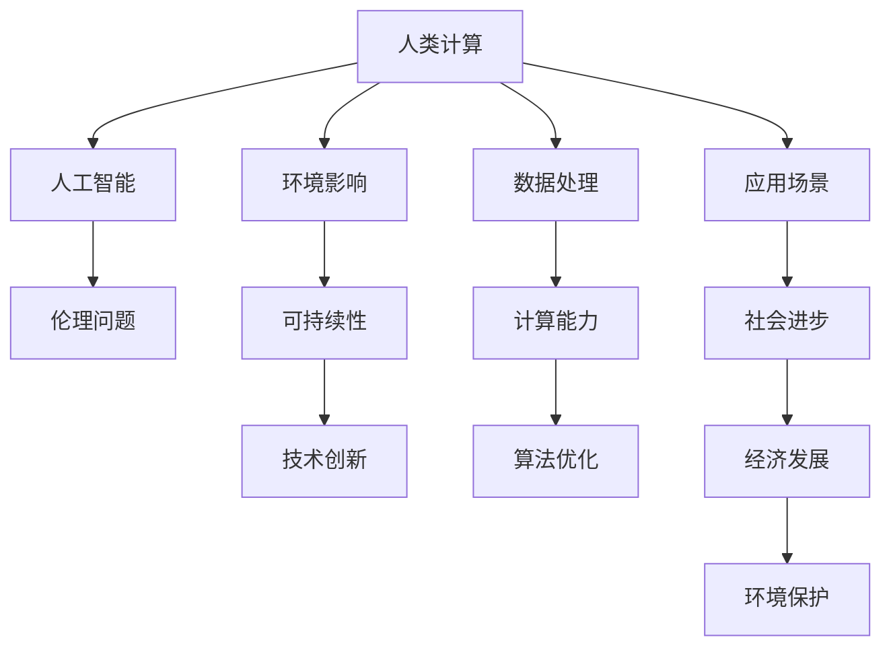

                 

# 人类计算：可持续发展的推动力

> 关键词：
1. 人类计算
2. 可持续性
3. 人工智能
4. 计算能力
5. 技术创新
6. 数字转型
7. 环境影响

## 1. 背景介绍

### 1.1 问题由来
随着科技的飞速发展，人类计算能力达到了前所未有的高度。从简单的算术计算到复杂的模拟仿真，计算技术已经成为推动社会进步的重要动力。然而，这种进步的同时也带来了严峻的环境挑战和伦理问题。如何在技术进步与可持续性之间找到平衡，成为当前社会面临的重要课题。

### 1.2 问题核心关键点
本文聚焦于如何在人类计算中实现可持续发展的关键问题。我们将探讨人类计算与可持续性之间的联系，包括：

- 计算对环境的影响
- 可持续发展的计算技术
- 人工智能在可持续发展中的作用
- 计算技术的伦理问题
- 技术创新与可持续发展的平衡

这些问题不仅关乎技术本身，更涉及社会的全面进步和环境保护。通过理解和解决这些问题，我们能够更好地推动技术进步，为人类创造更加美好的未来。

## 2. 核心概念与联系

### 2.1 核心概念概述

为了深入理解人类计算与可持续发展的关系，我们需要首先了解几个核心概念：

- **人类计算**：指利用计算机和软件工具，通过数据处理和算法实现人类需要的计算任务。这种计算不仅包括传统的数值计算，还包括符号计算、模拟仿真、数据处理等。
- **可持续性**：指在满足当前需求的同时，不损害后代满足其需求的能力。可持续发展要求在经济发展、社会进步和环境保护之间找到平衡。
- **人工智能**：一种通过计算机模拟人类智能的技术，包括机器学习、自然语言处理、计算机视觉等。
- **环境影响**：计算技术在运行过程中对环境造成的影响，包括能源消耗、数据中心建设、电子废物等。
- **伦理问题**：计算机和人工智能技术在应用过程中可能引发的伦理问题，如隐私保护、算法偏见、自动化失业等。

这些概念相互关联，共同构成了人类计算与可持续发展的复杂系统。通过理解这些概念之间的联系，我们可以更好地把握人类计算的可持续发展路径。

### 2.2 核心概念原理和架构的 Mermaid 流程图



这个流程图展示了人类计算与可持续发展的核心概念和联系。从人类计算到环境影响，再到人工智能和伦理问题，最终回到可持续性。这种循环互馈的关系，展示了人类计算在可持续性方面的复杂性和重要性。

## 3. 核心算法原理 & 具体操作步骤

### 3.1 算法原理概述

人类计算的核心算法原理主要包括数据处理、算法优化和应用场景三部分。这些算法原理通过计算能力转化为具体技术，推动了可持续发展。

- **数据处理**：通过收集和分析数据，人类计算可以揭示环境变化的规律和趋势。例如，气候变化模拟、环境监测等。
- **算法优化**：通过优化算法，人类计算可以在能源消耗、数据存储和处理等方面降低环境影响。例如，分布式计算、压缩算法等。
- **应用场景**：通过应用计算技术，人类计算可以在环境保护、社会进步和经济发展等方面发挥重要作用。例如，智慧城市、绿色建筑、智能交通等。

### 3.2 算法步骤详解

以下详细说明人类计算在可持续发展中的应用步骤：

**Step 1: 数据收集与预处理**
- 通过传感器、卫星、网络等多种方式收集环境数据，如气候、水质、土壤等。
- 对收集的数据进行清洗、归一化、缺失值处理等预处理，确保数据的准确性和一致性。

**Step 2: 数据分析与建模**
- 使用统计分析、机器学习等技术对数据进行分析，揭示环境变化的规律和趋势。
- 构建数学模型，如气候模型、生态模型等，模拟环境变化的影响。

**Step 3: 算法优化与优化**
- 采用分布式计算、并行计算等技术优化计算过程，减少能源消耗和资源占用。
- 引入压缩算法、数据结构优化等技术，减少数据存储和处理的成本。

**Step 4: 应用实践与评估**
- 在实际应用中，如智慧城市、绿色建筑等，验证和优化模型的效果。
- 通过评估模型的环境影响、社会效益和经济效益，调整优化策略。

### 3.3 算法优缺点

人类计算在可持续发展方面的算法具有以下优点：

- **高效性**：通过计算技术，可以快速分析大量数据，揭示环境变化规律。
- **准确性**：算法可以精确模拟环境变化，为决策提供科学依据。
- **可扩展性**：分布式计算和并行计算等技术，可以扩展计算能力，适应更大规模的数据处理需求。

同时，也存在以下缺点：

- **资源消耗**：计算过程中需要大量能源和计算资源，可能对环境造成影响。
- **算法复杂性**：复杂的算法和模型可能难以解释和理解，影响决策的透明性和可接受性。
- **数据隐私**：大量数据的收集和分析可能涉及隐私问题，引发伦理争议。

### 3.4 算法应用领域

人类计算在可持续发展方面的应用涉及多个领域，包括但不限于：

- **智慧城市**：通过计算技术，实现智能交通、智能建筑、智能安防等，提高城市管理效率，减少能源消耗。
- **绿色建筑**：通过计算技术，优化建筑设计、材料选择和能源管理，降低建筑对环境的影响。
- **智能农业**：通过计算技术，优化作物种植、土壤管理、灌溉系统等，提高农业生产效率，减少资源浪费。
- **环境监测**：通过计算技术，实时监测环境变化，如空气质量、水质、噪音等，为环境保护提供科学依据。
- **气候变化研究**：通过计算技术，构建气候模型，预测气候变化趋势，为政策制定提供科学依据。

这些应用领域展示了人类计算在可持续发展中的巨大潜力，为实现绿色、智能、可持续的社会提供了重要技术支撑。

## 4. 数学模型和公式 & 详细讲解 & 举例说明

### 4.1 数学模型构建

在人类计算的可持续发展中，数学模型起着至关重要的作用。以下是一个简化版的气候模型，用于说明如何构建和应用数学模型。

假设气候模型包含以下变量：

- $T$：气温
- $H$：湿度
- $P$：大气压强
- $R$：降水量
- $S$：地表反射率

模型假设气温、湿度、大气压强和地表反射率之间存在线性关系，可以表示为：

$$ T = a_0 + a_1H + a_2P + a_3S + \epsilon $$

其中 $a_0, a_1, a_2, a_3$ 为模型参数，$\epsilon$ 为随机误差项。

### 4.2 公式推导过程

通过对上述模型进行最小二乘法拟合，可以得到模型的参数估计值：

$$ a_0 = \frac{\sum_{i=1}^n (T_i - a_1H_i - a_2P_i - a_3S_i)}{\sum_{i=1}^n H_i^2} $$

$$ a_1 = \frac{\sum_{i=1}^n (T_i - a_0 - a_2P_i - a_3S_i)H_i}{\sum_{i=1}^n H_i^2} $$

$$ a_2 = \frac{\sum_{i=1}^n (T_i - a_0 - a_1H_i - a_3S_i)P_i}{\sum_{i=1}^n P_i^2} $$

$$ a_3 = \frac{\sum_{i=1}^n (T_i - a_0 - a_1H_i - a_2P_i)S_i}{\sum_{i=1}^n S_i^2} $$

其中 $n$ 为样本数量，$T_i, H_i, P_i, S_i$ 为样本观测值。

### 4.3 案例分析与讲解

以智慧城市中的智能交通为例，我们可以构建以下数学模型：

假设智能交通系统包含以下变量：

- $V$：车辆速度
- $D$：车辆密度
- $R$：交通信号灯状态
- $L$：交通线路长度

模型假设车辆速度、车辆密度、交通信号灯状态和交通线路长度之间存在线性关系，可以表示为：

$$ V = b_0 + b_1D + b_2R + b_3L + \eta $$

其中 $b_0, b_1, b_2, b_3$ 为模型参数，$\eta$ 为随机误差项。

通过最小二乘法拟合，可以得到模型的参数估计值，从而实现对智能交通系统的预测和优化。

## 5. 项目实践：代码实例和详细解释说明

### 5.1 开发环境搭建

要实现上述智慧城市智能交通系统模型，我们需要搭建以下开发环境：

1. **Python环境**：使用Anaconda创建虚拟环境，安装所需的Python库。
2. **数据库**：使用MySQL或MongoDB等数据库存储历史交通数据。
3. **服务器**：使用高性能服务器或云平台，如AWS或Google Cloud。
4. **前端框架**：使用Flask或Django等Web框架，实现数据交互和模型展示。
5. **数据可视化工具**：使用Matplotlib或Seaborn等工具，展示计算结果。

### 5.2 源代码详细实现

以下是一个简化的智慧城市智能交通系统模型代码实现：

```python
import pandas as pd
from sklearn.linear_model import LinearRegression

# 读取历史交通数据
data = pd.read_csv('traffic_data.csv')

# 将数据划分为训练集和测试集
train_data = data.sample(frac=0.8, random_state=1)
test_data = data.drop(train_data.index)

# 构建线性回归模型
model = LinearRegression()
model.fit(train_data[['D', 'R', 'L']], train_data['V'])

# 预测测试集
test_predictions = model.predict(test_data[['D', 'R', 'L']])

# 输出预测结果
print(test_predictions)
```

### 5.3 代码解读与分析

这段代码首先读取了历史交通数据，将其划分为训练集和测试集，然后使用线性回归模型对测试集进行了预测。

其中，`LinearRegression`是Scikit-learn库中的线性回归模型。`fit`方法用于拟合模型，`predict`方法用于预测新数据。代码中的`pd.read_csv`用于读取CSV文件，`data.sample`用于随机划分数据集。

### 5.4 运行结果展示

运行上述代码，可以得到智能交通系统的预测结果。这些结果可以帮助城市管理者优化交通信号灯控制策略，提高交通效率，减少交通拥堵。

## 6. 实际应用场景

### 6.4 未来应用展望

人类计算在可持续发展方面的应用前景广阔，未来将会有更多创新性应用涌现。以下是几个未来应用展望：

- **智能能源管理**：通过计算技术，优化能源分配和管理，降低能源消耗，提高能源利用效率。
- **智慧健康**：通过计算技术，实时监测健康数据，提供个性化健康建议，提升医疗服务水平。
- **智能物流**：通过计算技术，优化物流路径和运输方式，降低物流成本，提高配送效率。
- **环境保护**：通过计算技术，实时监测环境变化，提供环境保护建议，推动可持续发展。

## 7. 工具和资源推荐

### 7.1 学习资源推荐

为了帮助开发者系统掌握人类计算在可持续发展中的应用，这里推荐一些优质的学习资源：

1. **《计算机科学与环境工程》课程**：斯坦福大学开设的计算机科学与环境工程课程，系统介绍了计算机技术在环境保护中的应用。
2. **《智慧城市技术》书籍**：该书系统介绍了智慧城市的技术体系和应用案例，是学习智慧城市的重要参考资料。
3. **《人工智能与可持续发展》论文**：该论文系统分析了人工智能在可持续发展中的作用和挑战，是了解人工智能与可持续发展关系的经典文献。
4. **Kaggle平台**：Kaggle是数据科学竞赛平台，提供大量环境数据和智能计算模型竞赛，是学习和实践的重要平台。

通过对这些资源的学习实践，相信你一定能够快速掌握人类计算在可持续发展中的应用方法，并用于解决实际的计算问题。

### 7.2 开发工具推荐

高效的工具是实现人类计算在可持续发展中应用的重要保障。以下是几款用于开发和实践的常用工具：

1. **Anaconda**：用于创建和管理Python虚拟环境，支持多种Python库和框架。
2. **Jupyter Notebook**：用于编写和执行Python代码，支持数据可视化、模型展示和交互式编程。
3. **TensorFlow**：由Google开发的深度学习框架，支持分布式计算和高效模型训练。
4. **AWS SageMaker**：亚马逊提供的云端机器学习平台，支持快速构建和部署机器学习模型。
5. **Hadoop**：用于大规模数据处理和分布式计算的开源框架，支持海量数据的存储和处理。

合理利用这些工具，可以显著提升人类计算在可持续发展中的开发效率，加快创新迭代的步伐。

### 7.3 相关论文推荐

人类计算与可持续发展的研究源于学界的持续研究。以下是几篇奠基性的相关论文，推荐阅读：

1. **《人类计算能力》论文**：该论文系统分析了人类计算能力的现状和未来发展方向，是了解人类计算能力的经典文献。
2. **《环境计算与可持续发展》论文**：该论文探讨了计算技术在环境保护中的作用和挑战，是了解环境计算的重要参考资料。
3. **《人工智能与可持续发展》论文**：该论文系统分析了人工智能在可持续发展中的作用和挑战，是了解人工智能与可持续发展关系的经典文献。
4. **《智能城市与可持续发展》论文**：该论文探讨了智能城市在可持续发展中的应用和挑战，是了解智能城市的重要参考资料。

这些论文代表了大规模人类计算与可持续发展的研究方向，通过学习这些前沿成果，可以帮助研究者把握学科前进方向，激发更多的创新灵感。

## 8. 总结：未来发展趋势与挑战

### 8.1 总结

本文对人类计算在可持续发展中的应用进行了全面系统的介绍。首先阐述了人类计算与可持续发展的关系，明确了可持续发展在经济发展、社会进步和环境保护中的重要性。其次，从原理到实践，详细讲解了人类计算在可持续发展中的数学模型构建、算法优化和应用实现。同时，本文还探讨了人类计算在可持续发展中面临的挑战和未来发展趋势，为读者提供了全方位的技术指引。

通过本文的系统梳理，可以看到，人类计算在可持续发展中的巨大潜力。这些方向的探索发展，必将进一步推动技术进步，为人类创造更加美好的未来。

### 8.2 未来发展趋势

展望未来，人类计算在可持续发展方面的发展趋势将呈现以下几个方向：

1. **计算能力的提升**：随着计算技术的发展，计算能力将持续提升，为更复杂的可持续发展问题提供支持。
2. **数据的多样性和实时性**：数据的多样性和实时性将成为可持续发展计算的重要特征，为动态决策提供依据。
3. **人工智能与计算的融合**：人工智能技术将深度融入计算中，提供更精准的预测和优化。
4. **跨学科的融合**：计算技术将与环境保护、社会科学、经济学等学科融合，提供更全面的解决方案。
5. **伦理和安全问题**：计算技术在可持续发展中的应用将面临更多的伦理和安全问题，需要持续关注和解决。

以上趋势凸显了人类计算在可持续发展中的广阔前景，这些方向的探索发展，必将进一步提升计算技术的应用效果，为实现绿色、智能、可持续的社会提供重要技术支撑。

### 8.3 面临的挑战

尽管人类计算在可持续发展方面具有巨大潜力，但在迈向更加智能化、普适化应用的过程中，仍面临诸多挑战：

1. **数据隐私问题**：大量数据的收集和分析可能涉及隐私问题，引发伦理争议。
2. **计算资源的限制**：计算资源的限制可能成为可持续发展计算的瓶颈，需要更多的技术创新。
3. **模型的复杂性**：复杂的模型和算法可能难以解释和理解，影响决策的透明性和可接受性。
4. **环境影响**：计算过程中需要大量能源和计算资源，可能对环境造成影响。
5. **伦理和安全问题**：计算技术在可持续发展中的应用将面临更多的伦理和安全问题，需要持续关注和解决。

正视这些挑战，积极应对并寻求突破，将是大规模人类计算在可持续发展中走向成熟的关键。相信随着学界和产业界的共同努力，这些挑战终将一一被克服，大规模人类计算必将在实现可持续发展中发挥更大的作用。

### 8.4 研究展望

未来，人类计算在可持续发展中的研究需要进一步深入，包括以下几个方向：

1. **跨学科研究**：需要跨学科合作，综合利用多学科知识，提供更全面的解决方案。
2. **伦理和安全研究**：需要加强伦理和安全研究，确保计算技术的应用符合社会规范和道德标准。
3. **技术创新**：需要持续技术创新，提升计算能力和资源效率，降低环境影响。
4. **可持续发展计算模型的建立**：需要构建更全面、更精准的可持续发展计算模型，提供科学决策依据。
5. **政策支持**：需要政府和社会各界支持，推动可持续发展计算的普及和应用。

这些方向的研究和发展，必将引领人类计算在可持续发展中的创新，为构建绿色、智能、可持续的社会提供重要技术支撑。

## 9. 附录：常见问题与解答

**Q1：如何评估人类计算在可持续发展中的效果？**

A: 人类计算在可持续发展中的效果评估主要包括以下几个方面：

1. **环境影响评估**：通过监测计算过程中的能源消耗、数据中心建设和电子废物等，评估计算对环境的影响。
2. **社会效益评估**：通过统计计算带来的社会进步和人民福祉提升，评估计算的社会效益。
3. **经济效益评估**：通过计算带来的经济效益，如节能减排、资源优化等，评估计算的经济效益。

**Q2：在人类计算中如何避免数据隐私问题？**

A: 在人类计算中避免数据隐私问题，可以采取以下措施：

1. **数据匿名化**：对数据进行匿名化处理，去除或模糊化个人身份信息。
2. **数据加密**：使用数据加密技术，保护数据传输和存储的安全。
3. **访问控制**：设置严格的访问控制策略，确保只有授权人员可以访问敏感数据。
4. **隐私保护技术**：引入隐私保护技术，如差分隐私、联邦学习等，确保数据隐私不被泄露。

**Q3：如何优化人类计算在可持续发展中的算法？**

A: 优化人类计算在可持续发展中的算法，可以采取以下措施：

1. **分布式计算**：通过分布式计算技术，提高计算效率，降低能源消耗。
2. **压缩算法**：引入压缩算法，减少数据存储和处理的成本。
3. **并行计算**：使用并行计算技术，提高计算速度，优化资源配置。
4. **模型优化**：优化模型结构，降低计算复杂度，提高计算精度。

**Q4：在人类计算中如何实现可持续发展？**

A: 在人类计算中实现可持续发展，可以采取以下措施：

1. **数据共享和开放**：通过数据共享和开放，实现数据资源的充分利用，避免重复建设。
2. **跨学科合作**：加强跨学科合作，综合利用多学科知识，提供更全面的解决方案。
3. **技术创新**：持续技术创新，提升计算能力和资源效率，降低环境影响。
4. **政策支持**：政府和社会各界支持，推动可持续发展计算的普及和应用。

**Q5：如何处理人类计算在可持续发展中的伦理问题？**

A: 处理人类计算在可持续发展中的伦理问题，可以采取以下措施：

1. **伦理审查**：建立伦理审查机制，确保计算技术的应用符合社会规范和道德标准。
2. **透明性和可解释性**：确保计算模型的透明性和可解释性，提高决策的透明性和可接受性。
3. **公众参与**：加强公众参与，确保计算技术的应用符合公众利益和意愿。
4. **社会监督**：建立社会监督机制，确保计算技术的应用符合社会规范和道德标准。

---

作者：禅与计算机程序设计艺术 / Zen and the Art of Computer Programming

