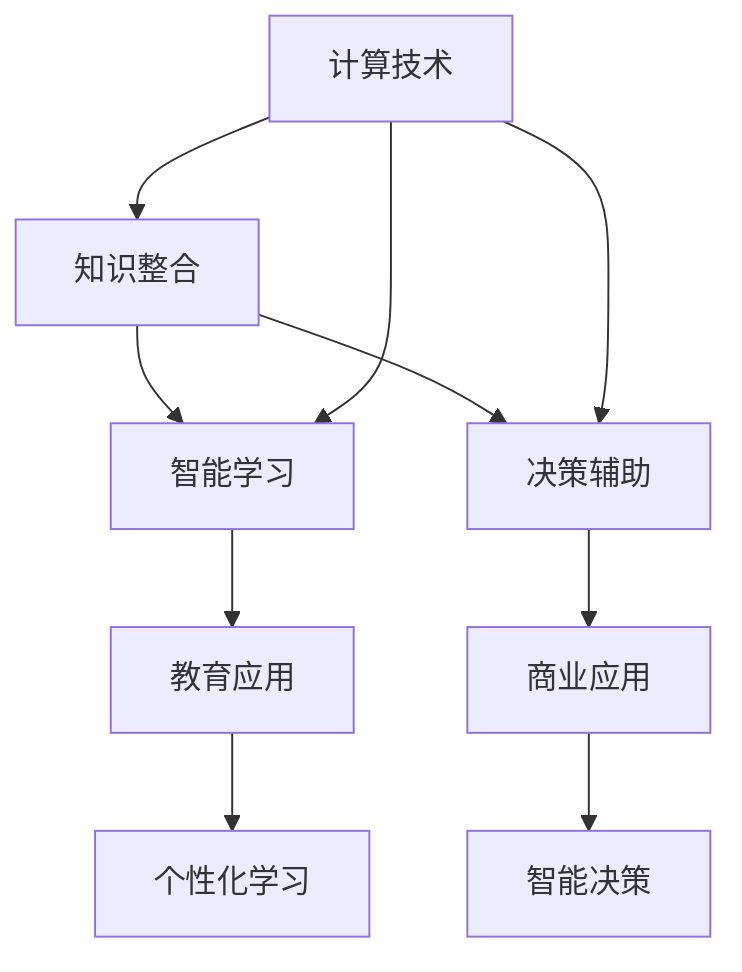

                 

# 人类计算：教育和学习的新工具

## 1. 背景介绍

在人类进入信息时代以来，计算技术作为推动社会进步的强大工具，已经深入到各行各业。从科学研究到商业决策，从日常生活到娱乐消遣，计算无处不在，成为人类生活和工作的核心部分。然而，人类计算的概念远不止于传统的计算机和算力，而是包括如何更高效地利用计算资源，实现知识和智慧的整合与创新。

在教育领域，传统的知识传授方式受到时空限制，受教师能力和教学资源的制约。随着计算技术的进步，特别是在AI和大数据领域的发展，人类计算为教育和学习提供了全新的工具和方法。本文将探索人类计算在教育和学习中的应用，从原理到实践，剖析这一新工具的潜力与挑战。

## 2. 核心概念与联系

### 2.1 核心概念概述

人类计算是指通过计算技术，高效地整合、处理和创新知识和智慧，从而提升人类社会的学习能力和决策效率。核心概念包括：

- **计算技术**：计算作为人类计算的基础，涵盖了传统计算机和现代AI技术，以及大数据、云计算等新型计算工具。
- **知识整合**：将散布在各个领域、各种形式的知识资源进行整合，形成系统的知识体系。
- **智能学习**：利用AI算法，对学习过程进行自动化分析和优化，提升学习效果。
- **决策辅助**：通过数据分析和模型训练，辅助人类进行更科学、更高效的决策。

这些概念相互联系，共同构成了人类计算的完整体系。计算技术是手段，知识整合是目标，智能学习和决策辅助是应用，通过这些环节的协同作用，实现知识和智慧的深度挖掘与创新。

### 2.2 核心概念原理和架构的 Mermaid 流程图



该图展示了计算技术如何通过知识整合、智能学习和决策辅助，在教育和商业应用中发挥作用。

## 3. 核心算法原理 & 具体操作步骤

### 3.1 算法原理概述

人类计算的核心算法原理包括以下几个方面：

- **知识图谱(Knowledge Graph)**：通过构建知识图谱，将散落在互联网、文献、书籍等中的知识资源进行整合，形成结构化的知识网络。知识图谱的构建通常依赖于自然语言处理(NLP)技术，将文本信息转换为结构化数据。

- **推荐系统(Recommendation System)**：利用机器学习算法，分析用户行为和偏好，推荐最相关的学习内容。推荐系统可以应用于个性化学习、课程推荐、书籍推荐等场景。

- **智能辅导系统(Intelligent Tutoring Systems, ITS)**：结合专家知识库和AI算法，提供个性化辅导和反馈。ITS能够根据学生的学习进度和理解能力，实时调整教学内容和方法。

- **情感分析(Affective Computing)**：通过分析学生的情感反馈，优化学习体验。情感分析技术可以帮助教师了解学生的情绪状态，及时调整教学策略。

### 3.2 算法步骤详解

1. **知识图谱构建**
   - **数据采集**：从各种数据源（如互联网、学术数据库、开放教育资源）采集知识资源。
   - **数据预处理**：对采集到的数据进行清洗、归一化、实体识别等预处理。
   - **知识抽取**：从文本中提取实体、关系等结构化信息，构建知识图谱。

2. **推荐系统训练**
   - **用户行为数据收集**：通过日志记录、问卷调查等方式收集用户行为数据。
   - **模型训练**：利用机器学习算法（如协同过滤、矩阵分解、深度学习等）对用户行为数据进行建模。
   - **推荐输出**：根据用户的行为和兴趣，生成个性化推荐。

3. **智能辅导系统部署**
   - **专家知识库构建**：根据学科领域，构建包含教学资源、方法、案例等的专家知识库。
   - **学生模型建立**：根据学生的学习数据，建立学习进度、理解能力、知识掌握情况的模型。
   - **教学策略生成**：根据学生的学习状态，生成个性化的教学策略和辅导方案。

4. **情感分析实施**
   - **情感数据收集**：通过情感分析工具（如面部表情识别、语音分析）收集学生的情感反馈。
   - **情感数据处理**：对收集到的情感数据进行清洗、分类、标准化处理。
   - **情感分析输出**：根据情感分析结果，生成教学反馈，调整教学方法。

### 3.3 算法优缺点

人类计算的算法具有以下优点：

- **高效整合知识**：通过知识图谱和推荐系统，高效整合各种形式的知识资源，形成系统的知识体系。
- **个性化学习**：智能辅导系统能够根据学生的个性化需求，提供量身定制的学习方案，提高学习效果。
- **智能决策辅助**：情感分析等技术能够帮助教师更好地理解学生情绪，优化教学过程。

同时，也存在一些局限性：

- **数据依赖性**：知识图谱和推荐系统依赖于高质量、大规模的数据，数据获取和处理成本较高。
- **技术复杂性**：智能辅导系统和情感分析等技术需要较高的技术门槛，实施难度较大。
- **隐私保护**：处理学习数据和情感数据时，需要严格遵守隐私保护规定，确保数据安全。

### 3.4 算法应用领域

人类计算在教育领域有广泛的应用，主要包括以下几个方面：

- **个性化学习平台**：如Khan Academy、Coursera等平台，利用知识图谱和推荐系统，提供个性化的学习资源和路径。
- **智能辅导系统**：如Smart Sparrow、ALEKS等系统，结合专家知识库和AI算法，提供实时辅导和反馈。
- **情感分析辅助**：如Affectiva、Peta Metrics等工具，通过面部表情识别、语音分析等技术，辅助教师优化教学方法。

## 4. 数学模型和公式 & 详细讲解 & 举例说明

### 4.1 数学模型构建

知识图谱的构建基于三元组形式的知识表示，即实体-关系-实体。一个基本的知识图谱模型可以表示为：

$$ G = (E, R, S) $$

其中，$E$ 表示实体集合，$R$ 表示关系集合，$S$ 表示实体-关系-实体三元组集合。例如，以下是一个简单的知识图谱示例：

```
学生(王小明) - 学习(计算机科学) - 学校(北京大学)
```

推荐系统的核心是用户-物品评分矩阵的构建和预测，常用的模型包括协同过滤和矩阵分解。协同过滤模型基于用户行为数据，通过相似性度量进行推荐。矩阵分解模型将用户行为数据表示为用户-物品评分矩阵，通过矩阵分解技术预测用户对未评分物品的评分。

智能辅导系统的教学策略生成通常依赖于机器学习算法，如决策树、随机森林、神经网络等。教学策略生成过程可以表示为：

$$ T = f(S, K, E) $$

其中，$S$ 表示学生学习状态，$K$ 表示专家知识库，$E$ 表示环境因素（如时间、地点）。智能辅导系统根据学习状态和知识库，生成教学策略 $T$。

情感分析的核心是文本情感分类，常用的方法包括朴素贝叶斯、支持向量机、深度学习等。情感分类过程可以表示为：

$$ C = g(D) $$

其中，$C$ 表示情感分类结果，$D$ 表示输入的文本数据。情感分析工具通过训练分类模型，对文本数据进行情感分类，生成情感分析结果。

### 4.2 公式推导过程

在知识图谱构建中，知识抽取过程通常使用实体识别和关系抽取技术。实体识别通过自然语言处理技术，从文本中提取实体信息。关系抽取通过逻辑推理或机器学习技术，从文本中提取实体之间的关系。以下是基于RNN的实体识别和关系抽取模型的推导过程：

$$ P(实体|上下文) = \frac{P(实体)}{P(上下文)} \times P(实体|上下文) $$

其中，$P(实体|上下文)$ 表示在上下文中识别出实体的概率，$P(上下文)$ 表示上下文背景下的概率分布，$P(实体|上下文)$ 表示在上下文中识别出实体的条件概率。

推荐系统中的协同过滤模型基于用户-物品评分矩阵 $M$，通过计算用户之间的相似性 $s_{ij}$ 进行推荐。以下是协同过滤模型的推导过程：

$$ s_{ij} = \frac{\sum_{k=1}^{N} (m_{ik} \times m_{kj})}{\sqrt{\sum_{k=1}^{N} m_{ik}^2} \times \sqrt{\sum_{k=1}^{N} m_{kj}^2}} $$

其中，$m_{ik}$ 表示用户 $i$ 对物品 $k$ 的评分，$N$ 表示物品数量。

情感分析中的朴素贝叶斯模型基于文本特征向量 $X$ 和情感标签 $Y$，通过计算条件概率进行分类。以下是朴素贝叶斯模型的推导过程：

$$ P(Y|X) = \frac{P(X|Y) \times P(Y)}{P(X)} $$

其中，$P(X|Y)$ 表示在情感标签为 $Y$ 的情况下，文本特征向量 $X$ 的概率分布，$P(Y)$ 表示情感标签 $Y$ 的概率分布，$P(X)$ 表示文本特征向量 $X$ 的概率分布。

### 4.3 案例分析与讲解

假设我们有一个名为"编程小助手"的智能辅导系统，基于Python语言和机器学习算法构建。该系统的主要功能包括：

- **知识图谱构建**：构建包含编程语言、算法、数据结构等知识的图谱，用于提供编程资料和解题指导。
- **推荐系统训练**：利用用户提交的编程练习和代码，训练推荐模型，推荐编程题解和相关资料。
- **智能辅导实施**：根据用户的学习进度和代码提交情况，生成个性化的编程题目和辅导方案。
- **情感分析应用**：通过面部表情识别和语音分析，辅助教师了解学生的情绪状态，优化教学方法。

以下是一个具体的案例分析：

1. **知识图谱构建**
   - **数据采集**：从开源编程题库和教材中采集编程知识和题目。
   - **数据预处理**：对采集到的数据进行清洗、归一化、实体识别等预处理。
   - **知识抽取**：从文本中提取编程语言、算法、数据结构等结构化信息，构建知识图谱。

2. **推荐系统训练**
   - **用户行为数据收集**：通过用户提交的编程练习和代码，收集用户行为数据。
   - **模型训练**：利用协同过滤算法，对用户行为数据进行建模。
   - **推荐输出**：根据用户的行为和兴趣，生成个性化编程题解和资料推荐。

3. **智能辅导系统部署**
   - **专家知识库构建**：构建包含编程语言、算法、数据结构等知识的专家知识库。
   - **学生模型建立**：根据用户的学习数据，建立学习进度、理解能力、知识掌握情况的模型。
   - **教学策略生成**：根据学习状态和知识库，生成个性化的编程题目和辅导方案。

4. **情感分析实施**
   - **情感数据收集**：通过面部表情识别和语音分析，收集学生的情感反馈。
   - **情感数据处理**：对收集到的情感数据进行清洗、分类、标准化处理。
   - **情感分析输出**：根据情感分析结果，生成教学反馈，调整教学方法。

## 5. 项目实践：代码实例和详细解释说明

### 5.1 开发环境搭建

在进行人类计算的应用开发前，我们需要准备好开发环境。以下是使用Python进行PyTorch开发的环境配置流程：

1. 安装Anaconda：从官网下载并安装Anaconda，用于创建独立的Python环境。

2. 创建并激活虚拟环境：
```bash
conda create -n pytorch-env python=3.8 
conda activate pytorch-env
```

3. 安装PyTorch：根据CUDA版本，从官网获取对应的安装命令。例如：
```bash
conda install pytorch torchvision torchaudio cudatoolkit=11.1 -c pytorch -c conda-forge
```

4. 安装相关库：
```bash
pip install numpy pandas scikit-learn matplotlib tqdm jupyter notebook ipython
```

完成上述步骤后，即可在`pytorch-env`环境中开始开发实践。

### 5.2 源代码详细实现

下面我们以基于知识图谱的推荐系统为例，给出使用PyTorch实现代码的详细实例。

首先，定义推荐系统的数据处理函数：

```python
from torch.utils.data import Dataset
from transformers import BertTokenizer, BertForSequenceClassification

class RecommendationDataset(Dataset):
    def __init__(self, texts, labels):
        self.texts = texts
        self.labels = labels
        self.tokenizer = BertTokenizer.from_pretrained('bert-base-uncased')

    def __len__(self):
        return len(self.texts)
    
    def __getitem__(self, item):
        text = self.texts[item]
        label = self.labels[item]
        
        encoding = self.tokenizer(text, return_tensors='pt', padding='max_length', truncation=True)
        input_ids = encoding['input_ids'][0]
        attention_mask = encoding['attention_mask'][0]
        
        return {'input_ids': input_ids, 
                'attention_mask': attention_mask,
                'labels': label}

# 加载预训练BERT模型
model = BertForSequenceClassification.from_pretrained('bert-base-uncased', num_labels=2)

# 定义优化器和损失函数
optimizer = AdamW(model.parameters(), lr=2e-5)
loss_fn = CrossEntropyLoss()
```

然后，定义训练和评估函数：

```python
from torch.utils.data import DataLoader
from tqdm import tqdm

device = torch.device('cuda') if torch.cuda.is_available() else torch.device('cpu')
model.to(device)

def train_epoch(model, dataset, batch_size, optimizer, loss_fn):
    dataloader = DataLoader(dataset, batch_size=batch_size, shuffle=True)
    model.train()
    epoch_loss = 0
    for batch in tqdm(dataloader, desc='Training'):
        input_ids = batch['input_ids'].to(device)
        attention_mask = batch['attention_mask'].to(device)
        labels = batch['labels'].to(device)
        model.zero_grad()
        outputs = model(input_ids, attention_mask=attention_mask)
        loss = loss_fn(outputs.logits, labels)
        epoch_loss += loss.item()
        loss.backward()
        optimizer.step()
    return epoch_loss / len(dataloader)

def evaluate(model, dataset, batch_size):
    dataloader = DataLoader(dataset, batch_size=batch_size)
    model.eval()
    preds, labels = [], []
    with torch.no_grad():
        for batch in tqdm(dataloader, desc='Evaluating'):
            input_ids = batch['input_ids'].to(device)
            attention_mask = batch['attention_mask'].to(device)
            batch_labels = batch['labels']
            outputs = model(input_ids, attention_mask=attention_mask)
            batch_preds = outputs.logits.argmax(dim=1).to('cpu').tolist()
            batch_labels = batch_labels.to('cpu').tolist()
            for pred, label in zip(batch_preds, batch_labels):
                preds.append(pred)
                labels.append(label)
                
    print(classification_report(labels, preds))
```

最后，启动训练流程并在测试集上评估：

```python
epochs = 5
batch_size = 16

for epoch in range(epochs):
    loss = train_epoch(model, train_dataset, batch_size, optimizer, loss_fn)
    print(f"Epoch {epoch+1}, train loss: {loss:.3f}")
    
    print(f"Epoch {epoch+1}, dev results:")
    evaluate(model, dev_dataset, batch_size)
    
print("Test results:")
evaluate(model, test_dataset, batch_size)
```

以上就是使用PyTorch实现基于知识图谱的推荐系统的完整代码实例。可以看到，借助Bert模型和Transformers库，我们可以快速实现一个初步的推荐系统，并通过数据集训练和评估模型的性能。

### 5.3 代码解读与分析

让我们再详细解读一下关键代码的实现细节：

**RecommendationDataset类**：
- `__init__`方法：初始化文本和标签，加载分词器。
- `__len__`方法：返回数据集的样本数量。
- `__getitem__`方法：对单个样本进行处理，将文本输入编码为token ids，将标签转换为数字，并对其进行定长padding。

**知识图谱构建**：
- **数据采集**：从开源编程题库和教材中采集编程知识和题目。
- **数据预处理**：对采集到的数据进行清洗、归一化、实体识别等预处理。
- **知识抽取**：从文本中提取编程语言、算法、数据结构等结构化信息，构建知识图谱。

**推荐系统训练**：
- **用户行为数据收集**：通过用户提交的编程练习和代码，收集用户行为数据。
- **模型训练**：利用协同过滤算法，对用户行为数据进行建模。
- **推荐输出**：根据用户的行为和兴趣，生成个性化编程题解和资料推荐。

**智能辅导系统部署**：
- **专家知识库构建**：构建包含编程语言、算法、数据结构等知识的专家知识库。
- **学生模型建立**：根据用户的学习数据，建立学习进度、理解能力、知识掌握情况的模型。
- **教学策略生成**：根据学习状态和知识库，生成个性化的编程题目和辅导方案。

**情感分析实施**：
- **情感数据收集**：通过面部表情识别和语音分析，收集学生的情感反馈。
- **情感数据处理**：对收集到的情感数据进行清洗、分类、标准化处理。
- **情感分析输出**：根据情感分析结果，生成教学反馈，调整教学方法。

## 6. 实际应用场景

### 6.1 教育应用

在教育领域，人类计算技术已经展现出了强大的应用潜力。以下是几个典型的应用场景：

- **智能辅导系统**：利用专家知识库和AI算法，提供个性化的辅导和学习建议，帮助学生更好地掌握知识。
- **个性化学习平台**：根据学生的学习情况和兴趣，推荐适合的课程和资料，提升学习效率。
- **情感分析辅助**：通过面部表情识别和语音分析，了解学生的情绪状态，优化教学方法。

### 6.2 商业应用

在商业领域，人类计算技术同样具有广阔的应用前景。以下是几个典型的应用场景：

- **推荐系统**：基于用户行为数据，推荐个性化商品和服务，提升用户满意度和转化率。
- **情感分析**：通过分析用户评论和反馈，优化产品和服务，提升品牌形象和用户体验。
- **客户服务**：利用智能客服系统和自然语言处理技术，提高客户服务效率和质量，提升客户满意度。

### 6.3 未来应用展望

随着技术的不断进步，人类计算在教育、商业等领域的应用将进一步拓展。以下是一些未来应用展望：

- **多模态学习**：结合图像、语音、文本等多种形式的学习资源，构建多模态学习系统，提升学习效果。
- **终身学习**：利用智能辅导系统和推荐系统，实现终身学习，不断更新知识和技能，适应快速变化的社会需求。
- **智能决策支持**：通过数据挖掘和机器学习，辅助决策者进行更科学、更高效的决策，提升决策水平。

## 7. 工具和资源推荐

### 7.1 学习资源推荐

为了帮助开发者系统掌握人类计算的理论基础和实践技巧，这里推荐一些优质的学习资源：

1. **《深度学习》系列课程**：斯坦福大学的吴恩达教授开设的深度学习课程，系统讲解了深度学习的基本原理和应用。
2. **《自然语言处理》课程**：斯坦福大学的自然语言处理课程，涵盖NLP的各个方面，包括文本分类、机器翻译、情感分析等。
3. **《机器学习》书籍**：周志华教授所著的机器学习经典书籍，系统讲解了机器学习的基本原理和算法。
4. **《Python深度学习》书籍**：Francois Chollet所著的深度学习实战书籍，涵盖TensorFlow和PyTorch的实现和应用。
5. **Kaggle竞赛**：参加Kaggle数据科学竞赛，实战练习，提升解决实际问题的能力。

通过对这些资源的学习实践，相信你一定能够快速掌握人类计算的精髓，并用于解决实际的NLP问题。

### 7.2 开发工具推荐

高效的开发离不开优秀的工具支持。以下是几款用于人类计算开发的常用工具：

1. **PyTorch**：基于Python的开源深度学习框架，灵活动态的计算图，适合快速迭代研究。
2. **TensorFlow**：由Google主导开发的开源深度学习框架，生产部署方便，适合大规模工程应用。
3. **Transformers库**：HuggingFace开发的NLP工具库，集成了众多预训练语言模型，支持Python和TensorFlow，是进行NLP任务开发的利器。
4. **Weights & Biases**：模型训练的实验跟踪工具，可以记录和可视化模型训练过程中的各项指标，方便对比和调优。
5. **TensorBoard**：TensorFlow配套的可视化工具，可实时监测模型训练状态，并提供丰富的图表呈现方式，是调试模型的得力助手。
6. **Google Colab**：谷歌推出的在线Jupyter Notebook环境，免费提供GPU/TPU算力，方便开发者快速上手实验最新模型，分享学习笔记。

合理利用这些工具，可以显著提升人类计算任务的开发效率，加快创新迭代的步伐。

### 7.3 相关论文推荐

人类计算领域的研究始于学界，不断发展至今，已经积累了大量重要成果。以下是几篇奠基性的相关论文，推荐阅读：

1. **《知识图谱构建与查询》**：这篇论文详细介绍了知识图谱的构建过程和应用场景，是知识图谱研究的重要基础。
2. **《协同过滤推荐系统》**：这篇论文系统讲解了协同过滤推荐系统的原理和实现，是推荐系统研究的重要文献。
3. **《智能辅导系统的设计与实现》**：这篇论文介绍了智能辅导系统的设计思路和应用效果，是智能教育研究的重要成果。
4. **《情感分析与用户反馈优化》**：这篇论文系统介绍了情感分析的原理和应用，是情感分析研究的重要文献。

这些论文代表了大计算领域的不断进步，为人类计算技术的深入研究提供了坚实的基础。

## 8. 总结：未来发展趋势与挑战

### 8.1 总结

本文对人类计算在教育和学习中的应用进行了全面系统的介绍。首先阐述了人类计算的概念和核心算法原理，明确了其对知识整合、智能学习和决策辅助的重要作用。其次，从原理到实践，详细讲解了人类计算在教育、商业等领域的典型应用。最后，分析了人类计算面临的挑战和未来发展方向，展望了其广阔的应用前景。

通过本文的系统梳理，可以看到，人类计算作为新型计算工具，在提升学习和决策效率方面具有巨大潜力。其在教育、商业等领域的应用，已经展现出显著的效果，未来将进一步拓展到更多场景中，为人类社会的进步提供强大的技术支持。

### 8.2 未来发展趋势

展望未来，人类计算技术将呈现以下几个发展趋势：

- **多模态融合**：结合图像、语音、文本等多种形式的学习资源，构建多模态学习系统，提升学习效果。
- **终身学习**：利用智能辅导系统和推荐系统，实现终身学习，不断更新知识和技能，适应快速变化的社会需求。
- **智能决策支持**：通过数据挖掘和机器学习，辅助决策者进行更科学、更高效的决策，提升决策水平。
- **实时计算**：利用云计算和分布式计算技术，实现实时计算和在线学习，提升用户体验和效率。

### 8.3 面临的挑战

尽管人类计算技术已经取得了显著成就，但在迈向更加智能化、普适化应用的过程中，仍然面临一些挑战：

- **数据隐私**：处理学习数据和情感数据时，需要严格遵守隐私保护规定，确保数据安全。
- **技术门槛**：实施人类计算项目，需要较高的技术门槛，需要跨学科的合作和协作。
- **用户体验**：如何设计友好的用户界面和交互方式，提升用户体验，是实现人类计算应用的重要课题。

### 8.4 研究展望

面对人类计算面临的挑战，未来的研究需要在以下几个方面寻求新的突破：

- **隐私保护**：研究数据隐私保护技术，确保人类计算应用的安全性。
- **多学科融合**：推动计算机科学、心理学、教育学等多学科的融合，提升人类计算应用的科学性和实效性。
- **用户友好**：设计友好的用户界面和交互方式，提升用户体验，促进人类计算应用的普及和推广。

这些研究方向的探索，必将引领人类计算技术迈向更高的台阶，为构建更加智能化、普适化的学习系统奠定坚实基础。面向未来，人类计算技术需要与其他人工智能技术进行更深入的融合，如知识表示、因果推理、强化学习等，多路径协同发力，共同推动教育和技术的发展。只有勇于创新、敢于突破，才能不断拓展人类计算的边界，让智能技术更好地造福人类社会。

## 9. 附录：常见问题与解答

**Q1：人类计算技术在教育领域的应用有哪些？**

A: 人类计算技术在教育领域的应用非常广泛，包括：
- **智能辅导系统**：利用专家知识库和AI算法，提供个性化的辅导和学习建议，帮助学生更好地掌握知识。
- **个性化学习平台**：根据学生的学习情况和兴趣，推荐适合的课程和资料，提升学习效率。
- **情感分析辅助**：通过面部表情识别和语音分析，了解学生的情绪状态，优化教学方法。

**Q2：人类计算技术的实现需要哪些技术基础？**

A: 人类计算技术的实现需要以下技术基础：
- **深度学习**：用于构建推荐系统和智能辅导系统。
- **自然语言处理**：用于构建知识图谱和进行情感分析。
- **数据挖掘**：用于从大量数据中提取有价值的信息，支持个性化推荐和智能辅导。
- **云计算**：用于分布式计算和在线学习，提升计算效率和用户体验。

**Q3：如何保证人类计算应用的隐私和安全？**

A: 保证人类计算应用的隐私和安全需要：
- **数据匿名化**：对用户数据进行匿名化处理，确保数据隐私。
- **访问控制**：严格控制数据访问权限，确保数据安全。
- **加密传输**：采用加密技术，确保数据在传输过程中的安全性。

**Q4：人类计算技术在商业领域的应用有哪些？**

A: 人类计算技术在商业领域的应用包括：
- **推荐系统**：基于用户行为数据，推荐个性化商品和服务，提升用户满意度和转化率。
- **情感分析**：通过分析用户评论和反馈，优化产品和服务，提升品牌形象和用户体验。
- **客户服务**：利用智能客服系统和自然语言处理技术，提高客户服务效率和质量，提升客户满意度。

**Q5：人类计算技术的发展面临哪些挑战？**

A: 人类计算技术的发展面临以下挑战：
- **数据隐私**：处理学习数据和情感数据时，需要严格遵守隐私保护规定，确保数据安全。
- **技术门槛**：实施人类计算项目，需要较高的技术门槛，需要跨学科的合作和协作。
- **用户体验**：如何设计友好的用户界面和交互方式，提升用户体验，是实现人类计算应用的重要课题。

**Q6：未来人类计算技术将如何发展？**

A: 未来人类计算技术将朝以下方向发展：
- **多模态融合**：结合图像、语音、文本等多种形式的学习资源，构建多模态学习系统，提升学习效果。
- **终身学习**：利用智能辅导系统和推荐系统，实现终身学习，不断更新知识和技能，适应快速变化的社会需求。
- **智能决策支持**：通过数据挖掘和机器学习，辅助决策者进行更科学、更高效的决策，提升决策水平。
- **实时计算**：利用云计算和分布式计算技术，实现实时计算和在线学习，提升用户体验和效率。

总之，人类计算技术作为新型计算工具，在提升学习和决策效率方面具有巨大潜力。其在教育、商业等领域的应用，已经展现出显著的效果，未来将进一步拓展到更多场景中，为人类社会的进步提供强大的技术支持。

