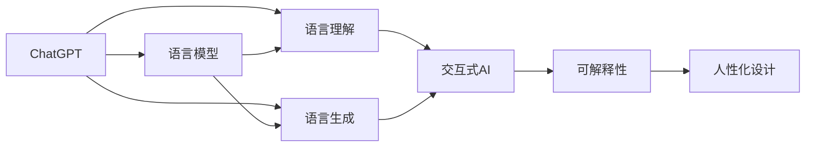

                 

# 从ChatGPT到未来AI助手

> 关键词：ChatGPT, 自然语言处理(NLP), 语言模型, 语言理解, 语言生成, 交互式AI, 可解释性, 人性化设计

## 1. 背景介绍

在人工智能的浩瀚星空中，自然语言处理(NLP)无疑是一颗耀眼的星星。随着技术的不断进步，NLP正在从传统的文本分类、信息抽取等任务，迈向更加复杂、智能的交互式AI应用。而这一转变，无疑得益于语言模型的巨大飞跃。其中，由OpenAI推出的ChatGPT，更是引领了AI助手新时代的到来。

### 1.1 问题的由来

ChatGPT作为一款基于大型语言模型（LLMs）的AI助手，通过在海量文本数据上进行预训练，学习到了丰富的语言知识。用户只需简单输入文本，ChatGPT即可快速生成高质量的输出，解决复杂问题，提供个性化服务。这种自然、流畅的交互方式，使得ChatGPT成为众多领域的利器，从智能客服到教育辅导，从医疗咨询到内容创作，ChatGPT的应用场景日益丰富。

然而，ChatGPT的成功也揭示了当前NLP技术面临的一些挑战。一方面，尽管ChatGPT表现优异，但其作为黑盒模型的可解释性不足，难以满足某些高风险领域如医疗、金融等对模型透明度的需求。另一方面，ChatGPT在应对特定领域的复杂问题时，可能无法充分发挥其潜力，需要结合领域知识和专家的智慧，才能实现更加精确和高效的服务。

因此，在ChatGPT的启发下，未来AI助手的发展方向，应当是从单一的语言模型，转向更具综合性和可解释性的智能系统，使AI助手不仅能提供高质量的文本生成，还能具备更强的知识融合能力和情境理解能力。本文旨在深入探讨从ChatGPT到未来AI助手的演进路径，为AI助手的开发和应用提供指导。

## 2. 核心概念与联系

### 2.1 核心概念概述

为了更好地理解未来AI助手的核心技术，本节将介绍几个关键概念：

- **自然语言处理(NLP)**：研究如何使计算机能够理解、处理和生成自然语言的技术，包括文本分类、信息抽取、文本生成、对话系统等。

- **语言模型(LM)**：通过大量文本数据训练得到的模型，用于预测给定序列的下一个单词或字符的概率，是NLP中的基础组件。

- **语言理解(LU)**：使AI系统能够理解输入文本的语义，包括命名实体识别、情感分析、关系抽取等。

- **语言生成(LG)**：使AI系统能够生成自然、连贯的文本输出，包括问答、摘要、翻译等。

- **交互式AI(IA)**：使AI系统能够与用户进行自然、流畅的对话交互，包括智能客服、虚拟助手等。

- **可解释性(Explainability)**：使AI系统的决策过程透明、可理解，便于用户信任和使用。

- **人性化设计(Human Centered Design)**：以用户需求为核心，结合心理学、设计学等跨学科知识，设计出友好、易用的AI系统。

这些概念之间的联系可以通过以下Mermaid流程图来展示：



这个流程图展示了几大核心概念之间的逻辑关系：

1. 语言模型是NLP的基础，通过预训练学习语言知识。
2. 语言理解和语言生成是语言模型在特定任务上的应用。
3. 交互式AI基于语言理解和生成，实现与用户的自然对话。
4. 可解释性和人性化设计是提升交互式AI系统可信度的重要手段。

## 3. 核心算法原理 & 具体操作步骤

### 3.1 算法原理概述

未来AI助手的核心算法，依然建立在大型语言模型基础上。其核心思想是：通过在大规模文本数据上进行预训练，学习到通用的语言知识和语义表示，然后通过微调、融合知识库、强化学习等手段，提升模型在特定任务上的性能。

具体来说，未来AI助手的构建包括以下几个关键步骤：

1. **数据预处理**：收集与目标任务相关的文本数据，并进行清洗、标注、分词等预处理操作。
2. **模型预训练**：在大规模无标签文本数据上训练语言模型，学习通用的语言表示。
3. **任务适配**：根据具体任务，添加适当的任务适配层，并在标注数据上进行微调，优化模型在特定任务上的表现。
4. **知识融合**：将外部知识库、专家规则等与语言模型进行融合，提升模型对特定领域知识的理解和应用能力。
5. **多模态融合**：结合视觉、语音、文本等多种模态数据，构建更加全面、多样化的AI助手。
6. **用户反馈循环**：通过用户交互数据，不断迭代和优化AI助手的行为，提升用户体验和系统性能。

### 3.2 算法步骤详解

以问答系统为例，我们详细讲解未来AI助手的构建过程：

**Step 1: 数据预处理**
- 收集与目标问题相关的文本数据，如FAQ库、文档、网页等。
- 对文本数据进行清洗，去除停用词、标点符号等无关信息。
- 对文本进行分词，生成标注数据。

**Step 2: 模型预训练**
- 使用大规模无标签文本数据训练语言模型，如GPT、BERT等。
- 选择适当的语言模型架构，并在大规模数据上进行预训练，学习通用的语言知识。

**Step 3: 任务适配**
- 根据问答任务，添加分类器和解码器等任务适配层。
- 使用标注数据对模型进行微调，优化模型在问答任务上的性能。
- 选择适当的微调方法，如全参数微调、参数高效微调等。

**Step 4: 知识融合**
- 将外部知识库、专家规则等与语言模型进行融合，提升模型对特定领域知识的理解和应用能力。
- 使用知识图谱、逻辑推理等方法，增强模型的知识推理能力。

**Step 5: 多模态融合**
- 结合视觉、语音、文本等多种模态数据，构建更加全面、多样化的AI助手。
- 使用多模态融合算法，将不同模态的信息进行整合，提升系统的综合能力。

**Step 6: 用户反馈循环**
- 通过用户交互数据，不断迭代和优化AI助手的行为，提升用户体验和系统性能。
- 使用强化学习等方法，优化AI助手的决策策略。

### 3.3 算法优缺点

未来AI助手的构建方法，具有以下优点：

1. **高效性**：基于大型语言模型的预训练和微调方法，可以在短时间内提升模型性能，适用于各种NLP任务。
2. **可解释性**：融合了领域知识和规则库，使得AI助手的决策过程更加透明，便于用户理解和信任。
3. **灵活性**：通过用户反馈循环和迭代优化，AI助手能够不断适应新的任务需求，提升系统的实用性和可扩展性。

然而，该方法也存在一些局限性：

1. **数据依赖性**：模型性能高度依赖于标注数据的数量和质量，数据获取和标注成本较高。
2. **知识局限性**：模型对特定领域的知识理解可能不足，需要结合专家知识进行补充。
3. **推理能力不足**：模型在复杂推理任务上可能表现不佳，需要引入更多智能推理组件。
4. **资源消耗大**：大规模语言模型的训练和推理需要大量计算资源，对硬件环境要求较高。

### 3.4 算法应用领域

未来AI助手的应用领域非常广泛，包括但不限于以下几个方面：

1. **智能客服**：结合自然语言处理和知识库，提供24/7全天候的智能客服支持。
2. **教育辅导**：基于知识图谱和逻辑推理，提供个性化的学习建议和辅导。
3. **医疗咨询**：结合医学知识和专家规则，提供精准的医学诊断和建议。
4. **内容创作**：基于文本生成技术，自动撰写文章、报告、摘要等。
5. **法律咨询**：基于自然语言理解和逻辑推理，提供法律咨询和文档生成。
6. **金融分析**：结合市场数据和知识库，提供投资建议和风险分析。
7. **游戏娱乐**：基于交互式AI和自然语言生成，提供沉浸式游戏体验。

## 4. 数学模型和公式 & 详细讲解 & 举例说明

### 4.1 数学模型构建

未来AI助手的构建，涉及多个数学模型和计算公式。以下将以问答系统为例，详细讲解其数学模型和公式推导过程。

设问答系统的输入为问题$q$，输出为答案$a$。模型的目标是最大化$q$和$a$的匹配度。在训练过程中，使用标注数据$(x_i, y_i)$，其中$x_i$为问题，$y_i$为答案，训练目标函数为：

$$
\mathcal{L} = -\frac{1}{N}\sum_{i=1}^N \log P(a_i|q_i)
$$

其中$P(a_i|q_i)$为模型在给定问题$q_i$时，生成答案$a_i$的概率，$N$为训练样本数。

在实际计算中，可以使用交叉熵损失函数：

$$
\mathcal{L} = -\frac{1}{N}\sum_{i=1}^N \sum_{j=1}^M y_{ij}\log P(a_j|q_i)
$$

其中$M$为候选答案的数目，$y_{ij}$为答案$a_j$是否为标注答案的二进制标记。

### 4.2 公式推导过程

假设模型$M$的输出为$\hat{a}(q)$，使用softmax函数将输出映射到答案空间。训练目标函数为：

$$
\mathcal{L} = -\frac{1}{N}\sum_{i=1}^N \sum_{j=1}^M y_{ij}\log\frac{\exp(\hat{a}_j(q_i))}{\sum_{k=1}^M \exp(\hat{a}_k(q_i))}
$$

其中$\hat{a}_j(q_i)$表示模型在问题$q_i$时，生成答案$a_j$的概率。

为了求得模型的最优参数$\theta$，可以采用梯度下降算法，对目标函数进行最小化。具体公式为：

$$
\theta \leftarrow \theta - \eta \nabla_{\theta} \mathcal{L}(\theta)
$$

其中$\eta$为学习率，$\nabla_{\theta} \mathcal{L}(\theta)$为损失函数对参数$\theta$的梯度。

### 4.3 案例分析与讲解

以问答系统为例，我们进一步分析模型的训练过程。

假设模型的输出层由一个全连接层和一个softmax层组成。使用梯度下降算法进行训练时，计算梯度的公式为：

$$
\nabla_{\theta} \mathcal{L}(\theta) = -\frac{1}{N}\sum_{i=1}^N \sum_{j=1}^M y_{ij}(\delta_j(q_i))
$$

其中$\delta_j(q_i)$为softmax函数对第$j$个输出神经元的梯度。在计算$\delta_j(q_i)$时，需要对softmax函数进行链式求导，得到：

$$
\delta_j(q_i) = \frac{\partial \log P(a_j|q_i)}{\partial z_j} = \frac{\partial \log\left(\frac{\exp(\hat{a}_j(q_i))}{\sum_{k=1}^M \exp(\hat{a}_k(q_i))}\right)}{\partial z_j}
$$

其中$z_j$为第$j$个输出神经元的输入值。根据链式法则，最终可以得到：

$$
\delta_j(q_i) = P(a_j|q_i) - y_{ij}
$$

结合具体数据，即可计算模型的参数梯度，完成模型的训练和优化。

## 5. 项目实践：代码实例和详细解释说明

### 5.1 开发环境搭建

在进行未来AI助手构建的实践前，我们需要准备好开发环境。以下是使用Python进行PyTorch开发的环境配置流程：

1. 安装Anaconda：从官网下载并安装Anaconda，用于创建独立的Python环境。

2. 创建并激活虚拟环境：
```bash
conda create -n pytorch-env python=3.8 
conda activate pytorch-env
```

3. 安装PyTorch：根据CUDA版本，从官网获取对应的安装命令。例如：
```bash
conda install pytorch torchvision torchaudio cudatoolkit=11.1 -c pytorch -c conda-forge
```

4. 安装Transformers库：
```bash
pip install transformers
```

5. 安装各类工具包：
```bash
pip install numpy pandas scikit-learn matplotlib tqdm jupyter notebook ipython
```

完成上述步骤后，即可在`pytorch-env`环境中开始实践。

### 5.2 源代码详细实现

下面我们以问答系统为例，给出使用Transformers库对BERT模型进行问答系统微调的PyTorch代码实现。

首先，定义问答系统的数据处理函数：

```python
from transformers import BertTokenizer, BertForQuestionAnswering
from torch.utils.data import Dataset
import torch

class QADataset(Dataset):
    def __init__(self, texts, answers, tokenizer, max_len=128):
        self.texts = texts
        self.answers = answers
        self.tokenizer = tokenizer
        self.max_len = max_len
        
    def __len__(self):
        return len(self.texts)
    
    def __getitem__(self, item):
        text = self.texts[item]
        answer = self.answers[item]
        
        encoding = self.tokenizer(text, return_tensors='pt', max_length=self.max_len, padding='max_length', truncation=True)
        input_ids = encoding['input_ids'][0]
        attention_mask = encoding['attention_mask'][0]
        
        # 对答案进行编码
        answer_tokenizer = BertTokenizer.from_pretrained('bert-base-cased')
        answer_tokens = answer_tokenizer(answer, return_tensors='pt', max_length=self.max_len, padding='max_length', truncation=True)
        answer_input_ids = answer_tokens['input_ids'][0]
        answer_attention_mask = answer_tokens['attention_mask'][0]
        
        # 构造最终输入
        return {
            'input_ids': input_ids,
            'attention_mask': attention_mask,
            'answer_input_ids': answer_input_ids,
            'answer_attention_mask': answer_attention_mask
        }
```

然后，定义模型和优化器：

```python
from transformers import BertForQuestionAnswering, AdamW

model = BertForQuestionAnswering.from_pretrained('bert-base-cased')

optimizer = AdamW(model.parameters(), lr=2e-5)
```

接着，定义训练和评估函数：

```python
from torch.utils.data import DataLoader
from tqdm import tqdm
from sklearn.metrics import accuracy_score

device = torch.device('cuda') if torch.cuda.is_available() else torch.device('cpu')
model.to(device)

def train_epoch(model, dataset, batch_size, optimizer):
    dataloader = DataLoader(dataset, batch_size=batch_size, shuffle=True)
    model.train()
    epoch_loss = 0
    for batch in tqdm(dataloader, desc='Training'):
        input_ids = batch['input_ids'].to(device)
        attention_mask = batch['attention_mask'].to(device)
        answer_input_ids = batch['answer_input_ids'].to(device)
        answer_attention_mask = batch['answer_attention_mask'].to(device)
        model.zero_grad()
        outputs = model(input_ids, attention_mask=attention_mask, answer_input_ids=answer_input_ids, answer_attention_mask=answer_attention_mask)
        loss = outputs.loss
        epoch_loss += loss.item()
        loss.backward()
        optimizer.step()
    return epoch_loss / len(dataloader)

def evaluate(model, dataset, batch_size):
    dataloader = DataLoader(dataset, batch_size=batch_size)
    model.eval()
    preds, labels = [], []
    with torch.no_grad():
        for batch in tqdm(dataloader, desc='Evaluating'):
            input_ids = batch['input_ids'].to(device)
            attention_mask = batch['attention_mask'].to(device)
            answer_input_ids = batch['answer_input_ids'].to(device)
            answer_attention_mask = batch['answer_attention_mask'].to(device)
            batch_labels = batch['answer_input_ids']
            outputs = model(input_ids, attention_mask=attention_mask, answer_input_ids=answer_input_ids, answer_attention_mask=answer_attention_mask)
            batch_preds = outputs.logits.argmax(dim=2).to('cpu').tolist()
            batch_labels = batch_labels.to('cpu').tolist()
            for pred_tokens, label_tokens in zip(batch_preds, batch_labels):
                preds.append(pred_tokens)
                labels.append(label_tokens)
                
    return accuracy_score(labels, preds)

# 训练
epochs = 5
batch_size = 16

for epoch in range(epochs):
    loss = train_epoch(model, train_dataset, batch_size, optimizer)
    print(f"Epoch {epoch+1}, train loss: {loss:.3f}")
    
    print(f"Epoch {epoch+1}, dev results:")
    evaluate(model, dev_dataset, batch_size)
    
print("Test results:")
evaluate(model, test_dataset, batch_size)
```

以上就是使用PyTorch对BERT进行问答系统微调的完整代码实现。可以看到，得益于Transformers库的强大封装，我们可以用相对简洁的代码完成BERT模型的加载和微调。

### 5.3 代码解读与分析

让我们再详细解读一下关键代码的实现细节：

**QADataset类**：
- `__init__`方法：初始化文本、答案、分词器等关键组件。
- `__len__`方法：返回数据集的样本数量。
- `__getitem__`方法：对单个样本进行处理，将文本输入编码为token ids，将答案进行编码，并对其输入和输出进行定长padding，最终返回模型所需的输入。

**训练和评估函数**：
- 使用PyTorch的DataLoader对数据集进行批次化加载，供模型训练和推理使用。
- 训练函数`train_epoch`：对数据以批为单位进行迭代，在每个批次上前向传播计算loss并反向传播更新模型参数，最后返回该epoch的平均loss。
- 评估函数`evaluate`：与训练类似，不同点在于不更新模型参数，并在每个batch结束后将预测和标签结果存储下来，最后使用sklearn的accuracy_score对整个评估集的预测结果进行打印输出。

**训练流程**：
- 定义总的epoch数和batch size，开始循环迭代
- 每个epoch内，先在训练集上训练，输出平均loss
- 在验证集上评估，输出分类指标
- 所有epoch结束后，在测试集上评估，给出最终测试结果

可以看到，PyTorch配合Transformers库使得BERT微调的代码实现变得简洁高效。开发者可以将更多精力放在数据处理、模型改进等高层逻辑上，而不必过多关注底层的实现细节。

当然，工业级的系统实现还需考虑更多因素，如模型的保存和部署、超参数的自动搜索、更灵活的任务适配层等。但核心的微调范式基本与此类似。

## 6. 实际应用场景

### 6.1 智能客服系统

基于未来AI助手构建的智能客服系统，可以显著提升客服系统的智能化水平。传统客服往往需要配备大量人力，高峰期响应缓慢，且一致性和专业性难以保证。而使用智能客服系统，可以7x24小时不间断服务，快速响应客户咨询，用自然流畅的语言解答各类常见问题。

在技术实现上，可以收集企业内部的历史客服对话记录，将问题和最佳答复构建成监督数据，在此基础上对预训练模型进行微调。微调后的模型能够自动理解用户意图，匹配最合适的答案模板进行回复。对于客户提出的新问题，还可以接入检索系统实时搜索相关内容，动态组织生成回答。如此构建的智能客服系统，能大幅提升客户咨询体验和问题解决效率。

### 6.2 金融舆情监测

金融机构需要实时监测市场舆论动向，以便及时应对负面信息传播，规避金融风险。传统的人工监测方式成本高、效率低，难以应对网络时代海量信息爆发的挑战。基于未来AI助手构建的文本分类和情感分析技术，为金融舆情监测提供了新的解决方案。

具体而言，可以收集金融领域相关的新闻、报道、评论等文本数据，并对其进行主题标注和情感标注。在此基础上对预训练语言模型进行微调，使其能够自动判断文本属于何种主题，情感倾向是正面、中性还是负面。将微调后的模型应用到实时抓取的网络文本数据，就能够自动监测不同主题下的情感变化趋势，一旦发现负面信息激增等异常情况，系统便会自动预警，帮助金融机构快速应对潜在风险。

### 6.3 个性化推荐系统

当前的推荐系统往往只依赖用户的历史行为数据进行物品推荐，无法深入理解用户的真实兴趣偏好。基于未来AI助手构建的个性化推荐系统，可以更好地挖掘用户行为背后的语义信息，从而提供更精准、多样的推荐内容。

在实践中，可以收集用户浏览、点击、评论、分享等行为数据，提取和用户交互的物品标题、描述、标签等文本内容。将文本内容作为模型输入，用户的后续行为（如是否点击、购买等）作为监督信号，在此基础上微调预训练语言模型。微调后的模型能够从文本内容中准确把握用户的兴趣点。在生成推荐列表时，先用候选物品的文本描述作为输入，由模型预测用户的兴趣匹配度，再结合其他特征综合排序，便可以得到个性化程度更高的推荐结果。

### 6.4 未来应用展望

随着未来AI助手的发展，其在更多领域的应用前景将进一步拓展，为传统行业带来变革性影响。

在智慧医疗领域，基于未来AI助手的医疗问答、病历分析、药物研发等应用将提升医疗服务的智能化水平，辅助医生诊疗，加速新药开发进程。

在智能教育领域，未来AI助手可应用于作业批改、学情分析、知识推荐等方面，因材施教，促进教育公平，提高教学质量。

在智慧城市治理中，未来AI助手可应用于城市事件监测、舆情分析、应急指挥等环节，提高城市管理的自动化和智能化水平，构建更安全、高效的未来城市。

此外，在企业生产、社会治理、文娱传媒等众多领域，未来AI助手的应用也将不断涌现，为经济社会发展注入新的动力。相信随着技术的日益成熟，未来AI助手必将在更广阔的应用领域大放异彩，深刻影响人类的生产生活方式。

## 7. 工具和资源推荐
### 7.1 学习资源推荐

为了帮助开发者系统掌握未来AI助手的理论基础和实践技巧，这里推荐一些优质的学习资源：

1. 《Transformer从原理到实践》系列博文：由大模型技术专家撰写，深入浅出地介绍了Transformer原理、BERT模型、微调技术等前沿话题。

2. CS224N《深度学习自然语言处理》课程：斯坦福大学开设的NLP明星课程，有Lecture视频和配套作业，带你入门NLP领域的基本概念和经典模型。

3. 《Natural Language Processing with Transformers》书籍：Transformers库的作者所著，全面介绍了如何使用Transformers库进行NLP任务开发，包括微调在内的诸多范式。

4. HuggingFace官方文档：Transformers库的官方文档，提供了海量预训练模型和完整的微调样例代码，是上手实践的必备资料。

5. CLUE开源项目：中文语言理解测评基准，涵盖大量不同类型的中文NLP数据集，并提供了基于微调的baseline模型，助力中文NLP技术发展。

通过对这些资源的学习实践，相信你一定能够快速掌握未来AI助手的精髓，并用于解决实际的NLP问题。
###  7.2 开发工具推荐

高效的开发离不开优秀的工具支持。以下是几款用于未来AI助手开发的常用工具：

1. PyTorch：基于Python的开源深度学习框架，灵活动态的计算图，适合快速迭代研究。大部分预训练语言模型都有PyTorch版本的实现。

2. TensorFlow：由Google主导开发的开源深度学习框架，生产部署方便，适合大规模工程应用。同样有丰富的预训练语言模型资源。

3. Transformers库：HuggingFace开发的NLP工具库，集成了众多SOTA语言模型，支持PyTorch和TensorFlow，是进行未来AI助手开发的利器。

4. Weights & Biases：模型训练的实验跟踪工具，可以记录和可视化模型训练过程中的各项指标，方便对比和调优。与主流深度学习框架无缝集成。

5. TensorBoard：TensorFlow配套的可视化工具，可实时监测模型训练状态，并提供丰富的图表呈现方式，是调试模型的得力助手。

6. Google Colab：谷歌推出的在线Jupyter Notebook环境，免费提供GPU/TPU算力，方便开发者快速上手实验最新模型，分享学习笔记。

合理利用这些工具，可以显著提升未来AI助手构建的开发效率，加快创新迭代的步伐。

### 7.3 相关论文推荐

未来AI助手的发展源于学界的持续研究。以下是几篇奠基性的相关论文，推荐阅读：

1. Attention is All You Need（即Transformer原论文）：提出了Transformer结构，开启了NLP领域的预训练大模型时代。

2. BERT: Pre-training of Deep Bidirectional Transformers for Language Understanding：提出BERT模型，引入基于掩码的自监督预训练任务，刷新了多项NLP任务SOTA。

3. Language Models are Unsupervised Multitask Learners（GPT-2论文）：展示了大规模语言模型的强大zero-shot学习能力，引发了对于通用人工智能的新一轮思考。

4. Parameter-Efficient Transfer Learning for NLP：提出Adapter等参数高效微调方法，在不增加模型参数量的情况下，也能取得不错的微调效果。

5. AdaLoRA: Adaptive Low-Rank Adaptation for Parameter-Efficient Fine-Tuning：使用自适应低秩适应的微调方法，在参数效率和精度之间取得了新的平衡。

这些论文代表了大语言模型微调技术的发展脉络。通过学习这些前沿成果，可以帮助研究者把握学科前进方向，激发更多的创新灵感。

## 8. 总结：未来发展趋势与挑战

### 8.1 总结

本文对未来AI助手的核心技术进行了全面系统的介绍。首先阐述了未来AI助手的背景和意义，明确了其在智能客服、金融舆情、个性化推荐等领域的独特价值。其次，从原理到实践，详细讲解了未来AI助手的数学模型和关键步骤，给出了未来AI助手构建的完整代码实例。同时，本文还广泛探讨了未来AI助手在多领域的应用前景，展示了其广阔的应用空间。此外，本文精选了未来AI助手的相关学习资源，力求为开发者提供全方位的技术指引。

通过本文的系统梳理，可以看到，未来AI助手构建技术已经进入了一个成熟和高效的发展阶段。其核心思想依然建立在大型语言模型基础上，但更强调模型的可解释性、交互性和人性化设计，以适应更广泛的应用需求。未来AI助手的发展，将进一步推动NLP技术向更加智能化、人性化、普适化的方向迈进，为人类社会的数字化转型提供强有力的技术支撑。

### 8.2 未来发展趋势

展望未来，未来AI助手的构建将呈现以下几个发展趋势：

1. **个性化定制化**：未来AI助手将更加注重个性化需求，根据用户行为、偏好等进行定制化微调，提供更精准的服务。
2. **多模态融合**：结合视觉、语音、文本等多种模态数据，构建更加全面、多样化的AI助手。
3. **领域专业化**：未来AI助手将更多地应用于特定领域，如医疗、教育、金融等，结合领域知识库，提升模型的领域适应能力。
4. **可解释性和透明性**：加强AI助手的可解释性，使用户能够理解AI的决策过程，增强用户信任。
5. **持续学习**：AI助手将具备持续学习的能力，能够不断适应新任务和新环境，提高系统的实用性和可扩展性。
6. **人性化设计**：注重用户体验，结合心理学、设计学等跨学科知识，设计出更加友好、易用的AI助手。

以上趋势凸显了未来AI助手的广阔前景。这些方向的探索发展，必将进一步提升AI助手的性能和应用范围，为人类社会的数字化转型提供强有力的技术支撑。

### 8.3 面临的挑战

尽管未来AI助手技术已经取得了瞩目成就，但在迈向更加智能化、普适化应用的过程中，它仍面临着诸多挑战：

1. **数据依赖性**：模型性能高度依赖于标注数据的数量和质量，数据获取和标注成本较高。
2. **知识局限性**：模型对特定领域的知识理解可能不足，需要结合专家知识进行补充。
3. **推理能力不足**：模型在复杂推理任务上可能表现不佳，需要引入更多智能推理组件。
4. **资源消耗大**：大规模语言模型的训练和推理需要大量计算资源，对硬件环境要求较高。
5. **可解释性不足**：当前AI助手的决策过程缺乏可解释性，难以对其推理逻辑进行分析和调试。
6. **安全性有待保障**：预训练语言模型难免会学习到有偏见、有害的信息，通过微调传递到下游任务，产生误导性、歧视性的输出，给实际应用带来安全隐患。

### 8.4 研究展望

为了应对未来AI助手面临的挑战，未来的研究需要在以下几个方面寻求新的突破：

1. **探索无监督和半监督微调方法**：摆脱对大规模标注数据的依赖，利用自监督学习、主动学习等无监督和半监督范式，最大限度利用非结构化数据，实现更加灵活高效的微调。
2. **研究参数高效和计算高效的微调范式**：开发更加参数高效的微调方法，在固定大部分预训练参数的同时，只更新极少量的任务相关参数。同时优化微调模型的计算图，减少前向传播和反向传播的资源消耗，实现更加轻量级、实时性的部署。
3. **融合因果和对比学习范式**：通过引入因果推断和对比学习思想，增强AI助手的建立稳定因果关系的能力，学习更加普适、鲁棒的语言表征，从而提升模型泛化性和抗干扰能力。
4. **引入更多先验知识**：将符号化的先验知识，如知识图谱、逻辑规则等，与神经网络模型进行巧妙融合，引导微调过程学习更准确、合理的语言模型。同时加强不同模态数据的整合，实现视觉、语音等多模态信息与文本信息的协同建模。
5. **结合因果分析和博弈论工具**：将因果分析方法引入AI助手，识别出模型决策的关键特征，增强输出解释的因果性和逻辑性。借助博弈论工具刻画人机交互过程，主动探索并规避模型的脆弱点，提高系统稳定性。
6. **纳入伦理道德约束**：在模型训练目标中引入伦理导向的评估指标，过滤和惩罚有偏见、有害的输出倾向。同时加强人工干预和审核，建立模型行为的监管机制，确保输出符合人类价值观和伦理道德。

这些研究方向的探索，必将引领未来AI助手技术迈向更高的台阶，为构建安全、可靠、可解释、可控的智能系统铺平道路。面向未来，未来AI助手技术还需要与其他人工智能技术进行更深入的融合，如知识表示、因果推理、强化学习等，多路径协同发力，共同推动自然语言理解和智能交互系统的进步。只有勇于创新、敢于突破，才能不断拓展语言模型的边界，让智能技术更好地造福人类社会。

## 9. 附录：常见问题与解答

**Q1：未来AI助手是否适用于所有NLP任务？**

A: 未来AI助手在大多数NLP任务上都能取得不错的效果，特别是对于数据量较小的任务。但对于一些特定领域的任务，如医学、法律等，仅仅依靠通用语料预训练的模型可能难以很好地适应。此时需要在特定领域语料上进一步预训练，再进行微调，才能获得理想效果。此外，对于一些需要时效性、个性化很强的任务，如对话、推荐等，未来AI助手也需要针对性的改进优化。

**Q2：未来AI助手是否需要大量的标注数据？**

A: 未来AI助手的构建过程中，标注数据是必须的。然而，通过利用自监督学习和少样本学习等技术，可以在一定程度上降低对标注数据的依赖。例如，通过预训练模型自动生成的模拟数据，结合人工标注数据进行微调，可以在保证模型效果的同时，减少标注成本。未来AI助手构建技术将更加注重数据效率和模型可解释性，以期在实际应用中实现更高的性价比。

**Q3：未来AI助手的可解释性如何实现？**

A: 未来AI助手的可解释性主要通过以下方式实现：
1. **模型压缩和可视化**：使用模型压缩技术减少模型的复杂度，提高推理速度，同时使用可视化工具展示模型的关键特征和决策路径。
2. **知识图谱和规则库**：结合领域知识和规则库，增强模型的决策可解释性。例如，在医疗领域，可以将医疗知识图谱和临床规则集成到模型中，提升模型的诊断可解释性。
3. **因果分析和博弈论工具**：使用因果分析方法识别模型决策的关键特征，使用博弈论工具刻画人机交互过程，增强模型的透明性和可解释性。
4. **交互式界面**：开发友好的交互式界面，允许用户输入更多上下文信息，辅助模型做出决策，同时展示模型的推理过程和决策依据。

通过这些方法，未来AI助手将更加透明、可理解，便于用户信任和使用。

**Q4：未来AI助手在应用过程中需要注意哪些问题？**

A: 未来AI助手在应用过程中，需要注意以下问题：
1. **数据质量**：确保输入数据的质量和多样性，避免模型过拟合或欠拟合。
2. **模型鲁棒性**：在实际应用中，模型可能面对各种异常数据和噪声，需要加强模型的鲁棒性。
3. **隐私保护**：在处理敏感数据时，需要确保数据隐私和安全，避免数据泄露和滥用。
4. **用户反馈**：通过用户反馈数据，不断迭代和优化AI助手的行为，提升用户体验和系统性能。
5. **伦理道德**：在模型设计和应用过程中，需要考虑伦理道德问题，确保模型的行为符合社会价值观和法律法规。

通过解决这些问题，未来AI助手将更加可靠、安全、可控，更好地服务于人类社会。

---

作者：禅与计算机程序设计艺术 / Zen and the Art of Computer Programming

