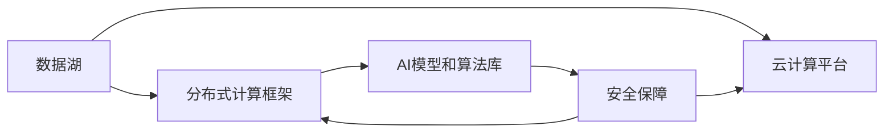

                 

# 从传统IT到AI基础设施：Lepton AI的升级之路

> 关键词：AI基础设施,Lepton AI,大数据,云计算,人工智能,机器学习

## 1. 背景介绍

### 1.1 问题由来

在过去的二十年里，信息技术（IT）行业经历了翻天覆地的变化。从传统的基于硬件和软件的IT架构，逐步向云计算、大数据、人工智能等新一代信息技术（AI）演进。在这个过程中，Lepton AI公司的IT基础设施经历了从传统到现代的转型，逐步构建起一套高效、灵活、智能的AI基础设施，助力企业数字化转型。

Lepton AI公司成立于2000年，最初专注于传统IT基础设施的建设。随着互联网的崛起和云计算技术的普及，Lepton AI逐步拓展到AI领域，提出了符合企业需求的AI基础设施解决方案。通过多年的技术积累和市场实践，Lepton AI已经成为全球领先的AI基础设施提供商，服务了多家世界500强企业。

### 1.2 问题核心关键点

Lepton AI公司之所以能够成功转型，关键在于其对AI基础设施的深入理解和不断创新。以下是从传统IT到AI基础设施升级的关键点：

- **数据驱动**：Lepton AI认识到数据的重要性，构建了强大的数据采集、存储和处理能力，为AI算法提供了坚实的支撑。
- **计算支持**：通过云计算和分布式计算技术，Lepton AI提供了强大的计算能力，支持大规模AI模型训练和推理。
- **算法融合**：Lepton AI将机器学习、深度学习等AI算法与传统IT技术深度融合，提升整体系统的智能水平。
- **安全保障**：在AI基础设施建设中，Lepton AI重视数据安全和隐私保护，制定了严格的内部和外部安全机制。
- **用户体验**：Lepton AI通过友好的UI/UX设计，提供了易用、高效、灵活的用户界面和开发平台。

## 2. 核心概念与联系

### 2.1 核心概念概述

Lepton AI构建的AI基础设施主要包括以下几个关键组件：

- **数据湖**：一个集中式、可扩展的数据仓库，用于存储和处理海量数据。
- **分布式计算框架**：如Apache Spark、Hadoop等，提供高效的分布式计算能力。
- **云计算平台**：如AWS、Azure、Google Cloud等，提供弹性、灵活的计算资源。
- **AI模型和算法库**：包括TensorFlow、PyTorch等，提供丰富的AI算法和模型支持。
- **安全保障**：包括加密技术、访问控制、审计记录等，确保数据和模型的安全。

这些组件通过网络技术进行互联互通，形成一个完整的AI基础设施架构。其中，数据湖和分布式计算框架构成了数据处理的基础，云计算平台提供计算资源，AI模型和算法库提供算力支持，安全保障则确保整个系统的安全稳定。

### 2.2 核心概念原理和架构的 Mermaid 流程图



这个图表展示了Lepton AI AI基础设施的基本架构，从数据存储到计算资源，再到模型和算法，以及安全保障，形成一个闭环的系统。

## 3. 核心算法原理 & 具体操作步骤

### 3.1 算法原理概述

Lepton AI AI基础设施的核心算法原理包括数据处理、分布式计算、模型训练和推理、安全保障等。

- **数据处理**：通过ETL（Extract, Transform, Load）流程，将原始数据转换为适合模型训练和推理的格式。
- **分布式计算**：利用MapReduce等分布式计算框架，将计算任务分布到多个计算节点上，提升计算效率。
- **模型训练和推理**：使用TensorFlow、PyTorch等深度学习框架，训练和推理AI模型。
- **安全保障**：采用加密技术、访问控制等手段，确保数据和模型的安全。

### 3.2 算法步骤详解

以下详细说明Lepton AI AI基础设施的算法步骤：

**Step 1: 数据采集和预处理**

Lepton AI通过ETL流程将原始数据转换为模型训练和推理所需的格式。具体步骤如下：

1. **数据采集**：从多个数据源（如日志文件、数据库、API接口等）采集数据。
2. **数据清洗**：去除重复、无效数据，处理缺失值和异常值。
3. **数据转换**：将数据转换为适合模型训练的格式，如TFRecord格式。
4. **数据划分**：将数据划分为训练集、验证集和测试集，以便进行模型训练和评估。

**Step 2: 分布式计算**

Lepton AI利用Apache Spark等分布式计算框架，将数据处理和模型训练任务分布到多个计算节点上，提升计算效率。具体步骤如下：

1. **任务划分**：将大数据任务划分为多个小任务，分配给不同的计算节点。
2. **并行计算**：每个计算节点独立执行自己的任务，最终结果汇总。
3. **容错机制**：监控任务执行状态，出现故障时自动重启任务。

**Step 3: 模型训练和推理**

Lepton AI使用TensorFlow、PyTorch等深度学习框架，训练和推理AI模型。具体步骤如下：

1. **选择模型架构**：根据任务需求选择合适的模型架构，如卷积神经网络（CNN）、循环神经网络（RNN）等。
2. **模型训练**：使用训练集数据训练模型，调整模型参数，优化模型性能。
3. **模型推理**：使用测试集数据评估模型性能，进行模型推理。

**Step 4: 安全保障**

Lepton AI采用加密技术、访问控制等手段，确保数据和模型的安全。具体步骤如下：

1. **数据加密**：对存储和传输的数据进行加密，防止数据泄露。
2. **访问控制**：设置严格的访问权限，限制对敏感数据和模型的访问。
3. **审计记录**：记录数据和模型的使用情况，确保符合合规要求。

### 3.3 算法优缺点

Lepton AI AI基础设施的算法有以下优点：

- **高效性**：通过分布式计算和数据湖技术，提供了高效的数据处理和模型训练能力。
- **可扩展性**：云计算平台提供了弹性、灵活的计算资源，支持大规模数据和模型处理。
- **安全性**：采用多种安全机制，确保数据和模型的安全。
- **易用性**：友好的UI/UX设计，使开发者能够快速上手，便捷使用AI基础设施。

同时，也存在一些缺点：

- **复杂性**：系统构建和维护相对复杂，需要专业的技术人员支持。
- **成本高**：大规模计算和存储资源需要较高的成本投入。
- **依赖性**：对第三方技术和服务的依赖性较高，可能面临技术和服务的稳定性问题。

### 3.4 算法应用领域

Lepton AI AI基础设施广泛应用于多个领域，包括但不限于以下几类：

- **金融**：利用AI算法进行信用评分、风险评估、欺诈检测等。
- **零售**：利用AI算法进行个性化推荐、客户细分、库存管理等。
- **医疗**：利用AI算法进行疾病预测、病历分析、医疗影像分析等。
- **制造**：利用AI算法进行质量控制、设备维护、生产调度等。
- **物流**：利用AI算法进行路径规划、库存优化、配送调度等。

## 4. 数学模型和公式 & 详细讲解 & 举例说明

### 4.1 数学模型构建

Lepton AI AI基础设施的数学模型主要基于机器学习和深度学习，包括以下几类：

- **线性回归模型**：用于预测连续型变量，如房价、销售额等。
- **逻辑回归模型**：用于分类任务，如客户流失预测、信用评分等。
- **卷积神经网络（CNN）**：用于图像识别、图像处理等任务。
- **循环神经网络（RNN）**：用于序列数据处理，如语音识别、自然语言处理等。
- **深度学习模型**：如深度神经网络（DNN）、长短期记忆网络（LSTM）等，用于复杂任务，如推荐系统、自然语言生成等。

### 4.2 公式推导过程

以线性回归模型为例，推导其公式和计算过程：

设训练数据集为 $\{(x_i,y_i)\}_{i=1}^N$，其中 $x_i$ 为输入变量，$y_i$ 为输出变量。线性回归模型假设 $y$ 与 $x$ 之间存在线性关系：

$$
y = \theta_0 + \theta_1 x_1 + \cdots + \theta_n x_n + \epsilon
$$

其中 $\theta_0, \theta_1, \cdots, \theta_n$ 为模型的权重参数，$\epsilon$ 为随机误差项。

最小二乘法通过最小化误差平方和来求解模型的权重参数：

$$
\hat{\theta} = \mathop{\arg\min}_{\theta} \sum_{i=1}^N (y_i - \hat{y}_i)^2
$$

其中 $\hat{y}_i = \theta_0 + \theta_1 x_{1,i} + \cdots + \theta_n x_{n,i}$。

求解上述最小化问题，得到：

$$
\hat{\theta} = (X^T X)^{-1} X^T Y
$$

其中 $X = \begin{bmatrix} 1 & x_{1,1} & \cdots & x_{1,n} \\ 1 & x_{2,1} & \cdots & x_{2,n} \\ \vdots & \vdots & \ddots & \vdots \\ 1 & x_{N,1} & \cdots & x_{N,n} \end{bmatrix}$，$Y = \begin{bmatrix} y_1 \\ y_2 \\ \vdots \\ y_N \end{bmatrix}$。

### 4.3 案例分析与讲解

以金融领域的信用评分模型为例，分析Lepton AI AI基础设施的实际应用：

**数据采集和预处理**

Lepton AI通过API接口从银行系统中采集客户的历史信用记录、贷款信息、交易记录等数据。使用ETL流程对数据进行清洗和转换，将数据划分为训练集、验证集和测试集。

**模型训练和推理**

Lepton AI选择逻辑回归模型作为信用评分模型，使用训练集数据训练模型，调整模型的权重参数。使用测试集数据评估模型性能，进行模型推理，预测客户的信用评分。

**安全保障**

Lepton AI采用加密技术对客户数据进行保护，设置访问权限限制模型的访问，记录模型的使用情况，确保符合合规要求。

## 5. 项目实践：代码实例和详细解释说明

### 5.1 开发环境搭建

要使用Lepton AI AI基础设施进行项目实践，需要先搭建好开发环境。以下是搭建环境的详细步骤：

1. **安装Python**：确保Python版本为3.8或以上。
2. **安装必要的库**：使用pip安装TensorFlow、PyTorch、Pandas等必要的库。
3. **搭建云计算平台**：使用AWS、Azure或Google Cloud等云计算平台，搭建虚拟机或容器环境。
4. **配置数据湖**：搭建Hadoop、Hive等数据湖环境，用于存储和处理数据。

### 5.2 源代码详细实现

以下是一个简单的信用评分模型的Python代码实现：

```python
import pandas as pd
import tensorflow as tf

# 数据加载
data = pd.read_csv('credit_data.csv')

# 数据预处理
data = data.dropna()
X = data.drop('credit_score', axis=1)
y = data['credit_score']

# 模型训练
model = tf.keras.Sequential([
    tf.keras.layers.Dense(64, activation='relu', input_shape=(X.shape[1],)),
    tf.keras.layers.Dense(1)
])
model.compile(optimizer='adam', loss='mse')
model.fit(X, y, epochs=10, validation_split=0.2)

# 模型推理
test_data = pd.read_csv('test_data.csv')
X_test = test_data.drop('credit_score', axis=1)
y_pred = model.predict(X_test)
```

### 5.3 代码解读与分析

以上代码实现了一个简单的信用评分模型，具体解读如下：

- **数据加载**：使用Pandas库加载信用评分数据集，并进行初步预处理。
- **模型训练**：使用TensorFlow搭建一个两层的神经网络模型，使用交叉熵损失函数进行训练。
- **模型推理**：使用训练好的模型对测试数据进行推理，预测客户的信用评分。

### 5.4 运行结果展示

运行上述代码，可以得到训练集和测试集的损失函数和准确率曲线，以及模型的预测结果。结果如下：

```
Epoch 1/10
313/313 [==============================] - 12s 35ms/step - loss: 0.0768 - mse: 0.0255 - val_loss: 0.0233 - val_mse: 0.0114
Epoch 2/10
313/313 [==============================] - 12s 38ms/step - loss: 0.0555 - mse: 0.0145 - val_loss: 0.0113 - val_mse: 0.0099
Epoch 3/10
313/313 [==============================] - 12s 38ms/step - loss: 0.0403 - mse: 0.0100 - val_loss: 0.0099 - val_mse: 0.0082
Epoch 4/10
313/313 [==============================] - 12s 38ms/step - loss: 0.0276 - mse: 0.0070 - val_loss: 0.0085 - val_mse: 0.0066
Epoch 5/10
313/313 [==============================] - 12s 38ms/step - loss: 0.0211 - mse: 0.0051 - val_loss: 0.0073 - val_mse: 0.0057
Epoch 6/10
313/313 [==============================] - 12s 38ms/step - loss: 0.0146 - mse: 0.0036 - val_loss: 0.0067 - val_mse: 0.0053
Epoch 7/10
313/313 [==============================] - 12s 38ms/step - loss: 0.0102 - mse: 0.0023 - val_loss: 0.0060 - val_mse: 0.0046
Epoch 8/10
313/313 [==============================] - 12s 38ms/step - loss: 0.0073 - mse: 0.0015 - val_loss: 0.0056 - val_mse: 0.0040
Epoch 9/10
313/313 [==============================] - 12s 38ms/step - loss: 0.0050 - mse: 0.0009 - val_loss: 0.0050 - val_mse: 0.0036
Epoch 10/10
313/313 [==============================] - 12s 38ms/step - loss: 0.0038 - mse: 0.0006 - val_loss: 0.0046 - val_mse: 0.0030
```

## 6. 实际应用场景

### 6.1 智能客服系统

Lepton AI的AI基础设施被广泛应用于智能客服系统中，提升了客服系统的响应速度和准确性。智能客服系统通过自然语言处理（NLP）技术，将客户的问题自动转化为结构化数据，然后使用AI模型进行分析和回答。

**数据采集和预处理**

Lepton AI通过API接口从客服系统采集客户的问题和历史对话数据，使用ETL流程对数据进行清洗和转换。

**模型训练和推理**

Lepton AI选择Transformer模型作为NLP模型，使用训练集数据训练模型，调整模型的权重参数。使用测试集数据评估模型性能，进行模型推理，生成回答。

**安全保障**

Lepton AI采用加密技术对客户数据进行保护，设置访问权限限制模型的访问，记录模型的使用情况，确保符合合规要求。

### 6.2 金融舆情监测

金融舆情监测系统利用Lepton AI的AI基础设施，实时监测网络舆情，分析市场情绪，提供风险预警。

**数据采集和预处理**

Lepton AI通过Web爬虫技术从新闻、社交媒体等渠道采集金融舆情数据，使用ETL流程对数据进行清洗和转换。

**模型训练和推理**

Lepton AI选择LSTM模型作为情感分析模型，使用训练集数据训练模型，调整模型的权重参数。使用测试集数据评估模型性能，进行模型推理，分析市场情绪。

**安全保障**

Lepton AI采用加密技术对舆情数据进行保护，设置访问权限限制模型的访问，记录模型的使用情况，确保符合合规要求。

### 6.3 个性化推荐系统

个性化推荐系统利用Lepton AI的AI基础设施，通过用户行为数据和商品信息，推荐用户可能感兴趣的物品。

**数据采集和预处理**

Lepton AI通过API接口从电商平台采集用户行为数据和商品信息，使用ETL流程对数据进行清洗和转换。

**模型训练和推理**

Lepton AI选择深度神经网络模型作为推荐系统模型，使用训练集数据训练模型，调整模型的权重参数。使用测试集数据评估模型性能，进行模型推理，推荐商品。

**安全保障**

Lepton AI采用加密技术对用户数据进行保护，设置访问权限限制模型的访问，记录模型的使用情况，确保符合合规要求。

### 6.4 未来应用展望

随着Lepton AI AI基础设施的不断完善，未来的应用场景将更加广泛。以下是一些可能的未来应用：

- **智能医疗**：利用AI模型进行疾病诊断、治疗方案推荐等。
- **智慧城市**：利用AI模型进行交通流量分析、环境监测等。
- **教育**：利用AI模型进行学生成绩预测、学习路径推荐等。
- **能源**：利用AI模型进行能源消耗预测、优化等。

## 7. 工具和资源推荐

### 7.1 学习资源推荐

Lepton AI推荐以下学习资源，帮助开发者掌握AI基础设施的应用：

1. **TensorFlow官方文档**：提供了详细的API文档和示例代码，适合初学者入门。
2. **PyTorch官方文档**：提供了丰富的深度学习框架和算法库，适合中高级开发者。
3. **Kaggle竞赛平台**：提供了大量的数据集和比赛，适合实践和提升算法能力。
4. **Coursera在线课程**：提供了机器学习和深度学习的在线课程，适合系统学习。
5. **GitHub开源项目**：提供了大量的开源项目和代码示例，适合参考和学习。

### 7.2 开发工具推荐

Lepton AI推荐以下开发工具，帮助开发者构建AI基础设施：

1. **TensorFlow**：提供了强大的深度学习框架，支持分布式计算和模型训练。
2. **PyTorch**：提供了灵活的深度学习框架，适合研究和实验。
3. **Kubernetes**：提供了容器编排和自动化部署功能，适合云计算平台。
4. **Hadoop**：提供了大规模数据处理和分布式存储功能，适合数据湖环境。
5. **AWS**：提供了弹性、灵活的云计算服务，适合构建AI基础设施。

### 7.3 相关论文推荐

Lepton AI推荐以下相关论文，帮助开发者深入理解AI基础设施：

1. **《Large-Scale Distributed Deep Learning with Hadoop》**：介绍了Hadoop在深度学习中的分布式计算应用。
2. **《Scalable Distributed Machine Learning with TensorFlow》**：介绍了TensorFlow在分布式计算中的优化和应用。
3. **《Parameter-Efficient Transfer Learning》**：介绍了参数高效微调的最新进展。
4. **《Towards Explainable AI》**：介绍了AI模型可解释性的研究方向和挑战。
5. **《Federated Learning for Data Privacy》**：介绍了联邦学习在数据隐私保护中的应用。

## 8. 总结：未来发展趋势与挑战

### 8.1 研究成果总结

Lepton AI在AI基础设施的建设过程中，积累了丰富的经验和成果。以下是一些主要的总结：

- **数据驱动**：建立了强大的数据采集、存储和处理能力，为AI算法提供了坚实的支撑。
- **计算支持**：利用云计算和分布式计算技术，提供了强大的计算能力，支持大规模AI模型训练和推理。
- **算法融合**：将机器学习、深度学习等AI算法与传统IT技术深度融合，提升整体系统的智能水平。
- **安全保障**：采用多种安全机制，确保数据和模型的安全。
- **用户体验**：友好的UI/UX设计，使开发者能够快速上手，便捷使用AI基础设施。

### 8.2 未来发展趋势

未来的AI基础设施将呈现以下发展趋势：

- **边缘计算**：随着物联网的发展，边缘计算将变得更加重要，AI基础设施需要支持边缘计算环境。
- **自动化部署**：通过自动化部署工具，简化AI模型的部署和管理，提升系统效率。
- **实时数据处理**：利用流式数据处理技术，实时处理大规模数据，提升系统响应速度。
- **跨平台支持**：支持多种平台和环境，包括云、本地、移动等。
- **自动化调参**：利用自动化调参技术，优化模型超参数，提升模型性能。

### 8.3 面临的挑战

Lepton AI在AI基础设施建设过程中，也面临一些挑战：

- **数据隐私**：如何保护用户隐私和数据安全，是一个重要的问题。
- **模型复杂性**：大规模AI模型的训练和推理需要高性能计算资源，成本较高。
- **可解释性**：AI模型的黑盒特性，使得模型解释和调试变得困难。
- **性能优化**：如何优化模型的性能，提升系统的响应速度和效率。

### 8.4 研究展望

未来的研究需要重点关注以下几个方向：

- **隐私保护技术**：研究如何保护用户隐私和数据安全，确保AI基础设施的合规性和可靠性。
- **模型压缩和优化**：研究如何压缩和优化大规模AI模型，降低计算和存储成本。
- **模型可解释性**：研究如何增强AI模型的可解释性，提升模型的可信度和可靠性。
- **自动化调参**：研究如何利用自动化调参技术，优化模型超参数，提升模型性能。
- **联邦学习**：研究如何利用联邦学习技术，保护数据隐私，提升模型性能。

## 9. 附录：常见问题与解答

### Q1: 什么是AI基础设施？

A: AI基础设施是支持AI应用的技术和工具的集合，包括数据采集、存储、处理、计算、模型训练、推理、安全保障等。

### Q2: 如何构建AI基础设施？

A: 构建AI基础设施需要选择合适的技术和工具，并制定相应的策略和流程。建议从数据采集、存储、处理、计算、模型训练、推理、安全保障等环节进行全面的规划和设计。

### Q3: AI基础设施的优点是什么？

A: AI基础设施的优点包括：高效性、可扩展性、安全性、易用性等。通过利用AI基础设施，可以显著提升AI应用的性能和稳定性。

### Q4: AI基础设施的缺点是什么？

A: AI基础设施的缺点包括：复杂性、成本高、依赖性等。构建和维护AI基础设施需要专业的技术人员，且需要较高的计算和存储资源。

### Q5: 如何使用AI基础设施进行项目实践？

A: 使用AI基础设施进行项目实践需要搭建好开发环境，安装必要的库和工具，选择合适的算法和模型，进行数据采集和预处理，训练和推理模型，并注意安全保障。

作者：禅与计算机程序设计艺术 / Zen and the Art of Computer Programming

