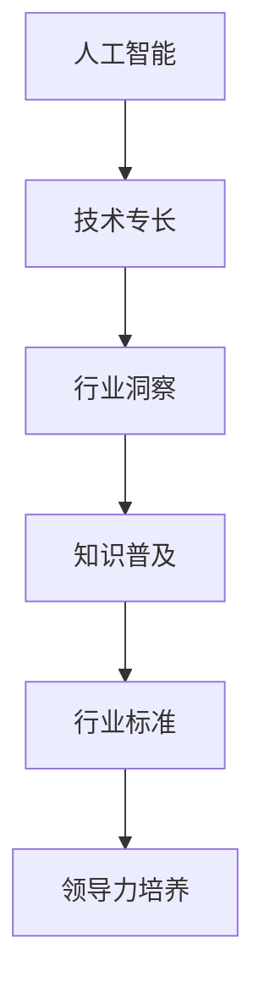

                 

# 从技术专家到行业意见领袖

> 关键词：人工智能,技术专长,行业洞察,知识普及,行业标准,领导力培养

## 1. 背景介绍

### 1.1 问题由来

在当前快速发展的IT行业中，技术的革新和应用的普及速度前所未有。技术专家们需要不断地更新知识体系，跟进最新技术进展，但仅仅掌握技术和代码还远远不够，要成为一名具有行业影响力的意见领袖，还需要更深的行业洞察力和广泛的行业联系。

### 1.2 问题核心关键点

从一个技术专家转变为行业意见领袖，关键在于以下几个方面：

- 技术专长：深入掌握所领域核心技术和最新进展。
- 行业洞察：理解行业趋势，洞察行业痛点和机会。
- 知识普及：通过撰写文章、演讲、教学等形式，普及专业知识。
- 行业标准：参与制定和推动行业标准，形成行业规范。
- 领导力培养：建立良好的人际关系，成为团队领导和行业引领者。

## 2. 核心概念与联系

### 2.1 核心概念概述

要成为一名行业意见领袖，我们需要理解并运用以下核心概念：

- 人工智能(AI)：利用计算机技术模拟、延伸和扩展人的智能能力。
- 技术专长：在特定技术领域内具备深厚的理论基础和实践经验。
- 行业洞察：对所在行业有深刻的理解和预见，能把握行业趋势和机会。
- 知识普及：通过各种形式传播和普及专业知识，提高行业认知水平。
- 行业标准：参与制定行业规范和标准，推动行业健康发展。
- 领导力培养：具备领导和组织能力，影响并带领团队实现共同目标。

这些概念之间的逻辑关系可以通过以下Mermaid流程图来展示：



这个流程图展示了从技术专长到行业意见领袖的路径。

## 3. 核心算法原理 & 具体操作步骤

### 3.1 算法原理概述

从技术专家到行业意见领袖的转变，是一个不断学习和积累的过程。这其中，算法原理和操作步骤至关重要。以下将以“如何撰写一篇高质量的技术博客”为例，阐述核心算法原理和具体操作步骤。

**核心算法原理**：
- 问题建模：定义问题，明确目标和受众。
- 内容构建：结构化文章内容，包含引言、背景、核心算法、操作步骤、应用场景、未来展望等。
- 数据支持和案例分析：以数据和案例分析来支撑文章论点，增强说服力。
- 交互与反馈：通过评论、社交媒体等方式收集反馈，调整和优化文章。
- 知识传播与普及：利用各种渠道传播文章，提高影响力和知名度。

**操作步骤**：
1. 选题和调研：选择有价值且受众感兴趣的主题，进行深入调研。
2. 文章构思：制定文章结构，确定每个部分的重点内容。
3. 撰写和编辑：使用清晰、专业的技术语言撰写文章，反复编辑润色。
4. 知识普及：通过博客、社交媒体、演讲等方式传播文章，分享知识。
5. 持续更新：根据反馈和行业动态，定期更新和修订文章内容。

### 3.2 算法步骤详解

#### 3.2.1 选题和调研

**步骤**：
- 确定目标受众：了解受众的背景、兴趣和需求。
- 分析选题：评估选题的难度、新颖性和适用性。
- 文献回顾：查阅相关文献，了解已有研究成果和知识空白。

**案例**：
- 假设你是一名区块链技术专家，选题为“去中心化身份验证技术的发展和应用”。你需要了解最新的区块链技术进展、身份验证的相关研究和行业应用。

#### 3.2.2 文章构思

**步骤**：
- 定义核心问题：明确文章的讨论重点。
- 构建文章结构：设定文章各部分的主题和内容。
- 确定关键论点：明确每个部分的主要观点和论据。

**案例**：
- 你决定文章分为四部分：引言、背景、核心算法、操作步骤。其中，核心算法部分将详细描述几种去中心化身份验证技术。

#### 3.2.3 撰写和编辑

**步骤**：
- 使用专业术语：清晰准确地使用技术术语，避免歧义。
- 组织逻辑结构：逻辑清晰，结构严谨，便于读者理解。
- 反复编辑润色：确保语法正确，语言流畅，思想深刻。

**案例**：
- 撰写“去中心化身份验证技术”一文时，详细描述各种技术的原理、优缺点和应用场景。使用图表、代码段等辅助说明，增强说服力。

#### 3.2.4 知识普及

**步骤**：
- 选择合适的传播渠道：如博客、社交媒体、学术会议等。
- 定期更新内容：根据行业动态和技术进展，持续更新和修订文章。
- 建立反馈机制：鼓励读者评论和反馈，及时回应和改进。

**案例**：
- 发布文章后，通过LinkedIn分享，邀请行业内的专家和爱好者进行评论和讨论。定期更新文章内容，保持话题的持续热度。

#### 3.2.5 持续更新

**步骤**：
- 跟踪行业动态：关注最新技术进展和行业趋势。
- 分析读者反馈：根据读者的意见和建议，优化文章内容。
- 更新和修订：结合最新的研究和实践，不断修订文章。

**案例**：
- 定期阅读相关技术论文和行业报告，更新文章中的案例和数据。根据读者的评论和建议，补充和修正文章内容。

### 3.3 算法优缺点

#### 3.3.1 算法优点

- 系统化：结构化的文章编写流程，有助于清晰表达和深入分析。
- 互动性：通过评论和反馈机制，可以不断改进文章内容，增强互动性。
- 广泛传播：利用多种传播渠道，能够迅速扩大影响力和受众范围。
- 持续更新：根据行业动态和技术进展，定期更新内容，保持文章的时效性和实用性。

#### 3.3.2 算法缺点

- 撰写难度大：需要较高的专业知识和写作技巧。
- 时间成本高：选题、调研、写作、编辑和传播都需要投入大量时间。
- 需要持续维护：随着行业变化，需要不断更新和修订文章。

### 3.4 算法应用领域

#### 3.4.1 软件开发

在软件开发领域，技术专家可以通过撰写技术博客、开源项目文档等方式，普及软件开发技术和最佳实践，推动技术社区的发展。

#### 3.4.2 数据科学

数据科学家可以通过技术博客和演讲，分享数据分析方法和实践经验，普及数据科学知识和工具，推动数据驱动决策。

#### 3.4.3 人工智能

AI专家可以撰写关于深度学习、自然语言处理、计算机视觉等领域的文章，普及AI技术，推动行业应用和创新。

## 4. 数学模型和公式 & 详细讲解 & 举例说明

### 4.1 数学模型构建

假设你想撰写一篇关于深度学习神经网络的文章，可以从以下模型构建：

**输入数据**：
- 神经网络的输入向量 $x \in \mathbb{R}^n$。
- 目标输出向量 $y \in \mathbb{R}^m$。

**模型定义**：
- 神经网络由若干层组成，每层包含若干神经元。
- 神经元通过加权和激活函数 $f$ 计算输出。

**损失函数**：
- 常见损失函数如均方误差（MSE）、交叉熵损失（CE）等。

### 4.2 公式推导过程

#### 4.2.1 均方误差损失函数（MSE）

**公式**：
$$
\mathcal{L}(y,\hat{y}) = \frac{1}{2}(y-\hat{y})^2
$$

**推导**：
- 定义均方误差损失函数：
$$
\mathcal{L}(y,\hat{y}) = \frac{1}{2}(y-\hat{y})^2
$$
- 对损失函数求导，得到梯度：
$$
\frac{\partial \mathcal{L}(y,\hat{y})}{\partial \theta} = (y-\hat{y}) \cdot \frac{\partial \hat{y}}{\partial \theta}
$$

#### 4.2.2 反向传播算法

**公式**：
$$
\frac{\partial \mathcal{L}(y,\hat{y})}{\partial w} = \frac{\partial \mathcal{L}(y,\hat{y})}{\partial z} \cdot \frac{\partial z}{\partial w}
$$

**推导**：
- 定义神经元输出：
$$
z = w \cdot x + b
$$
- 应用链式法则：
$$
\frac{\partial \mathcal{L}(y,\hat{y})}{\partial z} = \frac{\partial \mathcal{L}(y,\hat{y})}{\partial y} \cdot \frac{\partial y}{\partial z}
$$
- 将 $y$ 和 $z$ 替换为神经元输出 $\hat{y}$ 和输入 $z$：
$$
\frac{\partial \mathcal{L}(y,\hat{y})}{\partial z} = \frac{\partial \mathcal{L}(y,\hat{y})}{\partial \hat{y}} \cdot \frac{\partial \hat{y}}{\partial z}
$$

### 4.3 案例分析与讲解

#### 4.3.1 均方误差损失函数应用

假设你正在训练一个二分类问题，输入向量 $x$，目标输出 $y$。使用神经网络进行二分类，输出 $\hat{y} = \sigma(w \cdot x + b)$。

- 训练集大小为 $N$，每个样本输入 $x_i$，输出 $y_i$。
- 均方误差损失函数：
$$
\mathcal{L} = \frac{1}{N} \sum_{i=1}^N (y_i - \hat{y}_i)^2
$$

#### 4.3.2 反向传播算法应用

假设神经网络包含一个隐藏层，其中 $w_1$ 为权重矩阵，$b_1$ 为偏置向量。

- 隐藏层输出：
$$
z_1 = w_1 \cdot x + b_1
$$
- 应用激活函数：
$$
y_1 = \sigma(z_1)
$$
- 输出层：
$$
z_2 = w_2 \cdot y_1 + b_2
$$
- 输出：
$$
\hat{y} = \sigma(z_2)
$$

## 5. 项目实践：代码实例和详细解释说明

### 5.1 开发环境搭建

#### 5.1.1 Python环境搭建

1. 安装Anaconda：
   ```bash
   conda install anaconda
   ```
2. 创建虚拟环境：
   ```bash
   conda create --name myenv python=3.8
   conda activate myenv
   ```
3. 安装必要的库：
   ```bash
   conda install pandas numpy matplotlib jupyter
   pip install tensorflow
   ```

#### 5.1.2 TensorFlow环境搭建

1. 安装TensorFlow：
   ```bash
   pip install tensorflow==2.x
   ```
2. 安装TensorBoard：
   ```bash
   pip install tensorboard
   ```

### 5.2 源代码详细实现

#### 5.2.1 代码实现示例

假设你正在编写一个TensorFlow神经网络模型，用于图像分类任务。以下是一个简单的代码实现示例：

```python
import tensorflow as tf
import matplotlib.pyplot as plt
import numpy as np

# 定义模型
def model():
    # 输入层
    input_layer = tf.keras.Input(shape=(28, 28, 1))
    
    # 卷积层
    conv_layer = tf.keras.layers.Conv2D(32, (3, 3), activation='relu')(input_layer)
    pool_layer = tf.keras.layers.MaxPooling2D((2, 2))(conv_layer)
    
    # 全连接层
    fc_layer = tf.keras.layers.Flatten()(pool_layer)
    dense_layer = tf.keras.layers.Dense(10, activation='softmax')(fc_layer)
    
    # 模型
    model = tf.keras.Model(inputs=input_layer, outputs=dense_layer)
    
    return model

# 构建模型
model = model()

# 编译模型
model.compile(optimizer='adam',
              loss='sparse_categorical_crossentropy',
              metrics=['accuracy'])

# 训练模型
model.fit(x_train, y_train, epochs=10, batch_size=32, validation_data=(x_test, y_test))
```

### 5.3 代码解读与分析

#### 5.3.1 TensorFlow模型构建

1. `input_layer`：定义输入层，形状为 $(28, 28, 1)$，即输入的图像尺寸为 $28\times28$，通道数为 1。
2. `conv_layer`：添加卷积层，使用 32 个 $3\times3$ 的卷积核，激活函数为 ReLU。
3. `pool_layer`：添加池化层，使用 $2\times2$ 的最大池化，减少特征维度。
4. `fc_layer`：添加全连接层，将池化层的输出展平后，连接 10 个神经元，激活函数为 Softmax。
5. `dense_layer`：输出层，使用 Softmax 函数输出 10 个类别的概率。
6. `model`：定义模型，将输入层和输出层连接起来。

#### 5.3.2 模型编译与训练

1. `compile`：编译模型，指定优化器、损失函数和评价指标。
2. `fit`：训练模型，指定训练数据、验证数据、迭代次数和批次大小。

### 5.4 运行结果展示

#### 5.4.1 模型训练

在训练过程中，可以使用 TensorBoard 查看训练过程和模型性能：

```bash
tensorboard --logdir=logs
```

### 6. 实际应用场景

#### 6.1 软件开发

技术专家可以通过撰写技术博客、开源项目文档等方式，普及软件开发技术和最佳实践，推动技术社区的发展。

#### 6.2 数据科学

数据科学家可以通过技术博客和演讲，分享数据分析方法和实践经验，普及数据科学知识和工具，推动数据驱动决策。

#### 6.3 人工智能

AI专家可以撰写关于深度学习、自然语言处理、计算机视觉等领域的文章，普及AI技术，推动行业应用和创新。

## 7. 工具和资源推荐

### 7.1 学习资源推荐

#### 7.1.1 书籍推荐

1. 《深度学习》：Ian Goodfellow 著，全面介绍深度学习理论和实践。
2. 《机器学习实战》：Peter Harrington 著，实战导向，适合初学者。
3. 《TensorFlow实战》：Manning Publications 著，详细讲解 TensorFlow 使用。

#### 7.1.2 在线课程

1. Coursera《深度学习专项课程》：Andrew Ng 主讲，全面覆盖深度学习理论和实践。
2. Udacity《人工智能纳米学位》：包含计算机视觉、自然语言处理等多个领域课程。
3. edX《数据科学微硕士》：涵盖数据科学全栈课程，包括数据清洗、分析、可视化等。

### 7.2 开发工具推荐

#### 7.2.1 编程工具

1. Visual Studio Code：跨平台的轻量级代码编辑器，支持 Python、TensorFlow 等。
2. PyCharm：专业的 Python 开发工具，支持 Jupyter Notebook、Django 等框架。
3. Sublime Text：轻量级的代码编辑器，支持多种编程语言。

#### 7.2.2 版本控制

1. Git：全球主流版本控制工具，支持分布式版本控制。
2. GitHub：全球最大的代码托管平台，支持代码协作和项目管理。
3. GitLab：开源、自托管版本控制工具，支持 CI/CD 和项目管理。

### 7.3 相关论文推荐

#### 7.3.1 经典论文

1. 《深度学习》：Ian Goodfellow 著，深度学习领域经典教材。
2. 《计算机视觉：算法与应用》：Richard Szeliski 著，全面介绍计算机视觉理论和方法。
3. 《自然语言处理综论》：Daniel Jurafsky & James H. Martin 著，自然语言处理领域的经典教材。

## 8. 总结：未来发展趋势与挑战

### 8.1 研究成果总结

从技术专家到行业意见领袖的转变，需要不断学习和积累。通过撰写技术博客、开源项目文档、参加技术会议等方式，可以逐步提升影响力。

### 8.2 未来发展趋势

#### 8.2.1 技术深入化

随着技术的不断发展，专家需要不断学习和掌握新的技术，深入理解核心原理和实际应用。

#### 8.2.2 知识普及化

通过各种形式普及知识，帮助更多人理解和应用新技术，推动行业发展。

#### 8.2.3 行业标准化

参与制定和推动行业标准，形成规范化的技术实践和流程。

### 8.3 面临的挑战

#### 8.3.1 技术更新快

技术更新速度快，需要不断学习和更新知识体系，保持技术领先。

#### 8.3.2 知识普及难度大

需要具备良好的写作和表达能力，将复杂的技术知识通俗易懂地传达给受众。

#### 8.3.3 行业标准差异

不同行业和技术领域有各自的规范和标准，需要具备跨领域的理解能力。

### 8.4 研究展望

未来需要在以下几个方面进行研究：

#### 8.4.1 技术创新

持续关注和研究新技术，推动技术进步和应用创新。

#### 8.4.2 知识传播

通过多种形式普及知识，提高行业认知水平，推动行业发展。

#### 8.4.3 行业规范

参与制定和推动行业标准，形成规范化的技术实践和流程。

## 9. 附录：常见问题与解答

**Q1：如何成为一名行业意见领袖？**

A: 成为一名行业意见领袖，需要不断学习、积累和传播知识，具备技术专长和行业洞察力。通过撰写技术博客、开源项目文档、参加技术会议等方式，逐步提升影响力。

**Q2：如何提高文章的阅读量和影响力？**

A: 选择合适的传播渠道，如博客、社交媒体、技术社区等。定期更新和修订文章，保持内容的时效性和实用性。建立反馈机制，及时回应用户评论和建议。

**Q3：如何平衡技术学习与知识传播？**

A: 制定合理的学习计划，合理分配时间和精力。优先学习对当前工作或研究有帮助的技术，同时定期撰写文章和分享知识。

**Q4：如何获取行业资讯和趋势？**

A: 关注行业新闻、参加技术会议、加入技术社区和专业组织，保持对行业动态的关注。阅读行业报告和技术白皮书，了解最新技术和市场趋势。

**Q5：如何建立良好的人际关系？**

A: 积极参与技术社区和行业活动，结识行业内的专家和爱好者。建立良好的个人品牌，通过博客、演讲等方式分享知识和经验，赢得同行的认可和尊重。

---

作者：禅与计算机程序设计艺术 / Zen and the Art of Computer Programming

