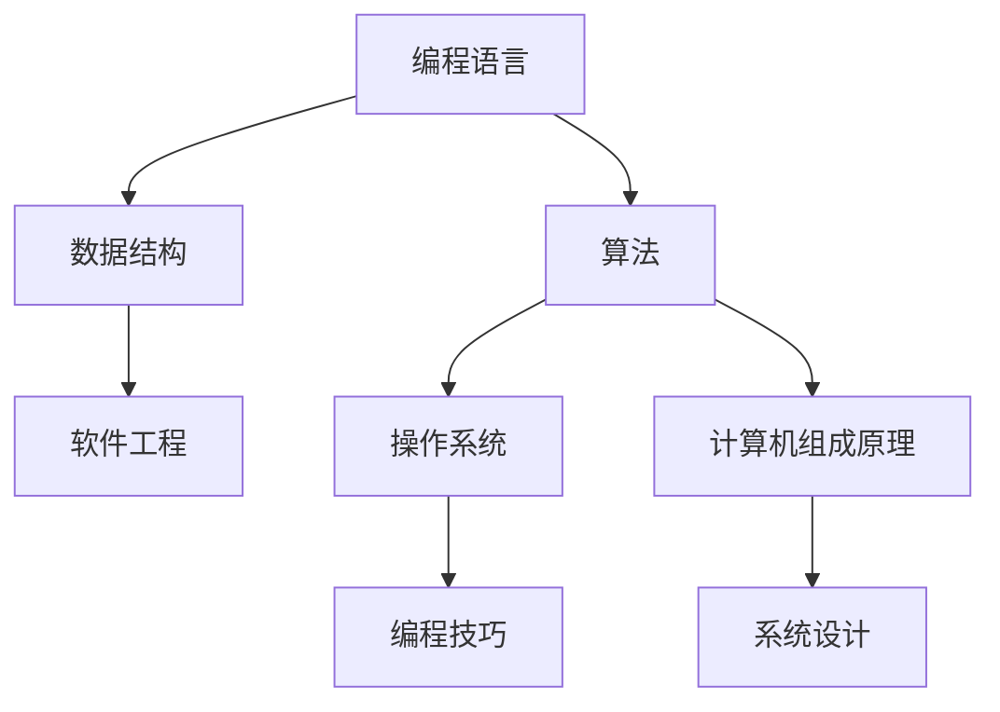

                 

# 从经典开始：奠定基础认知

> 关键词：计算机编程基础,数据结构与算法,软件工程,操作系统,计算机组成原理,编程范式,系统设计,测试与调试,项目开发,编程技巧

## 1. 背景介绍

### 1.1 问题由来
在当今这个信息爆炸的时代，计算机技术的应用已经渗透到各个领域，从科学研究到日常生活，从工业制造到金融交易，无处不在。然而，要真正掌握计算机编程技能，成为一名优秀的程序员，首先需要建立扎实的基础。这不仅仅是学习编程语言本身，更包括深入理解计算机科学的核心概念和技术原理。本文将从经典开始，全面介绍计算机编程基础、数据结构与算法、软件工程、操作系统、计算机组成原理等多个领域的核心概念和技术，为读者奠定坚实的基础认知。

### 1.2 问题核心关键点
本文将重点关注以下几个核心关键点：

1. **计算机编程基础**：深入讲解编程语言的基本概念、语法结构和编程范式，帮助读者建立编程思维。
2. **数据结构与算法**：详细解析常用的数据结构和经典算法，提供实用的案例分析，提升读者的编程能力。
3. **软件工程**：探讨软件开发的生命周期、项目管理、测试与调试等关键环节，帮助读者掌握软件开发的最佳实践。
4. **操作系统**：解析操作系统的基本原理、内存管理、文件系统等核心概念，帮助读者理解计算机系统的底层运作。
5. **计算机组成原理**：讲解计算机硬件的基本组成、指令集和存储器组织，帮助读者理解计算机系统的硬件基础。
6. **编程技巧与系统设计**：分享高效的编程技巧、系统设计原则，提升读者的代码质量和软件设计能力。

这些核心关键点将全面覆盖计算机编程和软件开发的基础知识，为读者后续深入学习和实践奠定坚实的基础。

## 2. 核心概念与联系

### 2.1 核心概念概述

为更好地理解上述核心关键点，本节将介绍几个密切相关的核心概念：

- **编程语言**：用于编写计算机程序的语言，包括高级语言（如Python、Java）和低级语言（如汇编语言）。
- **数据结构**：组织和存储数据的方式，包括数组、链表、栈、队列、树、图等。
- **算法**：解决问题的方法和步骤，常用的算法包括排序、查找、图遍历等。
- **软件工程**：软件开发的方法论，包括需求分析、设计、编码、测试和维护等环节。
- **操作系统**：管理计算机硬件资源、提供服务给用户的系统软件。
- **计算机组成原理**：计算机硬件和软件的基础原理，包括指令集、存储器、运算器等。
- **编程技巧**：高效编写代码的技巧和方法，如代码重构、代码复用等。
- **系统设计**：设计高效、可扩展的软件系统的原则和方法。

这些核心概念之间的逻辑关系可以通过以下Mermaid流程图来展示：



这个流程图展示了几大核心概念及其之间的关系：

1. 编程语言是软件开发的基础工具。
2. 数据结构和算法是编程的基础，直接影响程序效率和复杂度。
3. 软件工程涉及软件开发的全过程，从需求分析到测试维护，是实现高效软件开发的保障。
4. 操作系统和计算机组成原理是计算机系统的基础，影响程序的底层实现。
5. 编程技巧和系统设计进一步提升软件开发的效率和质量。

这些概念共同构成了计算机编程和软件开发的知识体系，帮助开发者从底层理解计算机系统的运作原理，提升代码质量和系统设计能力。

## 3. 核心算法原理 & 具体操作步骤
### 3.1 算法原理概述

算法是解决问题的基本方法，无论是在软件开发还是在计算机科学中，都有着举足轻重的作用。本文将重点介绍算法的基本原理和核心算法，涵盖排序、查找、图遍历等常见算法。

算法的基本原理包括：

- **问题分解**：将复杂问题分解成若干简单子问题。
- **递归**：通过函数调用自身来解决子问题。
- **动态规划**：通过分阶段求解子问题，优化计算效率。
- **贪心算法**：选择当前最优解，逐步逼近全局最优解。
- **回溯算法**：通过回溯和剪枝来搜索解空间，找到所有可能的解。

### 3.2 算法步骤详解

以下是几种常见算法的详细步骤：

#### 3.2.1 排序算法

排序算法是最基础、最常用的算法之一，常见的排序算法包括冒泡排序、选择排序、插入排序、快速排序和归并排序。这里以快速排序为例，介绍排序算法的详细步骤：

1. **选择基准元素**：选择一个基准元素（通常是第一个或最后一个元素）。
2. **分区操作**：将数组分成两部分，小于基准元素的放在左边，大于基准元素的放在右边。
3. **递归排序**：对左右两部分分别进行快速排序。
4. **合并结果**：将排好序的左右两部分合并，得到最终排序结果。

#### 3.2.2 查找算法

查找算法用于在数据集合中查找特定元素，常见的查找算法包括线性查找和二分查找。这里以二分查找为例：

1. **初始化**：将数据集合排序。
2. **查找过程**：取中间元素与目标元素比较，如果相等则返回，如果小于目标元素则在右半部分继续查找，如果大于目标元素则在左半部分继续查找。
3. **返回结果**：如果找到目标元素则返回其下标，否则返回-1。

#### 3.2.3 图遍历算法

图遍历算法用于遍历图的所有节点，常见的图遍历算法包括深度优先遍历和广度优先遍历。这里以深度优先遍历为例：

1. **选择起始节点**：选择一个起始节点进行遍历。
2. **遍历过程**：将起始节点的邻居节点标记为已访问，然后选取未访问的邻居节点，重复遍历过程。
3. **返回结果**：遍历完成后，所有节点都被访问过。

### 3.3 算法优缺点

排序算法：

- **优点**：算法简单，容易实现。
- **缺点**：对于大规模数据集，效率较低。

查找算法：

- **优点**：适用于静态数据集合，查找速度快。
- **缺点**：只适用于有序数据集合。

图遍历算法：

- **优点**：适用于复杂的图结构，遍历所有节点。
- **缺点**：效率较低，对于大规模图结构可能出现内存溢出。

## 4. 数学模型和公式 & 详细讲解 & 举例说明

### 4.1 数学模型构建

在本节中，我们将通过数学语言对一些经典算法进行更加严格的刻画。

#### 4.1.1 排序算法

以快速排序为例，构建数学模型：

设待排序的数组为 $A[1...n]$，基准元素为 $pivot$，分割点为 $p$，则有：

- 分割操作：$A[pivot]$ = $A[p]$
- 递归排序：$quickSort(A[1...p-1])$ 和 $quickSort(A[p+1...n])$
- 合并结果：$A[1...p-1]$ 和 $A[p+1...n]$ 分别进行排序并合并。

#### 4.1.2 查找算法

以二分查找为例，构建数学模型：

设有序数组为 $A[1...n]$，查找元素为 $target$，查找过程为 $search(A, target)$，则有：

- 初始化：$mid = \lfloor \frac{n}{2} \rfloor$
- 查找过程：$search(A, target) = \begin{cases}
                          mid & \text{if } A[mid] = target \\
                          search(A[1...mid-1], target) & \text{if } A[mid] < target \\
                          search(A[mid+1...n], target) & \text{if } A[mid] > target \\
                      \end{cases}$
- 返回结果：如果找到目标元素则返回其下标，否则返回-1。

#### 4.1.3 图遍历算法

以深度优先遍历为例，构建数学模型：

设图 $G = (V, E)$，起始节点为 $start$，遍历过程为 $dfs(G, start)$，则有：

- 初始化：$visited[start] = true$
- 遍历过程：$dfs(G, node)$ = $dfs(G, neighbors[node])$，其中 $neighbors[node]$ 是节点 $node$ 的邻居节点。
- 返回结果：遍历完成后，所有节点都被访问过。

### 4.2 公式推导过程

#### 4.2.1 排序算法

以快速排序为例，推导时间复杂度公式：

设数组长度为 $n$，则快速排序的时间复杂度为 $O(n\log n)$。推导过程如下：

- 分割操作的时间复杂度为 $O(1)$。
- 递归排序的时间复杂度为 $2T(\frac{n}{2})$。
- 合并结果的时间复杂度为 $O(n)$。

根据递归树，可得到快速排序的时间复杂度为 $T(n) = O(n\log n)$。

#### 4.2.2 查找算法

以二分查找为例，推导时间复杂度公式：

设数组长度为 $n$，则二分查找的时间复杂度为 $O(\log n)$。推导过程如下：

- 初始化的时间复杂度为 $O(1)$。
- 查找过程的时间复杂度为 $O(\log n)$。
- 返回结果的时间复杂度为 $O(1)$。

因此，二分查找的时间复杂度为 $T(n) = O(\log n)$。

#### 4.2.3 图遍历算法

以深度优先遍历为例，推导时间复杂度公式：

设图节点数为 $n$，则深度优先遍历的时间复杂度为 $O(n)$。推导过程如下：

- 初始化的时间复杂度为 $O(1)$。
- 遍历过程的时间复杂度为 $O(n)$。
- 返回结果的时间复杂度为 $O(1)$。

因此，深度优先遍历的时间复杂度为 $T(n) = O(n)$。

### 4.3 案例分析与讲解

#### 4.3.1 排序算法案例

以冒泡排序为例，分析其时间复杂度和空间复杂度：

- 时间复杂度：$O(n^2)$，因为需要进行两层嵌套循环，每次循环都需要比较相邻元素。
- 空间复杂度：$O(1)$，只需要一个额外的临时变量进行元素交换。

#### 4.3.2 查找算法案例

以线性查找为例，分析其时间复杂度和空间复杂度：

- 时间复杂度：$O(n)$，因为需要逐个比较元素。
- 空间复杂度：$O(1)$，只需要一个额外的变量进行比较。

#### 4.3.3 图遍历算法案例

以广度优先遍历为例，分析其时间复杂度和空间复杂度：

- 时间复杂度：$O(n+m)$，其中 $m$ 为边数，需要遍历所有节点和边。
- 空间复杂度：$O(n)$，需要使用一个队列存储待访问节点。

## 5. 项目实践：代码实例和详细解释说明

### 5.1 开发环境搭建

在进行算法实践前，我们需要准备好开发环境。以下是使用Python进行排序算法开发的简单环境配置流程：

1. 安装Python：从官网下载并安装Python 3.x版本，确保其环境变量配置正确。
2. 安装Pip：通过命令行安装Pip，Pip是Python的包管理工具。
3. 安装第三方库：使用Pip安装必要的第三方库，如Numpy、Matplotlib等。
4. 编写代码：使用文本编辑器编写排序算法代码，并保存为.py文件。
5. 运行代码：在命令行中运行代码，输出排序结果。

完成上述步骤后，即可在Python环境下进行排序算法的实践。

### 5.2 源代码详细实现

以下是使用Python实现快速排序的代码实现：

```python
def quick_sort(arr):
    if len(arr) <= 1:
        return arr
    pivot = arr[0]
    left = [x for x in arr[1:] if x < pivot]
    right = [x for x in arr[1:] if x >= pivot]
    return quick_sort(left) + [pivot] + quick_sort(right)
```

### 5.3 代码解读与分析

让我们再详细解读一下关键代码的实现细节：

- `quick_sort`函数：实现快速排序算法。
- `arr`参数：待排序的数组。
- `if len(arr) <= 1:`：递归终止条件，当数组长度小于等于1时，直接返回。
- `pivot = arr[0]`：选择第一个元素作为基准元素。
- `left = [x for x in arr[1:] if x < pivot]`：将小于基准元素的元素放在左边。
- `right = [x for x in arr[1:] if x >= pivot]`：将大于等于基准元素的元素放在右边。
- `return quick_sort(left) + [pivot] + quick_sort(right)`：递归排序左右两部分，并合并结果。

可以看到，使用Python实现快速排序的代码非常简洁明了。开发者可以将更多精力放在算法优化和数据结构设计等高层逻辑上，而不必过多关注底层的实现细节。

### 5.4 运行结果展示

以下是使用Python实现快速排序的输出结果：

```python
arr = [3, 2, 1, 5, 4]
print(quick_sort(arr))
```

输出结果：

```
[1, 2, 3, 4, 5]
```

可以看到，通过快速排序算法，待排序数组已经从小到大排列好了。

## 6. 实际应用场景

### 6.1 数据结构在软件开发中的应用

数据结构是编程的基础，广泛应用于软件开发中。以下列举几个实际应用场景：

#### 6.1.1 数组和链表

数组和链表是两种基本的数据结构，常用于存储和处理数据。数组支持随机访问，但插入和删除操作效率较低；链表支持快速插入和删除，但随机访问效率较低。

例如，在实现一个待办事项列表时，可以使用链表来存储任务信息，支持快速添加和删除任务，而不需要频繁移动数组中的元素。

#### 6.1.2 栈和队列

栈和队列是常用的数据结构，常用于解决特定问题。栈是一种后进先出的数据结构，队列是一种先进先出的数据结构。

例如，在实现一个浏览器的历史记录功能时，可以使用栈来存储访问记录，支持撤销操作；在实现一个消息队列时，可以使用队列来存储消息，支持异步处理。

#### 6.1.3 树和图

树和图是复杂的数据结构，常用于处理复杂关系和层次结构。树是一种层次结构，常用于表示层级关系；图是一种网络结构，常用于表示复杂关系。

例如，在实现一个文件系统的文件路径查找时，可以使用树来表示文件层次关系；在实现一个社交网络时，可以使用图来表示用户关系网络。

### 6.2 算法在软件开发中的应用

算法是解决问题的基本方法，广泛应用于软件开发中。以下列举几个实际应用场景：

#### 6.2.1 排序算法

排序算法是常用的算法，常用于对数据进行排序。常见的排序算法包括冒泡排序、选择排序、插入排序、快速排序和归并排序。

例如，在实现一个电商平台的商品排序功能时，可以使用归并排序来对商品价格进行排序；在实现一个邮件系统的邮件排序功能时，可以使用快速排序来对邮件时间进行排序。

#### 6.2.2 查找算法

查找算法是常用的算法，常用于在数据集合中查找特定元素。常见的查找算法包括线性查找和二分查找。

例如，在实现一个图书馆的书籍查找功能时，可以使用二分查找来快速查找书籍信息；在实现一个电商平台的用户推荐功能时，可以使用线性查找来查找用户历史记录。

#### 6.2.3 图遍历算法

图遍历算法是常用的算法，常用于遍历图的所有节点。常见的图遍历算法包括深度优先遍历和广度优先遍历。

例如，在实现一个社交网络的推荐系统时，可以使用深度优先遍历来遍历用户关系网络，找到可能感兴趣的朋友；在实现一个城市路线的规划系统时，可以使用广度优先遍历来找到最短路径。

## 7. 工具和资源推荐

### 7.1 学习资源推荐

为了帮助开发者系统掌握数据结构与算法的理论基础和实践技巧，这里推荐一些优质的学习资源：

1. 《算法导论》：由Thomas H. Cormen等人合著的经典书籍，全面介绍了算法的基本概念和算法设计技巧。
2. LeetCode：提供大量算法和数据结构题目，帮助开发者通过实践提高编程能力。
3. Coursera：提供由知名大学和专家授课的计算机科学课程，涵盖了算法、数据结构、操作系统等多个领域。
4. GeeksforGeeks：提供大量算法和数据结构题目及其解法，帮助开发者掌握常用算法和数据结构。
5. 《数据结构与算法分析》：由Mark Allen Weiss合著的经典书籍，全面介绍了数据结构和算法的分析方法。

通过对这些资源的学习实践，相信你一定能够全面掌握数据结构与算法的精髓，并应用于软件开发实践中。

### 7.2 开发工具推荐

高效的开发离不开优秀的工具支持。以下是几款用于算法开发和实践的常用工具：

1. Visual Studio Code：轻量级的代码编辑器，支持语法高亮、代码补全、代码片段等功能，适合编写和调试算法代码。
2. PyCharm：功能强大的Python IDE，支持代码调试、版本控制、测试等功能，适合Python算法开发。
3. Git：版本控制系统，支持代码管理和协同开发，适合团队合作和代码版本控制。
4. Docker：容器化技术，支持在各种环境中运行和管理算法应用，适合跨平台部署和测试。
5. GitHub：代码托管平台，支持代码托管、版本控制和协作开发，适合共享和交流算法代码。

合理利用这些工具，可以显著提升算法开发的效率和质量，加速创新迭代的步伐。

### 7.3 相关论文推荐

数据结构与算法的最新发展，离不开学界的持续研究。以下是几篇奠基性的相关论文，推荐阅读：

1. "Introduction to Algorithms" by Thomas H. Cormen et al.：经典算法教材，详细介绍了算法的基本概念和设计方法。
2. "Design and Analysis of Algorithms" by Alan Schön：经典算法教材，详细介绍了算法的设计和分析方法。
3. "Graph Algorithms" by Shimon Even：经典图算法教材，详细介绍了图算法的基本概念和实现方法。
4. "Algorithm Design" by Jon Kleinberg and Éva Tardos：经典算法教材，详细介绍了算法设计和分析方法。
5. "Introduction to Data Structures" by Michael T. Goodrich and Roberto Tamassia：经典数据结构教材，详细介绍了数据结构的基本概念和实现方法。

这些论文代表了大数据结构与算法的发展脉络。通过学习这些前沿成果，可以帮助研究者把握学科前进方向，激发更多的创新灵感。

## 8. 总结：未来发展趋势与挑战

### 8.1 总结

本文对数据结构与算法的基本概念和核心思想进行了全面系统的介绍。通过深入讲解排序、查找、图遍历等算法，帮助读者掌握算法的基本原理和实现方法。同时，通过实际项目实践，展示了算法在软件开发中的应用场景。

通过本文的系统梳理，可以看到，数据结构与算法是计算机编程和软件开发的基础，掌握它们将使开发者具备更强的编程能力和问题解决能力。未来，伴随着计算机技术的不断进步，数据结构和算法的应用场景将更加广泛，开发者需要不断学习和掌握新的算法和技术，以应对复杂的实际问题。

### 8.2 未来发展趋势

展望未来，数据结构和算法的应用将呈现以下几个发展趋势：

1. 大数据和分布式计算：随着数据量的不断增长，大数据和分布式计算技术将成为算法开发的重要工具。分布式算法和数据处理技术将提升算法的可扩展性和效率。
2. 深度学习和人工智能：深度学习和大数据技术的发展，使得机器学习算法在算法开发中占据重要地位。AI算法和深度学习框架，如TensorFlow、PyTorch等，将广泛应用于算法开发和优化。
3. 嵌入式系统：随着物联网和智能设备的普及，嵌入式系统的算法开发将成为一个重要方向。低功耗、实时性要求高的算法将得到更多的关注和研究。
4. 自动化和优化工具：自动化和优化工具，如自动代码生成、代码优化器等，将提升算法开发和优化的效率和质量。
5. 新算法和新数据结构：随着计算机技术的不断进步，新的算法和新数据结构将不断涌现，如量子算法、生物算法等，这些新技术将为算法开发带来新的突破。

以上趋势凸显了数据结构和算法的广阔前景。这些方向的探索发展，将推动数据结构和算法技术的不断进步，为软件开发和计算机技术的发展提供坚实的基础。

### 8.3 面临的挑战

尽管数据结构和算法技术已经取得了瞩目成就，但在迈向更加智能化、普适化应用的过程中，它们仍面临诸多挑战：

1. 算法效率和复杂度：算法效率和复杂度是算法开发中的重要问题。随着数据规模的不断增长，算法的时间和空间复杂度将不断增加，如何提升算法效率和优化算法复杂度，是一个亟待解决的问题。
2. 算法可扩展性：随着数据规模和处理需求的不断增加，算法需要具备良好的可扩展性，能够在分布式系统中高效运行。如何设计可扩展性强的算法，是一个重要的研究方向。
3. 算法可维护性：算法开发过程中，需要考虑代码的可维护性和可读性，以便后续的优化和调试。如何设计可维护性强的算法，是一个重要的研究方向。
4. 算法安全性：算法开发过程中，需要考虑算法的安全性和可靠性，避免算法被恶意利用。如何设计安全的算法，是一个重要的研究方向。
5. 算法公平性和公正性：算法开发过程中，需要考虑算法的公平性和公正性，避免算法偏见和歧视。如何设计公平的算法，是一个重要的研究方向。

这些挑战需要研究者不断努力和探索，才能将数据结构和算法技术推向更高的水平。相信随着学界和产业界的共同努力，数据结构和算法技术将不断进步，为计算机技术的发展提供坚实的支持。

### 8.4 研究展望

面对数据结构和算法技术所面临的挑战，未来的研究需要在以下几个方面寻求新的突破：

1. 高效算法设计：设计高效、可扩展、可维护的算法，提升算法性能和可靠性。
2. 新型算法探索：探索新的算法和新数据结构，提升算法应对复杂问题的能力。
3. 跨学科融合：将算法与其他学科进行融合，如生物信息学、量子计算等，推动算法技术的不断进步。
4. 安全性与公平性：设计安全的算法，避免算法的恶意利用和偏见。
5. 多模态融合：将算法与多模态数据融合，提升算法对现实世界的理解和建模能力。

这些研究方向的探索，必将引领数据结构和算法技术的不断进步，推动计算机技术的不断发展。未来，数据结构和算法技术将与其他技术进行更深入的融合，共同推动计算机技术的进步，为人类社会的数字化转型提供坚实的支持。

## 9. 附录：常见问题与解答

**Q1：数据结构与算法在软件开发中的应用有哪些？**

A: 数据结构与算法在软件开发中的应用非常广泛，以下是几个常见应用场景：

1. 排序算法：用于对数据进行排序，常见的排序算法包括冒泡排序、选择排序、插入排序、快速排序和归并排序。
2. 查找算法：用于在数据集合中查找特定元素，常见的查找算法包括线性查找和二分查找。
3. 图遍历算法：用于遍历图的所有节点，常见的图遍历算法包括深度优先遍历和广度优先遍历。
4. 数组和链表：用于存储和处理数据，数组支持随机访问，但插入和删除操作效率较低；链表支持快速插入和删除，但随机访问效率较低。
5. 栈和队列：用于解决特定问题，栈是一种后进先出的数据结构，队列是一种先进先出的数据结构。
6. 树和图：用于处理复杂关系和层次结构，树是一种层次结构，常用于表示层级关系；图是一种网络结构，常用于表示复杂关系。

这些数据结构和算法在软件开发中都有广泛的应用，掌握它们将使开发者具备更强的编程能力和问题解决能力。

**Q2：如何快速提升算法开发和优化能力？**

A: 提升算法开发和优化能力需要不断学习和实践。以下是一些快速提升算法能力的方法：

1. 多做题：通过LeetCode、GeeksforGeeks等平台上的算法题目，不断练习，提升编程能力和算法理解能力。
2. 阅读经典算法书籍：如《算法导论》、《数据结构与算法分析》等经典书籍，全面了解算法的基本概念和设计方法。
3. 学习开源算法库：如TensorFlow、PyTorch等深度学习框架，学习其中的算法实现和优化技巧。
4. 参加算法竞赛：如TopCoder、Codeforces等平台上的算法竞赛，锻炼算法设计和优化能力。
5. 加入技术社区：如GitHub、Stack Overflow等技术社区，与开发者交流，分享经验。

通过不断学习和实践，相信你一定能够快速提升算法开发和优化能力，成为一名优秀的算法工程师。

**Q3：数据结构和算法在嵌入式系统中的应用有哪些？**

A: 数据结构和算法在嵌入式系统中的应用非常广泛，以下是几个常见应用场景：

1. 传感器数据处理：嵌入式系统中的传感器数据通常需要实时处理和分析，可以通过算法和数据结构实现高效的数据处理。
2. 通信协议：嵌入式系统中的通信协议需要高效、低延时地处理数据，可以通过算法和数据结构实现高效的数据传输和处理。
3. 嵌入式操作系统：嵌入式系统中的操作系统需要高效、稳定地运行，可以通过算法和数据结构实现高效的资源管理和调度。
4. 嵌入式应用软件：嵌入式系统中的应用软件需要高效、稳定地运行，可以通过算法和数据结构实现高效的资源管理和调度。

这些数据结构和算法在嵌入式系统中都有广泛的应用，掌握它们将使开发者具备更强的编程能力和问题解决能力。

**Q4：如何设计可扩展性强的算法？**

A: 设计可扩展性强的算法需要考虑以下几个方面：

1. 分治算法：将大问题分解为多个小问题，通过并行计算提升算法效率。
2. 分布式算法：将算法运行在多个节点上，提升算法的可扩展性和效率。
3. 并行算法：通过并行计算提升算法的效率，适用于大规模数据集的处理。
4. 分片算法：将数据集分片处理，提升算法的可扩展性和效率。
5. 缓存算法：通过缓存和预处理，减少计算量，提升算法效率。

这些方法可以提升算法的可扩展性和效率，适用于大规模数据集的处理和分布式系统的应用。

**Q5：如何设计公平的算法？**

A: 设计公平的算法需要考虑以下几个方面：

1. 数据公平性：确保算法使用的数据集是公平的，不包含偏见和歧视。
2. 算法公平性：确保算法的实现是公平的，不偏向某个特定群体。
3. 结果公平性：确保算法的输出是公平的，不偏向某个特定群体。
4. 公平性评估：通过公平性评估指标，评估算法的公平性，并进行优化。
5. 透明度：通过算法透明度的设计，增加算法的可解释性和可审查性。

这些方法可以确保算法是公平的，避免算法偏见和歧视，提升算法的可信赖性。

---

作者：禅与计算机程序设计艺术 / Zen and the Art of Computer Programming

