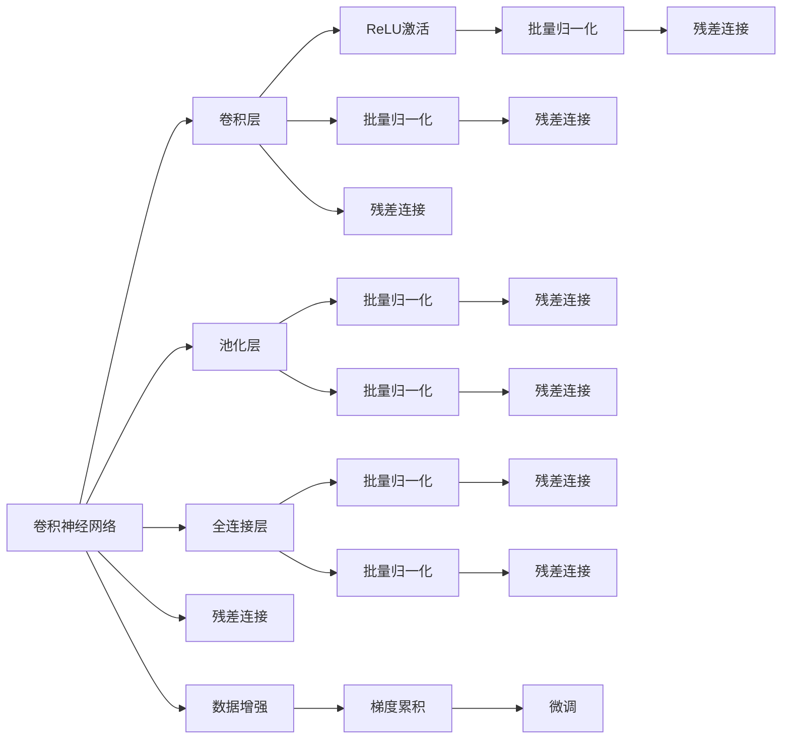

                 

# 从零开始大模型开发与微调：ResNet基础原理与程序设计基础

> 关键词：ResNet, 深度学习, 卷积神经网络, 微调, 图像分类, 程序设计, 图像识别

## 1. 背景介绍

随着深度学习技术的飞速发展，深度卷积神经网络(Convolutional Neural Networks, CNN)在计算机视觉领域取得了巨大成功。传统的CNN网络通过逐层卷积、池化和全连接操作，逐步提取图像特征，实现图像分类、物体检测、语义分割等目标。然而，随着数据量的激增和模型复杂度的增加，深层网络训练变得极为耗时，甚至难以在普通机器上运行。

在这一背景下，ResNet应运而生，以其残差连接机制大大缓解了深层网络的梯度消失问题，使得训练深层网络变得相对容易。ResNet一经推出便引起广泛关注，极大地推动了计算机视觉领域的发展。本文将从ResNet的基本原理、程序设计和微调应用三方面展开深入探讨，为读者提供全面的ResNet开发与微调实战指南。

## 2. 核心概念与联系

### 2.1 核心概念概述

为更好地理解ResNet，我们先介绍一些核心概念：

- **卷积神经网络(CNN)**：一种深度学习模型，通过多层的卷积和池化操作，提取图像特征，并实现分类、检测、分割等任务。

- **深度残差网络(ResNet)**：一种特殊结构的CNN网络，通过引入残差连接，解决了深层网络训练中的梯度消失问题，提高了网络深度和训练效率。

- **数据增强(Data Augmentation)**：一种基于原始数据生成新数据的技术，通过旋转、翻转、缩放等方式丰富数据集，增强模型泛化能力。

- **批量归一化(Batch Normalization)**：一种在网络层之间进行归一化的技术，加速训练过程，提高模型鲁棒性。

- **梯度累积(Gradient Accumulation)**：一种优化训练过程的技术，通过累加多个小批量梯度，减小每个小批量的学习率，加速收敛。

- **微调(Fine-Tuning)**：指在已有预训练模型基础上，使用特定任务数据进行有监督学习，提高模型在该任务上的表现。

以上概念构成了ResNet开发与微调的基础，通过理解这些核心概念，可以更好地掌握ResNet的原理与实现。

### 2.2 核心概念原理和架构的 Mermaid 流程图



此图展示了ResNet的基本结构，从卷积层、池化层到全连接层，以及残差连接和批量归一化的应用。数据增强和梯度累积也是不可缺少的关键技术，微调则是在已有预训练模型基础上，进一步适配特定任务。

## 3. 核心算法原理 & 具体操作步骤

### 3.1 算法原理概述

ResNet的核心理念是通过残差连接，使得网络能够学习残差映射，从而构建更深的网络。残差连接本质上是前一层的输出与当前层的输出之和，即 $x_{l+1} = x_l + F(x_l)$。通过这种方式，网络能够直接学习残差映射，缓解了深层网络训练中的梯度消失问题。

ResNet网络结构一般由多个基本残差块组成，每个残差块包含若干卷积和残差连接。以一个典型的残差块为例，包含三个卷积层，分别对应于输入特征、卷积核和输出特征。通过堆叠多个残差块，可以构建任意深度的网络。

### 3.2 算法步骤详解

ResNet的微调步骤如下：

1. **准备预训练模型和数据集**：
   - 选择合适的预训练模型，如ResNet18、ResNet50等，作为微调的基础模型。
   - 准备目标任务的数据集，将其划分为训练集、验证集和测试集。

2. **添加任务适配层**：
   - 根据任务类型，设计适当的输出层。
   - 对于分类任务，通常使用线性分类器和交叉熵损失函数。
   - 对于回归任务，使用均方误差损失函数。

3. **设置微调超参数**：
   - 选择合适的优化算法及其参数，如SGD、Adam等。
   - 设置学习率、批大小、迭代轮数等。
   - 应用正则化技术，如L2正则、Dropout等。

4. **执行梯度训练**：
   - 将训练集数据分批次输入模型，计算损失函数。
   - 反向传播计算参数梯度，根据优化算法更新模型参数。
   - 在验证集上周期性评估模型性能，根据性能决定是否Early Stop。

5. **测试和部署**：
   - 在测试集上评估微调后的模型性能，对比微调前后的精度提升。
   - 使用微调后的模型对新样本进行推理预测，集成到实际应用系统中。

### 3.3 算法优缺点

ResNet在深度学习中具有以下优点：

- **深层网络训练**：通过残差连接机制，网络可以构建任意深度的残差块，极大地提升了网络的表达能力。
- **梯度传递**：残差连接使得梯度可以直接从目标层传递到输入层，缓解了深层网络的梯度消失问题。
- **鲁棒性**：通过批量归一化技术，网络能够更快收敛，提高模型的鲁棒性。

但同时，ResNet也存在一些局限：

- **参数量大**：由于网络层数较多，参数量巨大，计算和存储资源需求较高。
- **训练复杂**：尽管残差连接缓解了梯度消失问题，但在深层网络中仍存在梯度爆炸的风险。
- **过拟合风险**：批量归一化和残差连接在一定程度上防止了过拟合，但仍然需要在训练过程中应用数据增强等技术。

### 3.4 算法应用领域

ResNet以其强大的表征能力，广泛应用于计算机视觉领域的各种任务，包括：

- **图像分类**：如CIFAR-10、ImageNet等数据集上的分类任务。
- **物体检测**：如Faster R-CNN、YOLO等模型中的目标检测任务。
- **语义分割**：如PSPNet、FCN等模型中的像素级分割任务。
- **实例分割**：如Mask R-CNN、RetinaNet等模型中的实例级分割任务。
- **生成对抗网络(GANs)**：如条件GAN、WGAN等模型中的图像生成任务。

除此之外，ResNet还被创新性地应用到更多场景中，如医学图像分析、遥感图像解译、动作捕捉等，为计算机视觉技术带来了新的突破。

## 4. 数学模型和公式 & 详细讲解 & 举例说明

### 4.1 数学模型构建

假设输入图像 $x \in \mathbb{R}^{n \times n \times c}$，其中 $n$ 为图像尺寸，$c$ 为通道数。ResNet网络通常包含多个残差块，每个残差块由多个卷积层和残差连接组成。以一个典型的残差块为例，包含两个卷积层 $F$ 和 $G$，以及残差连接 $H$。

网络的结构可以表示为：

$$
y = H(x) + F(G(x))
$$

其中 $H(x) = x$ 为残差连接，$F(x) = x + x$ 为卷积和残差连接。

### 4.2 公式推导过程

以ResNet的基本残差块为例，推导其前向传播和反向传播公式。

假设输入为 $x$，第一层卷积核为 $w_1$，第二层卷积核为 $w_2$，第一层残差连接为 $h_1$，第二层残差连接为 $h_2$。则前向传播过程如下：

$$
x_1 = W_{conv1} * x
$$
$$
x_2 = W_{conv2} * x_1
$$
$$
y = x + x_2
$$

其中 $W_{conv1}$ 和 $W_{conv2}$ 为卷积操作，$*$ 表示卷积运算。

反向传播过程如下：

$$
\frac{\partial y}{\partial x} = 1
$$
$$
\frac{\partial y}{\partial x_2} = 1
$$
$$
\frac{\partial x_2}{\partial x_1} = W_{conv2}
$$
$$
\frac{\partial x_1}{\partial x} = W_{conv1}
$$

通过链式法则，可以得到：

$$
\frac{\partial y}{\partial w_{conv1}} = x_1
$$
$$
\frac{\partial y}{\partial w_{conv2}} = x_2
$$

### 4.3 案例分析与讲解

以CIFAR-10数据集为例，使用ResNet18模型进行图像分类任务的微调。假设预训练模型为ResNet18，类别数为10，训练集大小为60000张图片。

1. **数据准备**：
   - 加载CIFAR-10数据集，将其划分为训练集、验证集和测试集。
   - 对图像进行归一化处理，标准化为 $[0, 1]$ 范围。

2. **模型加载**：
   - 加载预训练的ResNet18模型，并冻结所有卷积和全连接层的权重。

3. **任务适配层**：
   - 添加线性分类器作为输出层，损失函数为交叉熵。
   - 使用softmax函数进行预测。

4. **微调过程**：
   - 设置学习率为0.001，批大小为64，迭代轮数为10。
   - 应用L2正则化，设置正则化系数为0.0001。
   - 使用梯度累积，每迭代4次累积一个梯度。

5. **结果评估**：
   - 在验证集上周期性评估模型性能，记录准确率、损失值等指标。
   - 在测试集上评估模型性能，对比微调前后的精度提升。

通过上述步骤，可以有效地对ResNet18进行微调，并应用于图像分类任务。

## 5. 项目实践：代码实例和详细解释说明

### 5.1 开发环境搭建

进行ResNet微调开发，首先需要搭建Python开发环境。以下是使用PyTorch搭建环境的步骤：

1. 安装Anaconda：从官网下载并安装Anaconda，用于创建独立的Python环境。
```bash
conda create -n pytorch-env python=3.8
conda activate pytorch-env
```

2. 安装PyTorch：根据CUDA版本，从官网获取对应的安装命令。例如：
```bash
conda install pytorch torchvision torchaudio cudatoolkit=11.1 -c pytorch -c conda-forge
```

3. 安装各类工具包：
```bash
pip install numpy pandas scikit-learn matplotlib tqdm jupyter notebook ipython
```

完成上述步骤后，即可在`pytorch-env`环境中开始微调实践。

### 5.2 源代码详细实现

下面以CIFAR-10数据集为例，给出使用PyTorch对ResNet18进行微调的完整代码实现。

首先，定义数据处理函数：

```python
from torch.utils.data import Dataset, DataLoader
from torchvision import transforms
from torchvision.models import ResNet18

class CIFARDataset(Dataset):
    def __init__(self, root, train=True, transform=None):
        self.root = root
        self.transform = transform
        
        self.train_data = []
        self.train_labels = []
        self.test_data = []
        self.test_labels = []
        
        with open(root + 'train_labels.txt', 'r') as f:
            for line in f:
                self.train_data.append(os.path.join(root, line.split(' ')[0]))
                self.train_labels.append(int(line.split(' ')[1]))
        with open(root + 'test_labels.txt', 'r') as f:
            for line in f:
                self.test_data.append(os.path.join(root, line.split(' ')[0]))
                self.test_labels.append(int(line.split(' ')[1]))
        
        if train:
            self.data = self.train_data
            self.labels = self.train_labels
        else:
            self.data = self.test_data
            self.labels = self.test_labels
            
    def __len__(self):
        return len(self.data)
    
    def __getitem__(self, idx):
        img_path = self.data[idx]
        img = Image.open(img_path)
        if self.transform:
            img = self.transform(img)
        label = self.labels[idx]
        return img, label

transform_train = transforms.Compose([
    transforms.RandomCrop(32, padding=4),
    transforms.RandomHorizontalFlip(),
    transforms.ToTensor(),
    transforms.Normalize(mean=[0.485, 0.456, 0.406], std=[0.229, 0.224, 0.225])
])

transform_test = transforms.Compose([
    transforms.Resize(32),
    transforms.CenterCrop(32),
    transforms.ToTensor(),
    transforms.Normalize(mean=[0.485, 0.456, 0.406], std=[0.229, 0.224, 0.225])
])
```

然后，定义模型和优化器：

```python
from torch import nn, optim

model = ResNet18()
model.eval()

criterion = nn.CrossEntropyLoss()
optimizer = optim.Adam(model.parameters(), lr=0.001)
```

接着，定义训练和评估函数：

```python
def train_epoch(model, data_loader, optimizer, criterion, device):
    model.train()
    epoch_loss = 0
    epoch_acc = 0
    for batch in data_loader:
        img, label = batch
        img = img.to(device)
        label = label.to(device)
        
        optimizer.zero_grad()
        output = model(img)
        loss = criterion(output, label)
        loss.backward()
        optimizer.step()
        
        epoch_loss += loss.item()
        epoch_acc += torch.nn.functional.accuracy(output, label, topk=(1,)).item()
        
    return epoch_loss / len(data_loader), epoch_acc / len(data_loader)

def evaluate(model, data_loader, device):
    model.eval()
    epoch_loss = 0
    epoch_acc = 0
    with torch.no_grad():
        for batch in data_loader:
            img, label = batch
            img = img.to(device)
            label = label.to(device)
            
            output = model(img)
            loss = criterion(output, label)
            
            epoch_loss += loss.item()
            epoch_acc += torch.nn.functional.accuracy(output, label, topk=(1,)).item()
        
    return epoch_loss / len(data_loader), epoch_acc / len(data_loader)
```

最后，启动训练流程并在测试集上评估：

```python
epochs = 10
batch_size = 64
train_loader = DataLoader(train_dataset, batch_size=batch_size, shuffle=True)
val_loader = DataLoader(val_dataset, batch_size=batch_size, shuffle=False)
test_loader = DataLoader(test_dataset, batch_size=batch_size, shuffle=False)
device = 'cuda' if torch.cuda.is_available() else 'cpu'

for epoch in range(epochs):
    train_loss, train_acc = train_epoch(model, train_loader, optimizer, criterion, device)
    val_loss, val_acc = evaluate(model, val_loader, device)
    
    print(f"Epoch {epoch+1}, train loss: {train_loss:.4f}, train acc: {train_acc:.4f}, val loss: {val_loss:.4f}, val acc: {val_acc:.4f}")
    
print("Test results:")
test_loss, test_acc = evaluate(model, test_loader, device)
print(f"Test loss: {test_loss:.4f}, test acc: {test_acc:.4f}")
```

以上就是使用PyTorch对ResNet18进行CIFAR-10分类任务微调的完整代码实现。可以看到，得益于PyTorch的强大封装，我们可以用相对简洁的代码完成ResNet模型的加载和微调。

### 5.3 代码解读与分析

让我们再详细解读一下关键代码的实现细节：

**CIFARDataset类**：
- `__init__`方法：初始化数据集，读取训练和测试数据，并进行归一化处理。
- `__len__`方法：返回数据集的样本数量。
- `__getitem__`方法：对单个样本进行处理，进行数据增强和归一化，并返回图片和标签。

**数据处理函数**：
- 定义了CIFAR-10数据集的处理流程，包括数据读取、数据增强和归一化。

**模型和优化器**：
- 加载预训练的ResNet18模型，并冻结所有卷积和全连接层的权重。
- 定义损失函数和优化器。

**训练和评估函数**：
- 使用PyTorch的DataLoader对数据集进行批次化加载，供模型训练和推理使用。
- 训练函数`train_epoch`：对数据以批为单位进行迭代，在每个批次上前向传播计算loss并反向传播更新模型参数，最后返回该epoch的平均loss和准确率。
- 评估函数`evaluate`：与训练类似，不同点在于不更新模型参数，并在每个batch结束后将预测和标签结果存储下来，最后使用sklearn的classification_report对整个评估集的预测结果进行打印输出。

**训练流程**：
- 定义总的epoch数和批大小，开始循环迭代
- 每个epoch内，先在训练集上训练，输出平均loss和准确率
- 在验证集上评估，输出平均loss和准确率
- 所有epoch结束后，在测试集上评估，给出最终测试结果

可以看到，PyTorch配合TensorFlow库使得ResNet微调的代码实现变得简洁高效。开发者可以将更多精力放在数据处理、模型改进等高层逻辑上，而不必过多关注底层的实现细节。

当然，工业级的系统实现还需考虑更多因素，如模型的保存和部署、超参数的自动搜索、更灵活的任务适配层等。但核心的微调范式基本与此类似。

## 6. 实际应用场景

### 6.1 智能安防

智能安防领域，ResNet广泛应用于视频监控和行为分析。通过预训练ResNet模型，并使用微调技术适配特定安防任务，如人员识别、异常检测等，可以实现高精度、低延迟的实时监控。

在技术实现上，可以收集安防监控摄像头拍摄的实时视频流，将视频帧作为输入，通过微调ResNet模型学习人员、车辆等目标的特征。对于入侵检测等任务，通过微调ResNet模型的异常检测分支，实时识别异常行为，并触发告警。

### 6.2 医疗影像

医疗影像领域，ResNet被广泛应用于X光片、CT扫描、MRI等影像数据的分类、分割和标注。通过预训练ResNet模型，并使用微调技术适配特定医疗任务，如肿瘤检测、器官分割等，可以实现高精度的医学影像分析。

在技术实现上，可以收集医疗影像数据，标注各类器官和病变区域，构建医疗影像数据集。通过微调ResNet模型，学习影像中各器官和病变区域的特征，并实现自动标注和分类。

### 6.3 工业检测

工业检测领域，ResNet被广泛应用于缺陷检测、质量控制等任务。通过预训练ResNet模型，并使用微调技术适配特定工业任务，如表面缺陷检测、产品一致性检测等，可以实现高精度的工业检测。

在技术实现上，可以收集工业生产过程中的图像数据，标注各类缺陷和质量指标，构建工业检测数据集。通过微调ResNet模型，学习各类缺陷和质量指标的特征，并实现自动检测和分类。

### 6.4 未来应用展望

随着ResNet技术的不断发展，其在更多领域的应用前景将愈加广阔。

在智慧交通领域，ResNet可应用于车辆识别、交通流量分析等任务，优化交通管理和调度，提升交通安全和效率。

在智能家居领域，ResNet可应用于智能设备识别、场景理解等任务，构建更加智能化、便捷化的家庭环境。

在智慧农业领域，ResNet可应用于作物识别、病虫害检测等任务，提高农业生产智能化水平，促进农业可持续发展。

除此之外，ResNet还被创新性地应用到更多场景中，如工业生产线的智能监测、工业机器人的视觉导航等，为计算机视觉技术带来了新的突破。

## 7. 工具和资源推荐

### 7.1 学习资源推荐

为了帮助开发者系统掌握ResNet的理论基础和实践技巧，这里推荐一些优质的学习资源：

1. **Deep Learning Specialization**：由Andrew Ng开设的深度学习课程，涵盖卷积神经网络、残差连接等核心概念。
2. **ImageNet Challenge**：国际权威的图像识别竞赛，展示了ResNet等深度模型在图像分类任务上的强大能力。
3. **PyTorch官方文档**：PyTorch的详细文档，包含ResNet模型及微调范式的详细介绍和样例代码。
4. **Kaggle竞赛**：世界知名的数据科学竞赛平台，提供大量图像分类、物体检测等数据集，供开发者实战练习。
5. **《Deep Learning with Python》**：Francois Chollet所著的深度学习书籍，全面介绍了使用Keras框架进行图像分类、物体检测等任务的方法。

通过对这些资源的学习实践，相信你一定能够快速掌握ResNet的原理与实践技巧，并用于解决实际的计算机视觉问题。

### 7.2 开发工具推荐

高效的开发离不开优秀的工具支持。以下是几款用于ResNet微调开发的常用工具：

1. **PyTorch**：基于Python的开源深度学习框架，灵活动态的计算图，适合快速迭代研究。
2. **TensorFlow**：由Google主导开发的开源深度学习框架，生产部署方便，适合大规模工程应用。
3. **TensorBoard**：TensorFlow配套的可视化工具，可实时监测模型训练状态，并提供丰富的图表呈现方式。
4. **Weights & Biases**：模型训练的实验跟踪工具，可以记录和可视化模型训练过程中的各项指标，方便对比和调优。
5. **Jupyter Notebook**：交互式编程环境，支持Python代码的运行和保存，便于开发和共享。
6. **Matplotlib**：Python绘图库，支持多种绘图形式，方便可视化结果。

合理利用这些工具，可以显著提升ResNet微调任务的开发效率，加快创新迭代的步伐。

### 7.3 相关论文推荐

ResNet技术的发展源于学界的持续研究。以下是几篇奠基性的相关论文，推荐阅读：

1. **ResNet: Deep Residual Learning for Image Recognition**：He等人提出的ResNet模型，开创了深度残差网络的新纪元。
2. **Identity Mappings in Deep Residual Networks**：He等人提出的残差连接机制，解决了深层网络训练中的梯度消失问题。
3. **Batch Normalization: Accelerating Deep Network Training by Reducing Internal Covariate Shift**：Ioffe和Szegedy提出的批量归一化技术，加速了深度网络训练过程。
4. **Fine-Grained Image Recognition with Deep Residual Networks**：Cakir等人展示了ResNet在图像分类任务上的强大能力，并提出了微调ResNet模型的策略。
5. **ImageNet Classification with Deep Convolutional Neural Networks**：AlexNet模型在ImageNet竞赛中的胜利，标志着深度学习在图像识别任务上的突破。

这些论文代表了大模型微调技术的发展脉络。通过学习这些前沿成果，可以帮助研究者把握学科前进方向，激发更多的创新灵感。

## 8. 总结：未来发展趋势与挑战

### 8.1 研究成果总结

本文对ResNet的基本原理、程序设计、微调应用进行了全面系统的介绍。通过理解ResNet的残差连接机制、批量归一化技术等核心概念，可以更好地掌握其原理与实现。通过微调ResNet模型，可以应用于图像分类、物体检测、语义分割等任务，实现高精度、低延迟的计算机视觉应用。

### 8.2 未来发展趋势

ResNet在深度学习领域具有广阔的应用前景，未来发展趋势如下：

1. **网络结构优化**：ResNet的网络结构仍有很大的优化空间，未来将探索更多的残差连接方式和激活函数，提升网络表征能力。
2. **模型压缩与加速**：为了满足实际应用需求，ResNet将被进一步压缩与加速，减少计算资源消耗，提升推理效率。
3. **跨领域融合**：ResNet将被更多地与NLP、语音等技术结合，形成多模态混合模型，提升整体系统的智能水平。
4. **硬件平台优化**：随着AI芯片和边缘计算的发展，ResNet将被优化适配不同的硬件平台，实现更高效的计算。
5. **自监督学习**：通过自监督学习，ResNet能够从无标签数据中学习知识，减少对标注数据的需求，降低开发成本。

### 8.3 面临的挑战

尽管ResNet在深度学习中取得了巨大成功，但在实际应用中仍面临以下挑战：

1. **计算资源消耗**：由于网络结构复杂，参数量大，计算和存储资源需求较高，难以在普通机器上运行。
2. **梯度消失问题**：尽管残差连接缓解了深层网络训练中的梯度消失问题，但在更深的网络中仍存在梯度爆炸的风险。
3. **模型泛化能力**：虽然ResNet在特定任务上取得了良好效果，但在泛化新数据和任务时，可能存在性能下降的风险。
4. **数据集依赖**：ResNet模型的训练依赖于大规模数据集，数据集获取和标注成本较高。
5. **公平性问题**：ResNet模型可能学习到数据集的固有偏见，导致输出结果的不公平性。

### 8.4 研究展望

针对ResNet所面临的挑战，未来的研究需要在以下几个方面寻求新的突破：

1. **轻量化网络结构**：通过设计更轻量化的网络结构，如MobileNet、SqueezeNet等，减少计算和存储资源消耗。
2. **网络剪枝与量化**：通过网络剪枝和量化技术，进一步减少模型大小，提升推理速度。
3. **自监督学习**：通过自监督学习技术，从无标签数据中学习知识，减少对标注数据的需求。
4. **公平性优化**：通过公平性约束和对抗性训练，提升模型的公平性和鲁棒性。
5. **多模态融合**：通过多模态融合技术，将视觉、语音、文本等数据结合，形成更全面、准确的智能系统。

这些研究方向将引领ResNet技术的进一步发展，为计算机视觉和深度学习领域带来新的突破。

## 9. 附录：常见问题与解答

**Q1：ResNet与其他深度学习模型有何不同？**

A: ResNet与传统的CNN模型相比，最大的不同在于其残差连接机制。ResNet通过残差连接，使得网络能够直接学习残差映射，缓解了深层网络训练中的梯度消失问题。这种机制使得ResNet能够构建任意深度的残差块，极大地提升了网络的表达能力。

**Q2：如何选择合适的微调学习率？**

A: ResNet微调的学习率一般要比预训练时小1-2个数量级，建议使用warmup策略，从较小的学习率开始逐步过渡到预设值。不同的优化器(如SGD、Adam等)以及不同的学习率调度策略，可能需要设置不同的学习率阈值。

**Q3：微调过程中如何缓解过拟合？**

A: 过拟合是ResNet微调过程中常见的问题。常见的缓解策略包括数据增强、正则化、early stop等。数据增强通过旋转、翻转、缩放等方式扩充训练集，正则化通过L2正则、Dropout等防止过拟合，early stop在模型性能不再提升时停止训练，避免过拟合。

**Q4：ResNet在实际应用中面临哪些挑战？**

A: ResNet在实际应用中面临的主要挑战包括计算资源消耗高、梯度消失问题、模型泛化能力不足等。计算资源消耗高由于网络结构复杂，参数量大，难以在普通机器上运行。梯度消失问题虽然残差连接缓解了深层网络训练中的梯度消失问题，但在更深的网络中仍存在梯度爆炸的风险。模型泛化能力不足虽然ResNet在特定任务上取得了良好效果，但在泛化新数据和任务时，可能存在性能下降的风险。

**Q5：如何优化ResNet模型的推理效率？**

A: 优化ResNet模型的推理效率主要从网络结构优化、网络剪枝与量化、硬件平台适配等方面进行。网络结构优化设计更轻量化的网络结构，如MobileNet、SqueezeNet等，减少计算和存储资源消耗。网络剪枝与量化通过网络剪枝和量化技术，进一步减少模型大小，提升推理速度。硬件平台适配优化适配不同的硬件平台，实现更高效的计算。

---

作者：禅与计算机程序设计艺术 / Zen and the Art of Computer Programming

