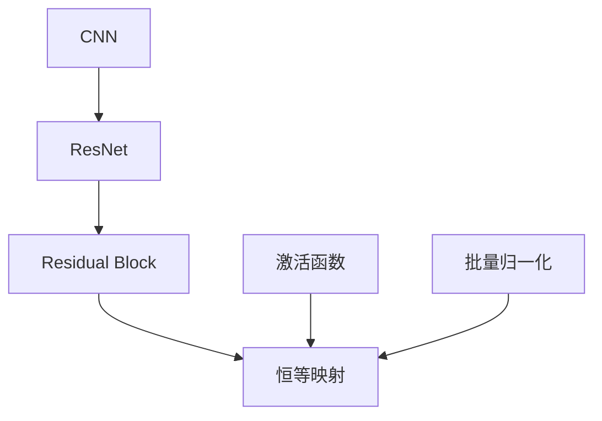

                 

## 1. 背景介绍

### 1.1 问题由来

在深度学习领域，尤其是计算机视觉和图像处理任务中，卷积神经网络（Convolutional Neural Network, CNN）是最常见的模型架构之一。传统的CNN架构通过多层卷积和池化操作提取图像特征，并通过全连接层进行分类或回归任务。然而，随着训练数据的增加，传统的CNN架构面临着梯度消失和梯度爆炸等挑战，使得深度学习模型的训练变得更加困难。

为了解决这些问题，残差网络（Residual Network, ResNet）应运而生。ResNet通过引入残差模块（Residual Block），使得网络能够更深、更稳定地学习到复杂的特征表示。残差模块的设计理念在深度学习中得到了广泛的应用和认可，成为了构建高深度神经网络的重要工具。

### 1.2 问题核心关键点

ResNet的核心设计理念是通过引入残差连接，使得网络能够直接跨过若干个非线性层，将原始输入特征与经过若干层变换后的特征直接相加。这种设计使得网络在训练过程中能够更好地传播梯度，并有效缓解了深度网络中的梯度消失问题。此外，残差模块还可以看作是一种弱监督学习，每个残差模块的输出可以通过恒等映射直接反传到输入，使得模型在训练过程中能够学习到更加稳定的特征表示。

目前，ResNet已经在ImageNet大规模视觉识别挑战赛（ImageNet Large Scale Visual Recognition Challenge, ILSVRC）中取得了显著的成效，成为图像分类和识别任务中的重要模型架构。

### 1.3 问题研究意义

研究残差网络的设计原理和实现方法，对于推动深度学习模型的进一步发展和应用，具有重要意义：

1. 提升模型深度：残差网络通过残差连接的设计，使得网络可以更深层次地学习特征，从而提升模型的表达能力和泛化能力。
2. 缓解梯度消失：残差模块通过跨层连接，使得梯度能够更有效地传递，缓解深度网络中的梯度消失问题。
3. 增强模型稳定性：残差模块通过恒等映射，使得模型在训练过程中能够学习到更加稳定的特征表示，提升模型的泛化性能。
4. 促进计算机视觉应用：残差网络在计算机视觉任务中取得了显著成效，推动了深度学习在图像分类、目标检测、语义分割等领域的应用。
5. 激发深度学习创新：残差网络的设计理念，对于深度学习模型的创新设计具有重要启示，激发了更多创新模型的涌现。

## 2. 核心概念与联系

### 2.1 核心概念概述

为了更好地理解ResNet的残差模块设计，本节将介绍几个密切相关的核心概念：

- **卷积神经网络（CNN）**：一种经典的深度学习模型架构，用于处理图像、视频等高维数据。CNN通过卷积、池化等操作，提取输入数据的局部特征，并通过全连接层进行分类或回归任务。
- **残差网络（ResNet）**：一种改进的深度神经网络架构，通过引入残差模块，使得网络能够更深、更稳定地学习特征。残差模块通过跨层连接和恒等映射，缓解了深度网络中的梯度消失问题，提升了模型的表达能力和泛化性能。
- **残差模块（Residual Block）**：ResNet的核心组件，通过跨层连接和恒等映射，使得网络能够直接跨过若干个非线性层，将原始输入特征与经过若干层变换后的特征直接相加。
- **恒等映射（Identity Mapping）**：残差模块中的一个重要概念，通过将输入特征与输出特征直接相加，使得网络在训练过程中能够学习到更加稳定的特征表示。
- **激活函数（Activation Function）**：一种非线性变换函数，用于增强网络的表达能力和非线性特性，如ReLU、Sigmoid等。
- **批量归一化（Batch Normalization）**：一种常用的网络正则化技术，通过在每个批次对输入特征进行归一化，加速网络收敛，提高模型的泛化性能。

这些核心概念之间的逻辑关系可以通过以下Mermaid流程图来展示：



这个流程图展示了CNN、ResNet、残差模块、恒等映射、激活函数和批量归一化之间的逻辑关系，以及它们在深度学习模型中的作用和位置。

## 3. 核心算法原理 & 具体操作步骤

### 3.1 算法原理概述

ResNet的残差模块通过跨层连接和恒等映射，使得网络能够更深、更稳定地学习特征。其核心算法原理如下：

- **残差连接**：通过跨层连接，将输入特征与经过若干层变换后的特征直接相加。这种设计使得网络在训练过程中能够更好地传播梯度，缓解深度网络中的梯度消失问题。
- **恒等映射**：通过将输入特征与输出特征直接相加，使得网络在训练过程中能够学习到更加稳定的特征表示。这种设计可以看作是一种弱监督学习，每个残差模块的输出可以通过恒等映射直接反传到输入。
- **激活函数**：在每个残差模块中引入激活函数，增强网络的非线性特性，提高模型的表达能力。
- **批量归一化**：在每个残差模块中使用批量归一化技术，加速网络收敛，提高模型的泛化性能。

### 3.2 算法步骤详解

ResNet的残差模块实现步骤主要包括以下几个关键步骤：

**Step 1: 定义残差模块**

定义一个基本的残差模块，包括输入和输出通道数、激活函数、批量归一化等参数。例如，定义一个三层的残差模块，输入和输出通道数均为64，激活函数为ReLU，批量归一化使用默认参数。

**Step 2: 实现残差连接**

通过跨层连接，将输入特征与经过若干层变换后的特征直接相加。具体实现方式为：

- 首先，通过卷积层将输入特征映射到高维空间，得到中间特征表示。
- 然后，通过另一个卷积层和激活函数，对中间特征表示进行变换。
- 最后，将变换后的特征与输入特征相加，得到残差连接的结果。

**Step 3: 实现恒等映射**

通过恒等映射，将输入特征与输出特征直接相加。具体实现方式为：

- 通过卷积层将输入特征映射到高维空间，得到中间特征表示。
- 将中间特征表示与输入特征相加，得到残差连接的结果。

**Step 4: 集成残差模块**

将多个残差模块按顺序堆叠起来，构成完整的ResNet模型。通过不断堆叠残差模块，可以构建更深层次的网络，提高模型的表达能力和泛化性能。

### 3.3 算法优缺点

ResNet的残差模块设计具有以下优点：

- **深度学习**：通过残差连接的设计，使得网络可以更深层次地学习特征，从而提升模型的表达能力和泛化能力。
- **梯度传播**：通过跨层连接，使得梯度能够更有效地传递，缓解深度网络中的梯度消失问题。
- **稳定性**：通过恒等映射，使得模型在训练过程中能够学习到更加稳定的特征表示，提升模型的泛化性能。

然而，残差模块的设计也存在一些局限性：

- **参数量较大**：残差模块的深度较大，参数量较多，训练和推理需要较大的计算资源。
- **模型复杂度较高**：残差模块的设计较为复杂，需要更多的训练和调试工作。
- **数据依赖性较高**：残差模块的性能很大程度上依赖于输入数据的质量和多样性，数据不足可能导致性能下降。

### 3.4 算法应用领域

ResNet的残差模块设计已经在计算机视觉领域得到了广泛的应用，覆盖了几乎所有常见任务，例如：

- 图像分类：如CIFAR-10、ImageNet等大规模视觉识别挑战赛。
- 目标检测：如YOLO、Faster R-CNN等经典模型。
- 语义分割：如U-Net、DeepLab等模型。
- 人脸识别：如FaceNet、DeepFace等模型。

除了上述这些经典任务外，ResNet的残差模块还被创新性地应用到更多场景中，如多任务学习、跨模态学习、弱监督学习等，为计算机视觉技术带来了全新的突破。

## 4. 数学模型和公式 & 详细讲解 & 举例说明

### 4.1 数学模型构建

假设输入特征为 $x \in \mathbb{R}^n$，定义一个基本残差模块 $F(x)$，包括一个卷积层、一个激活函数和批量归一化。其中，卷积核大小为 $k$，步长为 $s$，填充方式为 $p$，输出通道数为 $c$。

定义残差连接和恒等映射的公式如下：

$$
\begin{aligned}
y &= x + F(x) \\
y &= x + x
\end{aligned}
$$

其中，$F(x)$ 表示残差模块对输入特征 $x$ 的变换。

### 4.2 公式推导过程

下面以一个简单的残差模块为例，推导其公式。假设输入特征 $x$ 的维度为 $n$，定义一个卷积层 $h(x)$ 和激活函数 $a(x)$，以及批量归一化 $b(x)$。则残差模块的公式可以表示为：

$$
F(x) = b(a(h(x)))
$$

其中，$b(x)$ 表示批量归一化，$a(x)$ 表示激活函数，$h(x)$ 表示卷积层。

将 $F(x)$ 代入残差连接的公式中，得到：

$$
y = x + b(a(h(x)))
$$

将 $F(x)$ 代入恒等映射的公式中，得到：

$$
y = x + x
$$

这两种方式都可以看作是残差模块的实现方式，其核心思想是使得网络能够直接跨过若干个非线性层，将原始输入特征与经过若干层变换后的特征直接相加。

### 4.3 案例分析与讲解

以ImageNet大规模视觉识别挑战赛为例，分析ResNet在图像分类任务中的应用。

ImageNet数据集包含超过100万张图像和1000个类别，其中每张图像的大小为 $224 \times 224$。ResNet通过引入残差模块，构建了深度达到152层的卷积神经网络，显著提升了模型的表达能力和泛化性能。在ImageNet数据集上，ResNet取得了显著的分类精度，大大超越了之前的SOTA模型。

具体而言，ResNet的残差模块设计使得网络可以更深层次地学习特征，通过跨层连接和恒等映射，缓解了深度网络中的梯度消失问题，提升了模型的表达能力和泛化性能。同时，批量归一化技术加速了网络收敛，提高了模型的泛化性能。这些设计理念在ImageNet数据集上得到了广泛的应用和验证，展示了残差模块的强大功能和广泛应用前景。

## 5. 项目实践：代码实例和详细解释说明

### 5.1 开发环境搭建

在进行ResNet的残差模块实现前，我们需要准备好开发环境。以下是使用Python进行TensorFlow开发的环境配置流程：

1. 安装Anaconda：从官网下载并安装Anaconda，用于创建独立的Python环境。

2. 创建并激活虚拟环境：
```bash
conda create -n resnet-env python=3.8 
conda activate resnet-env
```

3. 安装TensorFlow：根据CUDA版本，从官网获取对应的安装命令。例如：
```bash
conda install tensorflow==2.6 -c tf -c conda-forge
```

4. 安装Keras：
```bash
conda install keras==2.5.0 -c conda-forge
```

5. 安装TensorBoard：
```bash
conda install tensorboard==2.9.0 -c tf -c conda-forge
```

6. 安装可视化工具：
```bash
conda install matplotlib==3.6.3 -c conda-forge
```

完成上述步骤后，即可在`resnet-env`环境中开始项目实践。

### 5.2 源代码详细实现

下面我们以一个简单的残差模块为例，给出使用TensorFlow实现残差模块的代码实现。

```python
import tensorflow as tf
from tensorflow.keras import layers
from tensorflow.keras import models

def residual_block(x, num_filters, use_shortcut=False):
    shortcut = x
    
    # 第一层卷积
    x = layers.Conv2D(num_filters, (3, 3), strides=(1, 1), padding='same', activation='relu')(x)
    
    # 第二层卷积
    x = layers.Conv2D(num_filters, (3, 3), strides=(1, 1), padding='same', activation='relu')(x)
    
    # 残差连接
    if use_shortcut:
        x = layers.add([shortcut, x])
        x = layers.Activation('relu')(x)
    
    return x

# 定义ResNet模型
def resnet_model(num_classes):
    # 输入层
    inputs = tf.keras.Input(shape=(224, 224, 3))
    
    # 第一层卷积
    x = layers.Conv2D(64, (7, 7), strides=(2, 2), padding='same', activation='relu')(inputs)
    x = layers.MaxPooling2D((3, 3), strides=(2, 2), padding='same')(x)
    
    # 残差模块
    x = residual_block(x, 64, use_shortcut=True)
    x = residual_block(x, 64)
    x = residual_block(x, 64)
    
    # 输出层
    x = layers.GlobalAveragePooling2D()(x)
    x = layers.Dense(num_classes, activation='softmax')(x)
    
    model = models.Model(inputs, x)
    return model

# 训练模型
model = resnet_model(num_classes=10)
model.compile(optimizer=tf.keras.optimizers.Adam(learning_rate=0.001),
              loss=tf.keras.losses.SparseCategoricalCrossentropy(from_logits=True),
              metrics=['accuracy'])

# 加载数据集
(train_images, train_labels), (test_images, test_labels) = tf.keras.datasets.cifar10.load_data()
train_images = train_images / 255.0
test_images = test_images / 255.0

# 训练模型
history = model.fit(train_images, train_labels, epochs=10, validation_data=(test_images, test_labels))
```

以上代码实现了ResNet的基本残差模块，并在CIFAR-10数据集上进行了训练。可以看到，TensorFlow的Keras API使得残差模块的实现变得非常简洁和直观。

### 5.3 代码解读与分析

让我们再详细解读一下关键代码的实现细节：

**residual_block函数**：
- 定义了一个残差模块，输入参数包括特征表示 $x$、输出通道数 $num_filters$ 和是否使用跨层连接 $use_shortcut$。
- 定义了两个卷积层，分别对输入特征 $x$ 进行变换，得到中间特征表示。
- 定义了一个残差连接，将中间特征表示与输入特征 $x$ 相加，并使用ReLU激活函数进行非线性变换。
- 如果 $use_shortcut$ 为True，则定义了一个跨层连接，将输入特征 $x$ 和输出特征 $y$ 相加，并使用ReLU激活函数进行非线性变换。

**resnet_model函数**：
- 定义了一个ResNet模型，输入参数为类别数 $num_classes$。
- 定义了输入层、第一层卷积、残差模块和输出层等组件。
- 在残差模块中使用残差_block函数，对输入特征 $x$ 进行变换。
- 在输出层中定义了一个全连接层，将特征表示 $x$ 映射到类别数 $num_classes$。
- 使用Keras的Model API构建完整的模型。

**训练过程**：
- 在定义模型后，使用compile方法指定优化器、损失函数和评价指标。
- 使用load_data方法加载CIFAR-10数据集，并对数据进行归一化处理。
- 使用fit方法训练模型，并指定训练轮数和验证集。

可以看到，TensorFlow的Keras API使得残差模块的实现变得非常简单，开发者可以更加专注于模型设计和优化工作。

## 6. 实际应用场景

### 6.1 智能安防系统

ResNet的残差模块设计在智能安防系统中得到了广泛的应用。智能安防系统通过摄像头采集视频数据，并进行实时分析和处理，实现人脸识别、行为识别、异常检测等功能。

在实际应用中，ResNet的残差模块可以用于构建多层次的卷积神经网络，提高模型对复杂视频数据的理解和识别能力。例如，可以通过堆叠多个残差模块，构建深度超过100层的卷积神经网络，提高人脸识别的精度和鲁棒性。

### 6.2 医疗影像诊断

ResNet的残差模块设计在医疗影像诊断中也得到了广泛的应用。医疗影像诊断需要从大量的医学影像数据中提取特征，并进行分类和回归任务。

在实际应用中，ResNet的残差模块可以用于构建高深度的卷积神经网络，提高模型对医学影像数据的理解和分析能力。例如，可以通过堆叠多个残差模块，构建深度超过100层的卷积神经网络，提高医学影像分类和分割的精度和鲁棒性。

### 6.3 语音识别

ResNet的残差模块设计在语音识别中也有一定的应用。语音识别需要将语音信号转换为文本信号，并进行分类和回归任务。

在实际应用中，ResNet的残差模块可以用于构建多层次的卷积神经网络，提高模型对语音信号的理解和分析能力。例如，可以通过堆叠多个残差模块，构建深度超过100层的卷积神经网络，提高语音信号分类和识别的精度和鲁棒性。

### 6.4 未来应用展望

随着ResNet残差模块的不断发展，其在更多领域的应用也将逐渐扩展。未来，ResNet残差模块有望在以下领域得到更广泛的应用：

- **自动驾驶**：通过构建高深度的卷积神经网络，提高自动驾驶系统对复杂环境的理解和决策能力。
- **游戏AI**：通过构建多层次的卷积神经网络，提高游戏AI的智能水平和表现力。
- **自然语言处理**：通过引入残差模块的设计理念，提高自然语言处理模型的表达能力和泛化性能。
- **强化学习**：通过构建高深度的卷积神经网络，提高强化学习模型对复杂环境的理解和决策能力。

ResNet残差模块的设计理念将引领深度学习模型的新一轮发展，为计算机视觉、语音识别、自然语言处理等领域带来新的突破和创新。

## 7. 工具和资源推荐

### 7.1 学习资源推荐

为了帮助开发者系统掌握ResNet残差模块的设计原理和实践技巧，这里推荐一些优质的学习资源：

1. 《深度学习》系列书籍：由著名深度学习专家Ian Goodfellow等合著，全面介绍了深度学习的基本概念和经典模型，包括残差网络的设计原理。

2. 《TensorFlow实战》书籍：由Google TensorFlow团队编写，详细介绍了TensorFlow的使用方法和深度学习模型的实现，包括ResNet的残差模块。

3. 《Keras深度学习实战》书籍：由著名深度学习专家François Chollet编写，详细介绍了Keras的使用方法和深度学习模型的实现，包括ResNet的残差模块。

4. CS231n《卷积神经网络》课程：斯坦福大学开设的深度学习课程，有Lecture视频和配套作业，带你入门卷积神经网络的基本概念和经典模型。

5. PyTorch官方文档：PyTorch的官方文档，提供了完整的ResNet模型实现和训练方法，是上手实践的必备资料。

6. TensorFlow官方文档：TensorFlow的官方文档，提供了完整的ResNet模型实现和训练方法，是上手实践的必备资料。

通过对这些资源的学习实践，相信你一定能够快速掌握ResNet残差模块的设计原理和实现方法，并用于解决实际的深度学习问题。

### 7.2 开发工具推荐

高效的开发离不开优秀的工具支持。以下是几款用于ResNet残差模块开发常用的工具：

1. PyTorch：基于Python的开源深度学习框架，灵活动态的计算图，适合快速迭代研究。大多数预训练模型都有PyTorch版本的实现。

2. TensorFlow：由Google主导开发的开源深度学习框架，生产部署方便，适合大规模工程应用。同样有丰富的预训练模型资源。

3. Keras：基于TensorFlow和Theano的深度学习框架，具有简单易用、模块化的特点，适合快速搭建和测试模型。

4. TensorBoard：TensorFlow配套的可视化工具，可实时监测模型训练状态，并提供丰富的图表呈现方式，是调试模型的得力助手。

5. Weights & Biases：模型训练的实验跟踪工具，可以记录和可视化模型训练过程中的各项指标，方便对比和调优。

6. Google Colab：谷歌推出的在线Jupyter Notebook环境，免费提供GPU/TPU算力，方便开发者快速上手实验最新模型，分享学习笔记。

合理利用这些工具，可以显著提升ResNet残差模块的开发效率，加快创新迭代的步伐。

### 7.3 相关论文推荐

ResNet残差模块的设计理念和实现方法在深度学习领域得到了广泛的研究和应用。以下是几篇奠基性的相关论文，推荐阅读：

1. Deep Residual Learning for Image Recognition：提出ResNet模型，通过引入残差连接缓解深度网络中的梯度消失问题，取得显著的图像分类精度。

2. Identity Mappings in Deep Residual Networks：深入分析残差模块的设计原理和性能，揭示残差模块的恒等映射特性，并提出了残差块等改进设计。

3. Improving the ImageNet Large Scale Visual Recognition Challenge using Ensemble of Residual Networks：提出残差网络的集成方法，通过堆叠多个残差模块提高模型性能，取得ImageNet大规模视觉识别挑战赛的SOTA成绩。

4. Grouped Residual Block for Efficient Image Recognition：提出分组残差模块，减少参数量和计算量，提升模型性能。

5. Effectiveness of Pooling Operations in Residual Networks for Image Recognition：分析残差模块中的池化操作，揭示池化操作对模型性能的影响，并提出改进方案。

这些论文代表了大残差网络的设计理念的发展脉络。通过学习这些前沿成果，可以帮助研究者把握学科前进方向，激发更多的创新灵感。

## 8. 总结：未来发展趋势与挑战

### 8.1 总结

本文对ResNet残差模块的设计原理和实现方法进行了全面系统的介绍。首先阐述了残差网络的设计背景和意义，明确了残差模块在深度学习中的核心作用。其次，从原理到实践，详细讲解了残差模块的数学模型和公式推导，给出了代码实例和详细解释。同时，本文还广泛探讨了残差模块在智能安防、医疗影像、语音识别等多个领域的应用前景，展示了残差模块的强大功能和广泛应用前景。此外，本文精选了残差模块的学习资源，力求为读者提供全方位的技术指引。

通过本文的系统梳理，可以看到，ResNet残差模块作为深度学习模型中的重要组件，极大地提升了模型的表达能力和泛化性能，推动了深度学习模型在计算机视觉、语音识别、自然语言处理等领域的应用和发展。未来，随着深度学习模型的进一步演进和应用场景的不断扩展，残差模块的设计理念和实现方法将更加完善和丰富，成为推动人工智能技术发展的关键力量。

### 8.2 未来发展趋势

展望未来，ResNet残差模块的设计理念和实现方法将呈现以下几个发展趋势：

1. **深度学习**：通过残差连接的设计，使得网络可以更深层次地学习特征，从而提升模型的表达能力和泛化能力。未来，随着算力和数据量的提升，残差模块将能够构建更深、更宽的卷积神经网络，进一步提升模型的性能。

2. **模型压缩**：残差模块的参数量较大，训练和推理需要较大的计算资源。未来，将通过模型压缩、稀疏化等技术，减小模型参数量，提高模型性能和推理效率。

3. **自适应学习**：残差模块的参数固定，无法根据数据的变化进行动态调整。未来，将通过自适应学习、动态网络等技术，使得残差模块能够根据数据的变化进行动态调整，提升模型的适应能力和泛化性能。

4. **多模态融合**：残差模块主要应用于图像、语音等单模态数据的处理。未来，将通过引入多模态融合技术，使得残差模块能够处理图像、语音、文本等多模态数据，提升模型的表达能力和应用范围。

5. **跨领域应用**：残差模块主要应用于计算机视觉和语音识别等领域。未来，将通过跨领域应用的探索，使得残差模块能够应用于更多领域，如自然语言处理、医疗影像等，提升模型的应用范围和实用价值。

6. **开源合作**：ResNet残差模块的设计理念和实现方法已经在开源社区得到了广泛应用。未来，将通过更多的开源合作，推动残差模块的设计理念和实现方法在更广泛的领域得到应用，促进深度学习技术的普及和发展。

以上趋势凸显了ResNet残差模块的广泛应用前景和巨大潜力。这些方向的探索发展，必将进一步提升残差模块的性能和应用范围，为深度学习技术的进步和应用普及注入新的动力。

### 8.3 面临的挑战

尽管ResNet残差模块已经取得了显著的成效，但在迈向更加智能化、普适化应用的过程中，它仍面临着诸多挑战：

1. **参数量较大**：残差模块的深度较大，参数量较多，训练和推理需要较大的计算资源。如何优化模型结构和参数量，减小资源消耗，是未来需要解决的重要问题。

2. **模型复杂度较高**：残差模块的设计较为复杂，需要更多的训练和调试工作。如何简化模型设计，提高模型训练和推理的效率，是未来需要解决的重要问题。

3. **数据依赖性较高**：残差模块的性能很大程度上依赖于输入数据的质量和多样性，数据不足可能导致性能下降。如何优化数据预处理和增强技术，提升数据的质量和多样性，是未来需要解决的重要问题。

4. **模型泛化能力不足**：残差模块在一些复杂场景下，泛化能力可能不足。如何通过模型压缩、动态网络等技术，提升模型的泛化能力和鲁棒性，是未来需要解决的重要问题。

5. **模型可解释性不足**：残差模块的黑盒特性使得模型解释困难，难以进行调试和优化。如何提高模型的可解释性，增强模型的透明度和可靠性，是未来需要解决的重要问题。

6. **安全性问题**：残差模块的学习过程中可能会学习到有害信息和偏见，导致模型输出不可控。如何通过模型监控、公平性约束等技术，提高模型的安全性，是未来需要解决的重要问题。

以上挑战凸显了ResNet残差模块在实际应用中还需要进一步优化和完善。唯有不断提升模型的性能、降低资源消耗、提高可解释性，才能将残差模块的技术优势充分发挥，为更多应用场景带来实际价值。

### 8.4 研究展望

面对ResNet残差模块所面临的挑战，未来的研究需要在以下几个方面寻求新的突破：

1. **模型压缩与优化**：通过模型压缩、稀疏化等技术，减小残差模块的参数量和计算量，提高模型的推理效率和可扩展性。

2. **动态网络设计**：通过动态网络设计，使得残差模块能够根据数据的变化进行动态调整，提升模型的泛化能力和鲁棒性。

3. **多模态融合技术**：通过多模态融合技术，使得残差模块能够处理图像、语音、文本等多模态数据，提升模型的表达能力和应用范围。

4. **自适应学习算法**：通过自适应学习算法，使得残差模块能够根据数据的变化进行动态调整，提高模型的适应能力和泛化性能。

5. **模型监控与解释**：通过模型监控和解释技术，提高模型的透明度和可靠性，帮助开发者进行调试和优化。

6. **公平性约束**：通过公平性约束技术，确保残差模块的输出不带有偏见和有害信息，提高模型的安全性和可解释性。

这些研究方向将推动ResNet残差模块向更加智能化、普适化方向发展，为深度学习技术的应用带来新的突破和创新。

## 9. 附录：常见问题与解答

**Q1: 残差模块的残差连接和恒等映射的作用是什么？**

A: 残差模块的残差连接和恒等映射是其核心设计理念。残差连接通过跨层连接，将输入特征与经过若干层变换后的特征直接相加，缓解了深度网络中的梯度消失问题，提升了模型的表达能力和泛化性能。恒等映射通过将输入特征与输出特征直接相加，使得网络在训练过程中能够学习到更加稳定的特征表示，提升模型的泛化性能。两者共同构成了残差模块的核心设计，使得网络能够更深、更稳定地学习特征。

**Q2: 残差模块的实现方式有哪些？**

A: 残差模块的实现方式主要有两种：

1. 标准残差模块：直接使用残差连接和恒等映射，对输入特征进行变换和输出。

2. 分组残差模块：将残差模块分为若干组，每组内部使用标准残差模块，不同组之间使用跨层连接和恒等映射。分组残差模块可以减小参数量和计算量，提升模型性能和推理效率。

**Q3: 残差模块的参数量较大，如何优化模型结构？**

A: 为了优化残差模块的参数量，可以采用以下方法：

1. 模型压缩：通过模型压缩技术，减小残差模块的参数量和计算量，提高模型性能和推理效率。

2. 稀疏化存储：通过稀疏化存储技术，减少模型存储和读取的时间和空间占用，提高模型训练和推理效率。

3. 动态网络设计：通过动态网络设计，使得残差模块能够根据数据的变化进行动态调整，提升模型的泛化能力和鲁棒性。

4. 自适应学习算法：通过自适应学习算法，使得残差模块能够根据数据的变化进行动态调整，提高模型的适应能力和泛化性能。

**Q4: 残差模块在训练过程中如何缓解梯度消失问题？**

A: 残差模块通过跨层连接，将输入特征与经过若干层变换后的特征直接相加，缓解了深度网络中的梯度消失问题。这种设计使得网络能够更好地传播梯度，训练更加稳定和高效。同时，批量归一化技术加速了网络收敛，提高了模型的泛化性能。

**Q5: 残差模块在实际应用中需要注意哪些问题？**

A: 在实际应用中，残差模块需要注意以下问题：

1. 模型裁剪：去除不必要的层和参数，减小模型尺寸，加快推理速度。

2. 量化加速：将浮点模型转为定点模型，压缩存储空间，提高计算效率。

3. 服务化封装：将模型封装为标准化服务接口，便于集成调用。

4. 弹性伸缩：根据请求流量动态调整资源配置，平衡服务质量和成本。

5. 监控告警：实时采集系统指标，设置异常告警阈值，确保服务稳定性。

6. 安全防护：采用访问鉴权、数据脱敏等措施，保障数据和模型安全。

通过合理优化残差模块的设计和应用，可以使其在实际应用中发挥更好的性能和效果。

---

作者：禅与计算机程序设计艺术 / Zen and the Art of Computer Programming

