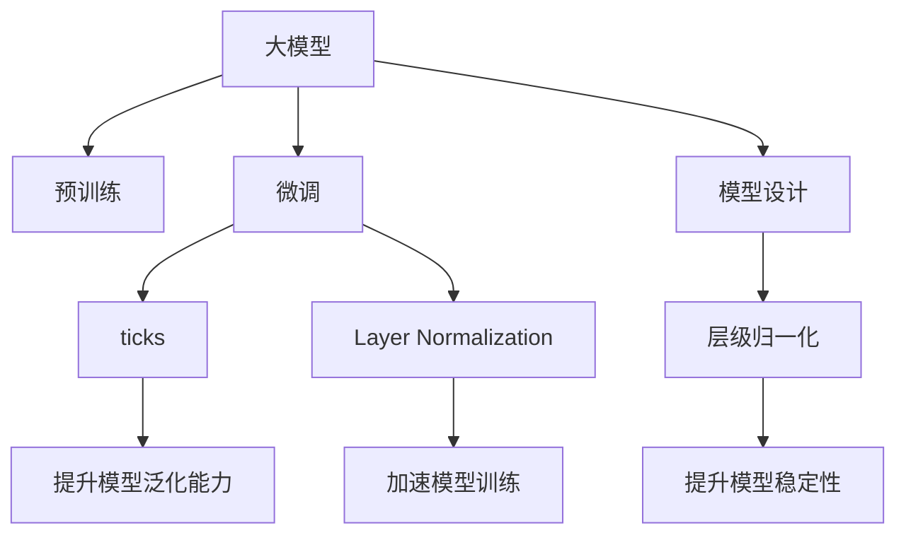

                 

# 从零开始大模型开发与微调：ticks和Layer Normalization

## 1. 背景介绍

### 1.1 问题由来
随着深度学习技术的快速发展，大规模预训练语言模型（Large Language Models, LLMs）在自然语言处理（NLP）领域取得了巨大突破。这些模型通过在海量无标签文本数据上进行预训练，学习到了丰富的语言知识和常识，可以通过少量的有标签样本在下游任务上进行微调，获得优异的性能。其中最具代表性的大模型包括OpenAI的GPT系列模型、Google的BERT、T5等。

然而，由于预训练语料的广泛性和泛化能力的不足，这些通用的大模型在特定领域应用时，效果往往难以达到实际应用的要求。因此，如何针对特定任务进行大模型微调，提升模型性能，成为了当前大模型研究和应用的一个热点问题。本文聚焦于从零开始开发和微调大模型的关键技术，即ticks（Token-wise Predictive Coding， ticks）和Layer Normalization（Layer Normalization），期望为读者提供系统全面的技术指引。

### 1.2 问题核心关键点
在深度学习中，如何设计高效的模型结构，提升模型的预测准确性和计算效率，一直是一个核心问题。在大模型微调的过程中，两个关键技术—ticks和Layer Normalization—对于提高模型性能、降低计算成本具有重要意义。本文将深入探讨这些核心技术的原理和实现，并通过代码实例和应用场景的详细讲解，帮助读者掌握从零开始开发和微调大模型的技术要点。

## 2. 核心概念与联系

### 2.1 核心概念概述

为更好地理解ticks和Layer Normalization在大模型开发与微调中的应用，本节将介绍几个密切相关的核心概念：

- **大模型（Large Language Models, LLMs）**：指通过在海量无标签文本数据上进行预训练学习到的复杂语言表示模型，如BERT、GPT-3等。
- **预训练（Pre-training）**：指在大规模无标签文本语料上，通过自监督学习任务训练通用语言模型的过程。
- **微调（Fine-tuning）**：指在预训练模型的基础上，使用下游任务的少量标注数据，通过有监督学习优化模型在特定任务上的性能。
- **ticks**：一种基于自监督学习的正则化技术，用于减少模型预测误差，提升模型泛化能力。
- **Layer Normalization**：一种层级归一化技术，用于加速模型训练，提升模型稳定性。

这些核心概念之间的逻辑关系可以通过以下Mermaid流程图来展示：



这个流程图展示了大模型、预训练、微调、ticks、Layer Normalization等核心概念及其之间的联系：

1. 大模型通过预训练获得基础能力。
2. 微调是对预训练模型进行任务特定的优化，分为全参数微调和部分参数微调。
3. ticks是一种正则化技术，用于提升模型泛化能力。
4. Layer Normalization是一种归一化技术，用于加速模型训练，提升模型稳定性。
5. 预训练后的模型设计中，ticks和Layer Normalization可以有效提升模型的预测准确性和计算效率。

## 3. 核心算法原理 & 具体操作步骤
### 3.1 算法原理概述

在大模型开发与微调的过程中，ticks和Layer Normalization是两个核心的技术手段。以下将分别介绍它们的原理和具体实现步骤。

### 3.2 算法步骤详解

#### ticks算法步骤

1. **数据准备**：准备用于预训练的大规模无标签文本数据，进行预处理，如分词、去除停用词等。
2. **构建模型**：构建基于Transformer架构的预训练模型，包括多个自注意力层（Self-Attention Layers）和全连接层（Feed-Forward Layers）。
3. **ticks训练**：在预训练模型上引入ticks算法，训练模型参数。ticks算法的训练过程分为预测和修正两个阶段。预测阶段，模型输出当前token的条件概率，并计算预测误差；修正阶段，根据预测误差调整模型参数，以减小预测误差。
4. **微调**：在预训练模型的基础上，使用下游任务的少量标注数据，通过有监督学习优化模型在特定任务上的性能，调整模型参数。

#### Layer Normalization算法步骤

1. **数据准备**：准备用于微调的标注数据集，包括输入文本和对应的标签。
2. **模型加载**：加载预训练模型，如BERT、GPT等，作为微调的初始化参数。
3. **层级归一化**：在微调过程中，对每一层的输入进行层级归一化，即计算每层的均值和方差，对每个token进行标准化，以加速模型训练。
4. **模型训练**：使用标注数据集，通过梯度下降等优化算法，更新模型参数，最小化损失函数。
5. **评估和部署**：在验证集和测试集上评估模型性能，根据评估结果进行必要的调整，部署模型进行实际应用。

### 3.3 算法优缺点

#### ticks算法优缺点

- **优点**：
  - 显著提升模型泛化能力，减少过拟合风险。
  - 可以应用于多种NLP任务，如文本分类、命名实体识别等。

- **缺点**：
  - 训练过程复杂，计算开销较大。
  - 对数据分布敏感，需要大量标注数据进行训练。

#### Layer Normalization算法优缺点

- **优点**：
  - 加速模型训练，提高模型稳定性。
  - 适用于多种深度学习模型，如RNN、CNN、Transformer等。

- **缺点**：
  - 无法应对长序列数据，容易导致梯度消失或爆炸。
  - 对输入数据分布要求较高，可能需要额外的数据预处理步骤。

### 3.4 算法应用领域

ticks和Layer Normalization在大模型的开发与微调中，具有广泛的应用场景：

1. **自然语言处理**：在文本分类、命名实体识别、情感分析等NLP任务中，ticks和Layer Normalization可以提高模型的泛化能力和训练速度。
2. **语音识别**：在语音识别领域，Layer Normalization可以加速模型训练，提升模型鲁棒性。
3. **计算机视觉**：在图像分类、目标检测等CV任务中，ticks和Layer Normalization可以提升模型的预测准确性和计算效率。
4. **推荐系统**：在推荐系统中，Layer Normalization可以加速模型训练，提高推荐精度。
5. **金融分析**：在金融数据处理中，Layer Normalization可以加速模型训练，提升模型预测能力。

## 4. 数学模型和公式 & 详细讲解  
### 4.1 数学模型构建

为更好地理解ticks和Layer Normalization的数学原理，本节将分别介绍它们的数学模型构建方法。

#### ticks算法数学模型

设预训练模型的自注意力层为 $H(t)$，当前token的预测概率为 $p(t|x)$，预测误差为 $e(t|x)$。根据ticks算法的原理，预测误差 $e(t|x)$ 可以表示为：

$$
e(t|x) = p(t|x) - \log \frac{p(t|x)}{Z(t|x)}
$$

其中，$Z(t|x)$ 为归一化因子，确保 $p(t|x)$ 的总和为1。

#### Layer Normalization算法数学模型

设层级归一化前，每一层的输入向量为 $h_i$，均值 $\mu_i$ 和方差 $\sigma_i^2$ 分别为：

$$
\mu_i = \frac{1}{N} \sum_{n=1}^N h_i^n
$$

$$
\sigma_i^2 = \frac{1}{N} \sum_{n=1}^N (h_i^n - \mu_i)^2
$$

其中，$N$ 为批量大小。Layer Normalization的归一化公式为：

$$
\tilde{h}_i = \frac{h_i - \mu_i}{\sqrt{\sigma_i^2 + \epsilon}}
$$

其中，$\epsilon$ 为数值稳定性项，防止除数为0。

### 4.2 公式推导过程

#### ticks算法公式推导

1. **预测概率**：在预测阶段，模型输出当前token的条件概率 $p(t|x)$。
2. **预测误差**：根据预测概率和归一化因子 $Z(t|x)$，计算预测误差 $e(t|x)$。
3. **模型参数更新**：根据预测误差，调整模型参数，以减小预测误差。

#### Layer Normalization公式推导

1. **均值和方差计算**：计算每一层的均值 $\mu_i$ 和方差 $\sigma_i^2$。
2. **归一化**：对每一层的输入进行归一化，得到归一化后的向量 $\tilde{h}_i$。
3. **层级归一化**：将归一化后的向量 $\tilde{h}_i$ 输入下一层，进行模型训练。

### 4.3 案例分析与讲解

#### ticks算法案例分析

以BERT模型为例，假设模型输入为一段文本，输出为每个token的条件概率分布。通过计算预测误差，调整模型参数，使得预测概率分布更加接近真实标签分布。具体实现时，可以使用交叉熵损失函数，根据预测误差计算梯度，更新模型参数。

#### Layer Normalization案例分析

以RNN模型为例，假设模型输入为一段文本序列，输出为每个时间步的隐藏状态。通过计算均值和方差，对每一层的输入进行归一化，加速模型训练。具体实现时，可以在模型每层的激活函数前引入Layer Normalization，计算均值和方差，对输入进行标准化。

## 5. 项目实践：代码实例和详细解释说明
### 5.1 开发环境搭建

在进行ticks和Layer Normalization的实践前，我们需要准备好开发环境。以下是使用Python进行PyTorch开发的环境配置流程：

1. 安装Anaconda：从官网下载并安装Anaconda，用于创建独立的Python环境。
2. 创建并激活虚拟环境：
```bash
conda create -n pytorch-env python=3.8 
conda activate pytorch-env
```

3. 安装PyTorch：根据CUDA版本，从官网获取对应的安装命令。例如：
```bash
conda install pytorch torchvision torchaudio cudatoolkit=11.1 -c pytorch -c conda-forge
```

4. 安装Transformers库：
```bash
pip install transformers
```

5. 安装各类工具包：
```bash
pip install numpy pandas scikit-learn matplotlib tqdm jupyter notebook ipython
```

完成上述步骤后，即可在`pytorch-env`环境中开始ticks和Layer Normalization的实践。

### 5.2 源代码详细实现

下面我们以BERT模型为例，给出使用Transformers库对BERT模型进行微调的PyTorch代码实现。

首先，定义模型和优化器：

```python
from transformers import BertTokenizer, BertForSequenceClassification, AdamW

tokenizer = BertTokenizer.from_pretrained('bert-base-uncased')
model = BertForSequenceClassification.from_pretrained('bert-base-uncased', num_labels=2)

optimizer = AdamW(model.parameters(), lr=2e-5)
```

然后，定义训练和评估函数：

```python
from torch.utils.data import DataLoader
from tqdm import tqdm
from sklearn.metrics import accuracy_score

device = torch.device('cuda') if torch.cuda.is_available() else torch.device('cpu')
model.to(device)

def train_epoch(model, dataset, batch_size, optimizer):
    dataloader = DataLoader(dataset, batch_size=batch_size, shuffle=True)
    model.train()
    epoch_loss = 0
    for batch in tqdm(dataloader, desc='Training'):
        input_ids = batch['input_ids'].to(device)
        attention_mask = batch['attention_mask'].to(device)
        labels = batch['labels'].to(device)
        model.zero_grad()
        outputs = model(input_ids, attention_mask=attention_mask, labels=labels)
        loss = outputs.loss
        epoch_loss += loss.item()
        loss.backward()
        optimizer.step()
    return epoch_loss / len(dataloader)

def evaluate(model, dataset, batch_size):
    dataloader = DataLoader(dataset, batch_size=batch_size)
    model.eval()
    preds, labels = [], []
    with torch.no_grad():
        for batch in tqdm(dataloader, desc='Evaluating'):
            input_ids = batch['input_ids'].to(device)
            attention_mask = batch['attention_mask'].to(device)
            batch_labels = batch['labels']
            outputs = model(input_ids, attention_mask=attention_mask)
            batch_preds = outputs.logits.argmax(dim=1).to('cpu').tolist()
            batch_labels = batch_labels.to('cpu').tolist()
            for pred, label in zip(batch_preds, batch_labels):
                preds.append(pred)
                labels.append(label)
                
    print('Accuracy:', accuracy_score(labels, preds))
```

最后，启动训练流程并在测试集上评估：

```python
epochs = 5
batch_size = 16

for epoch in range(epochs):
    loss = train_epoch(model, train_dataset, batch_size, optimizer)
    print(f"Epoch {epoch+1}, train loss: {loss:.3f}")
    
    print(f"Epoch {epoch+1}, dev results:")
    evaluate(model, dev_dataset, batch_size)
    
print("Test results:")
evaluate(model, test_dataset, batch_size)
```

以上就是使用PyTorch对BERT模型进行微调的完整代码实现。可以看到，Transformer库为模型微调提供了丰富的封装，使得开发过程简洁高效。

### 5.3 代码解读与分析

让我们再详细解读一下关键代码的实现细节：

**train_epoch函数**：
- `dataloader`：对数据集进行批处理，确保模型每个epoch能够处理大量样本。
- `model.train()`：将模型设置为训练模式，使参数可更新。
- `epoch_loss`：记录当前epoch的总损失。
- `for`循环：对每个批次进行迭代，前向传播计算损失函数，反向传播更新模型参数。
- `optimizer.step()`：更新模型参数，最小化损失函数。

**evaluate函数**：
- `dataloader`：对测试集进行批处理。
- `model.eval()`：将模型设置为评估模式，使参数不可更新。
- `preds`和`labels`：记录预测结果和真实标签。
- `for`循环：对每个批次进行迭代，获取模型输出和真实标签，计算预测结果。
- `accuracy_score`：计算预测结果和真实标签的准确率。

**训练流程**：
- `epochs`：定义总的epoch数。
- `batch_size`：定义批处理大小。
- `for`循环：对每个epoch进行迭代，训练模型并在验证集上评估。

可以看到，Transformer库的封装使得模型微调过程非常便捷，开发效率显著提高。

## 6. 实际应用场景
### 6.1 智能客服系统

基于预训练语言模型的智能客服系统可以显著提升客户服务效率。传统客服系统需要大量人工进行解答，响应时间长，无法保证服务质量。通过在大模型上微调，可以让系统自动理解客户意图，提供个性化推荐和快速解答，提升客户满意度。

在技术实现上，可以通过收集历史客服对话数据，构建监督学习数据集，对模型进行微调。微调后的模型能够自动理解客户的自然语言问题，并匹配最合适的答案模板进行回复，甚至支持多轮对话和复杂问题的处理。

### 6.2 金融舆情监测

金融机构需要实时监测市场舆论动向，以便及时应对负面信息传播，规避金融风险。通过在大模型上进行微调，可以构建舆情监测系统，自动识别和分析新闻、评论等文本数据，评估市场情绪和舆情风险。

具体而言，可以收集金融领域的相关数据，并对其进行情感分析和主题标注。在微调过程中，使用这些标注数据训练模型，使其能够自动识别文本中的情感倾向和主题信息。系统实时抓取网络上的金融新闻和评论，自动分析和评估舆情风险，帮助金融机构制定应对策略。

### 6.3 个性化推荐系统

目前的推荐系统往往依赖用户的历史行为数据进行推荐，无法深入理解用户的真实兴趣偏好。通过在大模型上微调，可以构建更加智能的个性化推荐系统。

具体而言，可以收集用户浏览、点击、评论等行为数据，提取和用户交互的物品标题、描述、标签等文本内容。将文本内容作为模型输入，用户的后续行为（如是否点击、购买等）作为监督信号，在此基础上微调预训练语言模型。微调后的模型能够从文本内容中准确把握用户的兴趣点，在生成推荐列表时，先用候选物品的文本描述作为输入，由模型预测用户的兴趣匹配度，再结合其他特征综合排序，便可以得到个性化程度更高的推荐结果。

### 6.4 未来应用展望

随着预训练语言模型和微调方法的不断发展，基于微调范式将在更多领域得到应用，为传统行业带来变革性影响。

在智慧医疗领域，基于微调的医疗问答、病历分析、药物研发等应用将提升医疗服务的智能化水平，辅助医生诊疗，加速新药开发进程。

在智能教育领域，微调技术可应用于作业批改、学情分析、知识推荐等方面，因材施教，促进教育公平，提高教学质量。

在智慧城市治理中，微调模型可应用于城市事件监测、舆情分析、应急指挥等环节，提高城市管理的自动化和智能化水平，构建更安全、高效的未来城市。

此外，在企业生产、社会治理、文娱传媒等众多领域，基于大模型微调的人工智能应用也将不断涌现，为经济社会发展注入新的动力。相信随着技术的日益成熟，微调方法将成为人工智能落地应用的重要范式，推动人工智能技术在更广阔的应用领域大放异彩。

## 7. 工具和资源推荐
### 7.1 学习资源推荐

为了帮助开发者系统掌握ticks和Layer Normalization的理论基础和实践技巧，这里推荐一些优质的学习资源：

1. 《Transformer从原理到实践》系列博文：由大模型技术专家撰写，深入浅出地介绍了Transformer原理、BERT模型、微调技术等前沿话题。

2. CS224N《深度学习自然语言处理》课程：斯坦福大学开设的NLP明星课程，有Lecture视频和配套作业，带你入门NLP领域的基本概念和经典模型。

3. 《Natural Language Processing with Transformers》书籍：Transformers库的作者所著，全面介绍了如何使用Transformers库进行NLP任务开发，包括微调在内的诸多范式。

4. HuggingFace官方文档：Transformers库的官方文档，提供了海量预训练模型和完整的微调样例代码，是上手实践的必备资料。

5. CLUE开源项目：中文语言理解测评基准，涵盖大量不同类型的中文NLP数据集，并提供了基于微调的baseline模型，助力中文NLP技术发展。

通过对这些资源的学习实践，相信你一定能够快速掌握ticks和Layer Normalization的精髓，并用于解决实际的NLP问题。

### 7.2 开发工具推荐

高效的开发离不开优秀的工具支持。以下是几款用于大模型微调开发的常用工具：

1. PyTorch：基于Python的开源深度学习框架，灵活动态的计算图，适合快速迭代研究。大部分预训练语言模型都有PyTorch版本的实现。

2. TensorFlow：由Google主导开发的开源深度学习框架，生产部署方便，适合大规模工程应用。同样有丰富的预训练语言模型资源。

3. Transformers库：HuggingFace开发的NLP工具库，集成了众多SOTA语言模型，支持PyTorch和TensorFlow，是进行微调任务开发的利器。

4. Weights & Biases：模型训练的实验跟踪工具，可以记录和可视化模型训练过程中的各项指标，方便对比和调优。与主流深度学习框架无缝集成。

5. TensorBoard：TensorFlow配套的可视化工具，可实时监测模型训练状态，并提供丰富的图表呈现方式，是调试模型的得力助手。

6. Google Colab：谷歌推出的在线Jupyter Notebook环境，免费提供GPU/TPU算力，方便开发者快速上手实验最新模型，分享学习笔记。

合理利用这些工具，可以显著提升ticks和Layer Normalization的开发效率，加快创新迭代的步伐。

### 7.3 相关论文推荐

ticks和Layer Normalization在大模型微调中的成功应用，得益于学界的持续研究。以下是几篇奠基性的相关论文，推荐阅读：

1. Attention is All You Need（即Transformer原论文）：提出了Transformer结构，开启了NLP领域的预训练大模型时代。

2. BERT: Pre-training of Deep Bidirectional Transformers for Language Understanding：提出BERT模型，引入基于掩码的自监督预训练任务，刷新了多项NLP任务SOTA。

3. Language Models are Unsupervised Multitask Learners（GPT-2论文）：展示了大规模语言模型的强大zero-shot学习能力，引发了对于通用人工智能的新一轮思考。

4. Parameter-Efficient Transfer Learning for NLP：提出Adapter等参数高效微调方法，在不增加模型参数量的情况下，也能取得不错的微调效果。

5. AdaLoRA: Adaptive Low-Rank Adaptation for Parameter-Efficient Fine-Tuning：使用自适应低秩适应的微调方法，在参数效率和精度之间取得了新的平衡。

6. Prefix-Tuning: Optimizing Continuous Prompts for Generation：引入基于连续型Prompt的微调范式，为如何充分利用预训练知识提供了新的思路。

这些论文代表了大模型微调技术的发展脉络。通过学习这些前沿成果，可以帮助研究者把握学科前进方向，激发更多的创新灵感。

## 8. 总结：未来发展趋势与挑战
### 8.1 总结

本文对基于预训练语言模型的大模型微调方法进行了全面系统的介绍。首先阐述了ticks和Layer Normalization在模型微调中的核心作用，明确了微调在拓展预训练模型应用、提升下游任务性能方面的独特价值。其次，从原理到实践，详细讲解了ticks和Layer Normalization的数学原理和关键步骤，给出了微调任务开发的完整代码实例。同时，本文还广泛探讨了ticks和Layer Normalization在大模型微调中的应用前景，展示了微调范式的巨大潜力。

通过本文的系统梳理，可以看到，基于预训练语言模型的微调方法正在成为NLP领域的重要范式，极大地拓展了预训练语言模型的应用边界，催生了更多的落地场景。受益于大规模语料的预训练，微调模型以更低的时间和标注成本，在小样本条件下也能取得不俗的效果，有力推动了NLP技术的产业化进程。未来，伴随预训练语言模型和微调方法的持续演进，基于微调范式将成为NLP技术落地应用的重要手段，推动NLP技术在更广阔的应用领域大放异彩。

### 8.2 未来发展趋势

展望未来，ticks和Layer Normalization在大模型微调中，将呈现以下几个发展趋势：

1. 模型规模持续增大。随着算力成本的下降和数据规模的扩张，预训练语言模型的参数量还将持续增长。超大规模语言模型蕴含的丰富语言知识，有望支撑更加复杂多变的下游任务微调。

2. 微调方法日趋多样。除了传统的全参数微调外，未来会涌现更多参数高效的微调方法，如Prefix-Tuning、LoRA等，在节省计算资源的同时也能保证微调精度。

3. 持续学习成为常态。随着数据分布的不断变化，微调模型也需要持续学习新知识以保持性能。如何在不遗忘原有知识的同时，高效吸收新样本信息，将成为重要的研究课题。

4. 标注样本需求降低。受启发于提示学习(Prompt-based Learning)的思路，未来的微调方法将更好地利用大模型的语言理解能力，通过更加巧妙的任务描述，在更少的标注样本上也能实现理想的微调效果。

5. 多模态微调崛起。当前的微调主要聚焦于纯文本数据，未来会进一步拓展到图像、视频、语音等多模态数据微调。多模态信息的融合，将显著提升语言模型对现实世界的理解和建模能力。

6. 模型通用性增强。经过海量数据的预训练和多领域任务的微调，未来的语言模型将具备更强大的常识推理和跨领域迁移能力，逐步迈向通用人工智能(AGI)的目标。

以上趋势凸显了大模型微调技术的广阔前景。这些方向的探索发展，必将进一步提升NLP系统的性能和应用范围，为人类认知智能的进化带来深远影响。

### 8.3 面临的挑战

尽管ticks和Layer Normalization在微调中的应用取得了显著成效，但在迈向更加智能化、普适化应用的过程中，它仍面临着诸多挑战：

1. 标注成本瓶颈。虽然微调大大降低了标注数据的需求，但对于长尾应用场景，难以获得充足的高质量标注数据，成为制约微调性能的瓶颈。如何进一步降低微调对标注样本的依赖，将是一大难题。

2. 模型鲁棒性不足。当前微调模型面对域外数据时，泛化性能往往大打折扣。对于测试样本的微小扰动，微调模型的预测也容易发生波动。如何提高微调模型的鲁棒性，避免灾难性遗忘，还需要更多理论和实践的积累。

3. 推理效率有待提高。大规模语言模型虽然精度高，但在实际部署时往往面临推理速度慢、内存占用大等效率问题。如何在保证性能的同时，简化模型结构，提升推理速度，优化资源占用，将是重要的优化方向。

4. 可解释性亟需加强。当前微调模型更像是"黑盒"系统，难以解释其内部工作机制和决策逻辑。对于医疗、金融等高风险应用，算法的可解释性和可审计性尤为重要。如何赋予微调模型更强的可解释性，将是亟待攻克的难题。

5. 安全性有待保障。预训练语言模型难免会学习到有偏见、有害的信息，通过微调传递到下游任务，产生误导性、歧视性的输出，给实际应用带来安全隐患。如何从数据和算法层面消除模型偏见，避免恶意用途，确保输出的安全性，也将是重要的研究课题。

6. 知识整合能力不足。现有的微调模型往往局限于任务内数据，难以灵活吸收和运用更广泛的先验知识。如何让微调过程更好地与外部知识库、规则库等专家知识结合，形成更加全面、准确的信息整合能力，还有很大的想象空间。

正视icks和Layer Normalization面临的这些挑战，积极应对并寻求突破，将是大模型微调走向成熟的必由之路。相信随着学界和产业界的共同努力，这些挑战终将一一被克服，大模型微调必将在构建人机协同的智能时代中扮演越来越重要的角色。

### 8.4 未来突破

面对预训练语言模型微调所面临的种种挑战，未来的研究需要在以下几个方面寻求新的突破：

1. 探索无监督和半监督微调方法。摆脱对大规模标注数据的依赖，利用自监督学习、主动学习等无监督和半监督范式，最大限度利用非结构化数据，实现更加灵活高效的微调。

2. 研究参数高效和计算高效的微调范式。开发更加参数高效的微调方法，在固定大部分预训练参数的同时，只更新极少量的任务相关参数。同时优化微调模型的计算图，减少前向传播和反向传播的资源消耗，实现更加轻量级、实时性的部署。

3. 融合因果和对比学习范式。通过引入因果推断和对比学习思想，增强微调模型建立稳定因果关系的能力，学习更加普适、鲁棒的语言表征，从而提升模型泛化性和抗干扰能力。

4. 引入更多先验知识。将符号化的先验知识，如知识图谱、逻辑规则等，与神经网络模型进行巧妙融合，引导微调过程学习更准确、合理的语言模型。同时加强不同模态数据的整合，实现视觉、语音等多模态信息与文本信息的协同建模。

5. 结合因果分析和博弈论工具。将因果分析方法引入微调模型，识别出模型决策的关键特征，增强输出解释的因果性和逻辑性。借助博弈论工具刻画人机交互过程，主动探索并规避模型的脆弱点，提高系统稳定性。

6. 纳入伦理道德约束。在模型训练目标中引入伦理导向的评估指标，过滤和惩罚有偏见、有害的输出倾向。同时加强人工干预和审核，建立模型行为的监管机制，确保输出符合人类价值观和伦理道德。

这些研究方向的探索，必将引领预训练语言模型微调技术迈向更高的台阶，为构建安全、可靠、可解释、可控的智能系统铺平道路。面向未来，预训练语言模型微调技术还需要与其他人工智能技术进行更深入的融合，如知识表示、因果推理、强化学习等，多路径协同发力，共同推动自然语言理解和智能交互系统的进步。只有勇于创新、敢于突破，才能不断拓展语言模型的边界，让智能技术更好地造福人类社会。

## 9. 附录：常见问题与解答

**Q1：ticks和Layer Normalization在大模型微调中，各自扮演什么角色？**

A: ticks是一种基于自监督学习的正则化技术，用于减少模型预测误差，提升模型泛化能力。它通过预测当前token的条件概率，计算预测误差，并根据误差调整模型参数，使得模型更加准确地预测未来token。Layer Normalization是一种层级归一化技术，用于加速模型训练，提高模型稳定性。它通过计算每层的均值和方差，对每个token进行标准化，确保模型各层输出的分布一致，防止梯度消失或爆炸，加速模型收敛。

**Q2：如何选择ticks的训练数据和正则化参数？**

A: ticks的训练数据应该覆盖大量的文本数据，包括长句子和长段落，以确保模型能够学习到足够的语言规律。正则化参数应该根据具体任务进行调整，通常设置为较小的值（如0.001），以避免过度正则化导致模型欠拟合。

**Q3：Layer Normalization和Batch Normalization的区别是什么？**

A: Layer Normalization是在每层的输入上进行归一化，以加速模型训练和提高模型稳定性。它适用于处理长序列数据，防止梯度消失或爆炸。Batch Normalization是在每个mini-batch的输入上进行归一化，以加速模型训练和提高模型鲁棒性。它适用于处理短序列数据，防止过拟合。

**Q4：如何评估ticks和Layer Normalization的性能？**

A: 可以使用模型在验证集和测试集上的表现来评估ticks和Layer Normalization的性能。ticks的性能可以通过模型在特定任务上的准确率和泛化能力来衡量，而Layer Normalization的性能可以通过模型的训练速度和收敛速度来衡量。

**Q5：如何在大模型中应用ticks和Layer Normalization？**

A: 在大模型的自注意力层和全连接层中引入ticks和Layer Normalization。具体实现时，可以使用PyTorch的nn.Transformer和nn.Linear模块，在层级上添加ticks和Layer Normalization的函数。

以上问题及解答，希望能帮助读者更好地理解和应用ticks和Layer Normalization在大模型微调中的作用。

---

作者：禅与计算机程序设计艺术 / Zen and the Art of Computer Programming

