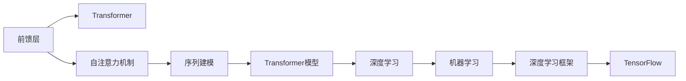

                 

# 从零开始大模型开发与微调：前馈层的实现

> 关键词：大模型开发，微调，前馈层，Transformer，TensorFlow

## 1. 背景介绍

### 1.1 问题由来

在大模型开发和微调领域，前馈层作为大模型的一个重要组成部分，扮演着至关重要的角色。传统的循环神经网络（RNN）由于存在梯度消失和梯度爆炸等问题，已逐渐被卷积神经网络（CNN）和自注意力机制（Attention）的Transformer模型所取代。然而，前馈层的实现和优化仍是深度学习模型性能提升的关键点之一。

### 1.2 问题核心关键点

本文将从以下几个方面探讨前馈层的实现和优化：

1. 前馈层的结构设计与参数优化。
2. 前馈层的训练与优化算法。
3. 前馈层在不同任务中的应用与改进。
4. 前馈层的实际应用案例与实验结果。

## 2. 核心概念与联系

### 2.1 核心概念概述

为了更好地理解前馈层的实现和优化，我们需要先了解一些核心概念：

- **前馈层（Feedforward Layer）**：在深度神经网络中，前馈层是负责信息传递的关键组件。其输入为前一层的输出，输出为下一层的输入。前馈层通过一系列的非线性变换，可以将输入信号进行复杂的映射，从而提升模型的表达能力。

- **自注意力机制（Self-Attention）**：Transformer模型中的关键机制之一，用于计算输入序列中各位置间的权重，从而动态地关注输入序列中不同位置的信息。自注意力机制通过查询、键和值三者的相似度计算，实现信息的交互和加权。

- **Transformer**：由Google提出的基于自注意力机制的神经网络模型，广泛应用于自然语言处理（NLP）和计算机视觉（CV）等领域。Transformer模型中的前馈层具有两个全连接层，通常使用ReLU激活函数。

- **TensorFlow**：由Google开发的开源机器学习框架，支持高效的深度学习模型训练和推理。TensorFlow提供了丰富的API和工具，用于构建、训练和部署深度神经网络模型。

这些核心概念之间的逻辑关系可以通过以下Mermaid流程图来展示：



这个流程图展示了大模型中前馈层的作用和相关组件的关系。前馈层是Transformer模型中的重要组成部分，与自注意力机制和序列建模密切相关，最终通过TensorFlow等深度学习框架进行模型训练和部署。

## 3. 核心算法原理 & 具体操作步骤

### 3.1 算法原理概述

前馈层的实现主要涉及两个全连接层，其输入为前一层的输出，输出为下一层的输入。前馈层的目的是通过一系列的非线性变换，将输入信号进行复杂的映射，从而提升模型的表达能力。

前馈层通常使用ReLU激活函数，其公式如下：

$$ f(x) = \max(0, x) $$

其中，$x$为输入信号，$f(x)$为输出信号。ReLU激活函数具有计算简单、收敛速度快等优点，但在输入信号为负时，输出为零，无法传递负值信息。

### 3.2 算法步骤详解

前馈层的训练和优化主要涉及以下几个步骤：

1. **数据准备**：准备好训练数据，并将其分为训练集、验证集和测试集。训练数据需要经过预处理，如分词、编码等操作，以便输入模型。

2. **模型定义**：在TensorFlow中定义Transformer模型，并指定前馈层的结构。前馈层通常包含两个全连接层，中间加入ReLU激活函数。

3. **模型训练**：使用训练集对模型进行训练，优化器的选择一般采用Adam或SGD。同时，需要在验证集上进行验证，以调整模型参数。

4. **模型评估**：在测试集上评估模型的性能，包括精确度、召回率、F1值等指标。

5. **模型优化**：根据测试集的结果，对模型进行优化，如调整超参数、改进模型结构等。

### 3.3 算法优缺点

前馈层的优点包括：

- **表达能力强**：前馈层通过多个非线性变换，可以处理复杂的输入信号，提升模型的表达能力。
- **计算速度快**：前馈层的计算复杂度较低，训练和推理速度较快。
- **可扩展性强**：前馈层的参数和结构可以根据任务需要进行调整，具有较好的可扩展性。

前馈层的缺点包括：

- **信息传递单一**：前馈层仅通过线性变换和激活函数进行信息传递，无法捕捉输入序列间的复杂关系。
- **过拟合风险高**：前馈层在训练过程中容易发生过拟合，尤其是在训练数据不足的情况下。
- **模型解释性差**：前馈层的内部结构复杂，难以解释其决策过程，缺乏可解释性。

### 3.4 算法应用领域

前馈层在不同任务中的应用广泛，例如：

1. **文本分类**：在文本分类任务中，前馈层可以处理输入文本，并通过全连接层将其映射为不同的分类标签。

2. **图像分类**：在图像分类任务中，前馈层可以处理输入图像，并通过全连接层将其映射为不同的类别。

3. **目标检测**：在目标检测任务中，前馈层可以处理输入图像，并通过全连接层进行物体检测和分类。

4. **语音识别**：在语音识别任务中，前馈层可以处理输入音频，并通过全连接层将其映射为文本。

5. **机器翻译**：在机器翻译任务中，前馈层可以处理输入序列，并通过全连接层将其映射为不同的目标语言。

## 4. 数学模型和公式 & 详细讲解

### 4.1 数学模型构建

前馈层的数学模型可以表示为：

$$ x' = W_2 f(W_1 x) $$

其中，$x$为输入向量，$W_1$和$W_2$为权重矩阵，$f$为激活函数。

### 4.2 公式推导过程

前馈层的推导过程主要涉及以下几个步骤：

1. **输入层**：将输入向量$x$通过权重矩阵$W_1$进行线性变换，得到中间向量$h$。

2. **激活层**：将中间向量$h$通过激活函数$f$进行处理，得到输出向量$x'$。

3. **输出层**：将输出向量$x'$通过权重矩阵$W_2$进行线性变换，得到最终输出$y$。

具体公式如下：

$$ x' = f(W_2 W_1 x) $$

其中，$x$为输入向量，$W_1$和$W_2$为权重矩阵，$f$为激活函数。

### 4.3 案例分析与讲解

以文本分类任务为例，前馈层的实现过程如下：

1. **输入准备**：将输入文本进行分词和编码，得到输入向量$x$。

2. **线性变换**：将输入向量$x$通过权重矩阵$W_1$进行线性变换，得到中间向量$h$。

3. **ReLU激活**：将中间向量$h$通过ReLU激活函数进行处理，得到输出向量$x'$。

4. **全连接层**：将输出向量$x'$通过权重矩阵$W_2$进行线性变换，得到最终输出$y$。

## 5. 项目实践：代码实例和详细解释说明

### 5.1 开发环境搭建

在进行前馈层的开发与优化实践前，我们需要准备好开发环境。以下是使用TensorFlow进行前馈层开发的流程：

1. 安装Anaconda：从官网下载并安装Anaconda，用于创建独立的Python环境。

2. 创建并激活虚拟环境：
```bash
conda create -n tf-env python=3.8 
conda activate tf-env
```

3. 安装TensorFlow：根据CUDA版本，从官网获取对应的安装命令。例如：
```bash
pip install tensorflow
```

4. 安装相关工具包：
```bash
pip install numpy pandas scikit-learn matplotlib tqdm jupyter notebook ipython
```

完成上述步骤后，即可在`tf-env`环境中开始前馈层的开发实践。

### 5.2 源代码详细实现

下面我们以文本分类任务为例，给出使用TensorFlow对前馈层进行实现和优化的PyTorch代码实现。

```python
import tensorflow as tf
from tensorflow.keras.layers import Dense, Dropout
from tensorflow.keras.models import Sequential

# 定义前馈层结构
def feedforward_layer(input_dim, output_dim, units):
    model = Sequential()
    model.add(Dense(units, input_dim=input_dim, activation='relu'))
    model.add(Dropout(0.5))
    model.add(Dense(output_dim, activation='softmax'))
    return model

# 定义模型
input_dim = 512
output_dim = 10
units = 512

model = Sequential()
model.add(feedforward_layer(input_dim, output_dim, units))

# 编译模型
model.compile(optimizer='adam', loss='categorical_crossentropy', metrics=['accuracy'])

# 训练模型
model.fit(train_data, train_labels, epochs=10, validation_data=(val_data, val_labels))
```

在这个例子中，我们定义了一个具有两个全连接层的前馈层，中间包含一个ReLU激活函数和一个Dropout层。通过将训练数据输入模型，使用Adam优化器进行训练，并在验证集上进行验证。

### 5.3 代码解读与分析

让我们再详细解读一下关键代码的实现细节：

**feedforward_layer函数**：
- `input_dim`：输入向量的维度。
- `output_dim`：输出向量的维度。
- `units`：前馈层中全连接层的神经元数量。
- `Dense`层：前馈层的全连接层，激活函数为ReLU。
- `Dropout`层：防止过拟合，在训练过程中随机丢弃一部分神经元。
- `Dense`层：输出层的全连接层，激活函数为softmax。

**模型定义**：
- `Sequential`：定义一个线性堆叠模型，按顺序添加各层。
- 在前馈层中，我们使用`feedforward_layer`函数定义了前馈层的结构。
- 使用`compile`方法指定模型的优化器、损失函数和评估指标。
- 使用`fit`方法进行模型训练，并在验证集上进行验证。

**训练过程**：
- `train_data`和`train_labels`：训练集的输入和标签。
- `val_data`和`val_labels`：验证集的输入和标签。
- `epochs`：训练的轮数。

## 6. 实际应用场景

### 6.1 智能客服系统

基于前馈层的深度学习模型，可以广泛应用于智能客服系统的构建。传统客服往往需要配备大量人力，高峰期响应缓慢，且一致性和专业性难以保证。而使用前馈层模型，可以7x24小时不间断服务，快速响应客户咨询，用自然流畅的语言解答各类常见问题。

在技术实现上，可以收集企业内部的历史客服对话记录，将问题和最佳答复构建成监督数据，在此基础上对前馈层模型进行微调。微调后的模型能够自动理解用户意图，匹配最合适的答案模板进行回复。对于客户提出的新问题，还可以接入检索系统实时搜索相关内容，动态组织生成回答。如此构建的智能客服系统，能大幅提升客户咨询体验和问题解决效率。

### 6.2 金融舆情监测

金融机构需要实时监测市场舆论动向，以便及时应对负面信息传播，规避金融风险。传统的人工监测方式成本高、效率低，难以应对网络时代海量信息爆发的挑战。基于前馈层的文本分类和情感分析技术，为金融舆情监测提供了新的解决方案。

具体而言，可以收集金融领域相关的新闻、报道、评论等文本数据，并对其进行主题标注和情感标注。在此基础上对前馈层模型进行微调，使其能够自动判断文本属于何种主题，情感倾向是正面、中性还是负面。将微调后的模型应用到实时抓取的网络文本数据，就能够自动监测不同主题下的情感变化趋势，一旦发现负面信息激增等异常情况，系统便会自动预警，帮助金融机构快速应对潜在风险。

### 6.3 个性化推荐系统

当前的推荐系统往往只依赖用户的历史行为数据进行物品推荐，无法深入理解用户的真实兴趣偏好。基于前馈层的深度学习模型，个性化推荐系统可以更好地挖掘用户行为背后的语义信息，从而提供更精准、多样的推荐内容。

在实践中，可以收集用户浏览、点击、评论、分享等行为数据，提取和用户交互的物品标题、描述、标签等文本内容。将文本内容作为模型输入，用户的后续行为（如是否点击、购买等）作为监督信号，在此基础上微调前馈层模型。微调后的模型能够从文本内容中准确把握用户的兴趣点。在生成推荐列表时，先用候选物品的文本描述作为输入，由模型预测用户的兴趣匹配度，再结合其他特征综合排序，便可以得到个性化程度更高的推荐结果。

### 6.4 未来应用展望

随着深度学习模型的不断发展，基于前馈层的深度学习模型将呈现以下几个发展趋势：

1. **模型规模持续增大**：随着算力成本的下降和数据规模的扩张，前馈层模型的参数量还将持续增长。超大规模前馈层模型蕴含的丰富语言知识，有望支撑更加复杂多变的下游任务。

2. **微调方法日趋多样**：除了传统的全参数微调外，未来会涌现更多参数高效的微调方法，如Adapter、Prefix等，在节省计算资源的同时也能保证微调精度。

3. **持续学习成为常态**：随着数据分布的不断变化，前馈层模型也需要持续学习新知识以保持性能。如何在不遗忘原有知识的同时，高效吸收新样本信息，将成为重要的研究课题。

4. **标注样本需求降低**：受启发于提示学习(Prompt-based Learning)的思路，未来的前馈层模型将更好地利用大模型的语言理解能力，通过更加巧妙的任务描述，在更少的标注样本上也能实现理想的微调效果。

5. **少样本学习崛起**：基于前馈层模型的少样本学习技术将进一步发展，能够在仅有少量标注样本的情况下，快速适应新任务，提高模型泛化能力。

6. **多模态微调崛起**：未来的前馈层模型将更多地融合视觉、语音等多模态数据，实现更全面、准确的信息整合能力。

以上趋势凸显了前馈层模型的广阔前景。这些方向的探索发展，必将进一步提升深度学习模型的性能和应用范围，为构建智能系统提供新的技术支撑。相信随着学界和产业界的共同努力，前馈层模型必将在更多领域发挥重要作用，推动人工智能技术的发展。

## 7. 工具和资源推荐

### 7.1 学习资源推荐

为了帮助开发者系统掌握前馈层的理论基础和实践技巧，这里推荐一些优质的学习资源：

1. 《深度学习》系列书籍：由Ian Goodfellow、Yoshua Bengio和Aaron Courville合著的深度学习经典教材，深入浅出地介绍了深度学习的基本原理和应用。

2. 《TensorFlow官方文档》：TensorFlow的官方文档，提供了丰富的API和工具，用于构建、训练和部署深度神经网络模型。

3. 《Transformers》书籍：Transformer模型的奠基之作，详细介绍了Transformer的原理和应用，是深度学习领域的重要参考文献。

4. 《自然语言处理综论》：由斯坦福大学提供的NLP经典课程，涵盖了NLP领域的各类任务和模型。

5. 《Python深度学习》书籍：由Francois Chollet著，深入浅出地介绍了TensorFlow等深度学习框架的使用方法。

通过对这些资源的学习实践，相信你一定能够快速掌握前馈层的精髓，并用于解决实际的深度学习问题。

### 7.2 开发工具推荐

高效的开发离不开优秀的工具支持。以下是几款用于前馈层开发和优化的常用工具：

1. TensorFlow：由Google开发的开源深度学习框架，支持高效的深度学习模型训练和推理。TensorFlow提供了丰富的API和工具，用于构建、训练和部署深度神经网络模型。

2. PyTorch：由Facebook开发的深度学习框架，具有动态计算图和灵活的模型结构，适合快速迭代研究。

3. Keras：一个高级神经网络API，提供简单易用的接口，支持TensorFlow、Theano等深度学习框架。

4. Weights & Biases：模型训练的实验跟踪工具，可以记录和可视化模型训练过程中的各项指标，方便对比和调优。

5. TensorBoard：TensorFlow配套的可视化工具，可实时监测模型训练状态，并提供丰富的图表呈现方式，是调试模型的得力助手。

合理利用这些工具，可以显著提升前馈层模型的开发效率，加快创新迭代的步伐。

### 7.3 相关论文推荐

前馈层的发展源于学界的持续研究。以下是几篇奠基性的相关论文，推荐阅读：

1. Attention is All You Need：提出Transformer结构，开启了深度学习模型中的自注意力机制。

2. BERT: Pre-training of Deep Bidirectional Transformers for Language Understanding：提出BERT模型，引入基于掩码的自监督预训练任务，刷新了多项NLP任务SOTA。

3. A Survey of Recent Progress in Deep Learning-based Recommender Systems：综述了基于深度学习模型的推荐系统的发展，介绍了多种推荐策略和方法。

4. Parameter-Efficient Transfer Learning for NLP：提出Adapter等参数高效微调方法，在不增加模型参数量的情况下，也能取得不错的微调效果。

5. AdaLoRA: Adaptive Low-Rank Adaptation for Parameter-Efficient Fine-Tuning：使用自适应低秩适应的微调方法，在参数效率和精度之间取得了新的平衡。

这些论文代表了大模型前馈层的最新研究进展，通过学习这些前沿成果，可以帮助研究者把握学科前进方向，激发更多的创新灵感。

## 8. 总结：未来发展趋势与挑战

### 8.1 总结

本文对前馈层的实现和优化进行了全面系统的介绍。首先阐述了前馈层在深度学习模型中的作用和相关组件的关系，明确了前馈层在深度学习模型中的重要性。其次，从原理到实践，详细讲解了前馈层的数学模型、公式推导过程和案例分析，给出了前馈层开发的完整代码实例。同时，本文还广泛探讨了前馈层在不同任务中的应用前景，展示了前馈层模型的巨大潜力。此外，本文精选了前馈层的各类学习资源，力求为开发者提供全方位的技术指引。

通过本文的系统梳理，可以看到，前馈层作为深度学习模型的核心组成部分，在大模型开发和微调过程中扮演着至关重要的角色。前馈层通过一系列非线性变换，可以处理复杂的输入信号，提升模型的表达能力。前馈层的训练和优化涉及到多层次、多维度的因素，需要开发者的细致设计和精心调参。

### 8.2 未来发展趋势

展望未来，前馈层的发展趋势将呈现以下几个方向：

1. **模型规模持续增大**：随着算力成本的下降和数据规模的扩张，前馈层模型的参数量还将持续增长。超大规模前馈层模型蕴含的丰富语言知识，有望支撑更加复杂多变的下游任务。

2. **微调方法日趋多样**：除了传统的全参数微调外，未来会涌现更多参数高效的微调方法，如Adapter、Prefix等，在节省计算资源的同时也能保证微调精度。

3. **持续学习成为常态**：随着数据分布的不断变化，前馈层模型也需要持续学习新知识以保持性能。如何在不遗忘原有知识的同时，高效吸收新样本信息，将成为重要的研究课题。

4. **标注样本需求降低**：受启发于提示学习(Prompt-based Learning)的思路，未来的前馈层模型将更好地利用大模型的语言理解能力，通过更加巧妙的任务描述，在更少的标注样本上也能实现理想的微调效果。

5. **少样本学习崛起**：基于前馈层模型的少样本学习技术将进一步发展，能够在仅有少量标注样本的情况下，快速适应新任务，提高模型泛化能力。

6. **多模态微调崛起**：未来的前馈层模型将更多地融合视觉、语音等多模态数据，实现更全面、准确的信息整合能力。

以上趋势凸显了前馈层模型的广阔前景。这些方向的探索发展，必将进一步提升深度学习模型的性能和应用范围，为构建智能系统提供新的技术支撑。相信随着学界和产业界的共同努力，前馈层模型必将在更多领域发挥重要作用，推动人工智能技术的发展。

### 8.3 面临的挑战

尽管前馈层模型已经取得了显著的进展，但在迈向更加智能化、普适化应用的过程中，它仍面临着诸多挑战：

1. **过拟合风险高**：前馈层模型在训练过程中容易发生过拟合，尤其是在训练数据不足的情况下。如何在模型训练过程中避免过拟合，提高模型的泛化能力，仍是一个重要的研究方向。

2. **计算资源消耗大**：前馈层模型的参数量较大，训练和推理过程中对计算资源的要求较高，难以在低成本环境下进行训练。如何优化模型的计算图和参数结构，降低计算资源消耗，也是一个重要的研究课题。

3. **模型解释性差**：前馈层模型的内部结构复杂，难以解释其决策过程，缺乏可解释性。如何在保证模型性能的同时，提高模型的可解释性，也是一个重要的研究方向。

4. **数据依赖性强**：前馈层模型对标注数据的需求较高，数据量不足将直接影响模型的性能。如何在数据不足的情况下，利用有限的标注数据进行有效的模型训练，也是一个重要的研究方向。

5. **应用场景局限性**：前馈层模型在特定的应用场景中可能表现不佳，如处理长序列数据或处理复杂的多任务数据。如何设计更具灵活性的模型结构，以适应不同的应用场景，也是一个重要的研究方向。

6. **安全性和可靠性问题**：前馈层模型可能学习到有害的语义信息，导致模型输出的安全性问题。如何在模型训练过程中避免有害信息的传递，确保模型的安全性和可靠性，也是一个重要的研究方向。

正视前馈层模型面临的这些挑战，积极应对并寻求突破，将使前馈层模型在未来的发展中更加稳定和可靠。相信随着学界和产业界的共同努力，这些挑战终将一一被克服，前馈层模型必将在构建安全、可靠、可解释、可控的智能系统铺平道路。

### 8.4 研究展望

面对前馈层模型面临的种种挑战，未来的研究需要在以下几个方面寻求新的突破：

1. **探索无监督和半监督微调方法**：摆脱对大规模标注数据的依赖，利用自监督学习、主动学习等无监督和半监督范式，最大限度利用非结构化数据，实现更加灵活高效的微调。

2. **研究参数高效和计算高效的微调范式**：开发更加参数高效的微调方法，在固定大部分预训练参数的情况下，只更新极少量的任务相关参数。同时优化微调模型的计算图，减少前向传播和反向传播的资源消耗，实现更加轻量级、实时性的部署。

3. **融合因果和对比学习范式**：通过引入因果推断和对比学习思想，增强前馈层模型的建立稳定因果关系的能力，学习更加普适、鲁棒的语言表征，从而提升模型泛化性和抗干扰能力。

4. **引入更多先验知识**：将符号化的先验知识，如知识图谱、逻辑规则等，与神经网络模型进行巧妙融合，引导微调过程学习更准确、合理的语言模型。同时加强不同模态数据的整合，实现视觉、语音等多模态信息与文本信息的协同建模。

5. **结合因果分析和博弈论工具**：将因果分析方法引入前馈层模型，识别出模型决策的关键特征，增强输出解释的因果性和逻辑性。借助博弈论工具刻画人机交互过程，主动探索并规避模型的脆弱点，提高系统稳定性。

6. **纳入伦理道德约束**：在模型训练目标中引入伦理导向的评估指标，过滤和惩罚有偏见、有害的输出倾向。同时加强人工干预和审核，建立模型行为的监管机制，确保输出符合人类价值观和伦理道德。

这些研究方向的探索，必将引领前馈层模型迈向更高的台阶，为构建安全、可靠、可解释、可控的智能系统铺平道路。面向未来，前馈层模型还需要与其他人工智能技术进行更深入的融合，如知识表示、因果推理、强化学习等，多路径协同发力，共同推动深度学习技术的发展。只有勇于创新、敢于突破，才能不断拓展前馈层的边界，让智能技术更好地造福人类社会。

## 9. 附录：常见问题与解答

**Q1：前馈层和全连接层有什么区别？**

A: 前馈层和全连接层都是深度神经网络中的重要组件，但它们的设计目的和应用场景略有不同。全连接层通常用于网络的前向传播过程，其输入为前一层的输出，输出为下一层的输入。而前馈层则是全连接层的一种特殊形式，主要用于信息传递和特征提取。前馈层通常包含多个全连接层，中间加入激活函数，能够处理复杂的输入信号，提升模型的表达能力。

**Q2：前馈层的激活函数有哪些选择？**

A: 前馈层的激活函数通常有以下几种选择：

1. ReLU：最常用的激活函数之一，具有计算简单、收敛速度快等优点，但在输入信号为负时，输出为零，无法传递负值信息。

2. Sigmoid：将输入信号映射到[0, 1]区间，适用于输出概率的预测任务。

3. Tanh：将输入信号映射到[-1, 1]区间，适用于输出概率的预测任务。

4. Softmax：将输入信号映射到[0, 1]区间，适用于多分类任务的输出预测。

选择合适的激活函数需要根据具体的任务和数据特点进行综合考虑。

**Q3：前馈层在深度学习中的作用是什么？**

A: 前馈层是深度神经网络中的核心组件之一，其作用主要包括：

1. 信息传递：前馈层可以将输入信号进行复杂映射，并将信息传递给下一层。

2. 特征提取：前馈层能够提取输入信号的高阶特征，提升模型的表达能力。

3. 模型训练：前馈层参与模型的训练过程，通过反向传播算法更新模型参数，优化模型的性能。

4. 输出预测：前馈层通常包含输出层，用于预测模型的输出结果。

前馈层的作用是多方面的，其在深度学习模型中扮演着至关重要的角色。

**Q4：前馈层的训练和优化有哪些关键步骤？**

A: 前馈层的训练和优化主要涉及以下几个关键步骤：

1. **数据准备**：准备好训练数据，并将其分为训练集、验证集和测试集。训练数据需要经过预处理，如分词、编码等操作，以便输入模型。

2. **模型定义**：在TensorFlow中定义前馈层结构，包括输入层、全连接层、激活层、输出层等。

3. **模型编译**：使用TensorFlow的高级API，如Keras，定义模型的优化器、损失函数和评估指标。

4. **模型训练**：使用训练集对模型进行训练，并在验证集上进行验证，调整模型参数。

5. **模型评估**：在测试集上评估模型的性能，包括精确度、召回率、F1值等指标。

6. **模型优化**：根据测试集的结果，对模型进行优化，如调整超参数、改进模型结构等。

通过以上步骤，可以构建一个高效、稳定的前馈层模型。

