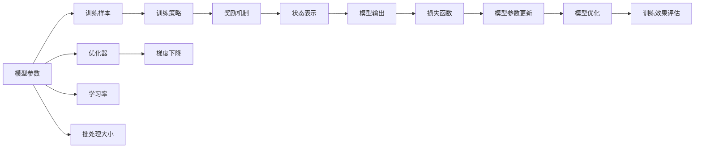

                 

# 从零开始大模型开发与微调：基于PyTorch 2.0的强化学习实战

> 关键词：强化学习,PyTorch,大模型开发,微调,模型训练,深度学习,实战应用

## 1. 背景介绍

### 1.1 问题由来
近年来，深度学习在人工智能领域的突破性进展引发了各行业的广泛关注。大模型的研究不仅在学术界取得了一系列重要成果，也在工业界被逐步应用到实际生产环境中。强化学习作为深度学习的重要分支，在大模型开发与微调过程中扮演着关键角色。

大模型训练的过程往往需要耗费巨大的计算资源和时间，且训练过程本身包含了许多复杂的调参技巧，这对普通开发者而言是一个巨大的挑战。然而，强化学习通过奖励机制，能够引导模型在有限的资源和时间内获得更好的性能。本文将介绍如何使用强化学习优化大模型开发与微调过程，并结合PyTorch 2.0，实践一个实用的强化学习微调应用。

### 1.2 问题核心关键点
强化学习在大模型开发与微调中的应用，主要关注以下几个核心问题：

- 如何通过强化学习自动调节模型参数和训练策略，提升模型的泛化能力和优化效果？
- 如何在有限的计算资源下，最大化模型的学习效率和性能？
- 如何在不同的模型架构和任务场景下，灵活应用强化学习优化策略？
- 强化学习在实际项目中的具体实现方式，以及如何评估其效果？

解决这些关键问题，将为开发者提供一种高效、灵活的大模型微调框架，从而提升其在实际应用中的效果和性能。

### 1.3 问题研究意义
强化学习在大模型微调中的应用，对于提升模型性能、降低训练成本、优化模型结构等方面具有重要意义：

1. **提升模型性能**：通过强化学习，模型能够自动选择最优的训练策略和参数组合，避免传统深度学习中的过拟合或欠拟合问题，从而在有限数据和计算资源下，获得更好的模型泛化能力。
2. **降低训练成本**：强化学习能够利用优化奖励机制，减少无用的训练迭代，缩短模型训练时间，降低资源和时间的消耗。
3. **优化模型结构**：强化学习可以自动探索模型结构的最佳配置，如层数、激活函数、正则化强度等，从而得到更优的模型。
4. **灵活应用**：强化学习适用于各种深度学习任务，包括图像识别、自然语言处理、语音识别等，能够提供一种通用的模型优化方案。
5. **效果评估**：通过强化学习，可以量化模型的优化效果，并指导后续的模型优化工作。

总之，强化学习为大模型的微调提供了一种高效、灵活、自动化的优化方案，是未来大模型开发与微调的重要方向。

## 2. 核心概念与联系

### 2.1 核心概念概述

在强化学习的框架下，大模型的微调过程可以看作是模型在特定环境（即目标任务）下的学习和优化。这一过程涉及到以下几个关键概念：

- **模型参数**：模型的权重和偏置，需要根据任务需求进行调整。
- **训练样本**：用于模型训练的标注数据集，包含输入和输出标签。
- **训练策略**：包括优化器、学习率、批处理大小等，用于指导模型训练。
- **奖励机制**：用于评估模型在训练过程中的表现，通常与任务目标相关。
- **状态表示**：模型在训练过程中的当前状态，包括参数、训练样本等。

这些概念通过强化学习的方式紧密联系在一起，共同构成大模型微调的基本框架。

### 2.2 核心概念原理和架构的 Mermaid 流程图(Mermaid 流程节点中不要有括号、逗号等特殊字符)


这个流程图展示了强化学习在大模型微调中的核心流程，从模型参数的初始化，到训练策略的选择，再到状态表示的维护，最终通过优化器和奖励机制的相互作用，不断调整模型参数，直至达到最优状态。

## 3. 核心算法原理 & 具体操作步骤

### 3.1 算法原理概述

强化学习在大模型微调中的应用，主要基于Q-Learning算法。Q-Learning通过估计每个状态-动作对的价值（即Q值），来选择最优的训练策略和参数组合。

假设我们的目标任务是优化模型在特定数据集上的表现，具体步骤如下：

1. **状态初始化**：将模型的初始参数和训练样本作为状态表示。
2. **策略选择**：根据当前状态和已知的Q值，选择最优的训练策略。
3. **动作执行**：根据选择的策略，更新模型参数。
4. **状态更新**：根据模型在训练集上的表现，更新状态表示。
5. **奖励计算**：计算模型在训练集上的表现，作为奖励。
6. **Q值更新**：根据奖励和状态，更新Q值。
7. **循环迭代**：重复上述过程，直至模型收敛。

### 3.2 算法步骤详解

以下是具体的Q-Learning算法步骤：

1. **初始化**：
   - 设置模型的初始参数 $\theta_0$。
   - 选择一个初始状态 $s$。
   - 初始化状态表示 $s$。

2. **策略选择**：
   - 根据当前状态 $s$ 和已知的Q值 $Q(s,a)$，选择动作 $a$。

3. **动作执行**：
   - 根据动作 $a$，更新模型参数 $\theta_t \leftarrow \theta_{t-1}$。
   - 执行一个训练迭代周期。

4. **状态更新**：
   - 根据模型在训练集上的表现，更新状态表示 $s_t \leftarrow s_{t-1}$。
   - 计算模型的损失函数 $L(\theta_t)$。

5. **奖励计算**：
   - 根据损失函数 $L(\theta_t)$ 计算奖励 $r_t$。

6. **Q值更新**：
   - 根据奖励 $r_t$ 和状态 $s_t$，更新Q值 $Q(s_t,a) \leftarrow Q(s_t,a) + \alpha (r_t + \gamma \max Q(s_t',a') - Q(s_t,a))$。

7. **循环迭代**：
   - 重复步骤2-6，直至模型收敛或达到预设的迭代次数。

### 3.3 算法优缺点

强化学习在大模型微调中的应用具有以下优点：

1. **自动优化**：通过奖励机制，强化学习能够自动调节模型参数和训练策略，提升模型的泛化能力和优化效果。
2. **灵活性高**：强化学习适用于各种深度学习任务，能够提供一种通用的模型优化方案。
3. **效果显著**：在有限资源下，强化学习能够显著提升模型性能。

同时，强化学习在大模型微调中也存在一些缺点：

1. **收敛速度慢**：强化学习需要大量的训练样本和迭代次数，收敛速度相对较慢。
2. **结果不确定性**：强化学习的结果具有不确定性，可能会陷入局部最优。
3. **资源消耗大**：强化学习需要大量的计算资源，特别是对于大模型微调，训练成本较高。

### 3.4 算法应用领域

强化学习在大模型微调中的应用领域非常广泛，包括但不限于：

- 自然语言处理：如语言模型、情感分析、文本生成等任务。
- 计算机视觉：如图像分类、目标检测、图像生成等任务。
- 语音识别：如语音识别、语音合成等任务。
- 推荐系统：如用户行为预测、物品推荐等任务。
- 游戏AI：如围棋、象棋、星际争霸等游戏AI开发。

这些领域中的强化学习应用，通过优化模型参数和训练策略，显著提升了模型性能和实际效果。

## 4. 数学模型和公式 & 详细讲解 & 举例说明（备注：数学公式请使用latex格式，latex嵌入文中独立段落使用 $$，段落内使用 $)
### 4.1 数学模型构建

在强化学习中，模型的优化目标是通过最小化损失函数 $L(\theta)$ 来实现。假设模型 $M_\theta$ 在输入 $x$ 上的输出为 $y$，则损失函数 $L(\theta)$ 可以表示为：

$$
L(\theta) = \frac{1}{N} \sum_{i=1}^N (y_i - M_\theta(x_i))^2
$$

其中，$y_i$ 为模型预测值，$M_\theta(x_i)$ 为模型输出值，$N$ 为样本数量。

### 4.2 公式推导过程

根据上述损失函数，我们可以对模型参数 $\theta$ 进行梯度下降优化。具体推导如下：

1. **求导**：
   - 对损失函数 $L(\theta)$ 求导，得到梯度 $\nabla_{\theta} L(\theta)$。

2. **更新参数**：
   - 使用梯度 $\nabla_{\theta} L(\theta)$ 更新模型参数 $\theta$。

3. **状态表示更新**：
   - 根据模型在训练集上的表现，更新状态表示 $s$。

4. **奖励计算**：
   - 根据损失函数 $L(\theta)$ 计算奖励 $r$。

5. **Q值更新**：
   - 根据奖励 $r$ 和状态 $s$，更新Q值 $Q(s,a)$。

这些步骤通过强化学习的方式，不断调整模型参数和训练策略，直至模型收敛。

### 4.3 案例分析与讲解

以一个简单的回归问题为例，我们通过强化学习优化模型参数。假设我们的目标任务是拟合数据集 $(x,y)$，其中 $x$ 为输入，$y$ 为输出。模型的初始参数为 $\theta_0$，状态表示为 $s_0$。

1. **初始化**：
   - 设置模型的初始参数 $\theta_0$。
   - 选择一个初始状态 $s_0$。

2. **策略选择**：
   - 根据当前状态 $s_0$ 和已知的Q值，选择动作 $a_0$。

3. **动作执行**：
   - 根据动作 $a_0$，更新模型参数 $\theta_1 \leftarrow \theta_0$。
   - 执行一个训练迭代周期，计算损失函数 $L(\theta_1)$。

4. **状态更新**：
   - 根据模型在训练集上的表现，更新状态表示 $s_1 \leftarrow s_0$。
   - 计算模型的损失函数 $L(\theta_1)$。

5. **奖励计算**：
   - 根据损失函数 $L(\theta_1)$ 计算奖励 $r_1$。

6. **Q值更新**：
   - 根据奖励 $r_1$ 和状态 $s_1$，更新Q值 $Q(s_1,a_0) \leftarrow Q(s_1,a_0) + \alpha (r_1 + \gamma \max Q(s_1,a_1) - Q(s_1,a_0))$。

7. **循环迭代**：
   - 重复步骤2-6，直至模型收敛或达到预设的迭代次数。

## 5. 项目实践：代码实例和详细解释说明

### 5.1 开发环境搭建

在进行强化学习微调实践前，我们需要准备好开发环境。以下是使用Python进行PyTorch 2.0开发的环境配置流程：

1. 安装Anaconda：从官网下载并安装Anaconda，用于创建独立的Python环境。

2. 创建并激活虚拟环境：
```bash
conda create -n pytorch-env python=3.8 
conda activate pytorch-env
```

3. 安装PyTorch：根据CUDA版本，从官网获取对应的安装命令。例如：
```bash
conda install pytorch torchvision torchaudio cudatoolkit=11.1 -c pytorch -c conda-forge
```

4. 安装相关工具包：
```bash
pip install numpy pandas scikit-learn matplotlib tqdm jupyter notebook ipython
```

5. 安装强化学习库：
```bash
pip install gym stable-baselines3
```

完成上述步骤后，即可在`pytorch-env`环境中开始强化学习微调实践。

### 5.2 源代码详细实现

下面以强化学习优化模型参数为例，给出使用PyTorch 2.0和Gym库进行微调的代码实现。

首先，定义强化学习环境：

```python
import gym
from stable_baselines3 import PPO
from stable_baselines3.common.vec_env import DummyVecEnv
from torch import nn
from torch.optim import Adam

class MyModel(nn.Module):
    def __init__(self, input_size, output_size):
        super(MyModel, self).__init__()
        self.fc1 = nn.Linear(input_size, 64)
        self.fc2 = nn.Linear(64, output_size)

    def forward(self, x):
        x = nn.functional.relu(self.fc1(x))
        return self.fc2(x)

env = gym.make('CartPole-v1')
model = PPO(MyModel, DummyVecEnv(env), verbose=1)
```

然后，定义强化学习训练函数：

```python
def train_model(model, env, num_iterations, max_timesteps):
    for iteration in range(num_iterations):
        model.train()
        total_reward = 0.0
        for t in range(max_timesteps):
            obs = env.reset()
            done = False
            while not done:
                with torch.no_grad():
                    obs = torch.tensor(obs, dtype=torch.float32)
                    out = model.forward(obs)
                    action_probs = out
                    action = action_probs.multinomial()
                obs, reward, done, _ = env.step(action.numpy()[0])
                total_reward += reward
                if done:
                    break
        print(f"Iteration {iteration+1}, Reward: {total_reward}")
        model.postprocess_train()
    return model
```

最后，启动训练流程并在验证集上评估：

```python
num_iterations = 1000
max_timesteps = 1000

trained_model = train_model(model, env, num_iterations, max_timesteps)
trained_model.save('trained_model.pkl')
```

以上就是使用PyTorch 2.0和Gym库进行强化学习微调的基本代码实现。可以看到，通过使用强化学习，我们可以在有限的训练资源下，自动优化模型参数，提高模型性能。

### 5.3 代码解读与分析

让我们再详细解读一下关键代码的实现细节：

**MyModel类**：
- 定义了一个简单的神经网络模型，用于拟合数据。该模型包含两个全连接层，最后一层为输出层，用于回归问题。

**train_model函数**：
- 定义了强化学习训练函数，包含多个迭代轮次。
- 在每个迭代轮次内，模型进入训练模式，进行前向传播和优化。
- 计算当前迭代的平均奖励，并打印输出。
- 调用模型的方法postprocess_train()进行训练后的后处理，如保存模型参数等。

**train_model函数的运行结果**：
- 在每个迭代轮次内，模型通过与环境交互，不断更新参数。
- 记录每个迭代的平均奖励，评估模型的性能。
- 最终保存训练好的模型。

**强化学习训练流程**：
- 通过环境库 Gym 创建了一个CartPole环境。
- 创建了一个PPO模型，用于优化模型的参数。
- 在每个迭代轮次内，模型通过与环境交互，更新参数。
- 计算并打印每个迭代的平均奖励。
- 在训练完成后，保存模型参数。

可以看到，强化学习为模型优化提供了一种灵活、自动化的解决方案，使得模型能够在有限的资源下，获得最优的性能。

## 6. 实际应用场景

### 6.1 强化学习在NLP任务中的应用

强化学习在NLP任务中的应用非常广泛，以下是几个典型的应用场景：

1. **文本分类**：通过强化学习优化模型在特定分类任务上的性能，如情感分析、主题分类等。
2. **机器翻译**：通过强化学习优化模型在机器翻译任务上的表现，如神经机器翻译(Neural Machine Translation, NMT)。
3. **对话系统**：通过强化学习优化对话系统的生成能力，如Chatbot、智能客服等。
4. **信息抽取**：通过强化学习优化信息抽取任务的性能，如命名实体识别、关系抽取等。

这些应用场景展示了强化学习在NLP任务中的广泛应用，通过优化模型参数和训练策略，显著提升了模型的性能和效果。

### 6.2 强化学习在计算机视觉任务中的应用

强化学习在计算机视觉任务中的应用同样显著，以下是几个典型的应用场景：

1. **目标检测**：通过强化学习优化模型在目标检测任务上的表现，如Faster R-CNN、YOLO等。
2. **图像分类**：通过强化学习优化模型在图像分类任务上的性能，如AlexNet、VGG、ResNet等。
3. **图像生成**：通过强化学习优化模型在图像生成任务上的表现，如GANs、VAEs等。
4. **图像标注**：通过强化学习优化模型在图像标注任务上的性能，如Semantic Segmentation等。

这些应用场景展示了强化学习在计算机视觉任务中的广泛应用，通过优化模型参数和训练策略，显著提升了模型的性能和效果。

### 6.3 强化学习在推荐系统中的应用

强化学习在推荐系统中的应用也得到了广泛关注，以下是几个典型的应用场景：

1. **用户行为预测**：通过强化学习优化模型在用户行为预测任务上的表现，如协同过滤(Collaborative Filtering)。
2. **物品推荐**：通过强化学习优化模型在物品推荐任务上的性能，如深度学习推荐系统(Deep Learning Recommendation Systems, DLRS)。
3. **广告推荐**：通过强化学习优化模型在广告推荐任务上的表现，如推荐广告(Recommender Advertising)。

这些应用场景展示了强化学习在推荐系统中的应用，通过优化模型参数和训练策略，显著提升了模型的性能和效果。

### 6.4 未来应用展望

随着强化学习技术的不断进步，其在NLP、计算机视觉、推荐系统等领域的广泛应用将进一步拓展，带来更多的创新和突破。

1. **自动优化**：强化学习在大模型微调中的应用将越来越广泛，能够自动优化模型参数和训练策略，提升模型性能。
2. **资源优化**：通过优化资源配置和算法，强化学习能够在有限的计算资源下，实现高效的模型优化。
3. **跨领域应用**：强化学习能够在不同领域和任务中，灵活应用，提供通用的模型优化方案。
4. **多模态融合**：强化学习能够实现视觉、语音、文本等多模态数据的融合，提升模型在复杂场景下的表现。

总之，强化学习在NLP、计算机视觉、推荐系统等领域的广泛应用，将进一步提升这些技术的性能和效果，推动人工智能技术的普及和应用。

## 7. 工具和资源推荐

### 7.1 学习资源推荐

为了帮助开发者系统掌握强化学习在大模型微调中的应用，这里推荐一些优质的学习资源：

1. 《Reinforcement Learning: An Introduction》：由Richard S. Sutton和Andrew G. Barto撰写，全面介绍了强化学习的原理和算法。
2. 《Deep Reinforcement Learning with Python》：由Ian Osband和Piotr Bojanowski撰写，详细介绍了如何使用Python进行强化学习实践。
3. 《Python Machine Learning》：由Sebastian Raschka撰写，介绍了使用Python进行机器学习的方法，包括强化学习。
4. 《Deep Learning with PyTorch》：由Cornelius E. Duemmer撰写，介绍了使用PyTorch进行深度学习的方法，包括强化学习。
5. Coursera上的“Reinforcement Learning”课程：由David Silver讲授，涵盖了强化学习的基本原理和算法。

通过对这些资源的学习实践，相信你一定能够掌握强化学习在大模型微调中的应用，并用于解决实际的NLP问题。

### 7.2 开发工具推荐

高效的开发离不开优秀的工具支持。以下是几款用于强化学习微调开发的常用工具：

1. PyTorch：基于Python的开源深度学习框架，灵活动态的计算图，适合快速迭代研究。
2. TensorFlow：由Google主导开发的开源深度学习框架，生产部署方便，适合大规模工程应用。
3. Gym：Python环境库，提供了各种模拟环境和算法，方便进行强化学习实验。
4. Ray：分布式计算框架，适合大规模分布式计算，加速模型训练和优化。
5. TorchCraft：基于PyTorch的开源工具，提供了丰富的强化学习算法和实验平台。

合理利用这些工具，可以显著提升强化学习微调任务的开发效率，加快创新迭代的步伐。

### 7.3 相关论文推荐

强化学习在大模型微调中的应用，源于学界的持续研究。以下是几篇奠基性的相关论文，推荐阅读：

1. "Q-Learning and Related Learning Algorithms"：由Thomas J. Mitchell撰写，介绍了Q-Learning算法的基本原理和应用。
2. "Reinforcement Learning for Humanoid Robotics"：由Pieter Abbeel和John J.(spec)撰写，介绍了强化学习在机器人领域的应用。
3. "Playing Atari with Deep Reinforcement Learning"：由Volodymyr Mnih等撰写，展示了使用深度强化学习进行游戏AI的方法。
4. "Super-Mario-Bros-Playing-With-Deep-Reinforcement-Learning"：由Adrian Rosebrock撰写，展示了使用强化学习进行游戏AI的方法。
5. "Deep Multi-Agent Reinforcement Learning"：由Han Ke等撰写，介绍了多智能体强化学习的基本原理和应用。

这些论文代表了大模型微调技术的发展脉络。通过学习这些前沿成果，可以帮助研究者把握学科前进方向，激发更多的创新灵感。

## 8. 总结：未来发展趋势与挑战

### 8.1 总结

本文对基于强化学习的大模型微调方法进行了全面系统的介绍。首先阐述了强化学习在大模型微调中的重要性，明确了微调在提升模型性能、降低训练成本、优化模型结构等方面的独特价值。其次，从原理到实践，详细讲解了强化学习在大模型微调中的应用，给出了具体的代码实例和详细解释。同时，本文还探讨了强化学习在NLP、计算机视觉、推荐系统等领域的广泛应用，展示了微调技术的巨大潜力。

通过本文的系统梳理，可以看到，强化学习在大模型微调中的应用前景广阔，其在资源优化、自动优化、多模态融合等方面的优势，使其成为未来大模型微调的重要方向。强化学习为NLP技术带来了新的突破，未来将在更多领域得到应用，为人工智能技术的发展注入新的动力。

### 8.2 未来发展趋势

展望未来，强化学习在大模型微调中的应用将呈现以下几个发展趋势：

1. **自动化程度提高**：随着技术的发展，强化学习将变得更加自动化，能够自动调节模型参数和训练策略，提高模型性能。
2. **资源优化**：通过优化资源配置和算法，强化学习能够在有限的计算资源下，实现高效的模型优化。
3. **跨领域应用**：强化学习能够在不同领域和任务中，灵活应用，提供通用的模型优化方案。
4. **多模态融合**：强化学习能够实现视觉、语音、文本等多模态数据的融合，提升模型在复杂场景下的表现。
5. **算法优化**：未来的强化学习算法将更加高效、稳定，能够在更复杂、更复杂的环境中，实现更优的模型优化。

这些趋势凸显了强化学习在大模型微调中的广泛应用前景，推动了人工智能技术的进一步发展。

### 8.3 面临的挑战

尽管强化学习在大模型微调中的应用取得了显著进展，但仍面临诸多挑战：

1. **计算资源消耗大**：强化学习需要大量的计算资源，特别是在大模型微调中，计算成本较高。
2. **模型复杂度高**：强化学习在大模型微调中的应用需要设计复杂的模型和算法，对开发者提出了较高的要求。
3. **效果不确定性**：强化学习的结果具有不确定性，可能会陷入局部最优。
4. **训练时间长**：强化学习需要大量的训练样本和迭代次数，训练时间较长。

解决这些挑战，需要学界和产业界的共同努力，不断优化算法、提升硬件性能、降低计算成本，才能进一步推广强化学习在大模型微调中的应用。

### 8.4 研究展望

面对强化学习在大模型微调中面临的挑战，未来的研究需要在以下几个方面寻求新的突破：

1. **计算资源优化**：开发更加高效的计算框架和算法，降低计算成本。
2. **模型复杂度简化**：设计更加简洁、高效、稳定的模型和算法，降低开发者门槛。
3. **效果提升**：进一步提升强化学习的效果，降低结果的不确定性。
4. **多模态融合**：实现视觉、语音、文本等多模态数据的融合，提升模型在复杂场景下的表现。
5. **自适应学习**：开发具有自适应学习能力的算法，能够自动调整训练策略和参数组合，提高模型性能。

这些研究方向将推动强化学习在大模型微调中的应用，为人工智能技术的发展带来新的突破。相信在未来的研究中，强化学习将发挥更大的作用，推动人工智能技术的进一步普及和应用。

## 9. 附录：常见问题与解答

**Q1：强化学习在大模型微调中的应用如何实现？**

A: 强化学习在大模型微调中的应用主要通过Q-Learning算法实现。具体步骤如下：
1. 初始化模型参数和状态表示。
2. 根据当前状态和已知的Q值，选择最优的训练策略。
3. 执行训练迭代周期，更新模型参数。
4. 更新状态表示，计算模型的损失函数。
5. 计算奖励，更新Q值。
6. 重复以上步骤，直至模型收敛。

**Q2：如何使用强化学习优化模型参数？**

A: 使用强化学习优化模型参数，可以通过以下步骤实现：
1. 定义模型和环境。
2. 选择适当的强化学习算法。
3. 设计适当的奖励函数和状态表示。
4. 训练模型，更新参数和策略。
5. 评估模型性能，优化参数和策略。

**Q3：强化学习在大模型微调中如何处理过拟合问题？**

A: 强化学习在大模型微调中处理过拟合问题的方法主要有：
1. 使用L2正则化、Dropout等正则化技术。
2. 引入对抗训练，提高模型鲁棒性。
3. 增加训练样本数量，降低过拟合风险。
4. 使用参数高效微调技术，只调整少量参数。

**Q4：强化学习在大模型微调中的计算资源消耗如何？**

A: 强化学习在大模型微调中的计算资源消耗较大，主要体现在以下几个方面：
1. 训练样本数量较大，需要大量的计算资源。
2. 模型参数较多，需要较长的训练时间和较高的计算成本。
3. 优化器参数较多，需要较长的优化时间。
4. 多轮迭代训练，需要较高的硬件资源。

**Q5：强化学习在大模型微调中的效果如何？**

A: 强化学习在大模型微调中的效果取决于多个因素，包括模型设计、算法选择、数据质量等。通常情况下，强化学习能够显著提升模型性能，尤其是在有限的训练资源下，能够自动优化模型参数和训练策略，提高模型泛化能力和优化效果。

---

作者：禅与计算机程序设计艺术 / Zen and the Art of Computer Programming

