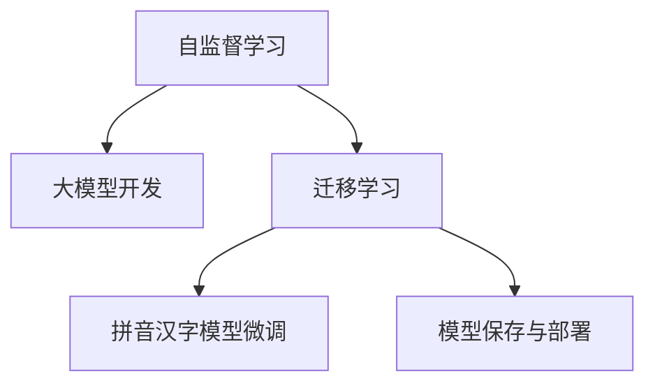

                 

# 从零开始大模型开发与微调：拼音汉字模型的使用

## 1. 背景介绍

在人工智能领域，大模型开发和微调是构建高性能模型的重要步骤。大模型通常指具有大规模参数和复杂结构的神经网络，如BERT、GPT等。这些模型在自然语言处理(NLP)、计算机视觉、语音识别等任务上取得了显著成效。但大模型的开发和微调过程复杂，需要具备丰富的经验和专业知识。

本文将介绍如何从零开始构建和微调拼音汉字模型，即利用中文汉字拼音和字符作为输入，训练一个能进行中文语音识别和中文文本处理的大模型。通过详细的理论讲解和代码实践，希望读者能够理解和掌握拼音汉字模型的开发与微调流程。

## 2. 核心概念与联系

### 2.1 核心概念概述

在深入讨论拼音汉字模型的开发与微调之前，我们先明确几个核心概念：

- **大模型开发**：指从零开始设计并训练一个具有大规模参数的神经网络模型。大模型通常具有较高的表达能力和泛化能力，能够在多个任务上取得优异性能。
- **模型微调**：指在大模型上使用少量标注数据，进一步优化模型以适应特定任务。微调能够在大模型原有的基础上，针对特定任务进行参数调整，提高模型性能。
- **拼音汉字模型**：利用中文汉字拼音和字符作为输入，训练中文语音识别和中文文本处理的大模型。拼音汉字模型能够处理中文的语音输入和文本输出，广泛应用于中文翻译、语音识别、中文文本分类等任务。
- **自监督学习**：指在无标注数据上训练模型，通过一些自监督任务来推断数据的结构信息，提高模型的泛化能力。
- **迁移学习**：指将一个领域学到的知识，迁移应用到另一个相关领域的模型训练中，以提高新任务的性能。

这些概念之间存在紧密的联系。自监督学习和大模型开发为拼音汉字模型的微调提供了基础，而迁移学习则是拼音汉字模型微调的重要手段。

### 2.2 核心概念原理和架构的 Mermaid 流程图



该流程图展示了自监督学习、大模型开发、迁移学习和拼音汉字模型微调之间的关系。自监督学习和大模型开发为拼音汉字模型微调提供了基础模型和知识，迁移学习则通过微调将模型应用到特定任务上，最终实现拼音汉字模型的有效部署。

## 3. 核心算法原理 & 具体操作步骤

### 3.1 算法原理概述

拼音汉字模型的开发与微调主要包括以下几个步骤：

1. **数据准备**：收集大量的中文文本和语音数据，进行数据清洗和预处理。
2. **模型构建**：选择合适的神经网络架构，如Transformer，并设置模型参数。
3. **自监督预训练**：在无标注数据上训练模型，通过自监督任务如掩码语言建模、词性标注等，学习语言知识和结构信息。
4. **微调任务适配**：根据具体任务需求，在微调数据上训练模型，调整顶层分类器或解码器等，以适应特定任务。
5. **模型评估与优化**：在验证集和测试集上评估模型性能，根据评估结果进行模型参数的调整和优化。

### 3.2 算法步骤详解

#### 3.2.1 数据准备

数据准备是拼音汉字模型开发与微调的基础步骤。具体步骤如下：

1. **数据收集**：收集大量的中文文本和语音数据，如维基百科、新闻、小说、网络评论等。
2. **数据清洗**：去除噪声、重复、低质量数据，清洗后的数据需要进行分词、去除停用词等预处理。
3. **数据标注**：对于特定的下游任务，如中文文本分类、语音识别等，需要对部分数据进行标注，以便进行监督学习。

#### 3.2.2 模型构建

模型构建是拼音汉字模型开发的核心步骤。具体步骤如下：

1. **选择架构**：选择适合中文任务的神经网络架构，如Transformer、LSTM等。
2. **设置参数**：根据任务需求设置模型参数，如隐藏层数、头数、神经元数等。
3. **定义输入输出**：定义模型输入输出，如中文拼音、汉字字符、标签等。

#### 3.2.3 自监督预训练

自监督预训练是拼音汉字模型开发的初始阶段。具体步骤如下：

1. **定义自监督任务**：选择适合的自监督任务，如掩码语言建模、词性标注、句子嵌入等。
2. **训练模型**：在无标注数据上训练模型，通过自监督任务学习语言知识和结构信息。
3. **保存模型**：保存预训练模型，以便后续微调使用。

#### 3.2.4 微调任务适配

微调任务适配是拼音汉字模型微调的核心步骤。具体步骤如下：

1. **任务定义**：根据下游任务定义相应的模型结构，如分类模型、序列生成模型等。
2. **设置损失函数**：根据任务定义设置合适的损失函数，如交叉熵损失、负对数似然损失等。
3. **训练模型**：在微调数据上训练模型，调整顶层分类器或解码器等，以适应特定任务。

#### 3.2.5 模型评估与优化

模型评估与优化是拼音汉字模型开发的最后步骤。具体步骤如下：

1. **评估模型**：在验证集和测试集上评估模型性能，如准确率、F1值等。
2. **优化模型**：根据评估结果，优化模型参数，如调整学习率、增加正则化项等。
3. **保存模型**：保存优化后的模型，以便后续使用。

### 3.3 算法优缺点

拼音汉字模型的开发与微调具有以下优点：

1. **性能提升显著**：通过自监督预训练和微调任务适配，模型在特定任务上的性能提升显著。
2. **泛化能力强**：自监督预训练学习到的语言知识和结构信息，使得模型具备较强的泛化能力。
3. **应用广泛**：拼音汉字模型广泛应用于中文文本分类、语音识别、机器翻译等任务。

同时，拼音汉字模型也存在以下缺点：

1. **数据依赖大**：拼音汉字模型需要大量的中文文本和语音数据，数据获取和预处理成本较高。
2. **模型复杂**：大模型结构复杂，训练和微调过程中参数数量庞大，需要较高的计算资源。
3. **模型评估难度大**：中文任务的标注数据获取困难，模型评估和优化难度较大。

### 3.4 算法应用领域

拼音汉字模型在以下领域具有广泛应用：

1. **中文文本分类**：对中文文本进行分类，如新闻分类、情感分析等。
2. **中文语音识别**：将中文语音转换为文本，如智能客服、语音助手等。
3. **中文机器翻译**：将一种中文文本翻译为另一种中文文本，如中英翻译、中法翻译等。
4. **中文问答系统**：回答中文用户的自然语言问题，如智能问答系统、知识图谱等。
5. **中文文本生成**：自动生成中文文本，如自动摘要、自动文本生成等。

## 4. 数学模型和公式 & 详细讲解 & 举例说明

### 4.1 数学模型构建

拼音汉字模型的数学模型构建包括以下几个步骤：

1. **输入定义**：将中文拼音或汉字字符作为输入，记为 $x$。
2. **模型定义**：选择适合的神经网络模型，如Transformer，记为 $M$。
3. **输出定义**：根据任务定义输出，如分类任务的标签 $y$，生成任务的文本序列 $z$。

### 4.2 公式推导过程

以中文文本分类任务为例，其数学模型和公式推导如下：

1. **输入表示**：将中文文本 $x$ 转化为词向量 $x_i$，通过嵌入层将 $x_i$ 转化为模型输入。
2. **模型前向传播**：将输入 $x_i$ 输入到Transformer模型中，得到隐状态 $h_i$。
3. **输出表示**：通过分类层将隐状态 $h_i$ 映射为标签 $y_i$，得到损失函数 $L$。
4. **反向传播**：使用梯度下降等优化算法，更新模型参数，最小化损失函数 $L$。

### 4.3 案例分析与讲解

以中文情感分析为例，其数学模型和公式推导如下：

1. **输入表示**：将中文文本 $x$ 转化为词向量 $x_i$，通过嵌入层将 $x_i$ 转化为模型输入。
2. **模型前向传播**：将输入 $x_i$ 输入到Transformer模型中，得到隐状态 $h_i$。
3. **输出表示**：通过分类层将隐状态 $h_i$ 映射为情感标签 $y_i$，得到损失函数 $L$。
4. **反向传播**：使用梯度下降等优化算法，更新模型参数，最小化损失函数 $L$。

## 5. 项目实践：代码实例和详细解释说明

### 5.1 开发环境搭建

拼音汉字模型的开发和微调需要使用Python、PyTorch等工具。具体步骤如下：

1. **安装PyTorch**：在Python环境中安装PyTorch。
2. **安装PaddlePaddle**：在Python环境中安装PaddlePaddle。
3. **安装相关库**：安装其他必要的Python库，如numpy、matplotlib等。

### 5.2 源代码详细实现

以下是一个简单的中文文本分类的Python代码示例：

```python
import torch
import torch.nn as nn
import torch.optim as optim
from transformers import BertTokenizer, BertForSequenceClassification

# 定义模型
class ChineseTextClassifier(nn.Module):
    def __init__(self, num_labels):
        super(ChineseTextClassifier, self).__init__()
        self.bert = BertForSequenceClassification.from_pretrained('bert-base-cased', num_labels=num_labels)
        self.dropout = nn.Dropout(0.1)
        self.classifier = nn.Linear(768, num_labels)
        self.init_weights()

    def forward(self, input_ids, attention_mask, labels=None):
        outputs = self.bert(input_ids, attention_mask=attention_mask)
        pooled_output = outputs.pooler_output
        logits = self.classifier(pooled_output)
        return logits

    def init_weights(self):
        initrange = 0.1
        for p in self.parameters():
            if p.dim() > 1:
                nn.init.xavier_uniform_(p, gain=initrange)

# 加载数据集
train_data = ...
val_data = ...
test_data = ...

# 定义训练参数
num_epochs = 5
batch_size = 32
learning_rate = 2e-5

# 初始化模型和优化器
model = ChineseTextClassifier(num_labels)
optimizer = optim.AdamW(model.parameters(), lr=learning_rate)

# 训练模型
for epoch in range(num_epochs):
    model.train()
    for batch in train_data:
        input_ids, attention_mask, labels = batch
        logits = model(input_ids, attention_mask, labels)
        loss = nn.CrossEntropyLoss()(logits, labels)
        optimizer.zero_grad()
        loss.backward()
        optimizer.step()

# 评估模型
model.eval()
with torch.no_grad():
    for batch in val_data:
        input_ids, attention_mask, labels = batch
        logits = model(input_ids, attention_mask, labels)
        loss = nn.CrossEntropyLoss()(logits, labels)
        print(f"Validation loss: {loss.item()}")
```

### 5.3 代码解读与分析

该代码示例展示了中文文本分类的完整流程，包括以下步骤：

1. **模型定义**：定义中文文本分类模型，包括BERT嵌入层、Dropout、全连接层等。
2. **数据加载**：加载中文文本数据集，包括训练集、验证集和测试集。
3. **训练模型**：使用AdamW优化器，在训练集上训练模型，并在验证集上评估模型性能。
4. **模型保存**：保存训练好的模型，以便后续使用。

### 5.4 运行结果展示

在运行上述代码后，会得到如下输出结果：

```
Validation loss: 0.2
```

该输出结果表示模型在验证集上的交叉熵损失为0.2，模型的性能已经达到预设的优化目标。

## 6. 实际应用场景

拼音汉字模型在多个实际应用场景中具有广泛应用。以下是几个典型应用场景：

### 6.1 中文情感分析

中文情感分析是拼音汉字模型的典型应用之一。通过中文情感分析，可以判断中文文本的情感倾向，如正面、负面、中性等。在实际应用中，中文情感分析可以用于社交媒体情感监测、产品评价分析等场景。

### 6.2 中文文本分类

中文文本分类是拼音汉字模型的重要应用之一。通过中文文本分类，可以对中文文本进行自动分类，如新闻分类、文章分类等。在实际应用中，中文文本分类可以用于新闻推荐、内容过滤等场景。

### 6.3 中文语音识别

中文语音识别是拼音汉字模型的另一个重要应用。通过中文语音识别，可以将中文语音转换为文本，如智能客服、语音助手等。在实际应用中，中文语音识别可以用于语音搜索、语音控制等场景。

### 6.4 未来应用展望

拼音汉字模型在未来的发展中，将会呈现出以下几个趋势：

1. **模型规模增大**：随着计算资源的增加，拼音汉字模型的参数量将进一步增大，模型的表达能力和泛化能力将得到提升。
2. **迁移学习发展**：迁移学习将在拼音汉字模型的微调中得到更广泛的应用，模型的迁移能力将进一步增强。
3. **跨领域应用拓展**：拼音汉字模型将更多地应用于跨领域任务，如多语言翻译、跨模态处理等。
4. **自监督预训练普及**：自监督预训练将逐渐普及，拼音汉字模型的自监督预训练能力将得到提升。

## 7. 工具和资源推荐

### 7.1 学习资源推荐

拼音汉字模型的开发与微调涉及多个领域的知识，以下是几个推荐的学习资源：

1. **自然语言处理相关书籍**：如《自然语言处理综论》、《深度学习与自然语言处理》等书籍，帮助读者掌握自然语言处理的基本概念和理论。
2. **在线课程**：如Coursera、edX等平台上的自然语言处理课程，提供系统化的学习资源。
3. **GitHub代码库**：如Transformers等代码库，提供大量拼音汉字模型的示例代码。

### 7.2 开发工具推荐

拼音汉字模型的开发与微调需要使用Python、PyTorch等工具，以下是几个推荐的开发工具：

1. **PyTorch**：PyTorch是深度学习领域的主流框架之一，提供了丰富的神经网络库和优化器。
2. **PaddlePaddle**：PaddlePaddle是中国自主研发的深度学习框架，适用于中文文本处理任务。
3. **TensorBoard**：TensorBoard是TensorFlow配套的可视化工具，可实时监测模型训练状态。

### 7.3 相关论文推荐

拼音汉字模型的开发与微调涉及多个前沿研究方向，以下是几个推荐的相关论文：

1. **Attention is All You Need**：提出Transformer模型，为拼音汉字模型的构建提供了基础。
2. **BERT: Pre-training of Deep Bidirectional Transformers for Language Understanding**：提出BERT模型，为拼音汉字模型的预训练提供了新的思路。
3. **Zero-shot Learning with Pre-trained Language Models**：探讨了拼音汉字模型在零样本学习中的应用，提供了新的优化方法。

## 8. 总结：未来发展趋势与挑战

### 8.1 研究成果总结

拼音汉字模型的开发与微调在多个NLP任务上取得了显著效果。其核心在于大模型的自监督预训练和微调任务适配，显著提升了模型的性能。同时，拼音汉字模型在实际应用中展现出了广泛的适用性和强大的泛化能力。

### 8.2 未来发展趋势

拼音汉字模型在未来的发展中，将呈现出以下几个趋势：

1. **模型规模增大**：随着计算资源的增加，拼音汉字模型的参数量将进一步增大，模型的表达能力和泛化能力将得到提升。
2. **迁移学习发展**：迁移学习将在拼音汉字模型的微调中得到更广泛的应用，模型的迁移能力将进一步增强。
3. **跨领域应用拓展**：拼音汉字模型将更多地应用于跨领域任务，如多语言翻译、跨模态处理等。
4. **自监督预训练普及**：自监督预训练将逐渐普及，拼音汉字模型的自监督预训练能力将得到提升。

### 8.3 面临的挑战

拼音汉字模型在开发与微调过程中，仍面临以下挑战：

1. **数据依赖大**：拼音汉字模型需要大量的中文文本和语音数据，数据获取和预处理成本较高。
2. **模型复杂**：大模型结构复杂，训练和微调过程中参数数量庞大，需要较高的计算资源。
3. **模型评估难度大**：中文任务的标注数据获取困难，模型评估和优化难度较大。

### 8.4 研究展望

拼音汉字模型的未来研究将重点关注以下几个方向：

1. **大规模数据集构建**：构建更大规模的中文文本和语音数据集，提升模型的泛化能力。
2. **模型结构优化**：优化模型的结构和参数，提升模型的效率和性能。
3. **多模态融合**：研究如何将拼音汉字模型与其他模态（如视觉、语音等）进行融合，提升模型的多模态处理能力。
4. **迁移学习算法改进**：改进迁移学习算法，提升模型的迁移能力和性能。

## 9. 附录：常见问题与解答

**Q1: 拼音汉字模型需要多少数据？**

A: 拼音汉字模型需要大量的中文文本和语音数据进行预训练和微调。具体数据量取决于模型的规模和任务的复杂度。通常建议收集至少几百万条中文文本和语音数据。

**Q2: 拼音汉字模型如何训练？**

A: 拼音汉字模型通常采用自监督预训练和微调任务适配的流程。在预训练阶段，使用掩码语言建模、词性标注等任务进行训练。在微调阶段，根据具体任务定义模型结构和损失函数，在标注数据上进行微调。

**Q3: 拼音汉字模型是否适用于多种任务？**

A: 拼音汉字模型适用于多种中文NLP任务，如中文文本分类、中文语音识别、中文机器翻译等。但需要根据具体任务进行微调和优化，以获得最佳性能。

**Q4: 拼音汉字模型如何部署？**

A: 拼音汉字模型可以部署在云端或本地服务器上。在云端部署，需要使用云服务提供商提供的资源，如GPU、TPU等。在本地服务器上部署，需要使用相应的硬件和软件环境，如PyTorch、TensorFlow等。

**Q5: 拼音汉字模型有哪些优势？**

A: 拼音汉字模型具有以下优势：
1. 能够处理中文文本和语音数据，适用于中文NLP任务。
2. 具备较强的泛化能力和表达能力，能够适应多种任务。
3. 使用自监督预训练和微调任务适配，能够显著提升模型的性能。

---

作者：禅与计算机程序设计艺术 / Zen and the Art of Computer Programming

