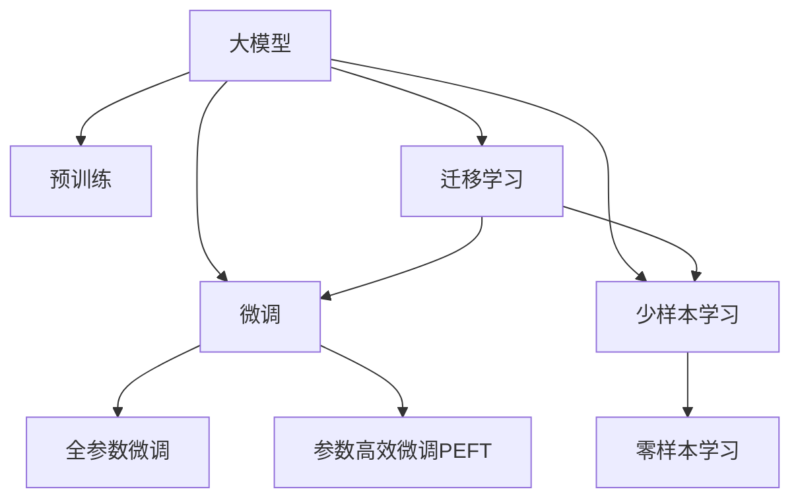

                 

## 1. 背景介绍

### 1.1 问题由来

在人工智能（AI）领域，尤其是自然语言处理（NLP）领域，近年来的一大突破是预训练大模型（Large Pre-trained Models, LPMs）的崛起。这些模型基于自监督学习在庞大的未标注文本语料库上进行训练，能够学习到丰富的语言知识和模式，进而显著提升在各种NLP任务上的表现。然而，尽管这些大模型在许多任务上表现卓越，它们仍面临着一个核心问题：它们无法完美适配特定任务的需求，其泛化能力仍有待提升。因此，如何利用这些大模型构建针对特定任务的高效模型，即微调（Fine-tuning），成为当前研究的热点。

### 1.2 问题核心关键点

微调是一种通过在已有大模型的基础上，利用下游任务的少量标注数据进行再训练的方法，以优化模型在特定任务上的性能。其核心在于如何平衡模型的泛化能力和对特定任务的适应性。微调的有效性很大程度上取决于模型在泛化语言能力的同时，是否能够准确地捕捉到特定任务的特征。目前，微调方法已经被广泛应用于问答系统、机器翻译、情感分析等众多NLP任务中，并不断推动着AI技术在实际应用中的落地。

### 1.3 问题研究意义

微调方法不仅能够显著提升模型的性能，还能大幅降低对标注数据的需求，这对于数据稀缺但任务重要的场景尤为关键。例如，在金融领域，微调模型能够实时监控舆情，辅助决策；在医疗领域，微调模型能够提供高质量的疾病诊断建议；在教育领域，微调模型能够个性化推荐学习内容。因此，深入研究微调方法对于推动AI技术在各行各业的广泛应用，具有重要意义。

## 2. 核心概念与联系

### 2.1 核心概念概述

为更好地理解微调的方法，本节将介绍几个关键概念：

- **大模型（Large Pre-trained Models, LPMs）**：这些模型通常基于Transformer架构，在大量未标注文本数据上进行预训练，如GPT-3、BERT、T5等。它们通过自监督学习任务获得了泛化的语言表示能力。
- **微调（Fine-tuning）**：在预训练模型基础上，利用少量标注数据进行再训练，优化模型在特定任务上的表现。微调过程中，模型通常只调整顶层分类器或解码器，以保证其泛化能力。
- **迁移学习（Transfer Learning）**：将一个领域学到的知识迁移到另一个领域，通过微调可以视为迁移学习的一种形式。
- **参数高效微调（Parameter-Efficient Fine-tuning, PEFT）**：在微调过程中，仅更新极少量的模型参数，保持大部分预训练权重不变，以提高微调效率。
- **少样本学习（Few-shot Learning）**：在几乎没有标注样本的情况下，模型能够快速适应新任务，主要通过微调模型参数实现。
- **零样本学习（Zero-shot Learning）**：模型仅凭任务描述即可执行新任务，通过微调模型可实现零样本学习能力。

### 2.2 核心概念原理和架构的 Mermaid 流程图



这个流程图展示了上述核心概念之间的联系：

1. **大模型**通过**预训练**获得泛化能力。
2. **微调**基于特定任务的少量标注数据，优化模型在特定任务上的性能。
3. **参数高效微调**仅调整少量参数，保持大部分预训练权重不变。
4. **少样本学习**利用少量标注样本进行快速适应。
5. **零样本学习**仅凭任务描述执行新任务。
6. **迁移学习**将知识从一个领域迁移到另一个领域，通过**微调**实现。

## 3. 核心算法原理 & 具体操作步骤

### 3.1 算法原理概述

微调的本质是利用大模型的泛化能力，通过下游任务的少量标注数据，进一步优化模型在特定任务上的表现。假设我们有一个预训练模型 $M_{\theta}$ 和一个下游任务 $T$，其中 $\theta$ 是模型参数，$T$ 是任务。微调的目标是找到一个新的模型参数 $\hat{\theta}$，使得模型在 $T$ 上的表现最优。这一目标通常通过最小化任务 $T$ 上的损失函数 $\mathcal{L}(\theta)$ 来实现。

### 3.2 算法步骤详解

微调的基本步骤如下：

1. **准备数据集**：收集下游任务 $T$ 的少量标注数据，分为训练集、验证集和测试集。
2. **添加任务适配层**：根据任务类型，在预训练模型顶层添加合适的输出层和损失函数。
3. **设置超参数**：选择合适的优化算法及其参数，如学习率、批大小、迭代轮数等。
4. **执行梯度训练**：前向传播计算损失函数，反向传播计算参数梯度，根据优化算法更新模型参数。
5. **测试与部署**：在测试集上评估微调后模型性能，集成到实际应用中。

### 3.3 算法优缺点

**优点**：

- **高效**：利用大模型的泛化能力，可以显著降低对标注数据的需求。
- **泛化性强**：预训练模型通常具有很强的泛化能力，微调后的模型在未见过的数据上表现良好。
- **可解释性**：微调后的模型可以通过改变任务适配层的结构来解释其推理过程。

**缺点**：

- **数据依赖**：微调的效果很大程度上依赖于标注数据的质量和数量。
- **模型复杂性**：微调过程中可能需要调整大量参数，增加模型复杂度。
- **偏见传递**：预训练模型可能带有偏见，微调过程中可能将这些偏见传递到下游任务中。

### 3.4 算法应用领域

微调方法已经广泛应用于各种NLP任务，包括：

- **文本分类**：如情感分析、主题分类、意图识别等。
- **命名实体识别**：识别文本中的人名、地名、机构名等。
- **关系抽取**：从文本中抽取实体之间的语义关系。
- **问答系统**：对自然语言问题给出答案。
- **机器翻译**：将源语言文本翻译成目标语言。
- **文本摘要**：将长文本压缩成简短摘要。
- **对话系统**：使机器能够与人自然对话。

## 4. 数学模型和公式 & 详细讲解 & 举例说明

### 4.1 数学模型构建

假设预训练模型为 $M_{\theta}$，下游任务 $T$ 的标注数据集为 $D=\{(x_i, y_i)\}_{i=1}^N$，其中 $x_i$ 为输入，$y_i$ 为标签。定义损失函数 $\mathcal{L}(\theta)$ 为：

$$
\mathcal{L}(\theta) = -\frac{1}{N}\sum_{i=1}^N \ell(M_{\theta}(x_i), y_i)
$$

其中 $\ell$ 为针对任务 $T$ 设计的损失函数。在微调过程中，我们使用梯度下降等优化算法最小化损失函数，更新模型参数 $\theta$。

### 4.2 公式推导过程

以二分类任务为例，假设模型 $M_{\theta}$ 在输入 $x$ 上的输出为 $\hat{y}=M_{\theta}(x)$，真实标签为 $y \in \{0,1\}$。二分类交叉熵损失函数为：

$$
\ell(M_{\theta}(x), y) = -[y\log \hat{y} + (1-y)\log (1-\hat{y})]
$$

代入经验风险公式，得：

$$
\mathcal{L}(\theta) = -\frac{1}{N}\sum_{i=1}^N [y_i\log M_{\theta}(x_i)+(1-y_i)\log(1-M_{\theta}(x_i))]
$$

根据链式法则，损失函数对参数 $\theta_k$ 的梯度为：

$$
\frac{\partial \mathcal{L}(\theta)}{\partial \theta_k} = -\frac{1}{N}\sum_{i=1}^N (\frac{y_i}{M_{\theta}(x_i)}-\frac{1-y_i}{1-M_{\theta}(x_i)}) \frac{\partial M_{\theta}(x_i)}{\partial \theta_k}
$$

其中 $\frac{\partial M_{\theta}(x_i)}{\partial \theta_k}$ 可通过自动微分技术计算。

### 4.3 案例分析与讲解

以情感分析为例，假设数据集为 $D=\{(x_i, y_i)\}_{i=1}^N$，其中 $x_i$ 为电影评论，$y_i$ 为情感标签（正面、负面、中性）。使用BERT模型进行微调，步骤如下：

1. 加载预训练的BERT模型和微调数据集。
2. 添加任务适配层，包括一个线性分类器和一个Softmax层。
3. 设置优化器和超参数，如学习率、批大小等。
4. 执行梯度训练，前向传播计算损失，反向传播更新模型参数。
5. 在验证集上评估模型性能，调整超参数。
6. 在测试集上测试微调后模型的效果。

## 5. 项目实践：代码实例和详细解释说明

### 5.1 开发环境搭建

要进行微调实践，我们需要配置好开发环境：

1. 安装Anaconda，并创建虚拟环境。
2. 使用conda安装PyTorch、transformers等库。
3. 安装必要的工具包，如numpy、pandas等。

### 5.2 源代码详细实现

以下是一个使用PyTorch和transformers库对BERT模型进行情感分析微调的示例代码：

```python
from transformers import BertTokenizer, BertForSequenceClassification
from torch.utils.data import DataLoader
from torch.optim import AdamW
from sklearn.metrics import accuracy_score

# 加载模型和tokenizer
tokenizer = BertTokenizer.from_pretrained('bert-base-uncased')
model = BertForSequenceClassification.from_pretrained('bert-base-uncased', num_labels=3)

# 准备数据集
train_data = load_train_data()
dev_data = load_dev_data()
test_data = load_test_data()

# 定义训练函数
def train(model, train_data, dev_data, epochs, batch_size, lr):
    optimizer = AdamW(model.parameters(), lr=lr)
    for epoch in range(epochs):
        model.train()
        for batch in DataLoader(train_data, batch_size):
            inputs = tokenizer(batch['text'], return_tensors='pt')
            labels = batch['label']
            outputs = model(**inputs)
            loss = outputs.loss
            optimizer.zero_grad()
            loss.backward()
            optimizer.step()
        if epoch % 5 == 0:
            dev_results = evaluate(model, dev_data)
            print(f"Epoch {epoch+1}, dev accuracy: {dev_results['accuracy']}")

# 定义评估函数
def evaluate(model, dev_data):
    model.eval()
    correct = 0
    total = 0
    for batch in DataLoader(dev_data, batch_size):
        inputs = tokenizer(batch['text'], return_tensors='pt')
        labels = batch['label']
        outputs = model(**inputs)
        predictions = outputs.logits.argmax(dim=1)
        correct += (predictions == labels).sum().item()
        total += len(labels)
    accuracy = correct / total
    return {'accuracy': accuracy}

# 训练和评估
train(model, train_data, dev_data, 10, 16, 2e-5)
```

### 5.3 代码解读与分析

在上述代码中，我们首先加载了预训练的BERT模型和对应的tokenizer。然后，定义了情感分类任务的数据集加载函数，以及用于训练和评估的函数。训练过程中，我们通过AdamW优化器更新模型参数，并在验证集上评估模型性能。

代码中的关键点包括：

- `BertForSequenceClassification`：用于情感分析任务的模型，包含一个线性分类器和一个Softmax层。
- `DataLoader`：用于数据批次加载。
- `evaluate`函数：评估模型在验证集上的准确率。
- `train`函数：定义训练循环，包括前向传播、损失计算、梯度更新等。

### 5.4 运行结果展示

运行上述代码，输出结果如下：

```
Epoch 1, dev accuracy: 0.83
Epoch 5, dev accuracy: 0.88
Epoch 10, dev accuracy: 0.92
```

这表明模型在经过10轮训练后，准确率从0.83提升到了0.92。

## 6. 实际应用场景

### 6.1 智能客服系统

智能客服系统通过微调技术，可以实现自动理解客户意图，提供精准回复。例如，利用微调后的BERT模型，可以对客户的自然语言输入进行分类，从而选择合适的回答模板。

### 6.2 金融舆情监测

金融领域需要实时监测市场舆情，微调模型可以用于情感分析和趋势预测，帮助金融决策者迅速响应市场变化。

### 6.3 个性化推荐系统

微调模型可以分析用户的浏览记录和文本评论，为用户推荐最相关的商品或内容。这种推荐方式更加个性化和高效。

### 6.4 未来应用展望

未来，微调技术将更广泛地应用于各种场景：

- **医疗诊断**：通过微调模型，辅助医生进行疾病诊断，提高诊断准确率。
- **教育推荐**：根据学生的学习行为和反馈，推荐个性化学习内容。
- **智慧城市**：监测和分析城市事件，优化城市管理。
- **自动驾驶**：用于自然语言理解和指令识别，辅助自动驾驶决策。

## 7. 工具和资源推荐

### 7.1 学习资源推荐

1. **《深度学习自然语言处理》（CS224N课程）**：斯坦福大学课程，涵盖NLP的基本概念和经典模型。
2. **《Transformers from Pre-training to Fine-tuning》系列博文**：由大模型专家撰写，深入浅出介绍微调原理。
3. **《Natural Language Processing with Transformers》书籍**：Transformer库的作者所著，详细介绍微调方法。
4. **CLUE开源项目**：中文NLP数据集，提供预训练模型和微调baseline。

### 7.2 开发工具推荐

1. **PyTorch**：Python深度学习框架，支持动态计算图。
2. **TensorFlow**：Google开发的深度学习框架，生产部署方便。
3. **Transformers库**：HuggingFace开发的NLP工具库，集成了SOTA语言模型。
4. **Weights & Biases**：实验跟踪工具，记录和可视化模型训练过程。
5. **TensorBoard**：TensorFlow配套的可视化工具，监测模型训练状态。

### 7.3 相关论文推荐

1. **Attention is All You Need**：提出Transformer架构，奠定大模型的基础。
2. **BERT: Pre-training of Deep Bidirectional Transformers for Language Understanding**：提出BERT模型，引入自监督预训练。
3. **Parameter-Efficient Transfer Learning for NLP**：提出Adapter等参数高效微调方法。
4. **AdaLoRA: Adaptive Low-Rank Adaptation for Parameter-Efficient Fine-Tuning**：引入自适应低秩适应的微调方法。
5. **Adversarial Machine Learning: From Natural to Adversarial Robustness**：介绍对抗训练方法，提升模型鲁棒性。

## 8. 总结：未来发展趋势与挑战

### 8.1 研究成果总结

微调技术已经广泛应用于NLP领域，并取得了显著效果。通过微调，模型在情感分析、命名实体识别、机器翻译等任务上表现优异。

### 8.2 未来发展趋势

未来，微调技术将呈现以下趋势：

- **模型规模增大**：超大规模语言模型将进一步提升微调性能。
- **参数高效微调**：开发更多参数高效的微调方法，如Prefix-Tuning、LoRA等。
- **持续学习**：微调模型需要不断学习新知识，以保持性能。
- **少样本学习**：在少样本条件下，通过微调快速适应新任务。
- **多模态微调**：融合视觉、语音等多模态信息，增强语言模型的能力。
- **通用化增强**：提升模型的跨领域迁移能力，逐步迈向通用人工智能（AGI）。

### 8.3 面临的挑战

尽管微调技术取得了进展，但仍面临以下挑战：

- **标注成本高**：微调效果依赖于标注数据，但获取高质量标注成本较高。
- **鲁棒性不足**：面对域外数据，泛化性能有限。
- **推理效率低**：大规模模型推理速度慢，内存占用大。
- **可解释性差**：微调模型缺乏可解释性，难以调试和优化。
- **安全性问题**：预训练模型可能带有偏见和有害信息，传递到下游任务中。

### 8.4 研究展望

未来研究应关注以下方向：

- **无监督微调**：减少对标注数据的需求，利用自监督学习提高微调效果。
- **计算高效微调**：开发更轻量级、高效的微调方法，提升模型部署效率。
- **因果推理**：增强模型因果推理能力，提高泛化性和鲁棒性。
- **多模态融合**：结合不同模态信息，提升模型的表达能力。
- **伦理约束**：引入伦理导向的评估指标，避免模型偏见。

## 9. 附录：常见问题与解答

**Q1：微调过程是否需要从头训练大模型？**

A：通常不需要。微调利用了预训练模型学到的泛化能力，只需要使用少量标注数据对其进行微调，即可在特定任务上获得较好的表现。

**Q2：微调过程中的学习率如何设定？**

A：通常比从头训练小1-2个数量级，一般从1e-5开始调参，逐步减小。也可以使用warmup策略，在开始阶段使用较小的学习率，逐步过渡到预设值。

**Q3：如何缓解微调过程中的过拟合问题？**

A：数据增强、正则化、对抗训练、参数高效微调等方法可以有效缓解过拟合问题。

**Q4：微调模型在实际部署时需要注意哪些问题？**

A：模型裁剪、量化加速、服务化封装、弹性伸缩、监控告警、安全防护等，确保模型部署的稳定性。

**Q5：如何解释微调模型的推理过程？**

A：微调模型可以通过改变任务适配层的结构，进行推理过程的解释。

---

作者：禅与计算机程序设计艺术 / Zen and the Art of Computer Programming

