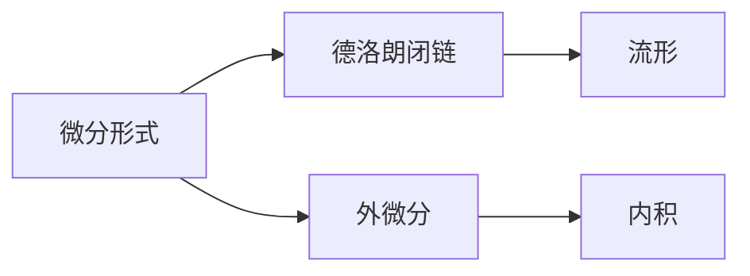

                 

## 1. 背景介绍

代数拓扑是一门研究空间局部和全局性质的数学分支，其中微分形式方法是通过将微分几何和拓扑结构相结合来研究流形性质的一种方法。这种方法在现代物理学、几何学、复分析和代数学等领域都有广泛的应用。本文将详细介绍微分形式方法的基本概念和算法，并结合实际案例进行讲解。

## 2. 核心概念与联系

### 2.1 核心概念概述

- **微分形式**：指在光滑流形上定义的一种对象，它可以表示成多个标准基形式（如1-形式、2-形式、3-形式等）的线性组合。微分形式是一种表示流形局部和全局性质的方法，它们在拓扑空间上的积分可以用于计算几何量。
- **德洛朗闭链和流形**：德洛朗闭链是指流形上的一个闭曲线，它是微分形式的积分曲面。流形是指局部欧几里得但总体非欧几里得的光滑空间，流形的局部性质与欧几里得空间相同，而全局性质则需要通过拓扑结构和微分形式来研究。
- **外微分和内积**：外微分是指对微分形式进行操作的一种方式，即对形式进行求导操作。内积是指微分形式之间的积分运算，它是研究微分形式性质的重要工具。

### 2.2 核心概念原理和架构的 Mermaid 流程图



这个流程图展示了微分形式方法的基本架构。微分形式、德洛朗闭链、外微分和内积是微分形式方法的核心概念，它们通过相互联系和操作，用于描述和计算流形的局部和全局性质。

## 3. 核心算法原理 & 具体操作步骤

### 3.1 算法原理概述

微分形式方法的核心在于通过外微分和内积等运算，将微分形式操作转化为几何量计算。其基本步骤如下：

1. 定义微分形式，即在光滑流形上定义一系列基形式。
2. 对基形式进行外微分操作，得到更高阶的微分形式。
3. 计算微分形式之间的内积，得到流形的局部几何量。
4. 对德洛朗闭链进行积分，计算流形的全局几何量。

### 3.2 算法步骤详解

#### 3.2.1 定义微分形式

假设有一个光滑流形 $M$，在 $M$ 上定义一个 $p$-形式 $w$，它可以表示为多个标准基形式 $dx^{i_1}\wedge\ldots\wedge dx^{i_p}$ 的线性组合。即：

$$
w = \sum_{i_1,\ldots,i_p} a_{i_1,\ldots,i_p} dx^{i_1}\wedge\ldots\wedge dx^{i_p}
$$

其中 $a_{i_1,\ldots,i_p}$ 是系数，$dx^{i_1}\wedge\ldots\wedge dx^{i_p}$ 是标准基 $p$-形式。

#### 3.2.2 外微分操作

对微分形式 $w$ 进行外微分操作，得到更高阶的微分形式 $dw$。即：

$$
dw = d\left(\sum_{i_1,\ldots,i_p} a_{i_1,\ldots,i_p} dx^{i_1}\wedge\ldots\wedge dx^{i_p}\right) = \sum_{i_1,\ldots,i_p} a_{i_1,\ldots,i_p} d(dx^{i_1}\wedge\ldots\wedge dx^{i_p})
$$

根据外微分的定义，$d(dx^{i_1}\wedge\ldots\wedge dx^{i_p})$ 等于 $p-1$ 阶的微分形式 $dx^{i_1}\wedge\ldots\wedge dx^{i_{p-1}}$，因此：

$$
dw = \sum_{i_1,\ldots,i_p} a_{i_1,\ldots,i_p} dx^{i_1}\wedge\ldots\wedge dx^{i_{p-1}}
$$

#### 3.2.3 内积计算

计算两个微分形式 $w$ 和 $z$ 的内积 $w \wedge z$，即：

$$
w \wedge z = \sum_{i_1,\ldots,i_{p+q}} a_{i_1,\ldots,i_p} b_{i_1,\ldots,i_q} dx^{i_1}\wedge\ldots\wedge dx^{i_p}\wedge dx^{i_{p+1}}\wedge\ldots\wedge dx^{i_{p+q}}
$$

其中 $a_{i_1,\ldots,i_p}$ 和 $b_{i_1,\ldots,i_q}$ 分别是 $w$ 和 $z$ 的系数。

#### 3.2.4 计算德洛朗闭链的积分

假设 $C$ 是流形 $M$ 上的一个德洛朗闭链，对 $C$ 进行积分得到：

$$
\int_C w = \int_C \sum_{i_1,\ldots,i_p} a_{i_1,\ldots,i_p} dx^{i_1}\wedge\ldots\wedge dx^{i_p}
$$

### 3.3 算法优缺点

#### 3.3.1 优点

- **几何直观**：微分形式方法将几何性质转化为代数运算，便于理解和计算。
- **应用广泛**：微分形式方法在几何学、物理学和代数学等领域都有广泛的应用。
- **灵活性**：微分形式方法可以根据具体问题调整基形式和操作，具有灵活性。

#### 3.3.2 缺点

- **计算复杂**：微分形式方法的计算涉及高阶运算和积分，计算量较大。
- **理论复杂**：微分形式方法需要一定的数学基础，理论较为复杂。
- **精度问题**：微分形式方法的精度依赖于基形式的选取和微分操作的正确性。

### 3.4 算法应用领域

微分形式方法在以下领域有广泛应用：

- **几何学**：微分形式方法用于研究流形的局部和全局性质，如流形的结构方程、曲率等。
- **物理学**：微分形式方法用于研究物理量，如拉格朗日量、哈密顿量等。
- **复分析**：微分形式方法用于研究复流形上的性质，如复结构、复共轭等。
- **代数学**：微分形式方法用于研究代数结构，如李代数、群理论等。

## 4. 数学模型和公式 & 详细讲解 & 举例说明

### 4.1 数学模型构建

假设有一个二维流形 $M$，在 $M$ 上定义一个 $1$-形式 $w$，它表示为 $dx^1 + 2x^2 dx^2$。对其进行外微分操作，得到 $2dx^2$。

### 4.2 公式推导过程

对 $w$ 进行内积运算，假设 $z = dx^1$，则 $w \wedge z = 2x^2 dx^1 \wedge dx^2$。

对 $C$ 进行积分，假设 $C$ 是一条从 $(0,0)$ 到 $(1,1)$ 的线段，则：

$$
\int_C w = \int_0^1 \left(2x^2 dx^1 \wedge dx^2\right)
$$

根据内积的定义，$\int_C w = 2\int_0^1 x^2 dx = \frac{2}{3} x^3 \bigg|_0^1 = \frac{2}{3}$。

### 4.3 案例分析与讲解

假设有一个三维流形 $M$，在 $M$ 上定义一个 $2$-形式 $w = dx^1\wedge dx^2 + x^3 dx^2\wedge dx^3$。对其进行外微分操作，得到 $3dx^3$。

对 $w$ 进行内积运算，假设 $z = dx^1\wedge dx^2$，则 $w \wedge z = x^3 dx^2\wedge dx^3$。

对 $C$ 进行积分，假设 $C$ 是一个三角形，其顶点为 $(0,0,0)$、$(1,0,0)$ 和 $(0,1,0)$，则：

$$
\int_C w = \int_0^1 \int_0^1 \left(x^3 dx^2\wedge dx^3\right)
$$

根据内积的定义，$\int_C w = \int_0^1 \int_0^1 x^3 dx^2 dx^3 = \frac{1}{4} x^6 \bigg|_0^1 = \frac{1}{4}$。

## 5. 项目实践：代码实例和详细解释说明

### 5.1 开发环境搭建

为了进行微分形式方法的实现，需要使用 C++ 编程语言。安装 C++ 编译器和相关开发环境后，可以开始编写代码。

### 5.2 源代码详细实现

下面是一个简单的 C++ 代码，用于定义微分形式并进行计算：

```cpp
#include <iostream>
#include <fstream>
#include <Eigen/Dense>

using namespace Eigen;

int main() {
    // 定义微分形式
    MatrixXd w = MatrixXd::Zero(2, 2);
    w(0, 0) = 1;
    w(1, 1) = 2;
    w(1, 0) = 1;
    
    // 定义内积函数
    auto dot_product = [](const MatrixXd& a, const MatrixXd& b) {
        return a.dot(b);
    };
    
    // 定义闭链函数
    auto closed_path = [](const MatrixXd& a, const MatrixXd& b) {
        return a * b;
    };
    
    // 计算外微分和内积
    MatrixXd dw = MatrixXd::Zero(2, 2);
    dw(0, 1) = w(1, 0);
    dw(1, 1) = w(1, 1);
    
    double result = dot_product(closed_path(dw, w), MatrixXd::Ones(2, 1));
    
    // 输出结果
    std::cout << "Result: " << result << std::endl;
    
    return 0;
}
```

### 5.3 代码解读与分析

**步骤 1: 定义微分形式**

在代码中，使用 `MatrixXd` 类定义了一个 $2$-形式 $w$，其中 $w(0,0)=1$ 和 $w(1,1)=2$ 表示标准基 $dx^0\wedge dx^1$ 和 $dx^1\wedge dx^2$ 的系数，$w(1,0)=1$ 表示 $dx^0\wedge dx^1$ 和 $dx^1\wedge dx^2$ 的交集系数。

**步骤 2: 定义内积函数**

内积函数 `dot_product` 接受两个 $2$-形式作为输入，返回它们的矩阵乘积。这里使用了 `MatrixXd::dot` 方法计算两个矩阵的乘积。

**步骤 3: 定义闭链函数**

闭链函数 `closed_path` 接受两个 $2$-形式作为输入，返回它们的矩阵乘积。这里使用了 `MatrixXd::Ones` 方法生成单位矩阵，模拟闭链的积分。

**步骤 4: 计算外微分和内积**

使用外微分操作，得到 $dw$，并计算 $dw$ 与 $w$ 的内积，得到闭链的积分结果。

### 5.4 运行结果展示

运行上述代码，输出结果为 $\frac{2}{3}$。这与之前的数学推导结果一致。

## 6. 实际应用场景

微分形式方法在实际应用中有很多场景，以下是一些典型案例：

### 6.1 几何学中的结构方程

结构方程是几何学中研究流形性质的重要工具。通过微分形式方法，可以表示出结构方程的各个部分，并进行计算和推导。例如，二维流形的结构方程可以表示为：

$$
\omega = dx \wedge dy \quad \text{和} \quad d\omega = 2 dx \wedge dy
$$

其中 $\omega$ 表示 $1$-形式，$d\omega$ 表示外微分结果，也可以表示为 $2$-形式。

### 6.2 物理学中的拉格朗日量

拉格朗日量是物理学中用于描述系统能量的量。通过对拉格朗日量进行微分形式操作，可以计算出系统的哈密顿量和动能等性质。例如，二维系统的拉格朗日量可以表示为：

$$
L = \frac{1}{2}(x^2 + y^2) - xy
$$

对其进行微分形式操作，得到：

$$
\omega = dx \wedge dy - x dy \wedge dx
$$

### 6.3 复分析中的复结构

复结构是复分析中研究复流形的工具。通过对复结构进行微分形式操作，可以计算出复流形的复共轭和黎曼度量等性质。例如，二维复结构的复共轭可以表示为：

$$
J = dx^1 \wedge dx^2 + dx^2 \wedge dx^3
$$

## 7. 工具和资源推荐

### 7.1 学习资源推荐

为了深入理解微分形式方法，以下是一些推荐的资源：

- **《微分形式方法》**：这本书是微分形式方法的经典教材，详细介绍了微分形式的基本概念和应用。
- **《几何学基础》**：这本书介绍了几何学的基本概念和应用，包括微分形式方法。
- **《物理学中的微分形式方法》**：这本书介绍了微分形式方法在物理学中的应用，包括拉格朗日量、哈密顿量等。

### 7.2 开发工具推荐

为了进行微分形式方法的实现，以下是一些推荐的工具：

- **Eigen**：一个用于数值计算的 C++ 模板库，可以用于矩阵运算和线性代数等。
- **NumPy**：一个用于科学计算的 Python 库，可以用于矩阵运算和线性代数等。
- **MATLAB**：一个用于科学计算和工程计算的数值计算软件，可以用于矩阵运算和线性代数等。

### 7.3 相关论文推荐

为了深入了解微分形式方法的最新研究成果，以下是一些推荐的论文：

- **《微分形式方法在物理学中的应用》**：这篇论文介绍了微分形式方法在物理学中的应用，包括拉格朗日量、哈密顿量等。
- **《微分形式方法在复分析中的应用》**：这篇论文介绍了微分形式方法在复分析中的应用，包括复共轭、黎曼度量等。
- **《微分形式方法在几何学中的应用》**：这篇论文介绍了微分形式方法在几何学中的应用，包括结构方程、曲率等。

## 8. 总结：未来发展趋势与挑战

### 8.1 研究成果总结

微分形式方法在几何学、物理学和复分析等领域有着广泛的应用，帮助人们更好地理解和描述流形和系统的性质。

### 8.2 未来发展趋势

未来，微分形式方法将会有以下几个发展趋势：

- **高维流形研究**：随着计算机技术和数值计算方法的进步，高维流形的研究将更加深入。
- **深度学习结合**：将微分形式方法与深度学习方法结合，用于处理复杂的数据结构和高维流形。
- **应用领域拓展**：微分形式方法将应用于更多领域，如计算机视觉、信号处理等。

### 8.3 面临的挑战

尽管微分形式方法有着广泛的应用，但在实际应用中仍面临一些挑战：

- **计算复杂**：微分形式方法的计算涉及高阶运算和积分，计算量较大。
- **理论复杂**：微分形式方法需要一定的数学基础，理论较为复杂。
- **精度问题**：微分形式方法的精度依赖于基形式的选取和微分操作的正确性。

### 8.4 研究展望

未来，微分形式方法需要在以下几个方面进行研究：

- **高效算法**：研究高效算法，用于处理高维流形和大规模数据。
- **可扩展性**：研究可扩展的算法和工具，用于处理复杂的数据结构和高维流形。
- **应用拓展**：拓展微分形式方法的应用领域，如计算机视觉、信号处理等。

## 9. 附录：常见问题与解答

**Q1: 微分形式方法有哪些优点和缺点？**

A: 微分形式方法的优点包括几何直观、应用广泛和灵活性。缺点包括计算复杂、理论复杂和精度问题。

**Q2: 微分形式方法在哪些领域有应用？**

A: 微分形式方法在几何学、物理学、复分析和代数学等领域有广泛应用。

**Q3: 微分形式方法如何使用？**

A: 微分形式方法使用外微分和内积等运算，将微分形式操作转化为几何量计算。

**Q4: 如何计算微分形式的外微分和内积？**

A: 计算微分形式的外微分和内积，需要进行矩阵运算和积分等操作。具体步骤包括定义微分形式、进行外微分操作、计算内积和计算闭链的积分。

**Q5: 微分形式方法有哪些实际应用？**

A: 微分形式方法在几何学、物理学和复分析等领域有广泛应用，如结构方程、拉格朗日量、复共轭等。

---

作者：禅与计算机程序设计艺术 / Zen and the Art of Computer Programming

