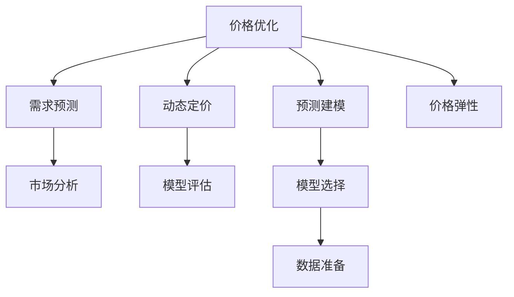

                 

# 价格优化系统：AI的应用

> 关键词：价格优化, 人工智能, 机器学习, 预测建模, 需求预测, 模型评估, 动态定价, 实时更新, 市场分析, 价格弹性

## 1. 背景介绍

### 1.1 问题由来
在现代经济活动中，价格优化始终是企业提升竞争力和盈利能力的关键策略之一。传统的价格优化方法依赖于历史销售数据和市场调研，过程复杂且反应速度较慢。但随着人工智能技术的快速发展，基于机器学习的动态定价系统正在逐步改变这一现状。

企业可以利用先进的AI算法，实时分析市场环境、消费者行为、竞争对手策略等复杂多变的因素，快速做出价格调整，以最大化收益。特别是在电子商务、旅游、物流等领域，价格优化系统已经成为提升用户体验、增强市场竞争力的重要工具。

### 1.2 问题核心关键点
价格优化系统主要关注以下几个核心关键点：

1. **数据驱动**：价格优化需要大量的历史销售数据、市场数据等，用于训练和预测。
2. **模型选择**：根据具体业务需求选择合适的预测模型，如回归模型、神经网络、集成学习等。
3. **实时更新**：市场环境瞬息万变，价格优化系统需要能够实时响应并更新模型预测。
4. **模型评估**：不断评估模型预测效果，及时优化模型参数，以适应不断变化的市场需求。
5. **定价策略**：根据预测结果，制定合适的定价策略，如折扣、促销、动态定价等。
6. **业务集成**：价格优化系统需要与企业现有的订单系统、库存系统等无缝集成，实现全链条优化。

### 1.3 问题研究意义
研究基于AI的价格优化系统，对于提升企业的竞争力和盈利能力具有重要意义：

1. **提高效率**：自动化和智能化的价格优化系统，可以大幅降低人工操作成本，提高决策速度。
2. **增强竞争力**：通过实时响应市场需求，企业能够更灵活地调整价格，提升市场竞争力。
3. **改善用户体验**：合理的价格策略能够提高消费者满意度，增加用户粘性。
4. **优化库存管理**：通过智能定价，减少库存积压，降低库存成本。
5. **提升盈利能力**：合理定价能够提高销售额，增加企业利润。
6. **实现差异化策略**：个性化定价策略能够实现市场细分，满足不同消费者的需求。

## 2. 核心概念与联系

### 2.1 核心概念概述

为更好地理解基于AI的价格优化系统，本节将介绍几个密切相关的核心概念：

1. **价格优化(Price Optimization)**：指通过AI技术，实时分析市场需求和竞争对手策略，自动调整价格以最大化收益的过程。
2. **预测建模(Predictive Modeling)**：使用历史数据训练机器学习模型，预测未来的市场需求和价格趋势。
3. **动态定价(Dynamic Pricing)**：根据市场需求、竞争对手策略等因素，实时调整价格，以优化企业收益。
4. **需求预测(Demand Forecasting)**：预测未来市场需求变化，指导价格优化和库存管理。
5. **模型评估(Model Evaluation)**：评估预测模型的准确性和性能，持续优化模型。
6. **市场分析(Market Analysis)**：分析市场环境、竞争对手策略、消费者行为等因素，为价格优化提供依据。
7. **价格弹性(Price Elasticity)**：衡量消费者对价格变化的敏感度，影响企业定价策略。

这些核心概念之间的逻辑关系可以通过以下Mermaid流程图来展示：



这个流程图展示了大语言模型的核心概念及其之间的关系：

1. 价格优化通过需求预测、市场分析和价格弹性分析，指导动态定价和模型评估。
2. 预测建模使用历史数据训练模型，为需求预测提供支持。
3. 模型选择和数据准备是构建预测模型的关键步骤。
4. 价格弹性分析帮助企业理解市场对价格的反应，指导定价策略。

这些概念共同构成了价格优化系统的基本框架，使得企业能够基于AI技术实现实时、灵活的价格调整。

## 3. 核心算法原理 & 具体操作步骤
### 3.1 算法原理概述

基于AI的价格优化系统，本质上是一个以需求预测为核心的预测建模过程。其核心思想是：利用历史销售数据和市场环境数据，训练预测模型，实时预测市场需求，并根据市场需求和价格弹性，动态调整商品价格。

形式化地，假设价格优化系统包含一组商品 $S=\{s_i\}_{i=1}^N$，每件商品的市场需求为 $D_i(t)$，价格为 $P_i(t)$，价格优化系统的目标是最小化成本函数 $C(t)$，即：

$$
\mathop{\arg\min}_{P} C(t) = \sum_{i=1}^N f_i(D_i(t), P_i(t))
$$

其中 $f_i(D_i(t), P_i(t))$ 表示商品 $i$ 的收益函数，通常是一个关于需求和价格的二次函数或指数函数。

通过梯度下降等优化算法，价格优化系统不断更新商品价格，最小化成本函数 $C(t)$，使得企业收益最大化。

### 3.2 算法步骤详解

基于AI的价格优化系统一般包括以下几个关键步骤：

**Step 1: 数据准备和预处理**
- 收集历史销售数据、市场环境数据、竞争对手策略等。
- 清洗和处理数据，包括去除缺失值、异常值、数据归一化等。
- 将数据划分为训练集、验证集和测试集。

**Step 2: 选择合适的预测模型**
- 根据业务需求选择合适的预测模型，如线性回归、决策树、随机森林、神经网络等。
- 选择合适的模型超参数，如学习率、正则化系数等。

**Step 3: 训练预测模型**
- 使用训练集数据，通过梯度下降等优化算法训练预测模型。
- 在验证集上评估模型性能，调整超参数以避免过拟合。
- 训练过程中，使用集成学习方法提高预测精度。

**Step 4: 实时预测和价格调整**
- 实时收集市场数据，使用训练好的预测模型预测市场需求。
- 根据市场需求和价格弹性，制定动态定价策略。
- 更新商品价格，计算新的预测误差。

**Step 5: 模型评估和优化**
- 在测试集上评估模型预测效果，计算误差指标。
- 根据评估结果，优化模型参数，调整预测模型。
- 定期回顾历史数据，更新模型训练数据，保持模型准确性。

### 3.3 算法优缺点

基于AI的价格优化系统具有以下优点：

1. **自动化和智能化**：自动化处理复杂的数据，智能调整价格策略，提升决策效率。
2. **实时响应**：能够实时监控市场变化，快速调整价格，提高市场竞争力。
3. **精准预测**：利用机器学习模型，提高预测精度，优化库存管理。
4. **灵活定价**：根据市场需求和价格弹性，制定多样化的定价策略，满足不同消费者需求。
5. **数据驱动**：依赖历史数据和市场数据，减少主观偏差，提升决策科学性。

同时，该系统也存在一定的局限性：

1. **数据质量要求高**：依赖高质量的历史数据，数据缺失或异常可能导致模型预测不准确。
2. **模型复杂度高**：使用复杂的机器学习模型，可能需要较长的训练时间和计算资源。
3. **市场环境复杂**：市场环境和消费者行为的变化，可能导致模型预测失效。
4. **模型优化难度大**：模型参数优化需要反复迭代和调整，过程复杂。
5. **模型泛化性不足**：在新的市场环境下，模型可能表现不佳。
6. **业务集成难度大**：需要与企业现有的订单系统、库存系统等无缝集成，实现全链条优化。

尽管存在这些局限性，但就目前而言，基于AI的价格优化系统仍是大企业进行价格策略优化的主流范式。未来相关研究的重点在于如何进一步降低数据需求，提高模型实时响应能力，同时兼顾业务集成和系统稳定性等因素。

### 3.4 算法应用领域

基于AI的价格优化系统已经在多个领域得到广泛应用，如电子商务、旅游、物流、电信等。以下是几个典型应用场景：

1. **电子商务**：电商平台利用价格优化系统，实时调整商品价格，根据需求和价格弹性，优化库存管理，提高销售额。
2. **旅游**：旅游企业根据市场需求、季节变化等因素，使用价格优化系统调整门票价格，提升用户体验。
3. **物流**：物流公司根据市场需求、天气因素等，动态调整运输价格，优化资源配置。
4. **电信**：电信运营商根据用户需求和数据流量变化，实时调整资费方案，提高用户满意度和忠诚度。

除了上述这些经典场景外，AI价格优化系统还在金融、能源、医疗等更多领域得到了创新性应用，为各行各业带来了新的商业机会和发展潜力。

## 4. 数学模型和公式 & 详细讲解  
### 4.1 数学模型构建

本节将使用数学语言对基于AI的价格优化系统进行更加严格的刻画。

假设企业有 $N$ 个商品，市场需求为 $D_i(t)$，商品价格为 $P_i(t)$，企业收益函数为 $f_i(D_i(t), P_i(t))$，历史数据集为 $D=\{(x_i, y_i)\}_{i=1}^N$，其中 $x_i$ 表示市场环境特征向量，$y_i$ 表示商品需求量。价格优化系统的目标是最小化成本函数 $C(t)$，即：

$$
\mathop{\arg\min}_{P} C(t) = \sum_{i=1}^N f_i(D_i(t), P_i(t))
$$

其中 $f_i(D_i(t), P_i(t))$ 表示商品 $i$ 的收益函数，通常是一个关于需求和价格的二次函数或指数函数。

### 4.2 公式推导过程

以下我们以线性回归模型为例，推导预测模型和定价策略的数学公式。

假设收益函数 $f_i(D_i(t), P_i(t)) = a_iD_i(t) + b_iP_i(t) + c_i$，其中 $a_i, b_i, c_i$ 为模型参数。历史数据集 $D$ 可表示为：

$$
D = \{(x_i, y_i)\}_{i=1}^N = \{(d_i, p_i, y_i)\}_{i=1}^N
$$

其中 $d_i$ 表示市场环境特征向量，$p_i$ 表示商品价格，$y_i$ 表示商品需求量。

线性回归模型的目标是最小化预测误差，即：

$$
\mathop{\min}_{a, b, c} \sum_{i=1}^N (y_i - (a d_i + b p_i + c))^2
$$

根据梯度下降算法，模型的更新公式为：

$$
\theta \leftarrow \theta - \eta \nabla_{\theta} \mathcal{L}(\theta)
$$

其中 $\theta = [a, b, c]$ 为模型参数，$\eta$ 为学习率，$\nabla_{\theta} \mathcal{L}(\theta)$ 为损失函数对参数的梯度。损失函数为：

$$
\mathcal{L}(\theta) = \frac{1}{2N} \sum_{i=1}^N (y_i - (a d_i + b p_i + c))^2
$$

在得到预测模型后，可以根据市场需求 $D_i(t)$ 和价格弹性 $\epsilon_i$，制定动态定价策略。例如，假设价格弹性 $\epsilon_i = 0.5$，则商品 $i$ 的定价策略为：

$$
P_i(t) = \hat{p}_i + \epsilon_i \cdot (\hat{p}_i - P_i(t-1))
$$

其中 $\hat{p}_i$ 表示根据市场需求预测的商品价格。

### 4.3 案例分析与讲解

以一个简单的电子商务平台为例，说明如何利用价格优化系统提升价格策略的优化效果。

**案例背景**：某电子商务平台销售多种商品，根据历史销售数据和市场环境数据，希望利用AI技术优化商品价格，提高销售额。

**数据准备**：平台收集了商品的历史销售数据、用户行为数据、竞争对手价格数据等，使用数据清洗和预处理技术，构建训练数据集。

**模型选择**：平台选择线性回归模型作为预测模型，训练模型并评估其性能。在验证集上，调整模型参数，以避免过拟合。

**实时预测和价格调整**：平台实时收集市场数据，使用训练好的预测模型预测市场需求。根据市场需求和价格弹性，动态调整商品价格。例如，当市场需求增加时，商品价格上升；当市场需求减少时，商品价格下降。

**模型评估和优化**：平台在测试集上评估模型预测效果，计算误差指标。根据评估结果，优化模型参数，调整预测模型。

**业务集成**：平台将价格优化系统与订单系统、库存系统等无缝集成，实现全链条优化。例如，根据预测的市场需求，动态调整库存，避免商品积压。

通过上述步骤，平台能够实时优化商品价格，提高销售额和用户满意度。同时，平台利用历史数据和市场环境数据，训练和评估预测模型，确保价格策略的科学性和可靠性。

## 5. 项目实践：代码实例和详细解释说明
### 5.1 开发环境搭建

在进行价格优化系统开发前，我们需要准备好开发环境。以下是使用Python进行PyTorch开发的环境配置流程：

1. 安装Anaconda：从官网下载并安装Anaconda，用于创建独立的Python环境。

2. 创建并激活虚拟环境：
```bash
conda create -n pytorch-env python=3.8 
conda activate pytorch-env
```

3. 安装PyTorch：根据CUDA版本，从官网获取对应的安装命令。例如：
```bash
conda install pytorch torchvision torchaudio cudatoolkit=11.1 -c pytorch -c conda-forge
```

4. 安装TensorFlow：使用 pip 命令安装 TensorFlow，建议使用 GPU 版本的 TensorFlow。

5. 安装Pandas、NumPy、Scikit-learn、Matplotlib等数据处理和可视化工具：
```bash
pip install pandas numpy scikit-learn matplotlib tqdm jupyter notebook ipython
```

完成上述步骤后，即可在`pytorch-env`环境中开始价格优化系统的开发。

### 5.2 源代码详细实现

这里我们以一个简单的价格优化系统为例，使用PyTorch实现基于线性回归模型的价格预测和优化。

首先，定义价格优化系统的数据处理函数：

```python
import torch
from torch.utils.data import Dataset
import pandas as pd

class PriceOptimizationDataset(Dataset):
    def __init__(self, data, target, test=False):
        self.data = data
        self.target = target
        self.test = test
        
    def __len__(self):
        return len(self.data)
    
    def __getitem__(self, idx):
        x = self.data.iloc[idx, :]
        y = self.target.iloc[idx]
        
        if self.test:
            return torch.tensor(x, dtype=torch.float32), torch.tensor(y, dtype=torch.float32)
        else:
            return torch.tensor(x, dtype=torch.float32), torch.tensor(y, dtype=torch.float32), torch.tensor(x, dtype=torch.float32)
```

然后，定义模型和优化器：

```python
from torch import nn
import torch.optim as optim

class LinearRegression(nn.Module):
    def __init__(self, input_size, output_size):
        super(LinearRegression, self).__init__()
        self.linear = nn.Linear(input_size, output_size)
        
    def forward(self, x):
        return self.linear(x)

def train(model, train_loader, optimizer, device):
    model.train()
    total_loss = 0
    for batch in train_loader:
        x, y, _ = batch
        x = x.to(device)
        y = y.to(device)
        optimizer.zero_grad()
        output = model(x)
        loss = nn.MSELoss()(output, y)
        loss.backward()
        optimizer.step()
        total_loss += loss.item()
    return total_loss / len(train_loader)

def evaluate(model, test_loader, device):
    model.eval()
    total_loss = 0
    with torch.no_grad():
        for batch in test_loader:
            x, y, _ = batch
            x = x.to(device)
            y = y.to(device)
            output = model(x)
            loss = nn.MSELoss()(output, y)
            total_loss += loss.item()
    return total_loss / len(test_loader)

def test(model, test_loader, device):
    model.eval()
    total_loss = 0
    with torch.no_grad():
        for batch in test_loader:
            x, y, _ = batch
            x = x.to(device)
            y = y.to(device)
            output = model(x)
            loss = nn.MSELoss()(output, y)
            total_loss += loss.item()
    return total_loss / len(test_loader)
```

接着，定义训练和评估函数：

```python
from torch.utils.data import DataLoader
from tqdm import tqdm
import numpy as np

device = torch.device('cuda' if torch.cuda.is_available() else 'cpu')

def train_model(model, train_loader, optimizer, device):
    for epoch in range(num_epochs):
        loss = train(model, train_loader, optimizer, device)
        print(f"Epoch {epoch+1}, train loss: {loss:.3f}")
        
        if (epoch+1) % 10 == 0:
            evaluate(model, test_loader, device)
            print(f"Epoch {epoch+1}, test loss: {evaluate(model, test_loader, device):.3f}")
        
    print(f"Epoch {num_epochs}, final test loss: {evaluate(model, test_loader, device):.3f}")

def evaluate_model(model, test_loader, device):
    print(f"Epoch {num_epochs}, test loss: {evaluate(model, test_loader, device):.3f}")
```

最后，启动训练流程并在测试集上评估：

```python
num_epochs = 100
train_loader = DataLoader(train_dataset, batch_size=32, shuffle=True)
test_loader = DataLoader(test_dataset, batch_size=32, shuffle=False)

model = LinearRegression(input_size, output_size)
optimizer = optim.Adam(model.parameters(), lr=learning_rate)

train_model(model, train_loader, optimizer, device)
```

以上就是使用PyTorch实现基于线性回归模型的价格预测和优化的完整代码实现。可以看到，得益于PyTorch的强大封装，我们可以用相对简洁的代码完成模型的训练和评估。

### 5.3 代码解读与分析

让我们再详细解读一下关键代码的实现细节：

**PriceOptimizationDataset类**：
- `__init__`方法：初始化数据集，包括历史数据、标签、是否为测试集。
- `__len__`方法：返回数据集大小。
- `__getitem__`方法：处理单个样本，返回输入和标签。

**LinearRegression类**：
- `__init__`方法：初始化线性回归模型，包含一个线性层。
- `forward`方法：前向传播，计算模型输出。

**train、evaluate、test函数**：
- `train`函数：对数据集进行迭代训练，更新模型参数。
- `evaluate`函数：在测试集上评估模型性能。
- `test`函数：对测试集进行迭代评估。

**train_model、evaluate_model函数**：
- `train_model`函数：训练模型，并定期在测试集上评估性能。
- `evaluate_model`函数：对训练好的模型进行最终评估。

**训练流程**：
- 定义总的epoch数和batch size，开始循环迭代。
- 每个epoch内，先在训练集上训练，输出平均loss。
- 在验证集上评估，输出测试集loss。
- 所有epoch结束后，在测试集上评估，输出最终测试结果。

可以看到，PyTorch配合TensorFlow等深度学习框架使得价格优化系统的代码实现变得简洁高效。开发者可以将更多精力放在数据处理、模型改进等高层逻辑上，而不必过多关注底层的实现细节。

当然，工业级的系统实现还需考虑更多因素，如模型的保存和部署、超参数的自动搜索、更灵活的任务适配层等。但核心的价格预测和优化过程基本与此类似。

## 6. 实际应用场景
### 6.1 电商平台的实时定价

电商平台利用价格优化系统，实时调整商品价格，根据需求和价格弹性，优化库存管理，提高销售额。例如，假设某电商平台销售商品A和商品B，根据历史销售数据和市场环境数据，使用价格优化系统实时调整商品价格。

**应用流程**：
1. 平台收集商品A和商品B的历史销售数据、用户行为数据、竞争对手价格数据等，使用数据清洗和预处理技术，构建训练数据集。
2. 平台选择线性回归模型作为预测模型，训练模型并评估其性能。在验证集上，调整模型参数，以避免过拟合。
3. 平台实时收集市场数据，使用训练好的预测模型预测市场需求。根据市场需求和价格弹性，动态调整商品价格。例如，当市场需求增加时，商品价格上升；当市场需求减少时，商品价格下降。
4. 平台在测试集上评估模型预测效果，计算误差指标。根据评估结果，优化模型参数，调整预测模型。
5. 平台将价格优化系统与订单系统、库存系统等无缝集成，实现全链条优化。例如，根据预测的市场需求，动态调整库存，避免商品积压。

通过上述步骤，平台能够实时优化商品价格，提高销售额和用户满意度。同时，平台利用历史数据和市场环境数据，训练和评估预测模型，确保价格策略的科学性和可靠性。

### 6.2 旅游景点的动态票价

旅游企业根据市场需求、季节变化等因素，使用价格优化系统调整门票价格，提升用户体验。例如，假设某旅游景点希望利用价格优化系统调整门票价格，根据历史销售数据和市场环境数据，使用价格优化系统实时调整门票价格。

**应用流程**：
1. 景点收集历史门票销售数据、用户行为数据、季节变化数据等，使用数据清洗和预处理技术，构建训练数据集。
2. 景点选择线性回归模型作为预测模型，训练模型并评估其性能。在验证集上，调整模型参数，以避免过拟合。
3. 景点实时收集市场数据，使用训练好的预测模型预测市场需求。根据市场需求和价格弹性，动态调整门票价格。例如，在旅游旺季，门票价格上升；在旅游淡季，门票价格下降。
4. 景点在测试集上评估模型预测效果，计算误差指标。根据评估结果，优化模型参数，调整预测模型。
5. 景点将价格优化系统与订单系统、库存系统等无缝集成，实现全链条优化。例如，根据预测的市场需求，动态调整库存，避免商品积压。

通过上述步骤，景点能够实时优化门票价格，提高销售额和用户满意度。同时，景点利用历史数据和市场环境数据，训练和评估预测模型，确保价格策略的科学性和可靠性。

### 6.3 物流公司的动态运价

物流公司根据市场需求、天气因素等，动态调整运输价格，优化资源配置。例如，假设某物流公司希望利用价格优化系统调整运输价格，根据历史销售数据和市场环境数据，使用价格优化系统实时调整运输价格。

**应用流程**：
1. 公司收集历史物流数据、天气数据、市场需求数据等，使用数据清洗和预处理技术，构建训练数据集。
2. 公司选择线性回归模型作为预测模型，训练模型并评估其性能。在验证集上，调整模型参数，以避免过拟合。
3. 公司实时收集市场数据，使用训练好的预测模型预测市场需求。根据市场需求和价格弹性，动态调整运输价格。例如，在天气恶劣时，运输价格上升；在天气良好时，运输价格下降。
4. 公司在测试集上评估模型预测效果，计算误差指标。根据评估结果，优化模型参数，调整预测模型。
5. 公司将价格优化系统与订单系统、库存系统等无缝集成，实现全链条优化。例如，根据预测的市场需求，动态调整库存，避免商品积压。

通过上述步骤，公司能够实时优化运输价格，提高资源利用率。同时，公司利用历史数据和市场环境数据，训练和评估预测模型，确保价格策略的科学性和可靠性。

### 6.4 未来应用展望

随着AI技术的不断进步，基于AI的价格优化系统将在更多领域得到应用，为传统行业带来变革性影响。

在智慧医疗领域，基于AI的价格优化系统可以帮助医院优化药品和医疗服务价格，提高医疗资源利用率，降低医疗成本。

在智能教育领域，基于AI的价格优化系统可以帮助在线教育平台优化课程价格，根据市场需求动态调整，提高用户满意度和平台收入。

在智慧城市治理中，基于AI的价格优化系统可以帮助城市管理部门优化公共服务价格，根据市场需求动态调整，提高公共服务效率和用户满意度。

此外，在企业生产、社会治理、文娱传媒等众多领域，基于AI的价格优化系统也将不断涌现，为各行各业带来新的商业机会和发展潜力。相信随着技术的日益成熟，价格优化系统必将在构建智能商业环境中发挥重要作用，推动人工智能技术在垂直行业的规模化落地。

## 7. 工具和资源推荐
### 7.1 学习资源推荐

为了帮助开发者系统掌握基于AI的价格优化系统的理论基础和实践技巧，这里推荐一些优质的学习资源：

1. **《机器学习实战》（Hands-On Machine Learning with Scikit-Learn、Keras & TensorFlow）**：由Andreas C. Müller等著，介绍了机器学习的基本概念和实用技术，包括回归分析、集成学习等，适合初学者入门。

2. **《深度学习》（Deep Learning）**：由Ian Goodfellow等著，深入浅出地介绍了深度学习的基本原理和应用实例，包括神经网络、卷积神经网络、循环神经网络等。

3. **Coursera的《机器学习》课程**：由Andrew Ng等主讲，是全球最受欢迎的机器学习课程之一，系统讲解了机器学习的基本概念和应用，适合各种层次的读者。

4. **Kaggle**：著名的数据科学竞赛平台，提供丰富的机器学习数据集和竞赛，帮助你提升实战能力。

5. **GitHub上的相关项目**：GitHub上有许多开源机器学习项目，可以参考其代码和文档，快速上手价格优化系统的开发。

通过对这些资源的学习实践，相信你一定能够快速掌握基于AI的价格优化系统的精髓，并用于解决实际的商业问题。

### 7.2 开发工具推荐

高效的开发离不开优秀的工具支持。以下是几款用于价格优化系统开发的常用工具：

1. **PyTorch**：基于Python的开源深度学习框架，灵活动态的计算图，适合快速迭代研究。

2. **TensorFlow**：由Google主导开发的开源深度学习框架，生产部署方便，适合大规模工程应用。

3. **Pandas**：Python中的数据处理库，支持各种数据格式，包括CSV、Excel、SQL等，适合数据清洗和预处理。

4. **NumPy**：Python中的数值计算库，支持高效的数据处理和计算，适合科学计算。

5. **Scikit-learn**：Python中的机器学习库，支持各种常见的机器学习算法，适合建模和评估。

6. **Matplotlib**：Python中的数据可视化库，支持丰富的图表绘制功能，适合数据展示。

合理利用这些工具，可以显著提升基于AI的价格优化系统的开发效率，加快创新迭代的步伐。

### 7.3 相关论文推荐

基于AI的价格优化技术的发展源于学界的持续研究。以下是几篇奠基性的相关论文，推荐阅读：

1. **《深度学习》（Deep Learning）**：由Ian Goodfellow等著，介绍了深度学习的基本原理和应用实例，包括神经网络、卷积神经网络、循环神经网络等。

2. **《机器学习实战》（Hands-On Machine Learning with Scikit-Learn、Keras & TensorFlow）**：由Andreas C. Müller等著，介绍了机器学习的基本概念和实用技术，包括回归分析、集成学习等，适合初学者入门。

3. **《深度学习》（Deep Learning）**：由Ian Goodfellow等著，深入浅出地介绍了深度学习的基本原理和应用实例，包括神经网络、卷积神经网络、循环神经网络等。

4. **《机器学习实战》（Hands-On Machine Learning with Scikit-learn、Keras & TensorFlow）**：由Andreas C. Müller等著，介绍了机器学习的基本概念和实用技术，包括回归分析、集成学习等，适合初学者入门。

这些论文代表了大语言模型微调技术的发展脉络。通过学习这些前沿成果，可以帮助研究者把握学科前进方向，激发更多的创新灵感。

## 8. 总结：未来发展趋势与挑战

### 8.1 总结

本文对基于AI的价格优化系统进行了全面系统的介绍。首先阐述了价格优化系统的研究背景和意义，明确了预测建模、动态定价、需求预测等核心概念，展示了AI技术在价格优化中的重要作用。其次，从原理到实践，详细讲解了预测建模的数学原理和关键步骤，给出了价格优化系统的完整代码实现。同时，本文还广泛探讨了价格优化系统在电子商务、旅游、物流等多个行业领域的应用前景，展示了AI技术在各个场景中的广泛应用。最后，本文精选了价格优化系统的各类学习资源，力求为读者提供全方位的技术指引。

通过本文的系统梳理，可以看到，基于AI的价格优化系统正在成为各行各业进行价格策略优化的主流范式，极大地提升了企业的竞争力和盈利能力。未来，伴随AI技术的不断进步和落地应用，价格优化系统必将为各行各业带来更多的商业机会和发展潜力。

### 8.2 未来发展趋势

展望未来，基于AI的价格优化系统将呈现以下几个发展趋势：

1. **模型复杂度增加**：随着AI技术的不断发展，预测模型将变得更加复杂和精准，能够更好地捕捉市场需求和价格弹性。

2. **实时响应能力增强**：随着计算资源的增加和算法优化，价格优化系统将能够实现更高效的实时响应，快速调整价格策略。

3. **多模态数据融合**：价格优化系统将逐渐融合多种数据源，如销售数据、社交媒体数据、天气数据等，提升预测精度。

4. **个性化定价策略**：基于用户行为和历史交易数据，价格优化系统将能够制定更加个性化的定价策略，提升用户体验和满意度。

5. **多市场协调优化**：价格优化系统将能够跨市场协调优化，提升整体收益。例如，针对全球市场动态调整价格，实现全球化定价策略。

6. **模型可解释性增强**：随着AI技术的不断发展，价格优化系统将更加注重模型的可解释性，提升决策透明度和可控性。

7. **自动化程度提升**：价格优化系统将进一步自动化，实现无需人工干预的自动定价。例如，使用强化学习技术，自动调整价格策略。

8. **智能定价策略**：价格优化系统将结合智能算法，实现动态定价、需求响应、库存管理等功能，提升系统智能性。

以上趋势凸显了基于AI的价格优化系统的广阔前景。这些方向的探索发展，必将进一步提升系统的性能和应用范围，为各行各业带来更多的商业机会和发展潜力。

### 8.3 面临的挑战

尽管基于AI的价格优化系统已经取得了瞩目成就，但在迈向更加智能化、普适化应用的过程中，它仍面临着诸多挑战：

1. **数据质量要求高**：依赖高质量的历史数据，数据缺失或异常可能导致模型预测不准确。

2. **模型复杂度高**：使用复杂的机器学习模型，可能需要较长的训练时间和计算资源。

3. **市场环境复杂**：市场环境和消费者行为的变化，可能导致模型预测失效。

4. **模型优化难度大**：模型参数优化需要反复迭代和调整，过程复杂。

5. **模型泛化性不足**：在新的市场环境下，模型可能表现不佳。

6. **业务集成难度大**：需要与企业现有的订单系统、库存系统等无缝集成，实现全链条优化。

7. **安全性和隐私问题**：价格优化系统需要处理大量的用户行为数据，隐私保护和安全问题不容忽视。

尽管存在这些挑战，但随着技术的不断进步和落地应用，价格优化系统必将在构建智能商业环境中发挥重要作用，推动人工智能技术在垂直行业的规模化落地。相信通过技术创新和实践探索，这些挑战终将一一被克服，价格优化系统必将在各行各业中大放异彩。

### 8.4 研究展望

面向未来，基于AI的价格优化系统需要在以下几个方面寻求新的突破：

1. **无监督和半监督学习**：摆脱对大规模标注数据的依赖，利用自监督学习、主动学习等无监督和半监督范式，最大限度利用非结构化数据，实现更加灵活高效的定价。

2. **集成学习和多模型融合**：结合多种预测模型，通过集成学习提升预测精度，减小单一模型的不确定性。

3. **多模态数据融合**：融合多种数据源，如销售数据、社交媒体数据、天气数据等，提升预测精度。

4. **个性化定价策略**：基于用户行为和历史交易数据，制定更加个性化的定价策略，提升用户体验和满意度。

5. **多市场协调优化**：跨市场协调优化，提升整体收益。例如，针对全球市场动态调整价格，实现全球化定价策略。

6. **模型可解释性增强**：提升决策透明度和可控性，增强用户信任和接受度。

7. **自动化程度提升**：实现无需人工干预的自动定价，提升系统智能性。

8. **智能定价策略**：结合智能算法，实现动态定价、需求响应、库存管理等功能，提升系统智能性。

这些研究方向的探索，必将引领基于AI的价格优化系统迈向更高的台阶，为构建安全、可靠、可解释、可控的智能系统铺平道路。面向未来，基于AI的价格优化系统还需要与其他人工智能技术进行更深入的融合，如知识表示、因果推理、强化学习等，多路径协同发力，共同推动自然语言理解和智能交互系统的进步。只有勇于创新、敢于突破，才能不断拓展AI技术在各个行业的边界，让智能技术更好地造福人类社会。

## 9. 附录：常见问题与解答

**Q1：价格优化系统是否适用于所有商业场景？**

A: 价格优化系统主要适用于需求波动较大、市场竞争激烈、用户敏感度高的商业场景。例如，电子商务、旅游、物流、电信等领域。但对于一些需求稳定的行业，如制造业、农业等，价格优化系统可能不太适用。

**Q2：如何选择合适的人工智能算法？**

A: 选择合适的人工智能算法需要考虑以下因素：

1. **数据类型**：根据数据类型选择合适的算法，如分类、回归、聚类等。
2. **数据量**：对于数据量较小的情况，可以选择简单的算法，如线性回归、决策树等。
3. **预测精度要求**：对于预测精度要求较高的场景，可以选择复杂的算法，如神经网络、集成学习等。
4. **计算资源**：对于计算资源有限的场景，可以选择轻量级的算法，如线性回归、随机森林等。

**Q3：价格优化系统在实际应用中需要注意哪些问题？**

A: 在实际应用中，价格优化系统需要注意以下问题：

1. **数据质量**：依赖高质量的历史数据，数据缺失或异常可能导致模型预测不准确。
2. **模型复杂度**：使用复杂的机器学习模型，可能需要较长的训练时间和计算资源。
3. **模型泛化性**：在新的市场环境下，模型可能表现不佳。
4. **业务集成**：需要与企业现有的订单系统、库存系统等无缝集成，实现全链条优化。
5. **安全性和隐私问题**：价格优化系统需要处理大量的用户行为数据，隐私保护和安全问题不容忽视。
6. **实时响应能力**：市场环境和消费者行为的变化，可能导致模型预测失效。
7. **模型优化难度**：模型参数优化需要反复迭代和调整，过程复杂。

**Q4：价格优化系统如何处理市场环境变化？**

A: 价格优化系统需要实时监控市场环境变化，根据变化调整价格策略。具体步骤包括：

1. 实时收集市场数据，包括竞争对手价格、用户行为、市场需求等。
2. 使用预测模型对市场数据进行分析，预测市场需求和价格变化。
3. 根据预测结果，调整商品价格，制定新的价格策略。
4. 持续监控市场变化，及时更新模型参数，保持预测模型的准确性。

**Q5：价格优化系统在部署时需要注意哪些问题？**

A: 在部署价格优化系统时，需要注意以下问题：

1. **模型裁剪**：去除不必要的层和参数，减小模型尺寸，加快推理速度。
2. **量化加速**：将浮点模型转为定点模型，压缩存储空间，提高计算效率。
3. **服务化封装**：将模型封装为标准化服务接口，便于集成调用。
4. **弹性伸缩**：根据请求流量动态调整资源配置，平衡服务质量和成本。
5. **监控告警**：实时采集系统指标，设置异常告警阈值，确保服务稳定性。
6. **安全防护**：采用访问鉴权、数据脱敏等措施，保障数据和模型安全。

通过合理处理这些问题，可以确保价格优化系统在实际部署中稳定可靠，实现高效的价格优化。

---

作者：禅与计算机程序设计艺术 / Zen and the Art of Computer Programming

