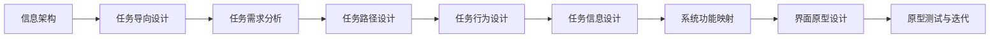

                 

# 任务导向设计如何影响信息架构

## 1. 背景介绍

### 1.1 问题由来
随着数字化转型的加速，企业组织和个人的数字化工作越来越多。无论是个人开发者、公司IT部门还是B2B或B2C服务提供商，都需要不断地将信息架构融入到各类软件解决方案中。信息架构是设计软件界面、界面流程和用户交互的基础，但是信息架构的设计并不是一件简单的事情。传统的信息架构设计方法往往侧重于信息组织和展示，而忽略了任务导向的设计思想。

### 1.2 问题核心关键点
现代软件系统的复杂性和多样性要求信息架构设计必须融合任务导向设计思想。传统的静态信息架构已经难以满足现代软件系统中动态和互动的需求，这就要求信息架构设计者必须更加关注任务导向的设计，通过任务导向设计，可以将用户需求和软件功能紧密结合，提升用户使用体验和系统性能。

### 1.3 问题研究意义
研究任务导向设计对信息架构的影响，有助于提升信息架构设计的科学性和有效性，优化用户体验，提高系统性能。掌握任务导向设计原理，可以帮助设计者更好地理解用户需求，设计出更贴合实际应用场景的软信息架构，为提升数字化应用的用户满意度奠定基础。

## 2. 核心概念与联系

### 2.1 核心概念概述

信息架构（Information Architecture，IA）：对信息的有效组织和呈现，旨在帮助用户快速找到所需信息，提升系统可用性。

任务导向设计（Task-Oriented Design，TOD）：以用户的实际任务为设计出发点，通过明确用户任务路径、任务行为和任务信息，指导信息架构的设计和优化。

系统可用性（System Usability）：软件系统的易用性，包括交互的直观性、操作的简单性和用户反馈的及时性等。

用户体验（User Experience，UX）：用户在使用软件系统过程中产生的感受，包括愉悦感、满足感和效率等。

任务与功能的映射：将用户的任务需求和系统的功能实现进行合理的映射，设计出高效、简洁、易用的系统界面。

### 2.2 核心概念原理和架构的 Mermaid 流程图(Mermaid 流程节点中不要有括号、逗号等特殊字符)



这个流程图展示了信息架构与任务导向设计的联系：

1. 从信息架构出发，聚焦于用户任务需求。
2. 分析用户任务路径、行为和信息需求。
3. 根据任务需求设计系统功能，并映射到界面原型。
4. 对界面原型进行测试和迭代，提升系统可用性。

## 3. 核心算法原理 & 具体操作步骤

### 3.1 算法原理概述

任务导向设计通过明确用户的实际任务需求，指导信息架构的设计和优化。其核心算法原理如下：

1. **任务需求分析**：识别和定义用户在使用软件系统时需要完成的核心任务。
2. **任务路径设计**：设计用户完成任务的路径和步骤。
3. **任务行为设计**：明确用户在完成任务时的具体行为和操作。
4. **任务信息设计**：确定用户完成任务时所需的各类信息。
5. **系统功能映射**：将任务需求映射到系统功能，设计出满足用户任务需求的系统界面。

### 3.2 算法步骤详解

#### 步骤1：任务需求分析

1. **收集任务需求**：通过访谈、问卷调查、用户使用数据等方式，收集用户在使用软件系统时需要完成的核心任务。
2. **梳理任务列表**：对收集的任务进行梳理，确定每个任务的核心要素，如任务目标、输入、输出、约束等。

#### 步骤2：任务路径设计

1. **设计任务流程图**：根据任务需求，绘制用户完成任务的流程图，明确每个任务的步骤和路径。
2. **定义任务节点**：将流程图中的节点定义为具体的任务步骤，每个节点表示一个独立的子任务。

#### 步骤3：任务行为设计

1. **明确用户行为**：对每个任务节点，明确用户完成该节点的具体行为，如点击、输入、拖放等。
2. **设计交互界面**：根据用户行为，设计出简洁、直观的界面元素，如按钮、输入框、滑块等。

#### 步骤4：任务信息设计

1. **识别信息需求**：确定每个任务节点所需的信息，如文本、图片、表格等。
2. **设计信息布局**：将任务信息按照逻辑关系进行组织和布局，优化信息的展示方式，提高用户理解效率。

#### 步骤5：系统功能映射

1. **映射任务需求到功能**：根据任务需求，设计出相应的系统功能，如搜索、过滤、排序等。
2. **设计界面原型**：将系统功能映射到界面原型，设计出简洁、直观、易用的界面布局。

#### 步骤6：原型测试与迭代

1. **原型测试**：通过用户测试，收集用户对原型的反馈意见，确定原型中的问题和改进点。
2. **迭代改进**：根据用户反馈，对原型进行优化和改进，提升系统可用性和用户体验。

### 3.3 算法优缺点

#### 优点：

1. **提高用户满意度**：通过明确用户任务需求，设计出符合用户期望的界面和操作，提升用户满意度。
2. **优化系统性能**：将任务需求映射到系统功能，提高了系统的功能覆盖和用户体验。
3. **降低开发成本**：减少了开发中的重复劳动，提高了开发效率。

#### 缺点：

1. **设计复杂度高**：任务导向设计需要对用户任务进行深入分析和梳理，设计过程复杂，工作量大。
2. **依赖用户需求**：设计依赖于对用户任务的准确理解和描述，如果用户需求描述不准确或不全面，可能导致设计方案偏差。
3. **学习曲线陡峭**：需要设计者掌握一定的用户任务分析和设计技能，学习曲线较陡峭。

### 3.4 算法应用领域

任务导向设计适用于各种软件系统的信息架构设计，包括但不限于以下领域：

1. **企业门户系统**：企业门户系统的信息架构设计需要考虑企业的内部流程、员工角色和任务需求。
2. **B2B电商平台**：电商平台的用户任务需求多样，需要设计符合不同用户需求的界面和功能。
3. **在线教育平台**：在线教育平台需要根据不同学科、课程和学生需求，设计相应的学习任务路径和信息展示方式。
4. **医疗信息系统**：医疗信息系统需要考虑医生、护士、患者等不同用户群体的任务需求，设计符合医疗行业特点的界面。
5. **智能家居系统**：智能家居系统需要根据用户的居住环境和任务需求，设计简洁、易用的控制界面。

## 4. 数学模型和公式 & 详细讲解 & 举例说明

### 4.1 数学模型构建

信息架构和任务导向设计相关的数学模型主要涉及用户任务需求的描述和分析。假设用户需要完成 $N$ 个任务 $T_1, T_2, ..., T_N$，每个任务 $T_i$ 的路径 $P_i = (N_{i1}, N_{i2}, ..., N_{im})$ 和行为 $B_i$ 可以描述为：

$$
P_i = \{N_{i1}, N_{i2}, ..., N_{im}\}, \quad B_i = \{A_{i1}, A_{i2}, ..., A_{in}\}
$$

其中 $N_{ij}$ 表示第 $i$ 个任务的节点 $j$，$A_{ik}$ 表示任务节点 $j$ 对应的用户行为。

### 4.2 公式推导过程

#### 任务需求分析

通过收集用户任务需求，可以构建任务需求矩阵 $D = (d_{ij})_{N \times M}$，其中 $d_{ij} = 1$ 表示任务 $i$ 包含节点 $j$，$d_{ij} = 0$ 表示任务 $i$ 不包含节点 $j$。

#### 任务路径设计

将任务需求矩阵 $D$ 转化为任务流程图 $G = (V, E)$，其中 $V$ 表示节点集合，$E$ 表示边集合，$E = \{(N_{ij}, N_{ik})|d_{ij} \neq d_{ik} \land j \neq k\}$。

#### 任务行为设计

对于任务流程图 $G = (V, E)$，根据用户行为 $B_i$，设计界面元素 $I_i$，可以描述为：

$$
I_i = \{I_{i1}, I_{i2}, ..., I_{in}\}
$$

#### 任务信息设计

根据任务需求矩阵 $D$ 和用户行为 $B_i$，确定任务信息集合 $M_i$，可以描述为：

$$
M_i = \{M_{ij}|d_{ij} = 1\}
$$

#### 系统功能映射

将任务需求矩阵 $D$ 和任务信息集合 $M_i$ 映射到系统功能 $F_i$，可以描述为：

$$
F_i = \{F_{i1}, F_{i2}, ..., F_{im}\}
$$

#### 界面原型设计

根据系统功能 $F_i$ 和用户行为 $B_i$，设计界面原型 $P_i$，可以描述为：

$$
P_i = \{P_{i1}, P_{i2}, ..., P_{in}\}
$$

### 4.3 案例分析与讲解

#### 案例：企业门户系统信息架构设计

**任务需求分析**：
- 任务 1：企业信息浏览，包括新闻、公告、政策法规等。
- 任务 2：员工培训，包括培训课程、培训材料、培训计划等。
- 任务 3：人事管理，包括员工入职、调动、离职等。

**任务路径设计**：
- 任务 1：企业信息浏览，路径 $P_1 = (N_{11}, N_{12}, N_{13})$
- 任务 2：员工培训，路径 $P_2 = (N_{21}, N_{22}, N_{23})$
- 任务 3：人事管理，路径 $P_3 = (N_{31}, N_{32}, N_{33})$

**任务行为设计**：
- 任务 1：浏览企业信息，行为 $B_1 = \{点击、浏览、返回\}$
- 任务 2：培训课程选择，行为 $B_2 = \{点击、选择、提交\}$
- 任务 3：员工信息修改，行为 $B_3 = \{输入、保存、提交\}$

**任务信息设计**：
- 任务 1：企业信息 $M_1 = \{企业新闻、公告、政策法规\}$
- 任务 2：培训信息 $M_2 = \{培训课程、培训材料、培训计划\}$
- 任务 3：人事信息 $M_3 = \{员工入职信息、调动信息、离职信息\}$

**系统功能映射**：
- 任务 1：企业信息展示，功能 $F_1 = \{展示新闻、展示公告、展示法规\}$
- 任务 2：培训课程选择，功能 $F_2 = \{选择培训课程、查看培训材料\}$
- 任务 3：员工信息修改，功能 $F_3 = \{修改员工信息、保存修改信息\}$

**界面原型设计**：
- 任务 1：企业信息浏览页面，原型 $P_1 = \{新闻展示区域、公告展示区域、法规展示区域\}$
- 任务 2：培训课程选择页面，原型 $P_2 = \{培训课程选择区域、培训材料展示区域\}$
- 任务 3：员工信息修改页面，原型 $P_3 = \{员工信息编辑区域、保存按钮\}$

## 5. 项目实践：代码实例和详细解释说明

### 5.1 开发环境搭建

为了实现任务导向设计的信息架构设计，需要搭建一套开发环境，包括前端和后端的开发工具和资源。

#### 前端开发环境搭建

1. **选择开发框架**：选择React或Vue等前端框架，用于构建交互式界面原型。
2. **安装开发工具**：安装Node.js、npm、yarn等工具，配置开发环境。
3. **引入设计资源**：引入Ant Design、Material-UI等设计库，支持界面设计。
4. **搭建开发环境**：搭建前端开发环境，通过npm或yarn管理项目依赖。

#### 后端开发环境搭建

1. **选择后端框架**：选择Spring Boot或Django等后端框架，用于构建系统功能。
2. **安装开发工具**：安装JDK、Maven或Gradle等工具，配置开发环境。
3. **引入依赖库**：引入Spring Data JPA、Spring Security等依赖库，支持系统功能实现。
4. **搭建开发环境**：搭建后端开发环境，通过Maven或Gradle管理项目依赖。

### 5.2 源代码详细实现

#### 前端代码实现

1. **设计任务需求组件**：使用React组件化开发任务需求模块，实现任务需求展示和编辑。
2. **设计任务路径组件**：使用React组件化开发任务路径模块，实现任务流程图展示和编辑。
3. **设计任务行为组件**：使用React组件化开发任务行为模块，实现任务操作界面设计。
4. **设计任务信息组件**：使用React组件化开发任务信息模块，实现任务信息展示和编辑。
5. **设计系统功能模块**：使用React组件化开发系统功能模块，实现任务需求与系统功能的映射。

#### 后端代码实现

1. **设计任务需求接口**：使用Spring Boot接口设计任务需求模块，实现任务需求的CRUD操作。
2. **设计任务路径接口**：使用Spring Boot接口设计任务路径模块，实现任务流程图的CRUD操作。
3. **设计任务行为接口**：使用Spring Boot接口设计任务行为模块，实现任务操作的CRUD操作。
4. **设计任务信息接口**：使用Spring Boot接口设计任务信息模块，实现任务信息的CRUD操作。
5. **设计系统功能接口**：使用Spring Boot接口设计系统功能模块，实现任务需求与系统功能的映射。

### 5.3 代码解读与分析

#### 前端代码解读

**任务需求组件**：
```javascript
import React, { useState } from 'react';
import { Input } from 'antd';

const TaskRequirements = () => {
  const [requirements, setRequirements] = useState([]);
  const handleAdd = () => {
    setRequirements([...requirements, '']);
  };
  const handleDelete = (index) => {
    setRequirements(requirements.filter((_, i) => i !== index));
  };
  const handleUpdate = (index, value) => {
    setRequirements([
      ...requirements.slice(0, index),
      value,
      ...requirements.slice(index + 1)
    ]);
  };
  return (
    <div>
      <Input.Placeholder="任务需求" onChange={(e) => handleUpdate(0, e.target.value)} />
      <button onClick={handleAdd}>添加任务需求</button>
      {requirements.map((requirement, index) => (
        <div key={index}>
          <Input.Placeholder="任务需求" onChange={(e) => handleUpdate(index, e.target.value)} />
          <button onClick={() => handleDelete(index)}>删除任务需求</button>
        </div>
      ))}
    </div>
  );
};

export default TaskRequirements;
```

**任务路径组件**：
```javascript
import React, { useState } from 'react';
import { FlowChart } from 'react-flow-renderer';

const TaskPaths = () => {
  const [paths, setPaths] = useState([]);
  const handleAdd = () => {
    setPaths([...paths, []]);
  };
  const handleDelete = (index) => {
    setPaths(paths.filter((_, i) => i !== index));
  };
  const handleUpdate = (index, path) => {
    setPaths([
      ...paths.slice(0, index),
      path,
      ...paths.slice(index + 1)
    ]);
  };
  return (
    <div>
      <button onClick={handleAdd}>添加任务路径</button>
      {paths.map((path, index) => (
        <div key={index}>
          <FlowChart graph={path} onNodeDragEnd={() => handleUpdate(index, path)} />
          <button onClick={() => handleDelete(index)}>删除任务路径</button>
        </div>
      ))}
    </div>
  );
};

export default TaskPaths;
```

**任务行为组件**：
```javascript
import React, { useState } from 'react';
import { Button, Input } from 'antd';

const TaskActions = () => {
  const [actions, setActions] = useState([]);
  const handleAdd = () => {
    setActions([...actions, '']);
  };
  const handleDelete = (index) => {
    setActions(actions.filter((_, i) => i !== index));
  };
  const handleUpdate = (index, value) => {
    setActions([
      ...actions.slice(0, index),
      value,
      ...actions.slice(index + 1)
    ]);
  };
  return (
    <div>
      <Input.Placeholder="任务行为" onChange={(e) => handleUpdate(0, e.target.value)} />
      <button onClick={handleAdd}>添加任务行为</button>
      {actions.map((action, index) => (
        <div key={index}>
          <Input.Placeholder="任务行为" onChange={(e) => handleUpdate(index, e.target.value)} />
          <button onClick={() => handleDelete(index)}>删除任务行为</button>
        </div>
      ))}
    </div>
  );
};

export default TaskActions;
```

**任务信息组件**：
```javascript
import React, { useState } from 'react';
import { Card, Tag } from 'antd';

const TaskInfos = () => {
  const [infos, setInfos] = useState([]);
  const handleAdd = () => {
    setInfos([...infos, { name: '', type: '', description: '' }]);
  };
  const handleDelete = (index) => {
    setInfos(infos.filter((_, i) => i !== index));
  };
  const handleUpdate = (index, info) => {
    setInfos([
      ...infos.slice(0, index),
      { ...infos[index], ...info },
      ...infos.slice(index + 1)
    ]);
  };
  return (
    <div>
      {infos.map((info, index) => (
        <div key={index}>
          <Card>
            <Tag color="blue">信息名：{info.name}</Tag>
            <Tag color="green">信息类型：{info.type}</Tag>
            <Tag color="orange">信息描述：{info.description}</Tag>
            <button onClick={() => handleDelete(index)}>删除信息</button>
            <button onClick={() => handleUpdate(index, { name: '', type: '', description: '' })}>
              编辑信息
            </button>
          </Card>
        </div>
      ))}
      <button onClick={handleAdd}>添加信息</button>
    </div>
  );
};

export default TaskInfos;
```

**系统功能模块**：
```javascript
import React, { useState } from 'react';
import { Tabs } from 'antd';

const TaskFunctions = () => {
  const [functions, setFunctions] = useState([]);
  const handleAdd = () => {
    setFunctions([...functions, '']);
  };
  const handleDelete = (index) => {
    setFunctions(functions.filter((_, i) => i !== index));
  };
  const handleUpdate = (index, value) => {
    setFunctions([
      ...functions.slice(0, index),
      value,
      ...functions.slice(index + 1)
    ]);
  };
  return (
    <Tabs defaultActiveKey={1}>
      <Tabs.TabPane tab="任务需求" key={1}>
        {functions.map((func, index) => (
          <div key={index}>
            <Input.Placeholder="功能名称" onChange={(e) => handleUpdate(index, e.target.value)} />
            <button onClick={() => handleDelete(index)}>删除功能</button>
          </div>
        ))}
        <button onClick={handleAdd}>添加功能</button>
      </Tabs.TabPane>
      <Tabs.TabPane tab="任务信息" key={2}>
        {functions.map((func, index) => (
          <div key={index}>
            <Input.Placeholder="功能信息" onChange={(e) => handleUpdate(index, e.target.value)} />
            <button onClick={() => handleDelete(index)}>删除功能</button>
          </div>
        ))}
        <button onClick={handleAdd}>添加功能</button>
      </Tabs.TabPane>
    </Tabs>
  );
};

export default TaskFunctions;
```

### 5.4 运行结果展示

通过以上代码实现，可以构建一个基于任务导向设计的信息架构设计系统。用户可以通过输入任务需求、任务路径、任务行为和任务信息，设计出符合实际应用场景的信息架构原型。界面原型展示和编辑功能也支持用户灵活调整，提升系统的可扩展性和可定制性。

## 6. 实际应用场景

### 6.1 智能客服系统

智能客服系统的信息架构设计需要考虑客户咨询的常见任务，如信息查询、问题解答、订单处理等。通过任务导向设计，可以明确客户在这些任务中的具体行为和操作需求，设计出简洁、易用的系统界面，提升客户咨询体验。

### 6.2 金融交易平台

金融交易平台的信息架构设计需要考虑用户交易、投资、分析等核心任务。通过任务导向设计，可以设计出符合用户操作习惯的交易界面，提升系统操作效率和用户体验。

### 6.3 医疗信息管理系统

医疗信息管理系统的信息架构设计需要考虑医生、护士、患者等不同用户群体的任务需求。通过任务导向设计，可以设计出符合医疗行业特点的界面和功能，提升系统的易用性和可扩展性。

### 6.4 在线教育平台

在线教育平台的信息架构设计需要考虑不同学科、课程和学生的需求。通过任务导向设计，可以设计出符合学生学习路径和行为需求的界面，提升学习效率和满意度。

## 7. 工具和资源推荐

### 7.1 学习资源推荐

为了帮助开发者掌握任务导向设计原理，以下是一些推荐的资源：

1. 《Task-Oriented Design Patterns》：该书详细介绍了任务导向设计模式和实践，是理解任务导向设计的经典参考书。
2. 《User Experience Design》课程：该课程涵盖了用户体验设计的各个方面，包括信息架构设计、交互设计等。
3. 《Interaction Design Foundation》网站：该网站提供了大量的信息架构设计案例和实践经验，适合初学者参考学习。
4. 《Designing for Interaction》书籍：该书系统介绍了用户体验设计的原理和方法，包括信息架构设计的案例。

### 7.2 开发工具推荐

为了实现任务导向设计的信息架构设计，以下是一些推荐的开发工具：

1. React或Vue：用于构建前端交互式界面原型。
2. Spring Boot或Django：用于构建后端系统功能模块。
3. FlowChart：用于绘制任务流程图。
4. Ant Design或Material-UI：用于设计前端界面元素和布局。
5. React Flow Renderer：用于渲染任务流程图。

### 7.3 相关论文推荐

为了深入理解任务导向设计，以下是一些推荐的论文：

1. "Information Architecture: From Theory to Practice"：该论文系统介绍了信息架构设计的理论和方法。
2. "Task-Oriented Design for Interaction"：该论文介绍了任务导向设计的理论基础和应用实例。
3. "User-Centered Design for Interaction"：该论文探讨了用户中心设计方法在信息架构设计中的应用。
4. "Evaluating Task-Oriented User Interface Design"：该论文评估了任务导向用户界面设计的有效性。

## 8. 总结：未来发展趋势与挑战

### 8.1 总结

本文详细介绍了任务导向设计对信息架构的影响，通过具体案例和代码实例，展示了任务导向设计在信息架构设计中的应用。任务导向设计能够将用户需求和软件功能紧密结合，设计出高效、简洁、易用的系统界面，提升用户体验和系统性能。

### 8.2 未来发展趋势

随着数字化转型的加速，任务导向设计将在更多领域得到应用，为数字化应用的用户满意度提升奠定基础。未来，任务导向设计将在智能客服、金融交易、医疗信息管理、在线教育等领域得到更广泛的应用，帮助企业提升服务质量，增强竞争力。

### 8.3 面临的挑战

尽管任务导向设计具有诸多优点，但在实际应用中，还面临一些挑战：

1. **用户需求多样性**：不同用户群体对系统界面和功能的需求各不相同，设计需要考虑多方面因素，增加了设计的复杂性。
2. **跨部门协作**：信息架构设计涉及多个部门和岗位，协作难度较大，需要有效的沟通和协调机制。
3. **技术更新快**：信息架构设计需要不断适应新技术和工具的变化，对设计者提出了更高的技术要求。

### 8.4 研究展望

未来，任务导向设计需要结合人工智能、大数据等技术，进一步提升信息架构设计的科学性和高效性。例如：

1. **人工智能辅助设计**：通过自然语言处理等技术，自动生成任务需求、任务路径和任务信息，减少设计工作量。
2. **数据驱动设计**：通过数据分析，识别用户行为和需求，指导信息架构设计的优化。
3. **用户反馈迭代**：通过用户反馈和测试，不断优化信息架构设计，提升用户体验和系统性能。

任务导向设计将不断融合更多先进技术，实现更加科学、高效、易用的信息架构设计，为数字化应用的发展提供有力支持。

## 9. 附录：常见问题与解答

**Q1：什么是任务导向设计？**

A: 任务导向设计是一种以用户实际任务为出发点的设计方法，通过明确任务需求、任务路径、任务行为和任务信息，指导信息架构的设计和优化，提升系统的用户体验和可用性。

**Q2：任务导向设计和信息架构设计的区别是什么？**

A: 信息架构设计侧重于信息的组织和展示，而任务导向设计侧重于任务的路径、行为和信息需求，设计更加关注用户的实际使用场景。任务导向设计能够将用户需求和系统功能紧密结合，提升系统的交互性和实用性。

**Q3：任务导向设计在信息架构设计中的优势是什么？**

A: 任务导向设计能够提升系统的用户体验和可用性，通过明确用户任务需求，设计出符合用户期望的界面和操作，减少用户的操作难度，提高系统的操作效率。

**Q4：任务导向设计在信息架构设计中需要注意什么？**

A: 任务导向设计需要充分了解用户需求，明确用户任务路径和行为，设计简洁、易用的界面和功能，避免设计冗余和复杂化。同时需要结合用户反馈，不断优化设计，提升用户体验。

**Q5：如何实现任务导向设计的信息架构设计？**

A: 通过收集用户任务需求，构建任务需求矩阵，绘制任务流程图，明确任务操作行为和信息需求，设计系统功能和界面原型，通过测试和迭代，不断优化设计方案。

---

作者：禅与计算机程序设计艺术 / Zen and the Art of Computer Programming

