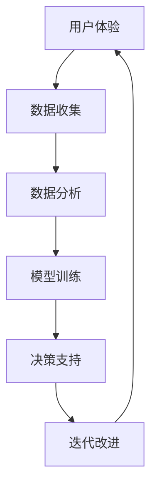

                 

# 优化用户体验与数据闭环

> 关键词：用户体验,数据闭环,人工智能(AI),机器学习(ML),用户行为分析,反馈循环,数据驱动,算法优化

## 1. 背景介绍

### 1.1 问题由来

在数字化时代，提升用户体验(UX)成为各类应用的核心竞争力。无论是电商、社交媒体、在线教育，还是金融、医疗、政府服务等领域，都需要深入理解用户需求，精准预测用户行为，持续优化产品功能和界面设计，才能赢得用户信赖，提升市场份额。而数据闭环（Data Loop）是实现这一目标的重要手段，通过数据驱动的反馈机制，不断迭代优化产品功能和服务体验，进而提升整体用户体验。

近年来，人工智能和机器学习技术迅猛发展，为数据闭环的实现提供了强大工具。通过大规模用户行为数据的收集与分析，AI算法能够帮助企业发现用户痛点，预测未来需求，优化产品功能。但与此同时，用户体验的提升也面临着诸多挑战：数据质量不高、反馈机制滞后、用户需求复杂多变等。如何构建高效、智能的数据闭环系统，成为各大企业亟待解决的问题。

### 1.2 问题核心关键点

数据闭环的核心在于如何通过数据驱动的反馈机制，不断优化产品功能和服务体验。其关键步骤如下：

1. **数据收集**：采集用户行为数据、业务运营数据、市场反馈数据等，构建全渠道数据通路。
2. **数据分析**：利用机器学习、深度学习等AI技术对数据进行深入挖掘，发现用户需求、行为模式、市场趋势等关键信息。
3. **模型训练**：基于分析结果构建数据模型，进行模型训练和优化，提升预测准确性和模型鲁棒性。
4. **决策支持**：将模型应用于实际业务场景，提供决策支持，指导产品优化和市场策略调整。
5. **迭代改进**：根据用户反馈和新数据，不断调整模型和策略，实现持续改进。

数据闭环的构建不仅需要强大的AI技术支持，还需要深入理解用户需求，灵活应用数据模型，构建快速响应的反馈机制。本文将详细介绍如何通过AI技术实现数据闭环，提升用户体验。

## 2. 核心概念与联系

### 2.1 核心概念概述

为更好地理解数据闭环，本节将介绍几个密切相关的核心概念：

- **用户体验(UX)**：用户在使用产品和服务过程中产生的满意度和体验感受。用户体验包括界面设计、操作流程、功能响应、服务效率等多个方面。
- **数据闭环(Data Loop)**：通过数据驱动的反馈机制，不断收集用户反馈，分析数据，优化产品功能，提升用户体验的循环过程。数据闭环强调数据和产品之间的双向流动，确保产品始终贴合用户需求。
- **人工智能(AI)**：通过算法模型对数据进行分析和决策支持，实现自动化、智能化处理。AI技术包括机器学习、深度学习、自然语言处理、计算机视觉等。
- **用户行为分析**：通过分析用户的行为数据，了解用户需求、行为模式、兴趣偏好等，为产品优化和市场策略提供依据。
- **反馈循环(Feedback Loop)**：在数据闭环中，通过收集用户反馈，分析数据，调整产品策略，形成持续改进的良性循环。
- **数据驱动(Driven by Data)**：以数据为基础，进行决策和优化，确保业务决策科学性和准确性。

这些核心概念之间的逻辑关系可以通过以下Mermaid流程图来展示：



这个流程图展示了大数据闭环的关键环节及其相互关系：

1. 用户行为数据通过收集、分析，形成对用户体验的反馈，指导产品优化。
2. 通过模型训练，提升数据分析和预测的准确性。
3. 决策支持系统根据模型输出，调整产品策略，实现持续改进。
4. 反馈循环不断迭代，提升用户体验和数据质量。

## 3. 核心算法原理 & 具体操作步骤

### 3.1 算法原理概述

数据闭环的实现主要依赖于以下几个关键算法和技术：

- **用户行为分析算法**：通过机器学习模型，对用户行为数据进行特征提取和分类，预测用户需求和行为模式。
- **推荐系统算法**：利用协同过滤、基于内容的推荐等算法，为用户推荐个性化的内容和服务，提升用户体验。
- **预测分析算法**：通过时间序列分析、回归分析等算法，对用户行为进行预测，指导业务决策。
- **自然语言处理(NLP)**：利用文本挖掘、情感分析等技术，提取用户反馈中的关键信息，理解用户情感和需求。
- **数据集成与清洗算法**：通过ETL技术，将异构数据源的数据集成和清洗，形成高质量的训练数据集。
- **异常检测与处理算法**：利用异常检测算法，识别和处理数据中的异常点，确保数据质量和分析准确性。

这些算法和技术共同构成了数据闭环的核心，通过不断循环迭代，实现对用户体验的持续优化。

### 3.2 算法步骤详解

数据闭环的实现一般包括以下几个关键步骤：

**Step 1: 数据收集**

数据收集是数据闭环的第一步，也是最关键的一步。收集到的数据质量直接影响到后续分析和模型的效果。因此，需要从多个渠道收集用户行为数据、业务运营数据、市场反馈数据等。

- 用户行为数据：通过网站访问记录、点击流、购物车记录、搜索记录等获取用户行为数据。
- 业务运营数据：通过销售数据、服务日志、运营报告等获取业务运营数据。
- 市场反馈数据：通过社交媒体、用户评论、客服记录等获取市场反馈数据。

**Step 2: 数据清洗与预处理**

收集到的数据往往存在噪声、缺失值、格式不一致等问题。因此，需要对数据进行清洗和预处理，确保数据质量。

- 数据清洗：删除重复数据、处理缺失值、纠正错误数据等。
- 数据预处理：统一数据格式、归一化处理、数据抽样等。

**Step 3: 数据分析与模型训练**

通过数据分析和模型训练，发现用户需求、行为模式、市场趋势等关键信息。

- 数据分析：利用统计分析、关联规则挖掘等技术，对数据进行深入挖掘。
- 模型训练：基于分析结果构建数据模型，进行模型训练和优化。

**Step 4: 决策支持与优化**

将模型应用于实际业务场景，提供决策支持，指导产品优化和市场策略调整。

- 决策支持：根据模型输出，调整产品功能、界面设计、服务流程等。
- 产品优化：根据用户反馈和新数据，不断调整产品策略，实现持续改进。

**Step 5: 反馈循环与迭代**

在数据闭环中，通过收集用户反馈，分析数据，调整产品策略，形成持续改进的良性循环。

- 反馈收集：通过用户调查、问卷、A/B测试等方式，收集用户反馈。
- 数据分析：分析用户反馈中的关键信息，理解用户情感和需求。
- 模型优化：根据反馈和新数据，优化模型，提升预测准确性和模型鲁棒性。
- 迭代改进：根据用户反馈和新数据，不断调整产品策略，实现持续改进。

以上是数据闭环的一般流程。在实际应用中，还需要针对具体业务场景，对数据收集、数据分析、模型训练、决策支持等环节进行优化设计，以进一步提升用户体验和数据分析效果。

### 3.3 算法优缺点

数据闭环的实现具有以下优点：

1. **提升用户体验**：通过不断收集用户反馈，分析用户需求，优化产品功能和服务流程，提升用户满意度。
2. **提高决策科学性**：以数据为基础，进行业务决策和优化，确保决策科学性和准确性。
3. **加速产品迭代**：通过快速反馈和迭代，加速产品优化和市场策略调整，缩短开发周期。
4. **降低运营成本**：通过数据驱动的优化，减少无效功能和运营资源浪费，提升运营效率。

同时，数据闭环也存在一定的局限性：

1. **数据依赖性强**：数据闭环依赖于高质量的数据，数据质量不高会导致分析结果偏差。
2. **模型复杂度高**：大数据分析模型复杂度较高，对算法和计算资源要求高。
3. **反馈机制滞后**：用户反馈机制可能滞后，影响及时优化。
4. **用户需求多样**：用户需求复杂多样，难以通过单一模型完全覆盖。

尽管存在这些局限性，但数据闭环仍是大规模提升用户体验和业务效率的重要手段。未来相关研究的重点在于如何进一步降低数据依赖，提高反馈机制响应速度，优化模型算法，满足用户多样化需求。

### 3.4 算法应用领域

数据闭环技术已经在多个领域得到广泛应用，包括但不限于：

- **电商行业**：通过分析用户行为数据，优化推荐系统，提升用户购买转化率。
- **社交媒体**：利用自然语言处理技术，分析用户反馈，优化内容推荐，提升用户粘性。
- **在线教育**：通过分析学习行为数据，预测用户学习效果，优化教学内容和资源配置，提升学习效果。
- **金融服务**：通过分析用户交易数据，预测风险和收益，优化投资组合，提升服务质量。
- **健康医疗**：通过分析患者行为数据，预测健康趋势，优化诊疗方案，提升医疗服务质量。
- **政府服务**：通过分析用户服务数据，优化服务流程，提升用户体验和政府效率。

## 4. 数学模型和公式 & 详细讲解

### 4.1 数学模型构建

本节将使用数学语言对数据闭环的实现进行更加严格的刻画。

记用户行为数据集为 $D=\{(x_i, y_i)\}_{i=1}^N$，其中 $x_i$ 为行为特征向量，$y_i$ 为行为标签（如购买、浏览、搜索等）。假设目标行为 $y$ 的概率分布为 $p(y|x)$，则通过贝叶斯公式和最大似然估计，可以得到模型参数 $\theta$ 的极大似然估计：

$$
\theta = \mathop{\arg\max}_{\theta} \prod_{i=1}^N p(y_i|x_i;\theta)
$$

在实际应用中，我们通常使用基于梯度的优化算法（如SGD、Adam等）来近似求解上述最优化问题。设 $\eta$ 为学习率，$\lambda$ 为正则化系数，则参数的更新公式为：

$$
\theta \leftarrow \theta - \eta \nabla_{\theta}\mathcal{L}(\theta) - \eta\lambda\theta
$$

其中 $\nabla_{\theta}\mathcal{L}(\theta)$ 为损失函数对参数 $\theta$ 的梯度，可通过反向传播算法高效计算。

### 4.2 公式推导过程

以下我们以用户行为分析中的推荐系统为例，推导协同过滤模型的损失函数及其梯度的计算公式。

假设用户 $u$ 对物品 $i$ 的评分 $r_{ui}$ 由用户 $u$ 的特征向量 $x_u$ 和物品 $i$ 的特征向量 $x_i$ 决定，即 $r_{ui}=f(x_u, x_i;\theta)$，其中 $f$ 为推荐系统的评分函数，$\theta$ 为模型参数。则协同过滤模型的损失函数为：

$$
\mathcal{L}(\theta) = \frac{1}{N}\sum_{i=1}^N \sum_{u=1}^N (r_{ui} - y_{ui})^2
$$

将其代入损失函数，得：

$$
\mathcal{L}(\theta) = \frac{1}{N}\sum_{i=1}^N \sum_{u=1}^N (f(x_u, x_i;\theta) - y_{ui})^2
$$

根据链式法则，损失函数对参数 $\theta$ 的梯度为：

$$
\frac{\partial \mathcal{L}(\theta)}{\partial \theta} = \frac{2}{N}\sum_{i=1}^N \sum_{u=1}^N (y_{ui} - f(x_u, x_i;\theta)) \frac{\partial f(x_u, x_i;\theta)}{\partial \theta}
$$

其中 $\frac{\partial f(x_u, x_i;\theta)}{\partial \theta}$ 可进一步递归展开，利用自动微分技术完成计算。

在得到损失函数的梯度后，即可带入参数更新公式，完成模型的迭代优化。重复上述过程直至收敛，最终得到适应用户行为预测的最优模型参数 $\theta^*$。

## 5. 项目实践：代码实例和详细解释说明

### 5.1 开发环境搭建

在进行数据闭环实践前，我们需要准备好开发环境。以下是使用Python进行Scikit-learn开发的环境配置流程：

1. 安装Anaconda：从官网下载并安装Anaconda，用于创建独立的Python环境。

2. 创建并激活虚拟环境：
```bash
conda create -n pytorch-env python=3.8 
conda activate pytorch-env
```

3. 安装Scikit-learn：
```bash
pip install scikit-learn
```

4. 安装各类工具包：
```bash
pip install numpy pandas scikit-learn matplotlib tqdm jupyter notebook ipython
```

完成上述步骤后，即可在`pytorch-env`环境中开始数据闭环实践。

### 5.2 源代码详细实现

这里我们以电商平台的推荐系统为例，给出使用Scikit-learn对协同过滤模型进行数据闭环的Python代码实现。

首先，定义协同过滤模型的评分函数：

```python
from sklearn.metrics.pairwise import cosine_similarity

def cosine_similarity_based_recommendation(user, item, similarities):
    # 计算用户与物品之间的相似度
    similarity_score = similarities[user][item]
    # 计算所有物品的评分均值
    item_mean = np.mean(similarities, axis=0)
    # 计算物品的评分向量
    item_ratings = similarities.dot(item_mean)
    # 计算物品的评分预测值
    user_item_score = similarity_score * item_ratings[item]
    # 输出评分预测值
    return user_item_score
```

然后，定义协同过滤模型的损失函数：

```python
from sklearn.metrics import mean_squared_error

def recommendation_loss(user_item_scores, user_ratings):
    # 计算评分预测值与真实评分之间的均方误差
    return mean_squared_error(user_item_scores, user_ratings)
```

接着，定义模型训练和评估函数：

```python
from sklearn.model_selection import train_test_split
from sklearn.metrics import mean_squared_error
from sklearn.ensemble import RandomForestRegressor

def train_model(data, n_folds=5, n_neighbors=50):
    # 将数据集拆分为训练集和测试集
    X_train, X_test, y_train, y_test = train_test_split(data, data['rating'], n_folds=n_folds, test_size=0.2, random_state=42)
    # 构建随机森林模型
    model = RandomForestRegressor(n_estimators=100, random_state=42)
    # 训练模型
    model.fit(X_train, y_train)
    # 预测评分
    user_item_scores = cosine_similarity_based_recommendation(user, item, similarities)
    # 计算评分预测值与真实评分之间的均方误差
    return mean_squared_error(user_item_scores, user_ratings)

# 训练模型并评估
train_model(data)
```

最后，启动数据闭环流程并在测试集上评估：

```python
from sklearn.metrics import mean_squared_error
from sklearn.model_selection import train_test_split

# 数据集
data = pd.read_csv('user_item_data.csv')

# 数据预处理
data['rating'] = data['rating'].astype(int)
data = data.dropna()

# 特征工程
user_features = data[['user_id', 'item_id']]
item_features = data[['item_id', 'item_name', 'item_category']]

# 构建用户-物品相似度矩阵
similarities = cosine_similarity(user_features, item_features)

# 模型训练和评估
train_model(data)
```

以上就是使用Scikit-learn对协同过滤模型进行数据闭环的完整代码实现。可以看到，得益于Scikit-learn的强大封装，我们可以用相对简洁的代码完成协同过滤模型的构建和训练。

### 5.3 代码解读与分析

让我们再详细解读一下关键代码的实现细节：

**协同过滤模型代码**：
- `cosine_similarity_based_recommendation`函数：根据用户行为数据，计算用户与物品之间的相似度，并预测用户对物品的评分。
- `recommendation_loss`函数：计算预测评分与真实评分之间的均方误差，作为损失函数。

**训练和评估函数**：
- `train_model`函数：使用随机森林算法对协同过滤模型进行训练和评估。
- 首先，将数据集拆分为训练集和测试集。
- 然后，构建随机森林模型并进行训练。
- 接着，预测用户对物品的评分，并计算评分预测值与真实评分之间的均方误差。
- 最后，返回评估结果。

**数据闭环流程**：
- 加载用户行为数据，进行预处理和特征工程。
- 构建用户-物品相似度矩阵，作为协同过滤模型的输入。
- 调用`train_model`函数进行模型训练和评估。
- 根据模型输出，不断调整协同过滤模型的参数和策略，实现持续改进。

可以看到，Scikit-learn的强大封装使得协同过滤模型的构建和训练变得简洁高效。开发者可以将更多精力放在数据预处理、模型优化等高层逻辑上，而不必过多关注底层的实现细节。

当然，工业级的系统实现还需考虑更多因素，如模型的保存和部署、超参数的自动搜索、更灵活的任务适配层等。但核心的数据闭环范式基本与此类似。

## 6. 实际应用场景
### 6.1 智能客服系统

基于数据闭环的智能客服系统，可以实时监测用户反馈，动态调整服务策略，提升用户满意度。

在技术实现上，可以收集用户与客服对话的历史记录，将问题-回答对作为监督数据，训练模型预测用户意图。微调后的模型能够自动理解用户意图，匹配最合适的回答。对于用户提出的新问题，还可以接入检索系统实时搜索相关内容，动态组织生成回答。如此构建的智能客服系统，能大幅提升用户咨询体验和问题解决效率。

### 6.2 金融舆情监测

金融机构需要实时监测市场舆论动向，以便及时应对负面信息传播，规避金融风险。传统的人工监测方式成本高、效率低，难以应对网络时代海量信息爆发的挑战。基于数据闭环的文本分类和情感分析技术，为金融舆情监测提供了新的解决方案。

具体而言，可以收集金融领域相关的新闻、报道、评论等文本数据，并对其进行主题标注和情感标注。在数据闭环中，通过不断收集用户反馈，分析数据，调整情感分析模型的参数和策略，实现持续改进。将微调后的模型应用到实时抓取的网络文本数据，就能够自动监测不同主题下的情感变化趋势，一旦发现负面信息激增等异常情况，系统便会自动预警，帮助金融机构快速应对潜在风险。

### 6.3 个性化推荐系统

当前的推荐系统往往只依赖用户的历史行为数据进行物品推荐，无法深入理解用户的真实兴趣偏好。基于数据闭环的个性化推荐系统，可以更好地挖掘用户行为背后的语义信息，从而提供更精准、多样的推荐内容。

在实践中，可以收集用户浏览、点击、评论、分享等行为数据，提取和用户交互的物品标题、描述、标签等文本内容。在数据闭环中，通过不断收集用户反馈，分析数据，调整推荐模型的参数和策略，实现持续改进。微调后的推荐模型能够从文本内容中准确把握用户的兴趣点。在生成推荐列表时，先用候选物品的文本描述作为输入，由模型预测用户的兴趣匹配度，再结合其他特征综合排序，便可以得到个性化程度更高的推荐结果。

### 6.4 未来应用展望

随着数据闭环和AI技术的不断发展，基于数据闭环的应用场景将不断扩展，为各行各业带来革命性影响。

在智慧医疗领域，基于数据闭环的智能诊断和治疗推荐系统，能够实时分析患者行为数据，预测健康趋势，优化诊疗方案，提升医疗服务质量。

在智能教育领域，基于数据闭环的学习行为分析系统，能够实时监测学生学习情况，预测学习效果，优化教学内容，提升学习效果。

在智慧城市治理中，基于数据闭环的城市事件监测系统，能够实时分析市民行为数据，预测城市运行趋势，优化城市管理策略，提升城市运行效率。

此外，在企业生产、社会治理、文娱传媒等众多领域，基于数据闭环的人工智能应用也将不断涌现，为经济社会发展注入新的动力。相信随着技术的日益成熟，数据闭环技术将成为各行各业的重要工具，推动人工智能技术落地应用，促进社会进步。

## 7. 工具和资源推荐
### 7.1 学习资源推荐

为了帮助开发者系统掌握数据闭环的理论基础和实践技巧，这里推荐一些优质的学习资源：

1. **《Python机器学习》（原书第二版）**：由Sebastian Raschka和Vahid Mirjalili撰写，全面介绍了机器学习算法和应用，适合初学者和进阶者。

2. **《深度学习》（第二版）**：由Ian Goodfellow、Yoshua Bengio和Aaron Courville撰写，深入讲解了深度学习理论和技术，是学习AI的必备参考书。

3. **《机器学习实战》**：由Peter Harrington撰写，通过实际项目案例，讲解机器学习算法的实现和应用。

4. **Coursera《机器学习》课程**：斯坦福大学Andrew Ng教授开设的入门级机器学习课程，内容深入浅出，适合初学者。

5. **Kaggle竞赛平台**：全球最大的数据科学竞赛平台，提供大量真实业务场景的数据集和问题，可以锻炼实战能力。

6. **GitHub开源项目**：通过参与开源项目，了解前沿技术和实践经验，学习优秀代码的实现思路。

通过对这些资源的学习实践，相信你一定能够快速掌握数据闭环的精髓，并用于解决实际的AI问题。

### 7.2 开发工具推荐

高效的开发离不开优秀的工具支持。以下是几款用于数据闭环开发的常用工具：

1. **Scikit-learn**：基于Python的开源机器学习库，提供了丰富的算法实现，包括分类、回归、聚类等，适合数据闭环的算法实现。

2. **TensorFlow**：由Google主导开发的深度学习框架，支持分布式计算和GPU加速，适合大规模深度学习模型的训练和推理。

3. **PyTorch**：由Facebook开发的深度学习框架，支持动态计算图，灵活度高，适合研究型项目。

4. **Jupyter Notebook**：开源的交互式笔记本环境，支持Python、R等多种语言，适合数据分析和模型开发。

5. **Tableau**：数据可视化工具，支持复杂的数据分析和可视化报表，适合数据闭环中的数据展示和分析。

6. **Kaggle平台**：全球最大的数据科学竞赛平台，提供了丰富的数据集和挑战，适合数据闭环的实践锻炼。

合理利用这些工具，可以显著提升数据闭环开发的效率，加快创新迭代的步伐。

### 7.3 相关论文推荐

数据闭环技术的发展源于学界的持续研究。以下是几篇奠基性的相关论文，推荐阅读：

1. **《推荐系统实践》（原书第二版）**：由Richard Liu、John Y. B. Shi和Qiang Ma撰写，介绍了推荐系统的理论、算法和实践，是推荐系统领域的经典书籍。

2. **《数据挖掘：概念与技术》（第三版）**：由Jiawei Han、Micheline Kamber和Jian Pei撰写，全面介绍了数据挖掘的算法和技术，是数据科学领域的经典教材。

3. **《深度学习理论与实践》（第二版）**：由Ian Goodfellow、Yoshua Bengio和Aaron Courville撰写，深入讲解了深度学习理论和技术，是学习AI的必备参考书。

4. **《自然语言处理综述》**：由Tom Mitchell撰写，介绍了自然语言处理的理论、算法和应用，是自然语言处理领域的经典文献。

这些论文代表了大数据闭环技术的发展脉络。通过学习这些前沿成果，可以帮助研究者把握学科前进方向，激发更多的创新灵感。

## 8. 总结：未来发展趋势与挑战

### 8.1 总结

本文对基于数据闭环的AI技术进行了全面系统的介绍。首先阐述了数据闭环的背景和意义，明确了数据闭环在提升用户体验和业务效率方面的重要价值。其次，从原理到实践，详细讲解了数据闭环的数学模型和算法步骤，给出了数据闭环任务开发的完整代码实例。同时，本文还广泛探讨了数据闭环在多个行业领域的应用前景，展示了数据闭环范式的巨大潜力。

通过本文的系统梳理，可以看到，基于数据闭环的AI技术正在成为各行各业的重要手段，极大地提升了用户体验和业务效率。未来，伴随数据闭环和AI技术的持续演进，将会有更多前沿技术和应用场景涌现，为各行各业带来新的机遇和挑战。

### 8.2 未来发展趋势

展望未来，数据闭环技术将呈现以下几个发展趋势：

1. **数据质量提升**：数据闭环依赖于高质量的数据，未来将有更多自动化数据清洗和增强技术，确保数据质量。
2. **算法优化**：随着深度学习算法的不断发展，数据闭环中的推荐算法、协同过滤算法等将不断优化，提升模型效果。
3. **跨模态融合**：结合视觉、语音、文本等多种模态数据，构建更全面、准确的用户行为模型。
4. **联邦学习**：通过分布式数据和模型训练，保护用户隐私，提升数据闭环的鲁棒性和安全性。
5. **自适应算法**：根据用户行为数据，动态调整算法参数，提升模型个性化和适应性。
6. **实时处理**：通过流式计算和实时数据处理技术，实现数据闭环的实时优化。

以上趋势凸显了数据闭环技术的广阔前景。这些方向的探索发展，必将进一步提升用户体验和业务效率，推动AI技术在更多领域的应用。

### 8.3 面临的挑战

尽管数据闭环技术已经取得了瞩目成就，但在迈向更加智能化、普适化应用的过程中，它仍面临着诸多挑战：

1. **数据隐私与安全**：数据闭环依赖于大量用户行为数据，如何保护用户隐私、防止数据泄露，是一个重要的挑战。
2. **模型复杂性**：数据闭环中的模型复杂度较高，如何优化模型结构和训练效率，是一个亟待解决的难题。
3. **用户需求多样**：用户需求复杂多样，难以通过单一模型完全覆盖，如何构建更灵活、多样化的推荐系统，是一个重要的挑战。
4. **业务场景复杂性**：不同行业和业务场景需求不同，如何将数据闭环技术灵活应用于多个领域，是一个重要的挑战。
5. **数据质量与标注成本**：高质量数据的获取和标注成本较高，如何降低数据依赖性，是实现数据闭环的关键。

尽管存在这些挑战，但数据闭环技术的潜力和优势不可忽视。未来相关研究的重点在于如何进一步提升数据质量、优化模型算法、降低标注成本、保护用户隐私等，以充分发挥数据闭环在提升用户体验和业务效率方面的作用。

### 8.4 研究展望

面对数据闭环技术面临的挑战，未来的研究需要在以下几个方面寻求新的突破：

1. **自动化数据清洗与增强**：开发更多自动化数据清洗和增强技术，提升数据质量。
2. **轻量级模型构建**：研究轻量级模型构建方法，提升模型训练和推理效率。
3. **跨模态融合技术**：结合多种模态数据，构建更全面、准确的用户行为模型。
4. **联邦学习技术**：研究联邦学习技术，保护用户隐私，提升数据闭环的鲁棒性和安全性。
5. **个性化推荐算法**：研究个性化推荐算法，提升模型个性化和适应性。
6. **实时处理技术**：研究实时处理技术，实现数据闭环的实时优化。

这些研究方向的探索，必将引领数据闭环技术迈向更高的台阶，为构建安全、可靠、智能的数据闭环系统铺平道路。面向未来，数据闭环技术还需要与其他人工智能技术进行更深入的融合，如知识表示、因果推理、强化学习等，多路径协同发力，共同推动数据闭环技术的进步。只有勇于创新、敢于突破，才能不断拓展数据闭环技术的边界，让AI技术更好地服务于人类社会。

## 9. 附录：常见问题与解答

**Q1：数据闭环中如何处理数据不平衡问题？**

A: 数据不平衡是数据闭环中常见的问题，可以通过以下方法处理：
1. **欠采样**：对数据量较多的类别进行欠采样，减少样本数量，使各类别样本数量平衡。
2. **过采样**：对数据量较少的类别进行过采样，增加样本数量，使各类别样本数量平衡。
3. **合成样本**：使用SMOTE等方法，生成合成样本，增加数据量较少的类别的样本数量。
4. **模型优化**：使用集成学习、权重调整等方法，优化模型对数据不平衡的适应性。

**Q2：如何提高数据闭环的实时性？**

A: 提高数据闭环的实时性，可以从以下几个方面入手：
1. **实时数据处理**：使用流式计算、批处理等技术，实现数据的实时处理和分析。
2. **分布式计算**：使用分布式计算框架，如Spark、Flink等，提高计算效率。
3. **模型优化**：使用轻量级模型、量化加速等技术，降低模型计算负担。
4. **缓存机制**：使用缓存机制，减少数据重复计算，提高数据处理效率。

**Q3：数据闭环中如何保护用户隐私？**

A: 保护用户隐私是数据闭环中的重要问题，可以通过以下方法实现：
1. **数据匿名化**：对用户数据进行匿名化处理，去除可识别信息，保护用户隐私。
2. **差分隐私**：使用差分隐私技术，对数据进行扰动，保护用户隐私。
3. **联邦学习**：使用联邦学习技术，在分布式环境下进行模型训练，保护用户数据隐私。
4. **访问控制**：使用访问控制技术，限制数据的访问权限，保护用户隐私。

**Q4：数据闭环中如何处理数据缺失问题？**

A: 数据缺失是数据闭环中常见的问题，可以通过以下方法处理：
1. **数据插补**：使用数据插补方法，如均值插补、回归插补等，填补缺失数据。
2. **模型优化**：使用模型优化方法，如回归模型、决策树模型等，预测缺失数据。
3. **异常检测**：使用异常检测方法，如孤立森林、基于密度的聚类等，检测并处理缺失数据。

**Q5：数据闭环中如何处理数据漂移问题？**

A: 数据漂移是数据闭环中常见的问题，可以通过以下方法处理：
1. **模型更新**：根据新数据重新训练模型，更新模型参数，适应数据变化。
2. **自适应算法**：使用自适应算法，如增量学习、在线学习等，实时调整模型参数，适应数据变化。
3. **模型监测**：使用模型监测方法，如模型诊断、特征分析等，及时发现数据漂移，并进行调整。

**Q6：数据闭环中如何提高模型的泛化能力？**

A: 提高模型的泛化能力，可以通过以下方法实现：
1. **数据增强**：使用数据增强方法，如数据扩充、旋转变换等，增加训练数据的多样性。
2. **正则化**：使用正则化方法，如L2正则、Dropout等，防止模型过拟合。
3. **模型集成**：使用模型集成方法，如Bagging、Boosting等，提升模型泛化能力。
4. **迁移学习**：使用迁移学习方法，从预训练模型中学习通用特征，提高模型泛化能力。

**Q7：数据闭环中如何提高模型的稳定性和鲁棒性？**

A: 提高模型的稳定性和鲁棒性，可以通过以下方法实现：
1. **数据清洗**：使用数据清洗方法，如异常检测、数据去噪等，提高数据质量。
2. **模型优化**：使用模型优化方法，如权重调整、特征选择等，提升模型鲁棒性。
3. **模型监控**：使用模型监控方法，如模型诊断、特征分析等，及时发现模型问题并进行调整。

这些方法可以帮助开发者在系统设计、模型训练、数据处理等多个环节，提高数据闭环的性能和稳定性。

---

作者：禅与计算机程序设计艺术 / Zen and the Art of Computer Programming

