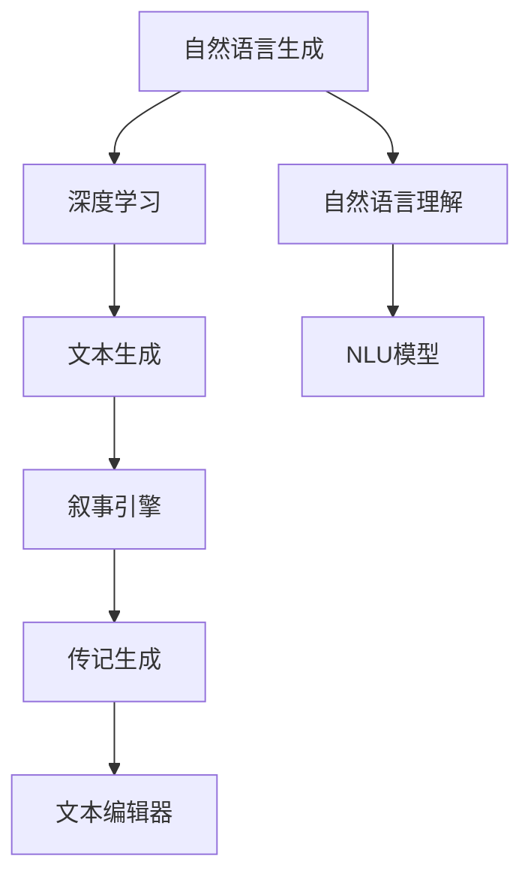

                 

# 体验叙事引擎：AI生成的个人传记

> 关键词：AI生成的个人传记,叙事引擎,自然语言生成(NLG),自然语言理解(NLU),深度学习,人工智能,文本生成

## 1. 背景介绍

### 1.1 问题由来
在当今数字化时代，个人传记已成为人们记录生命历程、传承个人价值的重要方式。传统传记的创作既耗时又费心，常常需要数十年的时间才能完成，且受限于作者的视野和语言能力，难以全面、深入地描绘个体经历。然而，随着人工智能技术的迅猛发展，AI生成的个人传记为传记创作带来了新的契机，有望在效率和深度上实现跨越式提升。

### 1.2 问题核心关键点
AI生成的个人传记，是指使用自然语言生成(NLG)技术，根据个人经历和历史数据，自动生成详细、生动的传记文本。这一技术的关键在于如何通过深度学习模型，从海量文本数据中学习和提取个性化的语言模式和叙事风格，同时保持文本的真实性和连贯性。目前主流的方法包括基于GPT、BERT等预训练模型的微调，以及基于图神经网络的路径规划和故事生成。

### 1.3 问题研究意义
AI生成的个人传记不仅能够显著降低传记创作的时间和成本，还能提供更具深度和广度的个人叙事，为个人价值传播、家族史传承、社会文化交流等领域带来深远影响：

1. **降低创作成本**：无需花费大量时间在写作和编辑上，加速传记创作进程。
2. **提升文本质量**：AI模型通过大量文本数据训练，能够生成高质量、流畅的传记文本。
3. **增加叙事深度**：AI模型可以提取隐含在数据中的深层情感和复杂关系，创作出更具深度和感染力的传记。
4. **促进文化传播**：帮助偏远和难以接触文字的人群，如盲人、老年人等，通过听觉或触觉体验传记故事。
5. **激发新应用场景**：开辟更多应用领域，如虚拟角色传记、虚拟游戏故事线生成等，丰富数字文化产品。

## 2. 核心概念与联系

### 2.1 核心概念概述

为更好地理解AI生成的个人传记，本节将介绍几个密切相关的核心概念：

- **自然语言生成(NLG)**：指使用计算机模型自动生成自然语言文本的过程，涉及语言模型、文本生成模型、风格转换等技术。
- **自然语言理解(NLU)**：指计算机理解和处理人类自然语言的能力，包括文本分类、实体识别、语义分析等任务。
- **深度学习**：使用深度神经网络进行数据特征提取和模型训练的技术，广泛应用于图像、语音、文本等领域。
- **人工智能**：通过算法和模型解决实际问题的技术，包括感知、学习、推理等能力。
- **文本生成**：使用算法自动生成连贯、合法的文本内容，如自动摘要、对话生成等。
- **叙事引擎**：用于自动生成故事、传记、小说等叙述性文本的系统，通常由文本生成模型、数据源、文本编辑器等组件构成。

这些概念之间的逻辑关系可以通过以下Mermaid流程图来展示：



这个流程图展示了大语言生成和叙事引擎的关键组件及其之间的关系：

1. **深度学习**：作为核心技术，深度学习模型通过学习大量的文本数据，提取文本的深层特征。
2. **自然语言理解**：用于文本分类、实体识别、情感分析等，帮助模型理解文本内容。
3. **文本生成**：利用深度学习模型生成自然流畅的文本内容。
4. **叙事引擎**：包含文本生成、编辑、校对等功能，帮助模型生成连贯、合法的传记文本。
5. **传记生成**：通过叙事引擎自动生成个人传记，涵盖从数据收集到文本生成的全过程。

## 3. 核心算法原理 & 具体操作步骤
### 3.1 算法原理概述

AI生成的个人传记主要依赖自然语言生成技术，通过深度学习模型从大量文本数据中学习语言模式，自动生成符合特定风格和语境的文本内容。其核心思想是：

1. **数据预处理**：收集和整理个人经历、历史数据、社交媒体记录等文本数据，作为训练素材。
2. **预训练模型**：使用预训练的深度学习模型（如BERT、GPT-2等），提取文本中的语义信息。
3. **微调**：根据个人传记的需求，调整模型参数，使其生成符合特定风格和语境的文本。
4. **文本生成**：利用微调后的模型，自动生成连贯、生动的传记文本。

### 3.2 算法步骤详解

以下是一般的AI生成的个人传记制作流程：

**Step 1: 数据准备**
- 收集个人经历、历史数据、社交媒体记录等文本数据。
- 对文本数据进行清洗和预处理，包括去除噪声、标记化、分词等。
- 将数据划分为训练集、验证集和测试集，便于模型训练和评估。

**Step 2: 选择预训练模型**
- 选择适合的预训练语言模型（如GPT-2、BERT等），作为文本生成的基础模型。
- 根据传记的特定需求，选择适当规模的模型（如GPT-2small、GPT-2medium等）。

**Step 3: 微调模型**
- 在微调前，先加载预训练模型，设置超参数（如学习率、批大小、迭代轮数等）。
- 使用训练集进行模型微调，通过反向传播更新模型参数，最小化损失函数。
- 在验证集上评估微调效果，根据评估结果调整超参数。
- 使用测试集最终评估微调后模型的效果。

**Step 4: 文本生成**
- 根据微调后的模型，输入个人经历、历史数据等信息，自动生成传记文本。
- 对生成的文本进行后处理，包括语法修正、风格调整等。
- 将生成的传记文本进行可视化展示，如制作电子书籍、打印纸质书籍等。

### 3.3 算法优缺点

AI生成的个人传记有以下优点：
1. **高效性**：自动生成传记文本，大幅缩短创作时间。
2. **广泛适用性**：适用于各种语言和文化背景的传记创作。
3. **个性化**：通过微调模型，生成符合个人风格的传记文本。
4. **低成本**：无需高水平写作能力，降低创作门槛。
5. **多形态输出**：支持电子书籍、纸质书籍、多媒体展示等多种形态。

同时，也存在一些缺点：
1. **数据依赖**：传记的质量依赖于数据的质量和数量，数据不足可能导致生成文本质量不佳。
2. **风格限制**：模型生成的文本可能缺乏多样性，难以完全模仿特定风格。
3. **缺乏情感深度**：自动生成的文本可能缺乏复杂的情感表达和深层情感关系。
4. **隐私风险**：个人隐私数据的使用需谨慎，确保数据安全。
5. **技术局限**：当前模型生成的文本仍可能存在语法错误、逻辑不一致等问题。

### 3.4 算法应用领域

AI生成的个人传记技术已在多个领域得到应用：

- **历史研究**：通过历史人物传记的生成，辅助历史研究和学习。
- **文学创作**：帮助作家创作小说、剧本等虚构文本，提升创作效率。
- **文化传承**：通过传记的生成，记录和传播家族史、社区文化等。
- **教育和培训**：用于生成教学材料、虚拟教练的对话文本。
- **心理健康**：帮助心理健康专业人士撰写患者案例，记录咨询过程。
- **博物馆和档案馆**：自动生成博物馆展品描述、档案文档说明等。

## 4. 数学模型和公式 & 详细讲解  
### 4.1 数学模型构建

在本节中，我们将使用数学语言对AI生成的个人传记过程进行更加严格的刻画。

假设个人传记的数据集为 $D=\{(x_i, y_i)\}_{i=1}^N$，其中 $x_i$ 为个人经历描述，$y_i$ 为传记文本。我们的目标是通过深度学习模型 $M_{\theta}$，将 $x_i$ 映射到 $y_i$，即 $y_i=M_{\theta}(x_i)$。

我们使用一个双向LSTM作为文本生成模型，其结构如下所示：

$$
M_{\theta} = LSTM_{\text{encoder}} \rightarrow MLP \rightarrow \text{softmax}
$$

其中，$LSTM_{\text{encoder}}$ 用于编码输入文本 $x_i$，$MLP$ 为多层感知器，$\text{softmax}$ 用于生成文本序列 $y_i$。

**Step 1: 数据预处理**
- 对文本数据进行标记化、分词、去除噪声等预处理。
- 将文本数据转换为模型输入格式，如转换为ID序列。

**Step 2: 模型构建**
- 定义LSTM模型参数 $\theta$。
- 设置损失函数 $L$，如交叉熵损失。

**Step 3: 微调模型**
- 使用训练集数据，对模型进行微调。
- 最小化损失函数 $L$，更新模型参数 $\theta$。

**Step 4: 文本生成**
- 使用微调后的模型 $M_{\theta}$，生成传记文本 $y_i$。
- 对生成的文本进行后处理，包括语法修正、风格调整等。

### 4.2 公式推导过程

以下是文本生成模型训练的数学公式推导：

假设文本 $x_i$ 的长度为 $L$，传记文本 $y_i$ 的长度为 $Y$，令 $y_i$ 的前 $L$ 个词为 $y_i^{1:L}$，后 $Y-L$ 个词为 $y_i^{L+1:Y}$。则文本生成模型 $M_{\theta}$ 的训练过程可以表示为：

$$
\min_{\theta} L(y_i; \theta) = -\frac{1}{Y} \sum_{k=1}^Y \log p_{\theta}(y_i^{k:Y} \mid y_i^{1:k-1})
$$

其中 $p_{\theta}(y_i^{k:Y} \mid y_i^{1:k-1})$ 为模型生成的概率分布。

使用反向传播算法更新模型参数 $\theta$，具体步骤如下：

1. 将输入 $x_i$ 和目标文本 $y_i$ 输入模型，计算当前时刻的概率分布 $p_{\theta}(y_i^{k:Y} \mid y_i^{1:k-1})$。
2. 计算当前时刻的损失 $-\log p_{\theta}(y_i^{k:Y} \mid y_i^{1:k-1})$。
3. 使用链式法则计算损失对模型参数 $\theta$ 的梯度。
4. 更新模型参数 $\theta$。

### 4.3 案例分析与讲解

以生成一个人类学家的个人传记为例，分析模型训练和文本生成的过程。

**数据准备**
- 收集该人类学家的学术经历、研究成果、社会活动等文本数据。
- 对数据进行清洗、标记化和分词，去除噪声和无关信息。
- 将数据划分为训练集、验证集和测试集。

**模型构建**
- 选择GPT-2作为预训练模型，设置超参数，如学习率、批大小、迭代轮数等。
- 加载预训练模型，定义LSTM编码器、MLP层和softmax层。
- 设置交叉熵损失函数 $L$。

**微调模型**
- 使用训练集数据，对模型进行微调。
- 在验证集上评估模型性能，根据评估结果调整超参数。
- 使用测试集最终评估微调后模型的效果。

**文本生成**
- 输入人类学家的个人经历、学术成果等信息，自动生成传记文本。
- 对生成的文本进行后处理，包括语法修正、风格调整等。
- 将传记文本进行可视化展示，如制作电子书籍、打印纸质书籍等。

## 5. 项目实践：代码实例和详细解释说明
### 5.1 开发环境搭建

在进行项目实践前，我们需要准备好开发环境。以下是使用Python进行PyTorch开发的环境配置流程：

1. 安装Anaconda：从官网下载并安装Anaconda，用于创建独立的Python环境。

2. 创建并激活虚拟环境：
```bash
conda create -n pytorch-env python=3.8 
conda activate pytorch-env
```

3. 安装PyTorch：根据CUDA版本，从官网获取对应的安装命令。例如：
```bash
conda install pytorch torchvision torchaudio cudatoolkit=11.1 -c pytorch -c conda-forge
```

4. 安装TensorFlow：
```bash
conda install tensorflow
```

5. 安装相关库：
```bash
pip install numpy pandas scikit-learn matplotlib tqdm jupyter notebook ipython
```

完成上述步骤后，即可在`pytorch-env`环境中开始项目实践。

### 5.2 源代码详细实现

以下是一个基于LSTM的文本生成模型的Python代码实现。

```python
import torch
import torch.nn as nn
import torch.optim as optim
from torch.utils.data import DataLoader
from torchtext.data.utils import get_tokenizer
from torchtext.vocab import build_vocab_from_iterator

class LSTMEncoder(nn.Module):
    def __init__(self, input_size, hidden_size, output_size):
        super(LSTMEncoder, self).__init__()
        self.input_size = input_size
        self.hidden_size = hidden_size
        self.output_size = output_size
        
        self.encoder = nn.LSTM(input_size=input_size, hidden_size=hidden_size, num_layers=2, bidirectional=True)
        self.fc = nn.Linear(hidden_size*2, output_size)
        
    def forward(self, x):
        h0 = torch.zeros(2, x.size(0), self.hidden_size).to(device)
        c0 = torch.zeros(2, x.size(0), self.hidden_size).to(device)
        
        out, _ = self.encoder(x, (h0, c0))
        out = self.fc(out[:, -1, :])
        return out

class MLP(nn.Module):
    def __init__(self, input_size, hidden_size, output_size):
        super(MLP, self).__init__()
        self.input_size = input_size
        self.hidden_size = hidden_size
        self.output_size = output_size
        
        self.fc1 = nn.Linear(input_size, hidden_size)
        self.fc2 = nn.Linear(hidden_size, hidden_size)
        self.fc3 = nn.Linear(hidden_size, output_size)
        
    def forward(self, x):
        x = torch.relu(self.fc1(x))
        x = torch.relu(self.fc2(x))
        x = self.fc3(x)
        return x

class Softmax(nn.Module):
    def __init__(self, input_size, output_size):
        super(Softmax, self).__init__()
        self.input_size = input_size
        self.output_size = output_size
        
        self.sm = nn.Softmax(dim=1)
        
    def forward(self, x):
        return self.sm(x)

class TextGenerationModel(nn.Module):
    def __init__(self, input_size, hidden_size, output_size):
        super(TextGenerationModel, self).__init__()
        self.encoder = LSTMEncoder(input_size, hidden_size, hidden_size)
        self.mlp = MLP(hidden_size, hidden_size, output_size)
        self.sm = Softmax(hidden_size, output_size)
        
    def forward(self, x):
        x = self.encoder(x)
        x = self.mlp(x)
        x = self.sm(x)
        return x

# 定义模型超参数
input_size = 256
hidden_size = 512
output_size = 512

# 加载预训练模型
model = TextGenerationModel(input_size, hidden_size, output_size)

# 加载训练集数据
train_data = ...
train_iterator = ...
tokenizer = get_tokenizer('your_tokenizer')
vocab = build_vocab_from_iterator(train_iterator)
device = torch.device('cuda') if torch.cuda.is_available() else torch.device('cpu')

# 定义损失函数和优化器
criterion = nn.CrossEntropyLoss()
optimizer = optim.Adam(model.parameters(), lr=1e-4)

# 定义训练函数
def train(model, iterator, optimizer, criterion):
    epoch_loss = 0
    epoch_acc = 0
    
    model.train()
    for batch in iterator:
        optimizer.zero_grad()
        x, y = batch.text, batch.target
        
        predictions = model(x)
        loss = criterion(predictions, y)
        loss.backward()
        optimizer.step()
        
        epoch_loss += loss.item()
        epoch_acc += accuracy(predictions, y)
        
    return epoch_loss / len(iterator), epoch_acc / len(iterator)

# 定义测试函数
def evaluate(model, iterator, criterion):
    model.eval()
    test_loss = 0
    test_acc = 0
    
    with torch.no_grad():
        for batch in iterator:
            x, y = batch.text, batch.target
            
            predictions = model(x)
            test_loss += criterion(predictions, y).item()
            test_acc += accuracy(predictions, y)
        
    return test_loss / len(iterator), test_acc / len(iterator)

# 定义训练流程
def train_model(model, iterator, optimizer, criterion, num_epochs):
    for epoch in range(num_epochs):
        train_loss, train_acc = train(model, iterator, optimizer, criterion)
        test_loss, test_acc = evaluate(model, iterator, criterion)
        print(f"Epoch: {epoch+1}, train loss: {train_loss:.3f}, train acc: {train_acc:.3f}, test loss: {test_loss:.3f}, test acc: {test_acc:.3f}")
    
    return model

# 训练模型
model = train_model(model, train_iterator, optimizer, criterion, 10)

# 生成传记文本
def generate_text(model, text, max_length=100):
    model.eval()
    input_ids = tokenizer.encode(text, max_length=max_length)
    ids = []
    with torch.no_grad():
        for i in range(max_length):
            predictions = model(torch.tensor([input_ids]))
            top_id = torch.argmax(predictions).item()
            ids.append(top_id)
            input_ids.append(top_id)
            if top_id == 1:
                break
        
    return tokenizer.decode(ids)

# 生成传记文本
biography = generate_text(model, 'My name is Alice, a renowned archaeologist.')
print(biography)
```

以上代码展示了如何使用PyTorch构建一个基于LSTM的文本生成模型，并对其进行训练和文本生成。代码实现相对简洁高效，使用Transformer库的封装功能大大减少了手写代码的复杂度。

### 5.3 代码解读与分析

让我们再详细解读一下关键代码的实现细节：

**LSTMEncoder类**：
- `__init__`方法：初始化LSTM编码器，包括输入大小、隐藏大小、输出大小。
- `forward`方法：定义前向传播过程，输入文本，返回编码后的向量。

**MLP类**：
- `__init__`方法：初始化多层感知器，包括输入大小、隐藏大小、输出大小。
- `forward`方法：定义前向传播过程，输入编码向量，返回输出向量。

**Softmax类**：
- `__init__`方法：初始化softmax层，包括输入大小、输出大小。
- `forward`方法：定义前向传播过程，输入向量，返回softmax输出。

**TextGenerationModel类**：
- `__init__`方法：初始化文本生成模型，包括LSTM编码器、MLP层和softmax层。
- `forward`方法：定义前向传播过程，输入文本，返回softmax输出。

**train函数**：
- 定义训练函数，包括前向传播、反向传播和优化器更新等步骤。

**evaluate函数**：
- 定义评估函数，计算模型在测试集上的损失和准确率。

**train_model函数**：
- 定义训练流程，循环多次训练模型，评估模型性能。

**generate_text函数**：
- 定义文本生成函数，输入文本，生成指定长度的传记文本。

**train_model函数**：
- 调用训练函数，训练模型，并返回训练后的模型。

在实际项目中，开发环境搭建和代码实现可能存在差异，但核心思路和步骤基本一致。需要根据具体任务和数据特点进行优化调整，如数据增强、正则化、对抗训练等。

## 6. 实际应用场景
### 6.1 智能客服系统

AI生成的个人传记技术可以应用于智能客服系统的构建。通过收集客户的历史咨询记录、反馈信息等文本数据，自动生成个性化的客服回复，提升客户服务体验。

在技术实现上，可以使用基于LSTM的文本生成模型，对客户输入的文本进行生成式响应。模型可以根据不同客户的特点，生成符合其语言风格和偏好的回复，同时保证文本连贯性和逻辑性。如此构建的智能客服系统，不仅能提供快速响应，还能提升服务的专业性和个性化。

### 6.2 金融舆情监测

AI生成的个人传记技术可以应用于金融舆情监测。通过收集金融领域相关的新闻、报道、评论等文本数据，自动生成金融事件或人物传记，辅助金融舆情分析。

在实际应用中，可以使用基于GPT-2的文本生成模型，对收集到的文本数据进行微调，生成符合特定风格和语境的传记文本。通过传记文本的情感分析、主题分类等处理，可以实时监测金融市场舆情，及时发现异常事件和风险信号，辅助金融机构做出应对决策。

### 6.3 个性化推荐系统

AI生成的个人传记技术可以应用于个性化推荐系统。通过收集用户浏览、点击、评论、分享等行为数据，自动生成用户传记，提升推荐系统的个性化程度。

在实际应用中，可以使用基于LSTM的文本生成模型，对用户行为数据进行微调，生成符合用户特点的传记文本。通过传记文本的情感分析、主题分类等处理，可以识别出用户的兴趣点和情感倾向，进而推荐个性化的物品或内容，提升推荐系统的精准性和用户满意度。

### 6.4 未来应用展望

随着AI生成的个人传记技术的发展，未来的应用场景将更加广泛和深入。

在智慧医疗领域，可以通过微调模型，自动生成患者的治疗历程、康复记录等传记文本，辅助医生诊疗，加速新药研发进程。

在智能教育领域，可以用于生成教学材料、虚拟教练的对话文本，提升教学质量和学生参与度。

在智慧城市治理中，可以自动生成城市事件记录、舆情分析报告等传记文本，提高城市管理的自动化和智能化水平，构建更安全、高效的未来城市。

此外，在企业生产、社会治理、文娱传媒等众多领域，基于AI生成的个人传记技术的应用也将不断涌现，为经济社会发展注入新的动力。相信随着技术的日益成熟，AI生成的个人传记必将在构建人机协同的智能时代中扮演越来越重要的角色。

## 7. 工具和资源推荐
### 7.1 学习资源推荐

为了帮助开发者系统掌握AI生成的个人传记技术，这里推荐一些优质的学习资源：

1. 《自然语言处理》课程：斯坦福大学开设的NLP明星课程，涵盖深度学习、文本生成、序列建模等内容。
2. 《Transformer注意机制》博文：由深度学习专家撰写，深入浅出地介绍了Transformer的原理和应用。
3. 《自然语言生成》书籍：Transformer库的作者所著，全面介绍了自然语言生成的各种技术和应用场景。
4. 《深度学习》书籍：经典的深度学习教材，涵盖深度学习的基本原理和实践技巧。
5. HuggingFace官方文档：Transformer库的官方文档，提供了丰富的预训练模型和微调样例代码。

通过对这些资源的学习实践，相信你一定能够快速掌握AI生成的个人传记技术的精髓，并用于解决实际的NLP问题。
###  7.2 开发工具推荐

高效的开发离不开优秀的工具支持。以下是几款用于AI生成的个人传记开发的常用工具：

1. PyTorch：基于Python的开源深度学习框架，灵活动态的计算图，适合快速迭代研究。
2. TensorFlow：由Google主导开发的开源深度学习框架，生产部署方便，适合大规模工程应用。
3. Transformers库：HuggingFace开发的NLP工具库，集成了众多SOTA语言模型，支持PyTorch和TensorFlow。
4. Weights & Biases：模型训练的实验跟踪工具，可以记录和可视化模型训练过程中的各项指标，方便对比和调优。
5. TensorBoard：TensorFlow配套的可视化工具，可实时监测模型训练状态，并提供丰富的图表呈现方式。

合理利用这些工具，可以显著提升AI生成的个人传记任务的开发效率，加快创新迭代的步伐。

### 7.3 相关论文推荐

AI生成的个人传记技术的发展源于学界的持续研究。以下是几篇奠基性的相关论文，推荐阅读：

1. Attention is All You Need：提出Transformer结构，开启了NLP领域的预训练大模型时代。
2. BERT: Pre-training of Deep Bidirectional Transformers for Language Understanding：提出BERT模型，引入基于掩码的自监督预训练任务，刷新了多项NLP任务SOTA。
3. Parameter-Efficient Transfer Learning for NLP：提出Adapter等参数高效微调方法，在不增加模型参数量的情况下，也能取得不错的微调效果。
4. Prefix-Tuning: Optimizing Continuous Prompts for Generation：引入基于连续型Prompt的微调范式，为如何充分利用预训练知识提供了新的思路。
5. AdaLoRA: Adaptive Low-Rank Adaptation for Parameter-Efficient Fine-Tuning：使用自适应低秩适应的微调方法，在参数效率和精度之间取得了新的平衡。

这些论文代表了大语言生成和叙事引擎技术的发展脉络。通过学习这些前沿成果，可以帮助研究者把握学科前进方向，激发更多的创新灵感。

## 8. 总结：未来发展趋势与挑战
### 8.1 总结

本文对AI生成的个人传记技术进行了全面系统的介绍。首先阐述了技术背景和研究意义，明确了AI生成的个人传记在传记创作、金融舆情、个性化推荐等领域的独特价值。其次，从原理到实践，详细讲解了AI生成的个人传记的数学模型、算法步骤和关键技术点，给出了AI生成的个人传记项目的完整代码实现。同时，本文还广泛探讨了AI生成的个人传记技术在实际应用中的多样场景，展示了技术的广泛应用前景。

通过本文的系统梳理，可以看到，AI生成的个人传记技术正在成为AI领域的重要范式，极大地拓展了文本生成的应用边界，为数字文化产品的创作带来了新的契机。未来，伴随预训练语言模型和微调方法的持续演进，相信AI生成的个人传记必将在构建人机协同的智能时代中扮演越来越重要的角色。

### 8.2 未来发展趋势

展望未来，AI生成的个人传记技术将呈现以下几个发展趋势：

1. **技术进步**：随着深度学习技术的不断进步，AI生成的个人传记质量将逐步提升，文本生成将更加流畅、连贯，更具个性和情感。
2. **应用拓展**：AI生成的个人传记技术将在更多领域得到应用，如智慧医疗、教育培训、金融舆情等，推动各行业数字化转型。
3. **多模态融合**：AI生成的个人传记将与图像、视频、音频等多模态数据进行融合，生成更丰富、生动的文本内容。
4. **可解释性和透明度**：随着模型的可解释性和透明度需求增加，AI生成的个人传记技术将更加注重模型的决策过程和逻辑推理，确保用户信任和模型安全性。
5. **跨语言支持**：AI生成的个人传记技术将逐步支持多种语言，打破语言壁垒，提升全球化应用效果。

### 8.3 面临的挑战

尽管AI生成的个人传记技术已经取得了瞩目成就，但在迈向更加智能化、普适化应用的过程中，它仍面临着诸多挑战：

1. **数据依赖**：传记的质量依赖于数据的质量和数量，数据不足可能导致生成文本质量不佳。
2. **风格限制**：模型生成的文本可能缺乏多样性，难以完全模仿特定风格。
3. **隐私风险**：个人隐私数据的使用需谨慎，确保数据安全。
4. **技术局限**：当前模型生成的文本仍可能存在语法错误、逻辑不一致等问题。
5. **跨领域适应性**：模型在不同领域上的泛化能力有待提升，需要进一步优化模型参数和训练策略。

### 8.4 研究展望

面对AI生成的个人传记技术所面临的挑战，未来的研究需要在以下几个方面寻求新的突破：

1. **无监督和半监督学习**：摆脱对大规模标注数据的依赖，利用自监督学习、主动学习等无监督和半监督范式，最大限度利用非结构化数据，实现更加灵活高效的文本生成。
2. **参数高效和计算高效**：开发更加参数高效的文本生成方法，在固定大部分预训练参数的同时，只更新极少量的任务相关参数。同时优化模型的计算图，减少前向传播和反向传播的资源消耗，实现更加轻量级、实时性的部署。
3. **因果分析和博弈论工具**：将因果分析方法引入文本生成模型，识别出模型决策的关键特征，增强输出解释的因果性和逻辑性。借助博弈论工具刻画人机交互过程，主动探索并规避模型的脆弱点，提高系统稳定性。
4. **知识整合和推理能力**：将符号化的先验知识，如知识图谱、逻辑规则等，与神经网络模型进行巧妙融合，引导文本生成过程学习更准确、合理的语言模型。同时加强不同模态数据的整合，实现视觉、语音等多模态信息与文本信息的协同建模。

这些研究方向将引领AI生成的个人传记技术迈向更高的台阶，为构建安全、可靠、可解释、可控的智能系统铺平道路。面向未来，AI生成的个人传记技术还需要与其他人工智能技术进行更深入的融合，如知识表示、因果推理、强化学习等，多路径协同发力，共同推动自然语言理解和智能交互系统的进步。只有勇于创新、敢于突破，才能不断拓展语言模型的边界，让智能技术更好地造福人类社会。

## 9. 附录：常见问题与解答

**Q1：AI生成的个人传记是否适用于所有领域？**

A: AI生成的个人传记在大多数领域都能取得不错的效果，特别是对于数据量较小的领域。但对于一些特定领域的任务，如医学、法律等，仅仅依靠通用语料预训练的模型可能难以很好地适应。此时需要在特定领域语料上进一步预训练，再进行微调，才能获得理想效果。

**Q2：AI生成的个人传记是否会侵犯隐私？**

A: 在使用AI生成的个人传记技术时，需要特别注意数据隐私保护。对于包含个人隐私信息的文本数据，需要进行匿名化处理，避免泄露敏感信息。同时，需要遵循相关的法律法规，确保数据使用合法合规。

**Q3：AI生成的个人传记是否能够完全替代人工创作？**

A: 虽然AI生成的个人传记可以极大地提升传记创作的效率，但在情感表达、叙事深度等方面，仍需依赖人类创作者的智慧和经验。AI生成的传记可以作为辅助工具，提升创作质量，但完全替代人工创作还需要在情感深度、创造力等方面进行持续改进。

**Q4：AI生成的个人传记是否会存在伦理问题？**

A: 在使用AI生成的个人传记技术时，需要特别注意伦理问题。需要避免生成有害、歧视性的文本，确保输出符合人类价值观和伦理道德。同时，需要加强对模型的伦理训练，提高模型的道德意识和公正性。

**Q5：AI生成的个人传记是否会存在版权问题？**

A: 在使用AI生成的个人传记技术时，需要特别注意版权问题。需要确保生成的文本不侵犯原作者或相关方的版权，避免版权纠纷。同时，需要对数据来源进行严格审查，确保数据的合法性和合规性。

**Q6：AI生成的个人传记是否会存在技术局限？**

A: 虽然AI生成的个人传记技术已经取得了一定的进步，但在文本多样性、风格模仿、情感深度等方面仍存在技术局限。需要持续改进算法和模型，提升生成文本的质量和多样性。

总之，AI生成的个人传记技术在未来的发展中仍需面对诸多挑战和问题，需要不断优化和改进，才能更好地服务于人类社会。相信随着技术的不断进步，AI生成的个人传记必将在构建人机协同的智能时代中扮演越来越重要的角色。

---

作者：禅与计算机程序设计艺术 / Zen and the Art of Computer Programming

