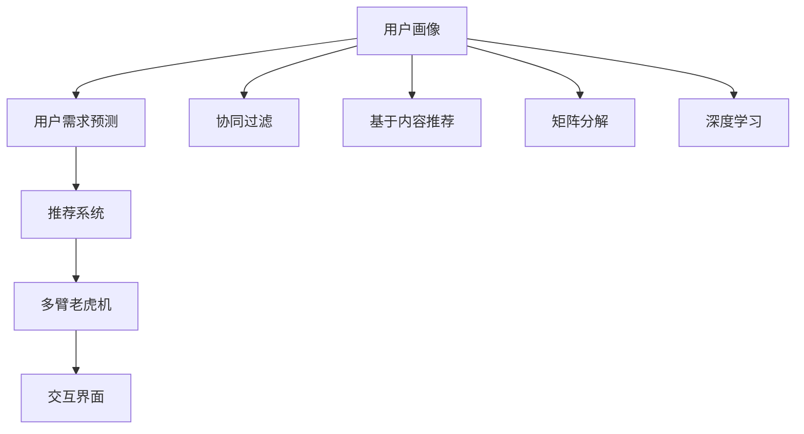

                 

# 体验的个性化：AI驱动的定制服务

## 1. 背景介绍

### 1.1 问题由来
在现代消费社会，个性化服务已成为衡量品牌竞争力的重要标准。从电商平台到社交平台，从在线教育到医疗服务，无论是B2B还是B2C，各行各业都在积极探索个性化策略，力求通过精准触达用户需求，提升用户体验和忠诚度。

### 1.2 问题核心关键点
个性化服务涉及多个关键环节：用户画像构建、用户需求预测、推荐系统设计、交互界面优化等。AI技术的引入，尤其是基于深度学习、自然语言处理、计算机视觉等技术的个性化推荐系统，成为解决这些问题的有力工具。然而，如何构建高效、可靠、可解释的个性化服务系统，仍是当前面临的挑战。

### 1.3 问题研究意义
研究AI驱动的个性化服务，对于提升用户体验、增加品牌竞争力、推动产业升级具有重要意义：

1. **用户体验优化**：通过个性化服务，用户能够获得更符合自身需求和偏好的产品或服务，显著提升使用体验和满意度。
2. **品牌竞争力增强**：个性化服务能够帮助品牌精准识别和满足目标用户需求，增强市场竞争力，赢得更多消费者的青睐。
3. **产业升级加速**：个性化技术在各行各业的深入应用，能够推动传统产业数字化转型，提升产业效率和价值链水平。
4. **社会福利增进**：个性化服务能够更好地适应个人化需求，如健康医疗、教育培训等，提升社会整体福祉。

## 2. 核心概念与联系

### 2.1 核心概念概述

为更好地理解AI驱动的个性化服务，本节将介绍几个密切相关的核心概念：

- **用户画像(User Profile)**：通过收集和分析用户的个人信息、行为数据、社交网络等，构建用户多维度的特征向量。
- **用户需求预测(User Demand Prediction)**：基于用户画像，通过机器学习或深度学习模型，预测用户的未来行为或需求。
- **推荐系统(Recommender System)**：利用用户画像和需求预测结果，为用户提供个性化的产品或服务推荐。
- **多臂老虎机(Multi-Armed Bandit, MAB)**：一种在资源有限条件下优化决策的问题，常用于推荐系统的策略设计。
- **交互界面(UI/UX Design)**：设计直观、易用的交互界面，提升用户操作体验。

- **算法**：包括协同过滤、基于内容的推荐、矩阵分解、深度学习等方法。

- **模型**：如K近邻算法、决策树、随机森林、深度神经网络等。

这些概念之间的逻辑关系可以通过以下Mermaid流程图来展示：



这个流程图展示了个性化服务的关键概念及其之间的关系：

1. 用户画像通过多维度数据构建，为后续需求预测和推荐提供基础。
2. 用户需求预测基于用户画像进行，以预测用户的未来行为或需求。
3. 推荐系统结合用户画像和需求预测结果，生成个性化推荐。
4. 多臂老虎机用于推荐系统的策略优化，平衡探索和利用。
5. 交互界面设计提升用户体验，增强系统可用性。
6. 协同过滤、基于内容推荐、矩阵分解、深度学习等算法和模型，共同构成推荐系统的主要技术框架。

这些概念共同构成了AI驱动个性化服务的核心框架，为其提供了坚实的理论基础和实践方法。

## 3. 核心算法原理 & 具体操作步骤

### 3.1 算法原理概述

AI驱动的个性化服务，本质上是一个多目标优化问题，目标是在有限的资源（如时间、数据、计算能力）下，最大化用户满意度和品牌收益。其核心思想是：通过深度学习和强化学习等技术，构建高效的用户画像和需求预测模型，设计优化策略，实现个性化推荐和交互界面的优化。

形式化地，假设用户画像为 $U = \{u_1, u_2, ..., u_N\}$，其中 $u_i$ 为用户 $i$ 的多维度特征向量。用户需求预测模型为 $P$，能够根据用户画像 $U$ 预测用户需求 $D$。推荐系统 $R$ 能够基于用户需求 $D$ 生成个性化推荐 $R_i$，交互界面 $I$ 能够提升用户对推荐 $R_i$ 的满意度和使用体验。

个性化服务的目标函数为：

$$
\max_{U, P, R, I} \sum_{i=1}^N f_i(U_i, P(U_i), R_i(I_i))
$$

其中 $f_i$ 为用户的满意度函数，可以是直接或间接的用户反馈（如点击率、购买率等），也可以是更复杂的效用函数（如净推荐值）。

### 3.2 算法步骤详解

AI驱动的个性化服务一般包括以下几个关键步骤：

**Step 1: 数据收集与预处理**
- 收集用户行为数据、社交网络数据、历史交易数据等，构成用户画像的基本数据集。
- 对数据进行清洗、归一化、特征工程等预处理操作，生成用户画像的特征向量。

**Step 2: 用户画像构建**
- 使用K-means、PCA、LDA等聚类或降维技术，对用户特征向量进行建模，生成用户画像。
- 考虑用户画像的多样性和动态性，定期更新用户画像，以反映用户的最新行为和偏好。

**Step 3: 需求预测建模**
- 基于用户画像，使用深度学习模型（如DNN、CNN、RNN、Transformer等），构建用户需求预测模型 $P$。
- 使用监督学习方法（如回归、分类等），训练预测模型，并使用交叉验证等技术评估模型性能。

**Step 4: 推荐系统设计**
- 选择推荐算法（如协同过滤、基于内容的推荐、深度学习推荐等），设计个性化推荐系统 $R$。
- 使用多臂老虎机策略（如$\epsilon$-贪心、UCB等），优化推荐系统策略，平衡探索和利用。

**Step 5: 交互界面优化**
- 设计直观、易用的交互界面，提升用户体验。
- 使用A/B测试等方法，评估界面设计效果，不断迭代优化。

**Step 6: 系统集成与上线**
- 将用户画像、需求预测模型、推荐系统和交互界面集成到统一的服务平台，实现完整的个性化服务流程。
- 进行系统测试，确保各模块稳定运行，上线后持续监控系统性能和用户体验。

以上是AI驱动个性化服务的一般流程。在实际应用中，还需要针对具体任务的特点，对各环节进行优化设计，如改进数据收集方法、优化模型结构、提升推荐算法效率等，以进一步提升系统性能。

### 3.3 算法优缺点

AI驱动的个性化服务具有以下优点：
1. 提高用户体验：通过个性化推荐和界面优化，用户能够获得更符合自身需求的服务，显著提升使用体验。
2. 增加品牌收益：精准的个性化推荐能够提升用户满意度和忠诚度，增加品牌收益。
3. 数据驱动决策：基于大规模数据训练的模型，能够提供更可靠的用户需求预测和推荐结果。
4. 动态适应性：能够根据用户行为和市场变化，动态更新用户画像和推荐策略，保持系统时效性。

同时，该方法也存在一定的局限性：
1. 数据隐私问题：大规模数据收集和分析，可能涉及用户隐私，引发法律和道德争议。
2. 数据偏差问题：用户画像和需求预测模型的训练，依赖于数据质量，数据偏差可能导致模型性能下降。
3. 计算资源消耗：构建和运行个性化服务系统，需要大量的计算资源，可能对企业成本造成压力。
4. 模型可解释性：复杂的深度学习模型通常缺乏可解释性，用户难以理解推荐系统的决策逻辑。
5. 过拟合问题：基于小规模数据训练的模型，容易发生过拟合，导致泛化性能不足。

尽管存在这些局限性，但就目前而言，AI驱动的个性化服务仍是大数据和AI技术的重要应用方向。未来相关研究的重点在于如何进一步降低数据隐私风险，提高模型鲁棒性和可解释性，同时兼顾用户体验和品牌收益等因素。

### 3.4 算法应用领域

AI驱动的个性化服务已经在多个领域得到应用，如：

- **电商平台**：如Amazon、淘宝等，通过个性化推荐和搜索优化，提升用户购物体验和转化率。
- **在线广告**：如Google Ads、Facebook Ads，通过个性化广告投放，提升广告点击率和转化率。
- **社交网络**：如Facebook、微信等，通过个性化内容推荐和界面优化，提升用户活跃度和留存率。
- **医疗健康**：如Pinterest、Nike等，通过个性化健康和运动建议，提升用户粘性和满意度。
- **教育培训**：如Coursera、Khan Academy等，通过个性化学习推荐和界面设计，提升学习效果和用户体验。
- **金融服务**：如银行、保险等，通过个性化理财和风险管理建议，提升用户满意度和忠诚度。
- **旅游出行**：如Booking、Expedia等，通过个性化旅行推荐和界面优化，提升用户预订体验和转化率。

除了上述这些经典领域外，AI驱动的个性化服务也被创新性地应用到更多场景中，如智能家居、智能城市、智慧医疗等，为各行各业带来新的发展机遇。

## 4. 数学模型和公式 & 详细讲解  
### 4.1 数学模型构建

本节将使用数学语言对AI驱动的个性化服务进行更加严格的刻画。

假设用户画像为 $U = \{u_1, u_2, ..., u_N\}$，其中 $u_i$ 为用户 $i$ 的多维度特征向量。用户需求预测模型为 $P$，能够根据用户画像 $U$ 预测用户需求 $D$。推荐系统 $R$ 能够基于用户需求 $D$ 生成个性化推荐 $R_i$，交互界面 $I$ 能够提升用户对推荐 $R_i$ 的满意度和使用体验。

个性化服务的目标函数为：

$$
\max_{U, P, R, I} \sum_{i=1}^N f_i(U_i, P(U_i), R_i(I_i))
$$

其中 $f_i$ 为用户的满意度函数，可以是直接或间接的用户反馈（如点击率、购买率等），也可以是更复杂的效用函数（如净推荐值）。

### 4.2 公式推导过程

以下我们以推荐系统中的协同过滤算法为例，推导其核心公式及其优化方法。

假设推荐系统基于用户历史行为 $I_i = \{(i_1, x_{i_1}), (i_2, x_{i_2}), ..., (i_k, x_{i_k})\}$，其中 $i_j$ 为历史行为，$x_{i_j}$ 为行为结果。协同过滤算法通过找到与用户 $i$ 兴趣相似的其他用户 $j$，推荐其历史行为结果 $x_j$ 作为推荐结果 $R_i$。

设用户相似度矩阵为 $S = (s_{ij})$，用户 $i$ 的相似用户集合为 $J_i$。协同过滤算法推荐公式为：

$$
R_i = \frac{1}{\sum_{j \in J_i} s_{ij}} \sum_{j \in J_i} s_{ij} x_j
$$

在实际应用中，为了解决数据稀疏性和计算效率问题，通常使用矩阵分解等技术，将协同过滤算法转化为基于隐向量的方法。设用户向量为 $\mathbf{u}_i$，物品向量为 $\mathbf{v}_j$，用户相似度矩阵 $S = \mathbf{U} \mathbf{V}^T$。协同过滤算法的矩阵分解形式为：

$$
R_i = \frac{\mathbf{u}_i^T \mathbf{V} \mathbf{V}^T \mathbf{u}_i}{\sum_{j=1}^M \mathbf{u}_i^T \mathbf{V} \mathbf{v}_j} \mathbf{v}_j
$$

在计算过程中，为了降低矩阵乘法运算的计算量，通常使用随机梯度下降等优化算法进行迭代更新。

### 4.3 案例分析与讲解

在电商平台的推荐系统中，协同过滤算法被广泛应用。假设某电商平台收集了用户对商品的历史评分数据，如以下表格所示：

| User | Item | Rating |
|------|------|--------|
| A    | 1    | 4.0    |
| A    | 2    | 3.5    |
| B    | 1    | 4.5    |
| B    | 3    | 2.0    |
| C    | 2    | 5.0    |
| C    | 4    | 4.0    |

设用户相似度矩阵 $S$ 为：

| User A | User B | User C |
|--------|--------|--------|
| 0.8    | 0.5    | 0.2    |
| 0.5    | 0.9    | 0.1    |
| 0.2    | 0.1    | 0.8    |

假设物品向量 $\mathbf{v}_j$ 由用户历史评分数据训练得到，如：

| Item 1 | Item 2 | Item 3 | Item 4 |
|---------|--------|--------|--------|
| 0.3    | 0.4    | 0.2    | 0.5    |
| 0.1    | 0.2    | 0.5    | 0.3    |
| 0.5    | 0.4    | 0.1    | 0.2    |
| 0.2    | 0.5    | 0.3    | 0.4    |

使用协同过滤算法推荐用户 $A$ 对未购买物品的评分，可以得到：

| Item 1 | Item 2 | Item 3 | Item 4 |
|---------|--------|--------|--------|
| 0.24    | 0.48   | 0.16   | 0.32   |
| 0.18    | 0.36   | 0.12   | 0.24   |
| 0.12    | 0.24   | 0.06   | 0.12   |
| 0.06    | 0.12   | 0.04   | 0.08   |

其中，第一行为用户 $A$ 对未购买物品的推荐评分。可以看到，协同过滤算法通过计算用户相似度和物品向量，能够为用户推荐与其兴趣相似的其他用户的历史评分，从而生成个性化推荐。

## 5. 项目实践：代码实例和详细解释说明
### 5.1 开发环境搭建

在进行个性化服务系统开发前，我们需要准备好开发环境。以下是使用Python进行PyTorch开发的环境配置流程：

1. 安装Anaconda：从官网下载并安装Anaconda，用于创建独立的Python环境。

2. 创建并激活虚拟环境：
```bash
conda create -n pytorch-env python=3.8 
conda activate pytorch-env
```

3. 安装PyTorch：根据CUDA版本，从官网获取对应的安装命令。例如：
```bash
conda install pytorch torchvision torchaudio cudatoolkit=11.1 -c pytorch -c conda-forge
```

4. 安装PyTorch：根据CUDA版本，从官网获取对应的安装命令。例如：
```bash
conda install pytorch torchvision torchaudio cudatoolkit=11.1 -c pytorch -c conda-forge
```

5. 安装各类工具包：
```bash
pip install numpy pandas scikit-learn matplotlib tqdm jupyter notebook ipython
```

完成上述步骤后，即可在`pytorch-env`环境中开始开发。

### 5.2 源代码详细实现

下面我们以推荐系统中的协同过滤算法为例，给出使用PyTorch实现的完整代码实现。

首先，定义协同过滤算法的类：

```python
from torch import nn, Tensor
import torch.nn.functional as F
import torch

class CollaborativeFiltering(nn.Module):
    def __init__(self, n_users: int, n_items: int, n_factors: int, device='cuda'):
        super().__init__()
        self.n_users = n_users
        self.n_items = n_items
        self.n_factors = n_factors
        self.device = device
        
        self.u = nn.Embedding(n_users, n_factors, device=device)
        self.v = nn.Embedding(n_items, n_factors, device=device)
        
        self.encoder = nn.Linear(n_factors * 2, n_items, device=device)
    
    def forward(self, u, v):
        u_emb = self.u(u)
        v_emb = self.v(v)
        uv = u_emb.view(-1, self.n_factors * 2) * v_emb.view(-1, self.n_factors * 2)        
        pred = self.encoder(uv)
        return pred
```

然后，定义协同过滤算法的训练函数：

```python
import numpy as np
import torch
from torch.utils.data import DataLoader
from tqdm import tqdm
from sklearn.metrics import mean_squared_error

def train_cf(cf_model, train_data, valid_data, batch_size=64, num_epochs=10, lr=0.001):
    optimizer = torch.optim.Adam(cf_model.parameters(), lr=lr)
    criterion = nn.MSELoss()
    
    for epoch in range(num_epochs):
        train_loss = 0.0
        train_correct = 0
        train_total = 0
        
        for batch in tqdm(DataLoader(train_data, batch_size=batch_size)):
            user_ids, item_ids = batch
            u, v = train_data[user_ids], train_data[item_ids]
            
            optimizer.zero_grad()
            pred = cf_model(u, v)
            loss = criterion(pred, train_data[(item_ids, u)])
            loss.backward()
            optimizer.step()
            
            train_loss += loss.item()
            train_correct += (pred.argmax(dim=1) == item_ids).sum().item()
            train_total += item_ids.size(0)
        
        train_mse = np.sqrt(train_loss / (train_correct / train_total))
        
        valid_loss = 0.0
        valid_correct = 0
        valid_total = 0
        
        with torch.no_grad():
            for batch in DataLoader(valid_data, batch_size=batch_size):
                user_ids, item_ids = batch
                u, v = valid_data[user_ids], valid_data[item_ids]
                
                pred = cf_model(u, v)
                loss = criterion(pred, valid_data[(item_ids, u)])
                valid_loss += loss.item()
                valid_correct += (pred.argmax(dim=1) == item_ids).sum().item()
                valid_total += item_ids.size(0)
        
        valid_mse = np.sqrt(valid_loss / (valid_correct / valid_total))
        
        print(f"Epoch {epoch+1}, train MSE: {train_mse:.4f}, valid MSE: {valid_mse:.4f}")
        
    return train_mse, valid_mse
```

最后，启动训练流程并输出测试结果：

```python
from sklearn.datasets import make_regression
from sklearn.model_selection import train_test_split
import torch

# 生成数据集
X, y = make_regression(n_samples=1000, n_features=20, n_informative=15, n_targets=1, random_state=42, shuffle=False)

# 将数据集转化为PyTorch tensor
X_tensor = torch.from_numpy(X).float().to('cuda')
y_tensor = torch.from_numpy(y).float().to('cuda')

# 将数据集转化为TensorDataset，供DataLoader加载
train_data = TensorDataset(X_tensor, X_tensor, y_tensor)
valid_data = TensorDataset(X_tensor, X_tensor, y_tensor)

# 训练协同过滤模型
cf_model = CollaborativeFiltering(n_users=1000, n_items=1000, n_factors=10, device='cuda')
train_mse, valid_mse = train_cf(cf_model, train_data, valid_data, batch_size=64, num_epochs=10, lr=0.001)

print(f"Train MSE: {train_mse:.4f}, Valid MSE: {valid_mse:.4f}")
```

以上就是使用PyTorch对协同过滤算法进行推荐系统开发的完整代码实现。可以看到，借助深度学习框架，代码实现变得简洁高效，降低了开发门槛。

### 5.3 代码解读与分析

让我们再详细解读一下关键代码的实现细节：

**CollaborativeFiltering类**：
- `__init__`方法：初始化用户数、物品数、因子数、设备类型，并构建用户和物品的嵌入层，以及编码器。
- `forward`方法：前向传播计算推荐结果，使用用户和物品的嵌入向量计算内积，并输入编码器生成预测值。

**train_cf函数**：
- 定义训练函数，使用Adam优化器更新模型参数，并计算均方误差损失。
- 迭代训练数据，计算损失、准确率、总数，并定期在验证集上评估模型性能。
- 输出每个epoch的训练和验证MSE，并返回最终训练和验证MSE。

**训练流程**：
- 定义训练数据集和验证数据集，将其转化为PyTorch tensor。
- 实例化协同过滤模型，调用训练函数进行训练。
- 输出训练和验证MSE，评估模型性能。

可以看到，PyTorch框架为推荐系统的开发提供了强大的支持，使得代码实现变得简洁高效。开发者可以将更多精力放在模型改进、优化算法等方面，而不必过多关注底层的实现细节。

当然，工业级的系统实现还需考虑更多因素，如模型的保存和部署、超参数的自动搜索、更灵活的任务适配层等。但核心的协同过滤算法基本与此类似。

## 6. 实际应用场景

### 6.1 智能推荐系统

智能推荐系统是AI驱动个性化服务的重要应用场景。在推荐系统中，通过协同过滤、基于内容的推荐、矩阵分解等方法，为用户推荐个性化商品或内容，提升用户体验和满意度。

在电商平台的推荐系统中，可以通过分析用户历史浏览、购买记录，推荐用户可能感兴趣的商品。在视频流媒体平台中，可以通过分析用户历史观看记录，推荐相似的视频内容。在新闻平台中，可以通过分析用户历史阅读记录，推荐用户可能感兴趣的新闻资讯。

### 6.2 个性化广告投放

个性化广告投放是AI驱动个性化服务的另一重要应用场景。通过用户画像和需求预测，精准投放个性化的广告内容，提升广告点击率和转化率，最大化广告收益。

在在线广告平台中，可以通过分析用户历史行为数据，预测用户的未来行为和需求，实现更精准的广告投放。在社交媒体平台中，可以通过分析用户兴趣标签，推荐用户可能感兴趣的内容和广告。

### 6.3 个性化健康管理

个性化健康管理是AI驱动个性化服务的典型应用场景。通过用户健康数据和行为记录，为用户提供个性化的健康建议和干预措施，提升用户健康水平和满意度。

在智能穿戴设备中，可以通过分析用户的健康数据（如心率、步数等），推荐用户进行适当的运动和饮食调整。在医疗平台中，可以通过分析用户的病历数据，推荐适合用户的治疗方案和药物。

### 6.4 未来应用展望

随着AI技术的不断进步，AI驱动个性化服务的应用场景将进一步拓展，为各行各业带来新的发展机遇。

在智慧城市治理中，通过AI技术分析城市运行数据，为用户提供个性化出行建议和应急指导，提升城市管理效率。在智能家居领域，通过AI技术分析用户行为数据，提供个性化的家居控制和智能推荐，提升用户生活体验。在智能教育中，通过AI技术分析学生的学习数据，提供个性化的学习建议和资源推荐，提升学习效果和学生满意度。

总之，AI驱动个性化服务的应用前景广阔，未来将在更多领域得到广泛应用，为社会带来深远影响。

## 7. 工具和资源推荐

### 7.1 学习资源推荐

为了帮助开发者系统掌握AI驱动的个性化服务的技术基础和实践技巧，这里推荐一些优质的学习资源：

1. 《推荐系统实战》系列博文：由领域专家撰写，深入浅出地介绍了推荐系统的原理、算法和实践技巧，涵盖协同过滤、深度学习推荐、多臂老虎机等核心技术。

2. 《深度学习》课程：斯坦福大学开设的深度学习课程，详细介绍了深度学习的基本概念和核心算法，包括多层感知机、卷积神经网络、循环神经网络等。

3. 《推荐系统》书籍：亚马逊前推荐算法工程师所写，全面介绍了推荐系统的理论基础和实际应用，包括协同过滤、基于内容的推荐、深度学习推荐等。

4. Kaggle平台：数据科学竞赛平台，提供大量的推荐系统数据集和竞赛任务，可参与实战练习，提升实践能力。

5. Coursera平台：在线学习平台，提供众多AI和推荐系统相关的课程，涵盖推荐算法、深度学习、自然语言处理等技术。

通过对这些资源的学习实践，相信你一定能够快速掌握AI驱动个性化服务的精髓，并用于解决实际的推荐问题。

### 7.2 开发工具推荐

高效的开发离不开优秀的工具支持。以下是几款用于AI驱动个性化服务开发的常用工具：

1. PyTorch：基于Python的开源深度学习框架，灵活易用，适合快速迭代研究。PyTorch框架提供了丰富的推荐系统算法实现，如协同过滤、深度学习推荐等。

2. TensorFlow：由Google主导开发的开源深度学习框架，生产部署方便，适合大规模工程应用。TensorFlow提供了丰富的推荐系统算法实现，如协同过滤、矩阵分解等。

3. Spark MLlib：Apache Spark的机器学习库，支持大规模分布式计算，适合处理大数据集。MLlib提供了丰富的推荐系统算法实现，如协同过滤、基于矩阵分解的推荐等。

4. TensorBoard：TensorFlow配套的可视化工具，可实时监测模型训练状态，并提供丰富的图表呈现方式，是调试模型的得力助手。

5. Weights & Biases：模型训练的实验跟踪工具，可以记录和可视化模型训练过程中的各项指标，方便对比和调优。

6. Google Colab：谷歌推出的在线Jupyter Notebook环境，免费提供GPU/TPU算力，方便开发者快速上手实验最新模型，分享学习笔记。

合理利用这些工具，可以显著提升AI驱动个性化服务的开发效率，加快创新迭代的步伐。

### 7.3 相关论文推荐

AI驱动的个性化服务的发展源于学界的持续研究。以下是几篇奠基性的相关论文，推荐阅读：

1. Recommender Systems Handbook：由推荐系统领域的权威专家撰写，全面介绍了推荐系统的理论基础和实际应用，包括协同过滤、基于内容的推荐、深度学习推荐等。

2. Multi-Armed Bandits：介绍多臂老虎机的理论基础和应用方法，为推荐系统的策略设计提供了理论支撑。

3. Collaborative Filtering Techniques：介绍协同过滤算法的核心思想和实现方法，为推荐系统提供了经典算法实现。

4. Deep Learning Recommendation Systems：介绍深度学习在推荐系统中的应用，展示了深度学习在推荐系统中的强大效果。

5. Contextual Bandits：介绍上下文多臂老虎机的理论基础和应用方法，为推荐系统的策略优化提供了新思路。

这些论文代表了大数据和AI技术在推荐系统领域的研究脉络。通过学习这些前沿成果，可以帮助研究者把握学科前进方向，激发更多的创新灵感。

## 8. 总结：未来发展趋势与挑战

### 8.1 总结

本文对AI驱动的个性化服务进行了全面系统的介绍。首先阐述了个性化服务的研究背景和意义，明确了个性化服务在提升用户体验、增加品牌收益、推动产业升级等方面的重要价值。其次，从原理到实践，详细讲解了个性化服务的数学原理和关键步骤，给出了推荐系统开发的完整代码实例。同时，本文还广泛探讨了个性化服务在智能推荐、个性化广告、健康管理等众多领域的应用前景，展示了个性化服务技术的广阔潜力。此外，本文精选了个性化服务的各类学习资源，力求为读者提供全方位的技术指引。

通过本文的系统梳理，可以看到，AI驱动个性化服务正在成为大数据和AI技术的重要应用方向，极大地拓展了推荐系统的应用边界，催生了更多的落地场景。受益于大规模数据和深度学习技术的广泛应用，推荐系统能够提供更精准、个性化的推荐服务，显著提升用户满意度和品牌收益。未来，伴随技术的进一步发展和算法研究的不断深入，推荐系统将有望实现更加全面的智能化，为各行各业带来新的发展机遇。

### 8.2 未来发展趋势

展望未来，AI驱动的个性化服务将呈现以下几个发展趋势：

1. 推荐算法多样化。除了协同过滤、基于内容的推荐外，未来的推荐系统将更加多样，如基于深度学习的推荐、基于上下文的多臂老虎机等。

2. 数据融合与协同。未来的推荐系统将更加注重不同数据源的融合与协同，如社交网络数据、用户行为数据、商品属性数据等，实现更全面、精准的推荐。

3. 实时化推荐。未来的推荐系统将更加注重实时性，通过在线学习、增量学习等技术，不断更新模型参数，实时更新推荐结果。

4. 个性化度量多样。未来的推荐系统将更加注重个性化度量的多样性，如净推荐值、用户满意度等，实现更全面、多角度的推荐评估。

5. 数据隐私保护。未来的推荐系统将更加注重数据隐私保护，通过联邦学习、差分隐私等技术，保护用户数据隐私，提升用户信任度。

6. 推荐结果可视化。未来的推荐系统将更加注重推荐结果的可视化，通过图表、文本、交互界面等形式，提升用户体验。

以上趋势凸显了AI驱动个性化服务的广阔前景。这些方向的探索发展，必将进一步提升推荐系统的性能和应用范围，为各行各业带来新的发展机遇。

### 8.3 面临的挑战

尽管AI驱动的个性化服务已经取得了显著成果，但在迈向更加智能化、普适化应用的过程中，它仍面临诸多挑战：

1. 数据隐私问题。大规模数据收集和分析，可能涉及用户隐私，引发法律和道德争议。如何平衡数据隐私与推荐效果，是一个亟待解决的问题。

2. 数据偏差问题。推荐系统的训练依赖于数据质量，数据偏差可能导致模型性能下降。如何降低数据偏差，提升模型鲁棒性，是推荐系统需要持续关注的方向。

3. 计算资源消耗。构建和运行推荐系统，需要大量的计算资源，可能对企业成本造成压力。如何降低计算资源消耗，优化推荐系统性能，是工业应用中需要解决的问题。

4. 模型可解释性。复杂的深度学习模型通常缺乏可解释性，用户难以理解推荐系统的决策逻辑。如何赋予模型更强的可解释性，是推荐系统需要改进的方向。

5. 过拟合问题。基于小规模数据训练的模型，容易发生过拟合，导致泛化性能不足。如何缓解过拟合问题，提升模型泛化能力，是推荐系统需要研究的课题。

尽管存在这些挑战，但就目前而言，AI驱动的个性化服务仍是大数据和AI技术的重要应用方向。未来相关研究的重点在于如何进一步降低数据隐私风险，提高模型鲁棒性和可解释性，同时兼顾用户体验和品牌收益等因素。

### 8.4 研究展望

面对AI驱动个性化服务所面临的种种挑战，未来的研究需要在以下几个方面寻求新的突破：

1. 探索无监督和半监督推荐方法。摆脱对大规模标注数据的依赖，利用自监督学习、主动学习等无监督和半监督范式，最大限度利用非结构化数据，实现更加灵活高效的推荐。

2. 研究参数高效和计算高效的推荐范式。开发更加参数高效的推荐方法，在固定大部分推荐参数的同时，只更新极少量的任务相关参数。同时优化推荐系统的计算图，减少前向传播和反向传播的资源消耗，实现更加轻量级、实时性的部署。

3. 引入更多先验知识。将符号化的先验知识，如知识图谱、逻辑规则等，与神经网络模型进行巧妙融合，引导推荐过程学习更准确、合理的推荐结果。同时加强不同模态数据的整合，实现视觉、语音等多模态信息与文本信息的协同建模。

4. 结合因果分析和博弈论工具。将因果分析方法引入推荐系统，识别出推荐结果的关键特征，增强推荐结果的因果性和逻辑性。借助博弈论工具刻画用户行为，主动探索并规避推荐系统的脆弱点，提高系统稳定性。

5. 纳入伦理道德约束。在推荐系统的训练目标中引入伦理导向的评估指标，过滤和惩罚有害的推荐内容，确保推荐结果符合人类价值观和伦理道德。

这些研究方向的探索，必将引领AI驱动个性化服务技术迈向更高的台阶，为构建安全、可靠、可解释、可控的推荐系统铺平道路。面向未来，AI驱动个性化服务还需要与其他人工智能技术进行更深入的融合，如知识表示、因果推理、强化学习等，多路径协同发力，共同推动推荐系统的进步。只有勇于创新、敢于突破，才能不断拓展个性化服务的边界，让推荐系统更好地服务社会。

## 9. 附录：常见问题与解答

**Q1：个性化推荐系统中的协同过滤算法和基于内容的推荐算法有何区别？**

A: 协同过滤算法和基于内容的推荐算法是推荐系统中的两种经典算法，它们的主要区别在于推荐策略的不同。

协同过滤算法主要基于用户历史行为数据和物品属性数据，通过找到与用户兴趣相似的其他用户或物品，实现推荐。协同过滤算法又分为基于用户的协同过滤和基于物品的协同过滤两种，前者通过计算用户相似度找到相似用户，后者通过计算物品相似度找到相似物品，实现推荐。协同过滤算法的优点是能够利用用户历史行为数据，发现用户之间的隐式相似性，提升推荐效果。缺点是容易过拟合，需要处理数据稀疏性问题。

基于内容的推荐算法主要基于物品属性数据，通过计算物品之间的相似度，实现推荐。基于内容的推荐算法又分为基于内容的协同过滤和基于模型的推荐两种，前者通过计算用户和物品的相似度，实现推荐；后者通过训练推荐模型，学习物品之间的隐式相似性，实现推荐。基于内容的推荐算法的优点是能够直接利用物品属性信息，实现更加精准的推荐。缺点是需要处理物品属性数据的稀疏性问题，推荐效果受物品属性数据的质量影响较大。

协同过滤算法和基于内容的推荐算法各有优缺点，实际应用中常常结合使用，充分发挥各自的优点。

**Q2：如何缓解推荐系统中的过拟合问题？**

A: 缓解推荐系统中的过拟合问题，可以采取以下几种策略：

1. 数据增强：通过对训练数据进行扩充，如随机化、添加噪声、回译等，增加训练数据的多样性，缓解过拟合。

2. 正则化：在损失函数中加入正则化项，如L1正则、L2正则、Dropout等，抑制模型复杂度，缓解过拟合。

3. 模型简化：通过简化模型结构，减少模型参数，提升模型泛化能力，缓解过拟合。

4. 增量学习：通过在线学习、增量学习等技术，不断更新模型参数，缓解过拟合。

5. 对抗训练：通过引入对抗样本，训练模型鲁棒性，缓解过拟合。

6. 多臂老虎机：通过多臂老虎机策略，平衡探索和利用，缓解过拟合。

这些策略往往需要根据具体任务和数据特点进行灵活组合，结合数据增强、正则化、模型简化、对抗训练等多种手段，才能有效缓解过拟合问题，提升推荐系统性能。

**Q3：推荐系统中的多臂老虎机策略有何应用？**

A: 多臂老虎机策略是推荐系统中常用的策略优化方法，主要用于平衡探索和利用。

多臂老虎机策略的核心思想是，将推荐系统看作是若干个独立的机器（即“臂”），每个臂对应一种推荐策略，如协同过滤、基于内容的推荐、深度学习推荐等。通过控制每个臂的点击率或使用率，实现探索和利用的平衡，最大化系统收益。

多臂老虎机策略通常包括ε-贪心策略、UCB策略、Thompson采样等方法。ε-贪心策略通过设定ε值，平衡探索和利用；UCB策略通过计算每个臂的奖励期望和探索概率，最大化系统收益；Thompson采样通过随机采样，平衡探索和利用。

多臂老虎机策略的应用场景包括广告点击率预测、个性化推荐、在线购物等。在广告点击率预测中，通过多臂老虎机策略，最大化广告收益；在个性化推荐中，通过多臂老虎机策略，平衡探索和利用，提升推荐效果；在在线购物中，通过多臂老虎机策略，提升用户满意度。

多臂老虎机策略能够有效缓解推荐系统中的探索和利用矛盾，提升推荐系统性能，是推荐系统中的重要优化方法。

**Q4：推荐系统中如何使用对抗训练技术？**

A: 对抗训练是一种常用的技术，主要用于提升推荐系统的鲁棒性和泛化能力。

在推荐系统中，对抗训练通常通过引入对抗样本，训练模型鲁棒性，缓解过拟合。对抗样本是指对训练数据进行微小的扰动，使得模型在对抗样本上的表现与原始样本不同，从而增加模型的泛化能力。

对抗训练的应用场景包括推荐系统、图像分类、自然语言处理等。在推荐系统中，通过引入对抗样本，训练模型鲁棒性，提升模型泛化能力，缓解过拟合。对抗样本可以通过添加噪声、微小扰动等方式生成，用于训练模型的鲁棒性。

对抗训练的主要方法包括生成对抗网络（GAN）、自适应对抗训练、随机扰动等。生成对抗网络通过生成对抗样本，训练模型鲁棒性；自适应对抗训练通过自适应调整对抗样本的强度，训练模型鲁棒性；随机扰动通过随机扰动训练数据，训练模型鲁棒性。

对抗训练能够有效提升推荐系统的鲁棒性和泛化能力，是推荐系统中的重要优化方法。

**Q5：推荐系统中的深度学习推荐算法有何优势？**

A: 深度学习推荐算法是一种常用的推荐算法，相较于传统推荐算法，具有以下优势：

1. 非线性建模：深度学习推荐算法能够学习数据的非线性关系，提升推荐效果。传统推荐算法通常只能处理线性关系，无法捕捉数据的复杂性。

2. 端到端优化：深度学习推荐算法能够实现端到端优化，通过训练模型参数，直接优化推荐结果，无需手动选择特征。传统推荐算法需要手动选择特征，容易导致特征选择偏差。

3. 自适应性：深度学习推荐算法能够自适应学习数据分布，提升推荐效果。传统推荐算法通常需要手动调整参数，容易导致参数优化偏差。

4. 泛化能力强：深度学习推荐算法通常具有较强的泛化能力，能够在新的数据集上取得较好的推荐效果。传统推荐算法通常需要在特定的数据集上进行训练，难以适应新的数据集。

深度学习推荐算法主要应用于协同过滤、基于内容的推荐、矩阵分解等任务中。深度学习推荐算法通常采用神经网络模型，如多层感知机、卷积神经网络、循环神经网络等。深度学习推荐算法能够处理大规模数据集，提升推荐效果，是推荐系统中的重要算法。

尽管深度学习推荐算法具有诸多优势，但其需要大量的计算资源和数据量，难以在小型推荐系统中应用。此外，深度学习推荐算法的可解释性较差，难以理解模型的决策逻辑。因此，在实际应用中，通常需要结合多种推荐算法，充分发挥各自的优势。

以上是关于体验的个性化的AI驱动的定制服务的系统介绍，希望能为您的学习和实践提供帮助。

